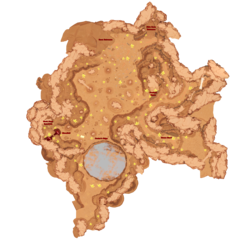

# Yet Another Aethus Walkthrough

Version 0.9.1, May 2026

## Administrivia



### Acknowledgements

Major thanks to **Euchale** from the Aethus Discord for [their guide and maps](https://steamcommunity.com/sharedfiles/filedetails/?id=3682938915), which helped a bunch with my first playthrough and filled in a few gaps in my notes when writing the first version of this walkthrough.

Also thanks to **Johan Andersson** from the Discord for collecting some icons and producing the beautiful area maps featured here. (I added locations, but he collected the images.)

### Version History

- v0.9, April 2026: first playthrough
- v0.9.1, May 2026: second playthrough, guide

### Errata

Things I'd like to clean up in a future pass.

- Maybe switch the order of Lambda and Kappa, since Lambda grants you log #17, but you don't get #16 until you visit the Undersea Dam Facility. On that front, you might do the Dam before you do the Fishing Hab; check the ordering of the clues for this.
- Might have missed a subgoal on [The Kappa Module](/aethus/quests/#the-kappa-module).
- Add the effects of Fatigue to the [Status Modifiers table](#status-modifiers).
- What happens if you don't make the run to Sigma in time?

### Game Introduction

This marks a significant departure for your humble walkthrough writer. Usually I spend my time replaying ancient games from my youth; *Aethus* is a modern game (released March 2026) that grabbed me by the collar and wouldn't let go until I'd finished my first playthrough. It's got both enough crunchy data to be worth collecting and an extremely compelling story that was worth writing about. And so here we are.

### Navigating

A few commands that aren't mentioned anywhere in the docs that are helpful to know:

- When you're selling items in the Trade Node, hold down `ctrl` to sell five units at a time, or `shift` to sell ten.

### Basic Tips

- If you're getting frustrated with some aspect of the game, explore the difficulty settings. You can change them at any time. As an example, some people report getting frustrated with how low your inventory weight limit is at first. Frankly, I find that sort of early-game frustration to be part of the experience and didn't want to change it, but I won't judge if you do.
  - For a more hardcore experience, turn on Negative Vitality Effects, which will start draining your abilities (including health) if you don't eat or drink. This forces you to think about One More Thing when you're on long mining runs and/or makes you return to home base more often.
  - For an easier experience, turn down Air Supply, Carry Weight, and Economy. You'll be able to mine for longer, carry more home, and get better prices on the market for your goods, all of which will help you progress faster.
- Read *everything* in as much detail as you can. Hover over items in your inventory and read the descriptions. Read the small print on the screens of terminals you interact with. Read the journal entries (maybe save these for once you're back in your Outpost).
- Whenever you run into a lab bench, seating area, etc. look *very* closely. Often times there will be small items scattered about that you can pick up by clicking on them. This might be a can of cola or food item, but it might also be things like Servomotors or other expensive crafting ingredients! These items are especially hard to spot, even on a suit scan, when they're sitting on a workbench or console that you can interact with. Click anything that looks suspiciously like a collectible!
- If you die, you drop all your items. (You can turn this off in Settings, if you want.) If you die, for example, by falling off the edge of the Lost World, the game will do its best to collect your items and place them in some *reachable* spot near where you died. It might take one or two board reloads before the cache of items shows up, though, so keep an eye on the compass and look for the little skull that indicates a cache of dropped items.
- Dismantling a Construction returns 100% of the material cost to your inventory. If you "construct" a "placeable" &ndash; this is how you can put a Jenkins up on a display shelf &ndash; "dismantling" it is how you return it to your inventory.
- Don't sleep on the [Customization Kiosk](/aethus/items/#customization-kiosk). Apart from customizing your appearance, you can use it to mark certain items as "do not pick this up". To do so, you have to bring one of the thing you want to ignore to the station.

### Status Modifiers

| Status | Why | Effect |
| --- | --- | --- |
| EM Interference | Walked through the EM field in Iota | -10% speed |
| Energized | 'Stamina' over 45%/60%/75% | +5%/10%/15% speed |
| Energy Boost | Ate Solazine Tablets |+10% speed for 60s|
| Exhausted | Ignored the 'Tired' warning |Dimmed vision; Consumables have -10% effect; -10% speed|
| Hydrated | 'Hydration' over 45%/60%/75% | +5/10/15 max oxygen |
| Mycelial Antigen | Used an Antigen injector | Immune to the effect of spores in Theta |
| Overencumbered | Carrying more than max* | Can't pick up anything else |
| Rested | Slept for a while | Consumables have +10% effect; +5% speed for 10m |
| Sugar Rush | Drank an ARCola | +10% speed for 10m |
| Suit Overcharge | Used a Suit Charger | +5%/10%/15% speed for 1/2/3m |
| Tipsy | Drank a Cactus Moonshine | Increases chances of mining gemstones from nodes? Makes the screen fuzzy. |
| Tired | Too long since you slept in a bed | None |
| Well-Fed | 'Nutrition' over 45%/60%/75% | +10%/20%/30% carry limit |
| Well-Rested | Slept for a while in a Welfare Habitat | Consumables have +20% effect; +10% speed for 10m |

\*: In order for this to happen, you need some other status effect that temporarily boosts your carrying capacity. Fill up your inventory before the boost goes away, and suddenly you're Overencumbered. 

## Walkthrough

### How to Make Money

**In the early game:** Mine as much Sandstone as you can. Put Sandstone (and Shards) in the [Stone Crusher](/aethus/items#stone-crusher) to convert it to [Solazine](/aethus/items#solazine) and [Kalynite Ore](/aethus/items#kalynite-ore). Put the Ore in the [Basic Smelter](/aethus/items#basic-smelter) to convert it to [Kalynite Bars](/aethus/items#kalynite-bar). Bring the Solazine and the Bars to the [Crafting Table](/aethus/items#crafting-bench) and make [Mining Explosives](/aethus/items#mining-explosives), which sell for $150 a pop.

**In the middle game:** First of all, sell [Deepstone](/aethus/items/#deepstone) by the ton. 50 units will make you the same $1500 that crafting ten Mining Explosives will.

Once you explore Lambda and find the Suit Upgrades that let you find Geodes as well as the plans for the [Prospecting Bench](/aethus/items#prospecting-bench), **geodes** of various types start to appear. Geodes will sell for 2x the price of a normal gemstone of the same variety, but you're better off bringing them to the Prospecting Bench and playing the minigame to convert them into gemstones. Even with "average" results you'll almost certainly get more than two gemstones, and once you get good at prospecting you're likely to get higher-quality ones, which means you'll come out ahead over selling the raw geode.

**In the late stages:** You don't really need credits at this point, but you also have plenty of things you can sell for cash if you're trying to buy an expensive blueprint.

### Prologue

The game itself starts with a tutorial phase. Our heroine and avatar, Maeve, is working late for her employer, the Astral Resource Corporation (or ARC), and as we open the game she's been dropped off inside a mining vein beneath the mining colony of Invermark. She's got her robot mining companion, Roland, floating alongside her. You can click on the transport that just dropped her off and hit the "Skip Prologue" button to jump straight to the surface of Aethus, but if this is your first time playing the game, I highly recommend you run through the tutorial to get the hang of things in a safe and easy environment. I'm also going to add a couple of lessons to this section that will be helpful through the rest of the game.

You'll get introduced to a number of basic game features here: the dialogue system where Maeve and Roland banter and talk about the plot; the fact that your path forward is usually lined with [Lightsticks](/aethus/items/#lightstick) (those glowing lanterns thrust into the ground); the general feel of what ARC's mechanical mining objects look like and how to interact with them; the fact that ARC uses a bunch of shitty, lowest-bidder crap that's broken half the time, and that you'll wind up having to fix it yourself.

Step up to the little platform and use the console there to open the gates to the mining claim. Use the left mouse button to interact with something, and the right mouse button (or ESC) to back out or stop interacting. Interaction happens in a little subwindow in the bottom-right corner where you'll see some information about the thing that you're interacting with, and usually one or two buttons you can click to proceed.

> Lesson #1: read EVERYTHING carefully. Even things like the ID number of a message are sometimes useful.

Whoops, that didn't work. Trying to open the gate prompts another round of dialogue, plus a new goal. All of your active goals will appear in a scrolling window in the upper-left corner of the HUD. In this case, you need to find another way in, and fortunately, you passed a little side passage that you didn't go down yet, so there's an obvious place to look. Spin your camera around (hold down the middle mouse button and spin, or use `Q` and `E` to rotate the camera) and look for that passage. Hint: there's a small crate sitting at the intersection, and the words "ACCESS SHAFT" painted on the wall.

At the end of the shaft is a platform, but there's a bunch of crap in your way. This is an excuse to teach you how to jump (`space`). On the platform is a [Quakemaker](/aethus/items/#quakemaker) (it's okay, you don't know what one of those is yet) and an elevator with a control console. Go ahead and take it down to the Access Shaft. Here you'll get interrupted for the first (of *many*) times by Trudy, your contact at ARC who has a habit of chiming in when she's least welcome.

As the shaft opens up, you'll see a big cliff off to your left. Note, at the top-center of your screen is a compass that tells you what direction you're facing; I'll be using those directions throughout this guide to help you find your way. In this case you're facing North and the cliff is West of you. Also in this case, the game will prevent you from jumping and/or falling to your death, but that definitely will not always be the case so don't count on it.

Anyway, do the actual tutorial here: learn how to use Roland's mining laser to break apart **Nodes** and collect the resources within. Roland's laser doesn't have a lot of power yet, but these nodes are pretty weak and should only take one or two shots to break apart. (I strongly suggest turning on "Hold-to-interact" from the options menu, which will fire Roland's laser repeatedly so long as you hold down the mouse button, rather than needing to click repeatedly. Be nice to your wrists, kids.) Roland will then use his Gravity Tether to grab the loose, valuable stones and drag them to you where they will go into your inventory (`tab`). If, for some reason, Roland fails to tether something for you, you can click on it to flip it towards yourself, or walk over it to pick it up.

Also worth noting: when you find a node, hover over it to get an idea of what might be inside if you blow it up. You'll learn to decode the little icons fast enough, but you can also peek at the [items page](/aethus/items) for pictures of all the icons and what they relate too. (Lots of spoilers on that page, of course, but you *are* reading a walkthrough.)

Turn the corner and you find your first gemstone: Sky Sapphires. Mostly these don't work any differently than other nodes, except you have to hit 'em a couple of times before they break. Roland will give you a bit of dialogue explaining this, and then Maeve will complain that it's like he's reading out the text of a tutorial, or something. Heh.

As you pick things up, the vital stats readout in the lower-left corner will increment to show you how much you're carrying (as well as your health and oxygen levels, but we don't have to worry about those just yet). For now, go ahead and pick up as much as you feel like, but you don't get to keep any of it anyway so don't stress too much once you get the hang of mining nodes.

Finally, you'll arrive at the detonation site. There's a bunch of vehicles and cargo containers strewn about, but most of them aren't of any use to you. Trudy rings in and asks you to do "a scan" to make sure the explosives are in the correct place, which sounds like an excuse to learn our next bit of control: Hit or hold down `X` to run a "suit scan". The longer you hold it down, the farther the range and the longer the results stay active on your screen. A couple of important things happen here:

- you get a compass overlay that shows N/S/E/W bearings
- purple dots appear over items of interest
- things you can interact with will be highlighted on the main display

> Lesson #2: Use the Suit Scan a *lot*. Like, all the time. It's really helpful for finding things you can interact with and/or take, especially tiny items that you might otherwise overlook.

Once you run the scan, Trudy gives you the code to a nearby lockbox with the arming key for the mining explosives. Now you get to practice manipulating inventory. Go find the crate and retrieve the key, then walk over to the explosives. Note that (a) your inventory automatically opens and (b) the thing that you can most usefully use here is highlighted in your inventory. Click the key to move it into place, then select "Arm Explosives".

> Lesson #3: Throughout the game, you will come across a number of storage crates that have numeric locks on them. The codes show up in a bunch of different places: some are in dialogue, some are found in log files or journal entries, some have to be pieced together from a couple of different clues. Most of the time you will have the ability to refer back to the source of a numeric clue, but it won't always be obvious, so you might want to write them down when they come up.

At this point, Roland figures out that you've done the bad thing, and Maeve determines that you need to hoof it back to the transport to get your datapad. Of course, Trudy is on point to "helpfully" start the detonation countdown, which is bad news for you. Go ahead and run as fast as you can back up the shaft towards the elevator, but don't stress too much about it: for the sake of the narrative, you're gonna get caught in the explosion whether you like it or not...

### The Surface: Getting Started

<figure>

<figcaption>Area Map (click to expand; quite large)</figcaption>
</figure>

You'll now see a short video showing Maeve's brave decision to strike out on her own in search of some extremely vague hints that her grandfather dropped at her about a valuable, hidden mining claim called "Kappa"... or something like that. With Roland's help, she mines the ARC data files for information about various low-cost mining claims that are up for sale, and then picks what she hopes is the right one. Blowing her life savings on the rights to the claim, transportation, and some basic starting supplies, our intrepid duo is off on the adventure of their lives... or, at least, 30–60 hours of computer game fun for you and me.

That drops you into the game at one end of a long canyon. The big open field in which you're going to build your brand, spanking-new Outpost is at the far end, but first the game has a few more tutorial bits for you. You can turn these off, by the way, in Settings.

When you reach the overlook of the big clearing, turn right and head off to the NE to some dialog about food. One thing to take note of right away: you now have vital stats gauges for Stamina, Nutrition, and Hydration. They're somewhere around the midpoint right now, but they fall pretty quickly and you may want to keep an eye on them. I recommend turning off "Negative Vitality Effects" in Settings, which will prevent any impact from neglecting your vitals but still allow you to reap the benefits of keeping them topped up. Or, leave it on, and be prepared to actively manage hunger and thirst more frequently.

Hover over the cacti along the path and you'll note that while most of them (the tall, straight ones) only produce [Biomass](/aethus/items/#biomass), some of them (the short, squat ones with flowers) will also produce [Cactus Fruit](/aethus/items/#cactus-fruit). This will be your first and only source of food for a little while, so start harvesting every cactus you can find that produces fruit. Eat one or two of them from your inventory (use the middle mouse button to "Use" things from your inventory) and watch the gauges go up. You will also probably notice a few [status indicators](#status-modifiers) over the lower-center part of the HUD. This is the bit where you get bonuses to things like oxygen capacity, movement speed, and weight limit if you keep your vital stats high (over 45%).

Once you hop down over the slightly-too-high drop you're out onto the open plain where we'll build our Outpost. Note that this is a one-way drop for now; you won't be able to jump this high for a long, long time. Go ahead and collect some more cactus fruit, and while you're at it, practice chopping down a Palm Tree or two. Palm Trees in particular tend to fall into a big clump of stuff; sometimes if you wade through it and kick the larger bits out of the way, there may be collectables hiding underneath. You may also notice that you pick up a few [Sandstone Shards](/aethus/items/#sandstone-shard) or [Regolith Chunks](/aethus/items/#regolith-chunk) along the way; it's useful to know that you can acquire these just by lasering the ground.

Take note of the steps up to the cave entrance to the NNE of you, but Roland will rightly steer you away from it for now. Instead, you finally arrive at your actual claim. Two things happen here: you get your first personal log (#1 – An Inauspicious Start) and your first mission goal, which is to collect [Scrap](/aethus/items/#metal-scrap) so that you can start building things.

Let's get the lay of the land. You should find a handful of new things to interact with: piles of Metal Scrap on the ground, the Palm Trees and Cacti you've already seen, plus Regolith Spires that you can shoot up for more raw materials. (Don't do that yet.) There's also something called a Small Outcrop, which if you hover over it, can apparently be blown up with a [Terraforming Charge (S)](/aethus/items/terraforming-charge). That sounds like fun! For now, though, take Roland's advice (and the tutorial's) and start lasering all the random scrap metal you see on the ground.

This part of the game can be a bit frustrating. It's not always super clear what bits of the discarded railings and whatnot that are lying around actually need to be shot in order to reveal collectable items. This won't be nearly as much of an issue once you start doing actual mining work, but for now you just have to try it and see.

Also notice that Roland's mining laser has an energy capacity. The targeting circle will turn red when he's almost out of power. It regenerates itself quickly enough, but you may have to wait for the circle to fill up if you're doing a lot of lasering. Later on we'll buy some upgrades that will help out.

One final tip here: don't laser stuff you don't intend to pick up right away. Anything you leave lying around has a chance of disappearing, eventually. Anything that disappears *quickly* probably wasn't anything you could collect in the first place, but if you want it you'd better pick it up. Incidentally, you can *drop* things from your inventory by hovering over a stack and hitting (`Esc`), which will produce a small cache on the ground. I still don't know whether these caches disappear on their own, but I've never had one do so as of yet.

Once you've picked up five or ten pieces of scrap, open the Build menu (`B`) and take a look at the various options. I really enjoy the fact that you can collect Biomass and Regolith and then turn around and do landscaping through the "Nature" submenu. But the thing you really need to make is a [Makeshift Forge](/aethus/items/#makeshift-forge), under "Facilities". As soon as you do that, Roland hands you the blueprint for a [Makeshift Habitat](/aethus/items/#makeshift-habitat) and encourages you to build one ASAP.

Being your first **production facility**, let's cover a few basics. To use the Forge, walk up next to it and then click on it. You'll see that it has an "inventory" window, which is where you'll put raw materials and collect the processed output. You'll also see all the "recipes" that it knows how to make, including a list of what materials you need to put in (and in what quantities) to produce what outputs. A few notes about production facilities:

- Production facilities will run automatically as soon as you feed them raw materials, presuming that there are any active recipes (see below) and there's enough raw materials to run them.
- Production facilities have infinite storage capacity. You can dump as much raw material into it as you want, and you're under no obligation to remove any outputs. However, things in the "output hopper" of a facility can't be used anywhere else; you will, eventually, have to manually move them into your inventory or into a storage unit first. (You *cannot* put output materials back into a facility once you've removed them, though.)
- Recipes can be enabled or disabled. If they're disabled, you can still dump raw materials into the facility, but the hotkey above will ignore them.
- If you put these tips together, you can (for example) use a Makeshift Forge as an infinite-capacity storage unit for Biomass.
- The hotkey `(F)` will automatically transfer any raw materials from your inventory that this facility knows how to use. You can also use the left mouse button to transfer objects one at a time, shift-left button to transfer half of whatever stack you're pointing at, or right button to transfer the entire stack.
- Production facilities learn how to make new things by acquiring **blueprints**. Some blueprints are found during your explorations; some are granted by the game in response to a condition, like advancing the story or finding a new raw material; some have to be purchased at the Trade Node. I'll try to point out when this happens, but you can look at the [crafting page](/crafting) for hints about what's coming in the future.

Take as much time as you like clearing out this area of scrap metal (you'll want it all gone eventually) and collecting cactus fruits and/or biomass, but don't wander too far away lest you confuse the order of events that the game wants you to take. Smelt a couple of [Building Materials](/aethus/items/#building-material) and then remove them from the forge. These are the basic, abstract material that will make up the foundation of your one-man mining village and get you through the first chunk of the game.

Now go back to Build Mode and build yourself a [Makeshift Habitat](/aethus/items/#makeshift-habitat), under "Structures". Play around with the build system for a few minutes; note that you can click on existing objects, which then gives you the option to move (`M`) it somewhere else, produce a duplicate (`U`) object (very useful for storage crates), or dismantle (`N`) it, which removes it from the world and refunds 100% of the construction cost back into your inventory. Note that if you dismantle a production facility that has materials in the hopper, the game will also try to move those items into your inventory, but will probably wind up leaving a small cache nearby with the overflow. Don't forget to hit (`B`) again to exit Build Mode.

Building a Habitat for yourself also prompts the game to give you the blueprint for your first item of furniture: a [Bed](/aethus/items/#bed). Build one of those, and you've got the extremely humble beginnings of an outpost to call your own. The game promptly gives you several new things to build, including a [Scrap Grill](/aethus/items/#scrap-grill) (under "Facilities") and a [Makeshift Crate](/aethus/items/#makeshift-crate) (under "Storage", a new category). Go ahead and do both of those things right now.

We already played with storage units a little bit in the tutorial. For now, pick up some Biomass, Metal Scrap, and Building Material from the Forge and dump them all into that new Makeshift Crate you just built. Isn't it nice to get some inventory room back?

Next we'll learn how to use the crafting interface. The Grill is a **crafting facility**; it contains a list of recipes of things it knows how to make from raw materials. Crafting facilities are similar to processing facilities in that they have infinite storage for their output and they learn how to make new things via the acquisition of blueprints (such as the recipe for [Grilled Cactus Fruit](/aethus/items/#grilled-cactus-fruit) that the game just gave you). Unlike processing facilities, crafting facilities don't have an input hopper for raw materials, and they won't make anything unless you explicitly ask them to. 

One nice difference about crafting facilities is that they know how to fetch raw materials out of your storage units for you. Unlike processing facilities, which demand that you manually feed them their input, you can walk up to a crafting facility empty-handed and say "There is Biomass and Cactus Fruit somewhere in my storage units; make me some Grilled Cactus Fruit" and it'll just do it. Give it a try. On the other hand, just like processing facilities, anything in the *output* hopper is unusable until you bring it into your inventory and/or store it in a storage unit. So you'll often find yourself in a situation where you're using a crafting facility and you want to make a thing but one of the ingredients is in the output hopper of *that same facility*, and the game will tell you it can't make it. You just have to pick the things up, first.

Note that crafting facilities have a "queue" of items that you've told them to make, so you can click the "Add to Queue" button a bunch of times (the queue holds ten items) and then walk away, and when you come back you've got a bunch of Grilled Cactus Fruit to eat. Ahh, that's better. Go ahead and fill up on that stuff; note that grilled fruits are slightly more nutritious than raw fruits. (Hover over them to see the specific effects, or read the [items page](/aethus/items/grilled-cactus-fruit) for spoilers.)

You may notice that there's also a recipe here for [Basic Mushroom Soup](/aethus/items/#mushroom-soup). This is a staple food item with much better nutritional value, but you can't make it just yet because you don't have either water or mushrooms.

Okay, off on our first adventure. Roland marked a bunch of new points of interest on our map, and the first one is right here, just to the NW of where we've been mucking around with scrap metal. Head over towards the Cave Entrance; if you spin around you'll see an icon on the compass that will help orient you, but you should also be able to spot it by the blue glowing plants near the cave mouth. Roland will instruct you to do a Suit Scan here, and Maeve will point out that this is where we'll start our underground exploration. But we're not quite ready for that yet.

> Lesson #4: Look at the Compass a lot. Like, all the time. The game marks all sorts of useful points of interest on it. Sometimes it will be harder to find the one you want, especially when several points "bunch up" because they're all in the same direction. But if you get used to navigating with the compass now, it will remain useful later on.

Stop number two is the freshwater "oasis", which is off to the SE. There's a bunch more metal scrap over here, which you can zap if you feel like it, and a bunch more outcrops of various sizes that we'll get to blow up later to make room for Progress(:tm:). Unfortunately, although the oasis does turn out to be freshwater, it's in desperate need of purification before a human can safely consume it. So we won't be able to harvest drinking water from here any time soon.

Just S of where you started building your outpost there's another ring of metal scrap to be picked up, along with – what's this? – a small storage crate? This is an important game lesson: wherever you find remnants of previous mining settlers, there's very likely to be storage boxes left lying around. Many will be full of useful items that you can scavenge; note that the light on top of this one is green, which means that it's not empty (white) and not completely full (red). In fact, it contains some [Bottled Water](/aethus/items/#bottled-water), a small [Terraforming Charge](/aethus/items/#terraforming-charge), and a pack of [Solazine Tablets](/aethus/items/#solazine-tablets). The latter are a short-term buff that make you move faster. The water does what you think it does, although it's also useful for making soup. And the Terraforming Charge is how we make outcrops go boom!

Also, by virtue of being out here on the surface, this crate has an additional use: you can pick it up in Build Mode and move it anywhere you want. You probably aren't exactly hurting for storage space at the moment, but you also don't really need to "stage" the things you collect out here on the surface, so the most useful place for it is next to your Habitat. Go into Build Mode, select the crate, hit `(M)` to move it, and then walk back to your Habitat and drop it somewhere. You could even dismantle your Makeshift Crate now if you wanted to.

It's probably getting on towards Dusk around now, which is a good time to head into your little Habitat and try out that Bed you built yourself. Sleep until Morning; note that sleeping makes Energy go up but Nutrition and Hydration go down. It also provides the "Rested" status, which makes you move faster for a while and also increases the effect of food and other consumables. They say breakfast is the most important meal of the day — in this game, it definitely pays to eat as soon as you get up to maximize the benefits!

Now let's tackle the last two spots on Roland's tour. Remember to use the compass to help orient yourself towards points of interest. Head off South across the surface until you find the giant crater. A suit scan doesn't even help, really. In fact, this crater was made by a meteorite, which will become much more interesting in a little while, but for now this is all we can do.

Turn West and you'll see a [Sun Shade](/aethus/items/#sun-shade) set up over a table. You'll hear the game start to chirp at you; this is a distinctive sound that indicates that there is a Datapad nearby with some plot information on it. In this case, it's a personal log from an unknown entity with the initials "T.L", journal entry number `0155F`, talking about how much they enjoy visiting the surface occasionally. In fact, if you walk around to the little stool that's there, you can click on it to sit down and enjoy the view for a moment yourself.

The other glowing thing on the table is a blueprint for a [Dew Catcher](/aethus/items/dew-catcher), which provides us our first opportunity to collect drinking water. There's also a bottle of water and a locked crate — in fact, the game gives us a new mission to unlock it.

> Lesson #5: Sometimes the stuff you see on furniture (tables and whatnot) is just decoration, but a lot of the time it's collectables that you can click on and pick up. In this case the water bottle is pretty obvious. Other times it will be stuff that blends in against computer consoles or workbenches or other things. Click on everything that looks even halfway suspicious, and use your Suit Scan to help ID stuff you can pick up.

Remember Lesson #1? Read everything closely and look for hints anywhere in the text. In this case, the code to the crate is the ID number of the journal entry, `0155`. Your reward is a *large* bottle of water, a [Nutrient Bar](/aethus/items/#nutrient-bar), and a *large* Terraforming Charge, for making *really big* outcrops go boom. We'll start playing with those soon, but for now let's finish up the tour.

Keep heading West and you should see the Bloodfall. Fortunately, a Suit Scan indicates that it isn't actually blood. If you tilt your camera up as far as it will go, you may notice a little cliff that overlooks the waterfall with a little wizard doll sitting on a table. That's a [Jenkins](/aethus/items/#jenkins); it's not the first one you'll collect, but it is the first one you get to see.

Okay, let's head back to camp. You might not be as obsessive as I am, but I like to pick up the Sun Shade and all the stuff underneath it and use Build Mode to walk it back towards my outpost. It just gives the place a little bit more of a "lived-in" feeling, y'know? If you don't care, you can recycle (dismantle) it into more Building Material, or just leave it where it is.

We'll also go ahead and make a couple of [Dew Catchers](/aethus/items/#dew-catcher) so we can start collecting water. Dew Catchers gather water vapor out of the air and make small [Bottles of Water](/aethus/items/#bottled-water) every 12 minutes or so. Their output hopper will only hold one bottle at a time, so you have to regularly go around and collect the water from them or they can't make any more. Also, you can (and definitely should) build more than one, but they must be spaced pretty far apart. For now, build one on either side of the entrance to the caves so they're easy enough to get to. Remember that you'll need Building Materials to construct them, and that means you have to take the Materials out of the Forge after it's done.

This nets you a new personal log milestone (#2 – One Small Step), which is a pretty good indicator that we're ready to move on. Head over to that cave entrance and boldly go where no one has gone before... or, at least, for quite a long time.

### The Outer Caverns

The first thing we learn upon entering the cave system is the fact that the air underground is toxic and unbreathable. Thus, we're reliant on the oxygen tanks that are included in our environment suit. You now need to start paying attention to the blue oxygen gauge in the vital signs area. So long as you're standing close to the cave entrance, it will stay full (and in fact will recharge if it's below 100%). Once you move into the caves, a sound will play to indicate that you're running on "suit air", and the meter will start to deplete. As Maeve tells you, you'll eventually need to upgrade your suit's capabilities in order to support longer dives; for now, keep things short and sweet and always, *always* keep an eye on your oxygen meter.

> Lesson #6: When Maeve or Roland tell you you're running out of air, *immediately* drop whatever you're doing and run to the nearest source of fresh air. Later in the game you'll be able to carry Oxygen Domes and/or Oxygen Injectors, which will provide short-term solutions to this problem.

The game does have a built-in safety: whenever you're down to 1/3 of your total capacity, either Roland or Maeve will pipe up and encourage you to find some fresh air soon. If you run out of air you start to **Suffocate**, and that means draining health very quickly. Hit zero health and you pass out, and Roland has to drag your body back to your Bed. To be fair, that's the only actual negative consequence; you can't really *die* in this game, you just wind up back home having dropped everything you were carrying. And even that last bit is a Setting that you can toggle. So don't stress too much about it, eh?

We're going to find a bunch of new things to mine and/or collect in here. The first are those blue glowing plants, called Glowtus. Zap one of those and you should pick up a [Glowtus Fruit](/aethus/items/#glowtus-fruit), which is a crafting ingredient. Now check out the storage crate that's just inside the caves. Inside there are two [Glowsticks](/aethus/items/#glowstick). Hmm... Glow-*tus*... Glow-*stick*... sounds very similar somehow. File that one away for later. There's also some more Metal Scrap here.

Further in you'll see some new Nodes, glowing sort of a red-brown color. These are Regolith Nodes. Zap them with Roland's mining laser and they produce [Regolith](/aethus/items/#regolith), [Sandstone](/aethus/items/#sandstone), and [Dust Rubies](/aethus/items/#dust-ruby). Regolith is an important building material; Sandstone is crucial for early-game crafting; and Dust Rubies are your first gemstone, which will be a source of credits. Finding them also grants you the ability to crush them into [Dust Ruby Powder](/aethus/items/#dust-ruby-powder), which is a super-important crafting ingredient, but one you won't need right away.

Make a couple of trips back and forth and get used to how fast your oxygen meter depletes; it should be around one point per second. Find the second storage crate straight ahead of you. Inside is another Terraforming Charge and an [RTG](/aethus/items/#rtg). What's an RTG? Well, it's a tiny nuclear reactor that can be used to power a habitat, which explains the powerful energy readings Roland's been noticing. Finding that thing grants you the blueprint for a [Basic Habitat](/aethus/items/#basic-habitat), which is the first real habitat building you get to construct, and it allows you to complete your current mission.

Dive a little further in from the storage crate where you found the RTG and you'll find another, larger crate that you can't interact with. But sitting on top of it is the blueprint for [45° Habitat Connectors](/aethus/items/#connector) and a chunk of [Solazine](/aethus/items/#solazine), which is another important crafting ingredient. Around the corner from that is another crate you *can* open, which has a small water bottle and a Medium-sized Terraforming Charge. Now that we've completed the set (and probably half-filled our inventory), let's head back to the surface.

In the Build menu under Structures you'll find the Basic Habitat. Go ahead and bring one of them up so you can see how large it is; you can always right-click to cancel. (They do require 20 Building Material, so you may need to make some more in the Forge first.) You may have some trouble finding somewhere legal to put it (blue glow), either because you're on top of some harvestable resources like a tree (purple glow) or because the spot just isn't legal (yellow glow). In that case, it's time to start blowing some stuff up!

Things like Palm Trees and Regolith Spires are easy; you can just blast them with Roland's mining laser and pick up the pieces. For the larger outcroppings, you'll need to toss a Terraforming Charge. The game will tell you when you hover over an outcropping what size of charge you should use to destroy it, which is very helpful. Go ahead and gather the two smalls and the medium charge, then take a look around the area in front of the cave entrance. I bet you can identify a couple of outcroppings that are in your way, or will be soon. In theory, the game will tell you that you might be able to place a charge between two outcroppings and have it blow up both at the same time, but in practice I never found two that were close enough, and was unwilling to waste charges to try.

To use a charge, open your inventory, hover over the item, and press a number key (1 through 0). That adds the item to the quick bar. Close your inventory and press the item number again (or click on the slot in the quick bar) to select it. Aim at the outcropping and hit `(R)` to throw. Stand back so you don't get hurt by the blast. Then go pick up a whole bunch of Regolith.

You may also have noticed that your Basic Habitat is raised up off the ground, as opposed to the Makeshift Habitat that wasn't. In order to even get into your new building, you'll need an [Access Platform](/aethus/items/#access-platform), which should now be available from the Build Menu under "Platforms". Access Platforms will reliably snap to Habitat entrances that have [Airlocks](/aethus/items/#airlock) on them; the Basic Habitat you just built comes with airlocks on both doors, so you don't need to build them separately.

Building an Access Platform will also grant you the blueprint for the [RTG](/aethus/items/#rtg), under "Power". Confusingly, the resource you need to build an RTG is *also* called an RTG, as you'll probably remember from having just picked one up in the Caves. Regardless, walk into your brand-new habitat and use Build Mode to construct yourself an RTG in one corner. Doing so grants you the blueprints to the [Standard Habitat](/aethus/items/#standard-habitat), the [Regolith Printer](/aethus/items/#regolith-printer), and the [Short Connector](/aethus/items/#connector). The latter is necessary because the outrigger legs on the Basic and Standard Habitats prevent you from butting two of them up against each other. Standard Habitats are relatively expensive (20 Building Material instead of five) but you're well within your rights to immediately build a Standard and then dismantle the Basic one because the Standard one is much roomier on the inside.

Go ahead and construct yourself a Regolith Printer. This is pretty much the end of your worries about where your Building Material is going to come from, because there is literally an infinite supply of Regolith on the surface and in the Outer Caves. You'll be swimming in too many Building Material before long, and won't ever look back. This also unlocks the blueprints for the [Stone Crusher](/aethus/items/#stone-crusher), [Basic Smelter](/aethus/items/#basic-smelter), and [Crafting Bench](/aethus/items/#crafting-bench), which form the first tier of materials processing capabilities. You should be able to build the Crusher right away (it only requires five Building Material), but the Smelter requires a bunch of Solazine that you probably haven't collected and the Crafting Bench requires Kalynite Bars, which you need the Smelter to make.

Well, that sounds like a tech tree to start filling out, doesn't it? Go ahead and fill the Crusher and Printer with whatever raw materials you have kicking around, namely, Sandstone and any Dust Rubies you've managed to collect. Looking a ways into the future, [Dust Rubies](/aethus/items/#dust-ruby) are gemstones, and gemstones can be sold to collect credits. However, [Dust Ruby Powder](/aethus/items/#dust-ruby-powder), which is what the crusher produces, sells for the same rate and is *also* a useful crafting material, so there's no harm in putting Rubies through the Crusher. Also note that when the Crusher processes Sandstone it produces Regolith, which you'll then want to put in the Printer, and Solazine, which you need to produce the Basic Smelter.

If it's getting late, it may be time for another nap before we head back into the caves. To be fair, you don't really have to monitor your fatigue that much; eventually the game will tell you when it's been too long since you've slept, and only after that will it start to force you into bed. But you may as well do it while it's convenient and fill up on food afterwards for the faster movement, higher oxygen capacity, and larger weight allowance. Besides, it's slightly harder to navigate the cave system when it's dark out.

For your next run into the caves, head in (SW) to the second crate, then turn left (SE) and follow the narrow seam to the back. There you'll find a drill site in reasonably good shape. Roland encourages you to scavenge for supplies, which you should definitely do, but watch your oxygen levels; it's easy to get stuck here, and it's a long way back to the entrance. But you can find the blueprint for a [Biomass Generator](/aethus/items/#biomass-generator), which is your only option for adding more power capacity to your outpost for now. The storage crate has another small Terraforming Charge and a new gemstone, called [Pangimony](/aethus/items/#pangimony). But the most interesting thing is the drilling platform, which has an actual, operational Basic Smelter on it (from which you can scavenge a Kalynite Ore) and an automated mining drill. More on that in a second; in the meantime, activate the computer console nearby and you can read another log entry (`#0009N`) from one Tanya Li, who I bet is the same T.L. that we read about earlier. Her log entry — wait until you get back to the entrance to review it, don't waste air — says that the way deeper into the caves is on the North side, which is the opposite of where we are now. So we'll check that out next... and Roland will remind us to do so if we forget.

The drill itself seems to require a couple of parts to be useful. You'll finding automated resource collection objects like this throughout the game; mining drills like this one early on, and mining lasers later. They all require some sort of object in order to operate, either a [Drill Bit](/aethus/items/#drill-bit) or a [Focusing Lens](/aethus/items/#focusing-lens) respectively. You also have the option to add a [Cargo Drone](/aethus/items/#cargo-drone) to them, which will allow them to transport the mined materials directly to your Outpost without you having to go and collect them. But none of that is directly relevant or possible at the moment; we'll come back to it when it is.

If you want to make another run, drop the heavy stuff (regolith, sandstone) into the small crate right by the cave entrance first to give yourself some more room. This is called "staging", and you'll be doing it a lot as the game goes forward. The vast majority of the time, the game gives you helpful storage containers (and usually quite large ones) in useful places, usually near an oxygen source. This allows you to go out on a mining run, collect a bunch of material, bring it back to the storage container, fill up on oxygen, and turn around and do it again. Of course, eventually you fill the storage container, and then you have to make multiple trips back and forth because your suit can only hold so much. But it's usually a lot easier (if a little tedious) to make three trips to your staging point than it is to only be able to do one mining run at a time before returning all the way back to your outpost.

You might also want to laser a bunch of the scrap that's lying around in here, not because you need the raw materials, but because it gets in the way and it makes navigation easier if it's gone.

Your next dive is SW to the second crate, then turn right (NW). You'll find a little pool with a tiny island in the middle. There's a blueprint for some decorative objects (the Drink Can and Can Stack) there, and if you go past it you'll find a small crate with two Oxygen Domes. In that same vicinity is a workpad with another journal entry, and beyond that in the lake is an old [Water Pump](/aethus/items/#water-pump) and purifier; this one's busted, but you can collect the blueprint for building your own. Unfortunately, it requires materials that you won't be able to produce for a long time, but it will be super helpful once you can.

> Engineering Log `12-OC`, Frank Hoffman, Delta engineer — Tanya ordered me to junk the water pump for some reason, but I left the schematics on top just in case...

Just W of the lake you'll find a rockfall, which is the tricky way forward that was hinted at in the journal, and beyond it, what looks like an ARC-standard mining habitat. You get a bit of dialog as well as a new personal log entry (#3 – Cave-In) and some updated mission goals. But you're probably out of air, so run back to the entrance and read the journal entries at your leisure. Make sure you find the rockfall before you do anything else, though.

That said, feel free to head back to base whenever you need or want to. Getting used to the flow of diving the caves for a while, then heading back to manage your processing facilities and craft new stuff is part of the fun of this game, so do it at whatever pace makes sense to you. There is no time limit, so you can spend as long as you like puttering around, tweaking the layout of your outpost, or decorating and landscaping to your heart's content. (Don't forget to collect the Bottled Water out of your Dew Collectors, too!)

Once you find the rockfall, it's time to make some updates to your Outpost. Crushing enough Sandstone to make five Solazine means that you can make a [Basic Smelter](/aethus/items/#basic-smelter). Your reward here is (1) a better rate of return on converting Metal Scrap into Basic Materials (2) the freedom to tear down your Makeshift Forge and stop feeding Biomass to it (3) the ability to produce Kalynite Bars from Kalynite Ore, which your Stone Crusher has been producing for you. And two bars is enough to build your [Crafting Bench](/aethus/items/#crafting-bench). Now we're *really* cooking with gas. Uh, I mean, nuclear power.

Right off the bat you get a whole bunch of new goodies that you can make:

- *Glowsticks*, which it turns out are in fact made from Glowtus Fruit. We've already seen these, and unfortunately they're kind of useless.
- *Mining Explosives*, which are the thing Roland told us we need to get through the rockfall.
- *Small Terraforming Charges*, so we can clear more land.
- *Kalynite Drill Bits*, which sounds like the thing we need to enable that automated drill we found in the caves.
- *Kalynite Frames*, a more advanced crafting material.
- *Basic Electronics*, same.

Some of these items require things we don't have yet, namely [Silica](/aethus/items/#silica) and [Oxite](/aethus/items/#oxite). We'll be on the lookout for them. And remember that, like all crafting facilities, the Crafting Bench can pull what it needs from your storage containers. So if you haven't already started a collection of Small Crates, now's a good time to do it. (Seriously, all they cost is a couple of Building Materials each, and I bet you already have tons of those.)

Again, if you haven't gone in and found the rockfall yet, do that now, just so you don't mess up the story order — it's not super-important, but this way you get to hear all the fun dialogue. Once you've done that, produce at least two Mining Explosives, and let's go take out that rockfall.

### Facility Alpha

It's not impossible to clear enough rock with one toss for you to be able to pass through the rockfall, but it's more likely to take two or three sets of Explosives to make it happen. Roland will identify the [Silica](/aethus/items/#silica) that you find and inform you that you're going to need to build a [Trade Node](/aethus/items/#trade-node) in order to connect to the ARC network so you can sell all the shiny objects you're finding and earn some credits. That's the only route to buying upgrades, which is how you get more powerful mining lasers for Roland and larger oxygen tanks for Maeve.

On the other side of the rockfall you will quickly find a code-locked crate with a datapad on top of it. The datapad contains a short journal entry from Ms. Li again, who seems determined to blow up *something* with a bunch of Mining Explosives. Sure enough, if you were to open the crate that's right here, you'd find three such explosives and a Terraforming Charge. You can't do that, though, because the hint that tells you the code that opens this crate (`7878`) doesn't appear for quite some time... at which point, the contents of this crate aren't much of a reward. They're far more useful to you right now. But this is the joy of using a walkthrough, heh.

Again, you're operating on limited air here, so run SW as fast as you can and circle around to find the entry door to the mining habitat. (I'm calling it Facility Alpha, for reasons that will become clear shortly, but the game doesn't give it an official name.) The excellent news here is that the habitat has working airlocks and is pressurized, meaning you can recover oxygen in here. In fact... this place is really well-kitted out, and there's a functional generator and everything. I tend to agree with Roland here; this much luck is a little too creepy to be celebrated. You do get a new personal log (#4 – Clifftop Living) though.

Poke around the Habitat at your leisure. There's a working Regolith Printer in one corner, in case you want to haul fewer raw materials and more finished products back to your base. There's also a working Crafting Bench. I never found it particularly useful to be able to craft things inside the caves despite the abundance of raw material because you have to bring ingredients with you (or make them on the spot). But maybe you will? Opposite those on a shelf, you'll find a Nutrient Bar, a [Cargo Drone](/aethus/items/#cargo-drone) that will become super important shortly, and a workpad with a journal entry indicating a bunch of new incoming staff. Ncuti Sinclair and Caleb Vihaan are two names that you should remember for the sake of the story, but more intriguing is the fact that there appear to be several facilities in this complex, and they're all named after Greek letters. (Theta is eighth and Lambda eleventh, in case you were wondering. But Alpha is first, which is why I call this habitat Alpha.)

Other things you can scavenge here: another Mining Explosive (on the shelf), a Kalynite Frame (in the locker), an Oxygen Dome (on the dining table), an [ARC credit chip](/aethus/items/#arc-credit-chip), and one piece of [Basic Electronics](/aethus/items/#basic-electronics) (in the lockbox on the table). There are also two sets of Bunk Beds (in which you can sleep, if you don't want to return to your outpost for some reason) and a [Suit Charger](/aethus/items/#suit-charger) (which provides a short-term speed boost).

Just out the side door is your first Character Customization blueprint, which will allow you to turn your suit (or Roland's chassis) Virtus Yellow. In order to do that, though, you need to build a [Customization Kiosk](/aethus/items/#customization-kiosk) back at your outpost.

Also on this side of Alpha you'll find two enormous Storage Containers, which make amazing staging depots for mining runs (600kg capacity!), a smaller crate, and the plans for a [Medium Crate](/aethus/items/#medium-crate), which increases your storage capacity back home. One of the Containers has two Mining Explosives in it, and the Crate holds a [Health Injector](/aethus/items/#injector).

Next up you'll find an elevator, but you'll also find a breathtaking view (Log #5 – Powering Up) that looks out over a huge crater... so huge, in fact, that it appears to be the same huge crater you discovered on the surface. Although Maeve says she can't see through the dust, if you're here in the daytime you ought to be able to make out another mining habitat deep down in the crater. But this elevator that could take us part of the way down is broken; looks like it needs a [Power Cell](/aethus/items/#power-cell) to get it moving again.

You may also happen to peek down to towards the bottom of the elevator shaft, where you'll be able to see not just another habitat (we'll call that Facility Beta) but another automated mining drill behind it. All of that is very exciting, but it's going to take us some significant upgrades to get there, and that means we need to do some serious mining *and* get back onto ARC's trade network to boot.

Time to head back home. However, before you go running back through the rockfall, go out the front door of Alpha and turn NNE. Is that... another cave entrance? You bet it is. It's both an air supply and a shortcut back to your facility so you don't have to go through the Outer Caverns anymore. Resist the temptation to drop the Cargo Drone you found into the automated drill on the Outer Caverns, at least for now; we have more important things to do with it, and until you can build a [Cargo Bay](/aethus/items/#cargo-bay) the drone won't do you any good in a drill anyway.

Your next goal is to build yourself a [Trade Node](/aethus/items/#trade-node) in order to interface with the aforementioned trade network. That requires two [Basic Electronics](/aethus/items/#basic-electronics) from the Crafting Bench, which costs you 10 Silica. You should have found one Electronics board in Alpha, and accumulated at least 10 Silica from blowing up the rockfall, so go practice crafting for a bit and then build yourself a Trade Node. Surprise! You *also* need a [Comms Antenna](/aethus/items/#comms-antenna), but the game didn't give you the blueprint for that until after you build the Trade Node. Looks like you need some more Basic Electronics, and that means you need some more Silica... and that means we're headed back underground.

Your primary targets should be white Kalynite Nodes and (if you can find any close to Alpha) light-blue Kaloxite Nodes. These nodes are a lot hardier than the orange Regolith Nodes; they'll take everything Roland's got in terms of power to crack them open. If you're persistent (and use hold-to-interact mode instead of click-to-interact mode) you *should* be able to open them up and start collecting Silica (and other tasty raw materials), but if not, you can always try burning some Mining Explosives. Just remember to head back to Alpha (or the cave entrance) to refill your air tanks. And don't forget to take advantage of the Suit Charger inside Alpha, which will give you a temporary speed boost.

Whenever you get full or close to full on carrying capacity, dump everything into the storage containers outside Alpha and keep going. This sort of staging also provides you a method of sorting: when you're ready to start ferrying stuff back to your Outpost, you can pick and choose higher-priority objects. Maybe you want to bring high-value gemstones first and sell them off for credits as quickly as possible. Or maybe you want to bring the heavy, low-value raw stone back first so that you can fire up your production facilities and start making more interesting materials. Up to you; either way, it's all valuable stuff at the moment. Once you have enough Silica to finish up your crafting, head back to base.

Building the Comms Antenna immediately connects you to the ARC network... and who's that extremely bored voice on the other end of the line? Why, it's our Best Friend Trudy... our former ARC supervisor, and now apparently our liaison on the Trade Node. Great.

To be fair, Trudy does you a solid in granting you 500 market credits, which is enough to buy your first upgrade: **Mining Laser Crystal 1**, which doubles the power of Roland's laser and makes it much easier to cut through the Nodes you found outside Alpha. You also get a plot hook involving a robot uprising from a hundred years ago that resulted in the death and destruction of an entire megacorp, which seems like an awfully big deal for Roland to be joking about.

Unfortunately, we've only unlocked half of the Trade Node. We can purchase Upgrades, but without the Market, we aren't able to buy or sell anything. To do that, we'll need to build a [Drone Pod](/aethus/items/#drone-pod) and fit it with a [Cargo Drone](/aethus/items/#cargo-drone). We found a drone kicking around in Alpha, forging Kalynite Bars and Building Materials is second nature now, so all we need is... some more [Basic Electronics](/aethus/items/#basic-electronics). Yup. That figures.

Time for another mining dive. You should be able to track down a few more nodes and gather some more materials. The main area you want to start exploring is straight out the front door of Alpha and down the hill, heading mostly NW. So if you get lost, say because you're pivoting the camera around, use the compass at the top of the screen to orient yourself SE and run for Alpha. (It's listed on the compass only as "Habitat", but you may also see the ladder icon and "Elevator" near it.)

Heed Roland's warning about the steamy pools along the slope; they will damage you if you walk into one of them. Not badly, but enough that you shouldn't stand still if you accidentally step in one. Also, don't miss the sprawling purple [Korvo Leaves](/aethus/items/#korvo-leaves) floating on the surface of the water. When you're lucky enough to crack your first Kaloxite Node and collect some [Oxite](/aethus/items/#oxite), Roland will pop up again and inform you that you need Oxite to craft Oxygen Domes.

At last, once you build the Drone Pod, you get a new Personal Log (#6 – Delving Deeper). Trudy pings in to introduce you to their Resource Acquisition Partnership Program, which is a fancy way of saying that you're going to be gated off from buying more expensive things until your total spend at the Market hits a certain level. That's right ­– *selling* things to ARC gets you credits but doesn't advance your RAPP rating, only *buying* things from them does.

Poke around at the upgrades and market items that are available to you. Pretty much all of the upgrades are useful and you'll want them all eventually, but you won't really be able to dive any deeper into the Caverns until you add to your Oxygen capacity and/or consumption rate. **Air Tank Expansion 1**, **Storage Expansion 1**, and **Oxygen Filters 1** ought to be your first few targets. On the market side, the upgrade from the Scrap Grill to a [Cooking Station](/aethus/items/#cooking-station) might not be your highest priority, but it sets you up with the ability to make much more interesting (and nutritious) food for the rest of the game. The [Locker](/aethus/items/#locker) is a nice upgrade over the Medium Crate, for those of you obsessed with organizing your storage. [Oxygen Domes](/aethus/items/#oxygen-dome) we've previously discussed, and you'll eventually need a [Power Cell](/aethus/items/#power-cell) to reactivate the elevator between Alpha and Beta, but blueprints for both of these are discoverable in-game very shortly, so I wouldn't prioritize purchasing either of them.

On the selling side, you may notice that you have multiple inventory slots for the same type of gemstone. Gems come in three flavors of quality: normal, superior, and flawless. Higher-quality gemstones sell for proportionately larger amounts of money on the market. When in doubt, consult the [Items](/aethus/items/) page for my advice on which gems you should sell and which ones you should keep, but for now you should definitely sell any Pangimony you find; higher-quality Dust Rubies should be sold directly, and low-quality ones ground into Powder.

You may be wondering whether there are any good items you can craft that will sell well on the market. I have good news for you: Sandstone, by itself and in sufficient quantities, can be converted into Mining Explosives, which sell for $150 each. It's pretty easy:

- Put 10 Sandstone into the Stone Crusher and get 2 Kalynite Ore and 2 Solazine out.
- Put 2 Kalynite Ore into the Basic Smelter and get 1 Kalynite Bar out.
- Bring 1 Kalynite Bar and 2 Solazine to the Crafting Bench to make 1 Mining Explosive.
- Sell the Mining Explosives at the Trade Node. Pure profit!

Gemstones sell for more cash (up to $375 if you find flawless Pangimony), but you can basically print as much money as you want by turning Sandstone into Mining Explosives. Also don't forget to sell your [ARC Credit Chips](/aethus/items/#arc-credit-chip); they don't have any other purpose but to be turned into cash.

Since you're probably heading back into the caverns to do some more mining, here's a few more tips:

- Don't worry about the elevator for now, just make your way down the gently sloping hill to the NW of Alpha.
- Some mining nodes are larger, and require two (or even three) blasts to completely break them up. These tend to have diminishing returns, i.e. the second blast doesn't produce as much as the first one did.
- Roland's gravity tethers sometimes miss things that are underwater. If you break up a node in one of the little pools, you might see stuff sitting under the surface. You can click on individual items to hop them closer to you.
- If you see a rocky "nest", check it for eggs. These will become useful shortly. The first time you find one, you'll also unlock a recipe for [Korvo-Spiced (Scrambled) Eggs](/aethus/items/#korvo-spiced-eggs), but you can't actually cook that without a full-fledged [Cooking Station](/aethus/items/#cooking-station).
- When you're interacting with a storage unit, press `(ctrl-F)` to dump everything in your inventory into storage, or `(F)` to only dump things that are already there. Likewise, `(shift-F)` will pick up everything in the storage unit (or, at least, as much as you can carry). Mastering these will help you stage stuff and manage your inventory much more quickly. If you're carrying utility items like Oxygen Domes that you want to keep on you while mining, add them to your Hot Bar (mouse over them and press a number key to pick a slot) and they'll be ignored by the `F` commands.
- If you get into Health trouble, your screen may dim, which will make it harder to see where you're going. Again, just point yourself SE and head for Alpha. Health recovers quickly enough once you're standing around in an oxygenated area.

Eventually, you'll clear out most of what you can easily spot on the hill, and you'll get deep enough that Maeve will notice the air quality getting even worse. At this point, your oxygen depletes *twice as fast* as it did higher up; you'll need to purchase Oxygen Filter upgrades to reverse that trend. Maeve will also notice something that looks like an oxygen dome further down the hill. Your next goal is to make it all the way to that dome. You'll need at least the first Air Tank upgrade; you don't *need* the Oxygen Filter upgrade just to make it here, but you'll want it soon enough regardless. Also, don't do any mining the first time you strike out for the Dome – just plan on making it that far and refilling your air tank before you decide what to do next.

There's a blueprint on the table, and sure enough, it's the recipe for the [Power Cell](/aethus/items/#power-cell) that you need to start the elevator over by Alpha. You'll also pick up a Kalynite Drill Bit that will fit nicely in either of the two drills we've seen so far (and there's a third, if you look down over the cliff edge from here), and a Large Terraforming Charge for clearing the surface a bit.

Just, whatever you do... don't disable the atmosphere generator. You need that air, eh?

I don't recommend going any further West from here; it is *possible* to pass over the waterfall, but you don't need to explore that area yet.

Feel free to poke around a bit, but stay close to the dome. As I said before, your oxygen now depletes *two points* per second as opposed to one. On the other hand, there are some hot springs SE of the generator where you may find a new type of node down here: red Dust Ruby nodes that produce a higher proportion of gemstones.

Regardless, at some point you'll want to get out of here (and maybe go craft that Power Cell); once again, I recommend not trying to mine anything, just focus on transiting from one safe area to the next. Point yourself NE, head through the narrow crevasse between the wall and an outcropping, and then run up the hill to Alpha, turning E and then SE as you go.

You can check the crafting recipe for the [Power Cell](/aethus/items/#power-cell) at any Crafting Bench (like, say, the one in Alpha), but here it is anyway: two [Kalynite Frames](/aethus/items/#kalynite-frame), which require some [Oxite](/aethus/items/#oxite) to craft, one Basic Electronics, and some Solazine.

### Facility Beta

At the bottom of the elevator, you've got some new territory to explore, plus a whole Habitat (hereafter Facility Beta, for the obvious reason) to check out. You already bought the Oxygen Filters upgrade, right? So your oxygen shouldn't be depleting so quickly anymore; just the usual one point per tick. But what's this? The door to Beta won't open; the [Servomotor](/aethus/items/#servomotor) needs to be replaced. Well, that's a bummer. Not only do we not know how to craft those, we don't even have the right equipment; we'll have to purchase the blueprint for the [Electronics Workbench](/aethus/items/#electronics-workbench) at the Trade Node and then craft a Servomotor there. (Personal Log #7 – Mechanic Required)

A word of advice: when you're cruising through the Market looking for blueprints that you might buy, take a close look at the crafting and power requirements first. It sucks to spend lots of credits on an advanced piece of equipment that you can't even build because you don't have access to the crafting materials yet, or don't have enough unclaimed base power to activate it.

The crate right in front of Beta contains an Oxygen Dome and two Kaloxite Ore; the crate on the opposite of the path is propping up the blueprint for Oxygen Domes, so now you can make your own as well! Before you go exploring too far, remember that you have to take the elevator back up to Alpha to fix oxygen again, so leave some extra time to fumble with the controls. (You thought going in and out the front door to Alpha was annoying, wait 'til you're trying to trigger the elevator with only 20 oxygen left.)

But it's worth your time to spin around to the backside of Beta, where you'll find another automated mining drill, the "Black trim" customization blueprint, and probably some more nodes. Unfortunately this drill requires a [Meteorite Drill Bit](/aethus/items/#drill-bit); apart from the fact that we haven't even seen Meteorite Ore yet or know that it exists, you can probably guess that once we get down into the aptly named "Meteorite Crater", we might find some there. This also triggers the "Strike the Earth" mission, which asks you to slot an appropriate drill bit into one of the drills we've seen so far. The only one we have (or know how to make) so far is a Kalynite bit, which slots into the drill in the Outer Caverns, so I suppose we'll do that for now.

One more thing to point out: If you stand on the elevator platform and look West, you'll be able to spot the waterfall and the atmosphere generator that stood at the bottom of the hill running down from Alpha. You can also see that the Hot Springs region that we discovered earlier connects all the way through to Beta and the foot of the elevator, and that there's a Sun Shade kicking around in the middle there with some stuff near it. Let's check that out now. It's a bit of a jumping challenge to navigate there from Beta, but it's shorter; or you can take the long way around via the generator and then work your way back.

Either way, when you arrive, you spot a giant land bridge that takes you to another cliff on the other side of the crater. Unfortunately the bridge is very, very not whole anymore. Under the nearby sun shade you'll find a workpad with a journal entry containing a conversation between an engineer named Yemi Randall and someone named Alice, talking about how there was a bunch of material being shipped "up from Delta" and over this bridge. I wonder if this was what Li was trying to blow up with all those Mining Explosives earlier? Seems like she was a fan of the "scorched earth" policy, although it's very much not clear why she was trying to close off her tracks or prevent anyone from following her. More importantly, it seems like there's a Facility Delta – probably down in that crater – that we'll want to find next.

The blueprint is for some miscellaneous Natural decorations that you can create if you want to use up some Regolith on something other than Building Materials.

At some point, there are several things that might happen when you're hanging out at your Outpost:

- Trudy will interrupt you to remind you about the RAPP and encourage you to reach Level Two, at which point she'll start giving you fetch quests. Hooray. Actually, you don't have to reach Level Two; make another mining run or two and she'll start offering you fetch quests anyway. The first one ("Heavy Metal") is easy: make three Kalynite Frames and deliver them to the Trade Node.
- You experience an earthquake! Don't be alarmed, this is actually a good thing. It means that all of the underground areas have had their resource nodes randomized and regenerated. So any area that you already cleaned out will suddenly be full of nodes again! They happen at random, and only when you're in your outpost, so it's a good reason to occasionally spend some time puttering around, putting up new buildings, or just adding decoration.
- You run out of base power. The RTG you started with is great, but it won't carry you forever. By the time you get around to building the Electronics Workbench (or, let's be honest, the Cooking Station) you're probably past its capacity. That means you're going to find another source of power, and for now that probably means Generators. Note that the available power capacity of your outpost is always available in Build Mode in the bottom-right corner.
- You run out of raw materials for something, most likely Solazine or Oxite. Or you just plain run out of credits. Time to do some more mining! More mining means more raw materials, which means more things you can process, which means more things you can craft, which means more things you can sell. That's how the game works! It is a mining simulator, after all.

All that being said, this is a pretty good spot to get "stuck". You've got some time to get comfortable with the mining, figure out what nodes to prioritize, learn how to handle long mining runs, and make a bunch of money. If an earthquake rolls through, you can go back to the beginning and start over. Meanwhile, you can start buying some upgrades for your outpost, and even a few tchotchkes with which to pretty the place up a bit and make it feel like home. Everything you need to be successful is either here in the previous set of paragraphs, in the in-game journal or tutorials, or you've already figured it out through practice.

(Oh, and by the way, you should go drop off that Kalynite Drill Bit we found in the automated drill in the Outer Caverns, too.)

Eventually, you'll reach RAPP-1 and make enough money to buy the blueprints for the [Electronics Workbench](/aethus/items/#electronics-workbench). Congratulations! This is a major upgrade in the set of things you can craft! Okay, next up is to make a [Servomotor](/aethus/items/#servomotor), so let's take a look at that recipe:

- two [Basic Electronics](/aethus/items/#basic-electronics), cool, we know how to make those
- two [Kalynite Frame](/aethus/items/#kalynite-frame), okay, a little tougher, but no problem
- three [Microcircuits](/aethus/items/#microcircuits)

Hm, how do we make Microcircuits? Well, at least the recipe comes for free with the Workbench. All we need is

- two [Dust Ruby Powders](/aethus/items/#dust-ruby-powder); good thing we've been crushing Dust Rubies, eh?
- one [Gold Bar](/aethus/items/#gold-bar).

**GOLD?!** We haven't even found gold yet! \[*sigh*] Well, in case it isn't obvious, we're going to have to push forward beyond Beta, even without being able to open the door. And I'll tell you now, you're going to want most of the first-tier upgrades (cost below $10k) before you do that. Worse, you're going to need yet another piece of equipment (the [Standard Smelter](/aethus/items/#standard-smelter)) before you can actually forge Gold Bars yourself. So it's time to dig in (hah) and do some serious mining for cash.

Since we're looking for ways to make money, let's talk about Trudy's fetch quests for a second. In case you haven't noticed from Maeve's tone, the game is definitely setting you up not to trust Trudy (and ARC more broadly), and that is definitely the correct attitude to take. You may be thinking, _Should I really be doing side quests for these people?_ A perfectly reasonable question. As far as I know, there is no effect on the story if you do them or don't; they're just a way to make some extra cash, which you definitely need. That first quest (three Kalynite Bars) nets you $2000, which is a substantial sum. But if you want to take the role-playing way out and not do them out of spite, I applaud your choices.

By the way, the _second_ fetch quest (which is available almost immediately after you complete the first) is to track down ten of those [Mysterious Eggs](/aethus/items/#mysterious-egg), which is a good excuse to make you run around Alpha and Beta for a good long while. (If you use your Suit Scan to find them, and you should, they show up outlined in red, like Cave Mushrooms do. In fact, anything that you *gather* rather than *mine* will show up this way.)

### Meteor Crater

Okay, eventually you're going to want to push past Beta and down into the edges of the Meteor Crater. Bring some Oxygen Domes with you just in case.

First, head down the elevator and follow the platforms straight past Beta, circle around the hot spring right in front of you, and continue down over a land bridge to a plateau. Don't get distracted by Roland pointing out that there's another facility down here; your oxygen usage is gonna jump again (1.5 units per tick, presuming you have the first level of Oxygen Filter upgrades), so you don't have a ton of time. Hopefully you'll find a Gold Node pretty quickly. Mine some of that and the game hands you the "recipe" for processing Gold Ore in the Smelter. (Usually these things just show up when you present the correct raw materials to the correct processing facility.) Gold Nodes also sometimes produce Sky Sapphires, which are a new gemstone you can sell.

But as I said before, you'll need the next-level [Standard Smelter](/aethus/items/#standard-smelter) before you can make Gold Bars; the Basic Smelter can't handle gold (or anything more interesting). Fortunately the blueprint for the Standard Smelter is only $750; unfortunately, you're probably going to have to add some more Power capacity before you can build one. And remember you need *three* Microcircuits which means you need three Gold Bars, and that means *nine* Gold Ore. No instant gratification here!

Feel free to explore this little plateau for a bit. Apart from Gold Nodes, you may also find [Sugarplants](/aethus/items/#sugarplant) for the first time. This is a red-orange stalk that grows about as tall as you; again, use your Suit Scan to find it and look for the red outline. Also take a peek off the SSE side of the plateau and get a good look at the *much larger* mining facility that awaits you a little further in; this is Facility Delta. We'll head that way in a little bit, but not just yet.

On the W side of the plateau is an absolutely *enormous* tree, and around the back side of that is a large storage crate and another Sun Shade. Here you'll find a [Meteorite Drill Bit](/aethus/items/#drill-bit) and... the blueprint for the [Sun Shade](/aethus/items/#sun-shade). This run is a stretch for your oxygen supply, though, so get in, get the stuff, and get out.

There are actually two ways down from Beta into the Lower Cavern; the land bridge I already mentioned, and a slope that runs off to the West from there; look for the Lightstick. It can be pretty tricky to find the ramp when you're coming back up if it's night time, so I recommend doing this run during the day or using Smart Glowsticks to mark your place.

If you take that ramp down and then turn North at the bottom, you'll find that area of hot springs with another mining drill and a waterfall that we saw before when we were at the atmosphere generator (or the nearby sun shade). And, in fact, there's another already-powered atmosphere generator here, just on the back side of the drill. So this is another spot where I recommend you make a break for the generator and enable it, then use that as a base where you can top up on air while you explore the area at your leisure.

First, the drill; this one takes a [Meteorite Drill Bit](/aethus/items/#drill-bit). Good thing we just found one of those, eh? The difference between this drill and the one outside Beta is that this one produces Kaloxite Ore, which is harder to find than Kalynite Ore. So it's the better option for now, at least until we learn how to make (or find) another drill bit.

**FIXME:** A workpad with Engineering Log `29-OC`. (Mr. Frank Hoffman is none too pleased with having to work down in "the pit".) A crate (unlocked) with some [Industrial Tools](/aethus/items/#industrial-tools) and a [Speed Injector](/aethus/items/#injector). (The tools are only good for selling at the market.) You probably ran past another crate on the way in, which has two Kaloxite Ore and a Glowstick. And, of course, there's plenty of nodes to mine and Korvo Leaves to gather down here, too.

Remember that waterfall, though? Let's take a closer look. (The big one behind the drill to the NW, not the smaller one to the E.) You'll almost certainly take a little hot springs damage, but try running straight through the waterfall. Turns out there's a hidden cavern behind it! (You get an Achievement for this, too.) Inside you'll find some more nodes, a deck chair(?!) with the blueprints for some Interior Walls, and your first Jenkins collectible! These bad boys look great on a Display Shelf in your bedroom, although you can also sell them at the market if you get desperate. (Collecting all eight of them nets you another Achievement, though.)

Okay, all of this is actually in service of collecting enough Gold Ore (nine of 'em) to craft a Servomotor. Once you've managed that (don't forget you'll need the Standard Smelter operating, too), let's go crack open Facility Beta and see what's inside. Ahh... stale, recycled but breathable air. But you also get the blueprint for the [model 1 Cargo Drone](/aethus/items/#cargo-drone), which means I just saved you $4000 on the market.

This place is also pretty well kitted out. There's a [bunk bed](/aethus/items/#bunk-bed), a large bottle of water, a whole-ass [Cooking Station](/aethus/items/#cooking-station) in case you haven't made your own yet, a [Suit Charger](/aethus/items/#suit-charger), a couple of [Lockers](/aethus/items/#locker) with a [Sky Sapphire](/aethus/items/#sky-sapphire) and a [Credit Chip](/aethus/items/#arc-credit-chip), and a computer terminal with a new journal entry. Sure enough, this place is "Facility Beta"... and there are *five* drill sites down here for us to find! Well, we've tracked down three of them so far. There's the Sandstone drill in the Outer Caverns, the Kalynite drill that's right in front of us, the Kaloxite drill over by the waterfall, and two new ones: a Meteorite drill and a Gold drill. Given how hard Gold has been to find so far, that sounds like a... uh... goldmine? I guess that metaphor is a little too on-the-nose, even for a walkthrough. For a mining simulator. Sorry.

(p.s. Don't pay any attention to the "drill status" here; it doesn't get updated dynamically, even if you reload them with drill bits and cargo drones.)

Beta now provides you an excellent place to recharge oxygen when you're diving into the crater. That makes dives a lot safer, but you still burn oxygen really quickly down there, so don't dawdle. The only thing Beta is really lacking is lots of storage for your raw materials. Of course there are two giant cargo containers just a quick elevator ride away, but it's still annoying.

If you really wanted to, you could set this place up as a home-away-from-home. You've got a bed, a cooking station, and a couple of lockers. You could drop a bunch of Oxygen Domes and whatever else you like to carry with you on runs into the lockers here so you don't run out. Bring some water down here and scavenge for food ingredients and you could live down here for a long time. But you can't build any new facilities down here, you won't ever get any earthquakes while you're underground so eventually the nodes will dry up, and really the open air and your home Habitat will call to you eventually. Or maybe that's just the ARC jingle.

### Facility Delta

You should have probably finished *The Menagerie* (the fetch quest to collect eggs) by now. It's also not necessary to pick up the second Air Tank upgrade ($10k), but it doesn't hurt. You're probably also itching to start making Cargo Drones to fit into those automated drills, but in order to do so you need [Meteorite Frames](/aethus/items/#meteorite-frame), and that means you need... right, [Meteorite Ore](/aethus/items/#meteorite). So now we're gonna go find some of that.

From Beta, you're going to head S over the land bridge and down to the plateau. Head to the big rock in the SE corner of the plateau and take the switchback that curves around N behind you, then back to the S to follow the path down. You should see a little canyon and the "Crater Facility" beyond on your compass. Fortunately, the front door is open and the power's on, so you can regenerate air once you get inside. This whole run should take you about 50 units of air, so you should be pretty confident getting back as well. We'll explore the outside in a bit; let's check out the interior, first.

(Personal Log #8 — Vacant Possession)

Right inside the door is the blueprint for the [Meteorite Drill Bit](/aethus/items/#drill-bit). Off to your right is a computer console with a log entry describing some sort of "Climber", and the fact that it got stuck on the way from Delta (where we are now) to Epsilon (presumably somewhere below us?) Opposite that alcove is another console with the "status report" for the climber, which promises an even deeper Facility Omicron in our future. Things actually look pretty good, if we can disengage the Blast Door...

The lockers have a few goodies (a small bottle of water, a $200 and $100 credit chip).

In the next room you find your first Gaia Data Server. Later we'll be able to manufacture [Hardened Storage Drives](/aethus/items/#hardened-storage-drive) to pull the data out of these server interfaces; remember where they are, but we'll have to come back later. You can also find the ARC Blue customization blueprint, a crate with a large Terraforming Charge, a Suit Charger, and a lockbox with two $100 credit chips and a Strength Injector.

The data pad has a message from Anthony Shin. Seems like they lost someone at a transmitter site behind Delta — we'll have to go check that out. The computer terminal here is locked, and we'll need Shin's keycard to unlock it. And we can't get into the Climber room without it.

You can keep going West, though, and in the back you'll find a Storage Habitat with four, count 'em, _four_ Storage Containers. The workpad on the first one indicates that a crate of Mining Explosives was sent over to Facility Beta with the access code `7878`. That is, in fact, the code for the crate that's sitting next to the rock wall near Alpha. Granting you a couple of extra Mining Explosives at _this_ point seems a little pointless, which is why I gave you the code earlier.

Anyway, clean out the storage hab; there's some basic raw materials here, plus a couple of gemstones (Black Diamonds are new!) and the blueprint for the [Large Crate](/aethus/items/#large-crate), which is a real boon at this point because I bet you're literally stacking up Medium Crates trying to store all your Building Materials and Kalynite Bars. Maeve and Roland also figure out the whole "Greek Alphabet" thing, in case that wasn't clear to you yet.

Take a minute to look around "through the windows", which is to say, zoom way out and look at the outside of the facility while you're still inside. To the N of the storage hab there's yet another Storage Container with another blueprint on it. You'll also notice a "Point of Interest" to the S of here, and if you tilt your camera down real far you can see an oxygen generator near some sort of outbuilding. That's promising.

There are weirdly very few resources available here in the immediate vicinity of Delta; it's pretty much all Meteorite Nodes, which produce Meteorite and Meteor Glass. (This is the spiritual successor of Sandstone and Sandstone Shards.) Like Gold, your smelter will now pick up the recipe for making Ore out of the raw stuff. You should do a couple of runs just to pick up as much Meteorite as you can. You will probably find that the Nodes are a lot harder to break apart than anything else you found, which of course means it's time to buy another upgrade.

First of all, there's an automated drill straight E out the front door of Delta, which will bring back Meteorite Ore for you once we can get it turned on. Unfortunately it needs a [Tangrite Drill Bit](/aethus/items/#drill-bit), which is a material we haven't even heard of yet.

There are plenty of Meteorite Nodes in the area around that exterior Storage Container we spotted. The workpad there hints that there's a drill somewhere in the vicinity that produces Gold Ore, which would in fact be super-helpful. And the container itself contains a Cargo Drone, which means we can finally put it into one of the various drills we've found and start automatically gathering *something*!

The hill up to the South is super interesting, but don't do it just yet; make a trip back to your Outpost first. To get home, exit Delta (hit the Suit Charger first for a boost) and turn straight N, then run through the valley between two rocks.

Don't stray too far to the West (towards the back side of Delta) or you're likely to run out of air. Eventually you can run around that way and find your way up the cliffside path to Beta, but it's the *much* longer way around. As soon as the path opens to the left (West), hit the switchback to run up to the plateau again, the N to find the foot of the landbridge. (There should be a cornucopia of icons on your compass in this direction, but if it's dark out you may have a hard time finding where to start climbing the land bridge. Roland's lights can help.)

Okay, back at home, let's check out the new recipes in our production facility. The Standard Smelter knows how to make [Meteorite Bars](/aethus/items/#meteorite-bar) now, which is super exciting — but it requires both [Oxite](/aethus/items/#oxite) and [Kalynite Ore](/aethus/items/#kalynite-ore) to do so. This means that, for the first time, you have to decide where to put Kalynite Ore. The Basic Smelter will turn it into Kalynite Bars; the Standard Smelter uses it to produce Meteorite Bars. You'll need both, in quantity, over the course of the game, so (at least for now) you should pay attention to which machine you're feeding your Kalynite Ore into. Likewise, Oxite is a useful crafting ingredient, but you'll need to leave some in the Standard Smelter. Resource Management!

(Side note: you may be tempted to purchase the blueprint for [Meteorite Frames](/aethus/items/#meteorite-frame) at this point; it's only $850 and available at RAPP-1. However, we're going to pick up the blueprint for it for free not too terribly long from now. If you're making an early run at building your own Cargo Drones, go for it. Otherwise, hold pat.)

I recommend making a side trip to stick that Cargo Drone we found into the Waterfall drill. That should provide a steady income in gemstones and Sandstone for Mining Explosives without you even needing to lift a feather. And now that we have Meteorite Ore, we'll be able to produce more Cargo Drones for the other drills as well.

You'll also (at some point) get your third fetch quest, which involves — you guessed it — bringing back Meteorite and Meteor Glass for Trudy. It's a shame to hand it to her instead of using it yourself, but you can make some good money at it.

Eventually (probably in search of more Meteorite Nodes after you take care of all the ones in front of Delta) you'll wind up behind Delta, on the SW side. There you'll find the transmitter station... and two dead bodies: Jackson, and Shin who apparently went after him. Shin's body has his keycard on him, and *at fucking last* we get to hear a character in an RPG talk about how creepy it is to go through the pockets of dead people. Jackson's datapad has a recording of their last moments, and it doesn't sound pretty. Less importantly, you'll find an Oxygen Dome (ironic, that) and the blueprint for a decorative sign for your outpost.

(Personal Log #9 — Ghosts)

While you're mining the back side of Delta, take your time to prowl around and peek under the various solar panels and other structures. There's a customization blueprint hiding under there, and usually several Nodes to mine as well.

The plot arrows send you back into Delta at this point. Shin's keycard releases the lockdown, which lets you into the Climber chamber. (Personal Log #10 — Going Down?) However, it seems like there a giant blast door covering the climber shaft. We kinda knew that from the terminals we looked at earlier. But take note of the fact that it also looks like the climber could, in theory, go *up* from here as well.... hm! Roland needs some time to think, so head back to the Outpost for more conversation, but first make sure you check all the nooks and crannies in here (use your Suit Scan). [Petroleum Fuel](/aethus/items/#petroleum-fuel) and Industrial Tools aren't good for anything except selling at the market. There's a customization blueprint and a new color theme for your outpost, and a small Terraforming Charge.

Returning to base brings up a new Personal Log (#11 — Electromagnetism) and the ability to craft an [EMP Charge](/aethus/items/#emp-charge), which is a one-time-only item that you'll use for this purpose and then never see again. (Well, actually, it shares an icon with a later-game item. But you know what I meant.) Once you use Shin's keycard to unlock the Climber room, you don't need to carry it around anymore, so feel free to drop it in a storage container in your outpost. It doesn't weigh anything, but having it in your inventory can be annoying. Up to you though, no harm either way.

We already checked out the comms station behind Delta; if you were looking closely, you may have also noticed another outbuilding up the hill from there. Let's check that out now, shall we? Run past Alpha, take the elevator to Beta, run down the land bridge, take the switchback, stop in Delta to refresh your air, then work your way over to the comms station for another breath. From there, run a little bit W and then S up a steep hill. You'll find all kinds of nodes up here, of the same sorts in the Lower Crater on the other side of Delta from here, including Gold and Kalynite. But the real prize is at the top of this hill (turn to the SW if you didn't see it already): another outbuilding, and behind it Drill Site V, which is capable of producing Gold Ore. You need Gold for the rest of the game, so this is a huge win.

Inside the outbuilding there's a datapad with a conversation between an engineer Alice Yao and someone named Pollard who was apparently sweet on her. They meet up for liaisons out on the surface, and discuss some sort of rendezvous point east of the drill site. We now have a new goal (*Leave Via the Back Door*), which we'll check out in just a moment.

The computer console also has a log entry about someone who apparently killed themselves by jumping / falling off the cliffside where some mysterious fog comes up. While normally I would tell you to be careful of something like that, all it really means here is: don't fall off the cliff or you'll die (and wake up in your bed).

You can scavenge a bunch of stuff here: a [Nutrient Bar](/aethus/items/#nutrient-bar), a [Mk 2 Oxygen Dome](/aethus/items/#oxygen-dome), the blueprint for [Meteorite Frames](/aethus/items/#meteorite-frame), a batch of [Medical Supplies](/aethus/items/#medical-supplies), some [Gold Ore](/aethus/items/#gold-ore), a [Kalynite Frame](/aethus/items/#kalynite-frame), the blueprint for the [Standard Smelter](/aethus/items/#standard-smelter) (which you almost certainly have already), the blueprint for some Natural Decorations, and a customization blueprint. This drill also requires a [Tangrite Drill Bit](/aethus/items/#drill-bit).

Go ahead and (nearly) fill up your inventory on mining here. When you're ready, strike out due E of the gold drill and follow the cliff's edge. You'll come across another crate where you'll find your second [Jenkins](/aethus/items/#jenkins) and the blueprints for the [90° Connectors](/aethus/items/#connector). Keep walking along, cutting a little bit away from the cliff, and there's another crate with some [Credit Chips](/aethus/items/#arc-credit-chip) and [Industrial Tools](/aethus/items/#industrial-tools). Follow the cliff edge even further and eventually you'll find another (empty) crate. At this point Maeve and Roland should recognize that there's a passage straight ahead of you that leads upwards (and, in fact, outwards). Halfway down is one final crate with a customization blueprint and a few [Cactus Moonshines](/aethus/items/#cactus-moonshine) for you to enjoy, and the exit is off to the East.

Step outside and you are, in fact, on the little plateau at the top of the Bloodfall. Maeve invents a [Cliffside Ramp](/aethus/items/#cliffside-ramp) for you to build and suggests laying down some [Platforms](/aethus/items/#ground-platform) between here and there. First off, though, you can immediately build the Cliffside Ramp (it only costs 15 Building Material, which I bet you have in storage already) which is a much safer way down than jumping.

You might want to do a few mining runs along this upper ridge to collect some more Gold Ore, flesh out your bank account, and buy some new Upgrades. Maybe craft a couple of Cargo Drones, now that you know how to make Meteorite Frames, and stick them in some of the drills you know about. There's a path down the steep hill towards Delta that's on the East side of the ridge, closer to the Bloodfall exit as well as the Delta entrance. When you're ready, craft the EMP, which gets you a new Personal Log (#12 — Blast Corps) and updates your goal.

The EMP is kind of a touch-and-go operation, which is to say, you touch the Blast Door over the Climber long enough to drop the EMP in it, then you have to run back to the surface to detonate it. There you'll get yet another Personal Log (#13 – Yep. Going Down.) and several suggestions to buy some new upgrades before you return to Delta to try reactivating the Climber. Might as well do what they say... 

### Lost World: Facility Epsilon

When you do return to the Lower Caves, you'll meet a new friend. Well, maybe? Hard to say. He seems a little scatterbrained. And obsessed with hugs.

The blast door has in fact opened, and the Climber has arrived at Facility Delta, waiting for you to ride it. Interestingly there's a Surface Station, but it's unavailable at the moment. That seems like it could be extremely helpful... I wonder where it comes up?

Anyway, we're headed _down_, at least for the moment, to Facility Epsilon. This gets you a new Personal Log (#14 — Survivors?) and another creepy round of conversation with our new friend, whose name is apparently Stanley. You might also notice that the Climber seems to have some amount of storage, which seems like it will be handy.

Well, time to check the place out. To the SW there's a big yellow door, which if you click on it, seems to operate like a cargo container of some nature. Don't miss the blueprint, even if it is a duplicate ([Meteorite Drill Bit](/aethus/items/#drill-bit)). The door labeled "Airlock" is disabled, which just leaves the "Cargo Bay".

First up: let's restore power to this place. The rover to your right (SE) next to the Secure Storage cage has a [Quakemaker Charge](/aethus/items/#quakemaker-charge) and a pack of [Medical Supplies](/aethus/items/#medical-supplies). That cage door needs a key, so we'll keep an eye out for that. The cargo container next to it is hollowed out such that you can walk through it — this is a thing that comes up a lot, so keep an eye out for it — and although the door to Facility Control beyond it is currently out of service, the *actual* cargo container there has three [Packaged Foodstuffs](/aethus/items/#packaged-foodstuffs) and a large [bottle of water](/aethus/items/#bottled-water).

Another shipping container in the N corner has some [Gold Ore](/aethus/items/#gold-ore) and some [Deepstone](/aethus/items/#deepstone), which we haven't seen before. (Picking it up activates the processing recipes back at your outpost, but you need the [Superheating Kiln](/aethus/items/#superheating-kiln) to do anything with it.) Behind it — use your Suit Scan — there's a [Kalynite Drill Bit](/aethus/items/#drill-bit). The crate in the middle of the room has a [Basic Electronics](/aethus/items/#basic-electronics). If you walk through the hollow container next to it you'll discover that the door to this cage is disabled, too. And finally, up against the wall of the cage (the other wall, not the one with the gate) is a [medium Terraforming Charge](/aethus/items/#terraforming-charge).

Hm, that's interesting... those crates are awfully close together. I wonder if we can hop up on them and then hop over the gate? Hey, check that out. Bet you didn't think this was a stealth platformer, did you? If you do it right you might not even hurt yourself on the way back down. Now that we're inside, we can scavenge a [Servomotor](/aethus/items/#servomotor) and read a datapad log. Turns out the [Loadmaster's Key](/aethus/items/#loadmasters-key), which coincidentally is the thing we need to get into the other locked cage in this room, is in some sort of "fishing hab" near Kappa. The existence of a facility Kappa is good news, since so far that's the only lead we have to go on from Grampa about what we're supposed to be looking for down here... but who the hell goes *fishing* while on mining duty? More questions than answers, for sure.

Well, at least the generator is here, and it resets just fine. Turning the power back on catches Stanley's attention, but again, more questions than answers here. It also unlocks the gate to this storage cage, so at least you can just walk out of here. Our next subgoal is to find the Control Room, and I bet it's on the other side of the door labeled "Facility Control". Sure enough, that door is open, but it seems to lead into another storage room. There's a second door, also labeled "Facility Control", to your right (SE) though.

If you go poking around this space, first, you'll find a heavy duty door that seals up some sort of bunker or other. Stanley seems pretty depressed about the whole thing, Roland doesn't want to check it out right now, and you can't do anything with the terminal anyway. I guess we'll come back.

That second door leads to a short hallway, and at the end is a half-stuck door to "Crew Quarters C". (This door never actually opens the rest of the way, no matter what you do.) Take a close enough look and you'll notice an "Airlock" beyond it... Maeve speculates that we might be able to get in that way from the outside.

But we're here to check out the Control Room. Go ahead and hit the command terminal that's in the center of the room. Roland does a little "code minion magic" and turns up the plans for something that will allow you to run the Climber all the way up to the surface! Unfortunately, we're going to need to break some encryption to do it... so you get the blueprint for the [Bypass Mole](/aethus/items/#bypass-mole), a MacGuffin that we'll use several times throughout this region to break computer security and allow access to all kinds of things. In fact, we need one of those to get into the Bunker that we found in the cargo bay. There's not too much else in here; a can of [ARCola](/aethus/items/#arcola) on one of the terminals, and another Gaia Data Server that we can't do anything with yet.

Head back to the Climber room, and click on the central terminal to interact with it. The Climber has some storage (100kg, at the moment) that will be helpful for bring lots of raw material up to the surface, eventually. For now, you might want to empty out most of your inventory — keep the Servomotor, trust me — then head through the door marked "Airlock".

First though, you pass through a waiting room. There's a datapad with a journal entry ("confidential biographical source material", indeed) that seems to be from some biological expert who was called in to inspect Facility Theta, which is having some sort of "mycelial anomoly". That doesn't sound good.

Pass through _another_ door marked Airlock and... you find a third door marked Airlock. But this is a larger room, with another jeep, a door marked "Storage", and another marked "Crew Quarters A+B". The Storage room takes a keycode that we don't have any hints for just yet (it's `6980`, but you won't figure that out for a while). Crew Quarters B is off-limits. In Crew Quarters A you'll find rooms owned by Ncuti Sinclair, George Broussard, Grant Harlow, and Lisa Chapman. These are names that we'll be on the lookout for as we explore the area. Anyway, you can't do much in here, so head into the ready room where you'll find a Suit Charger (unsurprisingly) and the exit door.

You now get a long conversation between Maeve and Roland (and Stanley) about this fantastic Lost World that you've stumbled into. It's lush and green, and basically the opposite of the desert caves that you've been running through so far. However, there's no obvious source of oxygen out here at the moment, which is a bigger problem.

Here's what to do: more or less directly in front of you, there's a small crate sitting next to an atmosphere generator. Run over there, open the crate, and take out the [Power Cell](/aethus/items/#power-cell). Drop the cell in the generator, then enable the generator. Now you have air to breathe while you're chatting away with your robot buddy.

In fact, there are *three* atmosphere generators in this courtyard: the one you just enabled, a second in front of the door you came out of, and a third over by a cargo container. They all need [Power Cells](/aethus/items/#power-cell) to activate them, so put that on your list for the next time you head back to your outpost.

And what's this? Another yellow wall segment that looks like it matches the one inside? In fact: this is a storage unit into which you can drop 300kg of stuff and have it magically appear on the other side, next to the Climber unit. It's an extremely helpful way to manage larger mining runs, and believe me, you're going to want to do larger mining runs soon.

Speaking of mining, you're about to get hit with a whole bunch of new nodes. The first and most obvious are the Gorgo Trees in the courtyard. Cut them down with your mining laser and you get [Biomass](/aethus/items/#biomass) as well as [Pollen Stalks](/aethus/items/#pollen-stalk). It turns out that you can't grow [Sugarplants](/aethus/items/#sugarplant) in your base; you have to cross them with Pollen Stalks to make a viable [Sugarplant Seed](/aethus/items/#sugarplant-seed). The good news is that you have the recipe to do that now. The bad news is you need some more equipment before you can do that. [Small Grow Beds](/aethus/items/#grow-bed) are available at RAPP-2, but hold out a little while longer and we'll have some more fun.

Anyway — your next goal is to find the breaker and turn the power back on so that you can leave this courtyard, so go ahead and explore it, peek in all the cargo containers, and poke around behind *everything*. (The blueprint for the [Model 2 Oxygen Dome](/aethus/items/#oxygen-dome) is kicking around here somewhere.) On the North side of the courtyard is a Storage Silo that can be targeted by Cargo Drones — more on this later. You'll find a datapad with a conversation between Caleb Vihaan, an archaeologist (remember that name) and our friend Dr. Li. Apparently Facility Lambda has a number of fossils that were worth investigating, and there's something about a "prospecting bench" that sounds intriguing. (New mission: *Skeletons of the Past*.) You'll also turn up a Tangrite Drill Bit, which is great news for activating either the Meteorite or Gold drill up by Delta. For now, you have to pick one.

The generator is hiding behind the comms antenna in the NE corner of the courtyard. Give it a swift kick and the power comes back. This nets you a new Personal Log (#15 — Into the Heart of Darkness) and opens up a handful of possibilities. Facility Kappa is to the NW, and Lambda is to the East. Both are worth exploring, but Kappa is going to take you down into an area of higher oxygen drain, so you probably don't want to do that just yet.

What I recommend is that you explore the area just outside the gates of the courtyard and get the lay of the land. The Lost World is vast and it can be pretty confusing at first, until you figure out how to find the roads that lead between facilities. (Hint: Look for the lightsticks.) Anyway, for now, let's do some mining. The gate to the SW is open; the gate to the NE needs a [Servomotor](/aethus/items/#servomotor) to repair it first, but you found one of those inside and this is why I told you to bring it with you.

Either way you go, you'll find a whole bunch of new stuff:

- A lot of extremely uneven terrain that's hard to navigate.
- [Deepstone](/aethus/items/#deepstone) is the "default" stone down here, similar to Sandstone in the Caves. It's heavy, and you'll get real sick of carrying it around, but it sells at a reasonable rate and you need some of it for crafting.
- Sparkling lakes with blue mushrooms ([Lifeshrooms](/aethus/items/#lifeshroom)) nearby, which are safe to bathe in.
- Cyan [Bladestone](/aethus/items/#bladestone) Nodes, which produce a new gemstone.
- Gold Nodes (okay, we've seen those before).
- Brown Greatwood Nodes hanging off of absolutely ginormous trees. [Greatwood](/aethus/items/#greatwood) isn't actually good for anything, but it has a high price-to-weight ratio. You may also collect [Living Amber](/aethus/items/#living-amber) from these nodes.
- Purple Tangrite Nodes. [Tangrite Ore](/aethus/items/#tangrite-ore) is super useful in the next round of crafting projects, and [Foucer Crystals](/aethus/items/#foucer-crystals) are an essential crafting ingredient (don't sell them!). This also grants you the production recipe for [Hardened Glass](/aethus/items/#hardened-glass), and eventually, combining Tangrite and Kaloxite to make slightly cheaper [Tangrite Bars](/aethus/items/#tangrite-bar).

Have fun. Take a look around. Collect some new materials. Learn how to spot the "roads" marked out by the lightsticks. Try not to fall off any cliffs. Don't go over any bridges or down any slopes, yet. You might want to move the one Power Cell you currently have into the generator next to the yellow cargo door, for convenience. (Yes, you can remove the Power Cell from a working generator. This is handy to remember.)

One more thing we'll do before we go: take the West gate, find the signpost pointing you towards Kappa, and turn slightly NW. Don't go down the hill; we're interested in the thing that looks a bit like a mining drill, but not quite. Instead of a drill bit, it seems to need a [Tangrite Focusing Lens](/aethus/items/#focusing-lens) as well as the standard [Cargo Drone](/aethus/items/#cargo-drone). Weird! (All it produces is Deepstone, though, which isn't all that useful.) There's also a datapad suggesting that a Tangrite Focusing Lens was delivered to Drill Site IV in a crate with code `9970`. That's not useful for us at the moment, but it will be in a bit.

Bring your new raw materials back to base and play around with the new crafting recipes. If you haven't purchased the [Superheating Kiln](/aethus/items/#superheating-kiln) yet, you should. Don't buy the [Horizontal Wind Turbine](/aethus/items/#horizontal-wind-turbine) though, trust me. And while you're there, you should make a handful of [Power Cells](/aethus/items/#power-cell), [Bypass Moles](/aethus/items/#bypass-mole), and [Servomotors](/aethus/items/#servomotor). Bring one Bypass Mole back down to Epsilon's Control Room and hack the central console; you get the blueprint for the "[Crater Climber](/aethus/items/#crater-climber)", which allows the Climber to reach the surface(!) but it needs [Jaspite Bars](/aethus/items/#jaspite-bar) so you'd better get on finding some nodes. Alongside the schematics, you also get some hints as to what awaits us as the lowest level: Omicron, the 'borehole facility'; Rho, power; Sigma, comms; Tau and Iota, material refinement and research; and Omega, science research. Sounds intriguing! Irrelevant to us for at least a few more hours of gameplay.

For your next trip down here, make sure you craft one of those [Bypass Moles](/aethus/items/#bypass-mole) that we found the plans for earlier. Head through the Cargo Bay towards Facility Control, but then turn left and head over to the Bunker. Slot a Mole into the door control console.

### Lost World: Facility Lambda

In the grand tradition of doing the side quests before the main quest, let's check out Facility Lambda.  Bring a [Servomotor](/aethus/items/#servomotor) and a [Power Cell](/aethus/items/#power-cell) with you.

Take the Eastern exit from the Epsilon courtyard and follow the path. There's a helpful signpost pointing towards Lambda, so go ahead and turn that way (SE) and head up a slight slope. There's a very helpful bridge here — you can even see Lambda in the distance behind it — but the bridge has fallen and you can't jump over it. Maeve encourages you to do some exploration, and in fact if you run a bit East following the cliff edge, you'll eventually find an *enormous* tree that's fallen over the gap. (It's actually so large that it's kind of hard to see, so make sure you're zoomed all the way out.) You'll find trees like this a lot around the Lost World: the important thing is that they're hollow inside, and you can use them as a bridge or ramp to get from place to place. You'll probably also find some Greatwood Nodes inside. Remember this feature; it'll come up a lot.

(For future runs, if you're coming from Epsilon, look for the pond off to your left (NE) and cut through that; it leads to one end of the tree, rather than having to walk over to the broken bridge and then find your way along the cliff edge.)

On the far side of the tree, note that your oxygen usage just went up by 2x. Turn E and you'll be presented with a giant dinosaur skeleton. This was what our archaeologist friend was talking about in that datapad. As usual, I'll encourage you to make a run straight for the facility building before you take any time trying to mine this area out. There's an oxygen generator on the 'front porch' of Lambda that needs a [Power Cell](/aethus/items/#power-cell) to activate it. But watch your HUD carefully: as Roland says, Lambda is currently leaking radiation, and as you get closer you'll see a green gauge pop up. This is **radiation poisoning**, and if it hits the top of the meter you're in trouble. It will start damaging you once it gets past about halfway and the edges of your screen go green. For now, the only way to reduce it is to get away from the source, and unfortunately the oxygen generator is within range. So you can't stay here too long.

You will also note the Drone Pod sitting outside the facility. This was a quality-of-life feature that got added on after the game initially shipped; if you load it up with a [model 1 Cargo Drone](/aethus/items/#cargo-drone), you can dump stuff into the Pod (250kg capacity) and then have the Drone ship it back to the Storage Silo (2000kg capacity) inside the Epsilon courtyard for you. That makes long mining runs at facilities like this much easier — a lot less shuttling back-and-forth using just the carrying capacity of your suit. Unlike the automated drills, though, you have to manually tell the drone when to move from point to point. So, fill up the Pod with cargo, click the button to send it to Epsilon, then run back to the silo yourself and click another button to have the drone return to where it started.

What can we do about this radiation leak, anyway? The computer just inside the door has a log file with a conversation between Dr. Li and Lisa Chapman, who appears to be a nuclear engineer. It seems that there's some sort of automated system for replacing nuclear power cores, so if we can manufacture the stuff we need, we should be able to fix the problem. Ignore the automated voice warning you about the radiation leak you already know about. You can't do anything with the terminal in the control room (and the blueprint there is for a decorative sign), the door to the East is out of service, and when you go West, Roland tells you to stop and then fire off a suit scan. Long story short, we'll need to craft a [Fuel Rod Housing](/aethus/items/#fuel-rod-housing) (thanks for the blueprint, Roland) and find a Fuel Rod in the Secure Storage region of Epsilon. All this gets you Personal Log #17-L-1 — Meltdown, which is kinda funny because we haven't gotten #16 yet.

All of that being said, you really do want to do some mining in this region. It's the first place that you can find light blue Jaspite Nodes and the only place to find purple-flower Swamp Nodes, both of which produce Jaspite Ore. You need a bunch of that ore in order to build the surface-level [Climber station](/aethus/items/#crater-climber), so it should be a priority right now. It takes 10 Ore to produce a Bar so you probably won't collect enough on your first trip, but you should get started anyway. This is also the place to collect [Swampwheat](/aethus/items/#swampwheat), which isn't critical, but is a nice cooking ingredient. It's also nearly impossible to spot without using a Suit Scan, because it looks just like other weeds that *can't* be harvested.

One more thing to check out before we leave Lambda, at least for the moment: strike out SW from the front porch and you'll see an obvious dig site surrounding another skeleton. There's actually not much interesting over here except for an accent color customization blueprint, but it's kind of a cool design touch.

When you're ready to head back to Epsilon, take the path that leads NW away from Lambda. There's a signpost there pointing to Epsilon that goes off to your left (West), which is interesting... that's not how we came in! (If you didn't bring a Servo, turn right towards Theta, which will bring you back to the broken bridge; from there, head North to the hollow tree.) This sounds like the 'back entrance' Maeve was talking about when we got blocked while exploring the Crew Quarters before. Use a [Servomotor](/aethus/items/#servomotor) to reactivate the gate, then find the oxygen generator and slot a [Power Cell](/aethus/items/#power-cell) into it to get it working again. Now you can explore the courtyard at your leisure.

We've got a [Medium Terraforming Charge](/aethus/items/#terraforming-charge), a [Quakemaker Charge](/aethus/items/#quakemaker-charge), and some more [Mining Explosives](/aethus/items#mining-explosives). On top of the jeep is a blueprint for [Empty Injectors](/aethus/items/#injector). There's also a datapad on the running board with a log file containing the passcode `7924`, which opens the crate on the back of the jeep (a few [Empty Injectors](/aethus/items/#injector) and some [Hardened Glass](/aethus/items/#hardened-glass)). Finally, over by the entrance door there's another decorative sign blueprint.

(Side note: Now that you know where the back door to Epsilon is, I'm not sure the Cargo Bay in front of Lambda is actually all that useful. You can make the run to the back door very quickly and drop things into Climber storage from the outside, which is more straightforward than sending the drone to the Silo and loading Climber storage from there. But these Cargo Bays will show up again throughout the Lost World in places where they're much more useful.)

Okay, let's check out the part of Epsilon we couldn't get to before. Right in front of us is the half-open door, which is still stuck and will remain that way. We can't get into the "Loadmaster's Office" without Roger Patton's keycard. Dieter Yar's quarters are across the hall from there. At the far end of the hall we have Simone Parker's quarters, and then a room that's labeled as unoccupied and therefore unlocked. You find a blueprint for some more natural decorations, some [Packaged Foodstuffs](/aethus/items/#packaged-foodstuffs) (nice if you're getting hungry), a [Small Terraforming Charge](/aethus/items/#terraforming-charge), and some [Building Material](/aethus/items/#building-material) (...okay). Work your way around to the back of the room and there's a datapad with an "anonymous" conversation between two employees who were apparently fucking with a cleaning lady. Don't fuck with the help, folks — it just makes you look like an asshole.

This is a dead end for now. Exit through the rear airlock and work your way back around to the front, turning left out of the gate and working NE to find the tree bridge. Run through the pond that's straight ahead of you, then keep moving W to get back to the front entrance of Epsilon. Head back into the Cargo Bay and check the gate to Secure Storage. It's locked, not surprisingly, and at this point Maeve reminds you that you read a datapad suggesting that there's a "Fishing Hab" somewhere near Kappa that seems to be the last place that the Loadmaster had his key. So we'll check that out next.

In the meantime, I bet you've got a couple of runs to do to bring some raw materials back to your outpost. This is the point at which, if you haven't cranked your "Carry Weight" setting up to "Easy", you might want to consider it. Also think about using up some of the ridiculous number of Building Material you have on some Ground Platforms to make the run between your Outpost and the Bloodfall faster. Looking ahead a bit, hint hint, you could also clear some space closer to the crater and start rebuilding your outpost over there, but that'll be easier to do once we get the climber station in place.

Roland will chime in somewhere around here (as you return to the surface) to tell you about a "stub memory" that is giving him some trouble. There's something here about Stanley, your grandfather, and Roland's memories, but it doesn't make any sense yet. (**FIXME** when does this happen?)

Trudy's next fetch quest (*Electric Dreams*) asks you to do her a "personal" favor and craft three [Microcircuits](/aethus/items/#microcircuits) for her boyfriend so he can build a VR headset, or something. Honestly, you're probably hurting for Gold Ore right now and need a bunch of Microelectronics to make all the interesting stuff you're trying to build (including the climber station!), and all you get out of the deal is a randomized blueprint. If you want to get later fetch quests, you'll need to finish this one. I just wouldn't make it a priority.

Level 3 Oxygen Filters cost $50k, but they make exploring the high-drain areas of the Lost World *much* easier. It takes some work to gather that much cash, especially if you're buying blueprints in the meanwhile, but you really want to work towards this as soon as you can.

### Lost World: Facility Kappa

Speaking of "key goals", building the climber is such a major help that I'm tempted to tell you to set everything else aside until you can get it done. In reality, though, unless you get several earthquakes that reset the Jaspite Nodes near Lambda, you'll probably mine that place dead at least once before you're able to collect enough Jaspite to build the climber station. You'll also probably need to make a couple of specifically Gold-mining runs (near Delta and/or Epsilon) to craft enough [Servomotors](/aethus/items/#servomotor) for the job. So you're probably looking for something else to do.

You can stretch your legs a little with the run to Kappa, although as I alluded to before, it's a little tricky if you don't have level 3 Oxygen Filters. From the front door of Epsilon, head West out of the courtyard, turn right (N) at the fork, go down the hill into a high-oxygen-drain area full of floating spores, then turn right (E) at the fork to the gates of Kappa. You need a [Servomotor](/aethus/items/#servomotor) to open the gate, but there's also a way around if you hug the fence and walk around the S side of the building. There's a spot where a tree fell and took out the fence, and you should be able to get into the courtyard from there. Or, keep going all the way around and there's another fence segment missing on the NE corner.

When you're down in the "infected" portion of the Lost World where all the spores are floating in the air, the flora shifts a bit. Gorgo Trees turn into Corrupt Gorgo Trees, which yield [Mycelial Biomass](/aethus/items/#mycelial-biomass) and [Hive Mycelia](/aethus/items/#hive-mycelia) as well as the normal [Pollen Stalks](/aethus/items/#pollen-stalk) and [Biomass](/aethus/items/#biomass). You may find that you need to wade through all the detritus to free up some of the collectables that fell. Mycelial Biomass is a key crafting ingredient; combine it with all the [Deepstone](/aethus/items/#deepstone) that you can't avoid down here and you can make [Reinforced Building Materials](/aethus/items/#reinforced-building-material), which are a key mid-game crafting ingredient. That unlocks things like the larger [Cargo Bays](/aethus/items/#cargo-bay), [Solar Panels](/aethus/items/#solar-panel-s), lots of purpose-built Habitats, and the [Water Pump](/aethus/items/#water-pump), all of which are excellent upgrades for your outpost.

The giant trees that sometimes have Greatwood Nodes in the upper portion are also infected; down here they have Wormwood nodes. Wormwood is a little bit more interesting than Greatwood, in that you can make [Reinforced Building Materials](/aethus/items/#reinforced-building-material) out of it if you combine it with [Lifeshrooms](/aethus/items/#lifeshroom). But that's about it. You might also collect some [Dead Amber](/aethus/items/#dead-amber), which makes a nice gemstone for selling. 

I haven't yet mentioned the Mycelial Towers you find down here. That's because although the Mycelia Towers also yield Mycelial Biomass, they're a lot more annoying to break up. Take down a tree with a single break, and you'll probably get 3-8 units of biomass. Each break of a Tower will give up 2-3 units, but it takes eight or more breaks to knock out the entire thing (especially the tall ones). And each break is *slow*, even if you've upgraded Roland's mining laser. Also hang onto the Hive Mycelia that you find; those will come in handy later.

Anyway, once you're inside the fence at Kappa, take a look around. There's a platform in the far corner where you can find a [Model 2 Oxygen Dome](/aethus/items/#oxygen-dome), some [Mining Explosives](/aethus/items#mining-explosives), and a construction color key for your outpost. The cargo container has an [Oxygen Injector](/aethus/items/#injector) and some [Foucer Crystals](/aethus/items/#foucer-crystals). And right by the front gate there's a blueprint for the [Horizontal Wind Turbine](/aethus/items/#horizontal-wind-turbine), which is a nice boost to your power generation capabilities. There's also a Drone Pod for ferrying stuff back to Epsilon, if you decide to do some mining down here.

(For now, don't go up the hollow tree. It is possible to find a way back up to Epsilon that way, but it's kind of convoluted and neither easier nor more direct than following the road. It does take you to a little plateau where there's a bunch of stuff you can mine, if you want to invest the time in a significant mining run.)

**FIXME:** very possible that the atmogen is *not* already running, and I stole the elevator's Power Cell to charge it.

The oxygen generator over by the cargo container is already running. There's a short platform that extends out into the river; at the end of it you'll find a crate with some [Fishing Lures](/aethus/items/#fishing-lure) and a datapad that talks about a good fishing spot that's just over the dam from here. That's probably worth checking out; I think the Epsilon Loadmaster lost his key there. If you need a [Power Cell](/aethus/items/#power-cell) for some reason, you can steal one from the elevator for now, but you'll need to bring it back later on. While you're there, take a peek out over the water. You should be able to see an underwater facility hiding down below the surface. We'll get there, eventually.

A tip: nearly every facility down here (except Epsilon and Lambda) has a nearby "outbuilding", a single-room facility, similar to the one on the hill behind Delta near the Gold mine. In some cases, like the Fishing Habitat we're about to visit near Kappa, "nearby" is a little bit of a stretch. You should always make a point of exploring these outbuildings, both because there's stuff to find there and because they make good staging spots to refill your oxygen tanks when you're mining.

To get to the Fishing Hab, leave the Kappa courtyard and run over the bridge. Well, okay, that "bridge" is actually the first dam segment. Make sure you tag the door console, even though all it does is tell you to try the other dam segment. On the far side, turn left (West) and be prepared for a long run. You should be able to see the outbuilding soon enough. They always have fresh air inside.

There's a bunch of fun stuff in here, starting with a datapad that gives away the fact that the [Loadmaster's Key](/aethus/items/#loadmasters-key) is in the nearby crate. The computer console contains the blueprint for [Fishing Lures](/aethus/items/#fishing-lure), and the lockbox on the other side of the room has one of the ARC [Anti-Gravity Tech](/aethus/items/#anti-gravity-tech) spheres you need to make more of it. That's awfully convenient!

Okay, since we're here, let's talk **fishing**. Load the Fishing Lures onto your hotbar, then step outside the habitat. We happen to be on the banks of a river right now, so stick your cursor out into the water (not too far away), select the lure from the hotbar, and hit `(R)` to throw. Wait a few moments, and some number of things will get sucked out of the water. You might get fish of various sorts, pieces of ore, geodes, or random items like [Industrial Tools](/aethus/items/#industrial-tools) or [Medical Supplies](/aethus/items/#medical-supplies). It's a random pull each time! Whenever you do find a new fish, you'll also learn some new recipes to go along with it, so check the [Cooking Station](/aethus/items/#cooking-station) (and later the [Biology Lab](/aethus/items/#biology-lab)) when you get back to your base.

You can also do some more mining around here; there's Jaspite down here near the river, plus the other usual stuff. Just be careful not to fall off the cliff on the edge of the world, and don't jump into the river; both of them are instant death.

The other thing to do on this side of the river is to check out the second dam segment, which leads to the "Undersea Dam Facility". First off, if you run *past* the door console all the way to the far side of the dam, there's an atmosphere generator you can enable with a [Power Cell](/aethus/items/#power-cell). (**FIXME** there isn't much reason to do this, because Kappa-to-Theta isn't really a run you need to do, and this region sucks for mining.) This way leads to Facility Theta, but you don't know that yet. Instead, turn around and hit the door console. This takes you down into the dam facility, where you find a series of doors that are all locked to keycards belonging to the various staff members that we've been finding the names of as we go. This triggers the start of *The Kappa Module*, the next plot mission. You're informed that there are two more facilities, Theta and Mu, that we'll need to explore, as well as a third keycard that we'll find somewhere in Epsilon.

(#16 — Facilities in the Deep)

Don't forget to snoop around a bit; there's a can of [ARCola](/aethus/items/#arcola), a decorative blueprint, and a side closet with a [large Bottled Water](/aethus/items/#bottled-water), a [Nutrient Bar](/aethus/items/#nutrient-bar), some [Petroleum Fuel](/aethus/items/#petroleum-fuel), a suit customization blueprint, two [Tangrite Ore](/aethus/items/#tangrite-ore), a [model 2 Oxygen Dome](/aethus/items/#oxygen-dome), a [Kalynite Frame](/aethus/items/#kalynite-frame), a [medium Terraforming Charge](/aethus/items/#terraforming-charge), and some [Anti-Grav Tech](/aethus/items/#anti-gravity-tech).

Eventually you should make your way back to Epsilon, hopefully now in possession of the Loadmaster's Key. Roland will tell you a little more about Theta and Mu, the other two facilities that we haven't gone to yet. As you head back inside, you'll also learn that you now have the ability to open the Bunker that we found before: all you need is a [Bypass Mole](/aethus/items/#bypass-mole).

However, before we go looking for keys we don't have, let's use the one we do. The gate to the Secure Storage area opens without any fanfare. The crate in front of you has some more Anti-Grav Tech as well as the [Nuclear Fuel Rod](/aethus/items/#fuel-rod) you're looking for. You will need to bring it back to your home base so you can craft a [Fuel Rod Housing](/aethus/items/#fuel-rod-housing) and combine the two with some [Advanced Electronics](/aethus/items/#advanced-electronics) (you'll need to buy this blueprint from the Trade Node) to make an [RTG Reactor Core](/aethus/items/#rtg), then bring that core to Lambda.

While you're here, however, you should search the area. The cargo container next to you is hollow, and if you carefully explore the far end you'll find a crate with *ten* [Cactus Moonshine](/aethus/items/#cactus-moonshine) bottles, three Anti-Grav widgets, two [Mining Explosives](/aethus/items#mining-explosives), and <s>a partridge in a pear tree</s> two hunks of [Jaspite Ore](/aethus/items/#jaspite-ore). A blueprint gives you some decorative signs with arrows on them. Also, the door to the Loadmaster's Office is open from this side. There's a lockbox with Roger Patton's keycard in it as well as a $1000 Credit Chip, some more decorative blueprints, and another [Jenkins](/aethus/items/#jenkins). The terminal desk has the blueprints for some small lamps (look under Lighting in the build menu), but the console doesn't have anything useful to say. Patton's keycard opens the door to the back hallway of Crew Quarters C, where we've already been. But at least now you have a route straight through to the back door of Epsilon.

Now we can check out the Bunker, off the secondary cargo bay. Be prepared for something slightly gristly, here: the bunker is full of corpses, although they're all inside pressure suits so you don't have to look at gore or anything. In proper CRPG form, you'll now loot the bodies, but Maeve will let you know she doesn't feel great about it.

It makes sense that folks in a saferoom would carry [Nutrient Bars](/aethus/items/#nutrient-bar) with them, for all the good it ultimately did them. You find Simone Parker's keycard; that's not one of the ones you're looking for, but we did find her quarters earlier. There's a whole bunch of [Credit Chips](/aethus/items/#arc-credit-chip) in people's pockets as well as in the locker on the North wall, which just feels insulting. You get a suit customization blueprint as well as a decorative sign. A couple of [Health Injectors](/aethus/items/#injector) and some [Anti-Grav Tech](/aethus/items/#anti-gravity-tech) rounds out the haul. Finally, we find the body of Grant Harlow — he's still got his keycard, which *is* one of the ones we're looking for — along with a datapad with a conversation between him and Dr. Li. Harlow seems super-important whatever was going on around here, although so far he remains fairly mysterious.

As you leave, Roland suggests that the two of you need to talk somewhere Stanley can't hear you, i.e. back in your outpost. First, though, let's take a quick pitstop in the Crew Quarters again. Simone Parker's keycard opens her room door. The "anonymous" log on the computer reveals that there was some sort of herbicide that had to be used, but not much beyond that. There's a lockbox with some more [Credit Chips](/aethus/items/#arc-credit-chip) and [Fishing Lures](/aethus/items/#fishing-lure), plus a can of [ARCola](/aethus/items/#arcola). We'll come back to this hallway one more time with Dieter Yar's keycard, but for now we're done; it's time to head back to the surface.

Roland's concerned about the "pings" he's getting to his lost memories (which we heard about earlier). (**FIXME** expand this.)

You don't need to hold onto either the Loadmaster's Key or Patton's or Parker's keycard now that the various doors are open, so feel free to drop them in your Lockbox back in your outpost, or leave them in one of the various storage containers down here. They don't weigh anything so there's no harm to carrying them around, but they take up space in your inventory that can be annoying to work around.

Roughly at this point (possibly before, if you didn't already have Bypass Moles) Trudy will ring in to let you know that ARC has looked at the results of their most recent financial quarter and decided to impose a 10% tariff on everything you buy at the Trade Node. Congratulations, all your market prices are now higher! I would say "you shoulda bought stuff before this happened," but I'm honestly not sure what triggers the change.

Once you've crafted the Reactor Core you need to fix the reactor at Lambda, head back there (but bring a [Bypass Mole](/aethus/items/#bypass-mole) with you). When you get to the control room, the room to the East will now be unlocked. Head in there and find the "Automated Reactor Maintenance System", or ARMS, and drop the Core into it. You've magically fixed the radiation problem, and you get a new Personal Log (#17-L-2 — Hero of the Spooky Underground Jungle) encouraging you to check out the rest of the facility. This room is pretty scant; a [small Bottled Water](/aethus/items/#bottled-water), a [Cactus Moonshine](/aethus/items/#cactus-moonshine) bottle, and some lockers with two [Packaged Foodstuffs](/aethus/items/#packaged-foodstuffs). The real winner here is a Suit Upgrade Chip, which unlocks the ability to find Geodes when you're mining Nodes. We'll talk more about Geodes in a minute; for now, go ahead and middle-click to use the Chip out of your inventory.

The computer console in the control room works now and spits out some gibberish delineated with `tear_paper`. Maeve certainly doesn't know what that means, but it will become more clear as we explore more.

Now you can explore the East wing of the facility. There's another bunker here, which we need a [Bypass Mole](/aethus/items/#bypass-mole) to get into, although it's not even cued as a plot point. You can scavenge a can of [ARCola](/aethus/items/#arcola), a [Nutrient Bar](/aethus/items/#nutrient-bar), two [Anti-Grav Tech](/aethus/items/#anti-gravity-tech), George Broussard's keycard, some [ARC Credit Chips](/aethus/items/#arc-credit-chip), a [Jaspite Geode](/aethus/items/#jaspite-geode), and a construction color scheme. Broussard's quarters in Epsilon (in Crew Quarters A) contains a whole-ass Cooking Station, several bottles of [Moonshine](/aethus/items/#cactus-moonshine), and some [Refined Sugar](/aethus/items/#refined-sugar). Apparently he was the one running the whole Moonshining Ring.

The back room is fun, and laid out kind of like a museum. In the locker in the corner you'll find another Suit Upgrade Chip; this one gives you a 10% bonus chance to find Geodes. There's also another Gaia Data Server we can't work with. In the center of the room is a fully-functional [Prospecting Bench](/aethus/items#prospecting-bench), and since you probably didn't bring any with you, there's a Tangrite Geode hiding on a table in the corner so you can try it out. Although, the blueprint for the Bench is sitting on the table right next to it, so you can go build your own, too.

In the back corner there's a hidden datapad with a message announcing the arrival of Caleb Vihaan as a new member of the staff.

### Scene Break: Rebuilding Your Outpost

It is a happy day once you do gather enough material to finally build the [Crater Climber](/aethus/items/#crater-climber). Walk over to the giant crater on the surface and enter `(B)`uild mode. There's only one place to put the climber, and it sucks a lot of juice (&ndash;4), but it's oh-so-worth it. Being able to climb directly down to Epsilon without having to run through the caverns to get to Delta first is a real blessing. In fact, now that you have such a strong anchor point at this end of the valley, I recommend you tear down your entire outpost and rebuild it next to the Climber.

No, seriously. There will be precious few reasons to use any of the other cave entrances for the back half of the game, so you'll save yourself a ton of time by moving everything closer to the crater. The problem is that the snapping system that allows buildings to connect cleanly to each other is a teensy bit lacking when you're moving already-existing buildings, so trying to pick up your existing outpost and move it to the other end of the valley is likely to be extremely frustrating. That's why I say you should just start over. I mean, you don't want to *entirely* start over, because that would probably involve moving a bunch of storage units one by one, and nobody wants that.

Anyway, you'll find some sort of balance. But this is a good point to invest in some more special-purpose Habitat buildings, too:

- the [Cargo Habitat](/aethus/items/#cargo-habitat), which grants bonus storage to any cargo unit inside it;
- the [Manufacturing Habitat](/aethus/items/#manufacturing-habitat), which reduces the cost of several recipes to any crafting facility inside it;
- the [Hub Habitat](/aethus/items/#hub-habitat), which grants the ability to occasionally produce Geodes to any processing facility inside it

### Scene Break: Drill Site IV

You may have noticed that there's a "upper" and a "lower" portion to the Lost World map. Epsilon is in the upper portion, as is Lambda, and as we'll see in a bit, Mu is as well. Kappa, where we've already been, and Theta, where we haven't, are the lower or infected portion.

In particular, there's a sort of valley that winds its way from the dammed-up end of the river, passing under the bridge to Mu, and kind of wrapping around Epsilon. At the far end of that valley is a drill site. It's quite a run from Kappa, and while it's entirely possible to do this in one tank of air if you know what you're doing, it's much easier if you bring a [Cargo Drone](/aethus/items/#cargo-drone) and a [Power Cell](/aethus/items/#power-cell) with you.

With that said, there's three ways to get there. The longest but most straightforward way is to start from Kappa. Run out the gate and back towards the ramp up to Epsilon, but don't take the ramp. Continue West, then turn South when you reach the river and SE to go under the bridge to Mu. This route is hard going; there's large boulders and small downed trees that will get in your way. You'll want to bunny hop over a bunch of stuff to keep moving. When you see the waterfall, you're almost there; keep going a little further and you should see the drill and a platform next to it.

The trickier but shorter way starts at the front door to Epsilon. Go out the West gate towards Kappa but *immediately* turn South. Your pathway is a little bit blocked here but you can circle around the central mountain, hugging the wall as if you were keeping your left hand pressed up against it. There's a narrow bit where you have to hop down and then back up to reach a waterfall. When you get to that narrow bit, don't hop back up, turn West and *carefully* find your way along the ledge that circles the pond and then passes under a waterfall. (It's real easy to miss and fall to your death, here.) Circle all the way around to the South side of the lake and you'll eventually spot an enormous hollow log sloping down and away from you. Hop into that log — be careful, there are bits missing from the floor that you can fall through — and you'll wind up right next to the drill.

The shortest and clearest (but not necessarily the easiest) way is to go out the *back* door of Epsilon and turn WNW. There's a small hollow tree there; you'll either have to toss some [Herbicide](/aethus/items/#herbicide), which you don't have yet, to clear the path, or you might be able to pick your way around it. However, this gives you the clearest view of the rest of the run, including the drill right beneath you to your left and the giant hollow tree you're going to use to get there. Hug the cliff edge and walk NW until you get to the pond; turn S and hop down twice to reach the big tree as described above.

Now that you're at the drill site, the first order of business is to climb up onto the platform and slot a [Power Cell](/aethus/items/#power-cell) into the atmosphere generator. That's refreshing. Now you can take a look at the crate that's nearby. It's code-locked, but as you may remember, we found a datapad at the *other* drill site that told us that a [Focusing Lens](/aethus/items/#focusing-lens) had been delivered to Drill Site IV, and the code for that crate was `9970`. Well, guess what — that's this crate, there's a Focusing Lens inside, and it's exactly the right kind for this drill that's right here. So you can go ahead and drop the Lens and the Drone into this drill, and now you have a steady supply of [Deepstone](/aethus/items/#deepstone), [Tangrite Ore](/aethus/items/#tangrite-ore), [Foucer Crystals](/aethus/items/#foucer-crystals), and [Bladestone](/aethus/items/#bladestone). You never need to come back here, so feel free to grab the Power Cell back out of the atmosphere generator once you've caught your breath.

The best way out of here is up the giant log that's nearby, which will take you up towards a waterfall. Tread carefully through here; it's easy to mistime a jump and fall back down into the valley, which will both hurt and consume oxygen. Carefully work your way up and around the lake, passing under the waterfall, until you run into the cliff face. Then turn North circle around as if your right hand was pressed up against the cliff wall until you get to the gates of Epsilon. Easy peasy!

### Lost World: Facilities Mu and Theta

We can do these in either order.

Optionally, bring a [Servomotor](/aethus/items/#servomotor), a [Bypass Mole](/aethus/items/#bypass-mole), and a [Power Cell](/aethus/items/#power-cell) with you, and if you can make one, a [Jaspite Focusing Lens](/aethus/items/#focusing-lens). Strike out West from the front courtyard of Epsilon. Skip past the turnoff for Kappa and the drill, then find the bridge and cross over it. On the far side you'll find a jeep and a small crate. There's a Power Cell in the crate; take it out and pop it into the atmosphere generator on the back of the jeep.

Past the jeep you'll see a very large tree that's fallen across the path. To the right of it (NW) there's a lake. Run through the lake, then hang a sharp left until you're facing ESE; you should be able to see the Lightsticks marking the path, which you can then follow to the SE. Pan your camera up and you should be able to see the bright red glow of Facility Mu. The path goes up a little hill and then the main gate is immediately on your right. If you have a Servo, you can repair the gate. If not, continue walking in the same direction until you get to the South side of the facility. There you'll find a large tree that's broken part of the fence which you can pass through.

Just inside the gate there's another atmosphere generator you can turn on and an automated collection facility. The front door to Mu is a little South. Outside the door there's a cargo container with a [Cargo Drone](/aethus/items/#cargo-drone) (which you could pop into the collection facility) and a datapad. "Why would a security guy need herbicide"? REALLY? Look at this place! Do note, however, that the pad suggests the herbicide in question is produced at Facility Theta, so we'll need to head there to check that out.

Don't bother taking a walk around the extensive courtyard. Do, however, pick up any short, red, glowing plants that you see. They often grow at the base of the really big, gnarly glowing plants, and can be a little hard to spot if you're not sure what you're looking for. There's a suit coloration blueprint hiding under one of the solar panels, and a hollow cargo container that you can't enter because of the overgrowth. (Once you clear that out, there's a pack of [Industrial Tools](/aethus/items/#industrial-tools) inside, along with an [Anti-Grav Tech](/aethus/items/#anti-gravity-tech) and a [Speed Injector](/aethus/items/#injector).)

Inside the front door you discover the extent of the issue. Roland's lasers won't be able to cut through this stuff; you're going to need chemical warfare to gain any ground. Check out the shelves by the door for a [Fishing Lure](/aethus/items/#fishing-lure) and a can of [ARCola](/aethus/items/#arcola). There's also another Gaia Data Terminal, and a blueprint for the [Small Solar Panel](/aethus/items/#solar-panel-s) which is really useful right about now.

There are two computer terminals here. One displays the power status of all the facilities, which isn't particularly useful. The other, if you brought a [Bypass Mole](/aethus/items/#bypass-mole), shows you a conversation between Dieter Yar and Lisa Chapman talking about how the "Tear Paper Protocol" (there it is again...) somehow involves a remote lockdown of the power generation facilities here at Mu. Interesting.

(#17-M-1 — Overgrowth)

South of Mu you'll find another drill site with its oxygen generator already activated (how nice). This one needs a [Jaspite lens](/aethus/items/#focusing-lens), but it produces [Jaspite Ore](/aethus/items/#jaspite-ore) and [Vitaglass](/aethus/items/#vitaglass) which are hard to come by, so it's highly valuable. (There is a Jaspite lens to be scavenged, but it's all the way in the Magma Rifts and you won't get there for some time.) that you can scavenge, The blueprint for the [Hub Habitat](/aethus/items/#hub-habitat) is sitting on the crate atop the platform, which is definitely worth picking up.

East of the drill site is Mu's outbuilding. Here you'll find a datapad with the end of the "messing with the cleaners" saga, but more importantly, we learn that the code to the locked Storage closet in Epsilon is `6980`. There's also another [Cargo Drone](/aethus/items/#cargo-drone) in case you didn't put one in the drill already, a [Jenkins](/aethus/items/#jenkins), and the blueprint for [Storage Containers](/aethus/items/#storage-container).

This region honestly isn't great for mining, although there does tend to be plenty of Gold in the area. Otherwise it's the same stuff you found near Lambda, but with fewer Swamp Nodes. Make sure you bring a bunch of those red [Glowing Bulbs](/aethus/items/#glowing-bulb) with you, though. Head NNE from the outbuilding (or just follow the path from the gate) and once you go down a little slope you'll be right near the back gate to Epsilon.

Head inside and let's go check out the storage closet. Make sure you look at the shelves; you'll  need to click on a bunch of these items to pick them up. You can scavenge five [Jaspite Ore](/aethus/items/#jaspite-ore), one [Jaspite Bar](/aethus/items/#jaspite-bar), a pack of [Medical Supplies](/aethus/items/#medical-supplies), a pack of [Industrial Tools](/aethus/items/#industrial-tools), a [Microcircuit](/aethus/items/#microcircuits), two [Anti-Grav Tech](/aethus/items/#anti-gravity-tech), two [Model 2 Oxygen Domes](/aethus/items/#oxygen-dome), a [Nutrient Bar](/aethus/items/#nutrient-bar), two [Strength Injectors](/aethus/items/#injector) and one [Oxygen](/aethus/items/#injector).

Trudy's next fetch quest (*Glittering Depths*) is for five [Bladestones](/aethus/items/#bladestone), which ought to be pretty straightforward at this point. You get a serious chunk of change ($7000!) for finishing it. The one after that (*Buried History*) is a little more interesting, in that you have to use [Fishing Lures](/aethus/items/#fishing-lure) to retrieve [Ancient Bones](/aethus/items/#ancient-bones) from the swamps around Lambda. Bones sell for $1500 on the open market so $5000 for three isn't much of a premium, although I should note here that while the other bone types (jaw, tail, etc.) don't count towards Trudy's quest, they also sell for $1500 so it's no bad thing to turn up a few of them as well.

------

> - Things you might want to bring: Power Cell, Servomotor, Drone, lots of red plants, 1x Mining Explosive

The easy way to get to Theta is to go out the front door of Epsilon, exit the courtyard to the East and take the NE fork towards Theta. Walk down the ramp; at the bottom are tons of infected Gorgo trees and a path running N that will lead you straight to Theta. There you find a facility that is overgrown with fungus... and it's *moving*. Gross. The front gate won't open no matter how hard you try, but just to the left of it is a hill that you can run up from which you can hop over the fence, and the atmosphere generator on the other side is already powered.

(There's another hill in the SW corner of the fence that looks like you should be able to use it to hop the fence, but I couldn't make it work. It is also, technically, possible to work your way around to the NE corner and hop the gap around the outside edge of the fence, but it's not for the faint of heart; miss that jump and you plummet to your death.)

There's not much to be found in the courtyard here, although if you work your way around to the NNE corner you may be able to find a customization blueprint. There are some new and unique resources, though: red [Mouldshrooms](/aethus/items/#mouldshroom), and Mycelial Masses, which are fungal nodes that are slightly more yellow-green than everything else. The Masses work like regular mining nodes, except they produce [Mycelial Biomass](/aethus/items/#mycelial-biomass), [Hive Mycelia](/aethus/items/#hive-mycelia), and a new resource, [Queen Mycelia](/aethus/items/#queen-mycelia). The latter are necessary for producing [Injectors](/aethus/items/#injector), which is about to become a lot more important. Did you happen to notice that the spores are a lot thicker in the air around here...? Other than that, the courtyard has an empty cargo container and the requisite Cargo Drone that connects back to Epsilon storage for you. 

Let's check out the inside! The atrium terminal contains a message about the development of an herbicide of some sort, which we've heard about before. Head deeper in and turn left (West) into the biology lab. Roland is able to extract the blueprint for the [Biology Lab](/aethus/items/#biology-lab), a new crafting facility that you'll want to put together ASAP. Interact with the Biology Lab bench and you'll find one unit of [Herbicide](/aethus/items/#herbicide) and learn the recipe to craft your own. Note: herbicide doesn't work on fungus. You don't use this stuff *here*, you use it back at Mu to clear the *plants*. (I think the game is fairly confusing on this point, possibly on purpose.)

The fact that there's a working Cooking Station here is a little bit weird, but there's nothing out of the ordinary about it. According to the log on the computer terminal, producing food for the other Lost World facilities was a significant chunk of the work performed. The blueprint for the [Health Injector](/aethus/items/#injector) is sitting on the desk, and there's a [Strength Injector](/aethus/items/#injector) in the small crate in the other corner.

Head East instead into the central room, where the spores get so thick they start to choke Maeve's suit filters. There's a giant... tree? in the center of the room which is a good place to find [Wormwood](/aethus/items/#wormwood) nodes; climb up on the platform and take a look. Roland may be a bit cynical about humanity's ability to work with nature... and, in fact, this datapad would seem to back him up. So the giant trees usually have crystal-clear ponds at their base that might even have healing powers, but the one time they paved over one of those ponds and built a facility around the giant tree... *this* happened. Hmm.

On the SW side there's another Gaia Data Server and the blueprint for the [Greenhouse Habitat](/aethus/items/#greenhouse-habitat), which offers bonus production from any [Grow Beds](/aethus/items/#grow-bed) you install there. The NW side has a datapad detailing some encouraging progress in creating an antigen against the spores.

The E exit ("Bio Research") is so clogged with spores that you'll start taking damage. Don't stick around, but you do have to go in there long enough to trigger Roland's biology lesson. What you get out of the deal is the blueprints for the [Antigen Injector](/aethus/items/#injector) and its component [Cleansed Mycelia](/aethus/items/#cleansed-mycelia).

(#17-T-1 — Infestation)

One more thing to do. Enter the N hallway ("Bunker") to find a dead person that's been... eaten? by the fungus. The nearby datapad hints that you'll want to bring some mushrooms back to your base, but it identifies the wrong ones. [Lifeshrooms](/aethus/items/#lifeshroom) (the blue ones you find near water) are good for making [Health Injectors](/aethus/items/#injector), but for [Antigen Injectors](/aethus/items/#injector) you'll need the red [Mouldshrooms](/aethus/items/#mouldshroom) you find around here. So make sure you grab a bunch of them (at least six) on your way out.

Before you head back to Epsilon, though, let's check out the outbuilding. It's out the front gate (well, over the fence, anyway) and off to your left (East). The haul here is a [Jenkins](/aethus/items/#jenkins), a spare [Servomotor](/aethus/items/#servomotor), the blueprint for the [Model 2 Cargo Bay](/aethus/items/#cargo-bay), a couple of [Empty Injectors](/aethus/items/#injector), a [small Bottled Water](/aethus/items/#bottled-water), and a datapad. Apparently the fungus is actually some kind of single hivemind... which is a scary concept.

If you walk out the door of the outbuilding and turn West or NW, you should see an island in the midst of the lake with several collectables. Hop down there (the water is safe, even if it looks nasty) and you find a fishing spot with some decorative blueprints, two [Fishing Lures](/aethus/items/#fishing-lure), four cans of [ARCola](/aethus/items/#arcola), and an [Oxygen Injector](/aethus/items/#injector). There's also a giant tree, which is a good place to find Wormwood nodes. And lest you worry that I'm leading you astray, the ramp back up to Epsilon is just a little West from here.

Okay, let's talk **crafting with mycelia**, because this stuff gets confusing pretty quickly. For right now, you just need to advance the plot in both Theta and Mu. To do that you'll need both a [Biology Lab](/aethus/items/#biology-lab), which you now know how to make, and a [Small Grow Bed](/aethus/items/#grow-bed), which you'll need to buy the blueprint for from the market. Go ahead and do whatever you need to get those two things up and running.

You want to make:

- Five or six [Herbicide Charges](/aethus/items/#herbicide). To make two charges, you need three [Hive Mycelia](/aethus/items/#hive-mycelia), two red [Glowing Bulbs](/aethus/items/#glowing-bulb) from the swamps near Mu, and two [Mining Explosives](/aethus/items/#mining-explosives). You probably have or can easily make all of that.
- A pair of [Mycelial Antigen Injectors](/aethus/items/#injector). To make two injectors, you need four [Queen Mycelia](/aethus/items/#queen-mycelia), three [Inert Mycelia](/aethus/items/#inert-mycelia), six [Mouldshrooms](/aethus/items/#mouldshroom), and two [Empty Injectors](/aethus/items/#injector). The Injectors you should have picked up in the outbuilding, the Mouldshrooms I told you to collect, we'll make some Inert Mycelia in a minute, and you probably don't have enough Queen Mycelia because they only show up in Mycelial Masses and even then not every time.
- To make Inert Mycelia, you need to put some [Cleansed Mycelia](/aethus/items/#cleansed-mycelia) into a Grow Bed. You can make Cleansed Mycelia at the Biology lab; it takes *eight* [Hive Mycelia](/aethus/items/#hive-mycelia) and two [Lifeshrooms](/aethus/items/#lifeshroom), and you might need to collect some more Hive to make that happen.

Got all that? Go ahead and make two Inert Mycelia right now, then stick them in your Grow Bed and let them run. Meanwhile, you should be able to craft a handful of Herbicide Charges. And only now that you've done all that will I tell you that the other thing you can do with Hive Mycelia is combine it with regular Biomass to make Mycelial Biomass, which (as you've already discovered) is a key ingredient in making [Reinforced Building Materials](/aethus/items/#reinforced-building-material). If you decide you want to do a lot of that, you might also look into building a [Biomass Planter](/aethus/items/#biomass-planter), which generates Biomass over time for you.

Poor Roland gets a little too helicopter-parent here. When you craft the Herbicide, he'll tell you not to get too close to the blast. This is false; you can stand right on top of it when it goes off and no damage will occur. In fact, you will often be tossing these things at closed airlock doors, and my recommendation is that you stand close enough to hold them open while you toss the charge at the plants. That way you'll get the plants on both sides at the same time, which will save you a few tosses.

You can also ignore Roland's suggestion to bring "several" Antigen Injectors with you. Each one lasts 15m of real time, which is more than enough to explore the entirety of the infected region of Theta. On the other hand, you absolutely *should* listen to Maeve and bring a [Bypass Mole](/aethus/items/#bypass-mole) with you. Two, in fact; one for each facility's Bunker.

That being said, it doesn't much matter which order we do these in; our next steps are to collect the last two keycards, now that we have the supplies to explore the remaining facilities. Grab your Antigen Injectors, your Herbicide Charges, and the two Bypass Moles, and let's do this.

We'll do Theta first just because it's more interesting, and because we can clean it out and mark it done. Make your way back via the front door of Epsilon. When you get back to the central room, use an Injector before you step through the door marked "Bio Research". The biological specimens and datapad log entries in here really are fascinating, but it behooves you to collect them and not read them while you're powering through. Get as far as you can, and if you still have time left, you can stop and stare at the equipment on your way back out. Also, you can zap anything that's pulsating with Stanley's mining laser, and there's a chance it will shed loose Mycelial Biomass at you.

There's a working Biology Lab bench in the first room, not that it does you any good down here, along with a Health Injector and a couple of Packaged Foodstuffs. The hallway is empty, and apart from some dialogue so is the corner room with the DNA sequencing tech that you can't interact with.

The Research Lab (look, it's a Greenhouse Habitat) is where it's at: a Nutrient Bar, a Large Terraforming Charge, the blueprint for the Strength Injector, an Empty Injector, and a couple of Medical Kits.

In the back room — you'll need to burn an Herbicide Charge to get through the door — there's a credit chip, another customization blueprint, and the blueprint for the [Large Grow Bed](/aethus/items/#grow-bed). It's a little bit of a shame that you *had* to purchase the Small Grow Bed blueprint in order to make it this far, but it's a nice reward regardless, and it's how you complete *Absolute Power Corrupts*.

Anyway, you're really here for the bunker. The usual snacks and credit chips abound, plus an Oxygen Dome, a couple of Smart Glowsticks, and — aha — Ncuti Sinclair's keycard.

(#17-T-2 — Key to a Cure)

If you now take the time to listen to the dialogue and paw through the log files you found, it paints a fairly straightforward picture. An accidental discovery provides a group of scientists with a taste of something tantalizingly novel, which they then decide to go after. A little DNA sequencing here, a little crossbreeding there... throw in a few unfortunate accidental exposures to toxic substances, a corporate overlord that doesn't give two shits about science except to the extent it is profitable, and a possibly living hivemind of an alien fungus that is none too happy with being experimented on by a bunch of monkeys. What do you wind up with? A group of humans that suddenly find themselves completely out of their depth and overrun by their own hubris.

Mu is a little easier to clean up — it's really just a question of how many charges you bring with you and how accurate you are with them — but we can't do everything on this run. The easiest approach is from the back door of Epsilon, although if you're heading straight there from Theta you can hop over the tree-bridge and come around that way.

(In fact, if you cross the tree-bridge and then immediately turn left (NE) and make your way through a narrow pass, turn to your right and you'll find a suit customization blueprint in the weirdest, most out-of-the-way corner of the Lost World. Then make a break for an atmosphere generator.)

You may be able to save yourself a Charge by using the side entrance, which takes you directly into the Bunker room. Otherwise, head in the front door, hold the door open, then drop a charge; walk down the hallway and use another one. Either way, you wind up in front of the Bunker, which has a  *thick* looking trunk wound around it, but it will also fall with one shot.

(#17-M-2 — Weedkiller)

People seem weirdly obsessed with the Lifeshrooms. I guess they smell really good. Anyway, plug in a Bypass Mole and open the Bunker. Lisa Chapman is in here, and so is her keycard. Maeve triumphantly reminds you that you have all the keycards now, so the next stop is the Dam Facility.

(#18 — Triumvirate)

There's also, of course, the usual credit chips and snacks (two Nutrient Bars, two small Water Bottles, and some Solazine Tablets). Don't miss the spare [Servomotor](/aethus/items/#servomotor) near the crate, too. Some [Advanced Electronics](/aethus/items/#advanced-electronics) and a [Swamp Geode](/aethus/items/#swamp-geode) round out the swag in here.

Down the opposite hallway lies the reactor room, but you won't be able to get in there just yet because the door has been sealed off... somewhere else. So this is a dead end for now. But we'll be back.

### Lost World: Undersea Dam

We've already been here once, but: it's back to the dam. Make sure you bring all the keycards with you! Head down towards Kappa, over the first dam, turn right, and onto the second. Hit the console to take the elevator down to the Secure Access floor with the Trimvirate Lock. The three doors should just open for you (no need to insert the right key; if you have it, the lock opens). Beyond is another elevator down to the Control Center.

There are three consoles you can interact with down here: another Gaia Data Console, the Dam Control, and one for the `TEAR_PAPER` protocol. You *still* can't do anything with Gaia Data Consoles yet. Reversing the Tear_Paper protocol reveals a bit of dialogue where Maeve remembers the "gibberish" access code they found back in Lambda and Roland uses it to activate the console. This unlocks the door in Mu that we just got stuck behind! Finally, go ahead and trigger the drain sequence on the dam control.

Our next stop is the other side of the river, because the elevator inside the Kappa courtyard has just come back online. If, for some reason, you took out the Power Cell that was in there, you'll now need to put it back. The water at the bottom of the elevator is not actually toxic or harmful. There's a bunch of large nodes you can mine and even a suit coloration blueprint, but otherwise nothing particularly exciting.

Inside the Kappa building are some lockers: two [Model 2 Oxygen Domes](/aethus/items/#oxygen-dome), an [Oxygen Injector](/aethus/items/#injector), two [Anti-Grav Tech](/aethus/items/#anti-gravity-tech), a [Basic Electronics](/aethus/items/#basic-electronics) and a [Meteorite Frame](/aethus/items/#meteorite-frame).

Make your way into the back room, where you're presented with the first big plot twist: Stanley, in case you hadn't figured it out yet, is actually an AI, and the Kappa Module that you've been looking for is a gigantic data dump that's stored along with him. In fact, "STANLEY" is an acronym, according to the logs on the nearby console. This facility is a housing unit for his AI Core, and now that you've drained the water, it's in danger of overheating. So your only choice is to eject Stanley's core and take it with you.

First, though, run around the room and collect a suit customization blueprint, an [Advanced Electronics](/aethus/items/#advanced-electronics), two [Microcircuits](/aethus/items/#microcircuits), a [Power Cell](/aethus/items/#power-cell), and some decoration blueprints. There's also another bloody Gaia Data Terminal that we can't do anything with.

This isn't a bad time to return to your outpost, but you've got a couple more cleanup tasks to do down here. First, grab one more Herbicide Charge and head back to Mu, where you can finally open the door to the generator room. The blueprint for the [Large Solar Panel](/aethus/items/#solar-panel-l) is just inside, which completes *The Inner Glow* and is an exceptionally useful object to boot. You can also scavenge a [Servomotor](/aethus/items/#servomotor), some [Petroleum Fuel](/aethus/items/#petroleum-fuel), a [Strength Injector](/aethus/items/#injector), and some [Advanced Electronics](/aethus/items/#advanced-electronics), which will help you build one of those Solar Panels.

Finally, go through Crew Quarters A in Epsilon and open the doors you haven't been able to open yet. Ncuti Sinclair's room has some [ARCola](/aethus/items/#arcola), the blueprint for [Oxygen Injectors](/aethus/items/#injector), a [Strength Injector](/aethus/items/#injector), and an [Oxygen Injector](/aethus/items/#injector). Lisa Chapman's room has a customization blueprint, a locked(!) crate that you can't open now but you'll be able to very soon, a large bottle of water, some [Advanced Electronics](/aethus/items/#advanced-electronics), and the blueprint for the [Vertical Wind Turbine](/aethus/items/#vertical-wind-turbine). Grant Harlow's room has a [Basic Electronics](/aethus/items/#basic-electronics), an [Advanced Electronics](/aethus/items/#advanced-electronics), two [Gold Bars](/aethus/items/#gold-bar), and a datapad with a sobering message from Tanya Li about the personal impacts of the Tear Paper protocol.

Head back to your outpost, do the needful, and build yourself an [AI Core Containment](/aethus/items/#ai-core-containment) facility. It's got a pretty high cost for this part of the game, but you should have everything you need to make all the necessary components. It also draws a ton of power, so you'll probably want to invest in some shiny new [Large Solar Panels](/aethus/items/#solar-panel-l), which will eat up some more of your resources. Finally, the thing is just *large*. You'll either need to put it in a hab by itself, or take up half of one of your larger habs (the Greenhouse or Storage Hab are good candidates).

Once it's built, go ahead and pop Stanley's core into it. Stanley wakes up and seems to be exceptionally happy to be on the surface, which is nice — until he suddenly goes offline, and his comms are replaced by some shadowy figure speaking through a distortion filter. Roland freaks out and asks you to rebuild your [Comms Antenna](/aethus/items/#comms-antenna) so he can make some adjustments without anyone at ARC noticing. In case you forgot (or moved it), the Comms Antenna is the thing that lets you connect the Trade Node to the ARC network. Find it, wherever you built it, Dismantle it, then build a new one. The Voice comes back almost immediately, demanding (a) that you don't tell ARC about them and (b) that you head back to Lisa Chapman's quarters in Epsilon to retrieve the contents of the locked crate that we couldn't open earlier.

(#20 — Hacked Off)

Make sure you bring Chapman's keycard with you (it's the yellow one). Use code `8852` to open the crate. Inside is a [Hardened Storage Drive](/aethus/items/#hardened-storage-drive), a [Matter Folder](/aethus/items/#matter-folder), and the blueprint for the [Matter Transporter](/aethus/items/#matter-transporter). Note that because the blueprint is an "item" inside a crate, you have to "Use" it out of your inventory to learn the blueprint. Bring everything back to the Outpost for the next bit of plot. The shadowy hacker introduces themselves as part of a resistance cell fighting against ARC.

(#21 — The Resistance)

Now at some point, you probably noticed that the Climber has a station stop for Facility Omicron (which is disabled). Well, that's where the Resistance wants you to go. They think there's more data down there, and they want you to confirm that it exists. But since the Climber can't get there, you're going to have to use the shiny [Matter Transporter](/aethus/items/#matter-transporter) tech that you picked up. It shouldn't be too hard to build it, but (once again) watch your power budget.

The Transporter isn't too hard to use. Click on it to bring up a list of all the stations that you know about. The one you build in your outpost is `MAEVE-1`; Omicron's destination is `TP-0M1`. (In theory, I suppose you could build more than one. I haven't tried it; there are better uses for [Matter Folders](/aethus/items/#matter-folder).) Note that you don't have to memorize or type in the codes; the game keeps track of stations you know about. Pick a destination from the list, click "Lock in Code" to activate the teleporter, and then step through the ring.

### "Facility Omicron"

There's a reason I put that section header in quotes; the Resistance's information was wrong. Get used to that.

There are two immediate problems once you arrive: one is the fact that Roland somehow didn't come through the teleporter with you, and the second is the fact that the power's out which means you can't step back through the teleporter you just used. (How does the teleporter allow you to *arrive* here if the power's off? Sssh.)

Grab the datapad that's right in front of you. The header on the maintenance log suggests this is actually Facility Rho, and our buddy Frank Hoffman is all upset that people keep switching around the transporter codes. Maybe that explains why this isn't Omicron.

Welp, time to do what we do best: explore the area and pick up everything of value we can find. Note that I said "of value", which means you can ignore the four Glowsticks in that first crate, or the five more in the crate in the NW corner. That second crate also has some [Reinforced Building Materials](/aethus/items/#reinforced-building-material) and [Meteorite Frames](/aethus/items/#meteorite-frame), though. There's a second Transporter that looks out of service, and a Cargo Container with some more building components. Don't forget the hollow container with the hidden chest at the back ([Advanced Electronics](/aethus/items/#advanced-electronics), [Meteorite Bar](/aethus/items/#meteorite-bar)), and the suit customization blueprint.

The Main Hall is a ring, and you're on the SW side of it. Follow Maeve's suggestion to check out the generator control room by turning left and walking around to the NW side to find the Generator Control room. Everything is overheating, but there's an Atmosphere Control system at the far side of the room. Maeve determines that you need to find three units of [Industrial Coolant](/aethus/items/#industrial-coolant) to slot into it, so we're off to see if we can find some of that around here. Before you go, though, grab the [Jenkins](/aethus/items/#jenkins) off the console to your left (don't bother trying to start the generators), and take note of the Gaia Data Server on the right.

Ignore the Canteen for now and keep working clockwise around the facility. On the NE side there's another Bunker that we'll eventually want to break into. The SE side has a "Prep Room" that contains, among other things, a Suit Charger and the Airlock that lets you (eventually) leave the facility. More importantly for right now, there's a Coolant Pump in one corner that (slowly) produces infinite amounts of [Industrial Coolant](/aethus/items/#industrial-coolant). Opposite that is a working [Crafting Bench](/aethus/items/#crafting-bench); note that if you look closely, there's both a [Power Cell](/aethus/items/#power-cell) and a long blue tube of Coolant sitting on the bench that you can pick up. The Lockers nearby have [Anti-Grav Tech](/aethus/items/#anti-gravity-tech), [Microcircuits](/aethus/items/#microcircuits), and [Servomotors](/aethus/items/#servomotor).

(Once again, I'm struck with the lack of usefulness of working crafting facilities in places like this. They don't have access to storage, even local storage, so you have to bring everything to the bench to use it. The one exception to this rule is coming up in a little bit, though.)

That's two units of coolant... while we're waiting for the pump to produce a third, let's see what else we can find. Head into the Canteen. No coolant in here, but you will find some [Solzaine Tablets](/aethus/items/#solazine-tablets), a [large Bottled Water](/aethus/items/#bottled-water), [Packaged Foodstuffs](/aethus/items/#packaged-foodstuffs), [Cactus Moonshine](/aethus/items/#cactus-moonshine), and a [Cooking Station](/aethus/items/#cooking-station) that would work if the power was on. The Medical Bay contains a Remote Recovery Drone, which is a plot device that will (sort of) be explained later. The important thing for now is that it's carrying a can of [Chill Cola](/aethus/items/#chill-cola), and picking it up also teaches you the recipe so you can make more.

The computer in here works (...even without power...) and prints a conversation log that mentions a nearby facility called "Hades". Well *that's* not spooky at all. There's also a [Health Injector](/aethus/items/#injector) here on the desk. The lockers in the corner have a [Speed Injector](/aethus/items/#injector), two [Strength Injectors](/aethus/items/#injector), an [Empty Injector](/aethus/items/#injector), and — aha! — our third unit of [Industrial Coolant](/aethus/items/#industrial-coolant).

Back to the Generator Control room, pop the coolant into the Atmosphere Control Unit and push the button. The shutters open to reveal why it's so damn hot in here: lava flows. Hit the main console and restart the generators; naturally, this doesn't work, due to Maeve invoking the Law of Dramatic Irony.

Okay, now let's talk about **heat exhaustion**, because you're going to be spending a bunch of time around magma for the rest of the game. This basically works the same way as **radiation poisoning** (and, oh yeah, that's coming back soon, too), which you encountered at Lambda for the first time. Your suit will protect you from heat to some extent, and you can buy an upgrade to make it better. Once it starts to accumulate, there are three ways to reduce heat exhaustion:

- move away from the hot thing;
- take cover in an atmosphere generator that *also* has been supplied with Industrial Coolant;
- drink a [Chill Cola](/aethus/items/#chill-cola).

You'll notice that Chill Cola is the only one of those that you can carry with you.

The Generator Room isn't that hard to do, you just have to move confidently. Each of the three generators has a control console sticking out of it that you have to hit. Before you run in there, pivot the camera to completely overhead looking straight down, and orient it so the hallway is running up-and-down. You might also want to stick that can of Chill Cola on your hotbar (ha!) for easy access.

First off, to get a sense of how fast heat accumulates, I recommend you dash down the stairs, hit the first generator's console (facing "down"), then open the nearby crate and grab the Coolant and Jaspite Bar out of it, then run back up the stairs and out to the hallway.

The second generator's console is on the far side facing "up", because of course it is. Run down to the bottom of the stairs, turn immediately up, and go right-up-left to circle around to the console. There's a suit customization blueprint just past it. Quickly go up and right to the third generator console, ransack the crate for a [Health Injector](/aethus/items/#injector) and two [Meteorite Frames](/aethus/items/#meteorite-frame), grab the blueprint for the [Emergency Floor Light](/aethus/items/#floor-light), and then get the heck out of here.

Head back to the Generator Control room and fire up the generators; it actually works, this time. Feel free to explore the place again if you want, now that the lights are working, but eventually you should make your way back to the Transit Hub. Click on the Transporter and set it for "last known location", then warp back home and into Roland's loving, uh, gravity tethers?

Your next step is to get in touch with the Resistance via a Suit Scan. Huh, that's interesting... that connection noise sounded a little bit like a distorted jingle that I've heard somewhere before...

What they want from you is to find all of those Gaia Data Servers that we've been mostly ignoring, stick an empty [Hardened Storage Drive](/aethus/items/#hardened-storage-drive) into them, load them up with data, and bring them back. Turn them in to the Resistance for some sort of credits that will translate into more upgrades for you and Roland. They hand you blueprints for the drive as well as the [Black Market](/aethus/items/#black-market) trade node, which you should build immediately.

(#22 — Matter, Transported)

### Scene Break: Black Market Data

Your next plot mission is to exit Rho and start exploring the Magma Rifts. But this wouldn't be a walkthrough if I didn't try to convince you to go outside the "expected" flow of the game at least a couple of times, right?

So here's the thing about the drives: there are tons of Gaia Data Servers spread across the world, including the very first one you found in Facility Delta. You definitely don't need to cash out every server in order to buy all of the upgrades from the Black Market, but you can get a good head start with the ones that you already know about. So my recommendation here is to craft a bunch of drives (the recipe creates two at a time, and you need seven to collect everything in the Lost World) and go on a data hunting expedition.

The other thing is that you pretty much want to have every normal upgrade that's available from the regular Trade Node, and unless you've been aggressively spending on upgrades and ignoring blueprints, I bet you need to raise some more money to finish buying out that tech. So go spend some time hunting through (or revisiting; I've pointed out all the ones that exist as we came across them) the Lost World for Data Servers and more raw materials you can turn into cash. Adjust which automated drills and lasers you have active to tweak what's coming into your Cargo Pods. And if nothing else, Deepstone sells for a pretty good price.

All seven drives that you can track down in the Lost World are "minor" data sources, which means they only fetch $75 each on the black market. That's enough to pick up the first round of Jump and Hover Tethers, which is totally worthwhile.

One additional note on the Servers: If you peek at a server from which you've already downloaded the data, it will look like you can put another Drive in and download more data. That's not actually true, though; walk up to it with an empty drive and the drive will go into the slot, but the "Download" button will be disabled. This doesn't consume the empty drive; you can just walk away in search of another full server.

### Magma Rifts: Rho

It's (almost) time to check out the Rifts for real. Bring a [Hardened Drive](/aethus/items/#hardened-storage-drive) and a [Bypass Mole](/aethus/items/#bypass-mole) with you and let's clean up the rest of Facility Rho first, though. The Drive goes into the Gaia Server in the Generator Control room; this one's a "major" data source, so it's worth $150. That gets you one or two more upgrades from the Black Market; Oxygen Filters are a good bet, but I wouldn't argue against grabbing Suit Cooling and Radiation Shielding instead.

The Bypass Mole goes into the door console for the Bunker. You know how the drill goes at this point. Dieter Yar's keycard completes the set for the Crew Quarters in Epsilon. The rest of the swag includes a [Credit Chip](/aethus/items/#arc-credit-chip), a [Jaspite Focusing Lens](/aethus/items/#focusing-lens) (which you probably don't need; it goes in the mining laser outside Mu), two [Basic Electronics](/aethus/items/#basic-electronics), another [Matter Folder](/aethus/items/#matter-folder) (very useful shortly!), a large [Bottled Water](/aethus/items/#bottled-water), and some [Packaged Foodstuffs](/aethus/items/#packaged-foodstuffs).

If you take the side trip back up to Epsilon, Yar's quarters hold a large crate with six [Reinforced Building Materials](/aethus/items/#reinforced-building-material), two [Magmasafe Building Materials](/aethus/items/#magmasafe-building-material) (!!!), a [Quakemaker Charge](/aethus/items/#quakemaker-charge), and a [large Terraforming Charge](/aethus/items/#terraforming-charge). There's also a [Fishing Lure](/aethus/items/#fishing-lure) on the shelf, if you look closely. Magmasafe Materials are the third and final type of building material, which are useful for constructing things that need to survive the punishing heat of the Rifts.

Back in Rho at the Ready Room: grab at least two units of [Industrial Coolant](/aethus/items/#industrial-coolant), then hit the airlock and head outside. There's a working atmosphere generator immediately outside the airlock door. If you click on it, you'll notice that it has a slot where you can put two units of [Industrial Coolant](/aethus/items/#industrial-coolant); this means that standing inside the dome will not only refill your air tanks but it will rapidly reduce your heat exhaustion to zero. This is an *extremely* useful mechanic.

Take a few steps forward onto the platform, and survey the new territory in front of you. Maeve and Roland discuss the heat while you check out the view, and if you bought the first round of upgraded Tethers like I told you to, Roland is pretty sure he can lift you up over a broken bridge that you probably haven't noticed yet (it's down and to your right, off to the SE where you ought to be able to make out another atmosphere generator). Walk a little further, down to the platform with a cargo container on it, and Maeve points out a facility sitting dead in the middle of the magma lake, with a giant antenna and something that looks like a landing pad. Sorry to say, Maeve, we will in fact need to go there. But it won't be until the very end of the game.

While we're here, take a good long look over the magma lake that's in front of you. You should notice a handful of things, all of which preview what we'll be dealing with as we explore the Rifts:

- A giant facility ENE of you across the magma. This is Facility Tau, which is ultimately our next destination.
- Working counter-clockwise, to the NE are a bunch of green, glowing stones. Those cause radiation poisoning, which as I mentioned, we're going to have to deal with real soon.
- To the N is a couple of white laser beams that seem to cross a gap horizontally. Those turn out to be the supports for a fancy gondola, which we'll also get to ride later on.
- NW of you is another tall communications tower, which marks out Facility Sigma. If you look super closely, there's another landing pad just in front of the magmafall, and something that looks a little bit like a blimp sitting on top of it. Foreshadowing!

I just made you do a lot of looking around, and I bet your heat exhaustion meter is climbing. Go take a quick break under the atmosphere generator by the door to Rho, and then we'll get started.

Oh, actually, one more thing: those green laser beams that are crisscrossing above your head are a power distribution network. Remember how you used to carry [Power Cells](/aethus/items/#power-cell) around to places to provide power to things like atmosphere generators? Down here, you'll need to rebuild parts of the power grid that have fallen into disrepair in order to provide power to stuff like that. We'll talk more about this in a bit, but the other reason I'm pointing them out right now is because they're often a useful guide for which way you should be going next.

Okay, *now* let's start clearing this place out. Small crate: [Jaspite Ore](/aethus/items/#jaspite-ore) and a [Health Injector](/aethus/items/#injector). The blueprint for the [Recycling Station](/aethus/items/#recycling-station), but I bet you bought that one already. Inside the hollow cargo container: one [Basic Electronics](/aethus/items/#basic-electronics). In the first Cargo Container: some [Lavastone](/aethus/items/#lavastone), which unlocks a new refining recipe, and some more [Reinforced Building Materials](/aethus/items/#reinforced-building-material). In the second Cargo Container: some [Tangrite Ore](/aethus/items/#tangrite-ore) and a unit of [Industrial Coolant](/aethus/items/#industrial-coolant).

As far as Nodes go, [Lavastone](/aethus/items/#lavastone) is the new "default" stone down here. You'll also find [Depthane Ore](/aethus/items/#depthane-ore) and its gemstone, [Depthane's Heart](/aethus/items/#depthanes-heart). [Camberflex](/aethus/items/#camberflex) is a rarer gemstone, but you shouldn't sell those; you need them for crafting. Go ahead and wander off to the S and do some mining, or if you're feeling brave, head down the hill to the E towards that atmosphere generator. Get used to how much energy it takes to split these nodes open, and also try jumping and floating with Roland's new gravity tethers. In particular, please note that you do not have to jump in a straight line! You can rotate, strafe, speed up, or slow down while you're in the air. You will want to master these skills, so spend some time practicing now.

If you wander far enough to the S, you'll see a jeep that's submerged in the magma river, and beyond that a large comms antenna with a couple of power stations. The power nodes have red lasers, though, which means that they're disconnected from the rest of the grid. You can't do anything about that just yet, but you will.

When you make it down to that next generator, Roland points out the slot for the coolant that I mentioned before. (I missed this the first time, which is why I made a point of saying it to you. You're welcome.) There's also a [Chill Cola](/aethus/items/#chill-cola) and a [Quakemaker Charge](/aethus/items/#quakemaker-charge) in a crate. Assuming you bought the tether upgrades, you can easily hop over the broken bridge to the next atmosphere generator; there's another [Chill Cola](/aethus/items/#chill-cola) and a single unit of [Industrial Coolant](/aethus/items/#industrial-coolant) here. If you grabbed the one from the cargo container by the airlock, you should have two, so go ahead and plug them in; this makes a good waypoint.

If you didn't buy the tether upgrades, I'm afraid you're going to have to get here by going the long way around, which is also more dangerous. Start by hopping over the magma river. That sunken jeep is one way to go, but it's not really the easiest; the simpler jumps are further down towards the magmafall. Touching the magma is *not* instant death; it is possible to quickly hop back out of the magma, if you're good. But all of this is another reason to buy the gravity tether upgrades as quickly as possible. (Of course, if you don't have them yet, it's gonna be a while before you collect any more Black Market credits, so for now you're stuck.)

Anyway, while we're on this side of the river, let's check out that broken comms antenna. There's an unpowered atmosphere generator, plus a crate with two units of [Coolant](/aethus/items/#industrial-coolant), a [Chill Cola](/aethus/items/#chill-cola), and some [Packaged Foodstuffs](/aethus/items/#packaged-foodstuffs). You might consider leaving the Coolant here, since you'll probably want to stick it into the generator once you get it up and running. From the base of the antenna, look to the SE. There's a narrow land bridge that takes you over to the far side. If you have the tethers, this bridge is basically useless to you, but if not, this is the only way to progress forward.

Go ahead and do a little mining as you get used to this area. For now, you'll have to carry everything back to your outpost by hand. You got real used to having the Climber around, didn't you? Fortunately the Transporters are just as fast, but they don't come with any cargo capacity. Take some time to explore your production facilities for new recipes:

- The Stone Crusher can make [Reinforced Building Materials](/aethus/items/#reinforced-building-material) directly from [Lavastone](/aethus/items/#lavastone) and [Camberflex](/aethus/items/#camberflex), but I recommend you turn this one off because you probably have plenty of Reinforced Materials and there are better uses for Camberflex.
- The Standard Smelter can turn [Depthane Ore](/aethus/items/#depthane-ore) into [Depthane Bars](/aethus/items/#depthane-bar).
- The Superheating Kiln can make [Magmasafe Building Materials](/aethus/items/#magmasafe-building-material) from [Depthane Ore](/aethus/items/#depthane-ore), [Lavastone](/aethus/items/#lavastone), and [Reinforced Building Materials](/aethus/items/#reinforced-building-material).

Depthane Ore is hard enough to come by (at least for now) that you'll want to think clearly about whether you need Depthane Bars or Magmasafe Building Materials more at any given moment. Right now you need Magmasafe Materials to make Buildkits (see below) more than you need Depthane Bars, but that will change. In fact, pretty soon you're going to wish you had one or two Depthane Ore and one or two Depthane's Hearts kicking around in storage, so why don't you go ahead and reserve a couple of each right now?

Back down in the Rifts, cross one of the bridges and (if you haven't already) set up that far-side atmosphere generator with some Coolant. Your next step is to follow the cliff face off to the NE. Pretty soon you come across a broken power relay, at which point Maeve explains the power network concept to you. We'll need to repair several of these broken relays in order to advance from one facility to the next... but how are we going to do that?

Head a little further down to the next (working) relay and you'll spot a crate with two cans of [Chill Cola](/aethus/items/#chill-cola) and a [Power Relay Buildkit](/aethus/items/#buildkit). This triggers another tutorial which tells you that you can use `(B)` to trigger Build Mode in order to place Buildkits. Yes, down here in the Rifts! The nearby datapad just provides a little more exposition that describes the same thing in-game. As the tutorial says: anything you want to power needs an unbroken chain of relays all the way back to Facility Rho. This isn't as onerous as it sounds, though. 

For now, the game would like you to return to your outpost to learn more about Buildkits. (Pro tip: pick up another unit of Coolant from the Pump every time you pass it.) Roland points out that there's a new blueprint available in the market for an [Expedition Hub](/aethus/items/#expedition-hub), which is your final crafting facility. (It's sold at RAPP-3, even though the game mission asks you to reach RAPP-4.) The Hub comes with the recipes for an Empty Buildkit, which is the prerequisite for crafting any other Buildkit, as well as the recipes for Lightsticks and Power Relays. Lightsticks work down there just like they do up here, and we've already met Power Relays.

(#23 — Feeling the Heat)

Trudy butts in at this point just to mention that there might be some dangerous raw materials down where we are, and to give her a ring if anything strange comes up. Yeah, like we trust you even an inch at this point. However, she is correct: there are some dangerous raw materials, but you don't have to worry about them for now. We'll talk about those a little later when they're about to show up.

If you can, go ahead and craft a bunch of [Empty Buildkits](/aethus/items/#buildkit) and a [Power Relay Buildkit](/aethus/items/#buildkit). (You probably won't have enough [Magmasafe Building Materials](/aethus/items/#magmasafe-building-material) for two.) Bring however many Relays you have (hopefully two) plus a couple units of [Industrial Coolant](/aethus/items/#industrial-coolant) with you.

Transport back down to Rho, cross the broken bridge, run over to the downed relay on the cliff edge, then hit `(B)`. Take note of the fact that the game does not pause while you're in Build mode; down here, that means your heat exhaustion and/or radiation poisoning will continue to accumulate (and your oxygen will continue to deplete) while you're mucking about with the precise placement of your buildkit. Builder beware! Do also note, however, that you are able to pick up, move, and dismantle Buildkits of your own creation at any time, just like you can with constructions on the surface.

Make sure your camera is zoomed out a bit. (No, you can't use the Construction Camera drone down in the Rifts.) You want to place this Relay somewhere that connects the existing network to the next working relay a little further along the cliffside, and if you zoom out far enough you should be able to see the top of the relay you're building and the effect it will have when you place it. It can also be challenging to find a spot that's flat enough for you to drop whatever you're building; when the object turns blue, you're in a good spot. You might need to rotate the base, just like you would while building parts of your outpost back on the surface.

The heat accumulation isn't too bad up here, but you might want to run back to that last atmosphere generator to cool off before continuing.

Now that you've connected the next part of the power grid, walk further E along the cliff face, going just past the relay where the beam drops off. Maeve spots a "tunnel" of some sort that's off to your NE: you should be able to see the green "waterfall" of radioactive sludge pouring out of the cliff on the other side of the magma river, and there's a new Point of Interest on your compass. Just barely to the right of the waterfall you should be able to spot some metal beams that lead up to an opening of some sort. This is the (rear) entrance to the next facility we're going to visit, Tau.

If you turn to the NW from here and look down, you should see another atmosphere generator that's been powered by our recent effort. That's our next waypoint, although if you don't have any more [Industrial Coolant](/aethus/items/#industrial-coolant) on you, you need to go get some more first and then come back here. Pick your way down the cliff face along a narrow switchback, or if you have the tether upgrade, you can just bunny hop and float your way down. Then drop the coolant into the generator for a heat shield; you'll need it down here, this close to the magma.

From the safety of the cooling dome, visually follow the green power lasers across two more relays. If you look to the W, close to where the lasers end, you should see another magmafall. Just past that is a shiny object that turns out to be a mining laser that takes a [Depthane Focusing Lens](/aethus/items/#focusing-lens) and a [Model 2 Cargo Drone](/aethus/items/#cargo-drone). What's a Model 2 Cargo Drone, you ask? It's basically a Model 1 Cargo Drone that you put a [Matter Folder](/aethus/items/#matter-folder) into so that it's capable of transporting stuff from the Magma Rifts back up to the Surface for you. You'll get the blueprint for it in Tau, so don't sweat it right now. (Ha!) Note that even though there's a broken Power Relay next to the drill, you don't need to drop a replacement Relay to get the drill up and running.

Look off to the ENE towards that Point of Interest. You'll see the obvious disconnected relays. Go ahead and enter Build Mode and pretend like you're going to build another Relay; you won't be able to actually place it because you're too far away, but you can move it around the nearby area, watch how the wires connect and disconnect as you go in and out of range, and figure out where you might *want* to place it once you hop down there. It's useful to plan ahead for these sorts of things, because you never know when you're going to want to put something down in an area that isn't flat enough, for example.

Actually moving in that direction triggers another round of dialogue and a new mission, *Great Green Glow*. I recommend getting busy with Build Mode while the dialogue is running; if you're quick, you can complete the first two steps (Find a Power Relay, then reconnect the network) and hop back up to the cooling dome before Maeve and Roland are done chitchatting. Remember, if you missed the conversation, you can always open your journal and replay it.

### Magma Rifts: Tau

Now comes the fun part: you're gonna run all the way over to that "wrecked tunnel" and enter Facility Tau. The good news is you won't have to do this part again because Tau has another Transporter. Except, of course, you want to come back and activate that mining laser at some point. And... there might be a surprise waiting during the endgame. But we'll burn that bridge when we get to it, amirite?

Anyway, the run to the back door of Tau is relatively straightforward; just a couple of hops over magma. Your best bet is probably to run up the pipes and into Tau before stopping to examine what's in the broken-down tunnel, but you don't want to skip it, either: the blueprint for the [Large Crate Buildkit](/aethus/items/#buildkit). I always seem to fall into the magma at least once trying to retrieve the damn thing.

Inside, Tau seems to be a nuclear waste processing facility. Or, at least, a nuclear waste "throw it over the side into the magma" facility. So that's nice. The hollow cargo container immediately on your left has a large crate with some [Anti-Grav Tech](/aethus/items/#anti-gravity-tech), some [Lavastone](/aethus/items/#lavastone), and some [Quarinium Ore](/aethus/items/#quarinium-ore), which is new. Quarinium is this world's equivalent of uranium: its primary purpose is in the creation of nuclear fuel rods.

Don't miss the two cans of [Petroleum Fuel](/aethus/items/#petroleum-fuel) on the back of the jeep. The next cargo container is a real one, and you get some more [Lavastone](/aethus/items/#lavastone), [Quarinium Ore](/aethus/items/#quarinium-ore), and a couple of [Depthane Ore](/aethus/items/#depthane-ore) for good measure. None of the big garage doors in this hallway actually open anymore, but we'll find a way around very shortly.

Step through the "Transit Hall + Airlock" archway and you discover two working Transporters, which will get you back home. As Roland says: handy! Check the cargo containers in here, as well; there's plenty more [Anti-Grav Tech](/aethus/items/#anti-gravity-tech) as well as some more [Quarinium Ore](/aethus/items/#quarinium-ore) and a customization blueprint hiding in the corner. In all honesty, you might as well leave the Quarinium down here; it doesn't do you much good in your outpost apart from crafting one [Focusing Lens](/aethus/items/#focusing-lens) (**FIXME:** do you find one or need to craft it?).

Other stuff you find here: a [Tangrite Frame](/aethus/items/#tangrite-frame), two [Reinforced Building Materials](/aethus/items/#reinforced-building-material), some more Ore, an [Empty Buildkit](/aethus/items/#buildkit), two [large Bottled Waters](/aethus/items/#bottled-water) and an [Advanced Electronics](/aethus/items/#advanced-electronics) round out the set... except for the Medium Crate that is carefully hidden behind the two cargo containers in the SW corner — always, *always* run through hollow cargo containers — where you'll find another [Matter Folder](/aethus/items/#matter-folder), a [Tangrite Drill Bit](/aethus/items/#drill-bit), and some [Microcircuits](/aethus/items/#microcircuits).

Careful as you step towards that last Medium Crate, though: there's a big puddle of radioactive goop sitting there in front of the Airlock, and your radiation poisoning levels will spike real quick. Back away, and if you want to, go ahead and activate one of the transporters so you can get home. Tau's transporters are, quite reasonably, `TP-T4U1` and `TP-T4U2`. Just make sure when you get back to your Outpost that you remember to reset your transporter for Tau so you don't end up back in Rho. (Of course, the transporter network is all connected, so if you do that by mistake, you can just turn around and reset the Rho transporter to send you to Tau. Grab another unit of [Coolant](/aethus/items/#industrial-coolant) while you're there, tho.)

That Tangrite Drill Bit you picked up is purely gratuitous at this point, which gives me the opportunity to talk about the [Recycling Station](/aethus/items/#recycling-station). In case you haven't built one yet (the blueprint was outside Rho), this is a great time to do so. You know how, when you Deconstruct a part of your outpost, you get 100% of the building cost back? The Recycling Station lets you do that with crafted items, *even if you didn't craft them yourself*. So, for instance, if you popped this [Tangrite Drill Bit](/aethus/items/#drill-bit) here into the recycler, you'd get back a [Meteorite Drill Bit](/aethus/items/#drill-bit), two [Tangrite Bars](/aethus/items/#tangrite-bar), a [Tangrite Frame](/aethus/items/#tangrite-frame), two [Microcircuits](/aethus/items/#microcircuits), and four [Foucer Crystals](/aethus/items/#foucer-crystals). And I bet you don't need another Meteorite Drill Bit, either; that turns into a [Kalynite Drill Bit](/aethus/items/#drill-bit), two [Meteorite Frames](/aethus/items/#meteorite-frame), and three more [Microcircuits](/aethus/items/#microcircuits). Do that one more time and you get four [Kalynite Bars](/aethus/items/#kalynite-bar), two [Kalynite Frames](/aethus/items/#kalynite-frame), two [Basic Electronics](/aethus/items/#basic-electronics), and four [Solazine](/aethus/items/#solazine). That's a hell of a haul for finding one object!

Okay, now let's explore the rest of Tau and see what we can do about that radioactive goop blocking the front door. Roland mentioned something about a "Waste Processing" facility, so hang a left out of the Transit Hall and head towards the Operations Room. The blueprint for the [Model 2 Cargo Drone](/aethus/items/#cargo-drone) is sitting right there, not far from another Gaia Data Server; time to make a couple more [Hardened Storage Drives](/aethus/items/#hardened-storage-drive).

The third computer is the Control Console. As Roland points out, this appears to be some sort of large-scale manufacturing facility. You've got Raw Material Processing in the first room, something about an "Additive" from Facility Iota, the Fabrication and Assembly room, and finally Waste Disposal. That sounds like something that might help get rid of the spill, so let's head that way.

First though, might as well check out the Medical Bay. Like all good medical storage rooms, this one has a couple of Lockers containing some empty [Injectors](/aethus/items/#injector), [Packaged Foodstuffs](/aethus/items/#packaged-foodstuffs), and [Cactus Moonshine](/aethus/items/#cactus-moonshine). Hm. The log file on the console talks about needing a lot of anti-rad Injectors, which makes sense given all those glowing green rocks we spied across the magma earlier. (Foreshadowing!) The medical drone has a can of [Chill Cola](/aethus/items/#chill-cola), which kind of makes sense (although I'm surprised it's not the Cactus Moonshine, honestly). And there's a random customization blueprint for your coloring pleasure.

On to the manufacturing facility. You've now got a mission (*Manufactory*) to get the various bits of machinery working again and run whatever the manufacturing process is to see what it produces. Surely this will come to some good and no possible shenanigans.

The first room (Material Processing) has two very large terminals, each flanked by two raw material inputs. Each input takes 10 Quarinium Ore. Fortunately, there's some sitting in the cargo container that's right here, and a few more in the crate next to one of the intakes. You only need to fill one input hopper in order to make the process work, and even if you have 20 or more Ore right now (you almost certainly don't) I recommend only filling one for the moment. Drop 10 Ore into one of the inputs, then activate the console to load it into the processor. The console should read "Intake Status: Loaded".

On to room #2, Manufacturing. This is apparently a machine for making nuclear fuel rods ("like the ones we found in Lambda"). Roland sends you the blueprint for [Fuel Rod Housings](/aethus/items/#fuel-rod-housing), and if you hit the console (pardon me, Callum — well, it's nice that he didn't die bitter. oof.) you'll see that you need two of them to run the manufacturing process. We *could* run back to the Outpost and craft two housings real quick, but why not explore the place while we're here?

In fact, if you walk around the back side of the console, you'll discover several interesting things: the blueprint for [Anti-Grav Tech](/aethus/items/#anti-gravity-tech), which implies that we'll actually be able to *make more of it* at some point? Fascinating. There's also a Crafting Bench right here! So now all we need to do is find eight [Kalynite Bars](/aethus/items/#kalynite-bar) to make two housings. Well, there were three in the cargo container in the Material Processing room. There's two more sitting here on the bench. And if you peek into the hollow cargo container (yup), there's a chest with six more *and* a pre-fabbed housing! Well isn't that convenient. Go ahead and fab a second housing right here — they only cost three Kalynite Bars if you make them inside a Manufacturing Hub back at home, but who cares? Kalynite Bars are basically free at this point — and drop two housings into the console. You should see "Chosen Product: Nuclear Fuel Rods" and "Production Moulds Present".

Also note the giant yellow storage interface door like the ones we saw in Epsilon. This is the output hopper for the whole system, so we'll come back to it after we've triggered a successful run.

Hit the door to Waste Processing and step inside. Ignore Roland, though; what you want to do is walk around the upper level to the far (NE) corner and activate the console there ("Raise Outflow"). Then go back to the stairs and down into 'the pit'; there's a second outflow console to activate, and then the "Waste Processing Control Console" to flush the system. That also takes care of the goop in front of the Airlock for you.

Now head back to the Operations Room and hit the Control Console. Everything should be "Ready", except the Iota Additive is still "Not Present". That's fine for now; go ahead and start the run to complete the *Manufactory* mission, then head back to the center room and retrieve a [Nuclear Fuel Rod](/aethus/items/#fuel-rod) out of the output hopper. Now, remember what nuclear fuel rods are good for? That's right, they're for crafting RTGs, just like the one we found at the very beginning of the game that enabled us to start building our outpost for real. There's only one small problem: we don't actually have all the blueprints we need yet. Let's go fix that.

First, though: I recommend leaving whatever Kalynite Bars and Quarinium Ore you happen to have leftover in the cargo container here in the manufacturing facility. It's easy enough to come get them if you need them, and you'll have them here in case you want to make more fuel rods. (And, let's be honest, I wouldn't be teasing it if you didn't need to later on.)

Back at the outpost, you've got a couple of new recipes to catch up with.

- [Model 2 Cargo Drones](/aethus/items/#cargo-drone) require a [Model 1 drone](/aethus/items/#cargo-drone), an [Advanced Electronics](/aethus/items/#advanced-electronics), and a [Matter Folder](/aethus/items/#matter-folder). This is the only interesting thing to do with a Matter Folder — you don't need to make a second Transporter — so go ahead and craft at least one of these things right now.
- To activate the drill between Rho and Tau that we skipped over, you'll need a [Model 2 Cargo Drone](/aethus/items/#cargo-drone) and a [Depthane Focusing Lens](/aethus/items/#focusing-lens). The blueprint for the lens will run you $7700 at the market, but it's worth every credit. Of course, the recipe also calls for one [Depthane's Heart](/aethus/items/#depthanes-heart) and one [Depthane Ore](/aethus/items/#depthane-ore). Did you listen when I told you to set a couple them aside earlier?
- To make use of the [Nuclear Fuel Rod](/aethus/items/#fuel-rod) you crafted, you'll need to craft an [RTG Reactor Core](/aethus/items/#rtg) (for which you already have the blueprint), use that to craft an [RTG](/aethus/items/#rtg), and then use that to construct an [RTG](/aethus/items/#rtg). (Yeah, the terminology is super confusing.) The bad news is that the blueprint you're missing will run you a whopping $16,500 on the open market. The good news is that the only ingredient in an RTG is a Reactor Core, so once you can afford it, you should be able to build your very own RTG, and never want for power again.
- Also, don't forget to make another [Hardened Storage Drive](/aethus/items/#hardened-storage-drive) and pull the data off the Gaia console in Tau's Operations room. That earns you a "major" data sale, which gets you enough for another couple of upgrades. I recommend the Cooling and Rad Shielding upgrades, unless you didn't buy the first set of Jump and Hover Tethers yet in which case you should *definitely* get those now.

You probably need to farm some more raw ingredients and/or some more cash before you can bring any of those plans to fruition. If not, feel free to go activate that mining laser outside Rho right now. But if you're with me, grab some [Industrial Coolant](/aethus/items/#industrial-coolant), a [Power Relay](/aethus/items/#buildkit), and a handful of [Fishing Lures](/aethus/items/#fishing-lure) and let's go check out what's outside Tau's front door.

As soon as you step out the door of Tau, Roland gets a ping to some buried memories. While he's chattering away, your heat exhaustion level is going up, so you should step up to the nearby atmosphere generator and drop two units of Coolant into it. Ahh, that's better. Okay, now to pay attention: apparently there's a Facility Iota that's not far from here, and Maeve guesses that if you follow the pipes you'll find it. That's not a bad guess, so we'll check it out.

(#24 — Goop-be-Gone)

It is unfortunately a bit difficult to look around from where you're standing, because the camera gets stuck on the giant facility behind you. But the pipes in question run sort of ENE, or hang a sharp right as you exit Tau. If you don't have the Cooling upgrade, the heat will get to you right away, so step lively and don't stand still for very long. Also watch out for small puddles of radioactive (bright green) goop. Radiation poisoning dissipates more slowly than heat exhaustion, so be careful.

As you hug the side of the facility or possibly cliff wall, you'll pass an empty cargo container (makes a great staging point for mining runs), then a hollow one in front of a garage door. A power relay stretches off into the distance, and beyond that, there's a buildkit sitting on top of a crate. That's an [Atmodome Buildkit](/aethus/items/#buildkit), which can be used to deploy an atmosphere generator anywhere you want! Furthermore, by picking it up, you're also granted the crafting blueprint so you can make some more. I absolutely missed this pickup the first time I played through the game, so look carefully (and use your Suit Scan) to make sure you find it. The medium crate nearby has a couple of [AntiRad Injectors](/aethus/items/#injector), which will definitely come in handy momentarily. And the cargo container has another [Empty Buildkit](/aethus/items/#buildkit) and a unit of [Coolant](/aethus/items/#industrial-coolant).

Take the ramp up onto the platform and you'll probably notice the giant, green, glowing stones nearby. Those are radioactive, so as you get close to them you'll notice your radiation poisoning start to creep up. Unfortunately, getting close to them is the only way to find Quarinium Nodes and [Radiotrophic Mushrooms](/aethus/items/#radiotrophic-mushroom). So shoot quickly and don't dawdle. The Mushrooms are used to produce anti-rad items such as [AntiRad Injectors](/aethus/items/#injector) and the forthcoming [Atmodome Buildkit, RadProtect Edition](/aethus/items/#buildkit), but you can cultivate them in your [Grow Beds](/aethus/items/#grow-bed) back home so you only need a few. Quarinium Ore we already know about, but these nodes also produce [Camberflex](/aethus/items/#camberflex) and [Miner's Bane](/aethus/items/#miners-bane), a new gemstone. (Save one of these so you can make a Lens, as usual.)

Oh, and by the way, oxygen consumption just went up again, so now you're using 1.5 units per tick, and that's *after* purchasing the highest possible upgrade.

If you're lucky you'll also find several large Depthane Nodes down here, and maybe collect the rest of the stuff you need for a [Depthane Focusing Lens](/aethus/items/#focusing-lens). For fun, I also recommend finding the lava river that's nearby and throwing a couple of [Fishing Lures](/aethus/items/#fishing-lure) at it. You'll probably turn up some [Magmafish](/aethus/items/#magmafish), and you might get a [Venturer Worm](/aethus/items/#venturer-worm) as well. The worms are the hard-to-find ingredient in [Chill Cola](/aethus/items/#chill-cola), and fishing in magma is the only way to get them. Magmafish can be turned into [Magmafish Bacon](/aethus/items/#magmafish-bacon) at the Cooking Station, if you like animal protein. You may also get a [Bulging Magmafish](/aethus/items/#magmafish), which if you Use it out of your inventory will belch up several [Strange Ore Chunks](/aethus/items/#strange-ore-chunk). More on those in a moment. It's also common for the Lure to pull [Quarinium Ore](/aethus/items/#quarinium-ore) out of the magma. Frankly, this is more fun than mining.

Head back under the pipes to the next Power Relay, then follow the power beams up the hill, avoiding the green stones as much as possible. At the top of the hill you'll find a couple of relays that have fallen over, and sure enough, there's another mining laser up here. This one also takes a [Depthane Lens](/aethus/items/#focusing-lens) and, of course, a [Model 2 Cargo Drone](/aethus/items/#cargo-drone), so I guess we're heading back to the crafting bench. (Don't forget to craft a set of those for the drill outside Rho, if you didn't already; this is as good a time as any to go back and fill that one in.)

However, while you're up here, you might notice that there's a disconnected Power Relay with a red laser that's running downwards over the cliff face. If you pivot your camera to look straight down, you'll spot a half-sunken cargo container, and if you rotate it around, you might even pick out the entrance to another facility. That's Iota, and it's our next destination. Before you can get in, though, you'll need to drop a Relay to reconnect Iota to the power grid.

### Magma Rifts: Iota

You should bring a [Hardened Storage Drive](/aethus/items/#hardened-storage-drive) with you. You probably have one left over when you made one for Tau, so dig it out of storage and let's go.

Find your way down to the platform we spotted earlier. The half-sunken cargo container is... well, *was*, at one point... being lifted by a CX-12 heavy duty cargo drone. You can scavenge several [Buildkits](/aethus/items/#buildkit) out of it (a Relay, two Lightsticks, and three Empties). Then hit the entrance to Iota, and let's explore our next facility.

The lockers in the foyer net you a [Depthane Geode](/aethus/items/#depthane-geode), two [Model 2 Oxygen Domes](/aethus/items/#oxygen-dome), three [Anti-Grav Tech](/aethus/items/#anti-gravity-tech), two [Microcircuits](/aethus/items/#microcircuits), and two [Credit Chips](/aethus/items/#arc-credit-chip). The crate in the opposite corner has six [Strange Ore Chunks](/aethus/items/#strange-ore-chunk) and four [Quarinium Ore](/aethus/items/#quarinium-ore). Jackpot!

Step into the Med Bay first. Roland alerts you to a log file that you ought to read — Gerard Shaw is your grandfather's name, and "terminal data saturation syndrome" doesn't sound fun, but we're still extremely scant on details. So we're back to scavenging and exploring. Pick up a decoration blueprint, then ransack the Lockers for a handful of [Injectors](/aethus/items/#injector) (Health, AntiRad, Empty). The medical drone doesn't even have any Cola for you, sad.

Take the door marked "Control Room", but step lightly. Turns out the reason Maeve's teeth hurt when you walked in the door is because of an *extremely* strong electromagnetic field. There's not much for it, you just need to walk through it and watch Roland make some highly entertaining noises. Inside the Control Room, ignore the computers for now and check out the Lockers on your left (SE corner). You'll find two [Basic Electronics](/aethus/items/#basic-electronics), one [Advanced Electronics](/aethus/items/#advanced-electronics), a [Matter Folder](/aethus/items/#matter-folder), and a replacement [Ionization Sub-System](/aethus/items/#ionization-sub-system) that will fix up the Particle Deflector in the hallway.

Just shy of six thousand maintenance warnings? No worries, I'll page through them next time I'm having difficulty sleeping.

Okay, now we can explore the control room. Apparently this is a particle accelerator of some kind. You get a mission update to check out the consoles, then head down to the basement. The Administrator Terminal on the right (NW corner) manages the lock for the Supervisor's Office; can't do anything with that just yet. The Accelerator Controls on the left have two buttons; go ahead and hit both of them so that Roland can tell you what they will (eventually) do.

Now go through the door marked Ring Platform and down into the basement. So the green goop from Tau flows over here... for some reason? At the bottom of the stairs there's a datapad with a "facility startup announcement" that feels pretty foreboding. Could they be talking about the Strange Ore? Like this stuff that's right here in the crate next to the datapad?

Roland demands a series of three Suit Scans inside the Ring Platform room. Before you ask, yes, a [Tesla](https://en.wikipedia.org/wiki/Tesla_(unit)) is a unit that measures the strength of magnetic flux, and (nearly) 29 Tesla is an extremely impressive number. Make sure you check the mission readout to see whether you've scanned everything you're supposed to. Once you've done that, drop five [Quarinium Ore](/aethus/items/#quarinium-ore) and ten [Strange Ore Chunks](/aethus/items/#strange-ore-chunk), which is conveniently as many as we've found kicking around in storage units here, into the Sample Chamber and hit Load, followed by Enrichment. And then we get a bit of metahumor about the pointlessness of button-pushing quests.

Run upstairs to the Accelerator Controls, hit Verify, then Process. Then back downstairs to the Enrichment Controls to start the Enrichment. Trouble is... nothing has obviously happened. Now, if you were paying close attention when we walked through the manufacturing process at Tau, you may remember that it described an "Iota Additive". What we just accomplished is the process of generating some of that additive and sending it to Tau for the next time we run the manufacturing process over there. But if it generated a [Nuclear Fuel Rod](/aethus/items/#fuel-rod) before... what does it generate *now*?

Back upstairs, the office door appears to have been unlocked. (Check the Administrator Terminal for yuks; `ROLANDISTHEBEST`, indeed!) Inside you'll find another Gaia Data Server (worth $150), which is why we dragged that spare Drive down here. The computer's log shows Dr. Harlow providing something that sounds suspiciously like a "special" AI that the Iota facility manager plugged into the controls, which is why Roland had to translate everything for you. Also slightly concerning. On the desk with the console is a [Speed Injector](/aethus/items/#injector) and a [Data Spindle](/aethus/items/#data-spindle). Also, don't miss the customization blueprint on the shelf in the corner.

(#25 — Echoes of Grandad)

Time to head back to your outpost; there are too many outstanding questions and not enough answers, and Maeve's raring to give a piece of her mind to the Resistance. We'll figure out what the Iota Additive is for in a moment. When you get back to Tau, Roland reveals that he's got an Easter Egg hunt for you; spoilers on this are available on the [Missions](/aethus/quests/#spring-fling) page.

Trigger a Suit Scan to talk to the Resistance. This is quite an exposition dump: apparently one of ARCs rival megacorps built out this whole mining claim under ARC's nose, in search of some sort of mystery element. (Hint: this is the Strange Ore you've been seeing.) That, plus the high-caliber scientific experts who were sent along on this mission, add up to *something* revolutionary. As is pretty common, the Resistance isn't exactly clear on what exactly was happening, but they're rather obsessed with finding out. Your handler wants you to build a new, upgraded [Covert Comms Antenna](/aethus/items/#covert-comms-antenna) and promises that you'll get access to more goodies from the Black Market if you do. In order to do that, you'll need to purchase the blueprint for [High-Voltage Converters](/aethus/items/#high-voltage-converter) from the regular Trade Node. (Those are also used to make Buildkits, so it's a worthwhile investment, not just a money sink.)

The "covert" antenna is *enormous*, by the way, so you might need to clear some more room for it. Take my advice now, though: you'll want it to be somewhere vaguely accessible, so find a spot near an exit door to place it. Once you do that, walk over and interact with it so you can download the [Decompiler Info](/aethus/items/#decompiler-info), which is a MacGuffin that (along with the [Data Spindle](/aethus/items/#data-spindle) from Iota) allows you to construct a [Module Authenticator](/aethus/items/#module-authenticator). We pop the authenticator into the [AI Core Containment](/aethus/items/#ai-core-containment) facility that we build to house Stanley, and suddenly Roland's got not just another stub memory but an actual audio that you can play out of a new section of your Journal. I'm going to transcribe it here, because you don't get an easy-to-view version in text:

> This recording was made to document the location of an unusually rich and diverse seam of crystalline formations. Pursuant to Tear Paper protocol section 19F, this information has been deemed mission critical and stored in this manner to avoid network access. We have designated this location as 'Seam X-5'. Coordinates for the cavern entrance are 28 x 09. Landmarks for wayfinding: North-West of Facility Tau, down, towards the central lava lake. Right side of the magmafall. Total value, if excavated entirely, is estimated at approximately 34 million credits on the open market. Message ends.

As Roland says: we're off to do some spelunking. We'll come back to the nuclear manufacturing center later (when we have a whole bunch more Quarinium Ore), I promise.

(#26 — Stub Memories)

### Magma Rifts: Seam X-5

Grab a couple of [Power Relays](/aethus/items/#buildkit), that [Atmodome Buildkit](/aethus/items/#buildkit) you found, four units of [Industrial Coolant](/aethus/items/#industrial-coolant), and maybe a couple cans of [Chill Cola](/aethus/items/#chill-cola) for the road, and let's check out Seam X-5. Follow the power beams NNE away from the Tau airlock until you get to the end, then look North and down. There should be a Point of Interest marker on your compass; you'll see the magmafall, and slightly closer to you there should be a disconnected (red beam) relay next to a lightstick. That's the cave entrance. Trust me.

You should find a relatively flat rock just a little bit below where you're standing, right next to a big green outcrop. If you drop a Relay there it will connect to the grid running towards X-5 as well as the bridge that's off to the NE. Hop over towards that bridge and find the atmosphere generator that's now got power, and drop some Coolant into it to make a new waypoint. We'll come back here later. (If you look WNW from that generator and down, you should still be able to see the power relay and the lightstick at the entrance to Seam X-5.)

On the inside, you're hit with a blast of oppressive heat from the magma-filled cavern. (It hits *much* harder in here than it did outside, so move fast.) But you're also awestruck at the enormous Hyperion Crystals jutting out from the landscape. And, is that a little Habitat off to your left? I believe it is!

There are two ways to beat the heat, and you'll want to execute on one of them as quickly as possible. One way is to walk across the *very narrow* metal bridge that's right in front of you, get to the far side, drop a Power Relay and that Atmodome you brought with you, and fill the dome with Coolant. You're going to want to do this eventually, so you might as well do it now. The other way is to follow the existing power relays, hop around the outside of the cavern — mind the gap — and get over to the Habitat as quickly as possible. There's a second bridge between that first island and the hab, as well, so in *theory* you can do this without Roland's gravity tethers, but you won't be able to get any farther than this without them.

A side note about Buildkits, and Atmodomes in particular. An Atmodome will also function as a relay, meaning that it forms part of the power grid and you don't have to put a relay right next to it in order to provide it power. So it may seem like dropping both a Relay and a Dome on this first island is excessive. In this particular case, I'm telling you to use both because while it is *possible* to find a spot to drop the Atmodome that can connect to the existing relays, you won't be able to do that *and* reach a Relay on the *next* island over. Better to drop a Relay first, find a convenient place to put the Dome, and then connect *that* to a Relay on the next island. If you don't believe me, do the thing I just said, then go back into Build Mode and try to move the Dome to a spot that reaches both the existing Relays and a Relay on the next island. I don't think you'll be able to do it, but if you can, take a screenshot and send me a note so I can update this guide.

Once you reach the Habitat, find the [Tangrite Drill Bit](/aethus/items/#drill-bit) sitting on the chest outside, then run in and take a break from the heat. The hab is a little scant on furnishings; all you have is a bed and a couple of Lockers ([Lavastone](/aethus/items/#lavastone), [Depthane Ore](/aethus/items/#depthane-ore), [Large Terraforming Charges](/aethus/items/#terraforming-charge), [Advanced Electronics](/aethus/items/#advanced-electronics), [Microcircuits](/aethus/items/#microcircuits), [Quakemaker Charges](/aethus/items/#quakemaker-charge)). There's a [Nutrient Bar](/aethus/items/#nutrient-bar) and a [Model 2 Oxygen Dome](/aethus/items/#oxygen-dome) on the shelf. Grab the customization blueprint, the [Servomotor](/aethus/items/#servomotor), the [Power Cell](/aethus/items/#power-cell), and the [Anti-Grav Tech](/aethus/items/#anti-gravity-tech) off the table, and the [Power Relay Buildkit](/aethus/items/#buildkit) and [Industrial Coolant](/aethus/items/#industrial-coolant) from the other table. In fact, why not run a Suit Scan to look for other things you can pick up? That helps Roland spot a Medium Chest hiding in the corner behind some crap, and also triggers a dialogue where Maeve figures out the code (`2317`, the year she was born) for you.

The chest has grandad's keycard in it, which means he was one of the big important scientists on this whole expedition. There's also a blueprint for the [Atmodome – RadProtect Edition Buildkit](/aethus/items/#buildkit); this is just like a normal Atmodome but it *also* actively reduces radiation poisoning, which makes it significantly more useful. Compare and contrast the crafting costs of the two; [Oxite](/aethus/items/#oxite) may be hard to come by this late in the game without mining out the Facility Alpha hillside, but [Radiotrophic Mushrooms](/aethus/items/#radiotrophic-mushroom) can be cultivated in a [Grow Bed](/aethus/items/#grow-bed).

Finding the keycard also triggers another audio file memory of Roland's for you to listen to. This one's a lot more personal, and a lot harder to listen to. Apart from the "grandad was unable to express how he felt to you, in person, while he was alive" thing, it seems like there are some deep dark secrets ahead of us as we explore the rest of the Rifts. And a new facility, Omicron, in our near future.

(#27 — The Motherlode)

Before we go, though, there's some actual mining to do. If you want to clean the whole place out, you'll need to bring a whole bunch of infrastructure with you. A couple of [Large Crate Buildkits](/aethus/items/#buildkit) will make the Habitat a little more useful as a waystation. You'll want some [Chill Cola](/aethus/items/#chill-cola) and maybe an [Anti-Rad Injector](/aethus/items/#injector) or two while you figure this place out, but the name of the game is ultimately this: hop between rocky outcroppings using Roland's gravity tethers, building [Power Relays](/aethus/items/#buildkit) and [Atmodomes](/aethus/items/#buildkit) to craft a power grid and give you a place to rest between jumps. Fill the domes with [Industrial Coolant](/aethus/items/#industrial-coolant) so they act as heat shields, and consider using [RadProtect Atmodomes](/aethus/items/#buildkit) to cool off on the central island that's covered in Miner's Bane.

As you get faster at building underground, remember that you can't "Interact" with an Atmodome in order to add Coolant to it while you're in Build Mode. So you'll have to be quick on the draw to drop a dome, exit build mode (right-click), click to interact, then add the Coolant. But as I said before, domes do also act as nodes in your power grid. You'll still want some actual Relays to stretch the space between them; Relays are smaller so they're easier to place, and you don't need domes *that* close together.

Oh, one more thing; unlike the rest of the Rifts, if you fall all the way down to the magma lake below, it's instant death. So be careful. The good news is that the game *won't* drop your inventory if you do this, so the penalty isn't quite so high as it could be.

For now, you need at least six or eight [Hyperion Crystals](/aethus/items/#hyperion-crystal) in order to make enough [Crystal Electronics](/aethus/items/#crystal-electronics) so you can craft the stuff you need to reach the endgame. You ought to be able to get those from the first island of blue crystals, so if you aren't feeling brave, feel free to hit that first batch (you can even do it without any Buildkits, if you bring enough [Chill Cola](/aethus/items/#chill-cola)) and get the heck out of here. Also, you probably want the second level of jump-assist upgrades before you try to take on the rest.

If you want to explore fully, head East to the first Hyperion outcrop, then a short hop North to the next island. From there, the higher-challenge step is to the NW: you have to hop across two or three small islands to the next Hyperion block in the side of the cavern. The easier way is to go NE first and then NW to an island full of Miner's Bane; bring a [RadProtect Atmodome](/aethus/items/#buildkit) for this bad boy. From there it's another relatively easy hop NE to the last big island of Hyperion. All of this took me 15-20 Buildkits of various kinds, not counting Lightsticks to make it easier to spot landing zones. But I didn't clean out the cavern until I'd already beaten the game once, and there's no need for you to do so either.

At this point, you should have more credits than you reasonably know what to do with. There's the RAPP-5 facility colors to purchase, of course, and you can clean out whatever decorations are left in the market. But a load of Lavastone sells for enough cash that you shouldn't ever be hurting for credits again. And for the love of everything that is holy, *don't sell Hyperion Crystals* at the market. At least not until you've beaten the game.

### Magma Rifts: Fishing Hab

Our next stop is Facility Omicron, but it's a significant ways from here and there's some more exploring to do along the way, so we're going to break this up into a couple of sections.

Exit Tau and circle around until you're facing SW. This is pointing back towards Rho, which you might be able to see off in the distance. There's a disconnected power relay and a platform next to it, where you can pick up a [Tangrite Lens](/aethus/items/#focusing-lens), a [Power Relay Buildkit](/aethus/items/#buildkit), two [Empty Injectors](/aethus/items/#injector), and a customization blueprint. If you follow the disconnected relays, you'll find yourself looking at the outcroppings you hopped along to get to Tau in the first place and the mining drill you probably filled in. This route around Tau rather than through doesn't seem particularly helpful, but you'll want to make a note of it for later on in the game. There's no particular need to reconnect this part of the grid, unless you want to drop an Atmodome here.

Head back to the entrance to Tau to fill up on air, then head NE and find your way back to the atmosphere generator at the bridge. Maeve will probably notice a particularly "glowy" node, possibly sitting right next to another node, a sort of tan or brown color. This is an Unstabilite Node, and like the name suggests, if you hit it with a mining laser it will blow up immediately. You will get injured if you're standing too close. You will also only pick up one or two chunks of [Unstabilite Ore](/aethus/items/#unstabilite-chunk), plus whatever's in the nearby node that also blew up. Unstabilite is good for making [Reinforced Building Materials](/aethus/items/#reinforced-building-material).

Meanwhile, just over the bridge is a [Coolant Hypercompressor](/aethus/items/#buildkit), a [Buildkit](/aethus/items/#buildkit) for the same, and a blueprint so you can make your own. Like the Coolant Pump you found in Rho, Hypercompressors are automated resource facilities that generate [Industrial Coolant](/aethus/items/#industrial-coolant); unlike the Pumps, though, these can hold onto multiple units if you don't get to them right away. They also require a [Nuclear Fuel Rod](/aethus/items/#fuel-rod) to function and a [Model 2 Cargo Drone](/aethus/items/#cargo-drone) if you want it delivered to your home base. (You mostly don't. It takes up a lot of storage space and you really only need it down here, so there's no sense trying to store it on the surface.) The best place to drop this one is next to Tau's airlock, but we still need a Fuel Rod to make it go.

How's your collection of [Quarinium Ore](/aethus/items/#quarinium-ore) coming along? Got 30 or 40? Great! Grab a bunch of [Kalynite Bars](/aethus/items/#kalynite-bar) from your outpost and let's run the Tau manufacturing process again. First, though, double check the console first to make sure the Iota Additive is "present". If it isn't for some reason, you'll need to run the Iota particle accelerator again, which will cost you five [Quarinium Ore](/aethus/items/#quarinium-ore) and ten [Strange Ore Chunks](/aethus/items/#strange-ore-chunk). Those are hard to come by right now; the only route you have is to go fishing and hope you pull [Bulging Magmafish](/aethus/items/#magmafish).

Anyway, here's the deal: with the additive present, the first ten [Quarinium Ore](/aethus/items/#quarinium-ore) you put in to the machine now produces a [Strange Fuel Rod](/aethus/items/#fuel-rod). Every ten Ore past that generates a bonus [Nuclear Fuel Rod](/aethus/items/#fuel-rod). Put in 30 ore, get one Strange and two Nuclear rods. Strange rods can, eventually, be used to make special RTGs that are even higher-powered, but more importantly, *you need one in order to beat the game*, so I mostly recommend leaving this one in your outpost until you need it. The bonus Nuclear rods, though, those are fair game. Stick one in that Hypercompressor buildkit, and maybe go build yourself some more RTGs for fun.

Grab a couple more [Power Relay Buildkits](/aethus/items/#buildkit), head back down to Tau, and make your way to the bridge again. Run across the second bridge segment and there's another atmosphere generator; unfortunately, this one is broken and can't be repaired. (Rude!) But if you drop a Relay here you ought to be able to connect the existing grid to a disconnected relay off to the NE. That next relay is an excellent place to drop a [RadProtect Atmodome](/aethus/items/#buildkit), so head over there and do that, then fill it with Coolant. (Maybe from your shiny new Hypercompressor. Or maybe you run back to Rho for more.)

Having a waypoint that kills heat *and* radiation is pretty slick; this makes a great mining point, because there's a bunch of Unstabilite, Quarinium, and Depthane in this area.

Now you have a couple of directions you can go. Point yourself SE and run between the two magma rivers and you'll find another fishing hab, in possibly the oddest place you could think of. Drop another [Relay](/aethus/items/#buildkit) to bring power to it, which will allow you to open the door and cool off inside. You can tell this is a fishing hab because there's an [Aquaculture Tank](/aethus/items/#aquaculture-tank) here, along with the blueprint for it, a customization blueprint, three [Fishing Lures](/aethus/items/#fishing-lure), a [Health Injector](/aethus/items/#injector), and a free [Atmodome Buildkit](/aethus/items/#buildkit).

Let's talk **Aquaculture**! Raising fish in a [Tank](/aethus/items/#aquaculture-tank) is a little harder than raising plants in a [Grow Bed](/aethus/items/#grow-bed). Remember how you had to combine [Sugarplant](/aethus/items/#sugarplant) with [Pollen](/aethus/items/#pollen-stalk) in order to make a seed that could grow more sugar? Fish work the same way: bring fish to the [Biology Lab](/aethus/items/#biology-lab) and combine them with a bunch of other ingredients to make an [Aquaculture Pack](/aethus/items/#aquaculture-pack) for the type of fish you want to raise. Pop the Pack in the Tank and walk away for a little while, and when you come back you have a bunch more fish. I will say that if you get into raising fish, you will wind up needing a ton of [Biomass](/aethus/items/#biomass), which makes building a [Biomass Planter](/aethus/items/#biomass-planter) somewhat more attractive. Have fun running back to the Lost World for the raw materials to make one of them!

### Magma Rifts: Omicron

Take advantage of my foreknowledge: bring a [Quarinium Focusing Lens](/aethus/items/#focusing-lens) (yeah, I said "Quarinium"; you'll need to buy the blueprint yourself) and a [Model 2 Cargo Drone](/aethus/items/#cargo-drone) with you, as well as at least two [Power Relay Buildkits](/aethus/items/#buildkit). You'll also need grandad's [keycard](/aethus/items/#personal-keycard) (Gerard Shaw), at least one [Hardened Storage Drive](/aethus/items/#hardened-storage-drive), and if you still have one, a [Mycelial Antigen Injector](/aethus/items/#injector). Yes, really.

Head back to the waypoint we set up near the Fishing Hab, then turn NW. You should have two Points of Interest on your compass (although one of them may already be labeled "Repeater Tower"). Take a couple of steps in that direction, but then turn left (W) and you should spot a mining drill. This one produces [Quarinium Ore](/aethus/items/#quarinium-ore) and [Miner's Bane](/aethus/items/#miners-bane)... which, of course, are also the raw materials you need to make the appropriate Focusing Lens in the first place. Rude. (Again, drills don't need to be on the grid to run.)

Off to Omicron. The existing relays are *just* far enough away that you'll need two more relays to stretch the distance from the previous relay, but if you move your RadProtect Atmodome a little closer, you should be able to drop one Relay to connect the Tower and one more to connect the Tower to Omicron. (Note that the "input" relay for Omicron is further down by the door that's half-sunken in the magma, not the door that you can reach.) This isn't a bad place to set up that free [Atmodome](/aethus/items/#buildkit) we got in the fishing hab, either.

The sunken cargo container is hollow, and you know what that means... there's a crate at the far end with another [Atmodome Buildkit](/aethus/items/#buildkit), two cans of [Chill Cola](/aethus/items/#chill-cola), six [Depthane Ore](/aethus/items/#depthane-ore), and a [Matter Folder](/aethus/items/#matter-folder). And a customization blueprint, if you're suicidal enough to go hopping around the magma.

Okay, enough silliness. Grab grandad's keycard and open the front door of Omicron. (Actually, the game is exceedingly generous about this; so long as you've found it at some point, there's a reasonable chance that the keycard will magically appear in the lock. It's possible to collect multiple versions of the keycard this way, although that's pointless.) Omicron's airlock has a Transporter, which you should pretty much immediately activate. `TP-RESET-ID` really shouldn't be anyone's address, should it?

Check out the workpad on the nearby couch. Apparently, Lisa Chapman, chief engineer, was going a bit spare and started muttering to herself. Read the dialogue closely and you'll see a very big hint that you're going to need to piece together her four-digit passcode from workpads scattered throughout Omicron.

When you enter the facility for real, Maeve reminds you that you're looking for the Secure Records Room. But don't miss the fact that there's a Coolant Pump in the NW corner of this room. The E hallway has been flooded with lava, but you can grab a unit of [Petroleum Fuel](/aethus/items/#petroleum-fuel) from the back of the first jeep. If you're brave and hop up onto the cargo container, the second jeep has the [Climber Storage Module](/aethus/items/#climber-storage-module) that expands the capacity of the Climber to a whopping 400kg! Run through to the Climber Hub and let's see if we... wait, where's the climber? Huh. Well, now we have a new side quest...

Omicron's a pretty big facility, and there's a lot going on here, so let's do this bullet-point style.

- **Med Bay:** Not too much in here except a [Nutrient Bar](/aethus/items/#nutrient-bar) and the final [Jenkins](/aethus/items/#jenkins) of the set sitting on the office chair. 
- **Cargo Bay B:** You can't get here from the foyer, but you can from the central lounge. [Lavastone](/aethus/items/#lavastone), [Depthane Ore](/aethus/items/#depthane-ore), and [Quarinium Ore](/aethus/items/#quarinium-ore) in the cargo container; a [Matter Folder](/aethus/items/#matter-folder) and a [Servomotor](/aethus/items/#servomotor) at the end of the hollow cargo container; and a customization blueprint on the jeep.
- **Sector B Lounge:** A datapad addressed to Caleb Vihaan talking about his transfer from Lambda to Omicron, then to Omega (that's new), and then to Project Kryptos (that's *definitely* new). An [Advanced Electronics](/aethus/items/#advanced-electronics) sitting on one of the benches. A Suit Charger in the corner by the Airlock door.
- **Climber Room:** We checked this already. Pretty standard: a Facility Storage Door and a Climber. Well, there will be a Climber eventually. But also a door to Sector A...
- **Sector A Hallway:** An *open* bunker door. Further down, a [Fishing Lure](/aethus/items/#fishing-lure), a [large Bottled Water](/aethus/items/#bottled-water), and a datapad with a journal entry from a highly unstable Lisa Chapman. Apparently she sabotaged the climber... because she thought that would get her out of here, somehow? (Also, catch another piece of her passcode.)
- **Bunker:** The usual: [Credit Chips](/aethus/items/#arc-credit-chip), [Anti-Grav Tech](/aethus/items/#anti-gravity-tech), [Packaged Foodstuffs](/aethus/items/#packaged-foodstuffs) a customization blueprint, and a datapad with a voice recording. More people's heads going all explode-y. Still no real explanation for it.
- **Sector A, Crew Quarters Foyer:** ...oh. Poor Lisa. At least this datapad is a bit more coherent. I'm not entirely clear how Roland pieces together that she's being blackmailed, or by who. You can collect some more [Metal Scrap](/aethus/items/#metal-scrap) if you want, though. This route is a dead end; neither entrance to the Crew Quarters will open.
- **Sector B, Climber Control:** The console doesn't actually do anything. There's a Gaia Data Terminal — you brought a [Hardened Storage Drive](/aethus/items/#hardened-storage-drive), right? — that will net you $300 on the Black Market, which should be enough for you to purchase all of the remaining upgrades. Finally, there's a dead body with a datapad containing the third digit in Lisa Chapman's code, and the entrance to:
- **Secure Records:** Roland's upset that the keypad on the door requires human fingers to manipulate. The door code is `3759`, although you probably don't know all of those numbers yet. If you're playing fast, go ahead and open the door now (I guessed the fourth digit without finding it), but for the sake of the story you're first supposed to visit:
- **Climber Maintenance:** An elevator down to the basement.

In the basement level (Maintenance Floor), the elevator opens into a hallway. There's a magmaflow ahead of you and a door marked "Storage + Vault" on the other side. The door doesn't open; don't bother trying it. Rude!

Instead, enter the Climber Maintenance area. Maeve quickly diagnoses the problem as a broken [Thermo-Pump](/aethus/items/#thermo-pump). All we need to do is figure out how to build a new one. Fortunately this place is lousy with spare parts: two [Microcircuits](/aethus/items/#microcircuits), two [Servomotors](/aethus/items/#servomotor), a couple of [Depthane Bars](/aethus/items/#depthane-bar), some [Basic Electronics](/aethus/items/#basic-electronics), and of course a convenient [Crafting Bench](/aethus/items/#crafting-bench). But no blueprint. Well, let's check out the Vault — cough, cough! Spores from Theta! Good thing you brought a spare [Mycelial Antigen Injector](/aethus/items/#injector), right? Well, if you didn't, at least the Transporter works.

Give yourself a shot and head back into the Storage Vault. (Again, they're good for 15m, so you should have plenty of time to do everything you need to do.) The gate you need to open is locked with a [Storage Vault Key](/aethus/items/#storage-vault-key) you don't have, but I guess we'll check out the stuff we can reach. The cargo container has all three types of Building Materials in it, which is mostly bulk at the moment. The crate next to it has some [Mining Explosives](/aethus/items/#mining-explosives) and [Model 2 Oxygen Domes](/aethus/items/#oxygen-dome). And the terminal in the corner has a journal entry with the final part of Lisa Chapman's code. (You can actually "reach through the fence" and collect some of the stuff inside the vault, but don't bother doing that yet.)

We're stuck here, but we have the code to the Secure Storage room, so let's go check that out. Quickly, while the antigen is still in our veins. A customization blueprint, a Lockbox with three [Anti-Grav Tech](/aethus/items/#anti-gravity-tech) and the [Storage Vault Key](/aethus/items/#storage-vault-key)... and the rest of this doesn't matter right now. Get your ass back down to the vault and use the key to open the gate. I do appreciate a note saying that the biological samples need to be put into refrigeration "within two weeks". Oopsie.

This place is, unsurprisingly, stuffed full. The total haul:

- six [Power Cells](/aethus/items/#power-cell), two [Advanced Electronics](/aethus/items/#advanced-electronics), three [Basic Electronics](/aethus/items/#basic-electronics), two [Microcircuits](/aethus/items/#microcircuits), and three [Servomotors](/aethus/items/#servomotor)
- some [Mouldshrooms](/aethus/items/#mouldshroom) and Mycelial Masses you can blast, plus a chest full of [Hive Mycelia](/aethus/items/#hive-mycelia), [Mycelial Biomass](/aethus/items/#mycelial-biomass), and [Queen Mycelia](/aethus/items/#queen-mycelia)
- two [Empty Injectors](/aethus/items/#injector), one [Strength](/aethus/items/#injector), and two [Anti-Rad](/aethus/items/#injector)
- a bunch of [Quarinium Ore](/aethus/items/#quarinium-ore), [Depthane Ore](/aethus/items/#depthane-ore), [Gold Ore](/aethus/items/#gold-ore), [Lavastone](/aethus/items/#lavastone), and [Vitaglass](/aethus/items/#vitaglass)
- and, finally, the blueprint for the [Thermo-Pump](/aethus/items/#thermo-pump).

Make absolutely sure you get everything you want, because you ain't coming back in here. (I mean, you *can*, you just have to craft another Antigen Injector.) If you fill up on personal carrying capacity, run upstairs and dump some stuff into one of the cargo containers. You should have plenty of time to do a couple of runs back and forth if you really need to.

Since there's this convenient Crafting Bench right here, let's check the recipe for the [Thermo-Pump](/aethus/items/#thermo-pump). Surely all of the electronic parts we've found around here are enough to fabricate one of these things? ... no? ... not even close, actually? ... yeah, I guess it was silly to even ask the question. Well, you'll get a little bonus for crafting it inside a Manufacturing Habitat anyway, so we might as well head home and do it there.

Okay, back to Secure Storage. There's another Gaia Data Server in here; it's worth $300 in Black Market credit, but as I pointed out before there's no more upgrades to be purchased, so you don't need to grab this one. The datapad on the table with the lockbox has the log of a meeting of all the highest-level minds attached to this project, including Mr. Virtus, the head of the Virtus Corporation himself. It seems that the expedition ran into some difficulties trying to mine "Element A", whatever that is... it can only be mined by hand, but it's also hazardous to human life. Your grandad seems to have come up with a solution, but it doesn't sound like fun for everyone involved. What the hell *was* he wrapped up in, indeed?

Finding this journal entry unlocks another of Roland's stub memories, which is somewhat foreboding. But take a quick look at the other side of the room, where there's a [RadProtect Buildkit](/aethus/items/#buildkit), another [Servomotor](/aethus/items/#servomotor), and a terminal. The message there is from Dr. Li, describing the procedure for evacuating all staff into the bunkers across the various facilities. So it seems like this was something that happened multiple times...? But the last time it happened, no one came to open the door. Or, "return", as Stanley would put it.

Grandad's next message lays out the rest of the game for you: find the Tether Bridge, which takes you to a mining site (colloquially known as Hades). From there, find Facility Sigma, and from there, find your way to Kryptos. The fact that Seam X-5 will provide us riches beyond our needs is not super comforting at this point, and if I step out of narrative mode for a moment, probably not even accurate; there's probably not much you even *could* buy from the Trade Node at this point.

Head down to the basement and pop the [Thermo-Pump](/aethus/items/#thermo-pump) into the maintenance console, then click the button to view the Maintenance Log. The moment of sabotage is pretty obvious, with the benefit of hindsight, and now the Climber is working again. Head upstairs to the Climber Room, and if you haven't already, hit the grey terminal around the perimeter to install the [Climber Storage Module](/aethus/items/#climber-storage-module) and increase the Climber's storage capacity.

There's plenty of the same mining to be done around here; you should find plenty of [Unstabilite Ore](/aethus/items/#unstabilite-chunk), [Depthane Ore](/aethus/items/#depthane-ore), and the occasional [Miner's Bane](/aethus/items/#miners-bane) nodes. Don't forget that there's a Facility Storage Depot (capacity 350kg, which is now *less* than the Climber can carry) accessible from outside Omicron. You still have to transfer stuff from the Depot to the Climber, but once you've done that, there's no real difference between taking the Transporter home and riding the Climber. If you take the Transporter, the Climber will magically appear on the surface.

Your next target is the Tether Bridge Control Facility WSW of Omicron. Run out towards the raised platform outside the sunken entrance and turn right. (There should be a Point of Interest marker on your compass, and it's mostly a straight shot through a canyon.) You should only need one more [Power Relay](/aethus/items/#buildkit) to bring power to both the habitat and the gondola itself, but it can be tough to see where to drop it. I recommend using your grav-assist to hop up onto the nearby cliff wall and map out where to drop your relay while you're still at a distance.

The Facility itself has a [Suit Charger](/aethus/items/#suit-charger), as is typical, plus a [Depthane Bar](/aethus/items/#depthane-bar) on the floor and some [Basic Electronics](/aethus/items/#basic-electronics) on the desk. The console is locked down (that damn Tear Paper protocol, again) but Roland has an idea that involves re-enabling Stanley. Also, don't miss the fact that you can walk all the way around the central spire of this island (South of the Control Faclity) and find yourself back at the double bridge that you crossed before. This is a shortcut that will come in handy during the endgame. You might even consider dropping a RadProtect dome somewhere along this path, but don't sweat it too much; you'll be moving too fast for it to really matter.)

(#28 — To Kryptos)

### Magma Rifts: Hades, Sigma

Next time you head home, Roland gives you the blueprint for the [Cognitive Linkage Module](/aethus/items/#cognitive-linkage-module) that you need to bring Stanley back to life. That requires you to have mined some [Hyperion Crystals](/aethus/items/#hyperion-crystal) from Seam X-5, so if you haven't done that yet, you'll need to do it now in order to progress the plot. Use the crystals to craft some [Crystal Electronics](/aethus/items/#crystal-electronics), make the module from the electronics (and some [Industrial Coolant](/aethus/items/#industrial-coolant), among other things), and then use it out of your inventory. Stanley's back! And he's got the code to deactivate the Tear Paper protocol, so you can reactivate the Tether Bridge.

The Tether Bridge gondola has a built-in atmosphere generator, but it needs two units of [Industrial Coolant](/aethus/items/#industrial-coolant) to provide cooling. Fortunately, the built-in cargo container also happens to have three units of coolant on it, so you can activate that immediately.

Make sure you look off to the South when Roland tells you to look up. We've seen the facility stuck out in the center of the lake before, but you may or may not have noticed the facility built into the side of the cliff face with something that looks a bit like a blimp on a helipad. The facility in the center is Gamma, where we'll finally learn about the Kryptos project, but we can't get there yet; the one on the cliff face is Sigma, which we'll be heading towards sooner than that.

However, your first stop is the Hades mining habitat, which is just NW from the far end of the Tether Bridge. Keep your head (and your camera) up as you cross the short distance, though, because you may see mining lasers swinging wildly across the landscape as you go. It appears that the game won't actually penalize you for getting caught in a stray beam, but best not to risk it anyway.

Two cargo containers outside the habitat contain a bunch of [Depthane Ore](/aethus/items/#depthane-ore), [Quarinium Ore](/aethus/items/#quarinium-ore), and [Lavastone](/aethus/items/#lavastone). Inside there's a crate with two [Industrial Coolant](/aethus/items/#industrial-coolant), an [Empty Buildkit](/aethus/items/#buildkit), a [Model 1 Cargo Drone](/aethus/items/#cargo-drone), and three [Reinforced Materials](/aethus/items/#reinforced-building-material). The Medical Drone has a [Chill Cola](/aethus/items/#chill-cola), and there's another on the shelf along with two [Packaged Foodstuffs](/aethus/items/#packaged-foodstuffs) and a customization blueprint. The medical beds are empty.

The log message on the console is concerning, though; Medical Report `12C` says something about an "anomalous crystalline formation" that caused serious health problems to people who got close to it. Grandad's hinted at some strange element they were mining... seems like this might be the same thing.

While you're here... step into the corner of the habitat between the front door and the medical beds and turn your camera just slightly W of SW. Off in the distance you should see a brightly-glowing white crystal that's hovering in the air, although you might not be able to make out that detail. Like moths to the flame, something that bright has to be interesting, so let's go check it out!

Outside Hades is a hollow cargo container with a crate inside with eight [Magmasafe Building Materials](/aethus/items/#magmasafe-building-material), and next to that is the final mining laser of the game. You'll need a [Depthane Focusing Lens](/aethus/items/#focusing-lens) and a [Model 2 Drone](/aethus/items/#cargo-drone), but all you get is [Depthane's Heart](/aethus/items/#depthanes-heart) and [Lavastone](/aethus/items/#lavastone). This is the same as the drill up on the hillside between Tau and Iota; you probably don't need more Lavastone and Depthane's Heart is only useful for its resale value at this point, so there's not actually much of a reason to activate this drill.

Step forward a bit to examine the out-of-control mining lasers. The heat is pretty extreme out here, so don't dawdle too long listening to Roland tell you about them. In fact, if you have all the parts, it's worth dropping an [Atmodome](/aethus/items/#buildkit) and some [Coolant](/aethus/items/#industrial-coolant); you can always pick them up later. At the moment, there's nothing you can do for those poor AI-powered lasers that are being driven insane, so we'll skip past them. There is a journal entry on the lower drill that just reaffirms that everyone was very excited about discovering the glowing white gemstone.

Your next mission goal is to get to Facility Sigma, and there's kind of only one way to go past the lasers. Run SW past the "lower" of the three drills, and when you get stopped by a magma lake, look W to see a ledge you can use to hop across the lake.

Sure enough... that giant, glowing white crystal is in your way. But as you get a little closer, Maeve isn't really interested in how suspicious it is. In fact, she finds herself strangely compelled to touch it... so compelled that you lose control of your avatar for a moment — do take a moment to appreciate the mission goals changing through this bit — until the screen goes white and you wake up back in Hades, thanks to Roland and the nearby medical drone. (No, there's no way to avoid this; yes, you can do it more than once without any significant penalty.)

(#29 — Element A)

There's really only one thing to do: get revenge on what that crystal did to you by blowing it up. Roland thinks he can override the programming with the help of some [Programmable Splices](/aethus/items/#programmable-splice), but to make those you'll need some more [Crystal Electronics](/aethus/items/#crystal-electronics). That might or might not send you back into Seam X-5, depending on how successful your previous expeditions there were. Also the blueprint for the Splices will run you $11000 credits, but at this point that should be pocket change.

Craft yourself three Splices and bring them back down to Hades. Pop one into each mining drill and then hit "Reprogram", and they'll slowly swing over to point at the bright white crystal. Do that for all three and after a minute the crystal shatters, spreading a bunch of [Strange Ore Chunks](/aethus/items/#strange-ore-chunk) all over the place. (Strange Ore is also Element A.) You may want to drop an [Atmodome](/aethus/items/#buildkit) near where the crystal was for the purposes of collecting all the ore and such, although it's totally possible to make the run to Sigma without it.

Speaking of which, if you left anything in the Tether Bridge cargo container, this is a good time to pick it up and bring it with you towards Sigma.

Between you and Sigma is another magma lake, this time with a couple of half-sunken cargo containers in them. And you know what that means. Except this time the only prize is a customization blueprint; even the hollow cargo container doesn't hold any secrets.

The entry to Sigma isn't that hard to find, but you can ignore Roland when he tells you to hurry. There's a [Model 1 Cargo Drone](/aethus/items/#cargo-drone) sitting on the table in front of you, and some [Moonshine](/aethus/items/#cactus-moonshine) and a [Nutrient Bar](/aethus/items/#nutrient-bar) in the seating area. To the NW is the Transporter Room (with a raw [Depthane's Heart](/aethus/items/#depthanes-heart) just sitting there in one corner and a customization blueprint in the other). Sigma's transporter address is `TP-SIGM01`, which means that you won't have to take the Tether Bridge again any time soon.

Let's find the Comms Room. SE from the Transporter room is the Lobby, followed by a T intersection. (Grab the [Nutrient Bar](/aethus/items/#nutrient-bar) from the shelf.) Turn left (NE) for the Comms Room; unfortunately it's locked, but you get a new goal, which is to stop the radar dish on top of this facility from spinning out of control. To do that, we'll need to interact with the Antenna on the hill outside Sigma's back door, and to get there we'll head SW instead.

This takes you into the Reactor Room where you find a [*Modified* RTG](/aethus/items/#rtg) and the blueprint for the same sitting on the nearby console. Modified RTGs are just like regular RTGs, except instead of a normal Nuclear Fuel Rod, they use a Strange Fuel Rod. Hey, remember [Strange Fuel Rods](/aethus/items/#fuel-rod), like the one we made in Tau? If you want, you can head back to Iota with your newfound supply of Strange Ore Chunks, run the particle accelerator to make more additive, run the manufacturing process at Tau to make another Strange Fuel Rod, and craft a Modified RTG.

Anyway, the back exit from Sigma is here too, and if you look off to the S you ought to be able to see the base of the antenna on top of the nearby hill. The solution to the spinny dish problem is to trick it into thinking our comms antenna on the surface is the one it's trying to talk to, and in order to do that, we'll need to reprogram the three towers that we've found down here (outside Rho, Tau, and Omicron).

(#30 — Energy Buildup)

This is a bit of a wild goose chase, honestly; you've been able to make [Bypass Moles](/aethus/items/#bypass-mole) for a long time and the materials aren't anything special. The transporter network will get us within striking distance of all three towers. You will, however, need one [Power Relay](/aethus/items/#buildkit) to reactivate the tower near Rho; drop it on the near side of the magma river and it should span the distance from the door of Rho to the tower's relay.

What you do find, as you plug in the various moles, is some more audio recordings... and these are from the far end of your conversations with Trudy. (Feel free to do some local mining while you're listening to them play, or start running towards the next node if you don't want to take the transporters.) Seems that it really wasn't a coincidence that she ended up as your ARC rep when you first joined the network. The second and third recordings don't really tell you anything you didn't already know, which is that Trudy was suspicious the whole time, but it just confirms the fear that ARC is going to come for your claim at some point.

After that, it's back to Sigma. Grab one last [Storage Drive](/aethus/items/#hardened-storage-drive) to bring with you. Climb the stairs to the antenna and interact with the console (it's around the side) to realign the dish, then head back inside and visit the Comms Room. The main console is right in front of you, but if you run around to the other side of it there's a Gaia Data Server, a customization blueprint, and a crate containing a [Matter Folder](/aethus/items/#matter-folder), three units of [Industrial Coolant](/aethus/items/#industrial-coolant), and two [Advanced Electronics](/aethus/items/#advanced-electronics). Now head back to the Array Control and "Review Data", which reveals a new transporter address `KRYP-VIP-1`.

What you learn here is quite damning towards ARC. The Kirkby Rebellion, which was the event that prompted the Big Five to outlaw sentient AI development, appears to have been a false flag by ARC, although to what end is not entirely clear. But this facility, owned and operated by Virtus, had a clear line into ARC's secure communication channels, and now you've got a copy of the data that proves it.

(#31 — Interception)

If you happen to head home first, you'll get another call from Trudy. The clever boys over at ARC have whipped up a "mineral scanner" for you to install, that's supposed to help you find hidden ore veins and that sort of thing. It is, of course, obviously something that's going to spy on you, so neither Maeve nor Roland are actually inclined to do anything about it.

### Endgame: Kryptos

Grab Grant Harlow's keycard and another [Storage Drive](/aethus/items/#hardened-storage-drive) (if you feel like it), set the transporter for Kryptos, and step through. There's some [Packaged Foodstuffs](/aethus/items/#packaged-foodstuffs) just beside the transporter, plus a customization blueprint (these are basically just cash refunds at this point) and a crate with some Depthane in it. Stanley unlocks the doors for you, reluctantly. The Emergency Access door is still locked, so head towards Medical Control. I'll be honest, though... this looks more like an experimentation facility than it does a medical bay.

For now, ignore the outer consoles and circle around the inner pillar to find the Gaia Data Server. Of course, as I said before, you should have purchased all the Black Market upgrades at this point, so this is somewhat gratuitous, but if you brought a Drive you might as well fill it. Then head through the "Medical Suits" door and approach the Medical Chief's office. (Don't worry about the side hallways, we'll come back to them shortly.) Roland figures out that you need to convert Harlow's Gaia keycard into a special Kryptos keycard, but to do that you'll need to find a Credentials Terminal back in the Medical Control room. Use your Suit Scan to find the one console you can interact with, and use the keycode `1234` (god, *really*?) to activate it.

Print the keycard you need, but don't forget to check out the conversation log. We already learned (back at Omicron) that Caleb Vihaan was transfered here, so seeing his name on an arrival log isn't too surprising. It's a bit concerning that he's listed as a "subject" though, because we still don't know what kinds of experiments were being conducted here.

Back to Harlow's office, now that we have a keycard. His bedroom lockers contain a [Depthane Focusing Lens](/aethus/items/#focusing-lens), five [Anti-Grav Tech](/aethus/items/#anti-gravity-tech), and a handful of [Credit Chips](/aethus/items/#arc-credit-chip). There's a unit of [Advanced Electronics](/aethus/items/#advanced-electronics) on the desk next to the console. The message on the console is an unsent note by Dr. Harlow attempting to use AI to generate a staff memo announcing that he's the new Medical Chief. The "useless oaf" he's talking about is your grandad, who apparently left in some kind of a huff. You also get the access code to the Surgery Suite, which is `4321`. What pillars of good security!

The Surgery Suite is off to your left (NNW) as you exit the Medical Chief's office. Restraints in a surgery room are never a good sign. Grab the [large Bottled Water](/aethus/items/#bottled-water) and the [Packaged Foodstuffs](/aethus/items/#packaged-foodstuffs), open the crate for a [Power Relay](/aethus/items/#buildkit), a [Large Terraforming Charge](/aethus/items/#terraforming-charge), and some [Mining Explosives](/aethus/items/#mining-explosives) (... what the fuck are these doing here ...), and the hit the console for another log file. Caleb Vihaan is told he's getting a simple immunization, and instead is put under sedation and prepared for surgery. This gets more and more skeevy by the moment. Also, Roland is becoming more and more affected by these "ciphers" that keep hitting him. At least you have the next door code (`4105`), but man, it doesn't sound like this is a fun experience.

Head around to the other side of the hallway and the Scanning Suite. Never mind the MRI-looking thing you have to pass through, or the fog on the floor that's reminiscent of Iota's particle accelerator. There's an AI Core Containment facility (a "Scanner"), but it's empty. Interact with the console opposite it, though, and you get the real punchline. Dr. Shaw — your grandad — was responsible for performing a medical procedure that removed a subject's consciousness and installed it into an AI core. All in the name of being able to extract Element A without causing those squishy human bodies to go all kablooey. That was the fate of Caleb Vihaan, and who knows how many other subjects for whom the procedure *wasn't* successful.

(#32 — No Light)

There's nothing left for you to do here, and honestly there are as many questions as there are answers at this point. Roland gives you the exit code (`9620`), so head over to the Emergency Access room (you can get there from the Scanning Suite, no need to go all the way around). Grab the customization blueprint and the [Model 2 Cargo Drone](/aethus/items/#cargo-drone), then climb the ladder out of here. (You *could* open the Arrivals door and take the transporter out of here, but don't.)

The ladder opens up into... a tiny habitat. The console doesn't work, and the hatch will take you back down to Kryptos if you really need to go there, but it's not clear where the hell you are at the moment. Stepping outside triggers a long conversation between Maeve and Roland, so you might want to step back into the facility while you listen. In short: you've been played. The Resistance is actually someone from Virtus who's been getting you to do all their dirty work for them. The Tear Paper protocol was a decision to kill off everyone associated with Project Kryptos in order to prevent any information from leaking, but it also cut off Virtus's access to their own data... until you came along and got it all back for them.

Hop up on the cliff to the S and there's another customization blueprint hanging out next to an egg nest. Explore around a little more until your compass starts to fill in and eventually it will become clear: you're up on the ledge on the far side of the broken land bridge next to the swampy area outside Beta, which you couldn't really get to before because you didn't have the jump-assist beams. Nothing else up here is particularly interesting at the moment, and your trip home ought to be fairly straightforward. Presuming you take one of the surface exits (as opposed to heading up the Climber from Delta), go ahead and trigger the last stub memory while you're jogging back to your outpost.

Virtus sent this expedition to try to figure out how ARC was producing Element A, or as they called it, Aetherium, and turning it into the Anti-Gravity Tech that gave them dominance over the other megacorps. ARC has been doing the same human/AI consciousness-melding that Virtus discovered how to do, and the reason they staged the Kirkby Rebellion was to prevent any of the other megacorps from figuring it out while they continued to develop their own sentient AI """technology""".

What do you do when you're caught between two immense evils? What did your Grandad do?

(#33 — Aetherium)

Maeve wants to take a walk over towards the Bloodfall. I like to do a little fishing while I listen to her hatch a plan. We're gonna show those corpos what's what, but first we've got to find a way to get to Omega. Roland thinks there was a serviceable cargo drone on the landing pad behind Sigma, so that's our next stop. (You may note that the transporter address for Kryptos has disappeared from your list. Not that we were particularly interested in going back, anyway.)

### Endgame: Omega

The landing pad behind Sigma is easy enough to find. Hit the console there for a status update; apparently most of the drones have been lost, but Drone Styx is still here and more or less in good condition. However, it needs a [Strange Fuel Rod](/aethus/items/#fuel-rod) in order to fly. You'll get a mission to go run the particle accelerator at Iota and then the manufacturing process at Tau to generate one of those, and then insert it into the drone, but if you have one kicking around already (which you do, if you took my advice from much earlier) then you can skip the time-consuming processes.

Picking up a pre-fabricated Strange Fuel Rod triggers the same dialogue that manufacturing a new one would, so head back to your outpost and grab it out of storage. Of course, if you already used it to make a Modified RTG for yourself, then you'll need to go make a new one. Either way, stick the fuel rod in the cargo drone (it says "thanks", how nice) and then run back inside before the extreme heat gets to you. Maeve needs to have a think how to beat another Tear Paper protocol lockdown, so head back to your outpost.

Once there, you get some exposition about the Kuiper Protocol, which is how ARC take over uppity independent contractors: they drop a high-yield EMP on your claim, shutting down all electronics in your outpost and below, and then invade with paramilitary troops. We used an EMP to unlock the protocol in Delta that pinned the Climber to the lower depths, and Trudy thinks we can use another one to open the doors to Omega. Unlikely as it may seem, it's a plan that will ultimately work, but it's not without its danger.

First you'll need to craft a [Remote Restart Chip](/aethus/items/#remote-restart-chip) at the Electronics Workbench. It takes a couple of advanced components, but everything is within your reach at this point. Insert it into the [Covert Comms Antenna](/aethus/items/#covert-comms-antenna), ostensibly so you can restart it remotely after the EMP hits and use it to transfer all of the data to the rest of the universe. Roland reminds you that Virtus owns the [Matter Transporter](/aethus/items/#matter-transporter) network and will probably shut it all down at the same time ARC tries to invade your outpost, but there's a loophole: they don't have access to the Rho transporter. So it should still be possible to transport there, then run all the way to Omega and climb aboard the cargo drone.

Next up, go grab Stanley out of the [AI Core Containment](/aethus/items/#ai-core-containment) facility. That triggers a bit of dialogue where you go over the plan one more time. While you're listening to that, go ahead and set the transporter to Rho. This will pop a Tutorial indicating that you've reached the point of no return; once you get in the cargo drone and fly to Omega, you can't come back. However, after you finish the story, the game will happily return you to this save point so that you can keep mining, gathering resources, and building your outpost if you want.

(#34 — Omega)

Given the length of the run you're about to go on, you might practice it before you talk to Trudy. What you're basically going to do is this:

- Take the Transporter to Rho. Run around to the Ready Room and out the airlock door.
- Turn right (SE), run down the hill, jump over the broken bridge, turn left (NE), and take a big running jump off the cliff. Remember you can turn in the air while Roland's jump-assist lasers slowly lower you to the ground. This should land you beyond the power relays near the mining laser, along the rocks on the West side of Tau.
- Keep running NE past Tau and past the entrance to Seam X-5. Run across the double bridge where you found the plans for the Coolant Hypercompressor and turn left (NW), not right (towards Omicron).
- Head NNW to the Tether Bridge and ride the gondola across. (If you do practice this, make sure you send the gondola back to the Omicron side before you do it for real. You can do this while hopping off it, if you're quick.)
- Run SW past where the giant Aetherium crystal was, hopping over magma lakes to reach Sigma. If you need a heat break (and you probably do), go in the front door of Sigma and run to the back door.
- Run down to the landing pad and interact with the cargo drone, which will take you over to Omega.

If there are any spots where it seemed like you were going to run out of air (or heat exhaustion, or radiation poisoning), consider deploying a few more [Buildkits](/aethus/items/#buildkit). Although honestly, I hinted pretty hard at the right places to drop them earlier, and even if you didn't put anything down you're going to be fine so long as you've purchased all the upgrades.

Now, before you do anything else, get a good night's sleep and eat a full meal so you've got the speed bonuses. If you're playing with Negative Vitality, you might want to grab some food and water to bring with, although you'll find a bunch down there, too. Finally, head over to the [Covert Comms Antenna](/aethus/items/#covert-comms-antenna) and call Trudy. *As soon as you do that*, start running for your Transporter. Don't wait around to listen to the conversation, just run. You have six minutes of real time from the time you push the button until ARC shuts everything down, and you need to reach the cargo drone before that happens.

Maeve conferences in both Resistance Guy and Trudy for a fun little confrontation; it turns out that Resistance Guy is Mr. Virtus himself. He and Trudy clearly have priors, which makes sense given that they work for rival megacorps — there's some talk of a job offer extended and rejected — and neither of them are particularly happy at this turn of events. But they don't seem particularly surprised, either.

If you're particularly speedy (around two minutes), you might find that you reach the Tether Bridge while the conversation is still ongoing. In this case you won't be able to operate the gondola, but that's okay, just hang tight until they shut up and the button should reactivate itself. Once you're on board, Roland hits the gas pedal (...metaphorically?) and the crossing is much faster than usual. Hop across to Sigma and board the cargo drone. (Four minutes is a good time.)

On the other side, enter the building. You'll take the elevator down in a minute — yes, *down*, as in "under the magma" — but first, go snooping around the terminals on the East side of the room. In particular you'll find a note from Dr. Li (remember Dr. Li?) to be sent to ARC resigning her status as an independent contractor and describing the claim you bought as "barren". It's obviously a dodge; the goal was to make ARC think that Dr. Li was leaving everything behind, when in actuality they continued to operate the sub-surface facilities for much longer. The "deconstruction of Alpha" lines up with some of the earliest journal entries we found in the Outer Caverns about destroying perfectly good facilities, as well as the notes about people escaping to the surface every now and then.

From here on in, remember that you won't be able to go back to your home outpost. Anything you can pick up is either immediately useful (i.e. food and water) or not important. Also, the Omega facility mostly puts you "on rails", that is, you don't have a lot of choice in exploration order, and there tends to be only one way to go. So we'll focus on the story for the rest of this guide.

Do take the time to look at the pretty graphics, though.

The elevator is around the South side of the central pillar. Don't hit the console, just walk into the elevator. The reception console has a note that Caleb Vihaan never checked out of his guest quarters, which is a little stomach-churning knowing what we know now. Head S towards the "Executive Suites", go E down the hall, and then explore the "stuck-open" door S to find Dr. Li's private suite. On the console, there's another reference to the fact that Dr. Shaw, your grandad, left under unfortunate but still unknown-to-us circumstances. Li was also getting pressure from Mr. Virtus himself to get usable Aetherium through any means necessary, but if you poke the datapad in her bedroom, it seems like there was some sort of celebration of success planned.

Now head North into the mess hall. There's a bunch of [Packaged Foodstuffs](/aethus/items/#packaged-foodstuffs) and [Nutrient Bars](/aethus/items/#nutrient-bar) here that should sustain you through the rest of the game. Past that is the door to the Guest Quarters, which you can visit if you want to learn more about Caleb Vihaan; his quarters are down the hall on the East side. There's a datapad there indicating that he and your grandad had some sort of relationship outside of a professional one, which is intriguing.

Walk down the fallen gangway and hop down to the Quantum Lab. The AI Core Lab on the opposite side is locked for now. One of the terminals here was owned by a Sienna Pollard and contains some research data on "Element A" aka Aetherium. Apparently it was discovered that the magma provides some sort of shielding effect for the bizarre effects on humans, which is why this facility was built under the magma like it was.

Head into the Quantum Lab. On the console there is a conversation that indicates that some of the research staff are not excited about Dr. Harlow taking over for Dr. Shaw. Pop Stanley into the AI Core Containment facility and push the button. Stanley is... back? And he's talking... coherently? *That's* a little weird. But he gives you a [Quantum Chip](/aethus/items/#quantum-chip) and tells you to run over to the AI Core Lab before the building falls any further apart. It's too late, though; the gangway has fallen over the lab door, and your only choice is to hop up onto the lab roof. (If you get a sudden perspective shift, don't worry; the game will not let you fall off the walkways and plunge to your death in the magma lake below.) You'll need to hop down through a hatch in the roof; it may take you a few tries to maneuver yourself into the correct spot to do so, but the fall doesn't hurt.

And here we have the next big reveal: Stanley tells you Roland is, in fact, the result of the successful experiment on Caleb Vihaan. Your grandad discovered, perfected, and performed the process for merging Caleb's consciousness with an AI. In a fit of guilt, or something like it, he left the Gaia project, destroyed his research notes, stole the AI core, and hid it for safekeeping in a simple mining drone: Roland. Stanley, it turns out, was also one of the products of that research, and as we suspected, ARC continues to perform that procedure today. It's the only way they can produce Aetherium, which is how they maintain their dominance over the other megacorps. Virtus (and Dr. Li) tried to carry on the research without Dr. Shaw's input, but it failed, resulting in the deaths of everyone connected to the project.

Stanley hints at some sort of significant Choice that needs to be made, and encourages you to head towards the Central Server room. There is a working terminal in here, though, and on it you learn that ROLAND is an initialism for the Remotely Operated Laser and Anomaly Negation Device. Catchy.

Exit the now-open door to the atrium. Mind the fan off to your right. Pick up the [Model 2 Cargo Drone](/aethus/items/#cargo-drone) from the desk, then read part two of the Element A research dossier on the nearby terminal. The key insight here is that the bunkers you found in all the Lost World facilities were designed to protect workers in the upper levels from being affected by high-effort Aetherium extraction operations down in the Rifts. Stanley, as you've likely already pieced together, was in charge of operating the bunkers and opening them once the danger passed... which heavily implies that something happened to whatever the *last* experiment was that prevented him from opening the doors again. "No return," as he would have put it in his less-coherent voice.

The door to Central Servers is on the East wall. Head inside and stick Stanley's [Quantum Chip](/aethus/items/#quantum-chip) into the console. Stanley and Roland hint that the Aetherium extraction program (or possibly the related quantum research) has caused some sort of time loop, and somehow Maeve is caught up in it as well. Sounds like some sort of wild multiverse concept — we've been here before, or maybe we're all here at the same time, or something bizarre like that. Anyway, ignore the Server Access door and head back to the atrium.

The facility continues to fall apart around you, so Stanley sends you down through the ventilation system. Fortunately he also knows how to stop the fan blades first. This is a portal that takes you down to a cargo bay. The container you're standing next to has some [Deepstone](/aethus/items/#deepstone) and [Strange Ore Chunks](/aethus/items/#strange-ore-chunk) in it, as does the full container on the opposite side of the cargo bay. There's also a non-working Matter Transporter and a small crate full of food.

Head towards the Primary Test Chamber, but you'll need to detour South towards Test Control to unlock the door first. Test Control is a bit grisly, though. That high-effort Aetherium extraction operation apparently didn't go so well; it killed everyone down here involved in the test. Unlock the door to the Chamber and head back down there, where Stanley puts the rest of the pieces together. Each pass through this time loop, he uses the power surge caused by the Aetherium crystal to decrypt another chunk of the data stored in the quantum chip. The power surge also causes the time loop to reset, meaning that he has to wait for the next loop's Maeve to arrive, work her way through the claim, and show up here. At which point there's a choice to be made: trigger the next Aetherium surge, which will result in certain death for Maeve and Roland... or break the loop, in which case the data never gets decrypted and the secrets of the Gaia project are buried forever. Every Maeve and Roland that have shown up here so far have decided to continue the decryption, sacrificing their own lives while knowing that another quantum version of themselves will show up again and be faced with the same choice. At least, until some day, Stanley decrypts the entire file, and the loop is broken forever.

Naturally, there isn't really a choice for you, the player, to make here; you can't return to your base and go on as if nothing happened. (I suppose you can load a previous save game and not call Trudy in the first place.) So you're left to play out the rest of the story. Stanley informs you that the Tear Paper protocol needs to be disabled and the only way to do it is on Dr. Li's authority. Well, that's her dead body on the other side of the test chamber, so read her final thoughts on the nearby datapad, then swipe her keycard and head through the North door. (Again, you're on rails here, so there's only one way to go.)

In Tanya's office, use the console to revoke the Tear Paper protocol for good. Roland notices that the data file on the console has Caleb Vihaan's name on it, so go ahead and read it. And here we have the next big reveal: Caleb tried to send a note home to his wife and small child... which is to say, Maeve and her mother. Caleb was Maeve's dad, which also means he was Gerald Shaw's son (well, probably son-in-law, by the different family names). And that means Roland is the AI-merged consciousness of Maeve's father.

There's also a fifth and final stub memory to listen to, although in all honesty there's not much to it. Grandad is sorry he didn't find another way to pass all this information on to you, and he hopes you'll be strong and make the right choice. Find your way back to the Primary Test Chamber, which triggers the endgame cinematic: Roland wakes up and fires his mining laser at the Aetherium crystal, which kicks off the production of energy that Stanley needs to decode the quantum-encrypted data. Maeve has a tearful reunion with her father, which is unfairly short-lived due to the explosion of Aetherium energy, and as the screen goes white, we see the time loop come around again, kicking us back to the beginning of [*Arrival*](#the-surface-getting-started). 

But wait — Roland's receiving a huge burst of sideband energy. It's Stanley... and he's coherent! That must have been the last of the time loops! You did it!

Roll credits. Congratulations on completing *Aethus*.

## End Matter

### Unanswered Questions

- There's reference to Lisa Chapman being bribed to disable the Climber. Why? Who was bribing her? What was the purpose of disabling the Climber?
- Dr. Shaw actually consented to perfom that experiment on his son? Son-in-law? Eesh.
- Why doesn't Maeve know or recognize her own father's name?

### The Speed Run

30–35 hours seems to be an average completion time.
