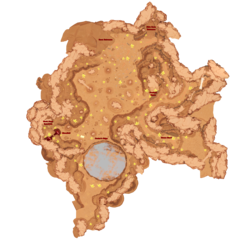
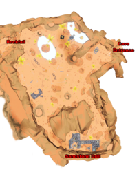
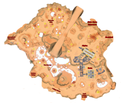
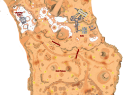
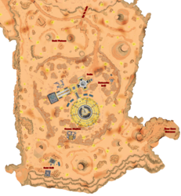

# Yet Another Aethus Walkthrough

Version 0.9.1, May 2026

## Administrivia



### Acknowledgements

Major thanks to **Euchale** from the Aethus Discord for [their guide and maps](https://steamcommunity.com/sharedfiles/filedetails/?id=3682938915), which helped a bunch with my first playthrough and filled in a few gaps in my notes when writing the first version of this walkthrough.

Also thanks to **Johan Andersson** from the Discord for collecting some icons and producing the beautiful area maps featured here. (I added locations, but he collected the images.)

### Version History

- v0.9, April 2026: first playthrough
- v0.9.1, May 2026: second playthrough, guide

### Errata

Things I'd like to clean up in a future pass.

- Are they called "production" or "processing" facilities?
- Maybe switch the order of Lambda and Kappa, since Lambda grants you log #17, but you don't get #16 until you visit the Undersea Dam Facility. On that front, you might do the Dam before you do the Fishing Hab; check the ordering of the clues for this.
- Might have missed a subgoal on [The Kappa Module](/aethus/quests/#the-kappa-module).
- Add the effects of Fatigue to the [Status Modifiers table](#status-modifiers).
- What happens if you don't make the run to Sigma in time?

### Game Introduction

This marks a significant departure for your humble walkthrough writer. Usually I spend my time replaying ancient games from my youth; *Aethus* is a modern game (released March 2026) that grabbed me by the collar and wouldn't let go until I'd finished my first playthrough. It's got both enough crunchy data to be worth collecting and an extremely compelling story that was worth writing about. And so here we are.

### Basic Tips

Some helpful hints that I've picked up in my time exploring Aethus.

- Read *everything* in as much detail as you can. Hover over items in your inventory and read the descriptions. Read the small print on the screens of terminals you interact with. Read the journal entries (maybe save these for once you're back in your Outpost). Often times there are subtle clues hidden in the text. Even the log entry number in journal entries is sometimes relevant.
- Use the Compass. A lot. Like, all the time. The game tends to drop "Point of Interest" markers that eventually resolve into named locations once you visit them. It can be a little bit challenging, especially when several points bunch up because they're all roughly in the same direction, but learning how to navigate by the compass will serve you well later on.
- Likewise, use your Suit Scan a lot. Tap `X` to reveal nearby items; hold it down longer to scan further and get a full radar scan of the area complete with compass for orientation and purple dots that indicate items of interest. Things you can interact with will also be outlined in the main display. It's super helpful for finding things you can interact with and/or scavenge, especially tiny items you might otherwise overlook.
- Whenever you run into a lab bench, seating area, etc. look *very* closely. Often times there will be small items scattered about that you can pick up by clicking on them. This might be a can of cola or food item, but it might also be things like [Servomotors]() or other expensive crafting ingredients! These items are especially hard to spot, even on a Suit Scan, when they're sitting on a workbench or console that you can interact with. Click anything that looks suspiciously like a collectible!
- If you're getting frustrated with some aspect of the game, explore the difficulty settings. You can change them at any time. As an example, some people report getting frustrated with how low your inventory weight limit is at first. Frankly, I find that sort of early-game frustration to be part of the experience and didn't want to change it, but I won't judge if you do.
  - For a more hardcore experience, turn on Negative Vitality Effects, which will start draining your abilities (including health) if you don't eat or drink. This forces you to think about One More Thing when you're on long mining runs and/or makes you return to home base more often.
  - For an easier experience, turn down Air Supply, Carry Weight, and Economy. You'll be able to mine for longer, carry more home, and get better prices on the market for your goods, all of which will help you progress faster.
- If you die, you drop all your items. (This is also a Setting you can turn off.) If you die, for example, by falling off the edge of the Lost World, the game will do its best to collect your items and place them in some *reachable* spot near where you died. It might take one or two board reloads before the cache of items shows up, though, so keep an eye on the compass and look for the little skull that indicates a cache of dropped items.
- It seems to be consistently true that plot progression (marking missions complete, acquiring new missions or blueprints, etc.) is tied to the *end* of audio dialogue. Whenever you hear dialogue, make sure that you listen *all the way through to the end* before you do anything else, like save your game or quit to the menu. It's okay to keep moving around and mining or whatever, just don't stop playing in the middle of the conversation. After all, it's rude to walk away from someone who's talking to you!
- There's no jeopardy in building things; if you cancel construction, you get the cost back. In fact, Dismantling a Construction *also* returns 100% of the material cost to your inventory, so there's really no risk at all in playing around with the build system. If you "construct" a Placeable &ndash; this is how you can put a Jenkins up on a display shelf &ndash; "dismantling" it is how you return it to your inventory.
- Don't sleep on the [Customization Kiosk](/aethus/items/#customization-kiosk). Apart from customizing your appearance, it will also let you mark certain items as "do not pick this up". This happens pretty quickly with [Regolith](), for example. Bring one of whatever item you want to ignore to the station; it needs to be in your inventory to have the station mark it.

- When you're selling items in the Trade Node, hold down `ctrl` to sell five units at a time, or `shift` to sell ten.

### Status Modifiers

| Status | Why | Effect |
| --- | --- | --- |
| EM Interference | Walked through the EM field in Iota | -10% speed |
| Energized | 'Stamina' over 45%/60%/75% | +5%/10%/15% speed |
| Energy Boost | Ate Solazine Tablets |+10% speed for 60s|
| Exhausted | Ignored the 'Tired' warning |Dimmed vision; Consumables have -10% effect; -10% speed|
| Hydrated | 'Hydration' over 45%/60%/75% | +5/10/15 max oxygen |
| Mycelial Antigen | Used an Antigen injector | Immune to the effect of spores in Theta |
| Overencumbered | Carrying more than max* | Can't pick up anything else |
| Rested | Slept for a while | Consumables have +10% effect; +5% speed for 10m |
| Sugar Rush | Drank an ARCola | +10% speed for 10m |
| Suit Overcharge | Used a Suit Charger | +5%/10%/15% speed for 1/2/3m |
| Tipsy | Drank a Cactus Moonshine | Increases chances of mining gemstones from nodes? Makes the screen fuzzy. |
| Tired | Too long since you slept in a bed | None |
| Well-Fed | 'Nutrition' over 45%/60%/75% | +10%/20%/30% carry limit |
| Well-Rested | Slept for a while in a Welfare Habitat | Consumables have +20% effect; +10% speed for 10m |

\*: In order for this to happen, you need some other status effect that temporarily boosts your carrying capacity. Fill up your inventory before the boost goes away, and suddenly you're Overencumbered. 

## Walkthrough

### How to Make Money

**In the early game:** Mine as much Sandstone as you can. Put Sandstone (and Shards) in the [Stone Crusher](/aethus/items#stone-crusher) to convert it to [Solazine](/aethus/items#solazine) and [Kalynite Ore](/aethus/items#kalynite-ore). Put the Ore in the [Basic Smelter](/aethus/items#basic-smelter) to convert it to [Kalynite Bars](/aethus/items#kalynite-bar). Bring the Solazine and the Bars to the [Crafting Table](/aethus/items#crafting-bench) and make [Mining Explosives](/aethus/items#mining-explosives), which sell for $150 a pop.

**In the middle game:** First of all, sell [Deepstone](/aethus/items/#deepstone) by the ton. 50 units will make you the same $1500 that crafting ten Mining Explosives will.

Once you explore Lambda and find the Suit Upgrades that let you find Geodes as well as the plans for the [Prospecting Bench](/aethus/items#prospecting-bench), **geodes** of various types start to appear. Geodes will sell for 2x the price of a normal gemstone of the same variety, but you're better off bringing them to the Prospecting Bench and playing the minigame to convert them into gemstones. Even with "average" results you'll almost certainly get more than two gemstones, and once you get good at prospecting you're likely to get higher-quality ones, which means you'll come out ahead over selling the raw geode.

**In the late stages:** You don't really need credits at this point, but you also have plenty of things you can sell for cash if you're trying to buy an expensive blueprint.

### Prologue

The game begins with a tutorial phase. Our heroine and avatar, Maeve, is working late for her employer, the Astral Resource Corporation (or ARC). ARC is one of the five giant "megacorps" that run the galaxy, at least commercially, and as you might expect they aren't exactly a bastion of good labor practices or warm-fuzzy feelings, no matter how much fake effort they fail to put into it.

As we open the game, Maeve has been dropped off inside a mining vein beneath the mining colony of Invermark. She's got her robot mining companion, Roland, floating alongside her. Most of the dialogue in the game happens between Maeve and Roland, and frankly I found both Maeve's Scottish accent and Roland's robotic cheerfulness to be kind of refreshing. If you're not as much of a fan, this is probably a good time to visit the options and see about disabling sound.

You do have the option at this point of skipping the prologue; if you'd like to do that, click on the transport vehicle that's right beside you and hit the "Skip Prologue" button to jump straight to [the surface of Aethus](#the-surface-getting-started). However, if this is your first time playing the game I *strongly* recommend you don't do that. The prologue will allow you to get used to the game's controls in a safe and easy environment, and also drop a few bits of lore that will be useful later.

Among the basic concepts you're introduced to here: the banter between Maeve and Roland; the fact that your path forward is often lined with [Lightsticks]() (those glowing lanterns thrust into the ground); the general feel of what ARC's mechanical mining objects look like and how to interact with them; the fact that the megacorps tend to use shitty, lowest-bidder crap most of the time; and the fact that you'll wind up fixing stuff yourself as you go.

Step up to the little platform next to the giant gate and use the console there to open it. Click the left mouse button to interact with something, and the right mouse button (or `ESC`) to back out or stop interacting. Interacting with things happens in a little subwindow in the bottom-right corner of the HUD where you'll see some info about the thing you're interacting with along with one or two buttons that you can click to take an action.

Whoops; that didn't work. Trying to open the gate prompts another round of dialogue, plus a new goal. Active missions are tracked in the upper-left corner of the HUD. In this case, you need to find another way into the mining claim; fortunately, you passed a little side passage that you (probably) didn't go down yet, so there's an obvious place to look. Spin the camera around — hold down the middle mouse button and spin, or use `Q` and `E`, to rotate the camera — and look for the passage. Hint: there's a small crate sitting at the intersection, and a sign with the words "ACCESS SHAFT" painted on it.

At the end of that side passage is a platform, but there's a bunch of crap in your way. This is an excuse to teach you how to jump (hit `space`). On the platform is a [Quakemaker]() (it's okay, you don't know what one of those is yet) and an elevator with a control console. Go ahead and take it down to the Access Shaft level. (You can click directly on the console, but usually you can click on the elevator platform as well if that's easier to target.) Here you'll get interrupted for the first (of *many* times) by Trudy, your contact at ARC who has a habit of chiming in when she's least welcome.

As the shaft opens up you'll see a big cliff off to your left. Note the top-center of the HUD; you should see a compass that tells you what direction you're facing. I'll refer to directions on that compass a lot to help you find your way. In this case you should be facing North and the cliff should be off to the West. Generally speaking you should be careful around giant cliffs like this; for the duration of the tutorial, the game will prevent you from jumping off and/or falling to your death. Don't get used to it, though.

Anyway, you should follow the actual tutorial here: learn how to use Roland's mining laser to break apart **nodes** and collect the resources within. The laser doesn't have a lot of power yet, but these nodes are pretty weak and should only take one or two shots to break apart. I recommend going into the settings and turning on "Hold to interact" mode; this will fire the mining laser repeatedly so long as you hold down the mouse button, rather than requiring you to click repeatedly. Be nice to your wrists, kids.)

Roland will automatically use his Gravity Tether to pick up the chunks of ore that scatter when you finally break up the node and drag them over to you; hit `tab` to look at your inventory. If for some reason Roland fails to tether something, you can click on them to flip them towards yourself, or walk over them to pick them up. (This often happens with chunks that fall into the water. Sometimes breaking up a second nearby node will cause him to "find" other stuff, too.)

Also worth noting: when you find a node, you can hover over it to get an idea of what might be inside. You'll learn to decode or recognize the little icons quickly enough, but you can also peek at the [items page](/aethus/items) for pictures of all the icons and information about what each thing is for. (Lots of spoilers on that page, obviously, but you *are* reading a walkthrough.)

Turn the corner and you'll find your first gemstone node: a [Sky Sapphire](). These nodes are a little tougher than the ore nodes you found before, so hit 'em a couple of times with Roland's laser to get them to break. Roland explains this to you, and then Maeve accuses him of reading text out of a tutorial or something. Heh.

As you pick things up the vital stats readout in the lower-left corner of the HUD will update to show you how much you're carrying (as well as your **health** and **oxygen** levels, but we don't have to worry about those just yet). For now, go ahead and pick up as much as you like; you don't get to keep any of it anyway, so once you get the hang of mining nodes, you can leave the rest of it behind.

Finally you'll arrive at the detonation site. There's a handful of vehicles and cargo containers strewn about the place, but most of them aren't of any use to you at the moment. Trudy rings in and asks you to "do a scan" to make sure the explosives are in the correct place, which sounds an awful lot like an excuse to learn our next bit of user interface, so hold down `X` to run a Suit Scan.

Once you run the scan, Trudy gives you the code to a nearby storage crate that contains the [Arming Key]() for the mining explosives. Now you get to practice manipulating your inventory! Go find the crate, enter the code, retrieve the key, and walk over towards the explosives to interact with them. Note that (a) your inventory automatically opens when you open a storage object or interact with some other inventory-based puzzle, and (b) the item you can most usefully use is often highlighted in your inventory. Click the key to move it into place, then select "Arm Explosives" from the interaction panel.

At this point, Roland figures out that you've done The Bad Thing, and Maeve quickly determines that in order to fix it you're going to have to hoof it all the wayback to the transport to get your datapad. Of course, Trudy is on point to "helpfully" start the detonation countdown, which is bad news for you. Go ahead and run as fast as you can back up the shaft towards the elevator, but you can't outrun the dramatic narrative, and eventually you're going to get caught in the blast whether you like it or not...

### The Surface: Getting Started

<figure>

<figcaption>Area Map for this section (10k &times; 10k))</figcaption>
</figure>

The real game starts with a cutscene where we get to see Maeve's brave decision to quit her job and strike out on your own. (The developer has, in fact, confirmed that this scene was partially inspired by his own career trajectory.) With Roland's help, she mines the ARC data files for information about defunct mining claims that are up for sale. Her grandfather, who also worked in the mining industry, dropped some extremely vague hints about a valuable, hidden claim called "Kappa"... or something like that.

Together they track down something that seems like it could be the right place. Blowing her life savings on the rights to the claim, transportation to get there, and some basic starting supplies, our intrepid duo is off on the adventure of their lives... or at least the next 30–60 hours of playtime for you and me.

That drops you into the game at one end of a long canyon, at the spot marked "Game Start" on the area map. The big open field in which you're going to build your brand new outpost home is at the far end of said canyon, but there's a few more tutorials to do between here and there.

When you reach the overlook of the big clearing, turn right and head off to the NE and down a bit until you get some dialogue about food. One thing to take note of right away: you now have vital stats gauges for **stamina**, **nutrition**, and **hydration**. They should be somewhere around the midpoint at the moment, but they fall pretty quickly and you'll want to keep an eye on them.

This is a good time to mention the Settings page. There are several options there that allow you to adjust how "hardcore" your play experience will be. You can adjust these settings at any time with no penalty, so check them out and see what they offer and if something feels too easy or too hard, try adjusting a setting. (More on this in the [Basic Tips](#basic-tips) section.)

Anyway, Maeve is feeling hungry, so hover over the cacti that dot the path you're following and see what they produce when you laser them. The tall, straight ones tend to only produce [Biomass](), but the short, squat ones with flowers will also produce [Cactus Fruit](). This is your first and only source of food for a little while, so start harvesting every cactus you can find that produces fruit. Eat one or two of those — open your inventory with `tab`, then use the middle mouse button to "use" the fruit to eat it — and watch your vital signs go up.

You may also notice some [status indicators](#status-indicators) over the lower-center part of the HUD. If you keep your vitals up over 45%, you'll actually get bonuses to things like oxygen capacity, movement speed, and weight limit. This is how the game encourages you to keep yourself properly fed and watered.

Proceed a little further and there's a slightly-too-high drop that you can't jump back up onto. (That's okay; you don't ever need to.) Go ahead and collect some more cactus fruit, and while you're at it, practice by chopping down a Palm Tree or two. Palm trees tend to fall into a big clump of stuff; sometimes if you wade through it and kick the larger bits out of the way, there are collectibles hiding underneath. You may also notice that you pick up a few [Sandstone Shards]() or [Regolith Chunks]() along the way; you can acquire these just by lasering the ground, but there are naturally better sources of raw material.

Take note of the steps up to the cave entrance just to the NNE of you, but Roland will rightly steer you away from it for now. Just past that the canyon will open up onto the plain where we'll start building your Outpost. Two things happen here: you get your first personal log and your first plot mission, which is to collect [Scrap]() so you can start building things. Personal logs act as sort of plot milestones, so I'll call them out throughout the guide like this:

> #1 — An Inauspicious Start

Let's get the lay of the land. You should see a handful of new things you can zap lying about: medium-sized railings and piles of metal, the Palm Trees and Cacti you've already seen, plus Regolith Spires that you can shoot for raw materials. (Don't do that yet.) There's also something called a Small Outcrop, which if you hover over it, reveals that it can be blown up with a [Small Terraforming Charge](). That sounds like fun! For now, though, take Roland's advice and start lasering all the random scrap metal you find. That converts it into [Metal Scrap]() that you can pick up.

This part of the game can be a bit frustrating. It's not super clear which bits of the discarded railings and whatnot actually need to be shot in order to reveal collectible items. You can usually only get two or three pieces of scrap out of each railing, and you'll wind up shooting pieces that don't turn into scrap. This becomes much less of an issue once you start doing the actual mining work, but for now you just have to try it and see. I had luck focusing on the "corners" instead of the middle parts.

Also note that Roland's mining laser has a battery. The targeting circle turns red when he's almost out of power, and when you stop shooting it slowly refills. Later on we'll buy some upgrades that will increase the power, capacity, and recharge rate of the mining laser.

One final tip here: don't laser anything you aren't planning to pick up right away. Anything you leave lying around after you've shot it has a chance of disappearing, eventually. Anything that disappears *quickly* (i.e. within a few seconds of shooting it) probably wasn't anything you could collect in the first place, but if you want it you'd better pick it up. Incidentally, you can *drop* things from your inventory — hover over the stack and hit `ESC` — which will produce a small cache on the ground. I still don't know if those caches disappear on their own, but I haven't seen it happen yet.

Once you've picked up five or ten pieces of scrap, hit `B` to open the Build Menu and take a look at the various options there. I love the fact that you can collect [Biomass]() and [Regolith]() and then do some artificial landscaping through the "Nature" submenu, but for now the thing you need to do is pick "Facilities" and build yourself a [Makeshift Forge](). As soon as you do that, Roland hands you the blueprint for a [Makeshift Habitat]() and encourages you to build one ASAP. Don't forget to hit `B` again (or use the right mouse button) to exit Build Mode.

This being your first **production facility**, let's cover a few basics. To use the Forge, get close to it and then click on it. You'll see it has an "inventory" window, which is where you'll put raw materials and collect processed output. You can also see all the "recipes" that it knows how to make, including a list of what materials you need to put in (and in what quantities) to produce which outputs. Here's a few notes about using production facilities:

- Production facilities run automatically as soon as you feed them raw materials, presuming that there are any active recipes (see below) and there's enough raw materials to run them. Left click to transfer one object at a time, shift-left click to transfer half of a stack, or right click to transfer an entire stack. These commands work in both directions.
- Production facilities have infinite storage capacity. You can dump as much raw material as you want into one and you're under no obligation to remove any outputs. However, items in facility storage can't be used anywhere else; you will, eventually, need to move them into your inventory and/or a storage unit first. (You *cannot* put output materials back into a facility once you've removed them.)
- Recipes can be enabled and disabled. If they're disabled, you can still (manually) dump raw materials into the facility's storage, but the facility won't run disabled recipes. Recipes are run from top to bottom; the first recipe with the right raw materials in the hopper is what will run.
- If you combine those two tips, you can (for example) use a Makeshift Forge as an infinite-capacity storage unit for Biomass. More useful storage is pretty cheap, though.
- The hotkey `F` will automatically transfer all usable raw materials from your inventory into facility storage. Inputs for disabled recipes are ignored. **FIXME:** shift-F, ctrl-F
- Production facilities learn how to make new things by acquiring **blueprints**. Some blueprints can be found during your explorations, some are granted by the game when you advance the story or find a new raw material, and some are purchased at the [Trade Node](). I'll try to point out when this happens, but keep an eye on the [Crafting](/aethus/crafting) page for hints about what's coming in the future.

Take as much time as you like clearing [Metal Scrap]() from this area (you'll want most of it gone, eventually) and collecting [Cactus Fruit]() and [Biomass](). Don't wander too far, though, lest you confuse the order of events the game wants you to take. Dump the Scrap into the Forge and smelt some [Building Materials](). These are the basic, abstract material that will make up the foundation of your one-man mining village and get you through the first chunk of the game.

Take the Materials out of the Forge's hopper and stick them in your inventory, then open Build Mode and build yourself a [Makeshift Habitat]() (under "Structures"). Play around with the build system for a few minutes; note that you can click on an existing object, which then gives you the option to move (`M`) it somewhere else, produce a duplicate (`U`) version — very useful for storage crates — or dismantle (`N`) it, which removes it from the world and refunds 100% of the construction cost to you. Later on you'll be able to apply color themes (`T`) to habitats and other constructions as well.

Note that if you Dismantle a facility (or storage unit) that has materials in its hopper, the game will also try to move those items into your inventory but will most likely end up leaving a small cache nearby with the overflow.

Building your first Habitat also prompts the game to give you the blueprint for your first item of furniture: a [Bed](). Build one of those, and you've got the extremely humble beginnings of an outpost to call your very own. You're also promptly granted several more blueprints, including a [Scrap Grill]() (under "Facilities") and a [Makeshift Crate]() (under "Storage", a new category). Go ahead and make one of each of those right now, or farm some more scrap metal first if you need to.

We did get to play with storage units a little bit during the Prologue, but for now, pick up some [Biomass](), [Metal Scrap](), and [Building Material]() from the Forge and dump them all into the crate you just built. Isn't it nice to get some inventory room back?

Next we'll learn how to use the crafting interface. The Grill is a **crafting facility**; similar to production facilities, they have a list of recipes that transform raw materials into output items, they have infinite storage, and they learn how to make new things via the acquisition of blueprints. (Like the recipe for [Grilled Cactus Fruit]() that the game just granted you.) Unlike production facilities, crafting facilities have no input hopper for raw materials, and they won't make anything until you explicitly tell them to do so.

Crafting facilities pull their inputs either from your inventory or, cleverly, from any storage unit in your outpost no matter how far away it is. Unlike production facilities, which demand that you hand-feed them their input, you can walk up to a crafting facility empty-handed and say "Somewhere in my storage units there is some Biomass and some Cactus Fruits; make me a Grilled Cactus Fruit" and it'll just do it. Give it a try.

On the other hand, just like production facilities, the output hopper of a crafting facility does *not* behave this way; things must be pulled into your inventory before they can be used as input. You will often find yourself in a situation where you're using a crafting facility and one of the ingredients is in the output hopper *of that same facility*, and the game will tell you it can't make the thing. You just have to pick the things up first. It's dumb.

Crafting facilities also have a "queue", so you can line up several production runs and then walk away. The queue tops out at ten items (plus whatever's actively being crafted), so go ahead and click "Add to Queue" a bunch of times, and when you come back you'll have a bunch of [Grilled Cactus Fruit]() to eat. Ahh, that's better. Go ahead and fill up on this stuff; note that grilled fruit is slightly more nutritious than raw. As before, you can hover over the item's icon to see its specific effects, or check the [Items](/aethus/items) page for spoilers.

(The sharp-eyed gourmet will also notice that the Cooking Station already has a recipe for [Basic Mushroom Soup](). This should become a staple of your diet: it's got much better nutritional value than cactus fruit, but you can't make it yet because you don't have either water or mushrooms. We'll fix that as soon as we can.)

Meanwhile, we've got a new mission to tackle: Roland has marked a handful of points of interest on our map, and it's time to take the grand tour of the area. The first stop on the tour is in fact very close by, just to the NW of where you've been mucking about with scrap metal and building your outpost. Head over towards the Cave Entrance; you can probably spot it by the small, blue glowing plants in the shade under an overhang. When you get close enough, Roland will instruct you to run a Suit Scan and Maeve will helpfully point out that this is where the underground portion of our adventure will soon start... but not just yet.

Head a little bit South from the cave entrance and you should find another ring of metal scrap to pick up, along with — what's this? — a [Small Crate]()? You'll find plenty of these things scattered about the underground caverns; where there were miners, there are probably still storage crates. Many will be full of useful items you can scavenge. Note that the light on top of this one is green, which means that it's not empty (white) nor is it completely full (red). In fact, if you open it up you'll find some [Bottled Water](), a [small Terraforming Charge](), and a pack of [Solazine Tablets](). The latter are a short-term buff that make you move faster. The water does what you think it does, although it's also extremely useful for making soup. And the Terraforming Charge is how we make outcrops go boom!

Pro tip: because we're still on the surface, you can enter Build Mode, pick up this crate, and move it anywhere you want. You may not be hurting for storage space at the moment, but you will be soon enough, so I recommend dragging this thing back to your outpost. Hit (`B`) to enter Build Mode, left-click the crate to select it, hit (`M`) to move, and then walk it back to your habitat and drop it nearby. You'll need to build more later on, but this is a nice upgrade right now.

Stop number two on the tour is the freshwater oasis, which is off to the SE of your outpost and labeled "Fresh Water" on the area map. There's plenty more metal scrap over here to zap, if you feel like it, along with a number of rocky outcrops of various sizes that we'll get to blow up later in the name of Progress(:tm:). Unfortunately, although the oasis does turn out to contain fresh water, it's in desperate need of purification before it's safe for humans to drink. So we can't harvest drinking water from here just yet.

It may be getting on towards Dusk by this point; you'll see the shadows shift around and the light start to dim. That makes it a good time to head into your habitat and try out that bed you built for yourself. Go ahead and sleep until Morning. Note that sleeping make Energy go up, but Nutrition and Hydration go down. It also grants you the [Rested](#status-modifiers) status, which bumps your movement speed for a while and also increases the effect of food and other consumables. They say breakfast is the most important meal of the day — in this game, it definitely pays to eat as soon as you get up, in order to maximize the benefits.

Now let's tackle the last two spots on Roland's tour; remember to use the compass to help orient yourself towards points of interest. Head South across the surface until you find the giant meteorite crater, labeled "Crater's Edge". You don't really learn much of interest here yet, but this will become an important spot later on.

For now, turn West and you should see a [Sun Shade]() set up over a small table. As you get closer the game will start to chirp at you: this is a distinctive sound that means there's a Datapad nearby with some plot information on it. In this case, it's a personal log (entry number `0155f`) from an unknown person with the initials "T.L." reminiscing about how much they enjoy visiting the surface occasionally. In fact, if you walk around to the other side of the table and click on the small stool there, you can sit down yourself and enjoy the view for a moment.

The other glowing thing on the table is a blueprint — get used to what these look like, because they're crucial. It teaches you how to build a [Dew Catcher](), which provides our first opportunity to collect drinking water. There's also a [small Bottled Water]() here as well as a locked crate, and in fact, we immediately get a mission to figure out the lock code for the crate. As I mentioned in the [Tips](#basic-tips) section, lock codes come from a variety of sources. In this case, the code for the crate is the ID number of the log entry you just read: `0155`. Your reward is a [Nutrient Bar](), a [large Bottled Water](), and a [large Terraforming Charge](), for making the *really big* outcrops go boom. Don't worry, we'll start playing with those soon, but for now let's finish up the tour.

Head a bit West from the campsite and you should see a blood-red waterfall pouring into a pool of water. Fortunately, a Suit Scan reveals that it's not actually blood, just water rich in iron. If you tilt your camera up as far as it will go, you might be able to spot a little cliff that overlooks the "Bloodfall" and a little wizard doll sitting on a table. That's a [Jenkins](); it's not the first one you get to collect, but it is the first one you've seen.

Okay, now let's head back to camp. You might not be as obsessive as I am, but I like to pick up the shade and all the stuff underneath it and use Build Mode to walk it all back towards my outpost. The extra bits of furniture give it more of a "lived-in" feel, y'know? If you don't care, you can Dismantle (`X`) it all for more [Building Material](), or just leave it where it is.

Water is critical for maintaining life, so let's set up a couple of [Dew Catchers]() now that we know how to build them. Dew Catchers gather water vapor from the air and make one [small Water Bottle]() every 12 minutes or so. Their output hopper can only hold one bottle at a time, so you'll want to regularly go around and collect the bottles from all your catchers or else they won't be able to make more. You can, and definitely should, build more than one Catcher, but they need to be spaced pretty far apart. For now, build one on either side of the Cave Entrance so they're easy enough to get to. Remember that you need [Building Materials]() to construct them, so dump some more [Metal Scrap]() into your [Forge]() if you need to and pull the Materials out of the hopper afterwards.

> #2 — One Small Step

A new personal log is a good indicator that we're ready to move on. Drop whatever you're carrying in storage to make room in your inventory, then head over to that Cave Entrance and let's boldly go where no one has gone... for at least thirty or forty years.

### The Outer Caverns

<figure>

<figcaption>Area Map for this section (3k &times; 3k)</figcaption>
</figure>

The first thing we learn upon entering the cave system is that the air underground is toxic and unbreathable. Fortunately, you've got oxygen tanks built into your mining suit that will sustain you, at least for a short while. The oxygen gauge in the vital signs area is now critical to your survival; so long as you stay near the cave entrance, it will stay full. Once you move into the caves, a chirping sound will play to indicate that you're now breathing air from your suit tanks, and the meter will start to deplete. Return to the "fresh air zone" and you'll hear a puff as your tanks start to refill.

As you're running around breathing stale suit air, keep an eye on your Oxygen gauge. If it drops down to around 1/3 of capacity, either Roland or Maeve will pipe up and encourage you to find some air soon. When this happens, *immediately* drop whatever you're doing and run to the nearest air source. Don't finish mining that node, don't pick anything up, just run. If you run out of air you start to **Suffocate** and lose Health. Hit zero Health and you pass out, in which case Roland has to drag your body back to your bed.

To be fair, that's the only actual negative consequence; you can't actually *die* in this game, you just wind up back home. You will drop everything you were carrying, although if that starts to bug you it is a Setting you can turn off. So don't stress too much about it, eh?

As Maeve suggests, you'll eventually need to upgrade your suit's air capacity in order to support longer dives. In the meanwhile, we'll keep our runs short and mostly targeted, but for now let's explore this cave system and see what sorts of fun things we can find.

Without even leaving the breathable zone near the entrance, you may find some more glowing blue plants, which are called Glowtus. Zap them and they drop [Glowtus Fruit](), which is a crafting ingredient. There may also be some nearby [Cave Mushrooms](), which are (obviously) the core ingredient in [Mushroom Soup](). Collect every one of these you can find; they're light, they're everywhere, and you can basically survive the entire game on mushroom soup without trying too hard. Eventually you'll be able to grow your own, but for now you just have to forage them.

Not very far into the cave you should easily spot a storage crate. Inside are two [Glowsticks](). Hmm... Glow-*tus*... Glow-*stick*... sounds very similar. File that one away for later. There's also plenty more [Metal Scrap]() kicking around here, although you likely don't need more at the moment. If you've wandered far enough away from the door to be breathing suit air, this is a good moment to sit and watch your meter and see how fast it depletes. Should be roughly one unit of oxygen per second. Now run back to the door to top up.

Slightly deeper in you'll start seeing some new Nodes. These will glow with a reddish-brown color; they're Regolith Nodes. Zap them with Roland's mining laser and they produce [Regolith](), [Sandstone](), and if you're lucky, [Dust Rubies](). Regolith is how you produce [Building Materials](); Sandstone is a critical early-game production material; and Dust Rubies are your first gemstone, which will be a source of credits. You can also crush them into [Dust Ruby Powder](), which is important for mid-game crafting but doesn't matter just yet.

Go ahead and make a couple of trips back and forth to get the hang of how long you can dive before you need to come back. Find the second storage crate straight ahead (SW) of the entrance. Inside that is another [Terraforming Charge]() and an [RTG](). What's an RTG? It's a tiny nuclear reactor that can be used to power a habitat, which explains the powerful energy readings Roland's been noticing. Finding this one grants you the blueprint for your first "real" habitat building, a [Basic Habitat]().

Make one more dive a little further in from the RTG crate and you'll find another, larger storage crate that you can't interact with. But sitting on top of it is a loose blueprint for the [45° Habitat Connectors]() and a chunk of [Solazine](), which is another important crafting ingredient. Around the corner from that is a crate you *can* open, which has a [small Bottled Water]() and a [medium Terraforming Charge](). Now that we've completed the set of charges (and probably mostly filled our inventory), let's head back to the surface.

First off, open the Build Menu, go to Structures, and check out the new [Basic Habitat](). (And if you don't have the necessary five [Building Materials]() kicking around, go find some more scrap to smelt down.) They're significantly larger than anything else you've constructed so far, so you may have trouble finding a place to put it down legally (blue glow), either because you're on top of something harvestable like a tree or a spire (purple glow), or because you're up against a terrain feature or outcrop (orange/yellow glow). In which case it's obviously time to start blowing some stuff up!

Trees and spires are easy; just blast them with Roland's mining laser and pick up the pieces. For outcrops, you'll need to toss a [Terraforming Charge](). When you hover over an outcrop with your mouse cursor, the popup will tell you how large the outcrop is and therefore how large the corresponding Charge is that you need to use. Go ahead and gather up the two Smalls and one Medium that you've collected, then take a look around the area in front of the cave entrance. I bet you'll be able to find a couple of outcrops that are in your way or will be soon.

To use a Charge, open your inventory, hover over the item, and press a number key (1 through 0) to assign that item to a quick slot. Close your inventory and press the number key again (or click the slot in the quickbar) to prepare it, then aim the cursor at the outcrop and hit (`R`) to throw. Stand back so you don't get hurt by the blast. Then go pick up a whole bunch of Regolith.

Now that you have enough space, go ahead and build yourself a [Basic Habitat](). You may notice that it's raised up off the ground, as opposed to the [Makeshift Habitat]() which wasn't. In order to get into your new building, the game grants you the blueprint for the [Access Platform]() (under "Platforms"). The Basic Habitat comes with [Airlocks]() pre-installed on both doors, so the Access Platform should snap to them reliably.

You also now have the ability to construct an [RTG]() (under "Power") inside your outpost. Confusingly, the construction is called an RTG, but the inventory item you need in order to construct it is *also* called an RTG. Fortunately, we found one of those in the Caves just now, so walk up the stairs into your brand-new habitat and use Build Mode to construct an RTG in one corner. Doing that replaces the Basic Habitat blueprint with the [Standard Habitat](), but also teaches you the [Regolith Printer]() and the [Short Connector](). The Connector is necessary because the outrigger legs on the Basic and Standard Habitats prevent you from building two of them next to each other without a little hallway to connect them. Standard Habitats are much more expensive (20 [Building Materials]()) but you're well within your rights to immediately build a Standard and then dismantle the Basic, because the Standard is much roomier on the inside.

Go ahead and construct a [Regolith Printer]() now as well. This marks the end of your worries about where your Building Materials are going to come from, because even though it might seem expensive (5 [Regolith]() = 1 [Building Material]()) pretty soon you will be swimming in more Regolith than you know what to do with. You're more likely to wonder where to put all the Building Material you've produced than you are to run out of it.

Doing this also unlocks the blueprints for the [Stone Crusher](), [Basic Smelter](), and [Crafting Bench](), which form the first tier of material processing capabilities. You should be able to build the Crusher right away, but the smelter requires a bunch of [Solazine]() you probably haven't collected yet and the Crafting Bench requires [Kalynite Bars](), which you need the smelter to make.

Well that sure sounds like a tech tree to start filling out, doesn't it? Go ahead and fill the Crusher and Printer with whatever raw materials you happen to have kicking around, namely, [Regolith](), [Sandstone](), and [Dust Rubies](). In the future you'll be able to sell gemstones like the [Dust Rubies]() for credits, but [Dust Ruby Powder]() (which is what the Crusher produces) sells for the same rate *and* is a useful crafting material, so there's no harm in putting Rubies through the Crusher now or in the future.

Sandstone is worth an extra mention here. Putting [Sandstone]() into the [Crusher]() produces [Regolith](), [Solazine](), and [Kalynite Ore](). You need Solazine to build the [Basic Smelter](); you use the Smelter to turn Kalynite Ore into [Kalynite Bars](), which you need to build the [Crafting Bench](). And then, once you do all of that, Solazine and Kalynite Bars can be crafted into [Mining Explosives](). Explosives are useful for mining, as it says on the tin, but they're also cheap in material cost and they sell for a reasonable number of credits, which makes them a good choice for farming credits from raw materials. That doesn't matter right now because you don't have any way to sell anything, but you will soon enough.

If it's getting late, it may be time for another nap before we head back into the caves. To be fair, you don't really have to monitor your fatigue levels that much; Roland and/or Maeve will tell you when it's been too long since you slept, and only several minutes after that will you start to feel the negative effects of not sleeping. But you may as well do it while it's convenient. Don't forget to fill up on food afterwards in order to enjoy the faster movement, higher oxygen capacity, and larger weight allowance. Besides, it's harder to navigate the caverns when it's dark outside.

Back into the caverns we go. For this next run, head SW until you hit the second crate, then turn left (SE) and follow the narrow seam to the back of the cavern. There you'll find your first drill site. Drills (and their advanced cousins, mining lasers) are basically automated resource collection machines. Once you set them up with the right [Drill Bit]() (or [Focusing Lens]()), they will periodically generate resources of a certain type, kind of like the [Dew Catcher]() does (and its big brother the [Water Pump](), about which more in a moment). This one produces [Sandstone](). Eventually, you can also add a [Cargo Drone]() which will transport the collected resources back to your outpost without you having to go and collect them.

Roland will encourage you to scavenge for supplies here, which you should definitely do, but keep a keen eye on your oxygen levels because it's easy to get stuck among the detritus here and it's a long way back to the entrance. But if you look around you'll find the blueprint for a [Biomass Generator](), which you'll need in order to add more Power capacity to your outpost. The nearby storage crate has another [small Terraforming Charge]() as well as a new gemstone, [Pangimony]().

Perhaps more interesting is the fact that the platform attached to the drill has a functioning [Basic Smelter]() on it, which you can totally use even if you haven't built your own yet. (You can also scavenge some [Kalynite Ore]() from it right now.) Activate the nearby computer console to read another log entry authored by one **Tanya Li**, who I bet is the same T.L. we read about earlier. Don't read it now; just hit (`ESC`) to clear it, and wait until you can breathe again before you hit (`J`) to bring up the Journal and review it later. It suggests that the route deeper into the caverns is on the North side, i.e. the opposite from where we are now. We'll go check that out next, and don't worry; on the off chance you forget, Roland will remind you.

If you want to do some more mining before you head back to your outpost, drop the heavy stuff (Regolith, Sandstone) in the small crate near the entrance to give yourself some more inventory space. This is called "staging" and you'll be doing it a lot as the game goes forward. The vast majority of the time, you'll find larger and larger storage containers in useful places, usually close to an oxygen source. This allows you to go out on a mining run, collect materials, bring them back to the storage container, fill up on oxygen, and do it all again. Of course, eventually you'll fill the storage container, and then you have to make multiple trips back to your outpost because your suit can only hold so much. But there are some advantages; dumping stuff into a container sorts it all together into stacks, which allows you to consolidate and prioritize what to bring back first, or leave behind the stuff that doesn't have value anymore.

You might also want to laser a bunch of the scrap that's lying around here, not because you need any more [Metal Scrap]() but because it gets in the way and it's easier to navigate the Caverns if it's gone.

That said, feel free to head back to base whenever you feel like it. Getting used to the flow of diving the caves for a while, then heading back to manage your production facilities and craft new stuff is part of the fun of this game, so do it at whatever pace makes sense to you. There is no time limit. Spend as long as you like puttering around, tweaking the layout of your outpost, or decorating and landscaping to your heart's content. Don't forget to collect the [Bottled Water]() out of your [Dew Catchers](), too.

Your next dive is SW to the second crate, then turn right (NW). Around the corner you'll find a little pool with a tiny island in the middle. There are blueprints for some Decorations there (the Drink Can and the Can Stack), and if you go just past it there's a crate with two [Oxygen Domes](). Oxygen Domes are portable, temporary oxygen generators; throw one (the same way you'd throw a Terraforming Charge) at the ground somewhere and a small, blue dome will expand from it. Stand under the dome and your oxygen levels will go up for a short while. These can be life savers if you're on a long mining run and get a little too far from home.

In the same vicinity there's a datapad with another journal entry (again, don't read it here), and beyond that is a lake containing an old [Water Pump]() and a purifier. Unfortunately, this one's busted, but you can collect the blueprint for building your own; it requires materials you won't be able to produce for a long time, but once you can, it makes a higher-capacity replacement for the [Dew Catchers](). The journal entry is from **Frank Hoffman**, an engineer at Delta (huh, what's that?), complaining about how Tanya (his boss?) ordered him to junk the water pump for some unknown reason. Apparently our buddy Frank is the one who left the blueprints here in case someone needed to repair it, lucky for us.

Just West of the lake is a spot where the walls have fallen in on themselves. This is the "tricky" way forward that was hinted at in the journal entry we found over by the drill, and if you look past it you'll spot something that looks an awful lot like a standard mining habitat. This updates your mission goals and gives you a little bit of dialog, but you're probably out of air, so it's time to run back to the entrance and peruse those journal entries. Make sure you find this spot (the "rockfall") before you do much of anything else, though.

> #3 — Cave-In

Now it's time to make some updates to your outpost. Crushing enough [Sandstone]() to make five [Solazine]() gets you a [Basic Smelter]() of your own. The smelter is an upgrade on the [Makeshift Forge]() which nets you three wins:

- the ability to convert [Kalynite Ore]() into [Kalynite Bars]()

- a better rate of return on converting [Metal Scrap]() into [Building Material]() (although, again, the [Regolith Printer]() probably has you covered on that front)
- the Smelter doesn't consume [Biomass](), unlike the Makeshift Forge

Two Kalynite Bars is enough to build the [Crafting Bench](), which is your next target. Now we're *really* cooking with gas. Uh, well, nuclear power, I guess. Actually we're still cooking with [Biomass]() for now. Look, it's a *metaphor*, okay? Forget I said anything.

Right off the bat, the [Crafting Bench]() gives you a whole bunch of new goodies you can make:

- [Glowsticks](), which it turns out are in fact made from [Glowtus Fruit](). I find them kind of useless, partially because dropping one makes my graphics card slow to a crawl, but also because more light in a fixed place isn't all that helpful.
- [Mining Explosives](), which I mentioned earlier. You need one or two of these to get through the rockfall.
- [Small Terraforming Charges](), in case you need to clear more land (you will).
- [Kalynite Drill Bits](), which sounds an awful lot like the thing we need to activate the drill we found.
- [Kalynite Frames]() and [Basic Electronics](), which are more advanced crafting ingredients.

Some of these require raw materials we don't have yet, like [Silica]() and [Oxite](), so we'll have to keep an eye out for them. And remember that, like all crafting facilities, the [Crafting Bench]() can pull what it needs from your storage containers, so if you haven't already started building a collection of [Small Crates](), now is a good time to do it. (Seriously, all they cost is a couple of [Building Materials](), and I bet you already have a ton of those lying around.)

Once you've got your outpost powered, organized the way you like it, and pumping out processed materials, go ahead and make yourself a couple of [Mining Explosives]() and let's go take out that rockfall.

### Facility Alpha

<figure>

<figcaption>Area Map for this section (5k &times; 4k)</figcaption>
</figure>

Make sure you assign the [Mining Explosives]() to a quickbar slot before you enter the caves. Then head over to the NW corner and find the rockfall again. Toss the explosives at the rocks just like you would a [Terraforming Charge]() and they should clear out of the way. It's not impossible to get them all with one toss, but it's more likely to require two or three.

Roland identifies [Silica](), a new element among the remnants left behind in the explosion. This also leads him to inform you that you'll need to build a [Trade Node]() in order to connect to the ARC mercantile network and sell all the shiny objects you're finding for credits. Credits, in turn, are how you're going to purchase upgrades, such as larger oxygen tanks for Maeve and more powerful mining lasers for Roland.

On the far side of the rockfall you'll come across a locked crate with a datapad on top of it. The datapad contains another short journal entry from Ms. Li, who seems determined to blow up *something* with a handful of [Mining Explosives](). Sure enough, if you had the code — it's `7878` — and could open the crate right now, you'd find three Explosives and a [Terraforming Charge](). But the journal entry where you learn the code is a long way from here, and by the time you learn it the contents of this crate aren't useful in any way, so I recommend you use it right now. This is the joy of using a walkthrough, after all.

You're still operating on limited air here, so hug the wall to your right and circle around a little bit to the North. Sure enough, there's another exit from the caverns here ("Side Cave Entrance" on the map) and if you stepped outside you'd find yourself at the alternate entrance that Roland told you to skip when we first arrived here. Oops. Anyway, much like the first cave entrance, this one acts as a spot to refill your oxygen, so you can chill out here for a second and survey the area around you while your tanks recharge.

There are a bunch of new nodes in this region, along with the brown/orange Regolith nodes you've seen before. The pale blue nodes off to your right (NW) are Kaloxite Nodes, which produce [Kaloxite Ore](), [Oxite](), and [Silica](). The white nodes are Kalynite Nodes — if you're like me you'll spend at least half the game getting those two backwards — which produce [Kalynite Ore](), [Solazine](), and [Silica](). Every kind of node you find in this area also produces [Sandstone](), [Dust Rubies](), and [Pangimony]() when you mine them. You may also spot some red Dust Ruby Nodes. Check out the [mining page](/aethus/mining) for a reference guide to what you'll find in each area. 

There's also some new plants to be harvested, besides the Glowtus, Cacti, and Cave Mushrooms you already know about. Korvo Plants are purple, flat, and have broad leaves; they produce [Leaves](/aethus/items/#korvo-leaf) and [Seeds](/aethus/items/#korvo-seed). However they tend to float on top of toxic swamp water, so you will learn to harvest them from afar. Finally, you'll come across a series of circular stone "nests" that sometimes contain [Mysterious Eggs](). We'll talk more about those in a bit.

The elephant in the room, though, is that large mining facility that's up on top of the hill South of where you're standing. Go ahead and run over there now; you should be able to spot the front door from where you're standing. The good news is that the generator is functional, the airlocks are tight, and the habitat is pressurized, so you can also use it as a source for oxygen. In fact... I tend to agree with Roland. It's awfully lucky to find a place that's kitted out this well, and that much luck is a bit too creepy to really be celebrated.

> #4 — Clifftop Living

The game doesn't formally name this building, but we'll call it **Facility Alpha** for reasons that will become clear shortly. Check the place out at your leisure. There' s a working [Regolith Printer]() here in case you prefer to haul less [Regolith]() and more [Building Materials]() back to your outpost. There's also a working [Crafting Bench](). Despite the abundance of raw materials nearby, I never found crafting facilities like this to be useful, because they only have access to whatever's currently in your inventory as opposed to your entire outpost's storage units. Maybe you will though?

On a shelf opposite those you'll find a [Nutrient Bar](), a [Cargo Drone]() that will become super important shortly, and a workpad with a journal entry introducing some incoming staff members. (Remember, you're reading these in retrospect.) **Ncuti Sinclar** and **Caleb Vihaan** are names that will pop up several times as we learn more about what happened here, but perhaps more intriguing is the implication that there are actually *several* facilities in this complex and they're named for Greek letters. (In case you're wondering, Theta is the eighth letter in the alphabet and Lambda is eleventh. But Alpha is first, which is why I've dubbed this Facility Alpha.)

Other things you can scavenge here include another [Mining Explosive]() on the shelf, a [Kalynite Frame]() in the locker, an [Oxygen Dome]() on the dining table, an [ARC Credit Chip](), and one unit of [Basic Electronics]() in the lockbox. There are also two sets of Bunk Beds here, which you can totally use to sleep in case you don't want to return to your outpost for some reason. Again, I never once took advantage of these, but maybe you will. Finally, a [Suit Charger]() sits along one wall; hit the link for more on what they're used for.

Go out the side door of Alpha and you'll find a small set of platforms. To your right are two huge Storage Containers, which make excellent staging areas for mining runs (600kg capacity!). There's also a smaller crate, and the blueprint for making [Medium Crates]() of your own back home, which is a nice boost to your storage capabilities. One of the Containers has two Mining Explosives in it, and the smaller Crate has a [Health Injector](). Hang on to that.

On the other side of the platforms is an elevator with a breathtaking view of the area beyond, which turns out to be the same giant crater that you found on the surface. Maeve says she can't see through the dust, but if you're here during the daytime you ought to be able to make out another mining habitat deep down in the crater. We'll get there eventually, but not anytime soon; the elevator itself is out of order, and we'll need to find a [Power Cell]() in order to get it moving again.

> #5 — Powering Up

You may also happen to notice that at the bottom of the elevator is another habitat, which we'll call Facility Beta, and behind it another automated mining drill. All of that is very exciting but out of our reach until we get some upgrades going, and as Roland mentioned before, that's going to require us to get back onto ARC's trade network.

For now, scout out the rest of the area immediately around Alpha and maybe do a little mining on the nodes that are close by. When you've got a full inventory, grab that Cargo Drone from inside Alpha and let's head home. Exit through the new "Side Cave Entrance" (take the front door out of Alpha, turn NNE, and follow the very faint path) so you can watch Roland eat a little bit of crow for telling you to ignore it when we first came in (during [Arrival]()).

Your next goal is to build yourself a [Trade Node]() in order to interface with the aforementioned trade network. That requires two [Basic Electronics]() from the Crafting Bench, which will cost you 10 [Silica](). You ought to have collected that much Silica from blowing up the rockfall, and you hopefully found one Electronics board in Alpha, so go practice crafting for a bit and build yourself a Trade Node. Surprise! You also need to build a [Comms Antenna](), but the game didn't give you the blueprint for that until you finished the Trade Node. Looks like you need some more [Basic Electronics](), and that means you need more [Silica]()... and that means we're heading back underground.

Before you do, though, a note on the UI: you can "pin" crafting recipes and construction blueprints to the left-hand side of the HUD. This is handy if you have a particular thing you're trying to build and you need to remember what raw ingredients you need in order to build it.

Since you're looking for Silica, your primary targets should be the white Kalynite nodes, or if you strike out a little further down the hill, the light blue Kaloxite nodes. They're both much harder to crack than the orange Regolith nodes. If you're persistent (and enable hold-to-interact mode instead of click-to-interact mode in Settings) you *should just* be able to open them up. If not, you can always try tossing Mining Explosives. Just remember to stand back so you don't catch yourself in the blast.

When you need air, you can either stop near the Side Entrance, or run back to Alpha. When your inventory gets full, dump everything into the Storage Containers and keep going. We've already talked about staging, but when you have large Containers like these to use as a storage point, one really nice thing is that everything stacks inside the container so it's easier to prioritize what you bring back to your Outpost.

Once you have enough raw materials to put together the [Comms Antenna](), head back to your outpost and build it. You're immediately connected to the ARC planetary network... and who's that extremely bored voice on the other end of the line? Why, it's our Best Friend, Trudy, also known as our former ARC Supervisor and now apparently our liaison on the trade network. Fabulous.

To be fair, she immediately does you a solid in gifting you $500 in market credit, which is enough to purchase your first upgrade: *Mining Laser Crystal 1*, which doubles the power of Roland's mining laser and makes it much easier to cut through the nodes outside Alpha. You also get a plot hook involving a robot uprising from a century ago that resulted in the death and destruction of an entire megacorp, which seems like an awfully big deal for Roland to be cracking cheap jokes about.

Unfortunately, once again the game has tricked you; you've only unlocked half of the trade network. We can purchase upgrades, but without the Market, we aren't able to buy or sell anything. To do that we'll need to build a [Drone Pod]() and outfit it with a [Cargo Drone](). We did find a drone already in Alpha, so keep that handy. Forging [Kalynite Bars]() and [Building Materials]() ought to be second nature by now, so that just leaves... a bunch more [Basic Electronics](). Yeah, that figures.

Time for another mining dive. The main area you want to explore is the "Kaloxite Hills", out the front door of Alpha and down the hill, off to your right (NW) as you come in the Side Cave Entrance. The hill slowly hooks around to the SW, so it's easy to get lost on your way back; use the compass, point yourself E, and keep running uphill. Alpha may only be labeled as "Habitat" on the points of interest, but you should also see a ladder icon for the Side Entrance and possibly the "Elevator" as well.

As you explore the Hills Roland will warn you about the steamy pools along the slope. Heed his warning; they'll sap your Health if you walk over or stand in them. If your screen starts to go grey or black and get dim, run — you're losing health and about to die. However, don't miss the sprawling purple [Korvo Leaves]() floating on the surface of the water. You should be able to collect them without stepping too close. Finally, cracking your first Kaloxite node to collect [Oxite]() triggers Roland to tell you about crafting [Oxygen Domes]().

Once you build the [Drone Pod](), Trudy pings in to introduce you to the Resource Acquisition Partnership Program, which is a fancy way of saying that you don't get to buy the more expensive things until your total spend at the Market hits a certain level. That's right: *selling* things to ARC gets you credits but doesn't advance your RAPP rating. Only *buying* things from them does.

> #6 — Delving Deeper

Not that this is really a problem; there's plenty of stuff available on the Trade Node that's worth buying. All of the Upgrades are useful and you'll want them all eventually, but your priority for now should be to improve your oxygen consumption rate and/or tank capacity. Those will allow you to dive deeper and do longer mining runs without needing to return to a facility. *Air Tank Expansion 1*, *Storage Expansion 1*, and *Oxygen Filters 1* should be your first targets, although not necessarily in that order; more on this in a bit.

On the Market side, the upgrade from a Scrap Grill to a [Cooking Station]() might not be your highest priority, but it will set you up with the ability to make much more interesting (and nutritious) food for the rest of the game. The [Locker]() is a nice upgrade over the [Medium Crate]() for those of you obsessed with storage (like your humble walkthrough writer); its vertical form factor and small footprint make it nice for packing together. [Oxygen Domes]() we've previously discussed, and you'll eventually need a [Power Cell]() to reactivate the elevator outside Alpha, but blueprints for both of those are discoverable in the caverns so I wouldn't spend your precious credits on either of those.

You can also now sell things back to ARC to earn credits. Not everything can be sold, but many things can; if it doesn't have a price on the [Items](/aethus/items/#trade-node-prices) page, it can't be sold. Gemstones are particularly good for selling, but you may have noticed that they don't always stack together in your inventory. That's because they come in three quality levels: normal, superior, and flawless. Higher-quality gems sell for proportionately larger values and should be sold immediately. Normal gems are occasionally useful in small quantities as [crafting](/aethus/crafting) ingredients, so you may want to keep some around. For now, you can sell any [Pangimony]() you find, along with high-quality [Dust Rubies](). Normal rubies should be ground into [Powder]().

Now, you may be wondering whether there are any "get rich quick" schemes you can use to start earning credits. First off, some items you find ([ARC Credit Chips](), [Industrial Tools](), [Medical Supplies]()) have no purpose other than to be sold on the market for credits; when in doubt, consult an item's entry on the [Items page](/aethus/items) for hints. Beyond that, we've already learned how to craft [Mining Explosives](); they sell for $150 a pop and can be fabricated from nothing but a backpack full of [Sandstone]().

- Ten [Sandstone]() in the [Stone Crusher]() produces two [Kalynite Ore]() and two [Solazine]().
- Put both units of Ore into the [Basic Smelter]() and get one [Kalynite Bar]().
- Bring the Bar and the Solazine to the [Crafting Bench]() to make one [Mining Explosive]().

Flawless Pangimony sell for $375 so this isn't exactly the fastest way to make money, but there is basically an infinite supply of Sandstone and you can do it for as long as you like.

When you're done having fun making money and buying upgrades, head back into the mines. Don't worry about the elevator for now; we're going to go find the blueprint for the [Power Cell]() so you can repair it. Explore the Kaloxite Hills and mine out everything you can see. Don't forget to check out the rocky "nests" for [Mysterious Eggs](); you'll earn a recipe for [Korvo-Spiced (Scrambled) Eggs](), but save the eggs for now.

Some nodes you find are larger than normal. There may be more "mineable" material after you crack them open the first time. These tend to have diminishing returns; you won't get as much out of a second crack as you did the first, and while you're working on limited oxygen they're mostly not worth your time. Take the first lode of ore and move on.

I mentioned this before, but sometimes when things fall out of a cracked node and land underwater, Roland's gravity tethers will miss them. You can click on individual objects to kick them closer to you; you may also have some luck cracking another nearby node, which sometimes causes the AI to "find" the bits that were left behind before.

When you're interacting with a storage unit, there are some keyboard shortcuts that will help you organize things quickly. (`ctrl-F`) dumps everything from your inventory into storage, and (`shift-F`) does the reverse. (`F`) by itself will "stack", meaning it takes everything from your inventory that already exists in the storage unit and dumps it into storage. Mastering these will help you stage stuff and manage your inventory much more quickly. If you're carrying a utility item (like an [Oxygen Dome]() or [Mining Explosives]()) that you don't want to move to storage, add it to your hotbar and it will be ignored by `F` commands.

Eventually, you'll probably clear out most of what you can find in the Hills, and you'll get deep enough that Maeve will notice the air quality getting worse. At this point, your oxygen depletes *twice as fast* as it did back at the top of the hill! The *Oxygen Filter* upgrades counteract this trend; they cause you to deplete oxygen half as fast, but you can't go below one unit of oxygen per tick. So you'll also need the *Air Tank Expansion* upgrades to increase your oxygen capacity and support longer dives.

Somewhere near the bottom of the hill Maeve will spot a blue sparkling dome off in the distance. That's an Atmosphere Generator, which is basically a permanent [Oxygen Dome](), and someone's left this one powered and running. You'll run into several of these throughout the game, although most of them will require you to bring a [Power Cell](). Your next goal is to reach that generator.

To get there for the first time, you'll need the first *Air Tank Expansion* and you probably want but don't strictly need the first *Oxygen Filter* upgrade to reach it. Don't do any mining along the way when you run for the generator; just plan on making it that far so you can get a sense for how much air it takes to run that far. Once you're there, pick up the blueprint for the [Power Cell]() (aha!), a [Kalynite Drill Bit]() that will fit nicely into the drill in the Outer Caverns, and a [Large Terraforming Charge]() for cleaning up the surface a bit.

(**FIXME:** can you take the Cell out of this generator?)

Feel free to poke around this area for a bit, but stay close to the generator. If you peek over the cliff to the SSW you might even spot a third drill among the waterfalls beneath you. Don't try to go West and climb over the waterfall; it's technically possible, but there's nothing over there worth exploring. SE of the generator there are more hot springs ("The Swamp") and more nodes to mine. You may spot red Dust Ruby Nodes that produce higher quantities of gemstones and less detritus.Just, whatever you do, don't disable the generator. You need that air, eh?

Eventually you should head back to base and make use of that new crafting recipe. Point yourself NE, head through the narrow crevasse between the wall and an outcropping, and run up the hill towards Alpha, turning E and then SE as you go. Shuffle some stuff back to your base and then craft yourself a [Power Cell](): two [Kalynite Frames]() (which themselves require [Oxite]()), one [Basic Electronics](), and some [Solazine]().

### Facility Beta

Head over to the elevator, but before you do, stand on the upper platform and take a moment to check out one of the best views in the game. This triggers the next stage of the main quest, [*Deep Impact*](). I also want to point out a handful of spots that we'll visit over the course of this section.

- First off, the second mining habitat, Facility Beta, is visible directly beneath you. Behind it (to the East) there's another automated mining drill.
- South of Beta you can look down into the Meteorite Crater, and if the light is good and the weather clear, you can spot Facility Delta off in the distance. Between here and there is a narrow land bridge that will take you down into the crater, marked "Land Bridge to Delta" on the map.
- Off to the West you can see "The Swamp" (several larger swamps, really) and if you look carefully you should be able to spot a campsite with a Sun Shade in the distance. Near that is another land bridge, although this one's fallen down in the middle and you won't be able to cross it.

Now that you've got the lay of the land, slot the [Power Cell]() into the elevator control to reactivate it and ride it down to the platform just in front of the second mining habitat, Facility Beta. Unfortunately it seems that the door to Beta won't open; the [Servomotor]() needs to be replaced. (This will become a theme throughout the game: you'll use Servomotors to repair doors and gates a bunch.)

> #7 — Mechanic Required

Much like the Power Cell that got you here, you have neither the blueprint, the ingredients, nor the crafting facility necessary to make Servomotors yourself. We'll take care of that in due time, but keep in mind that Beta won't be useful to you any time soon; you'll need to press forward and explore the area while continuing to use Alpha as your safe spot to run to. You already bought the first *Oxygen Filter* upgrade (right?) so you shouldn't be losing air too quickly, just the usual one point per tick. But you'll need to make sure you leave enough time to trigger the elevator (the ride up doesn't take any time or cost any oxygen) and run the last few steps into Alpha when you need to fill your tanks. Pro tip: you can click anywhere on the elevator car to activate it, rather than trying to hit the tiny little control panel in front of it.

Let's take a look around. Right in front of Beta is a small crate with an [Oxygen Dome]() and two [Kaloxite Ore](). The crate on the other side of the path is propping up the blueprint for Oxygen Domes so you can also make your own if you want. The area just beyond Beta has a bunch more hot springs similar to the ones you found in the Kaloxite Hills outside Alpha, so feel free to pick up some more resources (but don't fall in).

Refill your air tanks, then walk around behind Beta and you'll find another automated mining drill and a bunch more nodes. This drill requires a [Meteorite Drill Bit](), which is awkward because we don't even know that [Meteorite Ore]() exists yet, although if you've been paying attention you can probably guess that we might find some once we head down into the "Meteorite Crater."

There's also a **customization blueprint** back here; these always appear in the same spots, but which blueprint you pick up where is randomly generated. Customization blueprints let you change the color and/or appearance of various parts of Maeve and Roland's outfits; you'll need to build a [Customization Kiosk]() in order to take advantage of them.

Finding the drill behind Beta also triggers the [Strike the Earth](/aethus/quests#strike-the-earth) mission, which asks you to slot a drill bit into one of the drills that we've found so far. As a reminder, drills require a [Drill Bit]() (or, later, a [Focusing Lens]()) to generate resources and a [Cargo Drone]() to automatically return them to your outpost. Frankly, without the drone, activating the drill isn't all that useful, and since you don't have a spare Drone and can't craft them yet, there's not much to be gained by doing so. But at some point you should bring the [Kalynite Drill Bit]() you found by the atmosphere generator over to the drill in the Outer Caverns, if only for the sake of completing the mission. There's no other use for that drill bit, anyway.

While you're running around the area in front of Beta, you'll probably notice one or two ways to explore further down. Earlier I pointed out the "Land Bridge to Delta", which you can find by heading straight South down the platform at the bottom of the elevator. Turn right (West) from there and it's slightly harder to see a path that runs along the side of the cliff, but also stretches down into the crater. Don't go down either of these just yet — your oxygen usage will jump up again, so you'll want some more upgrades first — but it's good to note where they are. We'll explore them soon enough.

Instead, stay at this level and head West from Beta. It's a bit of a jumping challenge but you should be able to pick your way through the swamps in the direction of the campsite I mentioned earlier. Alternately, you can go up the elevator, down the Kaloxite Hills to the generator, top up your air tank, and work East. Either way you ought to be able to spot the campsite by using the Sun Shade as a navigation marker.

Under the shade is a workpad with a conversation between an engineer named **Yemi Randall** and someone named **Alice** talking about a bunch of materials shipped "up from Delta" and over this  land bridge. I wonder if this is what Dr. Li was trying to blow up with all those Mining Explosives earlier? Seems like she was a fan of the "scorched earth" policy, although it's very much not clear why she was trying to cover her tracks or prevent anyone from following her.

There's also a blueprint here that will allow you to build various "Natural" decorations, in case you want to add some texture back to the landscape around your Outpost now that you've blown it all up with Terraforming Charges. This is basically an excuse to use up the vast quantities of Regolith you may have kicking around.

That's pretty much it for the region between Alpha and Beta. Remember that your current goal ([Mechanic Required](/aethus/quests/#mechanic-required)) is to manufacture a [Servomotor]() in order to fix the door to Beta. In order to do that you'll need, among other things, an [Electronics Workbench](). The good news is that the Workbench comes with the blueprint for the Servomotor; the bad news is that the only way to get your hands on the blueprint for the Workbench is to buy it from the Trade Node (at RAPP level 1).

You're likely still fairly poor in terms of credits, so you're going to want to do some more mining. More mining means more raw materials, which means more things you can process, which means more things you can craft, which means more things you can sell. That's how the game works! It is a mining simulator, after all.

While you're flipping through the Market looking for blueprints to spend your hard-earned credits on, make sure you take a very close look at the crafting and power requirements. It sucks to spend a bunch of credits on an advanced piece of equipment only to discover that you can't build it because you don't have access to the right ingredients or you don't have enough unclaimed facility power to activate it.

Speaking of base power, the RTG that you started out with is great but it won't carry you forever. At some point you'll find that you've built too much, the power demand outpaces the supply, and your entire base will shut down. (Note that in Build Mode you can see how much unused base power you have left in the bottom-right corner of the screen.) One way to handle this is to toggle certain facilities off when you aren't using them; just click the giant hexagonal power button when you interact with the facility. The other is to construct more sources of power, and for now that mostly means Generators. Rather than consuming resources over time, Generators have a relatively high build cost but provide a constant stream of power once you build them; remember that you can always recover 100% of the build cost of a facility by tearing it down later.

If at any point while you're in your outpost the screen starts to shake and the ground starts to rumble, you may be experiencing an earthquake. Don't panic, this is actually a good thing: it means that all of the resource nodes underground have been regenerated and randomized. So any area that you've stripped clean will suddenly be full of mineable nodes again! Earthquakes happen at random, and despite our protagonists' concerns, will only occur when you're in your outpost. This is a very good reason to make sure that you occasionally spend some time puttering around, putting up new buildings, or adding decoration to your outpost. (Later on you can build a [Quakemaker]() and use [Charges]() to trigger earthquakes whenever you want.)

Sometime around now, Trudy will interrupt to remind you about the RAPP and encourage you to push towards Level Two, also known as the [Working for the Man](/aethus/quests/#working-for-the-man) quest. Or maybe you've been buying lots of things and have gotten there already. Whether you reach RAPP-2 or just take another trip or two into the mines, eventually she'll call with a new offer: fetch quests. Now, you've probably noticed from Maeve's tone that you're being set up not to trust Trudy (and ARC more broadly), and that is *definitely* the right attitude to take. So you may be asking yourself, *should I really be doing fetch quests for these people?* It's a perfectly reasonable question, but as far as I know, there's no effect on the story whether you do them or not. They're simply a way to make some extra money. If you want to take the role-playing high ground and not do them, I applaud you.

That being said, the first quest ([Heavy Metal](/aethus/quests/#heavy-metal)) is real simple; you can whip up three [Kalynite Bars]() quite easily, and bringing them back to the Trade Node will net you the substantial sum of $2000. The second quest ([The Menagerie](/aethus/quests/#the-menagerie)) is a little harder, because [Mysterious Eggs]() are sometimes tricky to find and you may need an earthquake to reset the nests in order to collect that many. Ten eggs nets you an additional $3000. One hint in case you're having difficulty finding eggs: when you run a Suit Scan, anything you can mine with Roland's laser will be highlighted in pale blue, but anything you can gather just by picking it up, like the eggs, will be highlighted in red.

Eventually, you'll collect enough credits to buy the blueprint for the [Electronics Workbench](). That comes with all sort of new things to build, including the [Servomotor](). The Servomotor requires [Microcircuits](), another new item, and those in turn require... Gold Bars. 

**Gold?** Where the hell are we supposed to find gold?

Well, lacking any other information, the only option we have is to press forward, down over that narrow strip of land and into the meteorite crater that takes us towards Delta. Before you do that, you're going to want all of the first-tier upgrades (the ones that cost under $10k), so it's time to dig in (heh) and do some serious mining in order to raise the credits you'll need.

In order to turn [Gold Ore]() into the [Gold Bars]() required to craft [Microcircuits](), you will also need yet another new piece of equipment: the [Standard Smelter](). You have two options: buy the blueprint for $750, or wait until you get all the way past [Delta](#facility-delta) and find the gold mining drill on the other side; there's a free copy of the blueprint there. Either one is a valid choice, but the drill is kind of a long way off in terms of both your capabilities and the story, so I suggest shelling out the credits rather than waiting.

### Meteor Crater

<figure>

<figcaption>Area Map for this section (6k &times; 4k)</figcaption>
</figure>

Once you decide to strike out past Beta and down into the Meteor Crater, grab a couple of [Oxygen Domes]() as a backup. Your oxygen usage will jump again as you head down over the land bridge south of Beta; for those of you keeping track of the math at home, we're now up to a baseline rate of 3 units of oxygen per tick, and if you have the first *Oxygen Filter* upgrade you're actually consuming half that.

Fill up at Alpha, head down the elevator, South towards the bridge, circle around the hot spring that's in your way, and carefully walk down the land bridge. Don't get distracted by Roland pointing out that there's another facility down here; we knew that already. There's a nice wide plateau at the bottom of the bridge, and with a little luck, you should find a Gold node fairly quickly. Mine some Gold Ore and the game hands you the recipe for processing it in the Standard Smelter. (Usually these recipes just show up the first time you present the correct raw materials to the correct production facility.) Gold nodes also sometimes produce [Sky Sapphires](/aethus/items/#sky-sapphire), a new gemstone you can sell.

Aside from Gold nodes, you'll also find [Sugarplants]() for the first time. They're a red-orange stalk that grows about as tall as you; use your Suit Scan to find it, outlined in red. Also take a peek off the SSE side of the plateau and get a good look at Facility Delta, which is much larger than any mining facility you've seen so far. We'll head that way in a little bit but not just yet.

Top up your oxygen tanks and come back for another run. On the W side of the plateau is an absolutely *enormous* tree, and around the back side of that is large storage crate and another Sun Shade. Here you'll find your first [Meteorite Drill Bit](), along with the blueprint for the [Sun Shade](). This run is probably a stretch for your oxygen supply, though, so get in, get the stuff, and get out. The drill bit could go in the drill behind Beta, but hang on to it because I'll show you a better spot for it in a minute.

As I mentioned before, if you're standing on the plains outside Beta looking down at the land bridge, off to your right (W) there's a path that runs down the side of the cliff face. It's marked by Lightsticks, although they might be hard to see during the day because the sun shines pretty brightly down here. Unfortunately it's also quite hard to find the ramp back up at night, so you might want to consider bringing some [Smart Glowsticks]() with you.

Take the ramp down and continue to the NW at the bottom. Here you'll make your way towards a large area of hot springs that you might remember from when we visited the atmosphere generator and waterfall on the cliff above. In fact, there's another already-powered generator down here just on the back side of the drill, so your best bet here is to run for the drill and switch the generator on as quickly as you can. Then you can use the drill as a base of operations to explore the area.

First off: slot that Meteorite Drill Bit into the drill here. This one produces [Kaloxite Ore](), which is harder to find than the [Kalynite Ore]() produced by the drill behind Beta. Until you find another drill bit (or learn how to make them), this drill is far more valuable than that one. Of course, until you can build [Cargo Drones]() you'll have to gather the resulting raw materials by hand.

If you followed my instructions, you ran past a couple of small, unlocked storage crates on your way here. You should be able to collect some [Industrial Tools]() (which are only good for their resale value), a [Speed Injector](), some [Kaloxite Ore](), and a [Glowstick](). On the nearby workpad is Engineering Log #29-OC, where **Frank Hoffman** (who we met before near the Water Pump in the Outer Caverns) is none too pleased with having to work down in "the pit". Of course, there's also plenty of Kaloxite nodes to mine and [Korvo Leaves]() to gather here, too. Careful hopping around the hot springs, though.

Remember that big waterfall? (The one off to the NW behind the drill, not the smaller one to the E of it.) Let's check that out. You'll almost certainly take a bit of hot springs damage, but you can run through the waterfall to collect an Achievement and find a hidden cavern. Inside there are some more nodes to mine, a deck chair(?!) with the blueprints for Interior Walls, and your first [Jenkins]() collectible! These bad boys look great on a Display Shelf in your bedroom, although you can also sell them at the market if you get desperate. (There's another Achievement waiting if you can collect all eight of them, though.)

Once you've mined all the Kaloxite out of this area and run it back to your staging area at Alpha, it's back to the goal at hand: accumulating at least nine [Gold Ore]() so you can craft the [Microcircuits]() you need to make a [Servomotor](). Don't forget that you'll need to buy the plans for the [Standard Smelter]() before you can make use of the ore, and you'll probably need to expand your power generation capacity in order to make room for the smelter.

With a Servomotor in hand, head back down to Facility Beta and repair the front door. Ahh... stale, recycled (but breathable!) air. This place is pretty well kitted out, though; you'll immediately find the blueprint for the [Model 1 Cargo Drone](), along with a [Bunk Bed](), a [large Bottled Water](), a whole-ass [Cooking Station]() in case you haven't built your own yet, a [Suit Charger]() for temporary speed boosts, and a couple of lockers with a [Sky Sapphire]() and a [Credit Chip](). Plus there's a computer terminal with a new journal entry... and sure enough, this place is "Facility Beta" and there are *five* drill sites down here for us to find! (Don't pay any attention to the "drill status" on the display, it doesn't update.)

So far we've found three drill sites: the Sandstone drill in the Outer Caverns, the Kalynite drill that's right outside, and the Kaloxite drill over by the waterfall. The two new ones are a Meteorite drill and a Gold drill, which given how hard Gold has been to find, sure sounds like a... uh... goldmine? I guess that's a little too on-the-nose, even for a walkthrough. For a mining simulator. Sorry.

Opening up Beta provides you with an excellent place to recharge oxygen while you're diving the crater. That makes dives a lot safer, but you'll still burn oxygen pretty fast, so don't dawdle. The only thing Beta is lacking is lots of storage for the raw materials you collect, but of course Alpha and its two giant storage containers are just a quick elevator ride away.

If you really wanted to, you could set this place up as a home-away-from-home. You've got a bed, a cooking station, and a couple of lockers. Drop a couple of Oxygen Domes and whatever else you like to bring with you on runs so you don't run out or forget things back at home. Bring some water and scavenge for food ingredients and you could live down here for a long time, no problem. But you can't build any new facilities down here, you won't get any earthquakes or new fetch quests while you're underground, and eventually the open air and your home outpost will call to you eventually. Or maybe that's just the ARC jingle I'm hearing.

### Facility Delta

<figure>

<figcaption>Area Map for this section (6k &times; 7k)</figcaption>
</figure>

You're probably itching to start making [Cargo Drones]() in order to let those automated mining drills automatically send stuff back to your outpost. Of course, you'll also need to pick up the blueprint for the [Model 1 Cargo Bay]() (merely another $1200 at RAPP-1) so the drones have somewhere to deliver the goods. But in order to make Drones we'll need to make [Meteorite Frames](), and to do that we'll need to find a source for Meteorite Ore. (Well, actually it's just called [Meteorite](), but close enough.)

Before you head down towards Delta, you probably should finish [_The Menagerie_](/aethus/quests#the-menagerie), the fetch quest to collect eggs. Also, while it's not entirely necessary to pick up the second *Air Tank Expansion* upgrade ($10k), it definitely helps.

When you're ready, head South from Beta over the land bridge and down to the Gold Plateau. Head towards the large rock in the SE corner, follow the switchback trail that curves around N behind you, then turn S again to follow the path down. You should see a little canyon and the "Crater Facility" beyond it on your compass. Fortunately, the front door is open and the power's on, so you can fill your oxygen tanks inside. If you're quick, this whole run should take about 50 units of air, so you ought to be reasonably confident making the return trip as well.

> #8 — Vacant Possession

We'll explore the outside in a bit; let's relax in the breathable air for now. Just inside the door is the blueprint for the [Meteorite Drill Bit](). Off to your right is a console with a log entry describing some sort of "Climber" that sounds intriguing. Unfortunately, it seems to have gotten stuck somewhere between Delta, where we are now, and Epsilon, which is presumably somewhere beneath us. Opposite that alcove is another console with the "status report" for the climber, which promises an even deeper facility named Omicron somewhere in our future. Things actually look pretty good, if you can find a way to disengage the Blast Door...

The lockers have a few goodies (a [small Water Bottle]() and two [Credit Chips]()).

In the next room you'll find your first **Gaia Data Server**. Later on we'll be able to manufacture [Hardened Storage Drives]() to pull data out of these server interfaces; remember where they are, because we'll come back for them later, but it's gonna be a while.

There's also another customization blueprint, a crate with a [large Terraforming Charge](), a [Suit Charger]() (it's worth hitting this before you make the run back to Beta), and a [Lockbox]() containing two [Credit Chips]() and a [Strength Injector]().

The workpad has a message from **Anthony Shin**. Seems like the crew here lost one of their members at a transmitter site behind Delta — we'll have to go check that out. The Climber is in the next room to the South, but the door's locked via the nearby computer terminal and we need Shin's keycard to get access.

You can keep going West, though, and in the back you'll find a Storage Habitat with four, count 'em, _four_ Storage Containers. The workpad on the first one indicates that a crate of [Mining Explosives]() was sent over to Facility Beta with the access code `7878`. That is, in fact, the code for the crate that's sitting next to the rock wall near Alpha. It seems a bit useless to gift you several extra explosives at _this_ point, though, which is why I gave you the code earlier.

Anyway, clean out the storage hab; there's some basic raw materials here, plus a couple of gemstones ([Black Diamonds]() are new!) and the blueprint for the [Large Crate](/aethus/items/#large-crate), which is a real boon at this point because I bet you've literally been stacking up Medium Crates trying to store all the Building Materials and Kalynite Bars you've been producing back home. Maeve and Roland also figure out the whole Greek Alphabet naming scheme, in case that wasn't clear to you yet.

Take a minute to look around "through the windows", which is to say, zoom way out and look at the outside of the facility while you're still inside. Just North of the storage hab there's yet another Storage Container with another blueprint on it. You'll also notice a "Point of Interest" to the S of here, and if you tilt your camera down real far you can see an oxygen generator near some sort of outbuilding. That lines up with the note on the datapad about a transmitter site.

Okay, let's venture outside. There's a mining drill straight East from the front door to Delta that produces [Meteorite](), but it requires a [Tangrite Drill Bit](), which once again is a material we haven't even heard of yet. Apart from that, there are surprisingly very few resources in the immediate vicinity; fortunately, most of them are Meteorite Nodes which produce [Meteorite]() and [Meteorite Glass](), which are sort of like Sandstone and Sandstone Shards. You can also harvest more [Mysterious Eggs](), [Sugarplant](), and [Cave Mushrooms]().

You should do a couple of runs to explore the area and gather as much Meteorite as you can. Don't stray too far from Delta, though, and certainly don't go up the hill to the South; we'll do that in a bit. You'll almost certainly notice that Meteorite Nodes are much harder to break up than the ones you've found before, depending on how many *Mining Laser Crystal* upgrades you've purchased. But stick with it (or, as a last resort, use Explosives) and you should be able to gather a bunch of Meteorite to stage inside Delta.

Don't forget to check out that exterior Cargo Container on the North side of Delta. The workpad there hints that there's a drill somewhere in the vicinity that produces extremely valuable [Gold Ore](), which we already knew, and the container itself contains a [Cargo Drone](). At least we can get *one* of those automated drills up and running for real now — I recommend the Waterfall Drill that produces Kaloxite, which should begin to provide you a steady income in gemstones and [Sandstone]() for making [Mining Explosives]().

This is a good time to head back to your outpost. Gather up as much Meteorite as you can carry, hit the Suit Charger for a speed boost, and head back towards Beta. Exit Delta, turn straight North, and run through the valley between the rocks. Once you're past that, don't run too much further North; the switchback goes up the hill to your left (West) and you should take it as soon as you spot it. That brings you up to the plateau, where all you have to do is find the land bridge running up to the North.

All of this can be tricky, depending on the time of day. Use your compass to navigate as much as possible. The *Excavation Lights* upgrade can help: it gives Roland some bright chassis lights you can toggle to see better in your immediate vicinity.

Back at home you should have some new recipes in your production facilities. Much like when we found Gold for the first time, the [Standard Smelter]() now magically knows how to turn [Meteorite]() (plus [Oxite]() and [Kalynite Ore]()) into [Meteorite Bars](). [Meteor Glass]() can go into the [Stone Crusher]() to be turned into more [Meteorite](), as well.

Be aware that, for the first time, you need to make a choice which production facility to stash your [Kalynite Ore](). The [Basic Smelter]() will turn it into [Kalynite Bars](), but the [Standard Smelter]() uses it to produce [Meteorite Bars](). You'll need both, in quantity, over the course of the game, so at least for now you should pay attention to which machine you feed your Ore into. Likewise, [Oxite]() is a very useful crafting ingredient but you'll need to feed some of it to the Smelter as well. Resource Management!

You may be tempted to immediately purchase the blueprint for [Meteorite Frames]() at this point; it's only $850 and available at RAPP-1. However, we're about to find the blueprint for free, so if you're really desperate to make your own [Cargo Drones](), go ahead, but if you're willing to be patient for a while longer, I can save you some credits.

This trip home may also trigger Trudy's next fetch quest, [*Out of This World*](/aethus/quests/out-of-this-world), for which ARC would like you to bring them some Meteorite and Meteor Glass. Well, if you weren't already suspicious that these people knew what you were getting yourself up to, you definitely should be now. It's also a shame to hand it over to her instead of using it yourself, but $3500 for a fetch quest is hard to turn down.

Eventually — probably after mining a bunch more Meteorite, earning some more credits, and buying some more upgrades — you should make your way back to Delta and explore the South side of the facility. (Again, don't go too far up the hill just yet.) Take your time to prowl around and peek under the various solar panels and other structures; there's a customization blueprint hiding under there somewhere, and several nodes to mine as well.

The transmitter site we mentioned earlier is halfway up the hill on the SW corner of Delta. You'll probably spot the atmosphere dome, but if you don't, climb up the hill a little way and lower your camera so you can look around until you find it. Unfortunately, the first thing we spot there are two dead bodies, **Jackson**, the missing crew member, and **Shin**, who apparently went after him. The good news is that Shin still has his keycard on him, which we'll need, and *at fucking last* we get to hear a character in an RPG talk about how *fucking creepy* it is to go through the pockets of dead people. Jackson's datapad has a recording of their last few moments, and it doesn't sound pretty. Less importantly, you'll also find an [Oxygen Dome]() (ironic, that) and a Decoration blueprint.

> #9 — Ghosts

At this point, the plot arrows send you back into Delta. Shin's keycard lets you release the lockdown, which opens the door to the Climber chamber. It seems like there's a giant blast door covering the climber shaft, which we kind of already knew from reading the computer terminals earlier. But it also seems like the climber could, at least in theory, go *upwards* from here as well...! Make sure you scour the room and check all the nooks and crannies for presents (use your Suit Scan). [Petroleum Fuel](/aethus/items/#petroleum-fuel) and [Industrial Tools]() aren't good for anything except selling at the market. There's a customization blueprint and a new color theme for your outpost, along with a [small Terraforming Charge]().

> #10 — Going Down?

Roland needs some time to think, which will culminate the next time you head back to your outpost. In the meanwhile, stage whatever you're carrying at Delta and let's go explore that hill on the South side of Delta. If you follow the trail S, climb the hill at the first opportunity, and turn right (S), you'll find a plateau with a ton of good nodes for mining, similar to what you found on the Gold Plateau before. Feel free to explore this area a bit but don't bother doing too much mining for now; we'll come back for it shortly.

Your actual destination is a small outbuilding and mining drill all the way on the SW corner of this plain. The run up this path and over there is pretty long if you don't know where you're going, so I recommend starting from Delta, circling around to the Transmitter to refill your tanks, then running SW up a steep hill and S from there until you find the outbuilding.

As I said before, the really cool thing here is Drill Site V, which produces [Gold Ore]() but requires another [Tangrite Drill Bit](). Between the drill site and the habitat you can scavenge a whole bunch of stuff: a [Nutrient Bar](/aethus/items/#nutrient-bar), a [model 2 Oxygen Dome](/aethus/items/#oxygen-dome), the blueprint for [Meteorite Frames](/aethus/items/#meteorite-frame), a batch of [Medical Supplies](/aethus/items/#medical-supplies), some [Gold Ore](/aethus/items/#gold-ore), a [Kalynite Frame](/aethus/items/#kalynite-frame), the blueprint for the [Standard Smelter](/aethus/items/#standard-smelter) (which you almost certainly bought already), the blueprint for some Natural Decorations, and a customization blueprint.

Inside the outbuilding there's a datapad with a conversation between an engineer named **Alice Yao** and someone named **Pollard** who was apparently sweet on her. They meet up for liaisons out on the surface and discuss some sort of rendezvous point east of the drill site. We now have a new goal ([*Leave Via the Back Door*](/aethus/quests/#leave-via-the-back-door)), which we'll check out in just a moment.

First, read the log entry on the computer console about someone who apparently killed themselves by falling (or jumping) off the cliffside where some mysterious fog comes up. Normally I would tell you to be careful of something like that, but all it really means here is: don't fall off the cliff or you'll die (and wake up in your bed).

When you're ready, strike out due East of the gold drill and follow the cliff edge. You'll come across another crate where you'll find your second [Jenkins](/aethus/items/#jenkins) and the blueprints for the [90° Connectors](/aethus/items/#connector). Keep walking along, cutting a little bit away from the cliff, and there's another crate with some [Credit Chips](/aethus/items/#arc-credit-chip) and [Industrial Tools](/aethus/items/#industrial-tools). Follow the cliff edge even further and eventually you'll find another (empty) crate. At this point Maeve and Roland should recognize that there's a passage straight ahead of you that leads upwards towards the Rear Cave Entrance (marked on the map). Halfway down the crevasse is one final crate with a customization blueprint and a few [Cactus Moonshines](/aethus/items/#cactus-moonshine) for you to enjoy, and the exit is off to the East.

Step outside and you find yourself on top of the little cliff near the Bloodfall. 

> **Errata:** does Roland pipe up with Personal Log #11 before you get back to your outpost?

Trouble is, we're still on top of the Bloodfall. Maeve quickly invents a [Cliffside Ramp](/aethus/items/#cliffside-ramp) for you to build so you can climb down and suggests laying down some [Ground Platforms](/aethus/items/#ground-platform) between here and your outpost. Since you're back on the surface you have access to Build Mode, and so long as you have 15 [Building Materials]() kicking around in outpost storage you can immediately construct the ramp and take it down to ground level. Much safer than jumping.

Back at the outpost, Roland has figured out how to get around the blast door on the climber; all you have to do is construct and set off an [EMP Charge](), knocking out anything electronic that happens to be nearby. This is a one-time-only item that you'll use for this specific purpose and then never see again. (Well, actually, it shares an icon with another item that shows up later in the game, but you know what I mean.)

> #11 — Electromagnetism

Constructing a path out of Ground Platforms will chew up your supply of [Building Materials](), but it will also reduce the time it takes to run between your outpost and the Bloodfall. Don't lose sight of the fact that you have a *much* faster route back and forth to Delta now. If you've got anything staged at Alpha or Beta, this is a good time to go get it, because for the most part you won't be going back that way.

On top of that, you've now got some prime mining land on that hill behind Delta. Before you craft the EMP and move the plot along, take some time to learn the path from the "back door", through the cavern to the plain, then N and down the hill to Delta. And back again. Collect some Gold, flesh out your bank account, and buy some new upgrades. Maybe go ahead and craft a few [Cargo Drones]() now that you know how to make [Meteorite Frames]() and fill in the drills that have working [Drill Bits](). When you're ready, craft the EMP, which updates your mission goal.

> #12 — Blast Corps

The EMP is kind of a touch-and-go operation, which is to say, you have to **touch** the Blast Door long enough to drop the EMP onto it, and then the game makes you **go** back to the surface before you can detonate it.

> #13 — Yep. Going Down.

This is the end of the first chapter of the game, so I definitely encourage you to follow the game's advice and purchase some new upgrades before you head back to Delta to try activating the climber.

By the way, once you use Shin's keycard to unlock the Climber room, you don't need to carry it around anymore, so feel free to drop it in a storage container in your outpost. It doesn't weigh anything, but having it in your inventory can be annoying. Meanwhile, a [Lockbox]() makes a perfect drop point for keycards, and believe me, you'll be dealing with several of them across the course of the game, so it behooves you to have One Spot where you put them all. Up to you though, no harm either way.

### Lost World: Facility Epsilon

Okay, we're off to a whole new game world, but first we're going to need to explore and reactivate a large, old mining facility. Empty out most of your inventory and head back to Delta. This time when you enter the Caverns, you'll meet a new friend. Well, maybe? Hard to say. He seems a bit scatterbrained. And obsessed with hugs. 

The blast door is open and the Climber has arrived at Facility Delta, waiting to take us down towards Facility Epsilon. You might notice that the Climber has some amount of storage, which seems likely to be useful. And apparently our new friend's name is Stanley.

> #14 — Survivors?

Reaching Epsilon brings up the next main quest, [*Into the Darkness*](). Epsilon is creepily quiet, but honestly if that's the only thing wrong, we're not in such bad shape. To the SW of the climber is a thing that looks like a big yellow door. If you click on it, it appears to be some sort of cargo container. Sounds like a staging area to me. Don't miss the nearby blueprint, even if it is a duplicate ([Meteorite Drill Bit]()). Of the two doors, the one labeled "Airlock" is out of commission, so that just leaves the "Cargo Bay".

First order of business: get the lights back on. The rover to your right (SE), next to the Secure Storage cage, has a [Quakemaker Charge]() and a pack of [Medical Supplies](). The cage needs a key, not surprisingly, so we'll have to keep an eye out. The cargo container next to it has been hollowed out such that you can walk through it; this comes up a lot, so make sure you watch for containers you can walk through. The door to "Facility Control" beyond it is currently out of service, but the actual cargo container nearby has three [Packaged Foodstuffs]() and a [large Water Bottle]().

In the N corner is another container with some [Gold Ore]() and [Deepstone](), a new material we haven't seen before. (As per usual, picking up a new material for the first time activates production recipes back home, but in this case you'll need a [Superheating Kiln]() before you can do anything with it.) Behind that container — use your Suit Scan — there's a [Kalynite Drill Bit](). The crate in the middle of the room has some [Basic Electronics](), but the door to the cage beyond it is also disabled due to the lack of power. Finally, up against the side wall of the cage is a [medium Terraforming Charge]().

Hmm... that's interesting, these crates are awfully close together. I wonder if we can hop up on them and over the side of the cage? Bet you didn't realize this was a low-key platformer, too. Sorry about your knee, though, Maeve.

> Errata: who wrote this datapad

Now that we're inside the cage, we can scavenge a [Servomotor]() and read a datapad log. Turns out the [Loadmaster's Key](), which coincidentally is the thing we need to get into the Secure Storage cage, is in some sort of "fishing hab" near Kappa. The existence of a facility named Kappa is good news for Maeve and her quest to find her grandfather's claim... but who the hell goes *fishing* while on mining duty? More questions than answers here, for sure.

At least the generator is here inside the cage, and it resets just fine when you throw the switch. Turning the power back on catches Stanley's attention, but again, there are more questions than answers. It also unlocks the gate to this cage, which is good because we didn't really have a way out of here otherwise.

The next subgoal is to find the Control Room, and wouldn't you know it, I bet it's on the other side of that door marked "Facility Control" that we spotted earlier. Sure enough, that door works now, but it seems to lead into another storage room with yet another door, also marked "Facility Control", to your right (SE) beyond it.

First, though, check out this storage area. There's a *very* heavy vault door that seems to be sealing up some sort of bunker. Stanley seems pretty depressed about the whole thing, Roland doesn't want to check it out right now, and you can't do anything with the terminal anyway. The other door out of here leads to a short hallway and a door that's stuck half-open with "Crew Quarters C" beyond it. (This door never actually opens the rest of the way, no matter what you do.) Look closely enough and you might spot the "Airlock" on the other side. Maeve speculates that we might be able to get back in that way from the outside.

Now let's find the Control Room, just on the other side of the "Facility Control" door. There's a large command terminal in the center of the room; hit that and let Roland do some "code minion magic", and he turns up the plans for something that will let you take the Climber all the way back to the surface! Unfortunately, we're going to need to break some encryption before we can read them... so he gives you the blueprint for the [Bypass Mole](), a MacGuffin that we'll use several times throughout this region to break computer security and/or grant us access to all kinds of things. (In fact, we'll need one to get into the bunker we found in the storage room.)

There's not too much else in here, except for a can of [ARCola]() on one of the terminals and another Gaia Data Server that we can't do anything with yet. So head back to the Climber and click on the terminal in the center of the disc. This lets you dump some stuff into its inventory (100kg, at the moment). Hang on to that [Servomotor]() you found, but you can drop most everything else. Then head through the door marked "Airlock", which works now that you've restored the power.

> Errata: who wrote this datapad

First you'll come upon a waiting room. There's a datapad here with a journal entry ("confidential biographical source material", indeed) written by a biological expert who was called in to inspect Facility Theta, which was having some sort of "mycelial anomaly." That really doesn't sound good.

Pass through another door marked "Airlock" and you'll find... a third door marked "Airlock". But this is a larger room, with another rover, a door marked "Storage", and another marked "Crew Quarters A+B". The Storage room takes a keycode we don't have yet (it's `6980`, but you won't figure that out for a while). Crew Quarters B is off-limits. In Crew Quarters A you'll find rooms assigned to **Ncuti Sinclair**, **George Broussard**, **Grant Harlow**, and **Lisa Chapman**, which are all names you'll get to know. For now there's not much to do here, so head into the "Ready Room" where you'll find a Suit Charger (unsurprisingly) and, at long last, the actual exit door.

<figure>

<figcaption>Map of the Epsilon Courtyard (1k &times; 1k)</figcaption>
</figure>

You'll now hear a long conversation between Maeve and Roland (and Stanley) about this fantastic Lost World that you've stumbled upon. It's lush and green and basically the diametric opposite of the desert caves you've been exploring so far. However, there's no obvious source of oxygen at the moment, which is a significant problem. To fix that, find the atmosphere generator (on the map as Atmodome) that's next to a tree more or less straight in front of you. Next to the generator is a small crate; inside the crate is a [Power Cell](). Drop the cell into the generator and turn it on. Now you have air to breathe while you're chatting with your robot buddy.

In point of fact there are *three* generators in this courtyard; the one you just enabled, a second by the Airlock door you just came out of, and a third to the SW near another cargo container. They all need [Power Cells]() to reactivate them, so put that on your crafting list next time you're back in your outpost.

And what's this? Another big yellow wall segment that matches the one inside ("Transfer Storage" on the map)! In fact, this is a storage unit with a 300kg capacity that you can reach from both here and the Climber room inside. It's an extremely helpful way to manage larger mining runs, especially in combination with the adjacent cargo container, and believe me, you're going to be doing some larger mining runs soon.

Speaking of mining, you're about to find a whole series of new mining nodes and new raw materials. The first and most obvious are the Gorgo Trees here in the courtyard. Cut one of them down with your mining laser and they drop [Biomass]() and [Pollen Stalks](). The stalks are useful for growing your own [Sugarplants]() back home, but we're missing several key pieces of tech before we can make that work. (The [Small Grow Bed]() is already available at RAPP-2, but hold out a little while longer and we'll have some fun with home genetics.)

Your real goal out here is to find the breaker and turn the exterior power back on so you can exit this courtyard. It's hiding behind the Comms Antenna in the NE corner, but first you should explore the rest of the courtyard. Behind the giant substation in the NW is the blueprint for the [Model 2 Oxygen Dome](), which is a significant upgrade in capability over the model 1. Next to that is a Storage Silo that can be targeted by various drone stations that you'll find throughout the Lost World; more on those when we come across them.

You'll also find a datapad with a conversation between **Caleb Vihaan**, an archaeologist whose name we've seen before, and our friend **Dr. Tanya Li**. Apparently Facility Lambda has a number of fossils that were worth investigating, and there's something about a "prospecting bench" that sounds intriguing. This adds [*Skeletons of the Past*]() to your mission list. There's also a [Tangrite Drill Bit]() which you can use to activate either the Meteorite or Gold drills back up in the caves near Delta.

The Comms Antenna doesn't do much for us right now apart from hiding the generator, so give that thing a swift kick and get the courtyard power working again. (Sorry, you still need to put [Power Cells]() in the atmosphere generators to get them to produce oxygen. You'll be doing that a lot down here.)

> #15 — Into the Heart of Darkness

From here you have a couple of options; Facility Kappa is through the gate to the West, and the gate to the East takes you up towards Facility Lambda. The East gate also needs that [Servomotor]() that you brought with you before it will open. In fact, take this note right now: as you explore the Lost World you're going to want to keep a handful of [Power Cells]() (for activating Atmosphere Generators) and [Servomotors]() (for repairing broken courtyard gates) handy. There's usually a way around if you get stuck, but if you have one of each on you it will make exploring the area faster.

<figure>

<figcaption>Map of the area around Epsilon (5k &times; 2k)</figcaption>
</figure>

Reaching either facility involves entering areas of higher oxygen drain, so for now I recommend you explore the area outside the courtyard and get used to this new biome. The Lost World is vast and it can be pretty confusing at first, at least until you figure out how to find and follow the roads that lead you between facilities. (Hint: look for the Lightsticks.) So for now let's do some mining. There's a whole bunch of new stuff to find, including:

- Uneven terrain that's hard to navigate.
- Sparkling lakes with blue mushrooms ([Lifeshrooms]()) nearby, which are safe to bathe in. Doing so rinses the dust off your suit, which is purely a cosmetic thing that you probably wouldn't even notice if I hadn't said anything.
- [Deepstone](), which is the "default" stone down here, kind of like [Sandstone]() was in the Caverns. Deepstone is heavy and you'll get real sick of carrying it around, but it sells for a reasonable price and you'll need some of it for crafting.
- Cyan-colored [Bladestone]() nodes, which produce a new gemstone.
- Gold nodes, which you've seen plenty of before.
- Brown-colored [Greatwood]() nodes hanging off of absolutely ginormous trees. Greatwood isn't actually useful for anything, but it has a pretty high price-to-weight ratio. You might also collect some [Living Amber]().
- Purple-colored Tangrite nodes. [Tangrite Ore]() is super-useful in the next round of crafting projects, and [Foucer Crystals]() are an essential crafting ingredient (don't sell them!). This also grants you the production recipe for [Hardened Glass](), and eventually, the ability to combine Tangrite and Kaloxite to make slightly cheaper [Tangrite Bars]().

Have some fun. Take a look around. Collect some new materials. Learn how to spot the "roads" and find your way back to Epsilon. Try not to fall off any cliffs. Don't go over any bridges or down any slopes just yet. Use the Transfer Storage to stage stuff. You might want to move the one Power Cell you currently have into the Atmosphere Generator next to Transfer Storage to make it easier to use. (Yes, you pull the Cell out of a working Generator; this is handy to remember in case you need one in a pinch.)

> Errata: whose datapad

One more thing we'll do before we go: take the West gate, find the signpost pointing you towards Kappa, and turn slightly NW. Don't go down the hill; we're interested in the thing that looks kind of like a mining drill but not quite. It's actually a mining *laser*, and instead of a drill bit it takes a [Tangrite Focusing Lens]() as well as a [Model 2 Cargo Drone](). Unfortunately, all it produces is Deepstone, which we don't really care that much about. There's also a datapad here that suggests that a Tangrite Lens was delivered to Drill Site IV in a crate with the code `9970`, so it appears that there are several more drill sites down here for us to find.

Head back inside to the Climber room. Pull your new mining riches out of Transfer Storage and dump a bunch of it into the Climber's storage. For now you'll still have to carry it by hand from Delta, out the back door, and over to your outpost, so the extra carrying capacity of the Climber will only do you so much good. But you are playing a mining simulator, and if shuffling raw materials between storage units like this feels boring to you, how on earth did you get this deep into this walkthrough?

Now that you're back home, you should have a bunch of new crafting recipes to play with. If you haven't purchased the blueprint for the [Superheating Kiln]() yet, you should. Don't buy the [Horizontal Wind Turbine]() though; we'll pick that one up for free momentarily. If you have the resources, craft a handful of [Power Cells](), [Bypass Moles](), and [Servomotors](). You should also have an eye on the *Oxygen Filter III* upgrade ($50k, ouch), which will make exploring the outer mining facilities in the Lost World much easier.

Grab one [Bypass Mole]() and bring it back down to Epsilon's Control Room to hack the central console. You'll get some hints as to what awaits us on the lowest level: Facility Omicron, the "borehole facility"; Rho, power; Sigma, comms; Tau and Iota, materials refinement and research; and Omega, science research. Sounds intriguing, but irrelevant to us for several more hours of gameplay at the earliest.

> Errata: Can you slot a Mole into the Epsilon Bunker door yet? Does it do you any good to do so?

You also score the blueprint for the [Crater Climber](), which is a surface facility that allows the Climber to connect all the way up to the surface such that the run through Delta and out the back door becomes basically obsolete. Except you need [Jaspite Bars]() to build it, so you'd better get on finding some of those nodes. It's so helpful that I'm tempted to tell you to set everything else aside until you can get it done, but in practice, you'll need at least one earthquake to reset the Jaspite nodes near Lambda before you can mine enough to build the thing. You'll also need to make a few runs specifically for Gold (probably to the plains around Delta, although there are Gold nodes near Epsilon too) to craft enough [Servomotors](), too. 

### Lost World: Facility Lambda

In the grand tradition of doing the side quests before the main quest, let's check out Facility Lambda.  Bring a [Servomotor](/aethus/items/#servomotor) and a [Power Cell](/aethus/items/#power-cell) with you.

Take the Eastern exit from the Epsilon courtyard and follow the path. There's a helpful signpost pointing towards Lambda, so go ahead and turn that way (SE) and head up a slight slope. There's a very helpful bridge here — you can even see Lambda in the distance behind it — but the bridge has fallen and you can't jump over it. Maeve encourages you to do some exploration, and in fact if you run a bit East following the cliff edge, you'll eventually find an *enormous* tree that's fallen over the gap. (It's actually so large that it's kind of hard to see, so make sure you're zoomed all the way out.) You'll find trees like this a lot around the Lost World: the important thing is that they're hollow inside, and you can use them as a bridge or ramp to get from place to place. You'll probably also find some Greatwood Nodes inside. Remember this feature; it'll come up a lot.

(For future runs, if you're coming from Epsilon, look for the pond off to your left (NE) and cut through that; it leads to one end of the tree, rather than having to walk over to the broken bridge and then find your way along the cliff edge.)

On the far side of the tree, note that your oxygen usage just went up by 2x. Turn E and you'll be presented with a giant dinosaur skeleton. This was what our archaeologist friend was talking about in that datapad. As usual, I'll encourage you to make a run straight for the facility building before you take any time trying to mine this area out. There's an oxygen generator on the 'front porch' of Lambda that needs a [Power Cell](/aethus/items/#power-cell) to activate it. But watch your HUD carefully: as Roland says, Lambda is currently leaking radiation, and as you get closer you'll see a green gauge pop up. This is **radiation poisoning**, and if it hits the top of the meter you're in trouble. It will start damaging you once it gets past about halfway and the edges of your screen go green. For now, the only way to reduce it is to get away from the source, and unfortunately the oxygen generator is within range. So you can't stay here too long.

You will also note the Drone Pod sitting outside the facility. This was a quality-of-life feature that got added on after the game initially shipped; if you load it up with a [model 1 Cargo Drone](/aethus/items/#cargo-drone), you can dump stuff into the Pod (250kg capacity) and then have the Drone ship it back to the Storage Silo (2000kg capacity) inside the Epsilon courtyard for you. That makes long mining runs at facilities like this much easier — a lot less shuttling back-and-forth using just the carrying capacity of your suit. Unlike the automated drills, though, you have to manually tell the drone when to move from point to point. So, fill up the Pod with cargo, click the button to send it to Epsilon, then run back to the silo yourself and click another button to have the drone return to where it started.

What can we do about this radiation leak, anyway? The computer just inside the door has a log file with a conversation between Dr. Li and Lisa Chapman, who appears to be a nuclear engineer. It seems that there's some sort of automated system for replacing nuclear power cores, so if we can manufacture the stuff we need, we should be able to fix the problem. Ignore the automated voice warning you about the radiation leak you already know about. You can't do anything with the terminal in the control room (and the blueprint there is for a decorative sign), the door to the East is out of service, and when you go West, Roland tells you to stop and then fire off a suit scan. Long story short, we'll need to craft a [Fuel Rod Housing](/aethus/items/#fuel-rod-housing) (thanks for the blueprint, Roland) and find a Fuel Rod in the Secure Storage region of Epsilon. All this gets you Personal Log #17-L-1 — Meltdown, which is kinda funny because we haven't gotten #16 yet.

All of that being said, you really do want to do some mining in this region. It's the first place that you can find light blue Jaspite Nodes and the only place to find purple-flower Swamp Nodes, both of which produce Jaspite Ore. You need a bunch of that ore in order to build the surface-level [Climber station](/aethus/items/#crater-climber), so it should be a priority right now. It takes 10 Ore to produce a Bar so you probably won't collect enough on your first trip, but you should get started anyway. This is also the place to collect [Swampwheat](/aethus/items/#swampwheat), which isn't critical, but is a nice cooking ingredient. It's also nearly impossible to spot without using a Suit Scan, because it looks just like other weeds that *can't* be harvested.

One more thing to check out before we leave Lambda, at least for the moment: strike out SW from the front porch and you'll see an obvious dig site surrounding another skeleton. There's actually not much interesting over here except for an accent color customization blueprint, but it's kind of a cool design touch.

When you're ready to head back to Epsilon, take the path that leads NW away from Lambda. There's a signpost there pointing to Epsilon that goes off to your left (West), which is interesting... that's not how we came in! (If you didn't bring a Servo, turn right towards Theta, which will bring you back to the broken bridge; from there, head North to the hollow tree.) This sounds like the 'back entrance' Maeve was talking about when we got blocked while exploring the Crew Quarters before. Use a [Servomotor](/aethus/items/#servomotor) to reactivate the gate, then find the oxygen generator and slot a [Power Cell](/aethus/items/#power-cell) into it to get it working again. Now you can explore the courtyard at your leisure.

We've got a [Medium Terraforming Charge](/aethus/items/#terraforming-charge), a [Quakemaker Charge](/aethus/items/#quakemaker-charge), and some more [Mining Explosives](/aethus/items#mining-explosives). On top of the jeep is a blueprint for [Empty Injectors](/aethus/items/#injector). There's also a datapad on the running board with a log file containing the passcode `7924`, which opens the crate on the back of the jeep (a few [Empty Injectors](/aethus/items/#injector) and some [Hardened Glass](/aethus/items/#hardened-glass)). Finally, over by the entrance door there's another decorative sign blueprint.

(Side note: Now that you know where the back door to Epsilon is, I'm not sure the Cargo Bay in front of Lambda is actually all that useful. You can make the run to the back door very quickly and drop things into Climber storage from the outside, which is more straightforward than sending the drone to the Silo and loading Climber storage from there. But these Cargo Bays will show up again throughout the Lost World in places where they're much more useful.)

Okay, let's check out the part of Epsilon we couldn't get to before. Right in front of us is the half-open door, which is still stuck and will remain that way. We can't get into the "Loadmaster's Office" without Roger Patton's keycard. Dieter Yar's quarters are across the hall from there. At the far end of the hall we have Simone Parker's quarters, and then a room that's labeled as unoccupied and therefore unlocked. You find a blueprint for some more natural decorations, some [Packaged Foodstuffs](/aethus/items/#packaged-foodstuffs) (nice if you're getting hungry), a [Small Terraforming Charge](/aethus/items/#terraforming-charge), and some [Building Material](/aethus/items/#building-material) (...okay). Work your way around to the back of the room and there's a datapad with an "anonymous" conversation between two employees who were apparently fucking with a cleaning lady. Don't fuck with the help, folks — it just makes you look like an asshole.

This is a dead end for now. Exit through the rear airlock and work your way back around to the front, turning left out of the gate and working NE to find the tree bridge. Run through the pond that's straight ahead of you, then keep moving W to get back to the front entrance of Epsilon. Head back into the Cargo Bay and check the gate to Secure Storage. It's locked, not surprisingly, and at this point Maeve reminds you that you read a datapad suggesting that there's a "Fishing Hab" somewhere near Kappa that seems to be the last place that the Loadmaster had his key. So we'll check that out next.

In the meantime, I bet you've got a couple of runs to do to bring some raw materials back to your outpost. This is the point at which, if you haven't cranked your "Carry Weight" setting up to "Easy", you might want to consider it. Also think about using up some of the ridiculous number of Building Material you have on some Ground Platforms to make the run between your Outpost and the Bloodfall faster. Looking ahead a bit, hint hint, you could also clear some space closer to the crater and start rebuilding your outpost over there, but that'll be easier to do once we get the climber station in place.

Roland will chime in somewhere around here (as you return to the surface) to tell you about a "stub memory" that is giving him some trouble. There's something here about Stanley, your grandfather, and Roland's memories, but it doesn't make any sense yet. (**FIXME** when does this happen?)

Trudy's next fetch quest (*Electric Dreams*) asks you to do her a "personal" favor and craft three [Microcircuits](/aethus/items/#microcircuits) for her boyfriend so he can build a VR headset, or something. Honestly, you're probably hurting for Gold Ore right now and need a bunch of Microelectronics to make all the interesting stuff you're trying to build (including the climber station!), and all you get out of the deal is a randomized blueprint. If you want to get later fetch quests, you'll need to finish this one. I just wouldn't make it a priority.

Level 3 Oxygen Filters cost $50k, but they make exploring the high-drain areas of the Lost World *much* easier. It takes some work to gather that much cash, especially if you're buying blueprints in the meanwhile, but you really want to work towards this as soon as you can.

### Lost World: Facility Kappa

Speaking of "key goals", building the climber is such a major help that I'm tempted to tell you to set everything else aside until you can get it done. In reality, though, unless you get several earthquakes that reset the Jaspite Nodes near Lambda, you'll probably mine that place dead at least once before you're able to collect enough Jaspite to build the climber station. You'll also probably need to make a couple of specifically Gold-mining runs (near Delta and/or Epsilon) to craft enough [Servomotors](/aethus/items/#servomotor) for the job. So you're probably looking for something else to do.

You can stretch your legs a little with the run to Kappa, although as I alluded to before, it's a little tricky if you don't have level 3 Oxygen Filters. From the front door of Epsilon, head West out of the courtyard, turn right (N) at the fork, go down the hill into a high-oxygen-drain area full of floating spores, then turn right (E) at the fork to the gates of Kappa. You need a [Servomotor](/aethus/items/#servomotor) to open the gate, but there's also a way around if you hug the fence and walk around the S side of the building. There's a spot where a tree fell and took out the fence, and you should be able to get into the courtyard from there. Or, keep going all the way around and there's another fence segment missing on the NE corner.

When you're down in the "infected" portion of the Lost World where all the spores are floating in the air, the flora shifts a bit. Gorgo Trees turn into Corrupt Gorgo Trees, which yield [Mycelial Biomass](/aethus/items/#mycelial-biomass) and [Hive Mycelia](/aethus/items/#hive-mycelia) as well as the normal [Pollen Stalks](/aethus/items/#pollen-stalk) and [Biomass](/aethus/items/#biomass). You may find that you need to wade through all the detritus to free up some of the collectibles that fell. Mycelial Biomass is a key crafting ingredient; combine it with all the [Deepstone](/aethus/items/#deepstone) that you can't avoid down here and you can make [Reinforced Building Materials](/aethus/items/#reinforced-building-material), which are a key mid-game crafting ingredient. That unlocks things like the larger [Cargo Bays](/aethus/items/#cargo-bay), [Solar Panels](/aethus/items/#solar-panel-s), lots of purpose-built Habitats, and the [Water Pump](/aethus/items/#water-pump), all of which are excellent upgrades for your outpost.

The giant trees that sometimes have Greatwood Nodes in the upper portion are also infected; down here they have Wormwood nodes. Wormwood is a little bit more interesting than Greatwood, in that you can make [Reinforced Building Materials](/aethus/items/#reinforced-building-material) out of it if you combine it with [Lifeshrooms](/aethus/items/#lifeshroom). But that's about it. You might also collect some [Dead Amber](/aethus/items/#dead-amber), which makes a nice gemstone for selling. 

I haven't yet mentioned the Mycelial Towers you find down here. That's because although the Mycelia Towers also yield Mycelial Biomass, they're a lot more annoying to break up. Take down a tree with a single break, and you'll probably get 3-8 units of biomass. Each break of a Tower will give up 2-3 units, but it takes eight or more breaks to knock out the entire thing (especially the tall ones). And each break is *slow*, even if you've upgraded Roland's mining laser. Also hang onto the Hive Mycelia that you find; those will come in handy later.

Anyway, once you're inside the fence at Kappa, take a look around. There's a platform in the far corner where you can find a [Model 2 Oxygen Dome](/aethus/items/#oxygen-dome), some [Mining Explosives](/aethus/items#mining-explosives), and a construction color key for your outpost. The cargo container has an [Oxygen Injector](/aethus/items/#injector) and some [Foucer Crystals](/aethus/items/#foucer-crystals). And right by the front gate there's a blueprint for the [Horizontal Wind Turbine](/aethus/items/#horizontal-wind-turbine), which is a nice boost to your power generation capabilities. There's also a Drone Pod for ferrying stuff back to Epsilon, if you decide to do some mining down here.

(For now, don't go up the hollow tree. It is possible to find a way back up to Epsilon that way, but it's kind of convoluted and neither easier nor more direct than following the road. It does take you to a little plateau where there's a bunch of stuff you can mine, if you want to invest the time in a significant mining run.)

**FIXME:** very possible that the atmogen is *not* already running, and I stole the elevator's Power Cell to charge it.

The oxygen generator over by the cargo container is already running. There's a short platform that extends out into the river; at the end of it you'll find a crate with some [Fishing Lures](/aethus/items/#fishing-lure) and a datapad that talks about a good fishing spot that's just over the dam from here. That's probably worth checking out; I think the Epsilon Loadmaster lost his key there. If you need a [Power Cell](/aethus/items/#power-cell) for some reason, you can steal one from the elevator for now, but you'll need to bring it back later on. While you're there, take a peek out over the water. You should be able to see an underwater facility hiding down below the surface. We'll get there, eventually.

A tip: nearly every facility down here (except Epsilon and Lambda) has a nearby "outbuilding", a single-room facility, similar to the one on the hill behind Delta near the Gold mine. In some cases, like the Fishing Habitat we're about to visit near Kappa, "nearby" is a little bit of a stretch. You should always make a point of exploring these outbuildings, both because there's stuff to find there and because they make good staging spots to refill your oxygen tanks when you're mining.

To get to the Fishing Hab, leave the Kappa courtyard and run over the bridge. Well, okay, that "bridge" is actually the first dam segment. Make sure you tag the door console, even though all it does is tell you to try the other dam segment. On the far side, turn left (West) and be prepared for a long run. You should be able to see the outbuilding soon enough. They always have fresh air inside.

There's a bunch of fun stuff in here, starting with a datapad that gives away the fact that the [Loadmaster's Key](/aethus/items/#loadmasters-key) is in the nearby crate. The computer console contains the blueprint for [Fishing Lures](/aethus/items/#fishing-lure), and the lockbox on the other side of the room has one of the ARC [Anti-Gravity Tech](/aethus/items/#anti-gravity-tech) spheres you need to make more of it. That's awfully convenient!

Okay, since we're here, let's talk **fishing**. Load the Fishing Lures onto your hotbar, then step outside the habitat. We happen to be on the banks of a river right now, so stick your cursor out into the water (not too far away), select the lure from the hotbar, and hit `(R)` to throw. Wait a few moments, and some number of things will get sucked out of the water. You might get fish of various sorts, pieces of ore, geodes, or random items like [Industrial Tools](/aethus/items/#industrial-tools) or [Medical Supplies](/aethus/items/#medical-supplies). It's a random pull each time! Whenever you do find a new fish, you'll also learn some new recipes to go along with it, so check the [Cooking Station](/aethus/items/#cooking-station) (and later the [Biology Lab](/aethus/items/#biology-lab)) when you get back to your base.

You can also do some more mining around here; there's Jaspite down here near the river, plus the other usual stuff. Just be careful not to fall off the cliff on the edge of the world, and don't jump into the river; both of them are instant death.

The other thing to do on this side of the river is to check out the second dam segment, which leads to the "Undersea Dam Facility". First off, if you run *past* the door console all the way to the far side of the dam, there's an atmosphere generator you can enable with a [Power Cell](/aethus/items/#power-cell). (**FIXME** there isn't much reason to do this, because Kappa-to-Theta isn't really a run you need to do, and this region sucks for mining.) This way leads to Facility Theta, but you don't know that yet. Instead, turn around and hit the door console. This takes you down into the dam facility, where you find a series of doors that are all locked to keycards belonging to the various staff members that we've been finding the names of as we go. This triggers the start of *The Kappa Module*, the next plot mission. You're informed that there are two more facilities, Theta and Mu, that we'll need to explore, as well as a third keycard that we'll find somewhere in Epsilon.

(#16 — Facilities in the Deep)

Don't forget to snoop around a bit; there's a can of [ARCola](/aethus/items/#arcola), a decorative blueprint, and a side closet with a [large Bottled Water](/aethus/items/#bottled-water), a [Nutrient Bar](/aethus/items/#nutrient-bar), some [Petroleum Fuel](/aethus/items/#petroleum-fuel), a suit customization blueprint, two [Tangrite Ore](/aethus/items/#tangrite-ore), a [model 2 Oxygen Dome](/aethus/items/#oxygen-dome), a [Kalynite Frame](/aethus/items/#kalynite-frame), a [medium Terraforming Charge](/aethus/items/#terraforming-charge), and some [Anti-Grav Tech](/aethus/items/#anti-gravity-tech).

Eventually you should make your way back to Epsilon, hopefully now in possession of the Loadmaster's Key. Roland will tell you a little more about Theta and Mu, the other two facilities that we haven't gone to yet. As you head back inside, you'll also learn that you now have the ability to open the Bunker that we found before: all you need is a [Bypass Mole](/aethus/items/#bypass-mole).

However, before we go looking for keys we don't have, let's use the one we do. The gate to the Secure Storage area opens without any fanfare. The crate in front of you has some more Anti-Grav Tech as well as the [Nuclear Fuel Rod](/aethus/items/#fuel-rod) you're looking for. You will need to bring it back to your home base so you can craft a [Fuel Rod Housing](/aethus/items/#fuel-rod-housing) and combine the two with some [Advanced Electronics](/aethus/items/#advanced-electronics) (you'll need to buy this blueprint from the Trade Node) to make an [RTG Reactor Core](/aethus/items/#rtg), then bring that core to Lambda.

While you're here, however, you should search the area. The cargo container next to you is hollow, and if you carefully explore the far end you'll find a crate with *ten* [Cactus Moonshine](/aethus/items/#cactus-moonshine) bottles, three Anti-Grav widgets, two [Mining Explosives](/aethus/items#mining-explosives), and <s>a partridge in a pear tree</s> two hunks of [Jaspite Ore](/aethus/items/#jaspite-ore). A blueprint gives you some decorative signs with arrows on them. Also, the door to the Loadmaster's Office is open from this side. There's a lockbox with Roger Patton's keycard in it as well as a $1000 Credit Chip, some more decorative blueprints, and another [Jenkins](/aethus/items/#jenkins). The terminal desk has the blueprints for some small lamps (look under Lighting in the build menu), but the console doesn't have anything useful to say. Patton's keycard opens the door to the back hallway of Crew Quarters C, where we've already been. But at least now you have a route straight through to the back door of Epsilon.

Now we can check out the Bunker, off the secondary cargo bay. Be prepared for something slightly gristly, here: the bunker is full of corpses, although they're all inside pressure suits so you don't have to look at gore or anything. In proper CRPG form, you'll now loot the bodies, but Maeve will let you know she doesn't feel great about it.

It makes sense that folks in a saferoom would carry [Nutrient Bars](/aethus/items/#nutrient-bar) with them, for all the good it ultimately did them. You find Simone Parker's keycard; that's not one of the ones you're looking for, but we did find her quarters earlier. There's a whole bunch of [Credit Chips](/aethus/items/#arc-credit-chip) in people's pockets as well as in the locker on the North wall, which just feels insulting. You get a suit customization blueprint as well as a decorative sign. A couple of [Health Injectors](/aethus/items/#injector) and some [Anti-Grav Tech](/aethus/items/#anti-gravity-tech) rounds out the haul. Finally, we find the body of Grant Harlow — he's still got his keycard, which *is* one of the ones we're looking for — along with a datapad with a conversation between him and Dr. Li. Harlow seems super-important whatever was going on around here, although so far he remains fairly mysterious.

As you leave, Roland suggests that the two of you need to talk somewhere Stanley can't hear you, i.e. back in your outpost. First, though, let's take a quick pitstop in the Crew Quarters again. Simone Parker's keycard opens her room door. The "anonymous" log on the computer reveals that there was some sort of herbicide that had to be used, but not much beyond that. There's a lockbox with some more [Credit Chips](/aethus/items/#arc-credit-chip) and [Fishing Lures](/aethus/items/#fishing-lure), plus a can of [ARCola](/aethus/items/#arcola). We'll come back to this hallway one more time with Dieter Yar's keycard, but for now we're done; it's time to head back to the surface.

Roland's concerned about the "pings" he's getting to his lost memories (which we heard about earlier). (**FIXME** expand this.)

You don't need to hold onto either the Loadmaster's Key or Patton's or Parker's keycard now that the various doors are open, so feel free to drop them in your Lockbox back in your outpost, or leave them in one of the various storage containers down here. They don't weigh anything so there's no harm to carrying them around, but they take up space in your inventory that can be annoying to work around.

Roughly at this point (possibly before, if you didn't already have Bypass Moles) Trudy will ring in to let you know that ARC has looked at the results of their most recent financial quarter and decided to impose a 10% tariff on everything you buy at the Trade Node. Congratulations, all your market prices are now higher! I would say "you shoulda bought stuff before this happened," but I'm honestly not sure what triggers the change.

Once you've crafted the Reactor Core you need to fix the reactor at Lambda, head back there (but bring a [Bypass Mole](/aethus/items/#bypass-mole) with you). When you get to the control room, the room to the East will now be unlocked. Head in there and find the "Automated Reactor Maintenance System", or ARMS, and drop the Core into it. You've magically fixed the radiation problem, and you get a new Personal Log (#17-L-2 — Hero of the Spooky Underground Jungle) encouraging you to check out the rest of the facility. This room is pretty scant; a [small Bottled Water](/aethus/items/#bottled-water), a [Cactus Moonshine](/aethus/items/#cactus-moonshine) bottle, and some lockers with two [Packaged Foodstuffs](/aethus/items/#packaged-foodstuffs). The real winner here is a Suit Upgrade Chip, which unlocks the ability to find Geodes when you're mining Nodes. We'll talk more about Geodes in a minute; for now, go ahead and middle-click to use the Chip out of your inventory.

The computer console in the control room works now and spits out some gibberish delineated with `tear_paper`. Maeve certainly doesn't know what that means, but it will become more clear as we explore more.

Now you can explore the East wing of the facility. There's another bunker here, which we need a [Bypass Mole](/aethus/items/#bypass-mole) to get into, although it's not even cued as a plot point. You can scavenge a can of [ARCola](/aethus/items/#arcola), a [Nutrient Bar](/aethus/items/#nutrient-bar), two [Anti-Grav Tech](/aethus/items/#anti-gravity-tech), George Broussard's keycard, some [ARC Credit Chips](/aethus/items/#arc-credit-chip), a [Jaspite Geode](/aethus/items/#jaspite-geode), and a construction color scheme. Broussard's quarters in Epsilon (in Crew Quarters A) contains a whole-ass Cooking Station, several bottles of [Moonshine](/aethus/items/#cactus-moonshine), and some [Refined Sugar](/aethus/items/#refined-sugar). Apparently he was the one running the whole Moonshining Ring.

The back room is fun, and laid out kind of like a museum. In the locker in the corner you'll find another Suit Upgrade Chip; this one gives you a 10% bonus chance to find Geodes. There's also another Gaia Data Server we can't work with. In the center of the room is a fully-functional [Prospecting Bench](/aethus/items#prospecting-bench), and since you probably didn't bring any with you, there's a Tangrite Geode hiding on a table in the corner so you can try it out. Although, the blueprint for the Bench is sitting on the table right next to it, so you can go build your own, too.

In the back corner there's a hidden datapad with a message announcing the arrival of Caleb Vihaan as a new member of the staff.

### Scene Break: Rebuilding Your Outpost

It is a happy day once you do gather enough material to finally build the [Crater Climber](/aethus/items/#crater-climber). Walk over to the giant crater on the surface and enter `(B)`uild mode. There's only one place to put the climber, and it sucks a lot of juice (&ndash;4), but it's oh-so-worth it. Being able to climb directly down to Epsilon without having to run through the caverns to get to Delta first is a real blessing. In fact, now that you have such a strong anchor point at this end of the valley, I recommend you tear down your entire outpost and rebuild it next to the Climber.

No, seriously. There will be precious few reasons to use any of the other cave entrances for the back half of the game, so you'll save yourself a ton of time by moving everything closer to the crater. The problem is that the snapping system that allows buildings to connect cleanly to each other is a teensy bit lacking when you're moving already-existing buildings, so trying to pick up your existing outpost and move it to the other end of the valley is likely to be extremely frustrating. That's why I say you should just start over. I mean, you don't want to *entirely* start over, because that would probably involve moving a bunch of storage units one by one, and nobody wants that.

Anyway, you'll find some sort of balance. But this is a good point to invest in some more special-purpose Habitat buildings, too:

- the [Cargo Habitat](/aethus/items/#cargo-habitat), which grants bonus storage to any cargo unit inside it;
- the [Manufacturing Habitat](/aethus/items/#manufacturing-habitat), which reduces the cost of several recipes to any crafting facility inside it;
- the [Hub Habitat](/aethus/items/#hub-habitat), which grants the ability to occasionally produce Geodes to any production facility inside it

### Scene Break: Drill Site IV

You may have noticed that there's a "upper" and a "lower" portion to the Lost World map. Epsilon is in the upper portion, as is Lambda, and as we'll see in a bit, Mu is as well. Kappa, where we've already been, and Theta, where we haven't, are the lower or infected portion.

In particular, there's a sort of valley that winds its way from the dammed-up end of the river, passing under the bridge to Mu, and kind of wrapping around Epsilon. At the far end of that valley is a drill site. It's quite a run from Kappa, and while it's entirely possible to do this in one tank of air if you know what you're doing, it's much easier if you bring a [Cargo Drone](/aethus/items/#cargo-drone) and a [Power Cell](/aethus/items/#power-cell) with you.

With that said, there's three ways to get there. The longest but most straightforward way is to start from Kappa. Run out the gate and back towards the ramp up to Epsilon, but don't take the ramp. Continue West, then turn South when you reach the river and SE to go under the bridge to Mu. This route is hard going; there's large boulders and small downed trees that will get in your way. You'll want to bunny hop over a bunch of stuff to keep moving. When you see the waterfall, you're almost there; keep going a little further and you should see the drill and a platform next to it.

The trickier but shorter way starts at the front door to Epsilon. Go out the West gate towards Kappa but *immediately* turn South. Your pathway is a little bit blocked here but you can circle around the central mountain, hugging the wall as if you were keeping your left hand pressed up against it. There's a narrow bit where you have to hop down and then back up to reach a waterfall. When you get to that narrow bit, don't hop back up, turn West and *carefully* find your way along the ledge that circles the pond and then passes under a waterfall. (It's real easy to miss and fall to your death, here.) Circle all the way around to the South side of the lake and you'll eventually spot an enormous hollow log sloping down and away from you. Hop into that log — be careful, there are bits missing from the floor that you can fall through — and you'll wind up right next to the drill.

The shortest and clearest (but not necessarily the easiest) way is to go out the *back* door of Epsilon and turn WNW. There's a small hollow tree there; you'll either have to toss some [Herbicide](/aethus/items/#herbicide), which you don't have yet, to clear the path, or you might be able to pick your way around it. However, this gives you the clearest view of the rest of the run, including the drill right beneath you to your left and the giant hollow tree you're going to use to get there. Hug the cliff edge and walk NW until you get to the pond; turn S and hop down twice to reach the big tree as described above.

Now that you're at the drill site, the first order of business is to climb up onto the platform and slot a [Power Cell](/aethus/items/#power-cell) into the atmosphere generator. That's refreshing. Now you can take a look at the crate that's nearby. It's code-locked, but as you may remember, we found a datapad at the *other* drill site that told us that a [Focusing Lens](/aethus/items/#focusing-lens) had been delivered to Drill Site IV, and the code for that crate was `9970`. Well, guess what — that's this crate, there's a Focusing Lens inside, and it's exactly the right kind for this drill that's right here. So you can go ahead and drop the Lens and the Drone into this drill, and now you have a steady supply of [Deepstone](/aethus/items/#deepstone), [Tangrite Ore](/aethus/items/#tangrite-ore), [Foucer Crystals](/aethus/items/#foucer-crystals), and [Bladestone](/aethus/items/#bladestone). You never need to come back here, so feel free to grab the Power Cell back out of the atmosphere generator once you've caught your breath.

The best way out of here is up the giant log that's nearby, which will take you up towards a waterfall. Tread carefully through here; it's easy to mistime a jump and fall back down into the valley, which will both hurt and consume oxygen. Carefully work your way up and around the lake, passing under the waterfall, until you run into the cliff face. Then turn North circle around as if your right hand was pressed up against the cliff wall until you get to the gates of Epsilon. Easy peasy!

### Lost World: Facilities Mu and Theta

We can do these in either order.

Optionally, bring a [Servomotor](/aethus/items/#servomotor), a [Bypass Mole](/aethus/items/#bypass-mole), and a [Power Cell](/aethus/items/#power-cell) with you, and if you can make one, a [Jaspite Focusing Lens](/aethus/items/#focusing-lens). Strike out West from the front courtyard of Epsilon. Skip past the turnoff for Kappa and the drill, then find the bridge and cross over it. On the far side you'll find a jeep and a small crate. There's a Power Cell in the crate; take it out and pop it into the atmosphere generator on the back of the jeep.

Past the jeep you'll see a very large tree that's fallen across the path. To the right of it (NW) there's a lake. Run through the lake, then hang a sharp left until you're facing ESE; you should be able to see the Lightsticks marking the path, which you can then follow to the SE. Pan your camera up and you should be able to see the bright red glow of Facility Mu. The path goes up a little hill and then the main gate is immediately on your right. If you have a Servo, you can repair the gate. If not, continue walking in the same direction until you get to the South side of the facility. There you'll find a large tree that's broken part of the fence which you can pass through.

Just inside the gate there's another atmosphere generator you can turn on and an automated collection facility. The front door to Mu is a little South. Outside the door there's a cargo container with a [Cargo Drone](/aethus/items/#cargo-drone) (which you could pop into the collection facility) and a datapad. "Why would a security guy need herbicide"? REALLY? Look at this place! Do note, however, that the pad suggests the herbicide in question is produced at Facility Theta, so we'll need to head there to check that out.

Don't bother taking a walk around the extensive courtyard. Do, however, pick up any short, red, glowing plants that you see. They often grow at the base of the really big, gnarly glowing plants, and can be a little hard to spot if you're not sure what you're looking for. There's a suit coloration blueprint hiding under one of the solar panels, and a hollow cargo container that you can't enter because of the overgrowth. (Once you clear that out, there's a pack of [Industrial Tools](/aethus/items/#industrial-tools) inside, along with an [Anti-Grav Tech](/aethus/items/#anti-gravity-tech) and a [Speed Injector](/aethus/items/#injector).)

Inside the front door you discover the extent of the issue. Roland's lasers won't be able to cut through this stuff; you're going to need chemical warfare to gain any ground. Check out the shelves by the door for a [Fishing Lure](/aethus/items/#fishing-lure) and a can of [ARCola](/aethus/items/#arcola). There's also another Gaia Data Terminal, and a blueprint for the [Small Solar Panel](/aethus/items/#solar-panel-s) which is really useful right about now.

There are two computer terminals here. One displays the power status of all the facilities, which isn't particularly useful. The other, if you brought a [Bypass Mole](/aethus/items/#bypass-mole), shows you a conversation between Dieter Yar and Lisa Chapman talking about how the "Tear Paper Protocol" (there it is again...) somehow involves a remote lockdown of the power generation facilities here at Mu. Interesting.

(#17-M-1 — Overgrowth)

South of Mu you'll find another drill site with its oxygen generator already activated (how nice). This one needs a [Jaspite lens](/aethus/items/#focusing-lens), but it produces [Jaspite Ore](/aethus/items/#jaspite-ore) and [Vitaglass](/aethus/items/#vitaglass) which are hard to come by, so it's highly valuable. (There is a Jaspite lens to be scavenged, but it's all the way in the Magma Rifts and you won't get there for some time.) that you can scavenge, The blueprint for the [Hub Habitat](/aethus/items/#hub-habitat) is sitting on the crate atop the platform, which is definitely worth picking up.

East of the drill site is Mu's outbuilding. Here you'll find a datapad with the end of the "messing with the cleaners" saga, but more importantly, we learn that the code to the locked Storage closet in Epsilon is `6980`. There's also another [Cargo Drone](/aethus/items/#cargo-drone) in case you didn't put one in the drill already, a [Jenkins](/aethus/items/#jenkins), and the blueprint for [Storage Containers](/aethus/items/#storage-container).

This region honestly isn't great for mining, although there does tend to be plenty of Gold in the area. Otherwise it's the same stuff you found near Lambda, but with fewer Swamp Nodes. Make sure you bring a bunch of those red [Glowing Bulbs](/aethus/items/#glowing-bulb) with you, though. Head NNE from the outbuilding (or just follow the path from the gate) and once you go down a little slope you'll be right near the back gate to Epsilon.

Head inside and let's go check out the storage closet. Make sure you look at the shelves; you'll  need to click on a bunch of these items to pick them up. You can scavenge five [Jaspite Ore](/aethus/items/#jaspite-ore), one [Jaspite Bar](/aethus/items/#jaspite-bar), a pack of [Medical Supplies](/aethus/items/#medical-supplies), a pack of [Industrial Tools](/aethus/items/#industrial-tools), a [Microcircuit](/aethus/items/#microcircuits), two [Anti-Grav Tech](/aethus/items/#anti-gravity-tech), two [Model 2 Oxygen Domes](/aethus/items/#oxygen-dome), a [Nutrient Bar](/aethus/items/#nutrient-bar), two [Strength Injectors](/aethus/items/#injector) and one [Oxygen](/aethus/items/#injector).

Trudy's next fetch quest (*Glittering Depths*) is for five [Bladestones](/aethus/items/#bladestone), which ought to be pretty straightforward at this point. You get a serious chunk of change ($7000!) for finishing it. The one after that (*Buried History*) is a little more interesting, in that you have to use [Fishing Lures](/aethus/items/#fishing-lure) to retrieve [Ancient Bones](/aethus/items/#ancient-bones) from the swamps around Lambda. Bones sell for $1500 on the open market so $5000 for three isn't much of a premium, although I should note here that while the other bone types (jaw, tail, etc.) don't count towards Trudy's quest, they also sell for $1500 so it's no bad thing to turn up a few of them as well.

------

> - Things you might want to bring: Power Cell, Servomotor, Drone, lots of red plants, 1x Mining Explosive

The easy way to get to Theta is to go out the front door of Epsilon, exit the courtyard to the East and take the NE fork towards Theta. Walk down the ramp; at the bottom are tons of infected Gorgo trees and a path running N that will lead you straight to Theta. There you find a facility that is overgrown with fungus... and it's *moving*. Gross. The front gate won't open no matter how hard you try, but just to the left of it is a hill that you can run up from which you can hop over the fence, and the atmosphere generator on the other side is already powered.

(There's another hill in the SW corner of the fence that looks like you should be able to use it to hop the fence, but I couldn't make it work. It is also, technically, possible to work your way around to the NE corner and hop the gap around the outside edge of the fence, but it's not for the faint of heart; miss that jump and you plummet to your death.)

There's not much to be found in the courtyard here, although if you work your way around to the NNE corner you may be able to find a customization blueprint. There are some new and unique resources, though: red [Mouldshrooms](/aethus/items/#mouldshroom), and Mycelial Masses, which are fungal nodes that are slightly more yellow-green than everything else. The Masses work like regular mining nodes, except they produce [Mycelial Biomass](/aethus/items/#mycelial-biomass), [Hive Mycelia](/aethus/items/#hive-mycelia), and a new resource, [Queen Mycelia](/aethus/items/#queen-mycelia). The latter are necessary for producing [Injectors](/aethus/items/#injector), which is about to become a lot more important. Did you happen to notice that the spores are a lot thicker in the air around here...? Other than that, the courtyard has an empty cargo container and the requisite Cargo Drone that connects back to Epsilon storage for you. 

Let's check out the inside! The atrium terminal contains a message about the development of an herbicide of some sort, which we've heard about before. Head deeper in and turn left (West) into the biology lab. Roland is able to extract the blueprint for the [Biology Lab](/aethus/items/#biology-lab), a new crafting facility that you'll want to put together ASAP. Interact with the Biology Lab bench and you'll find one unit of [Herbicide](/aethus/items/#herbicide) and learn the recipe to craft your own. Note: herbicide doesn't work on fungus. You don't use this stuff *here*, you use it back at Mu to clear the *plants*. (I think the game is fairly confusing on this point, possibly on purpose.)

The fact that there's a working Cooking Station here is a little bit weird, but there's nothing out of the ordinary about it. According to the log on the computer terminal, producing food for the other Lost World facilities was a significant chunk of the work performed. The blueprint for the [Health Injector](/aethus/items/#injector) is sitting on the desk, and there's a [Strength Injector](/aethus/items/#injector) in the small crate in the other corner.

Head East instead into the central room, where the spores get so thick they start to choke Maeve's suit filters. There's a giant... tree? in the center of the room which is a good place to find [Wormwood](/aethus/items/#wormwood) nodes; climb up on the platform and take a look. Roland may be a bit cynical about humanity's ability to work with nature... and, in fact, this datapad would seem to back him up. So the giant trees usually have crystal-clear ponds at their base that might even have healing powers, but the one time they paved over one of those ponds and built a facility around the giant tree... *this* happened. Hmm.

On the SW side there's another Gaia Data Server and the blueprint for the [Greenhouse Habitat](/aethus/items/#greenhouse-habitat), which offers bonus production from any [Grow Beds](/aethus/items/#grow-bed) you install there. The NW side has a datapad detailing some encouraging progress in creating an antigen against the spores.

The E exit ("Bio Research") is so clogged with spores that you'll start taking damage. Don't stick around, but you do have to go in there long enough to trigger Roland's biology lesson. What you get out of the deal is the blueprints for the [Antigen Injector](/aethus/items/#injector) and its component [Cleansed Mycelia](/aethus/items/#cleansed-mycelia).

(#17-T-1 — Infestation)

One more thing to do. Enter the N hallway ("Bunker") to find a dead person that's been... eaten? by the fungus. The nearby datapad hints that you'll want to bring some mushrooms back to your base, but it identifies the wrong ones. [Lifeshrooms](/aethus/items/#lifeshroom) (the blue ones you find near water) are good for making [Health Injectors](/aethus/items/#injector), but for [Antigen Injectors](/aethus/items/#injector) you'll need the red [Mouldshrooms](/aethus/items/#mouldshroom) you find around here. So make sure you grab a bunch of them (at least six) on your way out.

Before you head back to Epsilon, though, let's check out the outbuilding. It's out the front gate (well, over the fence, anyway) and off to your left (East). The haul here is a [Jenkins](/aethus/items/#jenkins), a spare [Servomotor](/aethus/items/#servomotor), the blueprint for the [Model 2 Cargo Bay](/aethus/items/#cargo-bay), a couple of [Empty Injectors](/aethus/items/#injector), a [small Bottled Water](/aethus/items/#bottled-water), and a datapad. Apparently the fungus is actually some kind of single hivemind... which is a scary concept.

If you walk out the door of the outbuilding and turn West or NW, you should see an island in the midst of the lake with several collectibles. Hop down there (the water is safe, even if it looks nasty) and you find a fishing spot with some decorative blueprints, two [Fishing Lures](/aethus/items/#fishing-lure), four cans of [ARCola](/aethus/items/#arcola), and an [Oxygen Injector](/aethus/items/#injector). There's also a giant tree, which is a good place to find Wormwood nodes. And lest you worry that I'm leading you astray, the ramp back up to Epsilon is just a little West from here.

Okay, let's talk **crafting with mycelia**, because this stuff gets confusing pretty quickly. For right now, you just need to advance the plot in both Theta and Mu. To do that you'll need both a [Biology Lab](/aethus/items/#biology-lab), which you now know how to make, and a [Small Grow Bed](/aethus/items/#grow-bed), which you'll need to buy the blueprint for from the market. Go ahead and do whatever you need to get those two things up and running.

You want to make:

- Five or six [Herbicide Charges](/aethus/items/#herbicide). To make two charges, you need three [Hive Mycelia](/aethus/items/#hive-mycelia), two red [Glowing Bulbs](/aethus/items/#glowing-bulb) from the swamps near Mu, and two [Mining Explosives](/aethus/items/#mining-explosives). You probably have or can easily make all of that.
- A pair of [Mycelial Antigen Injectors](/aethus/items/#injector). To make two injectors, you need four [Queen Mycelia](/aethus/items/#queen-mycelia), three [Inert Mycelia](/aethus/items/#inert-mycelia), six [Mouldshrooms](/aethus/items/#mouldshroom), and two [Empty Injectors](/aethus/items/#injector). The Injectors you should have picked up in the outbuilding, the Mouldshrooms I told you to collect, we'll make some Inert Mycelia in a minute, and you probably don't have enough Queen Mycelia because they only show up in Mycelial Masses and even then not every time.
- To make Inert Mycelia, you need to put some [Cleansed Mycelia](/aethus/items/#cleansed-mycelia) into a Grow Bed. You can make Cleansed Mycelia at the Biology lab; it takes *eight* [Hive Mycelia](/aethus/items/#hive-mycelia) and two [Lifeshrooms](/aethus/items/#lifeshroom), and you might need to collect some more Hive to make that happen.

Got all that? Go ahead and make two Inert Mycelia right now, then stick them in your Grow Bed and let them run. Meanwhile, you should be able to craft a handful of Herbicide Charges. And only now that you've done all that will I tell you that the other thing you can do with Hive Mycelia is combine it with regular Biomass to make Mycelial Biomass, which (as you've already discovered) is a key ingredient in making [Reinforced Building Materials](/aethus/items/#reinforced-building-material). If you decide you want to do a lot of that, you might also look into building a [Biomass Planter](/aethus/items/#biomass-planter), which generates Biomass over time for you.

Poor Roland gets a little too helicopter-parent here. When you craft the Herbicide, he'll tell you not to get too close to the blast. This is false; you can stand right on top of it when it goes off and no damage will occur. In fact, you will often be tossing these things at closed airlock doors, and my recommendation is that you stand close enough to hold them open while you toss the charge at the plants. That way you'll get the plants on both sides at the same time, which will save you a few tosses.

You can also ignore Roland's suggestion to bring "several" Antigen Injectors with you. Each one lasts 15m of real time, which is more than enough to explore the entirety of the infected region of Theta. On the other hand, you absolutely *should* listen to Maeve and bring a [Bypass Mole](/aethus/items/#bypass-mole) with you. Two, in fact; one for each facility's Bunker.

That being said, it doesn't much matter which order we do these in; our next steps are to collect the last two keycards, now that we have the supplies to explore the remaining facilities. Grab your Antigen Injectors, your Herbicide Charges, and the two Bypass Moles, and let's do this.

We'll do Theta first just because it's more interesting, and because we can clean it out and mark it done. Make your way back via the front door of Epsilon. When you get back to the central room, use an Injector before you step through the door marked "Bio Research". The biological specimens and datapad log entries in here really are fascinating, but it behooves you to collect them and not read them while you're powering through. Get as far as you can, and if you still have time left, you can stop and stare at the equipment on your way back out. Also, you can zap anything that's pulsating with Stanley's mining laser, and there's a chance it will shed loose Mycelial Biomass at you.

There's a working Biology Lab bench in the first room, not that it does you any good down here, along with a Health Injector and a couple of Packaged Foodstuffs. The hallway is empty, and apart from some dialogue so is the corner room with the DNA sequencing tech that you can't interact with.

The Research Lab (look, it's a Greenhouse Habitat) is where it's at: a Nutrient Bar, a Large Terraforming Charge, the blueprint for the Strength Injector, an Empty Injector, and a couple of Medical Kits.

In the back room — you'll need to burn an Herbicide Charge to get through the door — there's a credit chip, another customization blueprint, and the blueprint for the [Large Grow Bed](/aethus/items/#grow-bed). It's a little bit of a shame that you *had* to purchase the Small Grow Bed blueprint in order to make it this far, but it's a nice reward regardless, and it's how you complete *Absolute Power Corrupts*.

Anyway, you're really here for the bunker. The usual snacks and credit chips abound, plus an Oxygen Dome, a couple of Smart Glowsticks, and — aha — Ncuti Sinclair's keycard.

(#17-T-2 — Key to a Cure)

If you now take the time to listen to the dialogue and paw through the log files you found, it paints a fairly straightforward picture. An accidental discovery provides a group of scientists with a taste of something tantalizingly novel, which they then decide to go after. A little DNA sequencing here, a little crossbreeding there... throw in a few unfortunate accidental exposures to toxic substances, a corporate overlord that doesn't give two shits about science except to the extent it is profitable, and a possibly living hivemind of an alien fungus that is none too happy with being experimented on by a bunch of monkeys. What do you wind up with? A group of humans that suddenly find themselves completely out of their depth and overrun by their own hubris.

Mu is a little easier to clean up — it's really just a question of how many charges you bring with you and how accurate you are with them — but we can't do everything on this run. The easiest approach is from the back door of Epsilon, although if you're heading straight there from Theta you can hop over the tree-bridge and come around that way.

(In fact, if you cross the tree-bridge and then immediately turn left (NE) and make your way through a narrow pass, turn to your right and you'll find a suit customization blueprint in the weirdest, most out-of-the-way corner of the Lost World. Then make a break for an atmosphere generator.)

You may be able to save yourself a Charge by using the side entrance, which takes you directly into the Bunker room. Otherwise, head in the front door, hold the door open, then drop a charge; walk down the hallway and use another one. Either way, you wind up in front of the Bunker, which has a  *thick* looking trunk wound around it, but it will also fall with one shot.

(#17-M-2 — Weedkiller)

People seem weirdly obsessed with the Lifeshrooms. I guess they smell really good. Anyway, plug in a Bypass Mole and open the Bunker. Lisa Chapman is in here, and so is her keycard. Maeve triumphantly reminds you that you have all the keycards now, so the next stop is the Dam Facility.

(#18 — Triumvirate)

There's also, of course, the usual credit chips and snacks (two Nutrient Bars, two small Water Bottles, and some Solazine Tablets). Don't miss the spare [Servomotor](/aethus/items/#servomotor) near the crate, too. Some [Advanced Electronics](/aethus/items/#advanced-electronics) and a [Swamp Geode](/aethus/items/#swamp-geode) round out the swag in here.

Down the opposite hallway lies the reactor room, but you won't be able to get in there just yet because the door has been sealed off... somewhere else. So this is a dead end for now. But we'll be back.

### Lost World: Undersea Dam

We've already been here once, but: it's back to the dam. Make sure you bring all the keycards with you! Head down towards Kappa, over the first dam, turn right, and onto the second. Hit the console to take the elevator down to the Secure Access floor with the Trimvirate Lock. The three doors should just open for you (no need to insert the right key; if you have it, the lock opens). Beyond is another elevator down to the Control Center.

There are three consoles you can interact with down here: another Gaia Data Console, the Dam Control, and one for the `TEAR_PAPER` protocol. You *still* can't do anything with Gaia Data Consoles yet. Reversing the Tear_Paper protocol reveals a bit of dialogue where Maeve remembers the "gibberish" access code they found back in Lambda and Roland uses it to activate the console. This unlocks the door in Mu that we just got stuck behind! Finally, go ahead and trigger the drain sequence on the dam control.

Our next stop is the other side of the river, because the elevator inside the Kappa courtyard has just come back online. If, for some reason, you took out the Power Cell that was in there, you'll now need to put it back. The water at the bottom of the elevator is not actually toxic or harmful. There's a bunch of large nodes you can mine and even a suit coloration blueprint, but otherwise nothing particularly exciting.

Inside the Kappa building are some lockers: two [Model 2 Oxygen Domes](/aethus/items/#oxygen-dome), an [Oxygen Injector](/aethus/items/#injector), two [Anti-Grav Tech](/aethus/items/#anti-gravity-tech), a [Basic Electronics](/aethus/items/#basic-electronics) and a [Meteorite Frame](/aethus/items/#meteorite-frame).

Make your way into the back room, where you're presented with the first big plot twist: Stanley, in case you hadn't figured it out yet, is actually an AI, and the Kappa Module that you've been looking for is a gigantic data dump that's stored along with him. In fact, "STANLEY" is an acronym, according to the logs on the nearby console. This facility is a housing unit for his AI Core, and now that you've drained the water, it's in danger of overheating. So your only choice is to eject Stanley's core and take it with you.

First, though, run around the room and collect a suit customization blueprint, an [Advanced Electronics](/aethus/items/#advanced-electronics), two [Microcircuits](/aethus/items/#microcircuits), a [Power Cell](/aethus/items/#power-cell), and some decoration blueprints. There's also another bloody Gaia Data Terminal that we can't do anything with.

This isn't a bad time to return to your outpost, but you've got a couple more cleanup tasks to do down here. First, grab one more Herbicide Charge and head back to Mu, where you can finally open the door to the generator room. The blueprint for the [Large Solar Panel](/aethus/items/#solar-panel-l) is just inside, which completes *The Inner Glow* and is an exceptionally useful object to boot. You can also scavenge a [Servomotor](/aethus/items/#servomotor), some [Petroleum Fuel](/aethus/items/#petroleum-fuel), a [Strength Injector](/aethus/items/#injector), and some [Advanced Electronics](/aethus/items/#advanced-electronics), which will help you build one of those Solar Panels.

Finally, go through Crew Quarters A in Epsilon and open the doors you haven't been able to open yet. Ncuti Sinclair's room has some [ARCola](/aethus/items/#arcola), the blueprint for [Oxygen Injectors](/aethus/items/#injector), a [Strength Injector](/aethus/items/#injector), and an [Oxygen Injector](/aethus/items/#injector). Lisa Chapman's room has a customization blueprint, a locked(!) crate that you can't open now but you'll be able to very soon, a large bottle of water, some [Advanced Electronics](/aethus/items/#advanced-electronics), and the blueprint for the [Vertical Wind Turbine](/aethus/items/#vertical-wind-turbine). Grant Harlow's room has a [Basic Electronics](/aethus/items/#basic-electronics), an [Advanced Electronics](/aethus/items/#advanced-electronics), two [Gold Bars](/aethus/items/#gold-bar), and a datapad with a sobering message from Tanya Li about the personal impacts of the Tear Paper protocol.

Head back to your outpost, do the needful, and build yourself an [AI Core Containment](/aethus/items/#ai-core-containment) facility. It's got a pretty high cost for this part of the game, but you should have everything you need to make all the necessary components. It also draws a ton of power, so you'll probably want to invest in some shiny new [Large Solar Panels](/aethus/items/#solar-panel-l), which will eat up some more of your resources. Finally, the thing is just *large*. You'll either need to put it in a hab by itself, or take up half of one of your larger habs (the Greenhouse or Storage Hab are good candidates).

Once it's built, go ahead and pop Stanley's core into it. Stanley wakes up and seems to be exceptionally happy to be on the surface, which is nice — until he suddenly goes offline, and his comms are replaced by some shadowy figure speaking through a distortion filter. Roland freaks out and asks you to rebuild your [Comms Antenna](/aethus/items/#comms-antenna) so he can make some adjustments without anyone at ARC noticing. In case you forgot (or moved it), the Comms Antenna is the thing that lets you connect the Trade Node to the ARC network. Find it, wherever you built it, Dismantle it, then build a new one. The Voice comes back almost immediately, demanding (a) that you don't tell ARC about them and (b) that you head back to Lisa Chapman's quarters in Epsilon to retrieve the contents of the locked crate that we couldn't open earlier.

(#20 — Hacked Off)

Make sure you bring Chapman's keycard with you (it's the yellow one). Use code `8852` to open the crate. Inside is a [Hardened Storage Drive](/aethus/items/#hardened-storage-drive), a [Matter Folder](/aethus/items/#matter-folder), and the blueprint for the [Matter Transporter](/aethus/items/#matter-transporter). Note that because the blueprint is an "item" inside a crate, you have to "Use" it out of your inventory to learn the blueprint. Bring everything back to the Outpost for the next bit of plot. The shadowy hacker introduces themselves as part of a resistance cell fighting against ARC.

(#21 — The Resistance)

Now at some point, you probably noticed that the Climber has a station stop for Facility Omicron (which is disabled). Well, that's where the Resistance wants you to go. They think there's more data down there, and they want you to confirm that it exists. But since the Climber can't get there, you're going to have to use the shiny [Matter Transporter](/aethus/items/#matter-transporter) tech that you picked up. It shouldn't be too hard to build it, but (once again) watch your power budget.

The Transporter isn't too hard to use. Click on it to bring up a list of all the stations that you know about. The one you build in your outpost is `MAEVE-1`; Omicron's destination is `TP-0M1`. (In theory, I suppose you could build more than one. I haven't tried it; there are better uses for [Matter Folders](/aethus/items/#matter-folder).) Note that you don't have to memorize or type in the codes; the game keeps track of stations you know about. Pick a destination from the list, click "Lock in Code" to activate the teleporter, and then step through the ring.

### "Facility Omicron"

There's a reason I put that section header in quotes; the Resistance's information was wrong. Get used to that.

There are two immediate problems once you arrive: one is the fact that Roland somehow didn't come through the teleporter with you, and the second is the fact that the power's out which means you can't step back through the teleporter you just used. (How does the teleporter allow you to *arrive* here if the power's off? Sssh.)

Grab the datapad that's right in front of you. The header on the maintenance log suggests this is actually Facility Rho, and our buddy Frank Hoffman is all upset that people keep switching around the transporter codes. Maybe that explains why this isn't Omicron.

Welp, time to do what we do best: explore the area and pick up everything of value we can find. Note that I said "of value", which means you can ignore the four Glowsticks in that first crate, or the five more in the crate in the NW corner. That second crate also has some [Reinforced Building Materials](/aethus/items/#reinforced-building-material) and [Meteorite Frames](/aethus/items/#meteorite-frame), though. There's a second Transporter that looks out of service, and a Cargo Container with some more building components. Don't forget the hollow container with the hidden chest at the back ([Advanced Electronics](/aethus/items/#advanced-electronics), [Meteorite Bar](/aethus/items/#meteorite-bar)), and the suit customization blueprint.

The Main Hall is a ring, and you're on the SW side of it. Follow Maeve's suggestion to check out the generator control room by turning left and walking around to the NW side to find the Generator Control room. Everything is overheating, but there's an Atmosphere Control system at the far side of the room. Maeve determines that you need to find three units of [Industrial Coolant](/aethus/items/#industrial-coolant) to slot into it, so we're off to see if we can find some of that around here. Before you go, though, grab the [Jenkins](/aethus/items/#jenkins) off the console to your left (don't bother trying to start the generators), and take note of the Gaia Data Server on the right.

Ignore the Canteen for now and keep working clockwise around the facility. On the NE side there's another Bunker that we'll eventually want to break into. The SE side has a "Prep Room" that contains, among other things, a Suit Charger and the Airlock that lets you (eventually) leave the facility. More importantly for right now, there's a Coolant Pump in one corner that (slowly) produces infinite amounts of [Industrial Coolant](/aethus/items/#industrial-coolant). Opposite that is a working [Crafting Bench](/aethus/items/#crafting-bench); note that if you look closely, there's both a [Power Cell](/aethus/items/#power-cell) and a long blue tube of Coolant sitting on the bench that you can pick up. The Lockers nearby have [Anti-Grav Tech](/aethus/items/#anti-gravity-tech), [Microcircuits](/aethus/items/#microcircuits), and [Servomotors](/aethus/items/#servomotor).

(Once again, I'm struck with the lack of usefulness of working crafting facilities in places like this. They don't have access to storage, even local storage, so you have to bring everything to the bench to use it. The one exception to this rule is coming up in a little bit, though.)

That's two units of coolant... while we're waiting for the pump to produce a third, let's see what else we can find. Head into the Canteen. No coolant in here, but you will find some [Solzaine Tablets](/aethus/items/#solazine-tablets), a [large Bottled Water](/aethus/items/#bottled-water), [Packaged Foodstuffs](/aethus/items/#packaged-foodstuffs), [Cactus Moonshine](/aethus/items/#cactus-moonshine), and a [Cooking Station](/aethus/items/#cooking-station) that would work if the power was on. The Medical Bay contains a Remote Recovery Drone, which is a plot device that will (sort of) be explained later. The important thing for now is that it's carrying a can of [Chill Cola](/aethus/items/#chill-cola), and picking it up also teaches you the recipe so you can make more.

The computer in here works (...even without power...) and prints a conversation log that mentions a nearby facility called "Hades". Well *that's* not spooky at all. There's also a [Health Injector](/aethus/items/#injector) here on the desk. The lockers in the corner have a [Speed Injector](/aethus/items/#injector), two [Strength Injectors](/aethus/items/#injector), an [Empty Injector](/aethus/items/#injector), and — aha! — our third unit of [Industrial Coolant](/aethus/items/#industrial-coolant).

Back to the Generator Control room, pop the coolant into the Atmosphere Control Unit and push the button. The shutters open to reveal why it's so damn hot in here: lava flows. Hit the main console and restart the generators; naturally, this doesn't work, due to Maeve invoking the Law of Dramatic Irony.

Okay, now let's talk about **heat exhaustion**, because you're going to be spending a bunch of time around magma for the rest of the game. This basically works the same way as **radiation poisoning** (and, oh yeah, that's coming back soon, too), which you encountered at Lambda for the first time. Your suit will protect you from heat to some extent, and you can buy an upgrade to make it better. Once it starts to accumulate, there are three ways to reduce heat exhaustion:

- move away from the hot thing;
- take cover in an atmosphere generator that *also* has been supplied with Industrial Coolant;
- drink a [Chill Cola](/aethus/items/#chill-cola).

You'll notice that Chill Cola is the only one of those that you can carry with you.

The Generator Room isn't that hard to do, you just have to move confidently. Each of the three generators has a control console sticking out of it that you have to hit. Before you run in there, pivot the camera to completely overhead looking straight down, and orient it so the hallway is running up-and-down. You might also want to stick that can of Chill Cola on your hotbar (ha!) for easy access.

First off, to get a sense of how fast heat accumulates, I recommend you dash down the stairs, hit the first generator's console (facing "down"), then open the nearby crate and grab the Coolant and Jaspite Bar out of it, then run back up the stairs and out to the hallway.

The second generator's console is on the far side facing "up", because of course it is. Run down to the bottom of the stairs, turn immediately up, and go right-up-left to circle around to the console. There's a suit customization blueprint just past it. Quickly go up and right to the third generator console, ransack the crate for a [Health Injector](/aethus/items/#injector) and two [Meteorite Frames](/aethus/items/#meteorite-frame), grab the blueprint for the [Emergency Floor Light](/aethus/items/#floor-light), and then get the heck out of here.

Head back to the Generator Control room and fire up the generators; it actually works, this time. Feel free to explore the place again if you want, now that the lights are working, but eventually you should make your way back to the Transit Hub. Click on the Transporter and set it for "last known location", then warp back home and into Roland's loving, uh, gravity tethers?

Your next step is to get in touch with the Resistance via a Suit Scan. Huh, that's interesting... that connection noise sounded a little bit like a distorted jingle that I've heard somewhere before...

What they want from you is to find all of those Gaia Data Servers that we've been mostly ignoring, stick an empty [Hardened Storage Drive](/aethus/items/#hardened-storage-drive) into them, load them up with data, and bring them back. Turn them in to the Resistance for some sort of credits that will translate into more upgrades for you and Roland. They hand you blueprints for the drive as well as the [Black Market](/aethus/items/#black-market) trade node, which you should build immediately.

(#22 — Matter, Transported)

### Scene Break: Black Market Data

Your next plot mission is to exit Rho and start exploring the Magma Rifts. But this wouldn't be a walkthrough if I didn't try to convince you to go outside the "expected" flow of the game at least a couple of times, right?

So here's the thing about the drives: there are tons of Gaia Data Servers spread across the world, including the very first one you found in Facility Delta. You definitely don't need to cash out every server in order to buy all of the upgrades from the Black Market, but you can get a good head start with the ones that you already know about. So my recommendation here is to craft a bunch of drives (the recipe creates two at a time, and you need seven to collect everything in the Lost World) and go on a data hunting expedition.

The other thing is that you pretty much want to have every normal upgrade that's available from the regular Trade Node, and unless you've been aggressively spending on upgrades and ignoring blueprints, I bet you need to raise some more money to finish buying out that tech. So go spend some time hunting through (or revisiting; I've pointed out all the ones that exist as we came across them) the Lost World for Data Servers and more raw materials you can turn into cash. Adjust which automated drills and lasers you have active to tweak what's coming into your Cargo Pods. And if nothing else, Deepstone sells for a pretty good price.

All seven drives that you can track down in the Lost World are "minor" data sources, which means they only fetch $75 each on the black market. That's enough to pick up the first round of Jump and Hover Tethers, which is totally worthwhile.

One additional note on the Servers: If you peek at a server from which you've already downloaded the data, it will look like you can put another Drive in and download more data. That's not actually true, though; walk up to it with an empty drive and the drive will go into the slot, but the "Download" button will be disabled. This doesn't consume the empty drive; you can just walk away in search of another full server.

### Magma Rifts: Rho

It's (almost) time to check out the Rifts for real. Bring a [Hardened Drive](/aethus/items/#hardened-storage-drive) and a [Bypass Mole](/aethus/items/#bypass-mole) with you and let's clean up the rest of Facility Rho first, though. The Drive goes into the Gaia Server in the Generator Control room; this one's a "major" data source, so it's worth $150. That gets you one or two more upgrades from the Black Market; Oxygen Filters are a good bet, but I wouldn't argue against grabbing Suit Cooling and Radiation Shielding instead.

The Bypass Mole goes into the door console for the Bunker. You know how the drill goes at this point. Dieter Yar's keycard completes the set for the Crew Quarters in Epsilon. The rest of the swag includes a [Credit Chip](/aethus/items/#arc-credit-chip), a [Jaspite Focusing Lens](/aethus/items/#focusing-lens) (which you probably don't need; it goes in the mining laser outside Mu), two [Basic Electronics](/aethus/items/#basic-electronics), another [Matter Folder](/aethus/items/#matter-folder) (very useful shortly!), a large [Bottled Water](/aethus/items/#bottled-water), and some [Packaged Foodstuffs](/aethus/items/#packaged-foodstuffs).

If you take the side trip back up to Epsilon, Yar's quarters hold a large crate with six [Reinforced Building Materials](/aethus/items/#reinforced-building-material), two [Magmasafe Building Materials](/aethus/items/#magmasafe-building-material) (!!!), a [Quakemaker Charge](/aethus/items/#quakemaker-charge), and a [large Terraforming Charge](/aethus/items/#terraforming-charge). There's also a [Fishing Lure](/aethus/items/#fishing-lure) on the shelf, if you look closely. Magmasafe Materials are the third and final type of building material, which are useful for constructing things that need to survive the punishing heat of the Rifts.

Back in Rho at the Ready Room: grab at least two units of [Industrial Coolant](/aethus/items/#industrial-coolant), then hit the airlock and head outside. There's a working atmosphere generator immediately outside the airlock door. If you click on it, you'll notice that it has a slot where you can put two units of [Industrial Coolant](/aethus/items/#industrial-coolant); this means that standing inside the dome will not only refill your air tanks but it will rapidly reduce your heat exhaustion to zero. This is an *extremely* useful mechanic.

Take a few steps forward onto the platform, and survey the new territory in front of you. Maeve and Roland discuss the heat while you check out the view, and if you bought the first round of upgraded Tethers like I told you to, Roland is pretty sure he can lift you up over a broken bridge that you probably haven't noticed yet (it's down and to your right, off to the SE where you ought to be able to make out another atmosphere generator). Walk a little further, down to the platform with a cargo container on it, and Maeve points out a facility sitting dead in the middle of the magma lake, with a giant antenna and something that looks like a landing pad. Sorry to say, Maeve, we will in fact need to go there. But it won't be until the very end of the game.

While we're here, take a good long look over the magma lake that's in front of you. You should notice a handful of things, all of which preview what we'll be dealing with as we explore the Rifts:

- A giant facility ENE of you across the magma. This is Facility Tau, which is ultimately our next destination.
- Working counter-clockwise, to the NE are a bunch of green, glowing stones. Those cause radiation poisoning, which as I mentioned, we're going to have to deal with real soon.
- To the N is a couple of white laser beams that seem to cross a gap horizontally. Those turn out to be the supports for a fancy gondola, which we'll also get to ride later on.
- NW of you is another tall communications tower, which marks out Facility Sigma. If you look super closely, there's another landing pad just in front of the magmafall, and something that looks a little bit like a blimp sitting on top of it. Foreshadowing!

I just made you do a lot of looking around, and I bet your heat exhaustion meter is climbing. Go take a quick break under the atmosphere generator by the door to Rho, and then we'll get started.

Oh, actually, one more thing: those green laser beams that are crisscrossing above your head are a power distribution network. Remember how you used to carry [Power Cells](/aethus/items/#power-cell) around to places to provide power to things like atmosphere generators? Down here, you'll need to rebuild parts of the power grid that have fallen into disrepair in order to provide power to stuff like that. We'll talk more about this in a bit, but the other reason I'm pointing them out right now is because they're often a useful guide for which way you should be going next.

Okay, *now* let's start clearing this place out. Small crate: [Jaspite Ore](/aethus/items/#jaspite-ore) and a [Health Injector](/aethus/items/#injector). The blueprint for the [Recycling Station](/aethus/items/#recycling-station), but I bet you bought that one already. Inside the hollow cargo container: one [Basic Electronics](/aethus/items/#basic-electronics). In the first Cargo Container: some [Lavastone](/aethus/items/#lavastone), which unlocks a new refining recipe, and some more [Reinforced Building Materials](/aethus/items/#reinforced-building-material). In the second Cargo Container: some [Tangrite Ore](/aethus/items/#tangrite-ore) and a unit of [Industrial Coolant](/aethus/items/#industrial-coolant).

As far as Nodes go, [Lavastone](/aethus/items/#lavastone) is the new "default" stone down here. You'll also find [Depthane Ore](/aethus/items/#depthane-ore) and its gemstone, [Depthane's Heart](/aethus/items/#depthanes-heart). [Camberflex](/aethus/items/#camberflex) is a rarer gemstone, but you shouldn't sell those; you need them for crafting. Go ahead and wander off to the S and do some mining, or if you're feeling brave, head down the hill to the E towards that atmosphere generator. Get used to how much energy it takes to split these nodes open, and also try jumping and floating with Roland's new gravity tethers. In particular, please note that you do not have to jump in a straight line! You can rotate, strafe, speed up, or slow down while you're in the air. You will want to master these skills, so spend some time practicing now.

If you wander far enough to the S, you'll see a jeep that's submerged in the magma river, and beyond that a large comms antenna with a couple of power stations. The power nodes have red lasers, though, which means that they're disconnected from the rest of the grid. You can't do anything about that just yet, but you will.

When you make it down to that next generator, Roland points out the slot for the coolant that I mentioned before. (I missed this the first time, which is why I made a point of saying it to you. You're welcome.) There's also a [Chill Cola](/aethus/items/#chill-cola) and a [Quakemaker Charge](/aethus/items/#quakemaker-charge) in a crate. Assuming you bought the tether upgrades, you can easily hop over the broken bridge to the next atmosphere generator; there's another [Chill Cola](/aethus/items/#chill-cola) and a single unit of [Industrial Coolant](/aethus/items/#industrial-coolant) here. If you grabbed the one from the cargo container by the airlock, you should have two, so go ahead and plug them in; this makes a good waypoint.

If you didn't buy the tether upgrades, I'm afraid you're going to have to get here by going the long way around, which is also more dangerous. Start by hopping over the magma river. That sunken jeep is one way to go, but it's not really the easiest; the simpler jumps are further down towards the magmafall. Touching the magma is *not* instant death; it is possible to quickly hop back out of the magma, if you're good. But all of this is another reason to buy the gravity tether upgrades as quickly as possible. (Of course, if you don't have them yet, it's gonna be a while before you collect any more Black Market credits, so for now you're stuck.)

Anyway, while we're on this side of the river, let's check out that broken comms antenna. There's an unpowered atmosphere generator, plus a crate with two units of [Coolant](/aethus/items/#industrial-coolant), a [Chill Cola](/aethus/items/#chill-cola), and some [Packaged Foodstuffs](/aethus/items/#packaged-foodstuffs). You might consider leaving the Coolant here, since you'll probably want to stick it into the generator once you get it up and running. From the base of the antenna, look to the SE. There's a narrow land bridge that takes you over to the far side. If you have the tethers, this bridge is basically useless to you, but if not, this is the only way to progress forward.

Go ahead and do a little mining as you get used to this area. For now, you'll have to carry everything back to your outpost by hand. You got real used to having the Climber around, didn't you? Fortunately the Transporters are just as fast, but they don't come with any cargo capacity. Take some time to explore your production facilities for new recipes:

- The Stone Crusher can make [Reinforced Building Materials](/aethus/items/#reinforced-building-material) directly from [Lavastone](/aethus/items/#lavastone) and [Camberflex](/aethus/items/#camberflex), but I recommend you turn this one off because you probably have plenty of Reinforced Materials and there are better uses for Camberflex.
- The Standard Smelter can turn [Depthane Ore](/aethus/items/#depthane-ore) into [Depthane Bars](/aethus/items/#depthane-bar).
- The Superheating Kiln can make [Magmasafe Building Materials](/aethus/items/#magmasafe-building-material) from [Depthane Ore](/aethus/items/#depthane-ore), [Lavastone](/aethus/items/#lavastone), and [Reinforced Building Materials](/aethus/items/#reinforced-building-material).

Depthane Ore is hard enough to come by (at least for now) that you'll want to think clearly about whether you need Depthane Bars or Magmasafe Building Materials more at any given moment. Right now you need Magmasafe Materials to make Buildkits (see below) more than you need Depthane Bars, but that will change. In fact, pretty soon you're going to wish you had one or two Depthane Ore and one or two Depthane's Hearts kicking around in storage, so why don't you go ahead and reserve a couple of each right now?

Back down in the Rifts, cross one of the bridges and (if you haven't already) set up that far-side atmosphere generator with some Coolant. Your next step is to follow the cliff face off to the NE. Pretty soon you come across a broken power relay, at which point Maeve explains the power network concept to you. We'll need to repair several of these broken relays in order to advance from one facility to the next... but how are we going to do that?

Head a little further down to the next (working) relay and you'll spot a crate with two cans of [Chill Cola](/aethus/items/#chill-cola) and a [Power Relay Buildkit](/aethus/items/#buildkit). This triggers another tutorial which tells you that you can use `(B)` to trigger Build Mode in order to place Buildkits. Yes, down here in the Rifts! The nearby datapad just provides a little more exposition that describes the same thing in-game. As the tutorial says: anything you want to power needs an unbroken chain of relays all the way back to Facility Rho. This isn't as onerous as it sounds, though. 

For now, the game would like you to return to your outpost to learn more about Buildkits. (Pro tip: pick up another unit of Coolant from the Pump every time you pass it.) Roland points out that there's a new blueprint available in the market for an [Expedition Hub](/aethus/items/#expedition-hub), which is your final crafting facility. (It's sold at RAPP-3, even though the game mission asks you to reach RAPP-4.) The Hub comes with the recipes for an Empty Buildkit, which is the prerequisite for crafting any other Buildkit, as well as the recipes for Lightsticks and Power Relays. Lightsticks work down there just like they do up here, and we've already met Power Relays.

(#23 — Feeling the Heat)

Trudy butts in at this point just to mention that there might be some dangerous raw materials down where we are, and to give her a ring if anything strange comes up. Yeah, like we trust you even an inch at this point. However, she is correct: there are some dangerous raw materials, but you don't have to worry about them for now. We'll talk about those a little later when they're about to show up.

If you can, go ahead and craft a bunch of [Empty Buildkits](/aethus/items/#buildkit) and a [Power Relay Buildkit](/aethus/items/#buildkit). (You probably won't have enough [Magmasafe Building Materials](/aethus/items/#magmasafe-building-material) for two.) Bring however many Relays you have (hopefully two) plus a couple units of [Industrial Coolant](/aethus/items/#industrial-coolant) with you.

Transport back down to Rho, cross the broken bridge, run over to the downed relay on the cliff edge, then hit `(B)`. Take note of the fact that the game does not pause while you're in Build mode; down here, that means your heat exhaustion and/or radiation poisoning will continue to accumulate (and your oxygen will continue to deplete) while you're mucking about with the precise placement of your buildkit. Builder beware! Do also note, however, that you are able to pick up, move, and dismantle Buildkits of your own creation at any time, just like you can with constructions on the surface.

Make sure your camera is zoomed out a bit. (No, you can't use the Construction Camera drone down in the Rifts.) You want to place this Relay somewhere that connects the existing network to the next working relay a little further along the cliffside, and if you zoom out far enough you should be able to see the top of the relay you're building and the effect it will have when you place it. It can also be challenging to find a spot that's flat enough for you to drop whatever you're building; when the object turns blue, you're in a good spot. You might need to rotate the base, just like you would while building parts of your outpost back on the surface.

The heat accumulation isn't too bad up here, but you might want to run back to that last atmosphere generator to cool off before continuing.

Now that you've connected the next part of the power grid, walk further E along the cliff face, going just past the relay where the beam drops off. Maeve spots a "tunnel" of some sort that's off to your NE: you should be able to see the green "waterfall" of radioactive sludge pouring out of the cliff on the other side of the magma river, and there's a new Point of Interest on your compass. Just barely to the right of the waterfall you should be able to spot some metal beams that lead up to an opening of some sort. This is the (rear) entrance to the next facility we're going to visit, Tau.

If you turn to the NW from here and look down, you should see another atmosphere generator that's been powered by our recent effort. That's our next waypoint, although if you don't have any more [Industrial Coolant](/aethus/items/#industrial-coolant) on you, you need to go get some more first and then come back here. Pick your way down the cliff face along a narrow switchback, or if you have the tether upgrade, you can just bunny hop and float your way down. Then drop the coolant into the generator for a heat shield; you'll need it down here, this close to the magma.

From the safety of the cooling dome, visually follow the green power lasers across two more relays. If you look to the W, close to where the lasers end, you should see another magmafall. Just past that is a shiny object that turns out to be a mining laser that takes a [Depthane Focusing Lens](/aethus/items/#focusing-lens) and a [Model 2 Cargo Drone](/aethus/items/#cargo-drone). What's a Model 2 Cargo Drone, you ask? It's basically a Model 1 Cargo Drone that you put a [Matter Folder](/aethus/items/#matter-folder) into so that it's capable of transporting stuff from the Magma Rifts back up to the Surface for you. You'll get the blueprint for it in Tau, so don't sweat it right now. (Ha!) Note that even though there's a broken Power Relay next to the drill, you don't need to drop a replacement Relay to get the drill up and running.

Look off to the ENE towards that Point of Interest. You'll see the obvious disconnected relays. Go ahead and enter Build Mode and pretend like you're going to build another Relay; you won't be able to actually place it because you're too far away, but you can move it around the nearby area, watch how the wires connect and disconnect as you go in and out of range, and figure out where you might *want* to place it once you hop down there. It's useful to plan ahead for these sorts of things, because you never know when you're going to want to put something down in an area that isn't flat enough, for example.

Actually moving in that direction triggers another round of dialogue and a new mission, *Great Green Glow*. I recommend getting busy with Build Mode while the dialogue is running; if you're quick, you can complete the first two steps (Find a Power Relay, then reconnect the network) and hop back up to the cooling dome before Maeve and Roland are done chitchatting. Remember, if you missed the conversation, you can always open your journal and replay it.

### Magma Rifts: Tau

Now comes the fun part: you're gonna run all the way over to that "wrecked tunnel" and enter Facility Tau. The good news is you won't have to do this part again because Tau has another Transporter. Except, of course, you want to come back and activate that mining laser at some point. And... there might be a surprise waiting during the endgame. But we'll burn that bridge when we get to it, amirite?

Anyway, the run to the back door of Tau is relatively straightforward; just a couple of hops over magma. Your best bet is probably to run up the pipes and into Tau before stopping to examine what's in the broken-down tunnel, but you don't want to skip it, either: the blueprint for the [Large Crate Buildkit](/aethus/items/#buildkit). I always seem to fall into the magma at least once trying to retrieve the damn thing.

Inside, Tau seems to be a nuclear waste processing facility. Or, at least, a nuclear waste "throw it over the side into the magma" facility. So that's nice. The hollow cargo container immediately on your left has a large crate with some [Anti-Grav Tech](/aethus/items/#anti-gravity-tech), some [Lavastone](/aethus/items/#lavastone), and some [Quarinium Ore](/aethus/items/#quarinium-ore), which is new. Quarinium is this world's equivalent of uranium: its primary purpose is in the creation of nuclear fuel rods.

Don't miss the two cans of [Petroleum Fuel](/aethus/items/#petroleum-fuel) on the back of the jeep. The next cargo container is a real one, and you get some more [Lavastone](/aethus/items/#lavastone), [Quarinium Ore](/aethus/items/#quarinium-ore), and a couple of [Depthane Ore](/aethus/items/#depthane-ore) for good measure. None of the big garage doors in this hallway actually open anymore, but we'll find a way around very shortly.

Step through the "Transit Hall + Airlock" archway and you discover two working Transporters, which will get you back home. As Roland says: handy! Check the cargo containers in here, as well; there's plenty more [Anti-Grav Tech](/aethus/items/#anti-gravity-tech) as well as some more [Quarinium Ore](/aethus/items/#quarinium-ore) and a customization blueprint hiding in the corner. In all honesty, you might as well leave the Quarinium down here; it doesn't do you much good in your outpost apart from crafting one [Focusing Lens](/aethus/items/#focusing-lens) (**FIXME:** do you find one or need to craft it?).

Other stuff you find here: a [Tangrite Frame](/aethus/items/#tangrite-frame), two [Reinforced Building Materials](/aethus/items/#reinforced-building-material), some more Ore, an [Empty Buildkit](/aethus/items/#buildkit), two [large Bottled Waters](/aethus/items/#bottled-water) and an [Advanced Electronics](/aethus/items/#advanced-electronics) round out the set... except for the Medium Crate that is carefully hidden behind the two cargo containers in the SW corner — always, *always* run through hollow cargo containers — where you'll find another [Matter Folder](/aethus/items/#matter-folder), a [Tangrite Drill Bit](/aethus/items/#drill-bit), and some [Microcircuits](/aethus/items/#microcircuits).

Careful as you step towards that last Medium Crate, though: there's a big puddle of radioactive goop sitting there in front of the Airlock, and your radiation poisoning levels will spike real quick. Back away, and if you want to, go ahead and activate one of the transporters so you can get home. Tau's transporters are, quite reasonably, `TP-T4U1` and `TP-T4U2`. Just make sure when you get back to your Outpost that you remember to reset your transporter for Tau so you don't end up back in Rho. (Of course, the transporter network is all connected, so if you do that by mistake, you can just turn around and reset the Rho transporter to send you to Tau. Grab another unit of [Coolant](/aethus/items/#industrial-coolant) while you're there, tho.)

That Tangrite Drill Bit you picked up is purely gratuitous at this point, which gives me the opportunity to talk about the [Recycling Station](/aethus/items/#recycling-station). In case you haven't built one yet (the blueprint was outside Rho), this is a great time to do so. You know how, when you Deconstruct a part of your outpost, you get 100% of the building cost back? The Recycling Station lets you do that with crafted items, *even if you didn't craft them yourself*. So, for instance, if you popped this [Tangrite Drill Bit](/aethus/items/#drill-bit) here into the recycler, you'd get back a [Meteorite Drill Bit](/aethus/items/#drill-bit), two [Tangrite Bars](/aethus/items/#tangrite-bar), a [Tangrite Frame](/aethus/items/#tangrite-frame), two [Microcircuits](/aethus/items/#microcircuits), and four [Foucer Crystals](/aethus/items/#foucer-crystals). And I bet you don't need another Meteorite Drill Bit, either; that turns into a [Kalynite Drill Bit](/aethus/items/#drill-bit), two [Meteorite Frames](/aethus/items/#meteorite-frame), and three more [Microcircuits](/aethus/items/#microcircuits). Do that one more time and you get four [Kalynite Bars](/aethus/items/#kalynite-bar), two [Kalynite Frames](/aethus/items/#kalynite-frame), two [Basic Electronics](/aethus/items/#basic-electronics), and four [Solazine](/aethus/items/#solazine). That's a hell of a haul for finding one object!

Okay, now let's explore the rest of Tau and see what we can do about that radioactive goop blocking the front door. Roland mentioned something about a "Waste Processing" facility, so hang a left out of the Transit Hall and head towards the Operations Room. The blueprint for the [Model 2 Cargo Drone](/aethus/items/#cargo-drone) is sitting right there, not far from another Gaia Data Server; time to make a couple more [Hardened Storage Drives](/aethus/items/#hardened-storage-drive).

The third computer is the Control Console. As Roland points out, this appears to be some sort of large-scale manufacturing facility. You've got Raw Material Processing in the first room, something about an "Additive" from Facility Iota, the Fabrication and Assembly room, and finally Waste Disposal. That sounds like something that might help get rid of the spill, so let's head that way.

First though, might as well check out the Medical Bay. Like all good medical storage rooms, this one has a couple of Lockers containing some empty [Injectors](/aethus/items/#injector), [Packaged Foodstuffs](/aethus/items/#packaged-foodstuffs), and [Cactus Moonshine](/aethus/items/#cactus-moonshine). Hm. The log file on the console talks about needing a lot of anti-rad Injectors, which makes sense given all those glowing green rocks we spied across the magma earlier. (Foreshadowing!) The medical drone has a can of [Chill Cola](/aethus/items/#chill-cola), which kind of makes sense (although I'm surprised it's not the Cactus Moonshine, honestly). And there's a random customization blueprint for your coloring pleasure.

On to the manufacturing facility. You've now got a mission (*Manufactory*) to get the various bits of machinery working again and run whatever the manufacturing process is to see what it produces. Surely this will come to some good and no possible shenanigans.

The first room (Material Processing) has two very large terminals, each flanked by two raw material inputs. Each input takes 10 Quarinium Ore. Fortunately, there's some sitting in the cargo container that's right here, and a few more in the crate next to one of the intakes. You only need to fill one input hopper in order to make the process work, and even if you have 20 or more Ore right now (you almost certainly don't) I recommend only filling one for the moment. Drop 10 Ore into one of the inputs, then activate the console to load it into the processor. The console should read "Intake Status: Loaded".

On to room #2, Manufacturing. This is apparently a machine for making nuclear fuel rods ("like the ones we found in Lambda"). Roland sends you the blueprint for [Fuel Rod Housings](/aethus/items/#fuel-rod-housing), and if you hit the console (pardon me, Callum — well, it's nice that he didn't die bitter. oof.) you'll see that you need two of them to run the manufacturing process. We *could* run back to the Outpost and craft two housings real quick, but why not explore the place while we're here?

In fact, if you walk around the back side of the console, you'll discover several interesting things: the blueprint for [Anti-Grav Tech](/aethus/items/#anti-gravity-tech), which implies that we'll actually be able to *make more of it* at some point? Fascinating. There's also a Crafting Bench right here! So now all we need to do is find eight [Kalynite Bars](/aethus/items/#kalynite-bar) to make two housings. Well, there were three in the cargo container in the Material Processing room. There's two more sitting here on the bench. And if you peek into the hollow cargo container (yup), there's a chest with six more *and* a pre-fabbed housing! Well isn't that convenient. Go ahead and fab a second housing right here — they only cost three Kalynite Bars if you make them inside a Manufacturing Hub back at home, but who cares? Kalynite Bars are basically free at this point — and drop two housings into the console. You should see "Chosen Product: Nuclear Fuel Rods" and "Production Moulds Present".

Also note the giant yellow storage interface door like the ones we saw in Epsilon. This is the output hopper for the whole system, so we'll come back to it after we've triggered a successful run.

Hit the door to Waste Processing and step inside. Ignore Roland, though; what you want to do is walk around the upper level to the far (NE) corner and activate the console there ("Raise Outflow"). Then go back to the stairs and down into 'the pit'; there's a second outflow console to activate, and then the "Waste Processing Control Console" to flush the system. That also takes care of the goop in front of the Airlock for you.

Now head back to the Operations Room and hit the Control Console. Everything should be "Ready", except the Iota Additive is still "Not Present". That's fine for now; go ahead and start the run to complete the *Manufactory* mission, then head back to the center room and retrieve a [Nuclear Fuel Rod](/aethus/items/#fuel-rod) out of the output hopper. Now, remember what nuclear fuel rods are good for? That's right, they're for crafting RTGs, just like the one we found at the very beginning of the game that enabled us to start building our outpost for real. There's only one small problem: we don't actually have all the blueprints we need yet. Let's go fix that.

First, though: I recommend leaving whatever Kalynite Bars and Quarinium Ore you happen to have leftover in the cargo container here in the manufacturing facility. It's easy enough to come get them if you need them, and you'll have them here in case you want to make more fuel rods. (And, let's be honest, I wouldn't be teasing it if you didn't need to later on.)

Back at the outpost, you've got a couple of new recipes to catch up with.

- [Model 2 Cargo Drones](/aethus/items/#cargo-drone) require a [Model 1 drone](/aethus/items/#cargo-drone), an [Advanced Electronics](/aethus/items/#advanced-electronics), and a [Matter Folder](/aethus/items/#matter-folder). This is the only interesting thing to do with a Matter Folder — you don't need to make a second Transporter — so go ahead and craft at least one of these things right now.
- To activate the drill between Rho and Tau that we skipped over, you'll need a [Model 2 Cargo Drone](/aethus/items/#cargo-drone) and a [Depthane Focusing Lens](/aethus/items/#focusing-lens). The blueprint for the lens will run you $7700 at the market, but it's worth every credit. Of course, the recipe also calls for one [Depthane's Heart](/aethus/items/#depthanes-heart) and one [Depthane Ore](/aethus/items/#depthane-ore). Did you listen when I told you to set a couple them aside earlier?
- To make use of the [Nuclear Fuel Rod](/aethus/items/#fuel-rod) you crafted, you'll need to craft an [RTG Reactor Core](/aethus/items/#rtg) (for which you already have the blueprint), use that to craft an [RTG](/aethus/items/#rtg), and then use that to construct an [RTG](/aethus/items/#rtg). (Yeah, the terminology is super confusing.) The bad news is that the blueprint you're missing will run you a whopping $16,500 on the open market. The good news is that the only ingredient in an RTG is a Reactor Core, so once you can afford it, you should be able to build your very own RTG, and never want for power again.
- Also, don't forget to make another [Hardened Storage Drive](/aethus/items/#hardened-storage-drive) and pull the data off the Gaia console in Tau's Operations room. That earns you a "major" data sale, which gets you enough for another couple of upgrades. I recommend the Cooling and Rad Shielding upgrades, unless you didn't buy the first set of Jump and Hover Tethers yet in which case you should *definitely* get those now.

You probably need to farm some more raw ingredients and/or some more cash before you can bring any of those plans to fruition. If not, feel free to go activate that mining laser outside Rho right now. But if you're with me, grab some [Industrial Coolant](/aethus/items/#industrial-coolant), a [Power Relay](/aethus/items/#buildkit), and a handful of [Fishing Lures](/aethus/items/#fishing-lure) and let's go check out what's outside Tau's front door.

As soon as you step out the door of Tau, Roland gets a ping to some buried memories. While he's chattering away, your heat exhaustion level is going up, so you should step up to the nearby atmosphere generator and drop two units of Coolant into it. Ahh, that's better. Okay, now to pay attention: apparently there's a Facility Iota that's not far from here, and Maeve guesses that if you follow the pipes you'll find it. That's not a bad guess, so we'll check it out.

(#24 — Goop-be-Gone)

It is unfortunately a bit difficult to look around from where you're standing, because the camera gets stuck on the giant facility behind you. But the pipes in question run sort of ENE, or hang a sharp right as you exit Tau. If you don't have the Cooling upgrade, the heat will get to you right away, so step lively and don't stand still for very long. Also watch out for small puddles of radioactive (bright green) goop. Radiation poisoning dissipates more slowly than heat exhaustion, so be careful.

As you hug the side of the facility or possibly cliff wall, you'll pass an empty cargo container (makes a great staging point for mining runs), then a hollow one in front of a garage door. A power relay stretches off into the distance, and beyond that, there's a buildkit sitting on top of a crate. That's an [Atmodome Buildkit](/aethus/items/#buildkit), which can be used to deploy an atmosphere generator anywhere you want! Furthermore, by picking it up, you're also granted the crafting blueprint so you can make some more. I absolutely missed this pickup the first time I played through the game, so look carefully (and use your Suit Scan) to make sure you find it. The medium crate nearby has a couple of [AntiRad Injectors](/aethus/items/#injector), which will definitely come in handy momentarily. And the cargo container has another [Empty Buildkit](/aethus/items/#buildkit) and a unit of [Coolant](/aethus/items/#industrial-coolant).

Take the ramp up onto the platform and you'll probably notice the giant, green, glowing stones nearby. Those are radioactive, so as you get close to them you'll notice your radiation poisoning start to creep up. Unfortunately, getting close to them is the only way to find Quarinium Nodes and [Radiotrophic Mushrooms](/aethus/items/#radiotrophic-mushroom). So shoot quickly and don't dawdle. The Mushrooms are used to produce anti-rad items such as [AntiRad Injectors](/aethus/items/#injector) and the forthcoming [Atmodome Buildkit, RadProtect Edition](/aethus/items/#buildkit), but you can cultivate them in your [Grow Beds](/aethus/items/#grow-bed) back home so you only need a few. Quarinium Ore we already know about, but these nodes also produce [Camberflex](/aethus/items/#camberflex) and [Miner's Bane](/aethus/items/#miners-bane), a new gemstone. (Save one of these so you can make a Lens, as usual.)

Oh, and by the way, oxygen consumption just went up again, so now you're using 1.5 units per tick, and that's *after* purchasing the highest possible upgrade.

If you're lucky you'll also find several large Depthane Nodes down here, and maybe collect the rest of the stuff you need for a [Depthane Focusing Lens](/aethus/items/#focusing-lens). For fun, I also recommend finding the lava river that's nearby and throwing a couple of [Fishing Lures](/aethus/items/#fishing-lure) at it. You'll probably turn up some [Magmafish](/aethus/items/#magmafish), and you might get a [Venturer Worm](/aethus/items/#venturer-worm) as well. The worms are the hard-to-find ingredient in [Chill Cola](/aethus/items/#chill-cola), and fishing in magma is the only way to get them. Magmafish can be turned into [Magmafish Bacon](/aethus/items/#magmafish-bacon) at the Cooking Station, if you like animal protein. You may also get a [Bulging Magmafish](/aethus/items/#magmafish), which if you Use it out of your inventory will belch up several [Strange Ore Chunks](/aethus/items/#strange-ore-chunk). More on those in a moment. It's also common for the Lure to pull [Quarinium Ore](/aethus/items/#quarinium-ore) out of the magma. Frankly, this is more fun than mining.

Head back under the pipes to the next Power Relay, then follow the power beams up the hill, avoiding the green stones as much as possible. At the top of the hill you'll find a couple of relays that have fallen over, and sure enough, there's another mining laser up here. This one also takes a [Depthane Lens](/aethus/items/#focusing-lens) and, of course, a [Model 2 Cargo Drone](/aethus/items/#cargo-drone), so I guess we're heading back to the crafting bench. (Don't forget to craft a set of those for the drill outside Rho, if you didn't already; this is as good a time as any to go back and fill that one in.)

However, while you're up here, you might notice that there's a disconnected Power Relay with a red laser that's running downwards over the cliff face. If you pivot your camera to look straight down, you'll spot a half-sunken cargo container, and if you rotate it around, you might even pick out the entrance to another facility. That's Iota, and it's our next destination. Before you can get in, though, you'll need to drop a Relay to reconnect Iota to the power grid.

### Magma Rifts: Iota

You should bring a [Hardened Storage Drive](/aethus/items/#hardened-storage-drive) with you. You probably have one left over when you made one for Tau, so dig it out of storage and let's go.

Find your way down to the platform we spotted earlier. The half-sunken cargo container is... well, *was*, at one point... being lifted by a CX-12 heavy duty cargo drone. You can scavenge several [Buildkits](/aethus/items/#buildkit) out of it (a Relay, two Lightsticks, and three Empties). Then hit the entrance to Iota, and let's explore our next facility.

The lockers in the foyer net you a [Depthane Geode](/aethus/items/#depthane-geode), two [Model 2 Oxygen Domes](/aethus/items/#oxygen-dome), three [Anti-Grav Tech](/aethus/items/#anti-gravity-tech), two [Microcircuits](/aethus/items/#microcircuits), and two [Credit Chips](/aethus/items/#arc-credit-chip). The crate in the opposite corner has six [Strange Ore Chunks](/aethus/items/#strange-ore-chunk) and four [Quarinium Ore](/aethus/items/#quarinium-ore). Jackpot!

Step into the Med Bay first. Roland alerts you to a log file that you ought to read — Gerard Shaw is your grandfather's name, and "terminal data saturation syndrome" doesn't sound fun, but we're still extremely scant on details. So we're back to scavenging and exploring. Pick up a decoration blueprint, then ransack the Lockers for a handful of [Injectors](/aethus/items/#injector) (Health, AntiRad, Empty). The medical drone doesn't even have any Cola for you, sad.

Take the door marked "Control Room", but step lightly. Turns out the reason Maeve's teeth hurt when you walked in the door is because of an *extremely* strong electromagnetic field. There's not much for it, you just need to walk through it and watch Roland make some highly entertaining noises. Inside the Control Room, ignore the computers for now and check out the Lockers on your left (SE corner). You'll find two [Basic Electronics](/aethus/items/#basic-electronics), one [Advanced Electronics](/aethus/items/#advanced-electronics), a [Matter Folder](/aethus/items/#matter-folder), and a replacement [Ionization Sub-System](/aethus/items/#ionization-sub-system) that will fix up the Particle Deflector in the hallway.

Just shy of six thousand maintenance warnings? No worries, I'll page through them next time I'm having difficulty sleeping.

Okay, now we can explore the control room. Apparently this is a particle accelerator of some kind. You get a mission update to check out the consoles, then head down to the basement. The Administrator Terminal on the right (NW corner) manages the lock for the Supervisor's Office; can't do anything with that just yet. The Accelerator Controls on the left have two buttons; go ahead and hit both of them so that Roland can tell you what they will (eventually) do.

Now go through the door marked Ring Platform and down into the basement. So the green goop from Tau flows over here... for some reason? At the bottom of the stairs there's a datapad with a "facility startup announcement" that feels pretty foreboding. Could they be talking about the Strange Ore? Like this stuff that's right here in the crate next to the datapad?

Roland demands a series of three Suit Scans inside the Ring Platform room. Before you ask, yes, a [Tesla](https://en.wikipedia.org/wiki/Tesla_(unit)) is a unit that measures the strength of magnetic flux, and (nearly) 29 Tesla is an extremely impressive number. Make sure you check the mission readout to see whether you've scanned everything you're supposed to. Once you've done that, drop five [Quarinium Ore](/aethus/items/#quarinium-ore) and ten [Strange Ore Chunks](/aethus/items/#strange-ore-chunk), which is conveniently as many as we've found kicking around in storage units here, into the Sample Chamber and hit Load, followed by Enrichment. And then we get a bit of metahumor about the pointlessness of button-pushing quests.

Run upstairs to the Accelerator Controls, hit Verify, then Process. Then back downstairs to the Enrichment Controls to start the Enrichment. Trouble is... nothing has obviously happened. Now, if you were paying close attention when we walked through the manufacturing process at Tau, you may remember that it described an "Iota Additive". What we just accomplished is the process of generating some of that additive and sending it to Tau for the next time we run the manufacturing process over there. But if it generated a [Nuclear Fuel Rod](/aethus/items/#fuel-rod) before... what does it generate *now*?

Back upstairs, the office door appears to have been unlocked. (Check the Administrator Terminal for yuks; `ROLANDISTHEBEST`, indeed!) Inside you'll find another Gaia Data Server (worth $150), which is why we dragged that spare Drive down here. The computer's log shows Dr. Harlow providing something that sounds suspiciously like a "special" AI that the Iota facility manager plugged into the controls, which is why Roland had to translate everything for you. Also slightly concerning. On the desk with the console is a [Speed Injector](/aethus/items/#injector) and a [Data Spindle](/aethus/items/#data-spindle). Also, don't miss the customization blueprint on the shelf in the corner.

(#25 — Echoes of Grandad)

Time to head back to your outpost; there are too many outstanding questions and not enough answers, and Maeve's raring to give a piece of her mind to the Resistance. We'll figure out what the Iota Additive is for in a moment. When you get back to Tau, Roland reveals that he's got an Easter Egg hunt for you; spoilers on this are available on the [Missions](/aethus/quests/#spring-fling) page.

Trigger a Suit Scan to talk to the Resistance. This is quite an exposition dump: apparently one of ARCs rival megacorps built out this whole mining claim under ARC's nose, in search of some sort of mystery element. (Hint: this is the Strange Ore you've been seeing.) That, plus the high-caliber scientific experts who were sent along on this mission, add up to *something* revolutionary. As is pretty common, the Resistance isn't exactly clear on what exactly was happening, but they're rather obsessed with finding out. Your handler wants you to build a new, upgraded [Covert Comms Antenna](/aethus/items/#covert-comms-antenna) and promises that you'll get access to more goodies from the Black Market if you do. In order to do that, you'll need to purchase the blueprint for [High-Voltage Converters](/aethus/items/#high-voltage-converter) from the regular Trade Node. (Those are also used to make Buildkits, so it's a worthwhile investment, not just a money sink.)

The "covert" antenna is *enormous*, by the way, so you might need to clear some more room for it. Take my advice now, though: you'll want it to be somewhere vaguely accessible, so find a spot near an exit door to place it. Once you do that, walk over and interact with it so you can download the [Decompiler Info](/aethus/items/#decompiler-info), which is a MacGuffin that (along with the [Data Spindle](/aethus/items/#data-spindle) from Iota) allows you to construct a [Module Authenticator](/aethus/items/#module-authenticator). We pop the authenticator into the [AI Core Containment](/aethus/items/#ai-core-containment) facility that we build to house Stanley, and suddenly Roland's got not just another stub memory but an actual audio that you can play out of a new section of your Journal. I'm going to transcribe it here, because you don't get an easy-to-view version in text:

> This recording was made to document the location of an unusually rich and diverse seam of crystalline formations. Pursuant to Tear Paper protocol section 19F, this information has been deemed mission critical and stored in this manner to avoid network access. We have designated this location as 'Seam X-5'. Coordinates for the cavern entrance are 28 x 09. Landmarks for wayfinding: North-West of Facility Tau, down, towards the central lava lake. Right side of the magmafall. Total value, if excavated entirely, is estimated at approximately 34 million credits on the open market. Message ends.

As Roland says: we're off to do some spelunking. We'll come back to the nuclear manufacturing center later (when we have a whole bunch more Quarinium Ore), I promise.

(#26 — Stub Memories)

### Magma Rifts: Seam X-5

Grab a couple of [Power Relays](/aethus/items/#buildkit), that [Atmodome Buildkit](/aethus/items/#buildkit) you found, four units of [Industrial Coolant](/aethus/items/#industrial-coolant), and maybe a couple cans of [Chill Cola](/aethus/items/#chill-cola) for the road, and let's check out Seam X-5. Follow the power beams NNE away from the Tau airlock until you get to the end, then look North and down. There should be a Point of Interest marker on your compass; you'll see the magmafall, and slightly closer to you there should be a disconnected (red beam) relay next to a lightstick. That's the cave entrance. Trust me.

You should find a relatively flat rock just a little bit below where you're standing, right next to a big green outcrop. If you drop a Relay there it will connect to the grid running towards X-5 as well as the bridge that's off to the NE. Hop over towards that bridge and find the atmosphere generator that's now got power, and drop some Coolant into it to make a new waypoint. We'll come back here later. (If you look WNW from that generator and down, you should still be able to see the power relay and the lightstick at the entrance to Seam X-5.)

On the inside, you're hit with a blast of oppressive heat from the magma-filled cavern. (It hits *much* harder in here than it did outside, so move fast.) But you're also awestruck at the enormous Hyperion Crystals jutting out from the landscape. And, is that a little Habitat off to your left? I believe it is!

There are two ways to beat the heat, and you'll want to execute on one of them as quickly as possible. One way is to walk across the *very narrow* metal bridge that's right in front of you, get to the far side, drop a Power Relay and that Atmodome you brought with you, and fill the dome with Coolant. You're going to want to do this eventually, so you might as well do it now. The other way is to follow the existing power relays, hop around the outside of the cavern — mind the gap — and get over to the Habitat as quickly as possible. There's a second bridge between that first island and the hab, as well, so in *theory* you can do this without Roland's gravity tethers, but you won't be able to get any farther than this without them.

A side note about Buildkits, and Atmodomes in particular. An Atmodome will also function as a relay, meaning that it forms part of the power grid and you don't have to put a relay right next to it in order to provide it power. So it may seem like dropping both a Relay and a Dome on this first island is excessive. In this particular case, I'm telling you to use both because while it is *possible* to find a spot to drop the Atmodome that can connect to the existing relays, you won't be able to do that *and* reach a Relay on the *next* island over. Better to drop a Relay first, find a convenient place to put the Dome, and then connect *that* to a Relay on the next island. If you don't believe me, do the thing I just said, then go back into Build Mode and try to move the Dome to a spot that reaches both the existing Relays and a Relay on the next island. I don't think you'll be able to do it, but if you can, take a screenshot and send me a note so I can update this guide.

Once you reach the Habitat, find the [Tangrite Drill Bit](/aethus/items/#drill-bit) sitting on the chest outside, then run in and take a break from the heat. The hab is a little scant on furnishings; all you have is a bed and a couple of Lockers ([Lavastone](/aethus/items/#lavastone), [Depthane Ore](/aethus/items/#depthane-ore), [Large Terraforming Charges](/aethus/items/#terraforming-charge), [Advanced Electronics](/aethus/items/#advanced-electronics), [Microcircuits](/aethus/items/#microcircuits), [Quakemaker Charges](/aethus/items/#quakemaker-charge)). There's a [Nutrient Bar](/aethus/items/#nutrient-bar) and a [Model 2 Oxygen Dome](/aethus/items/#oxygen-dome) on the shelf. Grab the customization blueprint, the [Servomotor](/aethus/items/#servomotor), the [Power Cell](/aethus/items/#power-cell), and the [Anti-Grav Tech](/aethus/items/#anti-gravity-tech) off the table, and the [Power Relay Buildkit](/aethus/items/#buildkit) and [Industrial Coolant](/aethus/items/#industrial-coolant) from the other table. In fact, why not run a Suit Scan to look for other things you can pick up? That helps Roland spot a Medium Chest hiding in the corner behind some crap, and also triggers a dialogue where Maeve figures out the code (`2317`, the year she was born) for you.

The chest has grandad's keycard in it, which means he was one of the big important scientists on this whole expedition. There's also a blueprint for the [Atmodome – RadProtect Edition Buildkit](/aethus/items/#buildkit); this is just like a normal Atmodome but it *also* actively reduces radiation poisoning, which makes it significantly more useful. Compare and contrast the crafting costs of the two; [Oxite](/aethus/items/#oxite) may be hard to come by this late in the game without mining out the Facility Alpha hillside, but [Radiotrophic Mushrooms](/aethus/items/#radiotrophic-mushroom) can be cultivated in a [Grow Bed](/aethus/items/#grow-bed).

Finding the keycard also triggers another audio file memory of Roland's for you to listen to. This one's a lot more personal, and a lot harder to listen to. Apart from the "grandad was unable to express how he felt to you, in person, while he was alive" thing, it seems like there are some deep dark secrets ahead of us as we explore the rest of the Rifts. And a new facility, Omicron, in our near future.

(#27 — The Motherlode)

Before we go, though, there's some actual mining to do. If you want to clean the whole place out, you'll need to bring a whole bunch of infrastructure with you. A couple of [Large Crate Buildkits](/aethus/items/#buildkit) will make the Habitat a little more useful as a waystation. You'll want some [Chill Cola](/aethus/items/#chill-cola) and maybe an [Anti-Rad Injector](/aethus/items/#injector) or two while you figure this place out, but the name of the game is ultimately this: hop between rocky outcroppings using Roland's gravity tethers, building [Power Relays](/aethus/items/#buildkit) and [Atmodomes](/aethus/items/#buildkit) to craft a power grid and give you a place to rest between jumps. Fill the domes with [Industrial Coolant](/aethus/items/#industrial-coolant) so they act as heat shields, and consider using [RadProtect Atmodomes](/aethus/items/#buildkit) to cool off on the central island that's covered in Miner's Bane.

As you get faster at building underground, remember that you can't "Interact" with an Atmodome in order to add Coolant to it while you're in Build Mode. So you'll have to be quick on the draw to drop a dome, exit build mode (right-click), click to interact, then add the Coolant. But as I said before, domes do also act as nodes in your power grid. You'll still want some actual Relays to stretch the space between them; Relays are smaller so they're easier to place, and you don't need domes *that* close together.

Oh, one more thing; unlike the rest of the Rifts, if you fall all the way down to the magma lake below, it's instant death. So be careful. The good news is that the game *won't* drop your inventory if you do this, so the penalty isn't quite so high as it could be.

For now, you need at least six or eight [Hyperion Crystals](/aethus/items/#hyperion-crystal) in order to make enough [Crystal Electronics](/aethus/items/#crystal-electronics) so you can craft the stuff you need to reach the endgame. You ought to be able to get those from the first island of blue crystals, so if you aren't feeling brave, feel free to hit that first batch (you can even do it without any Buildkits, if you bring enough [Chill Cola](/aethus/items/#chill-cola)) and get the heck out of here. Also, you probably want the second level of jump-assist upgrades before you try to take on the rest.

If you want to explore fully, head East to the first Hyperion outcrop, then a short hop North to the next island. From there, the higher-challenge step is to the NW: you have to hop across two or three small islands to the next Hyperion block in the side of the cavern. The easier way is to go NE first and then NW to an island full of Miner's Bane; bring a [RadProtect Atmodome](/aethus/items/#buildkit) for this bad boy. From there it's another relatively easy hop NE to the last big island of Hyperion. All of this took me 15-20 Buildkits of various kinds, not counting Lightsticks to make it easier to spot landing zones. But I didn't clean out the cavern until I'd already beaten the game once, and there's no need for you to do so either.

At this point, you should have more credits than you reasonably know what to do with. There's the RAPP-5 facility colors to purchase, of course, and you can clean out whatever decorations are left in the market. But a load of Lavastone sells for enough cash that you shouldn't ever be hurting for credits again. And for the love of everything that is holy, *don't sell Hyperion Crystals* at the market. At least not until you've beaten the game.

### Magma Rifts: Fishing Hab

Our next stop is Facility Omicron, but it's a significant ways from here and there's some more exploring to do along the way, so we're going to break this up into a couple of sections.

Exit Tau and circle around until you're facing SW. This is pointing back towards Rho, which you might be able to see off in the distance. There's a disconnected power relay and a platform next to it, where you can pick up a [Tangrite Lens](/aethus/items/#focusing-lens), a [Power Relay Buildkit](/aethus/items/#buildkit), two [Empty Injectors](/aethus/items/#injector), and a customization blueprint. If you follow the disconnected relays, you'll find yourself looking at the outcroppings you hopped along to get to Tau in the first place and the mining drill you probably filled in. This route around Tau rather than through doesn't seem particularly helpful, but you'll want to make a note of it for later on in the game. There's no particular need to reconnect this part of the grid, unless you want to drop an Atmodome here.

Head back to the entrance to Tau to fill up on air, then head NE and find your way back to the atmosphere generator at the bridge. Maeve will probably notice a particularly "glowy" node, possibly sitting right next to another node, a sort of tan or brown color. This is an Unstabilite Node, and like the name suggests, if you hit it with a mining laser it will blow up immediately. You will get injured if you're standing too close. You will also only pick up one or two chunks of [Unstabilite Ore](/aethus/items/#unstabilite-chunk), plus whatever's in the nearby node that also blew up. Unstabilite is good for making [Reinforced Building Materials](/aethus/items/#reinforced-building-material).

Meanwhile, just over the bridge is a [Coolant Hypercompressor](/aethus/items/#buildkit), a [Buildkit](/aethus/items/#buildkit) for the same, and a blueprint so you can make your own. Like the Coolant Pump you found in Rho, Hypercompressors are automated resource facilities that generate [Industrial Coolant](/aethus/items/#industrial-coolant); unlike the Pumps, though, these can hold onto multiple units if you don't get to them right away. They also require a [Nuclear Fuel Rod](/aethus/items/#fuel-rod) to function and a [Model 2 Cargo Drone](/aethus/items/#cargo-drone) if you want it delivered to your home base. (You mostly don't. It takes up a lot of storage space and you really only need it down here, so there's no sense trying to store it on the surface.) The best place to drop this one is next to Tau's airlock, but we still need a Fuel Rod to make it go.

How's your collection of [Quarinium Ore](/aethus/items/#quarinium-ore) coming along? Got 30 or 40? Great! Grab a bunch of [Kalynite Bars](/aethus/items/#kalynite-bar) from your outpost and let's run the Tau manufacturing process again. First, though, double check the console first to make sure the Iota Additive is "present". If it isn't for some reason, you'll need to run the Iota particle accelerator again, which will cost you five [Quarinium Ore](/aethus/items/#quarinium-ore) and ten [Strange Ore Chunks](/aethus/items/#strange-ore-chunk). Those are hard to come by right now; the only route you have is to go fishing and hope you pull [Bulging Magmafish](/aethus/items/#magmafish).

Anyway, here's the deal: with the additive present, the first ten [Quarinium Ore](/aethus/items/#quarinium-ore) you put in to the machine now produces a [Strange Fuel Rod](/aethus/items/#fuel-rod). Every ten Ore past that generates a bonus [Nuclear Fuel Rod](/aethus/items/#fuel-rod). Put in 30 ore, get one Strange and two Nuclear rods. Strange rods can, eventually, be used to make special RTGs that are even higher-powered, but more importantly, *you need one in order to beat the game*, so I mostly recommend leaving this one in your outpost until you need it. The bonus Nuclear rods, though, those are fair game. Stick one in that Hypercompressor buildkit, and maybe go build yourself some more RTGs for fun.

Grab a couple more [Power Relay Buildkits](/aethus/items/#buildkit), head back down to Tau, and make your way to the bridge again. Run across the second bridge segment and there's another atmosphere generator; unfortunately, this one is broken and can't be repaired. (Rude!) But if you drop a Relay here you ought to be able to connect the existing grid to a disconnected relay off to the NE. That next relay is an excellent place to drop a [RadProtect Atmodome](/aethus/items/#buildkit), so head over there and do that, then fill it with Coolant. (Maybe from your shiny new Hypercompressor. Or maybe you run back to Rho for more.)

Having a waypoint that kills heat *and* radiation is pretty slick; this makes a great mining point, because there's a bunch of Unstabilite, Quarinium, and Depthane in this area.

Now you have a couple of directions you can go. Point yourself SE and run between the two magma rivers and you'll find another fishing hab, in possibly the oddest place you could think of. Drop another [Relay](/aethus/items/#buildkit) to bring power to it, which will allow you to open the door and cool off inside. You can tell this is a fishing hab because there's an [Aquaculture Tank](/aethus/items/#aquaculture-tank) here, along with the blueprint for it, a customization blueprint, three [Fishing Lures](/aethus/items/#fishing-lure), a [Health Injector](/aethus/items/#injector), and a free [Atmodome Buildkit](/aethus/items/#buildkit).

Let's talk **Aquaculture**! Raising fish in a [Tank](/aethus/items/#aquaculture-tank) is a little harder than raising plants in a [Grow Bed](/aethus/items/#grow-bed). Remember how you had to combine [Sugarplant](/aethus/items/#sugarplant) with [Pollen](/aethus/items/#pollen-stalk) in order to make a seed that could grow more sugar? Fish work the same way: bring fish to the [Biology Lab](/aethus/items/#biology-lab) and combine them with a bunch of other ingredients to make an [Aquaculture Pack](/aethus/items/#aquaculture-pack) for the type of fish you want to raise. Pop the Pack in the Tank and walk away for a little while, and when you come back you have a bunch more fish. I will say that if you get into raising fish, you will wind up needing a ton of [Biomass](/aethus/items/#biomass), which makes building a [Biomass Planter](/aethus/items/#biomass-planter) somewhat more attractive. Have fun running back to the Lost World for the raw materials to make one of them!

### Magma Rifts: Omicron

Take advantage of my foreknowledge: bring a [Quarinium Focusing Lens](/aethus/items/#focusing-lens) (yeah, I said "Quarinium"; you'll need to buy the blueprint yourself) and a [Model 2 Cargo Drone](/aethus/items/#cargo-drone) with you, as well as at least two [Power Relay Buildkits](/aethus/items/#buildkit). You'll also need grandad's [keycard](/aethus/items/#personal-keycard) (Gerard Shaw), at least one [Hardened Storage Drive](/aethus/items/#hardened-storage-drive), and if you still have one, a [Mycelial Antigen Injector](/aethus/items/#injector). Yes, really.

Head back to the waypoint we set up near the Fishing Hab, then turn NW. You should have two Points of Interest on your compass (although one of them may already be labeled "Repeater Tower"). Take a couple of steps in that direction, but then turn left (W) and you should spot a mining drill. This one produces [Quarinium Ore](/aethus/items/#quarinium-ore) and [Miner's Bane](/aethus/items/#miners-bane)... which, of course, are also the raw materials you need to make the appropriate Focusing Lens in the first place. Rude. (Again, drills don't need to be on the grid to run.)

Off to Omicron. The existing relays are *just* far enough away that you'll need two more relays to stretch the distance from the previous relay, but if you move your RadProtect Atmodome a little closer, you should be able to drop one Relay to connect the Tower and one more to connect the Tower to Omicron. (Note that the "input" relay for Omicron is further down by the door that's half-sunken in the magma, not the door that you can reach.) This isn't a bad place to set up that free [Atmodome](/aethus/items/#buildkit) we got in the fishing hab, either.

The sunken cargo container is hollow, and you know what that means... there's a crate at the far end with another [Atmodome Buildkit](/aethus/items/#buildkit), two cans of [Chill Cola](/aethus/items/#chill-cola), six [Depthane Ore](/aethus/items/#depthane-ore), and a [Matter Folder](/aethus/items/#matter-folder). And a customization blueprint, if you're suicidal enough to go hopping around the magma.

Okay, enough silliness. Grab grandad's keycard and open the front door of Omicron. (Actually, the game is exceedingly generous about this; so long as you've found it at some point, there's a reasonable chance that the keycard will magically appear in the lock. It's possible to collect multiple versions of the keycard this way, although that's pointless.) Omicron's airlock has a Transporter, which you should pretty much immediately activate. `TP-RESET-ID` really shouldn't be anyone's address, should it?

Check out the workpad on the nearby couch. Apparently, Lisa Chapman, chief engineer, was going a bit spare and started muttering to herself. Read the dialogue closely and you'll see a very big hint that you're going to need to piece together her four-digit passcode from workpads scattered throughout Omicron.

When you enter the facility for real, Maeve reminds you that you're looking for the Secure Records Room. But don't miss the fact that there's a Coolant Pump in the NW corner of this room. The E hallway has been flooded with lava, but you can grab a unit of [Petroleum Fuel](/aethus/items/#petroleum-fuel) from the back of the first jeep. If you're brave and hop up onto the cargo container, the second jeep has the [Climber Storage Module](/aethus/items/#climber-storage-module) that expands the capacity of the Climber to a whopping 400kg! Run through to the Climber Hub and let's see if we... wait, where's the climber? Huh. Well, now we have a new side quest...

Omicron's a pretty big facility, and there's a lot going on here, so let's do this bullet-point style.

- **Med Bay:** Not too much in here except a [Nutrient Bar](/aethus/items/#nutrient-bar) and the final [Jenkins](/aethus/items/#jenkins) of the set sitting on the office chair. 
- **Cargo Bay B:** You can't get here from the foyer, but you can from the central lounge. [Lavastone](/aethus/items/#lavastone), [Depthane Ore](/aethus/items/#depthane-ore), and [Quarinium Ore](/aethus/items/#quarinium-ore) in the cargo container; a [Matter Folder](/aethus/items/#matter-folder) and a [Servomotor](/aethus/items/#servomotor) at the end of the hollow cargo container; and a customization blueprint on the jeep.
- **Sector B Lounge:** A datapad addressed to Caleb Vihaan talking about his transfer from Lambda to Omicron, then to Omega (that's new), and then to Project Kryptos (that's *definitely* new). An [Advanced Electronics](/aethus/items/#advanced-electronics) sitting on one of the benches. A Suit Charger in the corner by the Airlock door.
- **Climber Room:** We checked this already. Pretty standard: a Facility Storage Door and a Climber. Well, there will be a Climber eventually. But also a door to Sector A...
- **Sector A Hallway:** An *open* bunker door. Further down, a [Fishing Lure](/aethus/items/#fishing-lure), a [large Bottled Water](/aethus/items/#bottled-water), and a datapad with a journal entry from a highly unstable Lisa Chapman. Apparently she sabotaged the climber... because she thought that would get her out of here, somehow? (Also, catch another piece of her passcode.)
- **Bunker:** The usual: [Credit Chips](/aethus/items/#arc-credit-chip), [Anti-Grav Tech](/aethus/items/#anti-gravity-tech), [Packaged Foodstuffs](/aethus/items/#packaged-foodstuffs) a customization blueprint, and a datapad with a voice recording. More people's heads going all explode-y. Still no real explanation for it.
- **Sector A, Crew Quarters Foyer:** ...oh. Poor Lisa. At least this datapad is a bit more coherent. I'm not entirely clear how Roland pieces together that she's being blackmailed, or by who. You can collect some more [Metal Scrap](/aethus/items/#metal-scrap) if you want, though. This route is a dead end; neither entrance to the Crew Quarters will open.
- **Sector B, Climber Control:** The console doesn't actually do anything. There's a Gaia Data Terminal — you brought a [Hardened Storage Drive](/aethus/items/#hardened-storage-drive), right? — that will net you $300 on the Black Market, which should be enough for you to purchase all of the remaining upgrades. Finally, there's a dead body with a datapad containing the third digit in Lisa Chapman's code, and the entrance to:
- **Secure Records:** Roland's upset that the keypad on the door requires human fingers to manipulate. The door code is `3759`, although you probably don't know all of those numbers yet. If you're playing fast, go ahead and open the door now (I guessed the fourth digit without finding it), but for the sake of the story you're first supposed to visit:
- **Climber Maintenance:** An elevator down to the basement.

In the basement level (Maintenance Floor), the elevator opens into a hallway. There's a magmaflow ahead of you and a door marked "Storage + Vault" on the other side. The door doesn't open; don't bother trying it. Rude!

Instead, enter the Climber Maintenance area. Maeve quickly diagnoses the problem as a broken [Thermo-Pump](/aethus/items/#thermo-pump). All we need to do is figure out how to build a new one. Fortunately this place is lousy with spare parts: two [Microcircuits](/aethus/items/#microcircuits), two [Servomotors](/aethus/items/#servomotor), a couple of [Depthane Bars](/aethus/items/#depthane-bar), some [Basic Electronics](/aethus/items/#basic-electronics), and of course a convenient [Crafting Bench](/aethus/items/#crafting-bench). But no blueprint. Well, let's check out the Vault — cough, cough! Spores from Theta! Good thing you brought a spare [Mycelial Antigen Injector](/aethus/items/#injector), right? Well, if you didn't, at least the Transporter works.

Give yourself a shot and head back into the Storage Vault. (Again, they're good for 15m, so you should have plenty of time to do everything you need to do.) The gate you need to open is locked with a [Storage Vault Key](/aethus/items/#storage-vault-key) you don't have, but I guess we'll check out the stuff we can reach. The cargo container has all three types of Building Materials in it, which is mostly bulk at the moment. The crate next to it has some [Mining Explosives](/aethus/items/#mining-explosives) and [Model 2 Oxygen Domes](/aethus/items/#oxygen-dome). And the terminal in the corner has a journal entry with the final part of Lisa Chapman's code. (You can actually "reach through the fence" and collect some of the stuff inside the vault, but don't bother doing that yet.)

We're stuck here, but we have the code to the Secure Storage room, so let's go check that out. Quickly, while the antigen is still in our veins. A customization blueprint, a Lockbox with three [Anti-Grav Tech](/aethus/items/#anti-gravity-tech) and the [Storage Vault Key](/aethus/items/#storage-vault-key)... and the rest of this doesn't matter right now. Get your ass back down to the vault and use the key to open the gate. I do appreciate a note saying that the biological samples need to be put into refrigeration "within two weeks". Oopsie.

This place is, unsurprisingly, stuffed full. The total haul:

- six [Power Cells](/aethus/items/#power-cell), two [Advanced Electronics](/aethus/items/#advanced-electronics), three [Basic Electronics](/aethus/items/#basic-electronics), two [Microcircuits](/aethus/items/#microcircuits), and three [Servomotors](/aethus/items/#servomotor)
- some [Mouldshrooms](/aethus/items/#mouldshroom) and Mycelial Masses you can blast, plus a chest full of [Hive Mycelia](/aethus/items/#hive-mycelia), [Mycelial Biomass](/aethus/items/#mycelial-biomass), and [Queen Mycelia](/aethus/items/#queen-mycelia)
- two [Empty Injectors](/aethus/items/#injector), one [Strength](/aethus/items/#injector), and two [Anti-Rad](/aethus/items/#injector)
- a bunch of [Quarinium Ore](/aethus/items/#quarinium-ore), [Depthane Ore](/aethus/items/#depthane-ore), [Gold Ore](/aethus/items/#gold-ore), [Lavastone](/aethus/items/#lavastone), and [Vitaglass](/aethus/items/#vitaglass)
- and, finally, the blueprint for the [Thermo-Pump](/aethus/items/#thermo-pump).

Make absolutely sure you get everything you want, because you ain't coming back in here. (I mean, you *can*, you just have to craft another Antigen Injector.) If you fill up on personal carrying capacity, run upstairs and dump some stuff into one of the cargo containers. You should have plenty of time to do a couple of runs back and forth if you really need to.

Since there's this convenient Crafting Bench right here, let's check the recipe for the [Thermo-Pump](/aethus/items/#thermo-pump). Surely all of the electronic parts we've found around here are enough to fabricate one of these things? ... no? ... not even close, actually? ... yeah, I guess it was silly to even ask the question. Well, you'll get a little bonus for crafting it inside a Manufacturing Habitat anyway, so we might as well head home and do it there.

Okay, back to Secure Storage. There's another Gaia Data Server in here; it's worth $300 in Black Market credit, but as I pointed out before there's no more upgrades to be purchased, so you don't need to grab this one. The datapad on the table with the lockbox has the log of a meeting of all the highest-level minds attached to this project, including Mr. Virtus, the head of the Virtus Corporation himself. It seems that the expedition ran into some difficulties trying to mine "Element A", whatever that is... it can only be mined by hand, but it's also hazardous to human life. Your grandad seems to have come up with a solution, but it doesn't sound like fun for everyone involved. What the hell *was* he wrapped up in, indeed?

Finding this journal entry unlocks another of Roland's stub memories, which is somewhat foreboding. But take a quick look at the other side of the room, where there's a [RadProtect Buildkit](/aethus/items/#buildkit), another [Servomotor](/aethus/items/#servomotor), and a terminal. The message there is from Dr. Li, describing the procedure for evacuating all staff into the bunkers across the various facilities. So it seems like this was something that happened multiple times...? But the last time it happened, no one came to open the door. Or, "return", as Stanley would put it.

Grandad's next message lays out the rest of the game for you: find the Tether Bridge, which takes you to a mining site (colloquially known as Hades). From there, find Facility Sigma, and from there, find your way to Kryptos. The fact that Seam X-5 will provide us riches beyond our needs is not super comforting at this point, and if I step out of narrative mode for a moment, probably not even accurate; there's probably not much you even *could* buy from the Trade Node at this point.

Head down to the basement and pop the [Thermo-Pump](/aethus/items/#thermo-pump) into the maintenance console, then click the button to view the Maintenance Log. The moment of sabotage is pretty obvious, with the benefit of hindsight, and now the Climber is working again. Head upstairs to the Climber Room, and if you haven't already, hit the grey terminal around the perimeter to install the [Climber Storage Module](/aethus/items/#climber-storage-module) and increase the Climber's storage capacity.

There's plenty of the same mining to be done around here; you should find plenty of [Unstabilite Ore](/aethus/items/#unstabilite-chunk), [Depthane Ore](/aethus/items/#depthane-ore), and the occasional [Miner's Bane](/aethus/items/#miners-bane) nodes. Don't forget that there's a Facility Storage Depot (capacity 350kg, which is now *less* than the Climber can carry) accessible from outside Omicron. You still have to transfer stuff from the Depot to the Climber, but once you've done that, there's no real difference between taking the Transporter home and riding the Climber. If you take the Transporter, the Climber will magically appear on the surface.

Your next target is the Tether Bridge Control Facility WSW of Omicron. Run out towards the raised platform outside the sunken entrance and turn right. (There should be a Point of Interest marker on your compass, and it's mostly a straight shot through a canyon.) You should only need one more [Power Relay](/aethus/items/#buildkit) to bring power to both the habitat and the gondola itself, but it can be tough to see where to drop it. I recommend using your grav-assist to hop up onto the nearby cliff wall and map out where to drop your relay while you're still at a distance.

The Facility itself has a [Suit Charger](/aethus/items/#suit-charger), as is typical, plus a [Depthane Bar](/aethus/items/#depthane-bar) on the floor and some [Basic Electronics](/aethus/items/#basic-electronics) on the desk. The console is locked down (that damn Tear Paper protocol, again) but Roland has an idea that involves re-enabling Stanley. Also, don't miss the fact that you can walk all the way around the central spire of this island (South of the Control Faclity) and find yourself back at the double bridge that you crossed before. This is a shortcut that will come in handy during the endgame. You might even consider dropping a RadProtect dome somewhere along this path, but don't sweat it too much; you'll be moving too fast for it to really matter.)

(#28 — To Kryptos)

### Magma Rifts: Hades, Sigma

Next time you head home, Roland gives you the blueprint for the [Cognitive Linkage Module](/aethus/items/#cognitive-linkage-module) that you need to bring Stanley back to life. That requires you to have mined some [Hyperion Crystals](/aethus/items/#hyperion-crystal) from Seam X-5, so if you haven't done that yet, you'll need to do it now in order to progress the plot. Use the crystals to craft some [Crystal Electronics](/aethus/items/#crystal-electronics), make the module from the electronics (and some [Industrial Coolant](/aethus/items/#industrial-coolant), among other things), and then use it out of your inventory. Stanley's back! And he's got the code to deactivate the Tear Paper protocol, so you can reactivate the Tether Bridge.

The Tether Bridge gondola has a built-in atmosphere generator, but it needs two units of [Industrial Coolant](/aethus/items/#industrial-coolant) to provide cooling. Fortunately, the built-in cargo container also happens to have three units of coolant on it, so you can activate that immediately.

Make sure you look off to the South when Roland tells you to look up. We've seen the facility stuck out in the center of the lake before, but you may or may not have noticed the facility built into the side of the cliff face with something that looks a bit like a blimp on a helipad. The facility in the center is Gamma, where we'll finally learn about the Kryptos project, but we can't get there yet; the one on the cliff face is Sigma, which we'll be heading towards sooner than that.

However, your first stop is the Hades mining habitat, which is just NW from the far end of the Tether Bridge. Keep your head (and your camera) up as you cross the short distance, though, because you may see mining lasers swinging wildly across the landscape as you go. It appears that the game won't actually penalize you for getting caught in a stray beam, but best not to risk it anyway.

Two cargo containers outside the habitat contain a bunch of [Depthane Ore](/aethus/items/#depthane-ore), [Quarinium Ore](/aethus/items/#quarinium-ore), and [Lavastone](/aethus/items/#lavastone). Inside there's a crate with two [Industrial Coolant](/aethus/items/#industrial-coolant), an [Empty Buildkit](/aethus/items/#buildkit), a [Model 1 Cargo Drone](/aethus/items/#cargo-drone), and three [Reinforced Materials](/aethus/items/#reinforced-building-material). The Medical Drone has a [Chill Cola](/aethus/items/#chill-cola), and there's another on the shelf along with two [Packaged Foodstuffs](/aethus/items/#packaged-foodstuffs) and a customization blueprint. The medical beds are empty.

The log message on the console is concerning, though; Medical Report `12C` says something about an "anomalous crystalline formation" that caused serious health problems to people who got close to it. Grandad's hinted at some strange element they were mining... seems like this might be the same thing.

While you're here... step into the corner of the habitat between the front door and the medical beds and turn your camera just slightly W of SW. Off in the distance you should see a brightly-glowing white crystal that's hovering in the air, although you might not be able to make out that detail. Like moths to the flame, something that bright has to be interesting, so let's go check it out!

Outside Hades is a hollow cargo container with a crate inside with eight [Magmasafe Building Materials](/aethus/items/#magmasafe-building-material), and next to that is the final mining laser of the game. You'll need a [Depthane Focusing Lens](/aethus/items/#focusing-lens) and a [Model 2 Drone](/aethus/items/#cargo-drone), but all you get is [Depthane's Heart](/aethus/items/#depthanes-heart) and [Lavastone](/aethus/items/#lavastone). This is the same as the drill up on the hillside between Tau and Iota; you probably don't need more Lavastone and Depthane's Heart is only useful for its resale value at this point, so there's not actually much of a reason to activate this drill.

Step forward a bit to examine the out-of-control mining lasers. The heat is pretty extreme out here, so don't dawdle too long listening to Roland tell you about them. In fact, if you have all the parts, it's worth dropping an [Atmodome](/aethus/items/#buildkit) and some [Coolant](/aethus/items/#industrial-coolant); you can always pick them up later. At the moment, there's nothing you can do for those poor AI-powered lasers that are being driven insane, so we'll skip past them. There is a journal entry on the lower drill that just reaffirms that everyone was very excited about discovering the glowing white gemstone.

Your next mission goal is to get to Facility Sigma, and there's kind of only one way to go past the lasers. Run SW past the "lower" of the three drills, and when you get stopped by a magma lake, look W to see a ledge you can use to hop across the lake.

Sure enough... that giant, glowing white crystal is in your way. But as you get a little closer, Maeve isn't really interested in how suspicious it is. In fact, she finds herself strangely compelled to touch it... so compelled that you lose control of your avatar for a moment — do take a moment to appreciate the mission goals changing through this bit — until the screen goes white and you wake up back in Hades, thanks to Roland and the nearby medical drone. (No, there's no way to avoid this; yes, you can do it more than once without any significant penalty.)

(#29 — Element A)

There's really only one thing to do: get revenge on what that crystal did to you by blowing it up. Roland thinks he can override the programming with the help of some [Programmable Splices](/aethus/items/#programmable-splice), but to make those you'll need some more [Crystal Electronics](/aethus/items/#crystal-electronics). That might or might not send you back into Seam X-5, depending on how successful your previous expeditions there were. Also the blueprint for the Splices will run you $11000 credits, but at this point that should be pocket change.

Craft yourself three Splices and bring them back down to Hades. Pop one into each mining drill and then hit "Reprogram", and they'll slowly swing over to point at the bright white crystal. Do that for all three and after a minute the crystal shatters, spreading a bunch of [Strange Ore Chunks](/aethus/items/#strange-ore-chunk) all over the place. (Strange Ore is also Element A.) You may want to drop an [Atmodome](/aethus/items/#buildkit) near where the crystal was for the purposes of collecting all the ore and such, although it's totally possible to make the run to Sigma without it.

Speaking of which, if you left anything in the Tether Bridge cargo container, this is a good time to pick it up and bring it with you towards Sigma.

Between you and Sigma is another magma lake, this time with a couple of half-sunken cargo containers in them. And you know what that means. Except this time the only prize is a customization blueprint; even the hollow cargo container doesn't hold any secrets.

The entry to Sigma isn't that hard to find, but you can ignore Roland when he tells you to hurry. There's a [Model 1 Cargo Drone](/aethus/items/#cargo-drone) sitting on the table in front of you, and some [Moonshine](/aethus/items/#cactus-moonshine) and a [Nutrient Bar](/aethus/items/#nutrient-bar) in the seating area. To the NW is the Transporter Room (with a raw [Depthane's Heart](/aethus/items/#depthanes-heart) just sitting there in one corner and a customization blueprint in the other). Sigma's transporter address is `TP-SIGM01`, which means that you won't have to take the Tether Bridge again any time soon.

Let's find the Comms Room. SE from the Transporter room is the Lobby, followed by a T intersection. (Grab the [Nutrient Bar](/aethus/items/#nutrient-bar) from the shelf.) Turn left (NE) for the Comms Room; unfortunately it's locked, but you get a new goal, which is to stop the radar dish on top of this facility from spinning out of control. To do that, we'll need to interact with the Antenna on the hill outside Sigma's back door, and to get there we'll head SW instead.

This takes you into the Reactor Room where you find a [*Modified* RTG](/aethus/items/#rtg) and the blueprint for the same sitting on the nearby console. Modified RTGs are just like regular RTGs, except instead of a normal Nuclear Fuel Rod, they use a Strange Fuel Rod. Hey, remember [Strange Fuel Rods](/aethus/items/#fuel-rod), like the one we made in Tau? If you want, you can head back to Iota with your newfound supply of Strange Ore Chunks, run the particle accelerator to make more additive, run the manufacturing process at Tau to make another Strange Fuel Rod, and craft a Modified RTG.

Anyway, the back exit from Sigma is here too, and if you look off to the S you ought to be able to see the base of the antenna on top of the nearby hill. The solution to the spinny dish problem is to trick it into thinking our comms antenna on the surface is the one it's trying to talk to, and in order to do that, we'll need to reprogram the three towers that we've found down here (outside Rho, Tau, and Omicron).

(#30 — Energy Buildup)

This is a bit of a wild goose chase, honestly; you've been able to make [Bypass Moles](/aethus/items/#bypass-mole) for a long time and the materials aren't anything special. The transporter network will get us within striking distance of all three towers. You will, however, need one [Power Relay](/aethus/items/#buildkit) to reactivate the tower near Rho; drop it on the near side of the magma river and it should span the distance from the door of Rho to the tower's relay.

What you do find, as you plug in the various moles, is some more audio recordings... and these are from the far end of your conversations with Trudy. (Feel free to do some local mining while you're listening to them play, or start running towards the next node if you don't want to take the transporters.) Seems that it really wasn't a coincidence that she ended up as your ARC rep when you first joined the network. The second and third recordings don't really tell you anything you didn't already know, which is that Trudy was suspicious the whole time, but it just confirms the fear that ARC is going to come for your claim at some point.

After that, it's back to Sigma. Grab one last [Storage Drive](/aethus/items/#hardened-storage-drive) to bring with you. Climb the stairs to the antenna and interact with the console (it's around the side) to realign the dish, then head back inside and visit the Comms Room. The main console is right in front of you, but if you run around to the other side of it there's a Gaia Data Server, a customization blueprint, and a crate containing a [Matter Folder](/aethus/items/#matter-folder), three units of [Industrial Coolant](/aethus/items/#industrial-coolant), and two [Advanced Electronics](/aethus/items/#advanced-electronics). Now head back to the Array Control and "Review Data", which reveals a new transporter address `KRYP-VIP-1`.

What you learn here is quite damning towards ARC. The Kirkby Rebellion, which was the event that prompted the Big Five to outlaw sentient AI development, appears to have been a false flag by ARC, although to what end is not entirely clear. But this facility, owned and operated by Virtus, had a clear line into ARC's secure communication channels, and now you've got a copy of the data that proves it.

(#31 — Interception)

If you happen to head home first, you'll get another call from Trudy. The clever boys over at ARC have whipped up a "mineral scanner" for you to install, that's supposed to help you find hidden ore veins and that sort of thing. It is, of course, obviously something that's going to spy on you, so neither Maeve nor Roland are actually inclined to do anything about it.

### Endgame: Kryptos

Grab Grant Harlow's keycard and another [Storage Drive](/aethus/items/#hardened-storage-drive) (if you feel like it), set the transporter for Kryptos, and step through. There's some [Packaged Foodstuffs](/aethus/items/#packaged-foodstuffs) just beside the transporter, plus a customization blueprint (these are basically just cash refunds at this point) and a crate with some Depthane in it. Stanley unlocks the doors for you, reluctantly. The Emergency Access door is still locked, so head towards Medical Control. I'll be honest, though... this looks more like an experimentation facility than it does a medical bay.

For now, ignore the outer consoles and circle around the inner pillar to find the Gaia Data Server. Of course, as I said before, you should have purchased all the Black Market upgrades at this point, so this is somewhat gratuitous, but if you brought a Drive you might as well fill it. Then head through the "Medical Suits" door and approach the Medical Chief's office. (Don't worry about the side hallways, we'll come back to them shortly.) Roland figures out that you need to convert Harlow's Gaia keycard into a special Kryptos keycard, but to do that you'll need to find a Credentials Terminal back in the Medical Control room. Use your Suit Scan to find the one console you can interact with, and use the keycode `1234` (god, *really*?) to activate it.

Print the keycard you need, but don't forget to check out the conversation log. We already learned (back at Omicron) that Caleb Vihaan was transfered here, so seeing his name on an arrival log isn't too surprising. It's a bit concerning that he's listed as a "subject" though, because we still don't know what kinds of experiments were being conducted here.

Back to Harlow's office, now that we have a keycard. His bedroom lockers contain a [Depthane Focusing Lens](/aethus/items/#focusing-lens), five [Anti-Grav Tech](/aethus/items/#anti-gravity-tech), and a handful of [Credit Chips](/aethus/items/#arc-credit-chip). There's a unit of [Advanced Electronics](/aethus/items/#advanced-electronics) on the desk next to the console. The message on the console is an unsent note by Dr. Harlow attempting to use AI to generate a staff memo announcing that he's the new Medical Chief. The "useless oaf" he's talking about is your grandad, who apparently left in some kind of a huff. You also get the access code to the Surgery Suite, which is `4321`. What pillars of good security!

The Surgery Suite is off to your left (NNW) as you exit the Medical Chief's office. Restraints in a surgery room are never a good sign. Grab the [large Bottled Water](/aethus/items/#bottled-water) and the [Packaged Foodstuffs](/aethus/items/#packaged-foodstuffs), open the crate for a [Power Relay](/aethus/items/#buildkit), a [Large Terraforming Charge](/aethus/items/#terraforming-charge), and some [Mining Explosives](/aethus/items/#mining-explosives) (... what the fuck are these doing here ...), and the hit the console for another log file. Caleb Vihaan is told he's getting a simple immunization, and instead is put under sedation and prepared for surgery. This gets more and more skeevy by the moment. Also, Roland is becoming more and more affected by these "ciphers" that keep hitting him. At least you have the next door code (`4105`), but man, it doesn't sound like this is a fun experience.

Head around to the other side of the hallway and the Scanning Suite. Never mind the MRI-looking thing you have to pass through, or the fog on the floor that's reminiscent of Iota's particle accelerator. There's an AI Core Containment facility (a "Scanner"), but it's empty. Interact with the console opposite it, though, and you get the real punchline. Dr. Shaw — your grandad — was responsible for performing a medical procedure that removed a subject's consciousness and installed it into an AI core. All in the name of being able to extract Element A without causing those squishy human bodies to go all kablooey. That was the fate of Caleb Vihaan, and who knows how many other subjects for whom the procedure *wasn't* successful.

(#32 — No Light)

There's nothing left for you to do here, and honestly there are as many questions as there are answers at this point. Roland gives you the exit code (`9620`), so head over to the Emergency Access room (you can get there from the Scanning Suite, no need to go all the way around). Grab the customization blueprint and the [Model 2 Cargo Drone](/aethus/items/#cargo-drone), then climb the ladder out of here. (You *could* open the Arrivals door and take the transporter out of here, but don't.)

The ladder opens up into... a tiny habitat. The console doesn't work, and the hatch will take you back down to Kryptos if you really need to go there, but it's not clear where the hell you are at the moment. Stepping outside triggers a long conversation between Maeve and Roland, so you might want to step back into the facility while you listen. In short: you've been played. The Resistance is actually someone from Virtus who's been getting you to do all their dirty work for them. The Tear Paper protocol was a decision to kill off everyone associated with Project Kryptos in order to prevent any information from leaking, but it also cut off Virtus's access to their own data... until you came along and got it all back for them.

Hop up on the cliff to the S and there's another customization blueprint hanging out next to an egg nest. Explore around a little more until your compass starts to fill in and eventually it will become clear: you're up on the ledge on the far side of the broken land bridge next to the swampy area outside Beta, which you couldn't really get to before because you didn't have the jump-assist beams. Nothing else up here is particularly interesting at the moment, and your trip home ought to be fairly straightforward. Presuming you take one of the surface exits (as opposed to heading up the Climber from Delta), go ahead and trigger the last stub memory while you're jogging back to your outpost.

Virtus sent this expedition to try to figure out how ARC was producing Element A, or as they called it, Aetherium, and turning it into the Anti-Gravity Tech that gave them dominance over the other megacorps. ARC has been doing the same human/AI consciousness-melding that Virtus discovered how to do, and the reason they staged the Kirkby Rebellion was to prevent any of the other megacorps from figuring it out while they continued to develop their own sentient AI """technology""".

What do you do when you're caught between two immense evils? What did your Grandad do?

(#33 — Aetherium)

Maeve wants to take a walk over towards the Bloodfall. I like to do a little fishing while I listen to her hatch a plan. We're gonna show those corpos what's what, but first we've got to find a way to get to Omega. Roland thinks there was a serviceable cargo drone on the landing pad behind Sigma, so that's our next stop. (You may note that the transporter address for Kryptos has disappeared from your list. Not that we were particularly interested in going back, anyway.)

### Endgame: Omega

The landing pad behind Sigma is easy enough to find. Hit the console there for a status update; apparently most of the drones have been lost, but Drone Styx is still here and more or less in good condition. However, it needs a [Strange Fuel Rod](/aethus/items/#fuel-rod) in order to fly. You'll get a mission to go run the particle accelerator at Iota and then the manufacturing process at Tau to generate one of those, and then insert it into the drone, but if you have one kicking around already (which you do, if you took my advice from much earlier) then you can skip the time-consuming processes.

Picking up a pre-fabricated Strange Fuel Rod triggers the same dialogue that manufacturing a new one would, so head back to your outpost and grab it out of storage. Of course, if you already used it to make a Modified RTG for yourself, then you'll need to go make a new one. Either way, stick the fuel rod in the cargo drone (it says "thanks", how nice) and then run back inside before the extreme heat gets to you. Maeve needs to have a think how to beat another Tear Paper protocol lockdown, so head back to your outpost.

Once there, you get some exposition about the Kuiper Protocol, which is how ARC take over uppity independent contractors: they drop a high-yield EMP on your claim, shutting down all electronics in your outpost and below, and then invade with paramilitary troops. We used an EMP to unlock the protocol in Delta that pinned the Climber to the lower depths, and Trudy thinks we can use another one to open the doors to Omega. Unlikely as it may seem, it's a plan that will ultimately work, but it's not without its danger.

First you'll need to craft a [Remote Restart Chip](/aethus/items/#remote-restart-chip) at the Electronics Workbench. It takes a couple of advanced components, but everything is within your reach at this point. Insert it into the [Covert Comms Antenna](/aethus/items/#covert-comms-antenna), ostensibly so you can restart it remotely after the EMP hits and use it to transfer all of the data to the rest of the universe. Roland reminds you that Virtus owns the [Matter Transporter](/aethus/items/#matter-transporter) network and will probably shut it all down at the same time ARC tries to invade your outpost, but there's a loophole: they don't have access to the Rho transporter. So it should still be possible to transport there, then run all the way to Omega and climb aboard the cargo drone.

Next up, go grab Stanley out of the [AI Core Containment](/aethus/items/#ai-core-containment) facility. That triggers a bit of dialogue where you go over the plan one more time. While you're listening to that, go ahead and set the transporter to Rho. This will pop a Tutorial indicating that you've reached the point of no return; once you get in the cargo drone and fly to Omega, you can't come back. However, after you finish the story, the game will happily return you to this save point so that you can keep mining, gathering resources, and building your outpost if you want.

(#34 — Omega)

Given the length of the run you're about to go on, you might practice it before you talk to Trudy. What you're basically going to do is this:

- Take the Transporter to Rho. Run around to the Ready Room and out the airlock door.
- Turn right (SE), run down the hill, jump over the broken bridge, turn left (NE), and take a big running jump off the cliff. Remember you can turn in the air while Roland's jump-assist lasers slowly lower you to the ground. This should land you beyond the power relays near the mining laser, along the rocks on the West side of Tau.
- Keep running NE past Tau and past the entrance to Seam X-5. Run across the double bridge where you found the plans for the Coolant Hypercompressor and turn left (NW), not right (towards Omicron).
- Head NNW to the Tether Bridge and ride the gondola across. (If you do practice this, make sure you send the gondola back to the Omicron side before you do it for real. You can do this while hopping off it, if you're quick.)
- Run SW past where the giant Aetherium crystal was, hopping over magma lakes to reach Sigma. If you need a heat break (and you probably do), go in the front door of Sigma and run to the back door.
- Run down to the landing pad and interact with the cargo drone, which will take you over to Omega.

If there are any spots where it seemed like you were going to run out of air (or heat exhaustion, or radiation poisoning), consider deploying a few more [Buildkits](/aethus/items/#buildkit). Although honestly, I hinted pretty hard at the right places to drop them earlier, and even if you didn't put anything down you're going to be fine so long as you've purchased all the upgrades.

Now, before you do anything else, get a good night's sleep and eat a full meal so you've got the speed bonuses. If you're playing with Negative Vitality, you might want to grab some food and water to bring with, although you'll find a bunch down there, too. Finally, head over to the [Covert Comms Antenna](/aethus/items/#covert-comms-antenna) and call Trudy. *As soon as you do that*, start running for your Transporter. Don't wait around to listen to the conversation, just run. You have six minutes of real time from the time you push the button until ARC shuts everything down, and you need to reach the cargo drone before that happens.

Maeve conferences in both Resistance Guy and Trudy for a fun little confrontation; it turns out that Resistance Guy is Mr. Virtus himself. He and Trudy clearly have priors, which makes sense given that they work for rival megacorps — there's some talk of a job offer extended and rejected — and neither of them are particularly happy at this turn of events. But they don't seem particularly surprised, either.

If you're particularly speedy (around two minutes), you might find that you reach the Tether Bridge while the conversation is still ongoing. In this case you won't be able to operate the gondola, but that's okay, just hang tight until they shut up and the button should reactivate itself. Once you're on board, Roland hits the gas pedal (...metaphorically?) and the crossing is much faster than usual. Hop across to Sigma and board the cargo drone. (Four minutes is a good time.)

On the other side, enter the building. You'll take the elevator down in a minute — yes, *down*, as in "under the magma" — but first, go snooping around the terminals on the East side of the room. In particular you'll find a note from Dr. Li (remember Dr. Li?) to be sent to ARC resigning her status as an independent contractor and describing the claim you bought as "barren". It's obviously a dodge; the goal was to make ARC think that Dr. Li was leaving everything behind, when in actuality they continued to operate the sub-surface facilities for much longer. The "deconstruction of Alpha" lines up with some of the earliest journal entries we found in the Outer Caverns about destroying perfectly good facilities, as well as the notes about people escaping to the surface every now and then.

From here on in, remember that you won't be able to go back to your home outpost. Anything you can pick up is either immediately useful (i.e. food and water) or not important. Also, the Omega facility mostly puts you "on rails", that is, you don't have a lot of choice in exploration order, and there tends to be only one way to go. So we'll focus on the story for the rest of this guide.

Do take the time to look at the pretty graphics, though.

The elevator is around the South side of the central pillar. Don't hit the console, just walk into the elevator. The reception console has a note that Caleb Vihaan never checked out of his guest quarters, which is a little stomach-churning knowing what we know now. Head S towards the "Executive Suites", go E down the hall, and then explore the "stuck-open" door S to find Dr. Li's private suite. On the console, there's another reference to the fact that Dr. Shaw, your grandad, left under unfortunate but still unknown-to-us circumstances. Li was also getting pressure from Mr. Virtus himself to get usable Aetherium through any means necessary, but if you poke the datapad in her bedroom, it seems like there was some sort of celebration of success planned.

Now head North into the mess hall. There's a bunch of [Packaged Foodstuffs](/aethus/items/#packaged-foodstuffs) and [Nutrient Bars](/aethus/items/#nutrient-bar) here that should sustain you through the rest of the game. Past that is the door to the Guest Quarters, which you can visit if you want to learn more about Caleb Vihaan; his quarters are down the hall on the East side. There's a datapad there indicating that he and your grandad had some sort of relationship outside of a professional one, which is intriguing.

Walk down the fallen gangway and hop down to the Quantum Lab. The AI Core Lab on the opposite side is locked for now. One of the terminals here was owned by a Sienna Pollard (who was making eyes at Alice Yao back at Drill Site V) and contains some research data on "Element A" aka Aetherium. Apparently it was discovered that the magma provides some sort of shielding effect for the bizarre effects on humans, which is why this facility was built under the magma like it was.

Head into the Quantum Lab. On the console there is a conversation that indicates that some of the research staff are not excited about Dr. Harlow taking over for Dr. Shaw. Pop Stanley into the AI Core Containment facility and push the button. Stanley is... back? And he's talking... coherently? *That's* a little weird. But he gives you a [Quantum Chip](/aethus/items/#quantum-chip) and tells you to run over to the AI Core Lab before the building falls any further apart. It's too late, though; the gangway has fallen over the lab door, and your only choice is to hop up onto the lab roof. (If you get a sudden perspective shift, don't worry; the game will not let you fall off the walkways and plunge to your death in the magma lake below.) You'll need to hop down through a hatch in the roof; it may take you a few tries to maneuver yourself into the correct spot to do so, but the fall doesn't hurt.

And here we have the next big reveal: Stanley tells you Roland is, in fact, the result of the successful experiment on Caleb Vihaan. Your grandad discovered, perfected, and performed the process for merging Caleb's consciousness with an AI. In a fit of guilt, or something like it, he left the Gaia project, destroyed his research notes, stole the AI core, and hid it for safekeeping in a simple mining drone: Roland. Stanley, it turns out, was also one of the products of that research, and as we suspected, ARC continues to perform that procedure today. It's the only way they can produce Aetherium, which is how they maintain their dominance over the other megacorps. Virtus (and Dr. Li) tried to carry on the research without Dr. Shaw's input, but it failed, resulting in the deaths of everyone connected to the project.

Stanley hints at some sort of significant Choice that needs to be made, and encourages you to head towards the Central Server room. There is a working terminal in here, though, and on it you learn that ROLAND is an initialism for the Remotely Operated Laser and Anomaly Negation Device. Catchy.

Exit the now-open door to the atrium. Mind the fan off to your right. Pick up the [Model 2 Cargo Drone](/aethus/items/#cargo-drone) from the desk, then read part two of the Element A research dossier on the nearby terminal. The key insight here is that the bunkers you found in all the Lost World facilities were designed to protect workers in the upper levels from being affected by high-effort Aetherium extraction operations down in the Rifts. Stanley, as you've likely already pieced together, was in charge of operating the bunkers and opening them once the danger passed... which heavily implies that something happened to whatever the *last* experiment was that prevented him from opening the doors again. "No return," as he would have put it in his less-coherent voice.

The door to Central Servers is on the East wall. Head inside and stick Stanley's [Quantum Chip](/aethus/items/#quantum-chip) into the console. Stanley and Roland hint that the Aetherium extraction program (or possibly the related quantum research) has caused some sort of time loop, and somehow Maeve is caught up in it as well. Sounds like some sort of wild multiverse concept — we've been here before, or maybe we're all here at the same time, or something bizarre like that. Anyway, ignore the Server Access door and head back to the atrium.

The facility continues to fall apart around you, so Stanley sends you down through the ventilation system. Fortunately he also knows how to stop the fan blades first. This is a portal that takes you down to a cargo bay. The container you're standing next to has some [Deepstone](/aethus/items/#deepstone) and [Strange Ore Chunks](/aethus/items/#strange-ore-chunk) in it, as does the full container on the opposite side of the cargo bay. There's also a non-working Matter Transporter and a small crate full of food.

Head towards the Primary Test Chamber, but you'll need to detour South towards Test Control to unlock the door first. Test Control is a bit grisly, though. That high-effort Aetherium extraction operation apparently didn't go so well; it killed everyone down here involved in the test. Unlock the door to the Chamber and head back down there, where Stanley puts the rest of the pieces together. Each pass through this time loop, he uses the power surge caused by the Aetherium crystal to decrypt another chunk of the data stored in the quantum chip. The power surge also causes the time loop to reset, meaning that he has to wait for the next loop's Maeve to arrive, work her way through the claim, and show up here. At which point there's a choice to be made: trigger the next Aetherium surge, which will result in certain death for Maeve and Roland... or break the loop, in which case the data never gets decrypted and the secrets of the Gaia project are buried forever. Every Maeve and Roland that have shown up here so far have decided to continue the decryption, sacrificing their own lives while knowing that another quantum version of themselves will show up again and be faced with the same choice. At least, until some day, Stanley decrypts the entire file, and the loop is broken forever.

Naturally, there isn't really a choice for you, the player, to make here; you can't return to your base and go on as if nothing happened. (I suppose you can load a previous save game and not call Trudy in the first place.) So you're left to play out the rest of the story. Stanley informs you that the Tear Paper protocol needs to be disabled and the only way to do it is on Dr. Li's authority. Well, that's her dead body on the other side of the test chamber, so read her final thoughts on the nearby datapad, then swipe her keycard and head through the North door. (Again, you're on rails here, so there's only one way to go.)

In Tanya's office, use the console to revoke the Tear Paper protocol for good. Roland notices that the data file on the console has Caleb Vihaan's name on it, so go ahead and read it. And here we have the next big reveal: Caleb tried to send a note home to his wife and small child... which is to say, Maeve and her mother. Caleb was Maeve's dad, which also means he was Gerald Shaw's son (well, probably son-in-law, by the different family names). And that means Roland is the AI-merged consciousness of Maeve's father.

There's also a fifth and final stub memory to listen to, although in all honesty there's not much to it. Grandad is sorry he didn't find another way to pass all this information on to you, and he hopes you'll be strong and make the right choice. Find your way back to the Primary Test Chamber, which triggers the endgame cinematic: Roland wakes up and fires his mining laser at the Aetherium crystal, which kicks off the production of energy that Stanley needs to decode the quantum-encrypted data. Maeve has a tearful reunion with her father, which is unfairly short-lived due to the explosion of Aetherium energy, and as the screen goes white, we see the time loop come around again, kicking us back to the beginning of [*Arrival*](#the-surface-getting-started). 

But wait — Roland's receiving a huge burst of sideband energy. It's Stanley... and he's coherent! That must have been the last of the time loops! You did it!

Roll credits. Congratulations on completing *Aethus*.

## End Matter

### Unanswered Questions

- There's reference to Lisa Chapman being bribed to disable the Climber. Why? Who was bribing her? What was the purpose of disabling the Climber?
- Dr. Shaw actually consented to perfom that experiment on his son? Son-in-law? Eesh.
- Why doesn't Maeve know or recognize her own father's name?

### The Speed Run

30–35 hours seems to be an average completion time.
