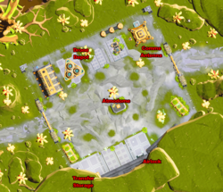

### Upgrades

Mining Laser Crystal (I through IV): power x2, x3, x4, x5

Oxygen Filters (I through III): halves oxygen consumption

Leg Servos: speed +10%

Adrenaline Injectors: sprinting speed +10%

Air Tank Expansion (I - III): 165, 215, 315

Storage Expansion (I - IV): +20, +30, +40, +50

Shock Absorbers: fall distance +50%

Electrostatic Field: dirty suit half as fast

GEM Chip: find gems +10% more often

Construction Drone: build mode

Excavation Lights: chassis lights for Roland

Gravity Tether Range (I - II): +25%, +25%

Gravity Tether Strength (I - II): x2, x4

Battery Capacity (I - III): +25%, +25%, +50%

Energy Recycling (I - III): refresh rate 0.25s(0), 0.20s(1), 0.15s(2), 0.10s(3)

Prospecting Lens (I - II): prospecting attempts +2, +2

### Lost World: Facility Epsilon

Okay, we're off to a whole new game world. Empty out most of your inventory and head back to Delta. This time when you enter the Caverns, you'll meet a new friend. Well, maybe? Hard to say. He seems a bit scatterbrained. And obsessed with hugs. 

The blast door is open and the Climber has arrived at Facility Delta, waiting to take us down towards Facility Epsilon. You might notice that the Climber has some amount of storage, which seems likely to be useful. And apparently our new friend's name is Stanley.

> #14 — Survivors?

Reaching Epsilon brings up the next main quest, [*Into the Darkness*](). Epsilon is creepily quiet, but honestly if that's the only thing wrong, we're not in such bad shape. To the SW of the climber is a thing that looks like a big yellow door. If you click on it, it appears to be some sort of cargo container. Sounds like a staging area to me. Don't miss the nearby blueprint, even if it is a duplicate ([Meteorite Drill Bit]()). Of the two doors, the one labeled "Airlock" is out of commission, so that just leaves the "Cargo Bay".

First order of business: get the lights back on. The rover to your right (SE), next to the Secure Storage cage, has a [Quakemaker Charge]() and a pack of [Medical Supplies](). The cage needs a key, not surprisingly, so we'll have to keep an eye out. The cargo container next to it has been hollowed out such that you can walk through it; this comes up a lot, so make sure you watch for containers you can walk through. The door to "Facility Control" beyond it is currently out of service, but the actual cargo container nearby has three [Packaged Foodstuffs]() and a [large Water Bottle]().

In the N corner is another container with some [Gold Ore]() and [Deepstone](), a new material we haven't seen before. (As per usual, picking up a new material for the first time activates production recipes back home, but in this case you'll need a [Superheating Kiln]() before you can do anything with it.) Behind that container — use your Suit Scan — there's a [Kalynite Drill Bit](). The crate in the middle of the room has some [Basic Electronics](), but the door to the cage beyond it is also disabled due to the lack of power. Finally, up against the side wall of the cage is a [medium Terraforming Charge]().

Hmm... that's interesting, these crates are awfully close together. I wonder if we can hop up on them and over the side of the cage? Bet you didn't realize this was a low-key platformer, too. Sorry about your knee, though, Maeve.

> Errata: who wrote this datapad

Now that we're inside the cage, we can scavenge a [Servomotor]() and read a datapad log. Turns out the [Loadmaster's Key](), which coincidentally is the thing we need to get into the Secure Storage cage, is in some sort of "fishing hab" near Kappa. The existence of a facility named Kappa is good news for Maeve and her quest to find her grandfather's claim... but who the hell goes *fishing* while on mining duty? More questions than answers here, for sure.

At least the generator is here inside the cage, and it resets just fine when you throw the switch. Turning the power back on catches Stanley's attention, but again, there are more questions than answers. It also unlocks the gate to this cage, which is good because we didn't really have a way out of here otherwise.

The next subgoal is to find the Control Room, and wouldn't you know it, I bet it's on the other side of that door marked "Facility Control" that we spotted earlier. Sure enough, that door works now, but it seems to lead into another storage room with yet another door, also marked "Facility Control", to your right (SE) beyond it.

First, though, check out this storage area. There's a *very* heavy vault door that seems to be sealing up some sort of bunker. Stanley seems pretty depressed about the whole thing, Roland doesn't want to check it out right now, and you can't do anything with the terminal anyway. The other door out of here leads to a short hallway and a door that's stuck half-open with "Crew Quarters C" beyond it. (This door never actually opens the rest of the way, no matter what you do.) Look closely enough and you might spot the "Airlock" on the other side. Maeve speculates that we might be able to get back in that way from the outside.

Now let's find the Control Room, just on the other side of the "Facility Control" door. There's a large command terminal in the center of the room; hit that and let Roland do some "code minion magic", and he turns up the plans for something that will let you take the Climber all the way back to the surface! Unfortunately, we're going to need to break some encryption to do so... so you get the blueprint for the [Bypass Mole](), a MacGuffin that we'll use several times throughout this region to break computer security and/or grant us access to all kinds of things. In fact, we need one of them to get into the bunker we found in the storage room.

There's not too much else in here, except for a can of [ARCola]() on one of the terminals and another Gaia Data Server that we can't do anything with yet. So head back to the Climber and click on the terminal in the center of the disc. This lets you dump some stuff into its inventory (100kg, at the moment). Hang on to that [Servomotor]() you found, but you can drop most everything else. Then head through the door marked "Airlock", which works now that you've restored the power.

> Errata: who wrote this datapad

However, you'll first pass through a waiting room. There's a datapad here with a journal entry ("confidential biographical source material", indeed) written by a biological expert who was called in to inspect Facility Theta, which was having some sort of "mycelial anomaly." That really doesn't sound good.

Pass through another door marked "Airlock" and you'll find... a third door marked "Airlock". But this is a larger room, with another rover, a door marked "Storage", and another marked "Crew Quarters A+B". The Storage room takes a keycode we don't have yet (it's `6980`, but you won't figure that out for a while). Crew Quarters B is off-limits. In Crew Quarters A you'll find rooms assigned to **Ncuti Sinclair**, **George Broussard**, **Grant Harlow**, and **Lisa Chapman**, which are all names you'll get to know. For now there's not much to do here, so head into the "Ready Room" where you'll find a Suit Charger (unsurprisingly) and, at long last, the actual exit door.

<figure>

<figcaption>Map of the Epsilon Courtyard (1k &times; 1k)</figcaption>
</figure>

You'll now hear a long conversation between Maeve and Roland (and Stanley) about this fantastic Lost World that you've stumbled upon. It's lush and green and basically the diametric opposite of the desert caves you've been exploring so far. However, there's no obvious source of oxygen at the moment, which is a significant problem. To fix that, find the atmosphere generator (on the map as Atmodome) that's next to a palm tree more or less straight in front of you. Next to that is a small crate; inside the crate is a [Power Cell](). Drop the cell into the generator and turn it on. Now you have air to breathe while you're chatting with your robot buddy.

In point of fact, there are *three* generators in this courtyard; the one you just enabled, a second by the Airlock door, and a third to the SW near another cargo container. They all need [Power Cells]() to reactivate them, so put that on your crafting list next time you're back in your outpost.

And what's this? Another big yellow wall segment that matches the one inside ("Transfer Storage" on the map). In fact, this is a storage unit with a 300kg capacity that you can reach from both here and the Climber room inside. It's an extremely helpful way to manage larger mining runs, especially in combination with the adjacent cargo container, and believe me, you're going to be doing some larger mining runs soon.

Speaking of mining, you're about to find a whole series of new mining nodes and new raw materials. The first and most obvious are the Gorgo Trees here in the courtyard. Cut one of them down with your mining laser and they drop [Biomass]() and [Pollen Stalks](). The stalks are useful for growing your own [Sugarplants]() back home, but we're missing several key pieces of tech before we can make that work. (The [Small Grow Bed]() is available at RAPP-2, but hold out a little while longer and we'll have some more fun with home genetics.)

Your real goal out here is to find the breaker and turn the exterior power back on so you can exit this courtyard. It's hiding behind the Comms Antenna in the NE corner, but you should explore the rest of the courtyard first. Behind the giant substation in the NW is the blueprint for the [Model 2 Oxygen Dome](), which is a significant upgrade in capability over the model 1. Next to that is a Storage Silo that can be targeted by various drone stations that you'll find throughout the Lost World; more on those when we come across them.

You'll also find a datapad with a conversation between **Caleb Vihaan**, an archaeologist and a name we've seen before, and our friend **Dr. Tanya Li**. Apparently Facility Lambda has a number of fossils that were worth investigating, and there's something about a "prospecting bench" that sounds intriguing. This adds [*Skeletons of the Past*]() to your mission list. There's also a [Tangrite Drill Bit]() which you can use to activate either the Meteorite or Gold drills back up in the caves near Delta.

The Comms Antenna doesn't do much for us right now apart from hiding the generator, so give that thing a swift kick and get the courtyard power working again. (Sorry, you still need to put [Power Cells]() in the atmosphere generators to get them to produce oxygen. You'll be doing that a lot down here.)

> #15 — Into the Heart of Darkness

From here you have a couple of options; Facility Kappa is through the gate to the West, and the gate to the East takes you up towards Facility Lambda. The East gate also needs that [Servomotor]() that you brought with you before it will open. In fact, take this note right now: as you explore the Lost World you're going to want to keep a handful of [Power Cells]() (for activating Atmosphere Generators) and [Servomotors]() (for repairing broken courtyard gates) handy. There's usually a way around if you get stuck, but if you have one of each on you it will make exploring the area faster.

Reaching either facility involves entering areas of higher oxygen drain, so for now I recommend you explore the area outside the courtyard and get used to this new biome. The Lost World is vast and it can be pretty confusing at first, until you figure out how to find and follow the roads that lead you between facilities. (Hint: look for the Lightsticks.) So for now, let's do some mining. There's a whole bunch of new stuff to find, including:

- Uneven terrain that's hard to navigate.
- Sparkling lakes with blue mushrooms ([Lifeshrooms]()) nearby, which are safe to bathe in. Doing so rinses the dust off your suit, which is purely a cosmetic thing that you probably wouldn't even notice if I hadn't said anything.
- [Deepstone](), which is the "default" stone down here, kind of like [Sandstone]() was in the Caverns. Deepstone is heavy and you'll get real sick of carrying it around, but it sells for a reasonable price and you'll need some of it for crafting.
- Cyan-colored [Bladestone]() nodes, which produce a new gemstone.
- Gold nodes, which you've seen plenty of before.
- Brown-colored [Greatwood]() nodes hanging off of absolutely ginormous trees. Greatwood isn't actually useful for anything, but it has a pretty high price-to-weight ratio. You might also collect some [Living Amber]().
- Purple-colored Tangrite nodes. [Tangrite Ore]() is super-useful in the next round of crafting projects, and [Foucer Crystals]() are an essential crafting ingredient (don't sell them!). This also grants you the production recipe for [Hardened Glass](), and eventually, the ability to combine Tangrite and Kaloxite to make slightly cheaper [Tangrite Bars]().

Have some fun. Take a look around. Collect some new materials. Learn how to spot the "roads" and find your way back to Epsilon. Try not to fall off any cliffs. Don't go over any bridges or down any slopes just yet. Use the Transfer Storage to stage stuff. You might want to move the one Power Cell you currently have into the Atmosphere Generator next to Transfer Storage to make it easier to use. (Yes, you pull the Cell out of a working Generator; this is handy to remember in case you need one in a pinch.)

> Errata: whose datapad

One more thing we'll do before we go: take the West gate, find the signpost pointing you towards Kappa, and turn slightly NW. Don't go down the hill; we're interested in the thing that looks kind of like a mining drill but not quite. It's actually a mining *laser*, and instead of a drill bit it takes a [Tangrite Focusing Lens]() as well as a [Model 2 Cargo Drone](). Unfortunately, all it produces is Deepstone, which we don't really care that much about. There's also a datapad here that suggests that a Tangrite Lens was delivered to Drill Site IV in a crate with the code `9970`, so there are apparently several more drill sites down here for us to find.

Head back inside to the Climber room. Pull your new mining riches out of Transfer Storage and dump a bunch of it into the Climber's storage. For now you'll still have to carry it by hand from Delta, out the back door, and over to your outpost, so the extra carrying capacity of the Climber will only do you so much good. But you are playing a mining simulator, and if shuffling raw materials between storage units like this feels boring to you, how on earth did you get this deep into this walkthrough?

Now that you're back home, you should have a bunch of new crafting recipes to play with. If you haven't purchased the blueprint for the [Superheating Kiln]() yet, you should. Don't buy the [Horizontal Wind Turbine]() though; we'll pick that one up for free momentarily. If you have the resources, craft a handful of [Power Cells](), [Bypass Moles](), and [Servomotors](). You should also have an eye on the *Oxygen Filter III* upgrade ($50k, ouch), which will make exploring the outer mining facilities in the Lost World much easier.

Grab one [Bypass Mole]() and bring it back down to Epsilon's Control Room to hack the central console. You'll get some hints as to what awaits us on the lowest level: Facility Omicron, the "borehole facility"; Rho, power; Sigma, comms; Tau and Iota, materials refinement and research; and Omega, science research. Sounds intriguing! Irrelevant to us for several more hours of gameplay at the earliest.

> Errata: Can you slot a Mole into the Epsilon Bunker door yet? Does it do you any good to do so?

You also score the blueprint for the [Crater Climber](), which is a surface facility that allows the Climber to connect all the way up to the surface such that the run through Delta and out the back door becomes basically obsolete. Except you need [Jaspite Bars]() to build it, so you'd better get on finding some of those nodes. It's so helpful that I'm tempted to tell you to set everything else aside until you can get it done, but in practice, you'll need several earthquakes to reset the Jaspite nodes near Lambda before you can mine enough to build the thing. You'll also need to make a few runs specifically for Gold (probably to the plains around Delta, although there are Gold nodes near Epsilon too) to craft enough [Servomotors](), too. 

