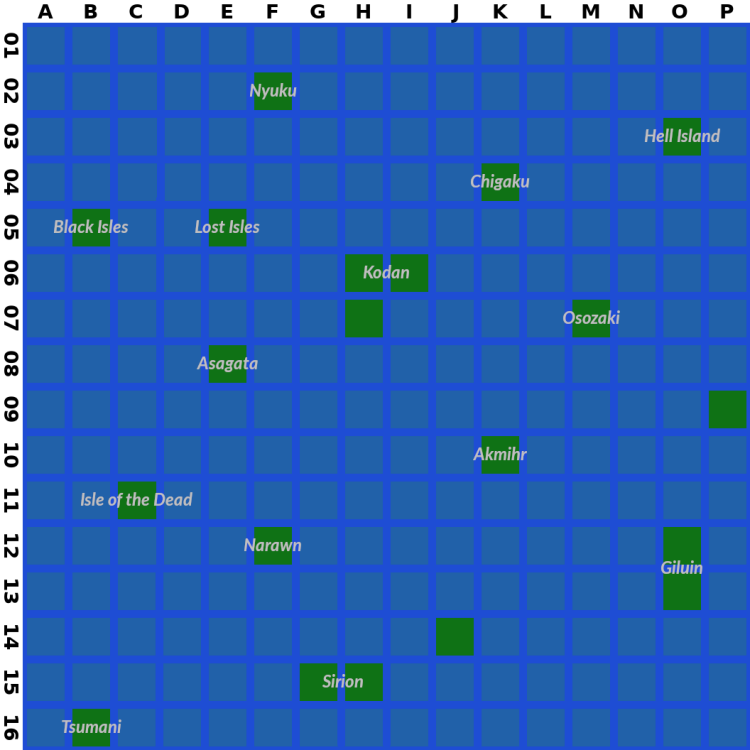

# Yet Another Deathlord Walkthrough

Version 2.1, June 2023

## Administrivia

[](https://creativecommons.org/licenses/by-nc-sa/4.0/)

This walkthrough is copyright (C) Ben Cordes, 2017–23. It is made available under a [Creative Commons Attribution-NonCommercial-ShareAlike v4.0 International License](http://creativecommons.org/licenses/by-nc-sa/4.0/). See link for more details.

All other trademarks and copyrights contained in this document are owned by their respective trademark and copyright holders.

### Acknowledgements

*Deathlord* is a notoriously difficult game for its era, and relatively non-linear from a time where that wasn't common, but still I'm surprised that this seems to be the first "complete" walkthrough for it. However, as usual, I would be remiss if I didn't recognize the giants on whose shoulders I stand.

**Andrew Schultz** wrote a humor walkthrough that prioritized narrative over hints, but it's his automatically-generated color maps that really made a difference for me.

**Wilson Lau**'s Deathlord FAQ and dump of the conversational strings were both excellent points of reference.

All of the above can be found at [GameFAQs](https://gamefaqs.gamespot.com/appleii/574838-deathlord/faqs/).

A blogger named **Genpei** wrote a ["let's play"-style blog](http://obscureoldgamer.blogspot.com/) at roughly the same time that I was writing the first version of this walkthrough. His diary, as well as our conversations on the CRPG Addict's website, were very helpful.

**Henri Asseily** corresponded with me after reading an earlier version of this walkthrough and gave me a bunch more information about the internals of the game; check out his [Deathlord Relorded](https://github.com/hasseily/Deathlord-Relorded) project if you're looking for a different playing experience. 

And finally, a shout-out to **Chester**, the [CRPG Addict](https://crpgaddict.blogspot.com/), whose blog is totally worth reading and who unwittingly prompted me to play this game again and take notes so that I could write this document.

### Version History

- v0.9, September 2017: completed playthrough and first pass of text
- v1.0, February 2018: finished narrative, released to GameFAQs
- v1.0.1, February 2018: spellchecking (oops), rewrite spell descriptions
- v2.0, June 2022: update to CC4.0 license; major rewrite in GameFAQs HTML format; corrections, edits, and updates
- v2.1, June 2023: reformat for GitHub Markdown

### Game Introduction

Ah, *Deathlord.* If this is your first time playing, you're in for a treat. You're also in for an experience that's widely known as one of the hardest CRPGs of its era. At first glance, the top-down interface makes it look a bit like a straightforward party-based descendant of *Ultima*, but the realization quickly sets in that you are going to be given absolutely no mercy whatsoever by the developers. Among *Deathlord*'s most charming "features" is its use of permadeath. The moment a character dies – even in the middle of combat – the game saves state to disk, so that even if you reset the computer, your character has already been permanently killed.

This is merely one example of the ways in which *Deathlord* hates you. We'll talk about lots more as we explore the world together.

It's worth your time to look up and read some of the interviews with the creator of *Deathlord*, Al Escudero. You'll learn a few fun facts, like the fact that EA forced him to rebrand everything from a Norse them to a Japanese theme inside of a few months, which explains why some of the game text didn't get updated in time: Wakiza has a sign calling it Oceana, the emperor tells you to go to Oceanspray, etc. If you speak Japanese, apparently some of the translations are hilariously bad; check out Genpei's blog for examples (link in the [Acknowledgements](#acknowledgements)).

My favorite part, though, is the bit where the developer admits that the game is basically much harder than he intended. The story goes that there was a QA team working on the project that had played the game through multiple times, so he kept increasing the difficulty level in order to make their job more interesting. Which is to say that even if you know what you're doing – say, because you're reading my walkthrough – it's still a damn hard game to play.

Well, okay, it's a lot easier if you cheat using modern retrogaming techniques like backing up your disk images and using emulator snapshots. But I digress.

I'm assuming you've looked up a copy of the game's manual. It will teach you the keyboard commands and a little bit of the backstory. The most important thing the manual has to teach you is right there on page one, in the guise of a message from the Deathlord himself: in order to win, you will need to find seven words and six magical items.

However, the manual is also full of misinformation. There's a misprint on the "minimum stats" table, and the arms-and-armor table is flat-out wrong. This is the second most important thing that the manual has to teach you: some significant portion of the information you will learn in the course of this game is **incorrect**. This will come up later in the context of clues you get from NPCs, for instance.

So, don't spend too much time with the manual. I've got you covered on most things you need to know.

### Managing Save Files

One of the things that makes *Deathlord* so brutal is the autosaving and permadeath. There's only one save slot, unlike even other games of its era, and the process of backing up your save game is laborious and incredibly slow. But, of course, you're "retrogaming", which means you get the benefit of an emulator that makes things like swapping disks easy, and might even offer you the ability to save a snapshot of the current emulator state.

My favorite Apple II emulator is `linapple`, which accepts disk images in two formats. "Flat" images (`.dsk`) are a representation of all of the bytes stored on the disk in a linear array. "Nibblized" images (`.nib`) are a relatively faithful and unfiltered stream of data that might have been read off an actual Apple II floppy disk. Most of the flat images I found online were cracked versions that don't work, so I recommend that you find nibblized versions; you should be able to find them from the Asmiov archives and/or the Home of the Underdogs. There are other disk formats out there if you use other emulators; good luck.

Before you go any further, exit the emulator and back up the .nib files for the Boot, Master Scenario A, and Master Scenario B disks. Put the backups somewhere else, so if all else fails, you have clean copies that you can use to restart the game. Now boot the game, use the *Utilities* menu to "Make Scenario Disks", and let the game make playable Scenario A and B disks for you. Then you can start creating characters.

This isn't an emulator tutorial, but I'll just say this: back up early, often, and gratuitously. Back up your "clean" Scenario disks before you start making characters, and you'll never have to use the in-game disk utilities again. Back up the Scenario disks again after you make characters, and if something goes wrong outside Kawa, you'll have a fresh party to start with. *Every time you save your damn game*, back up your Scenario disks again.

I promise, this one tip will change *Deathlord* from an edge-of-your-seat festival of frustration into a far more ordinary CRPG.

When you start the game, tell it you have two drives, and load the images for Scenario A and B into drives 1 and 2. That way the game will manage which disk your party is currently on, and you won't have to swap disk images in and out. Of course, there are reasons you might *want* to manage the disk images yourself...

**Save-scumming:** Whenever a random boon is about to be bestowed upon you (i.e. random hit points from training, or the effects of a magic pool), save your game and back it up, then do the thing. If you're not happy with the result, reload. This is even easier if you use an emulator with save states; in linapple, hit `(F12)` to save the emulator state and `(F11)` to reload. This way you can maximize your HP per level and always get +1 to the stat you want from magic pools.

**Disk-swapping:** Most story progress in the game is based on inventory: you can't see Hell Island unless you have the Sharktooth. However, each town also saves some state about itself on the Scenario disks. If you turn a town against you, it saves a bit of information to disk so the next time you come back it remembers. If you ever want to reset the state of a town, here's how:

1. Approach the town. Press `(E)nter` but don't pick a direction yet.
2. Replace the scenario disk in the drive with a clean / unplayed copy. (You'll have to discover for yourself which towns are on which Scenario disk.)
3. Enter the town. The game loads the town state from the clean scenario disk.
4. Replace the clean scenario disk with your play disk.
5. Save the game (or just continue on your merry way).

**Disbanding your Party:** The Boot disk has a feature that allows you to disband the current game on a Scenario disk. This releases all the characters back into the "pool" of generated characters. You can then reform a "new" party and "restart" the game on Kodan near Kawa. Your characters will be in the same state you left them (money, equipment, and levels all intact, but so is death), and if you don't swap in fresh Scenario disks, the world state will be as you left it. This includes things like where you left your boat, but you can always buy a new one in Tokugawa. This can come in handy if you get stuck deep in a dungeon you don't know how to get out of.

**Duplicating Items:** A combination of disk-swapping and disbanding your party, as above; this one takes some doing, but if you absolutely have to have two Sunspears, it's the way to go. Start off by sailing back to Kodan and leaving your boat near Tokugawa; that way, when you come back, the boat will still be there and you can be on your way immediately without needing to buy a new one.

1. `(Q)save` your game, then quit the emulator. Duplicate your Scenario A disk; I'll call these **A1** (the play disk) and **A2** (the duplicate). If you want to be really paranoid, make a third copy just in case something goes wrong.
2. Restart the emulator from the Boot disk. Go to Character Options (insert **A1**). Then Disperse the Existing Group (hit `(Enter)`).
3. Conjure a new character. Call them 'Mule', because that's what they are. Literally nothing about them matters; you can make a Kosaku if you want.
4. Assemble a Group with the PC(s) carrying the item(s) you want to duplicate and the Mule. Then Return to the Main Menu (insert the Boot disk).
5. Play a Game (insert **A1**). As soon as the game starts, `e(X)change` the item(s) from the PC to the Mule. `(Q)save` your game.
6. Insert the Boot disk and reboot the emulator. Go to Character Options again (insert **A1**). Then Disperse the Existing Group (hit `(Enter)`).
7. Terminate everyone in your former party. Don't terminate the Mule.
8. Insert **A2**, then select Disperse the Existing Group (hit `(Enter)`) again. You should now have a character roster containing all of your original characters (including the one who has the item you just duplicated) and the Mule (who also has the item you just duplicated).
9. Assemble a Group with the Mule and the PC you want to give the duplicate item to.
10. Return to the Main Menu (insert the Boot disk), then Play a Game (insert **A2**). `e(X)change` the item from the Mule to the PC. `(Q)save` your game.
11. Insert the Boot disk and reboot the emulator. Go to Character Options again (insert **A2**). Then Disperse the Existing Group (hit `(Enter)`).
12. Insert **A1**, then Assemble your original group again. Return to the Main Menu (insert Boot) and Play a Game (insert **A1**).

Congratulations, you now have a party with two Sunspears (or whatever). Of course, if you're willing to go to these lengths, you might consider [hex editing](#hex-editing) an emulator save state and manually changing the inventory byte, which is definitely faster and probably easier.

### Getting Around and Getting Along

*Deathlord* uses a top-down view, similar to the *Ultima* overland interface, moving north-west-east-south with the I-J-K-M cluster common to Apple II games of this era. However, instead of the first-person isometric wireframe dungeons of *Ultima* or *Wizardry*, here you'll stay in the top-down perspective throughout.

Game time passes with real time: during outside exploration, 10 game-world minutes tick off roughly every 15 real-world seconds. Indoors, game time ticks over about half as fast. Otherwise, actions occur on a turn-by-turn basis; every time you move, the rest of the world updates. If you stand still for too long (roughly 6 seconds) and don't do anything, the game issues a *Wait* command for you. You can stop this from happening by typing the first letter of a multi-character command (like `(C)ast` or `(V)iew` or `(F)search` or `(O)rate`), but keep in mind that you will spend one turn regardless of whether you execute or cancel the command. Likewise, inspecting a character consumes a game turn. `linapple` lets you use the Pause key to actually pause emulation.

By contrast, time pauses completely for the duration of combat. You can wait at a combat prompt for as long as you like without consequence.

*Deathlord* has a functional day-and-night cycle. The sun starts to set at 6pm, at which point your visual range (when outside) drops 1 square in all directions once an hour, until it gets totally dark at 9pm. You can `(L)ight` a torch, which gives 1 square radius of light while outside (or 2 squares in a dungeon), but be careful when you're walking around swamp. Torches only last an hour or so outside, and light spells don't work outside at all. The sun starts to rise at 4am and is full again at 7am.

The phase of the moon doesn't seem to affect anything, but it's there for color and atmosphere.

Most of the other commands are available in the manual, but I want to point out a couple of particularly important tidbits:

When you fall into a pit (and you will), you need to use caret `(^)` to climb out of it. (Of course sometimes that doesn't work and you slip back in, but that's not important right now.)

When casting a spell, the game asks you to type the name of the spell. You also have the option of typing slash `(/)` or question mark `(?)`, which brings up a menu of all spells that you're able to cast right now. Use the up and down arrow keys to cycle through the menu, then hit Enter to select a spell.

The user interface is reasonably configurable for a game of this era. If you want to toggle the sound, use `(control-S)`. You can change the speed at which combat messages print with colon `(:)`. Lower numbers are faster, and 0 is an acceptable number. Note that both of these commands count as an "action" and will consume a turn, **including in combat**. The role-playing nature of asking your Mahotsukai to slow down the combat messages, while entertaining in text, is not so gratifying when doing so forces you to pass on a chance to cast a spell.

One of the more interesting features in the *Deathlord* interface is the ability to record macros. A macro is a sequence of key presses that can be replayed when you're walking around. (You can't use them in combat, unfortunately.) Useful macros include things like:

> `C` (number of your Shisai) `NASU,`

In a macro definition, the comma represents the Enter key, so this binds "have your Shisai cast NASU" to a macro key. Note, though, that the macro execution continues even if there's an error, so if you rearrange your party and `C4` selects someone who can't cast a spell, the engine will happily continue typing `NASU<enter>` anyway.

To record a macro:

1. press `(control-A)`
2. pick a macro number `(1-4)`
3. type the string of characters (e.g. `C4NASU,`)
4. hit Enter

To play back a macro:

- Macro #1: ampersand `(shift-7)`
- Macro #2: apostrophe `(')`
- Macro #3: open paren `(shift-9)`
- Macro #4: close paren `(shift-0)`

**Bonus Computing History Lesson!** On the original Apple II keyboard, the number row looked like this:

| !    | "    | #    | $    | %    | &    | '    | (    | )    |      | *    | =    |
| ---- | ---- | ---- | ---- | ---- | ---- | ---- | ---- | ---- | ---- | ---- | ---- |
| 1    | 2    | 3    | 4    | 5    | 6    | 7    | 8    | 9    | 0    | :    | -    |

(The zero key didn't have a punctuation mark on it.)

Caret `(^)` was shift-N; lower case letters weren't a thing on the original Apple II. By the time the Apple IIe rolled around, shift-7 was ampersand and the apostrophe had moved down next to the Enter key where we're more familiar with it today. That's why the macro activation keys are in a weird place on modern keyboards.

**Terrain:** As you explore the world you'll run into a number of different kinds of terrain. You can always `(V)iew` a square to learn what type of terrain it is. Terrain falls into a couple of different types:

- *Clear:* Grass, Scrub, Desert-Sand, Desert-Scrub, Tundra, Bush, Snow-Swamp
  These terrain types block neither your movement nor your line of sight.
- *Opaque*: Forest, Snow-Pines, Hills, Steppe
  These squares block your line of sight, but you can move through them.
- *Blocking*: Mountain, Snowcap
  You can't move or see through mountains.
- *Painful*: Swamp, Cacti
  Walking over these squares causes damage to everyone in your party. Cacti are also *Opaque*, i.e. they block your line of sight. Weirdly, Snow-Swamp squares aren't *Painful*.

Also, perhaps obviously, there's *Water*, which you either need a boat to sail over or G6:UKU to walk over (indoors only, which includes in towns).

You will also discover a number of *energy fields* on your travels. These fall into two categories:

- *Rakhammon's Curtain* (purple/green): The only way to pass through one of these is to `(U)se` a Blue Crystal, which allows you to step into a Curtain.
- *Arkhan's Wall* (red/blue): You can step over these normally, but they eat 50% of your current HP when you do. `(U)sing` a Crystal doesn't help.

**Talking**: One of the most important skills for *Deathlord* players is talking to NPCs. You'll do this in order to learn clues as well as interact with merchants. Walk up next to an NPC and start a conversation with `(O)rate`. You then have several options:

- `(C)hat`, which randomly repeats one of 16 fixed messages of varying utility (see below). Because it's random, you sometimes get really hilarious combinations (Senju tells you to "Find Senju", or better, "Leave me alone").
- `(T)alk`, which gets you a phrase that is specific to the NPC you're speaking with. These are also of varying utility, but often yield key words that you can ask about.
- `(I)nquire`, which allows you to free-enter a key word. If the NPC knows anything about it, they'll tell you. However, every NPC in a location knows exactly the same set of key words, so you don't have to find someone specific to ask. (This also sometimes results in hilarious combinations.) Most of the time, *Deathlord*'s parser is smart enough to recognize both a word (dungeon) and its plural (dungeons).
- `(B)uy` and `(S)ell`, which obviously only work on merchants. If you get stonewalled when asking for a `(T)alk` clue, you may be speaking with a merchant, so try `(B)uy`. Of course, you may also be speaking with a hostile that's about to attack you.
- `(O)ffer (G)old`, entered as `(OG)`, which is useful when someone's `(T)alk` phrase is "PAY UP!". (I've marked clues found this way with "($$)".) This can be as low as 10gp or as high as 100gp, and there's no way to know without just trying it. Note that just because someone wants a bribe doesn't guarantee that they have anything useful to say. "Thanks, sucker!" is a not uncommon response.
- `(O)ffer (I)tem`, entered as `(OI)`, which is only useful in a handful of specific places, mostly dealing with the Emperor, and I'll tell you about them when we get there.
- `(Esc)` or `(Enter)` ends the conversation.

In alphabetical order, here are the 16 messages you'll get in response to `(C)hatting` with an NPC:

- Demons are deadly
- Don't get caught outside at night
- Find Senju
- Find the words
- Hello
- Kobito hide gold
- Leave me alone
- Look to the north
- Map dungeons
- Ruins are rich
- Seek the seven
- Ships get stolen
- Things are tough all over
- Time is short
- Watch out for the storms at sea
- Watch your back

The useful ones are:

- *Map dungeons*: You should definitely try, although several of them do their best to confounding pen-and-paper mapping. And you should also map towns!
- *Find Senju*: Indeed, he is crucial to winning the game.
- *Ships get stolen*: I've never had my own ship stolen, but you can steal a boat by `(A)ttacking` it. (Always try `(B)oarding` it first; it might just work.)
- *Find the words* and *Seek the seven*: In order to win, you will need seven words to get through seven gates. The only other clue you get to this is the Deathlord's message at the beginning of the manual.

In addition, **Senju**, **word**, **ruin**, and **dungeon** are good things to `(I)nquire` about.

The rest of the hints are misleading, wrong, or pointless. There's nothing special about the North, there's no time limit on the game, and there are no storms at sea (although there are plenty of nasty monsters). Kobito rarely have much in the way of gold (the Mines being an exception), and ruins don't tend to be very rich (or they all get picked over before you get there). Demons are kind of deadly, but not significantly more so than any other creature.

## Creating Characters

Unlike some later games that have skills, 'derived' or 'secondary' attributes, or 'advancement points' that can be spent on various aspects of your character, *Deathlord* uses a stripped-down set of attributes. Creation involves six steps, described briefly here and in more detail in the following subsections.

1. Pick a race, which determines the range of each attribute.
2. The game rolls seven attributes for you within the racial min/max.
3. Pick from the list of allowed classes based on the attributes that were rolled, or choose to re-roll if you don't see something you like.
4. Pick an alignment (good / neutral / evil). Some character classes restrict your choice (Kishi can only be Good, Ninja can only be Evil, etc.) Alignment is irrelevant except that you can't assemble a party that has both Good and Evil characters in it.
5. Pick a gender (male / female). Character gender is completely irrelevant; certain magical effects can change it mid-game.
6. Pick a name. You can rename characters with the "Character Utilities" function on the Boot disk.

### Attributes

*Deathlord* uses the standard six D&D attributes, plus one for mana. The manual gives a bunch of handwaving descriptions of what the stats are good for, which is why this section isn't full of more definitive answers. Anything that I'm vague about here is based on my experience and observation, and may not be correct.

- *[STR]ength* affects both to-hit and damage, even for missile weapons, as well as your ability to `(S)mash` down doors.
- *[CON]stitution* affects the number of hit points gained per level.
- *[SIZ]e* affects your ability to smash doors.
- *[IQ]ntelligence* is supposed to affect several things, but evidence is scant. Higher IQ might grant bonuses to spell damage. The rate at which POW replenishes is supposed to be affected by high IQ, but I didn't notice a significant difference between IQ14 and IQ18.
- *[DEX]terity* affects your ability to pick locks. It's also supposed to affect your chance to dodge attacks, but it's hard to tell. I suspect it also affects your to-hit chance. Unlike other CRPGs, it doesn't affect your armor class.
- *[CHA]risma* affects the price of training (but only on the order of a handful of gp per level) and the chance to `(N)egotiate` with monsters.
- *[POW]er* is your "mana" stat. Casting a spell costs 1pt of POW per spell level, so a third level spell costs 3 POW, etc.

Stats have a minimum of 3 and a maximum of 21, except for POW which is effectively unlimited.

Attributes don't increase through leveling or any other mechanism. The only way to improve a stat is to `(Z)drink` from a [magic pool](#using-magic-pools), which can be found in some dungeons (there are ~50 in the entire game). Even then, magic pools only grant a stat boost a small portion of the time. They also have a number of other effects (some good, some bad) which we'll talk about later.

The exception to the "no increases" rule is POW; characters capable of using magic gain +1 maximum POW every even-numbered level. Note that when inspecting a character, only the current amount of POW is shown. There is no indicator of maximum POW; you just have to remember. POW regenerates naturally with time.

#### Game Mechanics

Much of the data in this section is based on my own recordkeeping, and the rest of it is thanks to Henri Asseily who did a bunch of digging into the actual assembly code to discover the algorithms used. Some of these numbers will be a little inaccurate due to the exact mechanism by which the game generates random numbers, but they're close enough for our purposes. See Henri's work, linked in the [Acknowledgements](#acknowledgements), for more detail if you're curious; I also talk about it a bit more under [Weird Stuff](#weird-stuff).

If you're used to the d20 tabletop RPG system or any of its descendants, you've seen this scale before:

| **Attribute** | 3    | 4    | 5    | 6    | 7    | 8    | 9    | 10   | 11   | 12   | 13   | 14   | 15   | 16   | 17   | 18   | 19   | 20   | 21   |
| ------------- | ---- | ---- | ---- | ---- | ---- | ---- | ---- | ---- | ---- | ---- | ---- | ---- | ---- | ---- | ---- | ---- | ---- | ---- | ---- |
| **Bonus**     | -4   | -3   | -3   | -2   | -2   | -1   | -1   | 0    | 0    | +1   | +1   | +2   | +2   | +3   | +3   | +4   | +4   | +5   | +5   |

Whenever I say something like "CON modifier" in this section, look up your raw CON attribute on the top row and find the modifier on the bottom row.

**Attack rolls:** The exact formula is unknown, but it's affected by class, level, STR modifier, DEX modifier (I think), the weapon you're using, and your opponent's AC. More details under [Combat Basics](#combat-basics).

**Attack damage:** Each attack that hits, melee or missile, gets a damage bonus based on your STR modifier.

**Max HP per level:** Each time you go up a level, your Max HP stat increases by a die roll (based on your class, see [Character Classes](#character-classes)) plus your CON modifier. This is not retroactive, so get your magic pool stat increases in early if you can.

**Smashing doors:** Your chance to break down a door is the sum of your STR and SIZ (raw scores, not modifiers), so Trolls top out at around a 42% chance.

**Picking locks:**

- Start with a base chance of 0%.
- +2% per point of DEX over 12 (so, DEX 14 = 4% base chance).
- +3% per level if you're a rogue-like class (Yakuza, Ansatsushi, Ninja, Shukenja).
- +8% if you're actually a Yakuza.
- +4% if you're **not** a rogue-like class. (Level is irrelevant.)

**Searching for traps:** Based solely on [race](#character-races-with-attribute-ranges); ignores class, level, and DEX.

### Races and Classes

*Deathlord*'s races are roughly based on *Dungeons & Dragons*, with Oriental labels slapped on some (but weirdly not all) of them.

#### Character Races, with attribute ranges<a name="character-races"/>

| Race     | D&D Equivalent | STR   | CON   | SIZ   | IQ    | DEX   | CHA   | POW   | Find traps |
| -------- | -------------- | :---: | :---: | :---: | :---: | :---: | :---: | :---: | :--------: |
| Human    | Human          | 03–18 | 03–18 | 08–18 | 03–18 | 03–18 | 03–18 | 03–18 | 35%        |
| Toshi    | Elf            | 03–13 | 03–13 | 03–12 | 08–19 | 08–19 | 07–18 | 08–19 | 59%        |
| Nintoshi | Half-elf       | 03–15 | 03–15 | 05–14 | 06–18 | 06–18 | 05–18 | 05–18 | 50%        |
| Kobito   | Dwarf          | 08–19 | 08–19 | 03–08 | 03–16 | 03–16 | 03–16 | 03–16 | 68%        |
| Gnome    | Gnome          | 05–18 | 08–18 | 03–06 | 03–17 | 06–18 | 03–16 | 03–17 | 68%        |
| Obake    | Drow           | 03–15 | 03–16 | 03–07 | 03–14 | 08–20 | 03–14 | 03–18 | 39%        |
| Troll    | Ogre / Orc     | 11–21 | 11–20 | 13–21 | 03–11 | 03–13 | 03–09 | 03–12 | 29%        |
| Ogre     | Half-orc       | 08–19 | 08–19 | 11–19 | 03–13 | 03–13 | 03–11 | 03–14 | 29%        |

#### Character Classes

Some classes are restricted to certain alignments. You can't have both Good and Evil characters in your party, and note that taking a Shisai will force you to choose one or the other. I'll elaborate on the 'Why' column in a later section.

| Class      | D&D Equivalent | Spells | Alignments | HP/Lvl | Why / Why not?                              |
| ---------- | -------------- | :----: | :--------: | :----: | ------------------------------------------- |
| Senshi     | Fighter        |        | G-N-E      | 10     | Broad access to weapons and armor           |
| Kishi      | Paladin        | Shisai | G          | 8      | Spells, unique weapons                      |
| Ryoshi     | Ranger         | Shizen | G-N-E      | 9      | Less armor                                  |
| Yabanjin   | Barbarian      |        | G-N-E      | 12     | Most HP, less armor                         |
| Kichigai   | Barbarian      |        | G-N-E      | 11     | Unique weapons, less armor                  |
| Samurai    | Fighter        |        | G-N-E      | 9      | Unique weapons                              |
| Ronin      | Dark Paladin   | Shisai | E          | 8      | Unique weapons                              |
| Yakuza     | Rogue          |        | G-N-E      | 6      | Best lockpick                               |
| Ansatsusha | Assassin       |        | E          | 6      | Lockpicking                                 |
| Ninja      | Monk           |        | E          | 7      | Lockpicking, unarmed attacks, critical hits |
| Shukenja   | Monk           | Shisai | G          | 5      | Lockpicking, unarmed attacks, spells        |
| Shisai     | Cleric         | Shisai | G-E        | 8      | Healing spells                              |
| Shizen     | Druid          | Shizen | N          | 8      | Utility spells                              |
| Mahotsukai | Mage           | Mahot. | G-N-E      | 4      | Offensive spells                            |
| Genkai     | Illusionist    | Genkai | G-N-E      | 4      | Spells to flee from battle                  |
| Kosaku     | Peasant        |        | G-N-E      | 6      | Useless                                     |

#### Race/Class Matrix

You can't pick a class unless (a) you've chosen an allowed race and (b) the rolled stats meet the minimums. Note that the matrix in the manual is wrong in several places: Kishi and Shizen have Charisma requirements, and almost everyone has a minimum Dexterity.

| Desired Class | Hum           | Tos  | Nin  | Kob  | Gno  | Obk  | Trl  | Ogr  | ST   | CN   | IQ   | DX   | CH   | 
| ------------- | ------------- | ---- | ---- | ---- | ---- | ---- | ---- | ---- | ---- | ---- | ---- | ---- | ---- |
| Senshi        | ✓             | ✓    | ✓    | ✓    | ✓    | ✓    | ✓    | ✓    | 11   |      |      | 9    |      |
| Kishi         | ✓             | ✓    | ✓    |      |      |      |      |      | 11   | 13   | 11   | 11   | 13   |
| Ryoshi        | ✓             | ✓    | ✓    |      |      |      |      |      | 11   | 13   | 11   | 11   |      |
| Yabanjin      | ✓             |      | ✓    | ✓    | ✓    | ✓    | ✓    | ✓    | 13   | 13   |      |      |      |
| Kichigai      | ✓             |      | ✓    | ✓    | ✓    | ✓    | ✓    | ✓    | 13   |      |      | 11   |      |
| Samurai       | ✓             | ✓    | ✓    |      |      | ✓    |      | ✓    | 11   | 11   |      | 13   |      |
| Ronin         | ✓             | ✓    | ✓    | ✓    | ✓    | ✓    | ✓    | ✓    | 13   | 11   | 11   | 11   |      |
| Yakuza        | ✓             | ✓    | ✓    | ✓    | ✓    | ✓    | ✓    | ✓    |      |      |      | 13   |      |
| Ansatsusha    | ✓             | ✓    | ✓    | ✓    | ✓    | ✓    | ✓    | ✓    | 11   |      |      | 13   |      |
| Ninja         | ✓             | ✓    | ✓    |      |      | ✓    |      |      | 11   | 13   |      | 15   |      |
| Shukenja      | ✓             | ✓    | ✓    |      |      |      |      |      | 11   | 13   | 11   | 13   |      |
| Shisai        | ✓             | ✓    | ✓    | ✓    | ✓    | ✓    | ✓    | ✓    |      |      | 11   | 9    |      |
| Shizen        | ✓             | ✓    | ✓    | ✓    | ✓    | ✓    |      | ✓    |      |      | 11   | 9    | 11   |
| Mahotsukai    | ✓             | ✓    | ✓    |      |      |      |      |      |      |      | 11   | 9    |      |
| Genkai        | ✓             | ✓    | ✓    |      | ✓    |      |      |      |      |      | 11   | 9    |      |
| Kosaku        | ✓             | ✓    | ✓    | ✓    | ✓    | ✓    | ✓    | ✓    |      |      |      |      |      |

### Assembling a Party

More than others, this section is completely, totally, 100% my opinion. But it seems like most good walkthroughs come with at least some mention of how the author thinks you should build a party. This describes the party that I beat the game with; there are many, many other ways to build a successful party.

Before we start, you need to know that *Deathlord* uses a 3+3 turn-based combat system (see [Combat Basics](#combat-basics)). Specifically, this means that only the front three can use weapons to attack, so generally you're going to want three fighters for the front ranks and three casters in the back. There are some tweaks to that, though, which we'll talk about in a second.

Let's start with character races. I generally play a part of six Humans. Why? I find the only good reason to take a demihuman is their ability to `(F)search` for traps and secret doors. Searching isn't guaranteed to work, and you may be able to reduce your frustration by carrying a Kobito or Gnome around. Or, at least, reduce the number of times you have to hammer `(F)` to prove that there's no trap or secret door here. But I don't get frustrated by this easily, partially because I play with pre-drawn maps.

Apart from that, you've got the race-locked missile weapons, the Kobito Hammer – yes, the 'Hammer' is a *missile* weapon, not that it really matters – and the Toshi Bow. The Toshi Bow is pretty fearsome (3 attacks at 1–8 plus a nice AC bonus), but I can't see putting a Toshi in the front lines – remember, you can't attack from the back three, even with a missile weapon – with a max of 13 CON and praying for a Toshi Bow to drop while they find secret doors faster than a Human. Kobitos (19 max CON) make more sense there, but the Hammer isn't quite as compelling for me.

There's an argument to be made for taking a Troll and just waiting a really long time for the random number generator to give you 20 STR *and* 20 CON, but you're gonna be waiting for a long time. Still, the additional +1 HP per level and +1 damage per hit are awfully tempting. I can neither confirm nor deny having spent a couple of hours writing a Linux shell script that used screenshots and OCR to auto-roll characters until I got the stats I wanted, but feel free to [poke around this directory](./chargen.sh) if you want to see the thing.

One more thing on attribute maximums before we move on: I mentioned magic pools earlier, and the fact that they can be used to increase stats after the start of the game. They seem to ignore racial maximums, so you can get a Toshi up to 18 STR and 18 CON, eventually. But they also seem to max out at 18, so if you play a Troll that starts with a 17 STR, you will never get them up to 21.

On to the classes, then:

Let's start with the straight fighters. **Senshi** are bland but effective. **Samurai** have slightly fewer HP but get to use the Katana, which is a very good melee weapon and easily available once you leave Kodan. **Yabanjin** and **Kichigai** trade more HP for restrictions on armor; the Kichigai also gets to use the Berzerk Sword, in case you want four attacks per round (brutal!). You don't strictly *need* any character in this group, but you'll probably wind up taking one for your party.

In the hybrid fighter/caster group, **Ryoshi** have access to the Shizen spell book, but low-level Shizen spells are pretty useless. **Kishi** are great because a second Shisai caster is really helpful at low levels, plus the Holy Blade is pretty good if you can find one. If you're planning an evil party, take a **Ronin** instead for the Unholy Blade and Skull Shield (a whopping +6 AC!).

For thieves/rogues we have the **Yakuza** and **Ansatsusha**. Yakuza are slightly (8%) better at picking locks. I'm honestly not sure why you would take an Ansatsusha; the manual claims they are better fighters than the Yakuza but that's unsubstantiated. Neither class gets spells. There is a funny math overflow bug where a level 32 Yakuza with high DEX forgets how to pick locks until they hit level 33, but you probably won't notice.

If you like unarmed and unarmored fighters, the **Ninja** and **Shukenja** are your monk-types. They get a +1 bonus to AC every two levels, although there's another funny math overflow bug that resets them to AC 10 (i.e. the worst) at level 32. You'll definitely notice, but only if you grind your characters that much. Their unarmed damage max also goes up by 1 every two levels. As a bonus, they pick locks just as well as the Ansatsusha does. Shukenja also read from the Shisai spell book for bonus S1:NASU castings. The Ninja is sort of like an evil Shukenja, except they can't cast spells, *can* use the Shuriken and Nunchaku, and can critical-hit monsters at really high levels. Like most CRPG monks, they tend to be underpowered at low levels and don't usually live long enough to make up for it – look carefully at those "max HP per level" numbers before picking one of these.

Finally we have the four spell casting classes. **Mahotsukai** are the standard offensive casters, with some interesting utility spells mixed in. **Genkai** have a large number of spells that let you flee combat if that's your playing style. You'll also really like G1:HIBANA (a weak group-zap spell) at low levels and G4:UKU (walk on water) at higher ones.

The divine magic classes, **Shisai** (priest) and **Shizen** (druid) come with reasonable armor and fighting skills, which makes them good candidates for the third front-line slot. Unfortunately they also have terrible weapon choice, until you luck into a Rod of Death (or Toshi Bow, if that's your bent) or acquire the Emerald Rod. Shisai focus more on healing and are pretty much mandatory, but Shizen have some very useful curative and utility spells.

I'm pretty sure the **Kosaku** exists as a catch-all in case one or more of your stats are too low to be anything else. I'm also willing to bet that someone out there has won the game with six Kosaku out of sheer stubbornness, just to prove that it can be done.

This brings us to the question of party balance. Everyone's going to play the game differently, and you can be successful with a number of different party compositions. I took **Samurai, Kishi, Shizen, Shisai, Mahotsukai, Genkai**. We're a little underpowered in melee combat at first, so I actually started the game with a Senshi in the third slot and swapped in the Shizen after we gained a few levels and really got rolling.

I don't bother carrying a rogue-type; thieving skills aren't useful enough for me, they aren't as good at fighting, and back-row slots are too valuable to waste on a non-spellcaster. The priests are good enough fighters (so long as their DEX isn't terrible) that I don't miss a third fighter, and I'd rather have all four spellbooks than the extra brawn.

If you decide to take three fighters (or two and a rogue), you have to drop a caster class. I'd say you're picking between the Shizen and the Genkai here. Check out the spell lists in section 4; Genkai give you group-zap spells early, which is really handy in Kodan. Shizen are the only class that can cure disease/illness, and they get some group zap spells later to rival the Genkai. Z4:HITATE / SANTATE are tough to do without, but not impossible; and you can compensate by 'cheating' and picking up the Ruby Ring and Emerald Rod early, if you want to.

Okay, now that you've figured out what your party looks like, let's talk statistics. At the top of the list, CON is pretty important for everyone. HP are a precious resource and you want as many as possible. Don't skimp on CON for your mages, although this is a prime candidate for using [magic pools](#using-magic-pools) to improve your stats later.

Mages also want to focus on having high POW. You won't get much during the course of character development; you probably won't get 30 max POW across the game unless you do a lot of grinding. One extra point of POW can make a difference, sometimes.

Fighters should have a high STR and, perhaps less obviously, DEX. I noticed a dramatic difference when my Shizen went from DEX 9 to DEX 10 in terms of how often they hit during melee combat.

For the most part, SIZ doesn't matter. It's helpful to have one character with high SIZ + STR combo for bashing down doors.

And lastly, just like in D&D, CHA is pretty useless. Although, as a playing style, I don't `(N)egotiate` with monsters much, so it's possible I would notice my low CHR if I used that tactic more. The impact on store prices is negligible.

*Deathlord* will happily let you assemble a party with only one character in it, but I'll tell you right now this game is hard enough as it is and you don't need to handicap yourself. (Also, you need to carry four items that all fit into the same inventory slot, so you need at least four party members.) So pick your six classes, roll up your characters, make sure you assign alignments appropriately, and then pick a name for your intrepid party of adventurers.

### Experience and Leveling

As is true with most RPGs, in *Deathlord* characters have a "level" which starts at 1. Every time you win a battle, you gain some experience points (XP). When the game deems that a character has gained enough XP, you go up a level, and you become more powerful. Actually, you gain the *potential* to go up a level, but you have to visit an Academy and get "trained" in order to actually do so. Training costs money, which is part of how the game manages your cash reserves.

Where *Deathlord* is different than most CRPGs is that it **doesn't tell you** how many XP your characters have. Literally the only way to figure it out is to disassemble a memory dump or a save disk file. It's maddening!

So, how much experience does your party gain from a battle? Well, each monster has an XP value (see [appendix](#monster-list)). The total experience pool from a battle is equal to the XP for the monster times the maximum number of monsters present at any one time. Since *Deathlord* only ever sends one group of monsters against you at a time, this is usually pretty straightforward to figure out. However if they summon allies, that's where the "maximum present" modifier comes in. If you start with four Gremlins, kill three, and they summon one more, you only get credit for four. But if you start with four and they summon another first, then you get credit for five.

Now we know how big the experience pool is, how do we divide it up? In order to earn a share of experience, a character must do something "useful":

- landing a hit in melee; a kill is not necessary, but a miss is not enough
- casting any spell
- trying to cast a spell but failing because you're out of POW
- casting a spell and then hitting `(Esc)` to cancel

The last one is the most interesting one. Because "useful" is usually defined as "landing a hit in melee", the front line gets XP more often than the spell casters in the back rank. Consistently using the cast-and-cancel trick ensures that your casters are counted in the experience pool at the end of most fights, which means that they won't be left quite as far behind in collecting XP and going up levels.

So we have a pool of XP and a number of characters who participated; divide A by B and you get the number of XP that each character gains. If there's a non-zero remainder, the PC in slot #1 gets 1 XP additional, then slot #2, and so on. So your back-rank characters tend to get the short end of this stick.

You start the game at level 1; level 2 requires 200 XP, as do levels 3–5. The next four levels (6–9) require 400 XP, the next four (10–13) 600 XP, and so on. The escalator tops out at level 22, after which all levels require 1200 XP. You can't advance past level 99. With this guide in hand, you can comfortably beat the game in the mid 20s. There are some math overflow bugs that trigger in the low 30s; see the section on [Weird Stuff](#weird-stuff) for more details. If your PCs are getting into the 40s, you either really like grinding or you haven't been save-scumming for HP (see below).

When a PC gains enough XP to advance to the next level, their XP counter resets to 0 and starts counting up again. A "+" appears next to their name and their details indicate (for example) level "04+01". This indicates that PC is ready to advance from level 4 to level 5. It is possible to gain enough experience to train for two levels at once (04+02), but not three.

Note that when you finally make it back to the training academy and train for the next level, your XP counter is reset **again**, so any experience you gain between leveling and training is wasted.

Training costs approximately 100 gp per level plus some change, so the game's level cap of 99 is as much about paying for training (a single PC can only hold 10,000 gp) as anything else.

When you train to go up a level, the main benefit is that your maximum HP goes up. The amount it goes up is randomly rolled and depends on your [character class](#character-classes). It's also modified by your [CON modifier](#game-mechanics). There are few things worse than rolling a 1 on your new HP when you go up a level, so I highly recommend using an emulator with save states (like `linapple`) and doing what's called "[save-scumming](#managing-save-files)": save right before you pay for training, and if you don't get enough HP, reload and do it again.

The other obvious boost to your character's power comes from spell levels. [Spell casters](#magic-and-spells) gain new spells every couple of levels, but secondary casters gain new spells levels *four times slower* than primary casters:

| Spell level | Primary caster<br />(Shi,Shz,Mah,Gen) | Secondary caster<br /> (Ksh,Ryo,Ron,Shu) |
| :---------: | :------------------------------: | :--------------------------------: |
| 1           | 1                                | 1                                  |
| 2           | 3                                | 12                                 |
| 3           | 6                                | 24                                 |
| 4           | 10                               | 40                                 |
| 5           | 14                               | 56                                 |
| 6           | 19                               | 76                                 |
| 7           | 24                               | 97                                 |

So, yeah, your Kishi is *really* never going to get to cast S7:MOINOCHI.

There are hidden power improvements from going up a level as well; I believe that higher-level characters are more likely to hit, more likely to dodge an attack, and more likely to resist the effects of magical attacks, but I don't have proof of that.

Attributes don't go up when you gain a level. However, your character's age advances by one "year" every few levels, and after age 40 or so (for Humans), there's a chance your attributes will start to *decline*. (This, of course, makes no sense at all, given that the game has a perfectly functional sense of day and night. It's possible that 365 game days passed before I defeated the Deathlord, but I bet it wasn't two years' worth. Nevertheless, my characters are 5–10 years older than they were when I started...)

### Using Magic Pools

I put this info in the section on characters and development because there's only one way to increase the attributes of your characters, and that's by throwing yourself upon the mercy of the random number generator and `(Z)drinking` from a magic pool of water.

When you're exploring a dungeon, you'll find pools of water all over the place. They come in three kinds: normal water, poison, and magic. There is literally no way to distinguish them without drinking from them to see what happens. I've provided vague descriptions of where the good pools are throughout the dungeon walkthroughs, but if you're interested in chasing magic pools you should *really* be using a well-annotated map.

When you `(Z)drink` from a magic pool, the response is always "You feel dizzy!". One of the following random effects will occur:

- nothing
- +1 to a random stat
- -1 to a random stat
- fully heal HP
- lose 50% of your remaining HP
- fully restore POW
- drain all POW
- cause poison (TOX)
- cause disease (ILL)
- flip the character's gender

Once a magic pool has granted an effect, it becomes normal water.

This *really* isn't fair. First you have to identify that something is a magic pool, which there's no way to do without playing the game, discovering the pools, and rebooting from a previous save. Then you have to hope that something good happens, which is only three of the possible ten effects (including "no effect", although I have no idea if the distribution is uniformly random or weighted). And then if you do happen to get the "+1 to a stat" effect, you have to hope that the randomly-chosen stat is the one you want. By the way, magic pools can't raise a stat beyond 18, so if the stat the game chooses is already at 18 or higher, nothing happens instead.

If you're cheating, er, I mean, reading this walkthrough and using maps, then you should obviously save-scum until you get a positive effect. But if I were playing this game straight, I can't imagine ever choosing to drink from a pool of water, even if I somehow knew already that it was a magic pool. The chance of something bad happening is just way too high.

## Combat and General Information

You'll spend most of your time in *Deathlord* doing one of three things: tracking down clues from NPCs, sailing from one continent to another, and moving between fights. So let's talk about combat and how to survive it, as well as some other gameplay tactics you'll want to know.

### Combat Basics

Step 1, before you get into combat: make sure that everyone has readied a `(W)eapon`, either `(H)and` or `(M)issile`. `(O)pen hands` is for the Shukenja and Ninja among you; I can't think of any other reason why you wouldn't want to have a weapon readied at all times. You can confirm your status by looking at your equipment list; a readied weapon has an asterisk in front of it. Now then...

*Deathlord* uses a no-frills turn-based combat system. You have six characters in your party (...right?), and you will be facing a single group of monsters on the other side. Your party gets to attack, then the monsters attack, then you attack, and so on until the combat is over. There's no targeting system, there's no range or distance between parties, and there's no functional difference between melee weapons and missile weapons. You just beat the crap out of each other until everyone dies or runs away. (Note that running away causes the monsters to disappear, so it's a valid route to 'complete' a fight.)

As is common in combat systems of this style, only the first half of your party can use weapons to attack. Slots 1–3 can attack, cast spells, or do other things; the characters in slots 4–6 can't attack but they can do the other things. (Actually, they can try to `(A)ttack`, but the game will just say "Can't!" and you'll lose your turn.) Systems like this appear in enough games that I've started calling it a "3+3" combat system, although some games like *Bard's Tale* or *Dragon Wars* have "4+3" systems, etc.

I told a little fib up there, which is that your party doesn't always go first. First strike is granted to the team that initiates combat. If you used the `(A)ttack` action to start melee, you get first strike. Otherwise the monsters attack first.

Unlike some games that let you queue up commands for your whole party and then execute them afterwards, *Deathlord* executes each action as soon as you hit the key. So you get to watch the outcome of your front row's attacks before deciding what spells to cast with your back row. This is nice, but also means that once you issue a command for an earlier character, you can't go back and change your mind.

I said this earlier but I'll say it again: "interface" commands like `(:)` (change message delay) or `(control-S)` (enable/disable sound) **count as your battle action.** Likewise, if you hit `(C)ast` and then change your mind and hit `(Esc)` to cancel, that's your action. However, Enter (view character's statistics) does not consume your turn – you get to input another action after you finish viewing. But, there's no clock running in combat; you can take as much time as you want to consider tactics and pick an action.

So what can your characters do on their turn?

- `(A)ttack` using whichever weapon you have readied. (You readied your weapons, right?) We'll talk about this more in a minute.
- Ready a different `(W)eapon`; pick from `(H)and`, `(M)issile,` or `(O)pen Hand` (i.e. no weapon).
- `(C)ast` a spell. You have to type the spell name, or hit / or ? to get a menu. If you get the spell name wrong, you get another chance to type it.
- `(R)etreat` to the back of the group. This action doesn't actually occur until everyone else has taken their turn, so if you tell #3 to *Retreat*, #4 won't get to *Attack* because they're still in the back row. If multiple characters *Retreat* in the same round, they all move to the back and retain their relative ordering from before. This mostly makes sense; actions are applied in the same order you specified them.
- `(F)lee`, which causes the party to attempt to flee combat **but also** stops anyone else in the party from executing a command this turn, so you probably only want to do this with the party member in slot #6. It doesn't always work. There are also a bunch of Shizen spells that cause you to *Flee* and have a much higher chance of success, and if they don't work you don't lose the rest of the party's turn.
- Attempt to `(N)egotiate` with the monsters. This is like *Fleeing*, but it depends on CHA, and if it works, the monsters charge you some amount of money to leave. Harder monsters want more money (and are less likely to say yes in the first place).
- `(Space)` Pass. This PC does nothing.
- `(S)kip` everyone's turn. Seriously, just don't use this.

When you use the `(A)ttack` action (again, only from slots 1-3), you make one or more attacks against a single enemy. I believe that the game keeps track of monsters in a queue, and your attacks are directed at the "first" one, although I don't know that for sure. Certain weapons (see [Equipment](#equipment)) grant you more than one attack, and casting M3:ISOGU grants one additional attack to everyone in the party. The most you can get is five attacks in a round; the Berzerk Sword, only usable by Kichigai, attacks four times. If you have multiple attacks but kill a monster with your first, you lose the subsequent attacks.

For each attack, there is a baseline 25% chance of success. That number is modified by +5% for every point of to-hit ability for the attacker and -5% for every point of armor the defender is wearing, but it can't go lower than 10%.

Monsters' AC and their to-hit scores are shown in the [Appendix](#monster-list). Remember that the game displays AC starting at 10 and going *down* as it gets *better*, so when I say "every point of armor", I mean that AC 2 is "one point better" than AC 3.

For PCs, your to-hit score is modified by your class and level (although it's unclear how much), your STR, possibly your DEX, and the [weapon](#equipment) you're using. Note that some weapons actually have *penalties* to-hit.

By the way, there's no functional difference between missile weapons and melee weapons, except that you're allowed to [carry](#dealing-with-loot) one of each. You can't fire a missile weapon from the back row, and the combat system doesn't include range or distance between parties. So you should let the various [benefits and penalties](#equipment) of each weapon decide what you use.

If you have multiple attacks per round, each attack has an independent chance of hitting. If an attack hits, the game rolls damage. You get to add your STR bonus to the damage *for each attack*, which means that weapons that attack twice are generally better than weapons that attack once even if they do half as much base damage (because you get to double your STR bonus if you hit twice). However, weapons that attack multiple times often have lower to-hit bonuses (or even penalties), which changes the math a bit. Still, if you're carrying a Ninja, I recommend you get them a Shuriken as quickly as possible (they're pretty cheap), and buy your Samurai a Katana as soon as you leave Kodan.

A final note: one of the few benefits that the game throws you is that only three monsters get to take actions when it's their turn, no matter how many there are in the group. So a group of 16 Kobito won't completely swamp you the way they can in other games.

### Heath and Dying

The health system in *Deathlord* is pretty straightforward. Everyone has a number of HP, or hit points. The game displays this as two three-digit numbers; the left-hand one is your current health, and the right-hand one is your maximum. If you have a "condition" inflicted upon you then your maximum health is replaced with the worst three-letter status indicator:

| Status | Condition | Cure with                            |
| ------ | --------- | ------------------------------------ |
| PAR    | Paralyzed | S3:MOTUNASU                          |
| TOX    | Poisoned  | S4:DONASU                            |
| ILL    | Diseased  | Z3:BYOKINASU                         |
| RIP    | Dead      | S7:MOINOCHI, S5:INOCHI, Z7:DRUINOCHI |
| STO    | Petrified | S7:YAWARISHI                         |

These five conditions can be cured by a high-enough level spellcaster, as shown above. They can also be cured at a temple for money, although not every temple can heal every condition.

Health will regenerate over time (about 1 hp every 30 minutes of game time), so long as your characters have food. Characters without food are "starving" and will not regenerate health. Food is easily acquired on almost every continent, though not in every town, at a rate of 3 gp per meal and is consumed about once every 90 minutes.

You don't have to explicitly "rest", but if you want to kill a bunch of time, it's faster to *(ctrl-P)itch camp* for several hours than it is to hold down the spacebar. You can't pitch camp while INDOOR, which covers towns and the first floor of some dungeons, but it works OUTDOOR and in most dungeons. The location indicator below your party list will tell you where you are, and therefore whether or not you can camp. If you have pitched camp and decide to stop for some reason, you can `(B)reak camp` at any time.

Keep in mind that monsters will continue to roam around while you're camping and will get first strike if they come across your camp. You may be able to find little corners where it's harder for monsters to find you.

Health can also be regenerated with magic. Shisai and Shizen have healing spells, although the Shizen's spells cost more so they aren't as efficient:

| Spell      | POW  | Healing | HP/MP avg |
| ---------- | :--: | :-----: | :-------: |
| S1:NASU    | 1    | 1–8     | 4.5       |
| Z2:DUNASU  | 2    | 1–8     | 2.2       |
| S4:MONASU  | 4    | 17–32   | 6.1       |
| Z5:DRUNASU | 5    | 17–32   | 4.9       |
| S5:HONASU  | 5    | 33–64   | 9.7       |
| S6:ALNASU  | 6    | all     |           |

Because of its point cost, S6:ALNASU is best used for curing 60+ hp at once. The day you cast your first S6:ALNASU to cure 100 hp or more is a beautiful day indeed.

Finally, temple priests will cast S6:ALNASU on you for 200 gp. It's called "Healing" on the menu. Once you're off Kodan and basically rolling in gold, it's not the worst idea. For the sake of comparison, healing by resting costs 1 gp in food consumed per 1 hp restored, but the temple priest is much faster.

**Dealing with Death**: One of the wonderful ways in which *Deathlord* hates you is by saving to disk **immediately** if one of your characters dies. That way if you reboot the game and try to make a new party with the dead character, they're still dead! Isn't that great?

The first thing you should do is use your magic powers of retrogaming to keep copies of your save disks around as backups. Technically this is possible using the disk utilities, but I played this game in 1988 and doing that was such a pain in the ass that we never did it.

If you decide to fix the situation in-game, you have two options, "raising" and "resurrecting". "Raising" a character, via cheap temple, S5:INOCHI, or Z7:DRUINOCHI, permanently lowers that character's CON by 1. This is often an enormous loss, so you should rectify it right away by finding a magic pool. The far better option is "resurrection" via S7:MOINOCHI or a slightly more expensive temple visit, which does not come with a CON penalty.

If one of your characters is slain in combat and you try to resurrect them in the middle of the fight, keep in mind that spellcasters lose all their POW when they die, so they will be nigh-useless to you until the combat is over.

### Combat Strategies

You're going to get into a lot of fights across a game of *Deathlord*. First of all, you can't really avoid them; once a monster decides to start chasing you, they will do so until they catch you. They also get to move diagonally and you don't, so they have the jump on you unless the terrain happens to be in your favor. Consider this terrible "map":

```
  **
M **   P
  **
```

Monsters don't know how to shuffle multiple steps out of the way to get around something, so even if that intervening wall (**) is only three squares wide, the monster (M) doesn't know how to get closer to your party (P). As long as you stay in line with them, they won't move. However, if you move one square north, they *are* smart enough to move diagonally around the corner. You'll learn how to take advantage of this early on when you explore Yokahama.

Once a fight starts, you have two options: stand and fight, or try to end the combat early. There are several options for the latter, which I described in [Combat Basics](#combat-basics). Ending combat early causes the combat to disappear, but you don't get XP or treasure.

If you decide to fight, your tactics are fairly limited. Your back line, in particular, can't really do anything but cast spells or use the occasional item (and there aren't many). You get the `(R)etreat` command, which lets you shuffle somebody from the front row who's about to run out of HP to slot six so they don't get whacked and die. But that's only useful if the character in slot four can defend themselves, so I recommend putting a Shisai or Shizen there and giving them good armor.

Don't forget the [experience distribution](#experience-and-leveling) rules; make sure everybody gets a chance to do something "useful", and in general if you're facing fewer weaker monsters, it's probably a good idea to skip over your front line on the first turn so the back row has a chance to cast-and-cancel so they get something out of the fight. You should also consider having characters that have a +1 and are waiting to train not do anything at all in combat, to reduce the denominator of distributed experience.

### Dealing with Loot

*Deathlord* provides you with an interesting inventory management problem. Each character can hold eight items, but those eight inventory slots are devoted to certain categories of items – melee weapons go in slot 0, for example. You can't hold more than one of each category, so you can't stash a spare melee weapon in any other slot, which makes acquiring a new melee weapon interesting.

When you win a battle, you may or may not get money, and you may find zero, one, or two items. Money always goes to whoever is the party leader at the moment. If you collect too much money (a character can only hold 10,000 gp), you silently drop the excess. So make a point of checking how much cash your party leader has, and use `(T)rade (G)old` to give some to other characters when necessary.

Note: **do not use** the Pool Gold command ($ or shift-4)! It gathers up all the cash in the party, ***silently drops*** everything over 10,000 gp, and then gives it all to one person. Go read that sentence again, and pay attention to the bit in bold and italics. This may not seem like a problem while you're on Kodan, but it will become one soon enough. It's really easy to throw away many thousands of gold pieces without knowing you've done it. And you don't get a warning, because *Deathlord* hates you.

If you find an item in battle, you will be asked which character wants to pick it up. If that character already has an item in that slot, the game will ask if you want to drop the item you already have and pick up the new one instead. You can cancel and pick a different character. Note that it is entirely possible to irretrievably lose a unique item (such as the Emerald Rod) this way.

`(G)etting` money from a pot or a treasure box works exactly the same way, except that you can select a character to perform the action (G 5 K will tell character #5 to steal from something to the E, for example). However, treasure boxes are sometimes trapped, so it's good to have a thief or a character with a high DEX open them.

If you want to move inventory items between characters, you have two options. For food, you can use the `(T)rade (F)ood` command. Type the **destination** character first, then the **source** character, then tell the game how much to move. You can also trade `(T)orches` and, as I mentioned above, `(G)old`.

The game allows you to `(T)rade (E)quipment` as well, but **do not use this command**. Let's say you want to give your Tanto to someone to hold for a second while your Mahotsukai does something else. So you *Trade Equipment* to #1 from #6, and then pick the Tanto... but you forgot that character #1 already has the Sunspear. No problem, they'll just ***quietly drop it forever\*** so that they can receive the Tanto, because that's what you wanted, right?

Instead, use the `e(X)change` command. Again, pick the **destination** character first, then the **source** character. In our previous example, the Mahotsukai would wind up with the Sunspear, because players 1 and 6 *exchanged* their melee weapons. This is a much safer operation (and easy to reverse), but it only works on inventory items.

It is sometimes possible to sell equipment back to shops, but you have to find a shop that sells items of the same variety; you can't sell a shield back to an armor shop, for instance, and neither can you sell a melee weapon to a missile weapon shop. However, if it can't be bought in a shop, it can't be sold back to a shop either. So the vast majority of the time, it's not worth carrying around something you can't use. Just drop it and move on.

At least you don't have to deal with encumbrance?

### Equipment

Here's a list of all the equipment in the game, broken down by which inventory slot they occupy. Within each slot, items are further divided up into 'weight classes'. In theory, there's a 1:1 correlation between a character class and the weight classes that they can use. The one example I found where that isn't the case is that Shisais and Shizens can use the Bo-Staff, even though they can't use anything else in that weight class. In addition, some items have race or class restrictions; the Powerstaff can only be used by Mahotsukai.

The information in this table, including the division of weight classes but excluding which classes can use which items, was obtained by dumping data from the binary game image and doing some investigation. Andrew Schultz also has a FAQ with a similar data dump up on GameFAQs (link in the [Acknowledgements](#acknowledgements)), which you're welcome to cross-reference. I've tried to confirm it where possible, but haven't done an exhaustive job.

The **Hex** code is the item ID that appears in your character's inventory data, if you're poking through save files. See the appendix on [Hex Editing](#hex-editing) for more information on that.

**Price** is an approximate minimum. You will not find the item cheaper than this, and usually it will be more expensive (modified slightly by the Charisma of the buyer). If the price is "–", that item can't be purchased (or sold) in shops. Things sell for half (or less) of their purchase price.

**Fighters, Rogues, and Mages** list which [classes](#character-classes) are allowed to use this item. Columns may include `any` (any member of this category can use), one or more class names, or `no YAB` (meaning Yabanjin are *not* allowed to use the item, but any other member can).

Most weapons have a bonus or penalty **To Hit**; higher is better. **Dmg** shows the damage range, and if the weapon can attack multiple times, there's a "2x" (etc.) in front of it. Some weapons also affect your **AC** (either up or down). **N.B. For the sake of this table, positive AC modifiers are *good*** (even though your AC wants to be as "low" as possible).

**Special** effects are listed in the last column. Items that "cast" a spell do so when you *Use* them; they usually come with a limited number of charges. The maximum number of charges is in parentheses, for example (#24), but you'll find items with less. Check your inventory; it will tell you how many charges are left. `#\*\*` means infinite. A weapon that "slays" a particular monster type does double damage against them; see the [Monster List](#monster-list) for types.

#### Melee Weapons (slot 0)

| Item          | Hex  | Price | Fighters | Rogues | Mages    | To Hit | Damage | AC   | Special |
| ------------- | :--: | ----: | :------: | :----: | :------: | :----: | :----: | :--: | ------- 
| TANTO         | 00   | 10    | any      | any    | MAH,GEN  | -2     | 2x1–3  | -1   |                                    |
| BO-STAFF      | 0a   | 20    | any      | any    | any      |        | 1–7    | -1   |                                    |
| ROD OF LIGHT  | 26   | —     | any      | any    | MAH,GEN  | +1     | 1–8    |      | casts M3:MOAKARI (#24)             |
| POWERSTAFF    | 3b   | —     | —        | —      | Mah      | +2     | 1–12   | +4   | casts M3:ZUMA (#20)                |
| SUNSPEAR      | 46   | —     | any      | any    | MAH,GEN  | +3     | 1–24   | +3   | slays Deathlord                    |
|               |      |       |          |        |          |        |        |      | |
| JO-STICK      | 02   | 30    | any      | —      | SHI,SHZ  | -1     | 1–7    |      |                                    |
| ROD OF DEATH  | 32   | —     | any      | —      | SHI,SHZ  | +2     | 2x1–10 | +1   |                                    |
| EMERALD ROD   | 49   | —     | any      | —      | SHI,SHZ  | +4     | 1–10   | +6   | slays Demons<br/>casts Z4:SANTATE      |
|               |      |       |          |        |          |        |        |      | |
| SAI           | 04   | 50    | any      | any    | —        |        | 2x1–4  |      |                                    |
| NUNCHAKU      | 1c   | 100   | —        | NIN only | —      | +3     | 2x1–9  |      |                                    |
| WAKIZASHI     | 1d   | 400   | SAM only | —      | —        | +1     | 2x1–10 |      |                                    |
| DRAGONSLAYER  | 27   | —     | any      | any    | —        | +1     | 1–12   | +1   | slays Dragons                      |
| GIANTSLAYER   | 28   | —     | any      | any    | —        | +1     | 1–12   | +1   | slays Giants                       |
| DEFENDER      | 29   | —     | any      | any    | —        | +1     | 1–10   | +4   | casts M5:HOHYO (#10)               |
| SWORD OF FIRE | 31   | —     | any      | any    | —        | +1     | 1–12   | +1   | slays Undead<br/>casts Z4:HITATE (#10) |
|               |      |       |          |        |          |        |        |      | |
| MASAKARI      | 10   | 80    | any      | —      | —        |        | 1–8    |      |                                    |
| GLAIVE        | 13   | 120   | any      | —      | —        |        | 1–9    |      |                                    |
| NAGINATA      | 19   | 250   | any      | —      | —        | +1     | 1–10   | +1   |                                    |
| KATANA        | 1e   | 600   | SAM only | —      | —        | +1     | 2x1–14 | +1   |                                    |
| BERZERK SWORD | 2c   | —     | KIC only | —      | —        | +1     | 4x1–8  |      |                                    |
| THUNDERBLADE  | 33   | —     | any      | —      | —        | +2     | 1–14   | +1   | casts M3:ZUMA (#8)                 |
| UNHOLY BLADE  | 37   | —     | RON only | —      | —        | +3     | 1–10   | +2   | casts M6:KOROSU (#6)               |
| RUNEBLADE     | 3c   | —     | any      | —      | —        | +2     | 1–15   | +2   | casts M6:KOROSU (#6)               |
| HOLY BLADE    | 38   | —     | KIS only | —      | —        | +3     | 1–15   | +2   | slays Demons<br/>casts S6:ALNASU (#6)  |

#### Missile Weapons (slot 1)

| Item          | Hex  | Price | Fighters | Rogues | Mages    | To Hit | Damage | AC   | Special |
| ------------- | :--: | ----: | :------: | :----: | :------: | :----: | :----: | :--: | ------- 
| SLING         | 08   | 30    | any      | —      | SHI,SHZ  | +2     | 1–6    | +1   |             |
| KOBITO HAMMER | 2f   | —     | ?        | ?      | ?        | +1     | 1–16   | +2   | Kobito only |
|               |      |       |          |        |          |        |        |      |             |
| LIGHT BOW     | 0d   | 110   | any      | any    | —        | -1     | 2x1–4  | +1   |             |
| CROSSBOW      | 12   | 150   | any      | any    | —        | +1     | 1–10   | +1   |             |
| SHURIKEN      | 18   | 70    | —        | NIN only | —      |        | 3x1–3  | +1   |             |
| TOSHI BOW     | 2d   | —     | any      | any    | —        | +3     | 3x1–8  | +2   | Toshi only  |
|               |      |       |          |        |          |        |        |      |             |
| HEAVY BOW     | 15   | 210   | any      | —      | —        |        | 2x1–6  | +1   |             |
| GREAT BOW     | 1a   | 300   | any      | —      | —        | +1     | 2x1–8  | +1   |             |

#### Body Armor (slot 2)

| Item          | Hex  | Price | Fighters | Rogues | Mages    | To Hit | AC   | Special |
| ------------- | :--: | ----: | :------: | :----: | :------: | :----: | :--: | ------- 
| CLOAK         | 01   | 20    | any      | any    | any      |        | +1   |                       |
| TOSHI CLOAK   | 20   | —     | any      | any    | any      |        | +2   | casts G4:KAKUSU (#10) |
| SABLE CLOAK   | 2e   | —     | any      | any    | any      |        | +3   |                       |
|               |      |       |          |        |          |        |      |                       |
| HARA-ATE      | 03   | 60    | any      | YAK,ANS | SHI,SHZ |        | +2   |                       |
| HARAME-DO     | 07   | 110   | any      | YAK,ANS | SHI,SHZ |        | +3   |                       |
| HARA-ATE +1   | 21   | —     | any      | YAK,ANS | SHI,SHZ |        | +3   |                       |
| HARAME-DO +1  | 22   | —     | any      | YAK,ANS | SHI,SHZ |        | +4   |                       |
|               |      |       |                              |        |      |                       |
| HARAMAKIDO    | 0c   | 210   | no YAB   | —      | SHI,SHZ  |        | +4   |                       |
| HARAMAKIDO +1 | 2b   | —     | no YAB   | —      | SHI,SHZ  |        | +5   |                       |
| DO-MARU +1    | 34   | —     | no YAB   | —      | SHI,SHZ  |        | +6   |                       |
| DO-MARU +2    | 3a   | —     | no YAB   | —      | SHI,SHZ  |        | +7   |                       |
|               |      |       |                              |        |      |                       |
| DO-MARU       | 17   | 410   | SEN,KIS,SAM,RON | — | —      | -1     | +5   |                       |
| YOROI         | 1b   | 610   | SEN,KIS,SAM,RON | — | —      | -2     | +6   |                       |
| YOROI +1      | 35   | —     | SEN,KIS,SAM,RON | — | —      | -1     | +7   |                       |
| GOLDEN YOROI  | 40   | —     | SEN,KIS,SAM,RON | — | —      |        | +10  |                       |

#### Shields (slot 3)

| Item          | Hex  | Price | Fighters | Rogues | Mages    | To Hit | AC   | Special |
| ------------- | :--: | ----: | :------: | :----: | :------: | :----: | :--: | ------- 
| SMALL SHIELD  | 06   | 30    | any      | any    | SHI,SHZ  |        | +1   |         |
| BRONZE SHIELD | 23   | —     | any      | any    | SHI,SHZ  |        | +3   |         |
|               |      |       |                              |        |      |         |
| MEDIUM SHIELD | 0b   | 80    | no YAB   | —      | SHI,SHZ  |        | +2   |         |
| SILVER SHIELD | 30   | —     | no YAB   | —      | SHI,SHZ  |        | +4   |         |
| GOLDEN SHIELD | 41   | —     | no YAB   | —      | SHI,SHZ  |        | +5   |         |
|               |      |       |                              |        |      |         |
| GREAT SHIELD  | 11   | 120   | SEN,KIS,SAM,RON | — | —      | -1     | +3   |         |
| SKULL SHIELD  | 42   | —     | RON only | —      | —        |        | +6   |         |

#### Misc. Armor (slot 4)

| Item          | Hex  | Price | Fighters | Rogues | Mages    | To Hit | AC   | Special |
| ------------- | :--: | ----: | :------: | :----: | :------: | :----: | :--: | ------- |
| GLOVES        | 05   | 10    | all      | all    | all      |        | +1   |         |
|               |      |       |          |        |          |        |      |         |
| GOLD JINGASA  | 24   | —     | all      | all    | SHI,SHZ  |        | +2   |         |
|               |      |       |          |        |          |        |      |         |
| GAUNTLETS     | 09   | 70    | all      | —      | SHI,SHZ  |        | +2   |         |
| JINGASA       | 0e   | 100   | all      | —      | SHI,SHZ  |        | +1   |         |
| GOLDEN CROWN  | 39   | —     | all      | —      | SHI,SHZ  |        | +3   |         |
|               |      |       |          |        |          |        |      |         |
| KABUTO        | 14   | 180   | no YAB   | —      | —        | +2     | +2   |         |
| GOLDEN GLOVES | 3d   | —     | no YAB   | —      | —        |        | +3   |         |
| FALCON HELM   | 3e   | —     | no YAB   | —      | —        |        | +4   |         |

#### Magic Items (slot 5)

| Item         | Hex  | Price | Fighters | Rogues | Mages    | To Hit | AC   | Special |
| ------------ | :--: | ----: | :------: | :----: | :------: | :----: | :--: | ------- |
| RING OF LIFE | 3f   | —     | –        | —      | SHI only | +1   | casts S7:MOINOCHI (#6)                  |
| SHARKTOOTH   | 44   | —     | any      | any    | any      |      | reveals location of Hell Island         |
| BLUE CRYSTAL | 45   | —     | any      | any    | any      |      | use to pass through Rakhammon's Curtain |
| RUBY RING    | 48   | —     | any      | any    | any      |      | casts Z4:HITATE                         |
| BLACK ORB    | 4a   | —     | any      | any    | any      |      | give to Emperor to win game             |

#### Tools (slot 6)

| Item        | Hex  | Price | Fighters | Rogues | Mages    | Special |
| ----------- | :--: | ----: | :------: | :----: | :------: | ------- |
| LOCK PICK   | 0f   | 80    | any      | any    | any      | allows Picklock action |
| HOLY SYMBOL | 16   | 100   | —        | —      | SHI only | casts S2:TSUIHO (#12)  |
| LANTERN     | 43   | —     | any      | any    | any      | illuminates Hell       |

#### Scrolls (slot 7)

| Item         | Hex  | Price | Fighters | Rogues | Mages    | Special |
| ------------ | :--: | ----: | :------: | :----: | :------: | ------- |
| SCROLL-HEAL  | 1f   | —     | —        | —      | SHI only | casts S6:ALNASU (#1)             |
| SCROLL-WARD  | 25   | —     | —        | —      | MAH only | casts M5:HOHYO (#1)              |
| SCROLL-CURE  | 2a   | —     | —        | —      | SHZ only | casts S4:DONASU (#1)             |
| SCROLL-RAISE | 36   | —     | —        | —      | SHI only | casts S5:INOCHI (#1)             |
| DOCUMENT     | 47   | —     | any      | any    | any      | give to Emperor to get free boat |

### Atlas

The world map that's printed on the inside of the box shows you five continents: Kodan, where you start, plus Chigaku, Akmihr, Asagata, and Nyuku. It also names the towns on those islands, which is useful for figuring out where Senju has gone hiding. But apart from a rough idea of which direction you need to go from Kodan, the continents aren't really in the right places, and finding them is a nightmare when you're trying to dodge sea monsters and not get poisoned.

So here's a more accurate, and therefore more useful, world map. It's divided into disk sectors, which are 55 x 55 tiles square. You can always tell when you switch sectors because the disk drive will get accessed. You'll also see this when, say, walking across Kodan. Also, in case it isn't obvious, the world is round, so as you hit the edges of this map you will wrap around.



Compared to most other maps, I've reoriented the continents such that Kodan is mostly central and any clues you get about the relative location of two continents line up. For instance, on this map, Narawn is south of Nyuku; the Black Isles are north of Tsumani, the 'star of the south'; and Giluin is east of Narawn. Even though in most cases it's faster to sail around the world in the opposite direction than the one you're given.

One hint about getting lost at sea: if you get really really lost, try sailing west and count sectors until you hit something. You'll have more luck if you can roughly center yourself in the map sector (27 steps from either edge). If you manage to go around the world (16 sectors) without finding a continent, go south one sector and try again, and you'll probably hit something.

Below I list each continent, give its coordinates on the map above, and list the locations you can visit there, along with a rough pointer towards which part of the continent they can be found. Locations with a game-winning thing (i.e. word or relic) are marked with an asterisk.

- **Akmihr** (K-10)
  - *Towns:* Oasis (NE), Desert Flower (SE), \*Sultan's Palace (SE)*
  - *Dungeons:* Akhamun-Ra's Pyramid (NW), \*Kobito Mines (C)
  
- **Asagata** (E-08)
  - *Towns:* Towne Royal (NW), Croyo (C)
  - *Dungeons:* Fire Giants' Lair (NE)

- **Black Isles** (B-05)
  - *Towns:* \*Red Shogun's Castle (C)
  - *Dungeons:* \*Doors Dungeon (C)

- **Chigaku** (K-04)
  - *Towns:* Fort Wintergreen (NW), Crystalmist (E)
  - *Dungeons:* \*Troll Hole (C), Tower of Shumi (SW)

- **Isle of the Dead** (C-11)
  - *Dungeons:* \*Pyramid of the Old Ones (SW)

- **Giluin** (O-12:O-13)
  - *Towns:* Kobar (NE), Shupan (SE), Temple of Oceanus (W)
  - *Dungeons:* Linear Dungeon (N)

- **Hell Island** (O-03)
  - *Towns:* Skull Keep (C)
    *Dungeons:* \*Hell (Skull Keep)

- **Lost Isles** (E-05)
  - *Dungeons:* \*Caves of the Four Elements (SW)

- **Kodan** (H-06:I-07)
  - *Towns:* Emperor's Palace (C), Kawa (C), Tokugawa (NW), Tokushima (E)
  - *Ruins:* Yokahama (E), Wakiza (S)
  - *Dungeons:* Caves (E), Yakuza Guild (Kawa), Kawahara's dungeon (Palace), Pirate's Den (Wakiza)

- **Narawn** (F-12)
  - *Towns:* \*Lost Lagoon (NW), Kashiwa (SW), Fort Demonguard (C), \*Malkanth (C)

- **Nyuku** (F-02)
  - *Towns:* Spindrift North (W), Spindrift South (W), \*Twin Rivers (NW)
  - *Dungeon:* Sunken Temple (NE)

- **Osozaki** (M-07)
  - *Towns:* Deepingdale (C)
  - *Ruins:* Wakai (SW)
  - *Dungeons:* Teleground (NE)

- **Sirion** (G-15:H-15)
  - *Towns:* Clearview (SE)
  - *Ruins:* \*Greenbanks (W)
  - *Dungeons:* \*Staircase dungeon (NE), \*Chessboard dungeon (W)

- **Tsumani** (B-16)
  - *Towns:* Morningfrost (SE), Snow Raven (SW)
  - *Dungeons:* Chutes and Ladders dungeon (S)


### Weird Stuff

Some weird things that I've noticed on my journeys across Lorn... maybe these will seem weird to you, too, or maybe they'll seem normal. Regardless, there are some hints, cheats, and spoilers here, so *caveat lector.*

I started playing with a [flat Boot disk image](#managing-save-files), and got almost no loot whatsoever, until I got to the edge of Kodan and discovered the bug that prevents you from continuing the rest of the game. I downloaded a nibbilized Boot disk and reloaded, and suddenly the loot started to flow like water. Maybe that's just that loot is nerfed on Kodan, or maybe there's a bug in the cracked image, or maybe something else happened, but it was certainly noticable.

Go into a shop. Have a Shisai buy a lockpick, then immediately buy a holy symbol. Press `(Y)` to replace the first with the second, and (due to a bug) the holy symbol will have 255 charges, which is way more than normal.

While outside and on-board a boat, you can attack enemies on land, but they can not attack you. Likewise, monsters in the water can attack you from the water, even if you're on land. However, when you're inside, even if you're on-board a boat (yes, it happens), you can be attacked from land.

If you try to `(B)oard` a boat that isn't yours, the game tells you it's "Not yours!". You can steal a boat by `(A)ttacking` it. I'm not sure if this counts as attacking a town. Careful, though; boats usually have a whole bunch of Sailors on board, and they aren't super hard, but they do summon allies.

Opened chests eventually close themselves and slowly regenerate gold. If you go back to treasure that you looted much earlier in the game, there's a change it will be there again, although it won't have as much gold in it as it did the first time (unless you wait a *really* long time.)

Casting G6:UKU allows you to walk on water for around 20 steps. If it runs out when you're in the middle of water, though, you don't drown (phew). You're just stuck, because the game won't let you walk on water any more. So you have to rest until you can cast UKU again.

Here's some more details on those "funny math overflow bugs" I mentioned before. AC is internally represented as a number that starts at 0 and goes up, even though in-game it's displayed as a number that starts at 10 and goes down. (Blame Gary Gygax.) Ninja and Shukenja get a +1 AC bonus every two levels, but the data type used to store that value (a four-bit integer) only has a 0-15 range. So a level 31 Ninja has a +15 bonus to AC, but a level 32 Ninja resets to a +0 AC bonus because the number 16 can't be represented. Oops.

For most random rolls, the game actually rolls a number from 0–255 and compares to the target number by, essentially, calculating the *percentage* chance from 0–100 and then multiplying by 2.5. This gives a range from 0–250, which is close to 255 but not quite. So even if you have a "100% chance" there's actually a small range of results that return a failure.

Now let's talk lock picking. For non-Yakuza thieves trying to pick a lock, that target computation looks like:

```
((3 * LVL) + MAX(0, 2 * (DEX - 12))) * 2.5
```

If you're familiar with assembly language, you may know that a fast way to implement "multiply by 2.5" is "multiply by 2, divide by 2, and take the sum" because you can implement $\times 2$ with a left-shift and $\div 2$ with a right-shift. So let's take the example of a level 32 Ninja with 18 DEX.

```
(3 * 32) + (2 * (18-12) = 96 + 12 = 108
```

Convert to binary; $108_{10} = 64 + 32 + 8 + 4 = 01101100_{2}$. If we do the arithmetic gymnastics I described above and drop anything that overflows an 8-bit integer, we get

```
108_10 = 01101100_2
     <<1 11011000_2
     >>1 00110110_2
     add 00001110_2 = 8 + 4 + 2 = 14
```

So a level 32 Ninja with 18 DEX has a a 14/255, or around 5%, chance of success. Fortunately, there's a hard-coded override such that level 33 thieves always have a 97% chance of picking a lock.

## Magic and Spells

Magic plays an essential part of your combat tactics, as well as doing all the other fun things you can do in a CRPG. You may have already noticed that across this document, spells are listed in all-caps with a prefix indicating the class and level of the spell. For example, Z4:HITATE is a 4th-level shiZen spell... and I bet you can figure out the rest from there.

A reminder that the POWER cost of a spell is equal to its spell level. See [Experience and Leveling](#experience-and-leveling) for more on spell levels.

Spell purposes:

- *BUFF+* spells improve the attributes of one or more party members. *BUFF–* spells hinder your opponents.
- *FEAR* causes your opponents to flee combat; spells of this type seem to be particularly dependent on the enemy type.
- *FLEE* spells give your party a chance of fleeing combat, which is generally better than using the `(F)lee` action. This is the Genkai specialty.
- *HEAL* (health) and *CURE* (status) spells only ever affect one party member at a time.
- *HOLD* prevents one or more opponents from acting for a certain number of turns. The manual includes some flavor text describing the 'style' of effect, but as far as I can tell it makes no difference; you can put a Skeleton to 'sleep', for instance.
- *LIGHT* does what you think it does, but it has a limited range and only works inside dungeons.
- *SLAY* spells kill instantly, but they're always subject to some sort of defensive saving throw; more powerful monsters seem to be less likely to be affected.
- *ZAP* spells are direct-damage, although the amount is random and seemingly level-dependent. (The point about flavor text in the manual applies here, too.) Often when you first get a new ZAP spell the damage will be lower, but it will go up over time; don't expect to roll a 30 hp casting of M3:ZUMA at 6th level. Numbers reported here are rounded and based on my experimental evidence, so you may get higher results and you'll definitely get lower ones.

### Shisai

| **Lvl** | **Spell**     | Purpose | Targets | Effect                                                       |
| ------- | ------------- | ------- | ------- | ------------------------------------------------------------ |
| 1       | **NASU**      | Heal    | 1       | 1–8 hp                                                       |
| 1       | **AKARI**     | Light   |         | 3 square radius, ~200 turns                                  |
| 1       | **KATAI**     | Buff+   | 1       | AC+2, can be cast multiple times                             |
| 2       | **MOTU**      | Hold    | 1–3     |                                                              |
| 2       | **DOSOI**     | Buff+   | 1       | Halves the damage from poison (TOX)                          |
| 2       | **TSUIHO**    | Fear    | group   | Undead only; only works once per combat This is basically a "turn undead" spell that 'banishes' enemies |
| 3       | **MOAKARI**   | Light   |         | 4 square radius, ~300 turns                                  |
| 3       | **MOTUNASU**  | Cure    | 1       | Paralysis (PAR)                                              |
| 3       | **ONKEI**     | Buff+   | party   | attacks                                                      |
| 4       | **DONASU**    | Cure    | 1       | Poison (TOX)                                                 |
| 4       | **MONASU**    | Heal    | 1       | 17–32 hp                                                     |
| 4       | **MAKATAI**   | Buff+   | party   | AC+1                                                         |
| 5       | **HINAGU**    | Zap     | group   | up to 30 hp; doesn't work in dungeons                        |
| 5       | **INOCHI**    | Cure    | 1       | Death (RIP); raised character loses 1 CON                    |
| 5       | **HONASU**    | Heal    | 1       | 33–64 hp                                                     |
| 6       | **ALNASU**    | Heal    | 1       | all hp                                                       |
| 6       | **KURENZA**   | Zap     | group   | up to 40 hp                                                  |
| 6       | **KAERU**     | Misc.   |         | Casting this spell sets a 'homing beacon'. Enter a word, then later have the same caster `(Y)ell` the recall word to teleport to the spot where you cast the spell. Casting a second time will remove the first beacon. |
| 7       | **SHINSEIGO** | Slay    | group   | enemies that fail their save are 'damned'                    |
| 7       | **MOINOCHI**  | Cure    | 1       | Death (RIP); no loss of CON                                  |
| 7       | **YAWARISHI** | Cure    | 1       | Petrification (STO)                                          |

### Shizen

| Lvl  | Spell         | Purpose | Targets | Effect                                                       |
| ---- | ------------- | ------- | ------- | ------------------------------------------------------------ |
| 1    | **KUSAMOTSU** | Hold    | 1–4     | 'entanglement', only works while standing on grass, bushes, trees, etc. |
| 1    | **HIKAKOMU**  | Buff+   | 1       | attacks                                                      |
| 1    | **ICHIHAN**   | Misc.   |         | Divine the current dungeon level, but see [here](#doors-dungeon) for some notes on how dungeons are laid out |
| 2    | **KINO**      | Buff+   | 1       | AC+?, can be cast more than once                             |
| 2    | **DUNASU**    | Heal    | 1       | 1–8 hp                                                       |
| 2    | **MOYA**      | Flee    | party   |                                                              |
| 3    | **BYOKINASU** | Cure    | 1       | Disease (ILL)                                                |
| 3    | **KONPASU**   | Misc.   |         | Divine the direction to the nearest island, while at sea     |
| 3    | **YOBUZUMA**  | Zap     | group   | up to 30 hp; 'lightning', only works outdoors                |
| 4    | **HITATE**    | Misc.   | party   | Prevents damage from fire for ~32 steps                      |
| 4    | **SANTATE**   | Misc.   | party   | Prevents damage from acid for ~32 steps                      |
| 4    | **TABEMONO**  | Misc.   | 1       | Creates ~10-15 food; only works while standing on grass, bushes, trees, etc. |
| 5    | **HIKABE**    | Zap     | group   | up to 50 hp; 'fire'                                          |
| 5    | **DRUNASU**   | Heal    | 1       | 17–32 hp                                                     |
| 5    | **JISHIN**    | Zap     | group   | up to 50 hp; 'earthquake'                                    |
| 6    | **HIARASHI**  | Zap     | group   | up to ???; 'fire'                                            |
| 6    | **KYOKI**     | Buff–   | group   | Causes 'insanity', with a variety of random effects.         |
| 6    | **TSUKAKUSU** | Misc.   | party   | Hides the party from wandering monsters, even while moving   |
| 7    | **KONRAN**    | Hold    | group   |                                                              |
| 7    | **KOMARU**    | Slay    | 1       |                                                              |
| 7    | **DRUINOCHI** | Cure    | 1       | Death (RIP); raised character loses 1 CON                    |

### Mahotsukai

| Lvl  | Spell        | Purpose | Targets | Effects                                                      |
| ---- | ------------ | ------- | ------- | ------------------------------------------------------------ |
| 1    | **TODO**     | Zap     | 1       | 1-8 hp; 2x1-8 hp at level 4, 3x1-8 hp at level 8 The manual claims 4x at level 12, but I never got it. |
| 1    | **NERU**     | Hold    | group   | 'sleep'                                                      |
| 1    | **TATE**     | Buff+   | 1       | AC+2, can be cast more than once                             |
| 2    | **CHIKARA**  | Buff+   | party   | attacks, can be cast more than once                          |
| 2    | **YOWAMERU** | Buff–   | group   | attacks, can be cast more than once                          |
| 2    | **KOWA**     | Fear    | 1       | doesn't work on undead                                       |
| 3    | **ZUMA**     | Zap     | group   | up to 30 hp; 'lightning'                                     |
| 3    | **ISOGU**    | Buff+   | party   | +1 attack next round; 'haste'                                |
| 3    | **KUMO**     | Hold    | group   | 'web'                                                        |
| 4    | **HITAMA**   | Zap     | group   | up to 30 hp; 'fire'                                          |
| 4    | **UGOKU**    | Misc.   | party   | Randomly teleports the party 1–8 squares                     |
| 4    | **MOKOWA**   | Fear    | group   |                                                              |
| 5    | **DOKUMO**   | Slay    | group   | 'black smoke'; affects entire group or nobody                |
| 5    | **KOORI**    | Zap     | group   | up to 50 hp; 'ice'                                           |
| 5    | **HOHYO**    | Buff+   | party   | AC+2                                                         |
| 6    | **KOROSU**   | Slay    | group   |                                                              |
| 6    | **UNMEI**    | Slay    | 1       |                                                              |
| 6    | **ARASHI**   | Zap     | group   | up to 50 hp; 'fire'                                          |
| 7    | **TOKI**     | Hold    | group   | 'time stop'                                                  |
| 7    | **UNPAN**    | Misc.   | party   | Teleports the party up or down 1–4 dungeon levels            |
| 7    | **TAIYOHI**  | Zap     | group   | up to 75 hp; 'fire'                                          |

### Genkai

| Lvl  | Spell        | Purpose | Targets | Effects                                                      |
| ---- | ------------ | ------- | ------- | ------------------------------------------------------------ |
| 1    | **KIRI**  | Flee    | party   |                                                         |
| 1    | **HIBANA** | Zap     | group   | 1-2 hp; 1-4 hp at level 3; 1-6 hp at level 5            |
| 1    | **SHOTEN** | Buff+   | 1       | attacks                                                 |
| 2    | **NIKKO** | Light   |         | 3 square radius, ~200 turns                             |
| 2    | **NIJIN** | Buff+   | 1       | AC+2                                                    |
| 2    | **MEKURA** | Hold    | group   | 'mind blast'                                            |
| 3    | **KAWA**  | Fear    | 1–3     |                                                         |
| 3    | **NIGERU** | Flee    | party   |                                                         |
| 3    | **MAMOTU** | Hold    | group   |                                                         |
| 4    | **MANIJIN** | Buff+   | party   | AC+2                                                    |
| 4    | **KAKUSU** | Misc.   | party   | Hides the party from wandering monsters; moving cancels |
| 4    | **GENEITODO** | Zap     | group   | up to 30 hp; 'phantom missiles'; targets can save       |
| 5    | **MEIRO** | Hold    | group   | 'mesmerized'                                            |
| 5    | **MANIGERU** | Flee    | party   |                                                         |
| 5    | **YUJO**  | Hold    | group   | 'charm'                                                 |
| 6    | **UKU**   | Misc.   | party   | Allows party to walk on water for ~20 steps             |
| 6    | **MAKAWA** | Fear    | group   |                                                         |
| 6    | **KOTOBA** | Zap     | group   | up to 50 hp; targets can save                           |
| 7    | **HONIGERU** | Flee    | party   |                                                         |
| 7    | **YUREI** | Misc.   | party   | Hides the party from wandering monsters for ~20 steps   |
| 7    | **TSUKIHI** | Zap     | group   | up to 75 hp; 'fire'                                     |

## Walkthrough

Enough with the appetizers; let's move on to the meat of our quest (and this walkthrough). *Deathlord* is a highly non-linear game. There is a plot, or at least one main goal, and to achieve it you need to visit almost every continent in the game at least once and in some cases twice.

I've tried to organize this in an order that (a) makes "plot sense", meaning I don't send you somewhere without showing you the clue that tells you how to get there, and (b) minimizes the amount of backtracking that you have to do.

Of course, even if you follow the clues you're given, it's entirely possible to simply happen upon a continent by mistake while searching for a different one. There's nothing stopping you from just going on walkabout (sailabout?) as soon as you get a boat, striking out in a random direction from Kodan, discovering the Red Shogun's palace, and recovering the Ruby Ring even before you've found Senju. On the other hand you could do what I did, wind up on Asagata, and get your 10th level party demolished by a bunch of Fire Giants.

*Deathlord* does not coddle you. Even the starter dungeon can be lethal for parties that are just starting out. At every turn there is a wrong step that you can take that will drop you into a dungeon that will overpower you. What I'm going to do here is steer you away from those paths as often as possible. But if you feel like freelancing, I've tried to write each section in a fairly self-contained way, so you should be able to pick it up whenever you get to a particular town. There will be a couple of places where the town descriptions make more sense if you read them in the order I've written them, though.

One quick word on notation: Generally when I'm describing the information you'll learn in an area, I've put oration keywords (i.e. things that you can `(I)nquire` about) in **bold**. Keywords are plural-insensitive, that is, **cave** and **caves** will usually give you the same answer.

At the top of each section is a list of Services offered by the town. Different vendors offer different levels of service; the value noted in parentheses is the best service offered by that particular vendor. The list below includes all services (or items) in order of priority, so as an example a "melee weapons (Masakari)" vendor sells neither the Glaive nor the Naginata.

- *Training:* All training academies offer the same service.
- *Food:* All food vendors sell food at a rate of one meal for 3 gp.
- *Healing:* All vendors charge the same prices. Temples offering Depetrify are rare.
  - Deparalyze — Detoxify — Healing — Cure Disease — Raising — Resurrection — Depetrify
- *Tools:* All vendors sell all items, although the price on the latter two varies.
  - Torches — Lock Picks — Holy Symbols
- *Melee Weapons:* The worst vendors stop at the Sai.
  - Tanto — Bo-Staff — Jo-Stick — Sai — Masakari — Glaive — Naginata
- *Missile Weapons:* Not everyone sells the Great Bow.
  - Sling — Shuriken — Light Bow — Crossbow — Heavy Bow — Great Bow
- *Specialty Weapons:* All vendors sell all items.
  - Nunchaku — Wakizashi — Katana
- *Armor:* The level of service varies quite a bit.
  - Cloak — Hara-ate — Harame-do — Haramakido — Do-maru — Yoroi
- *Shields:* There are not many shield vendors at all, and some of them don't sell Great Shields.
  - Small — Medium — Great
- *Misc. Armor:* Vendors are hard to find, but they always carry all four items.
  - Gloves — Gauntlets — Jingasa — Kabuto
- *Shipyard:* Purchase a boat for 10,000 gp.

One last point to make before we get started. There are two schools of thought on using someone else's pre-drawn maps to play a CRPG like this. It is true that some significant chunk of the fun of a game like *Deathlord* is in the process of discovery that comes with entering a new dungeon completely blind and feeling your way along with a pad of graph paper; it is also true that this game hates you, and will lay trick after trick in your path *specifically* for the purpose of making drawing maps harder.

I leave it to you, dear reader, to decide how you want to play. If you read this walkthrough and use pre-drawn maps to guide you through the dungeons, I think you'll still find *Deathlord* fun, and you'll be able to complete it in a reasonable amount of time. Not using maps will *dramatically* increase the difficulty level, and may result in ulcers of frustration, not to mention dozens of hours spent mapping impossible dungeons.

Up to you, though.

-----

The walkthrough itself is large enough that I've broken it out into three separate files. If you're looking for a particular continent or town, here's a table of contents.

- [Part I](./walkthrough-1.md): Senju, Kawahara, and the Emperor
    - [Kodan](./walkthrough-1.md#kodan)
      - [Kawa](./walkthrough-1.md#kawa)
      - [Emperor's Palace](./walkthrough-1.md#emperors-palace)
      - [Tokugawa](./walkthrough-1.md#tokugawa)
      - [Tokushima](./walkthrough-1.md#tokushima)
      - [Yokahama](./walkthrough-1.md#yokahama)
      - [Starter Dungeon](./walkthrough-1.md#starter-dungeon)
      - [Yakuza Guild](./walkthrough-1.md#yakuza-guild-under-kawa) (under Kawa)
      - [Kawahara's Dungeon](./walkthrough-1.md#kawaharas-dungeon-under-the-palace) (under the Palace)
      - [Leaving Kodan](./walkthrough-1.md#leaving-kodan)
      - [Wakiza and Pirate's Den](./walkthrough-1.md#wakiza-and-pirates-den)
    - [Nyuku](./walkthrough-1.md#nyuku)
      - [South Spindrift](./walkthrough-1.md#south-spindrift)
      - [North Spindrift](./walkthrough-1.md#north-spindrift)
      - [Twin Rivers](./walkthrough-1.md#twin-rivers)
      - Sunken Temple (unwritten)
- [Part II](./walkthrough-2.md): Seven Words and Seven Relics
    - [Chigaku](./walkthrough-2.md#chigaku)
      - [Fort Wintergreen](./walkthrough-2.md#fort-wintergreen)
      - [Crystalmist](./walkthrough-2.md#crystalmist)
      - [Troll Hole](./walkthrough-2.md#troll-hole): word #1
      - [Tower of Shumi](./walkthrough-2.md#tower-of-shumi)
    - [Osozaki](./walkthrough-2.md#osozaki)
      - [Deepingdale](./walkthrough-2.md#deepingdale)
      - [Wakai](./walkthrough-2.md#wakai)
      - Telegrond (unwritten)
    - [Akmihr](./walkthrough-2.md#akmihr)
      - [Oasis](./walkthrough-2.md#oasis)
      - [Sultan's Palace](./walkthrough-2.md#sultans-palace)
      - [Desert Flower](./walkthrough-2.md#desert-flower)
      - [Kobito Mines](./walkthrough-2.md#kobito-mines): word #2
      - [Pyramid of Akhamun-Ra](./walkthrough-2.md#pyramid-of-akhamun-ra)
    - [Narawn](./walkthrough-2.md#narawn)
      - [Lost Lagoon](./walkthrough-2.md#lost-lagoon): the Blue Crystal
      - [Kashiwa](./walkthrough-2.md#kashiwa)
      - [Fort Demonguard](./walkthrough-2.md#fort-demonguard)
      - [Malkanth](./walkthrough-2.md#malkanth): the Sharktooth
    - [Asagata](./walkthrough-2.md#asagata)
      - [Towne Royal / Makimura](./walkthrough-2.md#towne-royal--makimura)
      - [Croyo](./walkthrough-2.md#croyo)
      - [Fire Giants' Lair](./walkthrough-2.md#fire-giants-lair)
    - [Collecting some Relics](./walkthrough-2.md#collecting-some-relics):
      - Nyuku / Twin Rivers: the Sunspear
      - Akmihr / Sultan's Palace: the Emerald Rod
    - [Giluin](./walkthrough-2.md#giluin)
      - [Kobar](./walkthrough-2.md#kobar)
      - [Shupan](./walkthrough-2.md#shupan)
      - Linear Dungeon (unwritten)
      - [Temple of Oceanus](./walkthrough-2.md#temple-of-oceanus)
    - [Sirion](./walkthrough-2.md#sirion)
      - [Clearview](./walkthrough-2.md#clearview)
      - [Staircase Dungeon](./walkthrough-2.md#staircase-dungeon): word #3
      - [Greenbanks](./walkthrough-2.md#greenbanks): the Lantern of Kasumi
      - [Chessboard Dungeon](./walkthrough-2.md#chessboard-dungeon): word #4
    - [Tsumani](./walkthrough-2.md#tsumani)
      - [Morningfrost](./walkthrough-2.md#morningfrost)
      - [Snowraven](./walkthrough-2.md#snowraven)
      - [Chutes-and-Ladders Dungeon](./walkthrough-2.md#chutes-and-ladders-dungeon)
    - [Black Isles](./walkthrough-2.md#black-isles)
      - [Red Shogun's Castle](./walkthrough-2.md#red-shoguns-castle): the Ruby Ring
      - [Doors Dungeon](./walkthrough-2.md#doors-dungeon): word #5
    - [Lost Isles](./walkthrough-2.md#lost-isles)
      - [Cave of the Four Elements](./walkthrough-2.md#cave-of-the-four-elements): word #6
    - [Isle of the Dead](./walkthrough-2.md#isle-of-the-dead)
      - [Pyramid of the Old Ones](./walkthrough-2.md#pyramid-of-the-old-ones): word #7
- [Part III](./walkthrough-3.md): Endgame
    - [Hell Island](./walkthrough-3.md#hell-island)
      - [Skull Keep](./walkthrough-3.md#skull-keep)
      - [Hell](./walkthrough-3.md#hell): the Deathlord and the Black Orb
      - [Return to the Emperor](./walkthrough-3.md#return-to-the-emperor-kodan) (Kodan)

## Final Notes

Congratulations on defeating *Deathlord*! In the following section we'll cover some more supplementary material about the game, including what the data disks look like, some tables and charts, and how to beat the game as quickly as possible.

### Sample Party

Here's the party I took through the game. To be honest, I actually started with a Ryoshi in the third slot, then swapped him out for a Shizen around level 13. You won't even notice, though, because I spent a bunch of time channeling XP into the Shizen to catch up with the rest of the party. Kushizu, my Samurai, got level drained in Hell and wound up a level behind everyone else. Normally I reload when that happens, but I killed the Deathlord immediately thereafter, so I just rolled with it.

One additional note: I made liberal use of save-scumming to both guarantee near-max HP gained per level and also to increase several stats with magic pools. If you tried to play this game straight, your level 24 characters would not be this strong.

- **Aoki**, Good Female Human Kishi, Level 24, Age 28
   - *Attributes:* ST 18, CO 18, SZ 18, IQ 17, DX 16, CH 18, POW 25, HP 280, AC -8
   - *Equipment:* Sunspear, Yoroi +1, Silver Shield, Kabuto, Ruby Ring
- **Kushizu**, Good Female Ogre Samurai, Level 23, Age 40
   - *Attributes:* ST 19, CO 18, SZ 14, IQ 12, DX 16, CH 11, HP 274, AC -7
   - *Equipment:* Katana, Yoroi +1, Golden Shield, Falcon Helm, Black Orb, Lantern
- **Sukito**, Neutral Male Human Shizen, Level 24, Age 29
   - *Attributes:* ST 18, CO 18, SZ 12, IQ 16, DX 16, CH 16, POW 30, HP 248, AC -9
   - *Equipment:* Emerald Rod, Do-Maru +2, Silver Shield, Gold Jingasa
- **Mikumo**, Good Male Human Shisai, Level 24, Age 25
   - *Attributes:* ST 18, CO 16, SZ 08, IQ 16, DX 16, CH 16, POW 28, HP 256, AC -4
   - *Equipment:* Rod of Death, Sling, Do-Maru +1, Silver Shield, Gold Jingasa, Ring of Life
- **Bito**, Neutral Female Human Genkai, Level 24, Age 39
   - *Attributes:* ST 11, CO 16, SZ 08, IQ 16, DX 16, CH 08, POW 29, HP 158, AC 6
   - *Equipment:* Rod of Light, Sable Cloak, Gloves, Blue Crystal
- **Ishino**, Good Female Human Mahotsukai, Level 24, Age 24
   - *Attributes:* ST 17, CO 16, SZ 17, IQ 18, DX 13, CH 17, POW 30, HP 147, AC 2
   - *Equipment:* Powerstaff, Sable Cloak, Gloves, Sharktooth

### Trail of Clues

*Deathlord* is extremely non-linear. I've written this walkthrough with the knowledge gained from having beaten the game, so I've pointed you in directions that make sure that you don't get outclassed while still ensuring that you pick up clues "in story order", i.e. I don't have you visit a place before it's possible to know about it. If you played without a walkthrough, it is possible (though pretty unlikely) that you could luck into the same order that I've written things here.

But in this modern era, everywhere you look people talk about how hard this game is, how confusing, and how the clues don't make any sense. So I've tried to construct a rough map of all the islands in the game and the major plot arrows, just to make sure that it is possible to get from A to B without randomly floating around the ocean and hoping to come across a new continent. Because, you know, people *did* beat this game in 1988...

Remember that the world map that comes with the game shows you the existence of Kodan, Nyuku, Asagata, Akmihr, and Chigaku. You have to find them, but you know roughly where they are. So we're looking for the rest of the continents, the location of the dungeons and an idea which ones have words in them, and the six relics (not counting the Black Orb).

1. **Kodan**: you learn about *Osozaki*, and that Senju is hiding in *Twin Rivers* on *Nyuku*. There's also a pointer south towards *Sirion*.
2. **Nyuku**: you get a pointer towards *Narawn* and the *Lost Lagoon*, and Senju wants a crystal before he'll give you the spear.
3. **Chigaku:** you get another pointer towards *Osozaki*, and another pointer towards the *Lost Lagoon*. Plus a **word** in the *Troll Hole*.
4. **Osozaki:** you learn about the *Doors Dungeon* behind the *Red Shogun's palace*, but there's several other hints about it elsewhere.
5. **Asagata:** Presuming you decide to stop here just because it's on the map(?), you learn the location of the **Lost Isles**, get a pointer towards the *Kobito Mines* and one kind of towards *Greenbanks*.
6. **Akmihr:** you learn about the relics and words, the location of the **Sharktooth**, and the fact that Senju has the **Sunspear**. You also find the **Emerald Rod** but can't get it without a crystal, and you find another **word** in the Mines.
7. **Narawn:** you find the **Blue Crystal** and the **Sharktooth**, learn about a word and get a pointer towards the *Isle of the Dead*, and get a pointer towards *Giluin* and the *Temple of Oceanus*.
8. **Sirion:** you get the **Lantern**, two **words**, and a pointer towards *Tsumani*.
9. **Tsumani:** you learn about the relics you already learned about on Akmihr and get a pointer towards the *Black Isles*.
10. **Lost Isles**: you discover the *Cave of the Four Elements*. As best I can tell there is no indication that there's a **word** there, but you find one anyway.
11. **Giluin:** you get a pointer towards *Hell Island* and one towards the *Pyramid of the Old Ones*.
12. **Isle of the Dead:** you pick up a **word** in the Pyramid.
13. **Black Isles**: you find the **Ruby Ring** and learn about a dungeon 'behind' the palace. Lots of people tell you to go there, but only a sign within the dungeon itself tells you there's a **word** to be found.

So the plot arrows do add up. In a playthrough without foreknowledge, I expect there would be a ton of backtracking, not least when you step into a dungeon that's clearly too strong for you – or else you lose your party and have to restore from a backup. Assuming you have them.

Of course, I say that the arrows "add up"... but I haven't included in this section all the arrows that point you to the wrong places, like the vague "head south but really I mean west" hints that aren't actually useful. *Deathlord* is full of just enough direct hints that the non-direct ones feel really slimy, and you learn not to trust any of them.

And that's not to mention the fact that you don't always know whether you're walking into a dungeon that houses a word or just a random sixteen-story death trap. Many of the words are advertised (the Kobito Mines couldn't be more clear) but there's no reason for you to know why you're diving the Cave of the Four Elements or the Doors Dungeon until you get there.

### Bonus: The Speed Run<a name="speed-run"/>

Okay, enough complaining. Now that we know how to beat the game the right way, how can we do it quickly?

Unlike some other CRPGs, *Deathlord* doesn't really give you the opportunity to "start over". Sure, you can disband your party, reload from the write-protected base Scenario disks to reset the game world, and start a new game on Kodan. But you keep all your equipment, including the Relics, so there's nothing stopping you from knocking on the Deathlord's door immediately. In fact, as I alluded to at the end of the walkthrough, if you start a new game already in possession of the Black Orb, you can literally just walk a few steps W to the Emperor's Palace and turn in the Orb to win the game. What's the point?

So we're really talking about the fastest way through with a new party, then. To a certain extent, the only thing that you literally must do in order to beat the game is defeat the Deathlord, collect the **Black Orb**, and return it to the Emperor on Kodan. You "need" six Relics and seven Words to "win", but the Words are here in this document, and do you really *need* all the Relics? Well...

- It is *possible* to damage the Deathlord with M1:TODO, even if you don't have the **Sunspear**.
- But you can't get to him in the first place without the **Sharktooth** (to find Hell Island) and a **Blue Crystal** to pass through energy fields.
- You *could* navigate the upper floors of Hell blind, without the **Lantern**, but it's also the easiest relic to get, so you might as well.
- Deeper in Hell you have to cross huge fields of fire and acid, so you pretty much need the **Ruby Ring** and **Emerald Rod** as well unless you have insane amounts of POW available to you.

Okay, so practically speaking we need all the Relics in order to beat the game, but with outside knowledge, you don't have to dive a single dungeon. Of course, dungeons are where you're going to gain most of your experience, and you really want high-level spells to take on Hell (the likelihood of needing to cast S7:MOINOCHI at least once is high), but you can still save yourself some pain.

The "quickest" route I can fathom looks like this:

1. Start in Kodan, and grind until you get a boat (or, equivalently, kill Kawahara). Of course, that's dozens of hours of gameplay by itself.
2. Sail W from Kodan to find the Black Isles and raid the Red Shogun's Castle for the Ruby Ring. This is easy enough if you have M4:UGOKU and emulator save states; otherwise, you'll need to fight off several parties of Golems, at which point you probably have 4th-level spells anyway.
3. Sail SE to Narawn. Visit the Lost Lagoon to pick up *two* Crystals, then stop by Fort Demonguard and Malkanth to get the Tooth. You already have the Ruby Ring, but you could do it with Z4:HITATE instead.
4. Head SSE to Sirion and pick up the Lantern, then NE to Akmihr and use a Crystal to get the Emerald Rod. Good luck with the Sand Dragon, but you can do some grinding in the Kobito Mines.
5. From Akmihr, sail NW (or SW, it's the same distance) to Nyuku and trade one Crystal for the Sunspear.
6. You now have all the artifacts, so all you have to do is grind until you feel ready and then head to Skull Keep.
7. Cast S6:KAERU, fight your way across Hell, kill the Deathlord, and return to the Emperor. Again, this is several more hours of gameplay than it sounds like.

### Appendix: Hex Editing<a name="hex-editing"/>

This section is for the gnarly details of how the game's data is stored in memory and on disk. You probably don't care, unless you're used to mucking around with code and you're thinking about writing a character hacking utility of some sort. But if that sounds like you, read on...

On the Apple II, character data is largely stored on the Scenario A disk, track 13, sectors D and C (yes, I said that in the correct order). Each sector has 256 (0x100) bytes, so put the two together and you get a 512 byte array, addressed from 0x000 – 0x1ff. The table below is indexed on these offsets.

However, before you go ripping apart a disk image to modify your characters, keep in mind that the disk images your emulator is using are probably .NIB files (nibblized), which store a bit-accurate representation of the floppy disk. Apple DOS doesn't store bytes in a straightforward format, so you won't be able to simply read values out of the nibblized images, you'll have to decode them first. If you're really interested in how all this works, I recommend strolling through Chapter 3 of Beneath Apple DOS, available for free at the Internet Archive:

https://archive.org/details/Beneath_Apple_DOS_OCR

I have Java code that can decode a nibblized scenario disk and pull out the character information. But if you're using `linapple` as your emulator (and possibly `winapple` as well), it's far easier to save a snapshot (memory image) and look through that (or modify it) with a hex editor. The character data starts at 0x00fd70 in the snapshot.

Most of the data is laid out by attribute, and of those, most values are one byte. For example, your party's STRENGTH attributes are stored at bytes 0x072 – 0x077, and contain a value from 0 to 255. However, several attributes (like gold, or experience) require two bytes. When this happens, the six low bytes are stored first, then the six high bytes. So for character #2 you'd combine byte 1 and byte 7. This gives you a value from 0 to 65535 (256*256-1), although few attributes actually hold values that high. (Gold is capped at 10000, for example.)

Character names (and other strings) are stored as 7-bit ASCII bytes, where each byte has been XOR'd with 0x65. In addition, if the last bit (0x80) is set, then that character is the last one in a string.

#### Data by offset

- 0x000: Name of character #1
- 0x009: Name #2
- 0x012: Name #3
- 0x01b: Name #4
- 0x024: Name #5
- 0x02d: Name #6
- 0x036: Status of character #1. It's possible to carry more than one status, even though the game only displays one, so this is a bitmask:
  - 0x01: ?
  - 0x02: Starving
  - 0x04: Poisoned (TOX)
  - 0x08: Diseased (ILL)
  - 0x10: ?
  - 0x20: ?
  - 0x40: Dead (RIP)
  - 0x80: Petrified (STO)
- 0x037: Status #2
- ...
- 0x03b: Status #6
- 0x03c: Armor Class of character #1. In-game, AC is displayed starting at 10 and going lower as it gets better. Here, it starts at 0 and goes up, so subtract this value from 10 to get the display value.
- ...
- 0x041: AC #6
- 0x042: Max HP of character #1, low byte
- ...
- 0x047: MHP #6, low byte
- 0x048: MHP #1, high byte
- ...
- 0x04d: MHP #6, high byte
- 0x04e–0x059: Current HP (two bytes)
- 0x05a: Race of character #1
  - 0: Human — 1: Toshi — 2: Nintoshi — 3: Kobito — 4: Gnome — 5: Obake — 6: Troll — 7: Ogre
- 0x060: Class of character #1
  - 0: Senshi — 1: Kishi — 2: Ryoshi — 3: Yabanjin — 4: Kichigai — 5: Samurai — 6: Ronin — 7: Yakuza — 8: Ansatsusha
    9: Ninja — 10: Shukenja — 11: Shisai — 12: Shizen — 13: Mahotsukai — 14: Genkai — 15: Kosaku
- 0x066–0x06b: Level
- 0x06c–0x071: Level-ups (i.e. the number after the plus)
- 0x072–0x077: STR
- 0x078–0x07d: CON
- 0x07e–0x083: SIZ
- 0x084–0x089: INT
- 0x08a–0x08f: DEX
- 0x090–0x095: CHR
- 0x096–0x09b: Current POW
- 0x09c–0x0a1: Max POW
- 0x0a2–0x0bf: ???
- 0x0c0–0x0c5: Gender
  - 0: Male — 1: Female
- 0x0c6–0x0cb: Alignment
  - 0: Good — 1: Neutral — 2: Evil
- 0x0cc–0x0d1: Age
- 0x0d2–0x0d7: Food
- 0x0d8–0x0e3: Gold (two bytes)
- 0x0e4–0x0e9: Torches
- 0x0ea–0x0f5: ???
- 0x0f6–0x101: XP (two bytes)
- 0x102–0x11f: ???
- 0x120–0x1df: Equipment. Each character's equipment takes up 32 bytes (0x120–0x13f for character #1) and represents data about your inventory slots. An empty slot has the value 0xff; other values are listed on the [Equipment](#equipment) tables.
  - 0x00: Slot 0 (hand weapon)
  - 0x01: Slot 1 (missile weapon)
  - 0x02: Slot 2 (body armor)
  - 0x03: Slot 3 (shield)
  - 0x04: Slot 4 (misc. armor)
  - 0x05: Slot 5 (tools)
  - 0x06: Slot 6 (magic items)
  - 0x07: Slot 7 (scrolls)
  - 0x08–0x0f: Charges for item
  - 0x10–0x1e: ???
  - 0x1f: Did the Emperor give you a ship yet?
    - 0x00: yes — 0xff: no

### Appendix: Monster List<a name="monster-list"/>

Similar to the Equipment list, the monsters in this list are divided into categories based on what types of weapons are most effective against them. For example, the Dragonslayer does double damage against everything in the "Dragons" category. This data was obtained from a binary dump of the disk images, so it should be accurate, but there are definitely some inconsistencies. For example, several monsters are listed with type 5, but no weapon claims to "slay" type 5 creatures, so it's unclear what effect this has in-game. (Andrew Schultz's monster list claims these are monsters you can't run away from.)

One extra bit of weirdness: there are 130 monsters on this list, but there are two identical entries for Guards, and no one has ever reported seeing a Doom Golem or a Safir in the wild. That makes a tidy 127 unique monsters... but it's still weird that there are entries for two monsters that don't exist.

**##** indicates the maximum group size. This number is sometimes wrong; Kobito should only be found in groups up to 12, according to the table, but I've seen groups of 16 in the Mines.

**AC** here is in game terms, i.e. starting at 10 getting better as it goes down.

**TH** is the monster's combat ability; this number goes into their to-hit rolls, as described in the section on [Combat Basics](#combat-basics).

**HD** is a *relative*, not exact, measure of hit points; HD stands for Hit Dice in old AD&D terminology, although there it was 1–8 per HD and here it appears to be 1–7 per HD.

Special attacks:

- Some monsters can **summon** allies.
- Level **drain** is possibly one of the most annoying things for a CRPG monster to do to you ever. You don't lose your XP, but you do lose 1 level.
- **Breath** weapon: damage is proportional to the monster's remaining HP, so the more you hit it, the less breath damage it does.
- **PAR** or **PAR-all** indicate attacks that cause PARalysis to one person or the entire party. Attacks causing the other conditions (**STO, TOX, ILL**) are also possible.
- **Zap** is similar to TODO.
- **Zap** is similar to MOTU but seems to have multiple levels of damage (I-VII)

Several special attacks are lethal:

- Some enemies can **critical hit**, i.e., slay on a successful attack
- Banshees have a lethal **scream** attack that targets the entire party.
- **RIP-all** is similar to KOROSU.

#### Regular Monsters

| Monster      | ##   | AC   | Dmg    | XP   | TH   | HD   | Special                          |
| ------------ | ---- | ---- | ------ | ---- | ---- | ---- | -------------------------------- |
| ANSATSUSHA   | 10   | 5    | 1–8    | 11   | 4    | 3    | TOX                              |
| BARLICAN     | 4    | 7    | 2x1–12 | 15   | 6    | 10   |                                  |
| BEHOLDERS    | 2    | -1   | 1–20   | 46   | 24   | 20   | drain, PAR, STO, RIP-all, zap-all (III) |
| BRIGANDS     | 10   | 8    | 1–8    | 9    | 3    | 2    |                                  |
| CENTAURS     | 6    | 4    | 3x1–8  | 16   | 8    | 8    |                                  |
| COUATL       | 4    | 3    | 1–12   | 25   | 12   | 12   | zap, PAR-all, zap-all (III)             |
| DARK TOSHI   | 12   | 2    | 2x1–8  | 17   | 8    | 4    | TOX                              |
| DEMONGUARD   | 10   | -2   | 2x1–14 | 22   | 10   | 10   |                                  |
| DJINNI       | 6    | 4    | 2x1–15 | 23   | 14   | 10   | PAR, zap                         |
| FIRE SPIRITS | 4    | 6    | 2x1–14 | 21   | 16   | 10   |                                  |
| GENKAI       | 8    | 4    | 1–6    | 11   | 4    | 2    | zap-all (I)                          |
| GOOD WIZARD  | 1    | 0    | 1–32   | 53   | 31   | 24   | RIP-all, zap, zap-all (V, VII)          |
| GORGONS      | 5    | 2    | 2x1–15 | 32   | 12   | 14   | STO                              |
| GREMLINS     | 15   | 9    | 1–6    | 5    | 4    | 2    | summon                           |
| GUARDS       | 16   | 0    | 1–16   | 19   | 10   | 12   |                                  |
| GUARDS       | 16   | 0    | 1–16   | 19   | 10   | 12   |                                  |
| HARPIES      | 8    | 9    | 1–6    | 9    | 5    | 3    | ILL                              |
| HOBAKE       | 11   | 5    | 1–10   | 10   | 3    | 3    |                                  |
| KAIBU        | 13   | 8    | 1–8    | 9    | 2    | 3    |                                  |
| KICHIGAI     | 14   | 6    | 2x1–8  | 12   | 4    | 5    | summon                           |
| KISHI        | 8    | 2    | 1–12   | 14   | 5    | 5    |                                  |
| KOBITO       | 12   | 4    | 1–8    | 14   | 4    | 7    |                                  |
| KOSAKU       | 8    | 9    | 1–6    | 6    | 1    | 2    |                                  |
| LIZARD MEN   | 8    | 9    | 1–8    | 9    | 2    | 4    |                                  |
| LOST SOULS   | 15   | 10   | 1–2    | 5    | 1    | 1    | summon                           |
| MAHOTSUKAI   | 8    | 7    | 1–6    | 20   | 6    | 6    | STO                              |
| MERCHANT     | 1    | 8    | 1–4    | 6    | 1    | 2    |                                  |
| MERCHANT     | 16   | 8    | 1–4    | 6    | 1    | 2    |                                  |
| MERMEN       | 8    | 2    | 1–12   | 14   | 6    | 5    |                                  |
| MIMIC        | 1    | 0    | 1–20   | 20   | 9    | 20   | PAR                              |
| MIMIC        | 1    | 2    | 1–20   | 17   | 9    | 6    | PAR                              |
| MINOTAURS    | 8    | 6    | 1–13   | 14   | 6    | 8    |                                  |
| NINJA        | 6    | 3    | 3x1–8  | 17   | 6    | 5    | critical hit                             |
| OBAKE        | 12   | 9    | 1–6    | 7    | 2    | 2    |                                  |
| OGRE-MAGES   | 6    | 2    | 1–16   | 26   | 10   | 10   | zap-all (IV)                         |
| OGRES        | 8    | 7    | 1–14   | 15   | 6    | 8    |                                  |
| RAIDERS      | 15   | 4    | 1–10   | 12   | 5    | 4    |                                  |
| ROCK SPIRITS | 4    | 5    | 1–28   | 24   | 10   | 16   |                                  |
| RONIN        | 8    | 3    | 1–14   | 14   | 5    | 5    |                                  |
| RYOSHI       | 8    | 6    | 1–10   | 11   | 4    | 5    |                                  |
| SAFIRS       | 1    | 9    | 2x1–6  | 255  | 1    | 1    | summon                           |
| SAILORS      | 15   | 6    | 1–10   | 6    | 6    | 6    | summon                           |
| SAMURAI      | 8    | 2    | 2x1–14 | 19   | 7    | 5    | critical hit                             |
| SENSHI       | 12   | 3    | 1–12   | 13   | 4    | 5    |                                  |
| SHISAI       | 8    | 4    | 1–8    | 16   | 4    | 3    | PAR-all                             |
| SHIZEN       | 10   | 6    | 1–8    | 15   | 4    | 3    | PAR-all                             |
| SHUKENJA     | 6    | 4    | 2x1–10 | 16   | 5    | 4    | critical hit                             |
| SPHINXES     | 6    | 4    | 2x1–10 | 17   | 8    | 8    | zap                              |
| STONEBROWS   | 15   | -8   | 1–6    | 14   | 1    | 1    |                                  |
| TOMB ROBBERS | 10   | 7    | 1–8    | 10   | 4    | 4    |                                  |
| TOSHI        | 12   | 6    | 3x1–5  | 11   | 6    | 3    |                                  |
| TRAPPER      | 1    | 5    | 1–20   | 17   | 8    | 8    |                                  |
| UNICORNS     | 4    | 5    | 1–24   | 19   | 10   | 8    |                                  |
| WIND SPIRITS | 4    | 2    | 1–24   | 24   | 10   | 16   |                                  |
| YABANJIN     | 13   | 6    | 1–14   | 12   | 3    | 6    |                                  |
| YAKUZA       | 10   | 6    | 1–6    | 9    | 3    | 3    |                                  |
| YETI         | 8    | 4    | 2x1–14 | 16   | 6    | 8    |                                  |

#### Type 0: Dragons

Slain by: Dragonslayer

| Monster      | ##   | AC   | Dmg    | XP   | TH   | HD   | Special |
| ------------ | ---- | ---- | ------ | ---- | ---- | ---- | ------- |
| FIREDRAKES   | 2    | 2    | 1–20   | 28   | 10   | 8    | breath  |
| MIST DRAGONS | 2    | 0    | 1–24   | 35   | 14   | 16   | breath  |
| SAND DRAGONS | 2    | 0    | 1–24   | 36   | 14   | 16   | breath  |
| SEA DRAGONS  | 2    | -2   | 2x1–20 | 37   | 16   | 16   | breath  |
| WIND DRAGONS | 2    | 0    | 1–28   | 39   | 16   | 20   | breath  |

#### Type 1: Giants

Slain by: Giantslayer

| Monster      | ##   | AC   | Dmg    | XP   | TH   | HD   | Special |
| ------------ | ---- | ---- | ------ | ---- | ---- | ---- | ------- |
| CYCLOPS      | 8    | 4    | 1–24   | 24   | 14   | 14   |         |
| FIRE GIANTS  | 6    | 1    | 2x1–22 | 27   | 16   | 15   |         |
| HILL GIANTS  | 8    | 3    | 2x1–16 | 22   | 12   | 12   |         |
| ICE GIANTS   | 4    | 2    | 1–32   | 27   | 15   | 14   |         |
| NIATAMA      | 10   | 5    | 2x1–16 | 17   | 8    | 8    |         |
| STONE GIANTS | 6    | 0    | 2x1–16 | 25   | 14   | 14   |         |
| TRICLOPS     | 8    | 4    | 3x1–16 | 20   | 10   | 10   |         |
| TROLLS       | 8    | 0    | 3x1–8  | 16   | 6    | 10   |         |

#### Type 2: Demons

Slain by: Holy Blade, Emerald Rod

| Monster      | ##   | AC   | Dmg    | XP   | TH   | HD   | Special                    |
| ------------ | ---- | ---- | ------ | ---- | ---- | ---- | -------------------------- |
| ACID DEMONS  | 4    | 4    | 1–20   | 21   | 12   | 10   |                            |
| ACID LORD    | 1    | -5   | 4x1–20 | 57   | 30   | 30   | critical hit, PAR, RIP-all            |
| BLAZE DEMONS | 6    | 6    | 2x1–16 | 16   | 8    | 8    | critical hit, TOX                  |
| CERBERUS     | 1    | -6   | 2x1–30 | 54   | 31   | 31   | critical hit, breath               |
| DARK DEMONS  | 3    | 4    | 2x1–18 | 21   | 14   | 11   | drain                      |
| DARK LORD    | 1    | -4   | 2x1–24 | 58   | 28   | 28   | critical hit, drain, RIP-all, zap-all (V) |
| FIREBATS     | 4    | 6    | 1–10   | 21   | 9    | 8    | breath                     |
| FLAME LORD   | 1    | -3   | 2x1–26 | 60   | 29   | 29   | critical hit, RIP-all, zap-all (V)        |
| MOLOCHAI     | 3    | 2    | 2x1–16 | 26   | 15   | 12   | drain                      |
| SHADES       | 4    | 2    | 1–20   | 26   | 14   | 11   | drain                      |
| SLIME DEMONS | 3    | 3    | 4x1–16 | 22   | 13   | 10   |                            |
| SMOKE DEMONS | 6    | 5    | 1–20   | 22   | 10   | 9    | PAR, PAR-all                  |
| VAPOR DEMONS | 4    | 4    | 1–16   | 19   | 11   | 9    | PAR-all, zap-all (I)              |

#### Type 3: Undead

Slain by: Sword of Fire

| Monster      | ##   | AC   | Dmg    | XP   | TH   | HD   | Special                          |
| ------------ | ---- | ---- | ------ | ---- | ---- | ---- | -------------------------------- |
| AKHAMUN-RA   | 1    | -4   | 1–32   | 53   | 24   | 31   | critical hit, ILL, RIP-all, zap-all (III)       |
| APPARITIONS  | 4    | 3    | 1–18   | 25   | 9    | 9    | drain, PAR                       |
| BANSHEES     | 4    | 1    | 1–16   | 33   | 12   | 10   | drain, scream (RIP-all)             |
| GHOSTS       | 6    | 0    | 2x1–16 | 31   | 12   | 12   | drain                            |
| GHOULS       | 12   | 7    | 2x1–6  | 13   | 4    | 4    | PAR                              |
| GUARDIANS    | 8    | 4    | 2x1–16 | 18   | 8    | 8    | ILL                              |
| LICH         | 1    | -2   | 1–24   | 52   | 24   | 24   | PAR, RIP-all, zap-all (V, VI)           |
| LORIC        | 1    | -1   | 2x1–20 | 50   | 28   | 22   | critical hit, drain, PAR-all, zap-all (IV, VII) |
| MUMMIES      | 8    | 2    | 1–24   | 22   | 8    | 10   | ILL                              |
| PHANTOMS     | 4    | 3    | 1–16   | 21   | 7    | 7    | drain                            |
| SHADOWS      | 6    | 4    | 2x1–8  | 17   | 5    | 5    | PAR                              |
| SKELETONS    | 15   | 7    | 1–6    | 4    | 3    | 2    |                                  |
| UNDEAD RONIN | 2    | 0    | 2x1–20 | 40   | 24   | 20   | critical hit                             |
| VAMPIRES     | 1    | -2   | 2x1–24 | 38   | 16   | 16   | drain, zap-all (II)                  |
| WILL O WISPS | 4    | -10  | 1–20   | 25   | 10   | 4    | summon, PAR                      |
| WRAITHS      | 6    | 3    | 1–15   | 20   | 6    | 6    | drain                            |
| ZOMBIES      | 15   | 7    | 1–10   | 5    | 3    | 3    |                                  |

#### Type 4: The Deathlord

Slain by: Sunspear

<table>
  <thead>
    <tr>
      <th>Monster</th>
      <th>##</th>
      <th>AC</th>
      <th>Dmg</th>
      <th>XP</th>
      <th>TH</th>
      <th>HD</th>
      <th>Special</th>
    </tr>
  </thead>
  <tbody>
    <tr>
      <td rowspan=2>DEATHLORD</td>
      <td class="c">1</td>
      <td class="c">-10</td>
      <td class="c">1&ndash;48</td>
      <td class="c">73</td>
      <td class="c">31</td>
      <td class="c">31</td>
      <td>crit, drain, RIP*</td>
    </tr><tr>
      <td colspan=7>Immune to all physical attacks <i>except</i> the Sunspear<br/>Immune to all spells <i>except</i> M1:TODO</td>
    </tr><tr>
      <td rowspan=2>DOOM GOLEM</td>
      <td class="c">1</td>
      <td class="c">-21</td>
      <td class="c">4x1&ndash;127</td>
      <td class="c">0</td>
      <td class="c">31</td>
      <td class="c">31</td>
      <td>crit</td>
    </tr><tr>
      <td colspan=7>Probably doesn't exist</td>
    </tr>
  </tbody>
</table>

#### Type 5: Difficult to flee?

| Monster      | ##   | AC   | Dmg    | XP   | TH   | HD   | Special                      |
| ------------ | ---- | ---- | ------ | ---- | ---- | ---- | ---------------------------- |
| BEHEMOTHS    | 3    | 2    | 1–20   | 20   | 8    | 10   | summon                       |
| DIAMYO       | 1    | 2    | 2x1–24 | 26   | 10   | 16   | critical hit                         |
| EMPEROR      | 1    | -4   | 2x1–24 | 43   | 24   | 28   | critical hit                         |
| EVIL SPIRITS | 4    | 4    | 1–10   | 19   | 10   | 6    | PAR                          |
| EVIL TOMATOS | 15   | 10   | 1–4    | 7    | 3    | 3    | summon                       |
| EVIL TREES   | 4    | 3    | 1–15   | 15   | 6    | 6    |                              |
| GOLEMS       | 6    | 3    | 1–32   | 27   | 10   | 16   | critical hit                         |
| GREEN SLIMES | 10   | 6    | 1–10   | 18   | 6    | 10   | TOX                          |
| ICE TOADS    | 6    | 8    | 1–8    | 16   | 4    | 2    | breath                       |
| ICE WOLVES   | 6    | 5    | 1–8    | 16   | 6    | 4    | breath                       |
| KAWAHARA     | 1    | 2    | 1–16   | 37   | 20   | 16   | RIP-all, zap, PAR-all, zap-all (IV, V) |
| KNIGHT       | 1    | 2    | 1–24   | 28   | 12   | 16   | drain                        |
| KRAKEN       | 1    | 6    | 8x1–8  | 19   | 8    | 10   |                              |
| NECROMANCER  | 1    | 2    | 1–16   | 37   | 20   | 16   | RIP-all, zap, PAR-all, zap-all (IV, V) |
| PURPLE WORMS | 2    | 2    | 1–32   | 46   | 28   | 31   | critical hit, TOX                    |
| RED SHOGUM   | 1    | -6   | 2x1–31 | 54   | 24   | 24   | critical hit, RIP-all, zap-all (IV)         |
| ROOK         | 1    | 2    | 1–24   | 29   | 12   | 16   | STO                          |
| SANDSQUIDS   | 6    | 3    | 1–8    | 13   | 4    | 5    | TOX                          |
| SEA SERPENTS | 8    | 5    | 1–16   | 17   | 8    | 6    | TOX                          |
| SEA SPIRITS  | 4    | 2    | 2x1–26 | 23   | 10   | 16   |                              |
| SNOW BEARS   | 6    | 5    | 2x1–12 | 17   | 8    | 10   |                              |
| SULTAN       | 1    | -4   | 1–32   | 44   | 20   | 24   | critical hit                         |
| VIPERS       | 8    | 10   | 1–4    | 7    | 4    | 1    | TOX                          |
| WEREBEARS    | 2    | 5    | 3x1–16 | 27   | 16   | 18   | TOX                          |
| WHORLS       | 4    | 10   | 4x1–8  | 17   | 6    | 16   |                              |
| WOLVES       | 8    | 10   | 1–6    | 9    | 3    | 3    |                              |
