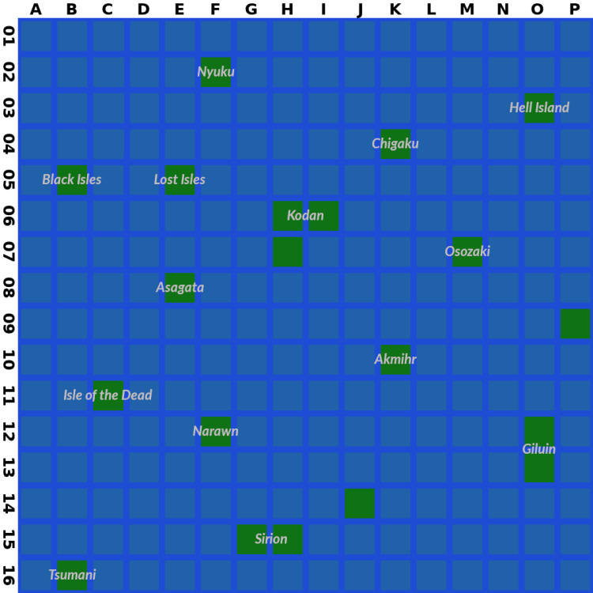

# Yet Another Deathlord Walkthrough

Version 2.1, June 2023

## Table of Contents

- [Administrivia](#administrivia)
  - [Acknowledgements](#acknowledgements)
  - [Version History](#version-history)
  - [Game Introduction](#game-introduction)
  - [Managing Save Files](#managing-save-files)
  - [Getting Around and Getting Along](#getting-around)
- [Creating Characters](#creating-characters)
  - [Attributes](#attributes)
  - [Races and Classes](#races-and-classes)
  - [Assembling a Party](#assembling-a-party)
  - [Experience and Leveling](#experience-and-leveling)
  - [Using Magic Pools](#using-magic-pools)
- [Combat and General Information](#combat-and-general-information)
  - [Combat Basics](#combat-basics)
  - [Heath and Dying](#health-and-dying)
  - [Combat Strategies](#combat-strategies)
  - [Dealing with Loot](#dealing-with-loot)
  - [Equipment](#equipment)
  - [Atlas](#atlas)
  - [Weird Stuff](#weird-stuff)
- [Magic and Spells](#magic-and-spells)
  - [Shisai](#shisai)
  - [Shizen](#shizen)
  - [Mahotsukai](#mahotsukai)
  - [Genkai](#genkai)
- [Walkthrough](#walkthrough)
  - Part I: Senju, Kawahara, and the Emperor
  - Part II: Seven Words and Seven Relics
  - Part III: Endgame
- [Final Notes](#final-notes)
  - [Sample Party](#sample-party)
  - [Trail of Clues](#trail-of-clues)
  - [Bonus: The Speed Run](#speed-run)
  - [Appendix: Hex Editing](#hex-editing)
  - [Appendix: Monster List](#monster-list)

## Administrivia<a name="administrivia"/>

This walkthrough is copyright (C) Ben Cordes, 2017–23. It is made available
under a [Creative Commons Attribution-NonCommercial-ShareAlike v4.0
International License](http://creativecommons.org/licenses/by-nc-sa/4.0/). See link
for more details.

All other trademarks and copyrights contained in this document are owned by
their respective trademark and copyright holders.

### Acknowledgements<a name="acknowledgements"/>

*Deathlord* is a notoriously difficult game for its era, and relatively non-linear from a time where that wasn't common, but I'm still surprised that this seems to be the first "complete" walkthrough for it. However, as usual, I would be remiss if I didn't recognize the giants on whose shoulders I stand.

**Andrew Schultz** wrote a humor walkthrough that prioritized narrative over hints, but it's his automatically-generated color maps that really made a difference for me.

**Wilson Lau**'s Deathlord FAQ and dump of the conversational strings were both excellent points of reference.

All of the above can be found at **GameFAQs**.

A blogger named **Genpei** wrote a "let's play"-style blog at roughly the same time that I was writing the first version of this walkthrough. His diary, as well as our conversations on the CRPG Addict's website, were very helpful: http://obscureoldgamer.blogspot.com/

**Henri Asseily** corresponded with me after reading an earlier version of this walkthrough and gave me a bunch more information about the internals of the game; check out his "Deathlord Relorded" project if you're looking for a different playing experience: https://github.com/hasseily/Deathlord-Relorded

And finally, a shout-out to **Chester, the CRPG Addict**, whose blog is totally worth reading and who unwittingly prompted me to play this game again and take notes so that I could write this document. His blog is at https://crpgaddict.blogspot.com/

### Version History<a name="version-history"/>

- v0.9, September 2017: completed playthrough and first pass of text
- v1.0, February 2018: finished narrative, released to GameFAQs
- v1.0.1, February 2018: spellchecking (oops), rewrite spell descriptions
- v2.0, June 2022: update to CC4.0 license; major rewrite in GameFAQs HTML format; corrections, edits, and updates
- v2.1, June 2023: rewrite in Markdown to publish on Github

### Game Introduction<a name="game-introduction"/>

Ah, *Deathlord.* If this is your first time playing, you're in for a treat. You're also in for an experience that's widely known as one of the hardest CRPGs of its era. At first glance, the top-down interface makes it look a bit like a straightforward party-based descendant of *Ultima*, but the realization quickly sets in that you are going to be given absolutely no mercy whatsoever by the developers. Among *Deathlord*'s most charming "features" is its use of permadeath. The moment a character dies – even in the middle of combat – the game saves state to disk, so that even if you reset the computer, your character has already been permanently killed.

This is merely one example of the ways in which *Deathlord* hates you. We'll talk about lots more as we explore the world together.

It's worth your time to look up and read some of the interviews with the creator of *Deathlord*, Al Escudero. You'll learn a few fun facts, like the fact that EA forced him to rebrand everything from a Norse them to a Japanese theme inside of a few months, which explains why some of the game text didn't get updated in time. (Wakiza has a sign calling it Oceana, the emperor tells you to go to Oceanspray, etc.) If you speak Japanese, apparently some of the translations are hilariously bad; check out Genpei's blog for examples (link in [Acknowledgements](#acknowledgements), above).

My favorite part, though, is the bit where the developer admits that the game is basically much harder than he intended. The story goes that there was a QA team working on the project that had played the game through multiple times, so he kept increasing the difficulty level in order to make their job more interesting. Which is to say that even if you know what you're doing – say, because you're reading my walkthrough – it's still a damn hard game to play.

Well, okay, it's a lot easier if you cheat using modern retrogaming techniques like backing up your disk images and using emulator snapshots. But I digress.

I'm assuming you've looked up a copy of the game's manual. It will teach you the keyboard commands and a little bit of the backstory. The most important thing the manual has to teach you is right there on page one, in the guise of a message from the Deathlord himself: in order to win, you will need to find seven words and six magical items.

However, the manual is also full of misinformation. There's a misprint on the "minimum stats" table, and the arms-and-armor table is flat-out wrong. This is the second most important thing that the manual has to teach you: some significant portion of the information you will learn in the course of this game is **incorrect**. This will come up later in the context of clues you get from NPCs, for instance.

So, don't spend too much time with the manual. I've got you covered on most things you need to know.

### Managing Save Files<a name="managing-save-files"/>

One of the things that makes *Deathlord* so brutal is the autosaving and permadeath. There's only one save slot, unlike even other games of its era, and the process of backing up your save game is laborious and incredibly slow. But, of course, you're "retrogaming", which means you get the benefit of an emulator that makes things like swapping disks easy, and might even offer you the ability to save a snapshot of the current emulator state.

My favorite Apple II emulator is "Linapple", which accepts disk images in two formats. "Flat" images (.dsk) are a representation of all of the bytes stored on the disk in a linear array. "Nibblized" images (.nib) are a relatively faithful and unfiltered stream of data that might have been read off an actual Apple II floppy disk. Most of the flat images I found online were cracked versions that don't work, so I recommend that you find nibblized versions; you should be able to find them from the Asmiov archives and/or the Home of the Underdogs. There are other disk formats out there if you use other emulators; good luck.

Before you go any further, exit the emulator and back up the .nib files for the Boot, Master Scenario A, and Master Scenario B disks. Put the backups somewhere else, so if all else fails, you have clean copies that you can use to restart the game. Now boot the game, use the *Utilities* menu to "Make Scenario Disks", and let the game make playable Scenario A and B disks for you. Then you can start creating characters.

This isn't an emulator tutorial, but I'll just say this: back up early, often, and gratuitously. Back up your "clean" Scenario disks before you start making characters, and you'll never have to use the in-game disk utilities again. Back up the Scenario disks again after you make characters, and if something goes wrong outside Kawa, you'll have a fresh party to start with. *Every time you save your damn game*, back up your Scenario disks again.

I promise, this one tip will change *Deathlord* from an edge-of-your-seat festival of frustration into a far more ordinary CRPG.

When you start the game, tell it you have two drives, and load the images for Scenario A and B into drives 1 and 2. That way the game will manage which disk your party is currently on, and you won't have to swap disk images in and out. Of course, there are reasons you might *want* to manage the disk images yourself...

**Save-scumming:** Whenever a random boon is bestowed upon you (i.e. random hit points from training, or the effects of a magic pool), save your game and back it up, then do the thing. If you're not happy with the result, reload. This is even easier if you use an emulator with save states; in linapple, hit F12 to save the emulator state and F11 to reload. This way you can maximize your HP per level and always get +1 to the stat you want from magic pools.

**Disk-swapping:** Most story progress in the game is based on inventory: you can't see Hell Island unless you have the Sharktooth. However, each town also saves some state about itself on the Scenario disks. If you turn a town against you, it saves a bit of information to disk so the next time you come back it remembers. If you ever want to reset the state of a town, here's how:

1. Approach the town. Press *(E)nter* but don't pick a direction yet.
2. Replace the scenario disk in the drive with a clean / unplayed copy. (You'll have to discover for yourself which towns are on which Scenario disk.)
3. Enter the town. The game loads the town state from the clean scenario disk.
4. Replace the clean scenario disk with your play disk.
5. Save the game (or just continue on your merry way).

**Disbanding your Party:** The Boot disk has a feature that allows you to disband the current game on a Scenario disk. This releases all the characters back into the "pool" of generated characters. You can then reform a "new" party and "restart" the game on Kodan near Kawa. Your characters will be in the same state you left them (money, equipment, and levels all intact, but so is death), and if you don't swap in fresh Scenario disks, the world state will be as you left it. This includes things like where you left your boat, but you can always buy a new one in Tokugawa. This can come in handy if you get stuck deep in a dungeon you don't know how to get out of.

**Duplicating Items:** A combination of disk-swapping and disbanding your party, as above; this one takes some doing, but if you absolutely have to have two Sunspears, it's the way to go. Start off by sailing back to Kodan and leaving your boat near Tokugawa; that way, when you come back, the boat will still be there and you can be on your way immediately without needing to buy a new one.

1. *(Q)save* your game, then quit the emulator. Duplicate your Scenario A disk; I'll call these A1 (the play disk) and A2 (the duplicate). If you want to be really paranoid, make a third copy just in case something goes wrong.
2. Restart the emulator from the Boot disk. Go to Character Options (insert **A1**). Then Disperse the Existing Group (hit enter).
3. Conjure a new character. Call them 'Mule', because that's what they are. Literally nothing about them matters; you can make a Kosaku if you want.
4. Assemble a Group with the PC(s) carrying the item(s) you want to duplicate and the Mule. Then Return to the Main Menu (insert the Boot disk).
5. Play a Game (insert **A1**). As soon as the game starts, *e(X)change* the item(s) from the PC to the Mule. *(Q)save* your game.
6. Insert the Boot disk and reboot the emulator. Go to Character Options again (insert **A1**). Then Disperse the Existing Group (hit enter).
7. Terminate everyone in your former party. Don't terminate the Mule.
8. Insert **A2**, then select Disperse the Existing Group (hit enter) again. You should now have a character roster containing all of your original characters (including the one who has the item you just duplicated) and the Mule (who also has the item you just duplicated).
9. Assemble a Group with the Mule and the PC you want to give the duplicate item to.
10. Return to the Main Menu (insert the Boot disk), then Play a Game (insert **A2**). *e(X)*change the item from the Mule to the PC. *(Q)save* your game.
11. Insert the Boot disk and reboot the emulator. Go to Character Options again (insert **A2**). Then Disperse the Existing Group (hit enter).
12. Insert **A1**, then Assemble your original group again. Return to the Main Menu (insert Boot) and Play a Game (insert **A1**).

Congratulations, you now have a party with two Sunspears (or whatever). Of course, if you're willing to go to these lengths, you might consider [hex editing](#hex-editing) an emulator save state and manually changing the inventory byte, which is definitely faster and probably easier.

### Getting Around and Getting Along<a name="getting-around"/>

*Deathlord* uses a top-down view, similar to the *Ultima* overland interface, moving north-west-east-south with the I-J-K-M cluster common to Apple II games of this era. However, instead of the first-person isometric wireframe dungeons of *Ultima* or *Wizardry*, here you'll stay in the top-down perspective throughout.

Game time passes with real time: during outside exploration, 10 game-world minutes tick off roughly every 15 real-world seconds. Indoors, game time ticks over about half as fast. Otherwise, actions occur on a turn-by-turn basis; every time you move, the rest of the world updates. If you stand still for too long (roughly 6 seconds) and don't do anything, the game issues a *Wait* command for you. You can stop this from happening by typing the first letter of a multi-character command (like *(C)ast* or *(V)iew* or *(F)search* or *(O)rate*), but keep in mind that you will spend one turn regardless of whether you execute or cancel the command. Likewise, inspecting a character consumes a game turn. Linapple lets you use the Pause key to actually pause emulation.

By contrast, time pauses completely for the duration of combat. You can wait at a combat prompt for as long as you like without consequence.

*Deathlord* has a functional day-and-night cycle. The sun starts to set at 6pm, at which point your visual range (when outside) drops 1 square in all directions once an hour, until it gets totally dark at 9pm. You can *(L)ight* a torch, which gives 1 square radius of light while outside (or 2 squares in a dungeon), but be careful when you're walking around swamp. Torches only last an hour or so outside, and light spells don't work outside at all. The sun starts to rise at 4am and is full again at 7am.

The phase of the moon doesn't seem to affect anything, but it's there for color and atmosphere.

Most of the other commands are available in the manual, but I want to point out a couple of particularly important tidbits:

When you fall into a pit (and you will), you need to use caret (^, aka shift-6) to climb out of it. (Of course sometimes that doesn't work and you slip back in, but that's not important right now.)

When casting a spell, the game asks you to type the name of the spell. You also have the option of typing slash (/) or question mark (?), which brings up a menu of all spells that you're able to cast right now. Use the up and down arrow keys to cycle through the menu, then hit Enter to select a spell.

The user interface is reasonably configurable for a game of this era. If you want to toggle the sound, use control-S. You can change the speed at which combat messages print with colon (:). Lower numbers are faster, and 0 is an acceptable number. Note that both of these commands count as an "action" and will consume a turn, **including in combat**. The role-playing nature of asking your Mahotsukai to slow down the combat messages, while entertaining in text, is not so gratifying when doing so forces you to pass on a chance to cast a spell.

One of the more interesting features in the *Deathlord* interface is the ability to record macros. A macro is a sequence of key presses that can be replayed when you're walking around. (You can't use them in combat, unfortunately.) Useful macros include things like:

> C (number of your Shisai) N A S U ,

In a macro definition, the comma represents the Enter key, so this binds "have your Shisai cast NASU" to a macro key. Note, though, that the macro execution continues even if there's an error, so if you rearrange your party and "C3" selects someone who can't cast a spell, the engine will happily continue typing "N" "A" "S" "U" "Enter" anyway.

To record a macro:

1. press control-A
2. pick a macro number (1-4)
3. type the string of characters (e.g. "C4NASU,")
4. hit Enter

To play back a macro:

- Macro #1: ampersand (shift-7)
- Macro #2: apostrophe (')
- Macro #3: open paren (shift-9)
- Macro #4: close paren (shift-0)

**Bonus Computing History Lesson!** On the original Apple II keyboard, the number row looked like this:

| !    | "    | #    | $    | %    | &    | '    | (    | )    |      | *    | =    |
| ---- | ---- | ---- | ---- | ---- | ---- | ---- | ---- | ---- | ---- | ---- | ---- |
| 1    | 2    | 3    | 4    | 5    | 6    | 7    | 8    | 9    | 0    | :    | -    |

(The zero key didn't have a punctuation mark on it.)

Caret (^) was shift-N; lower case letters weren't a thing on the original Apple II. By the time the Apple IIe rolled around, shift-7 was ampersand and the apostrophe had moved down next to the Enter key where we're more familiar with it today. That's why the macro activation keys are in a weird place on modern keyboards.

**Terrain:** As you explore the world you'll run into a number of different kinds of terrain. You can always (V)iew a square to learn what type of terrain it is. Terrain falls into a couple of different types:

- *Clear:* Grass, Scrub, Desert-Sand, Desert-Scrub, Tundra, Bush, Snow-Swamp
  These terrain types block neither your movement nor your line of sight.
- *Opaque*: Forest, Snow-Pines, Hills, Steppe
  These squares block your line of sight, but you can move through them.
- *Blocking*: Mountain, Snowcap
  You can't move or see through mountains.
- *Painful*: Swamp, Cacti
  Walking over these squares causes damage to everyone in your party. Cacti are also *Opaque*, i.e. they block your line of sight. Weirdly, Snow-Swamp squares aren't *Painful*.

Also, perhaps obviously, there's *Water*, which you either need a boat to sail over or G6:UKU to walk over (indoors only, which includes in towns).

You will also discover a number of *energy fields* on your travels. These fall into two categories:

- *Rakhammon's Curtain* (purple/green): The only way to pass through one of these is to *(U)se* a Blue Crystal, which allows you to step into a Curtain.
- *Arkhan's Wall* (red/blue): You can step over these normally, but they eat 50% of your current HP when you do. *(U)sing* a Crystal doesn't help.

**Talking**: One of the most important skills for *Deathlord* players is talking to NPCs. You'll do this in order to learn clues as well as interact with merchants. Walk up next to an NPC and start a conversation with *(O)rate*. You then have several options:

- *(C)hat*, which randomly repeats one of 16 fixed messages of varying utility (see below). Because it's random, you sometimes get really hilarious combinations (Senju tells you to "Find Senju", or better, "Leave me alone").
- *(T)alk*, which gets you a phrase that is specific to the NPC you're speaking with. These are also of varying utility, but often yield key words that you can ask about.
- *(I)nquire*, which allows you to free-enter a key word. If the NPC knows anything about it, they'll tell you. However, every NPC in a location knows exactly the same set of key words, so you don't have to find someone specific to ask. (This also sometimes results in hilarious combinations.) Most of the time, *Deathlord*'s parser is smart enough to recognize both a word (dungeon) and its plural (dungeons).
- *(B)uy* and *(S)ell*, which obviously only work on merchants. If you get stonewalled when asking for a *(T)alk* clue, you may be speaking with a merchant, so try *(B)uy*. Of course, you may also be speaking with a hostile that's about to attack you.
- *(O)ffer (G)old*, entered as "OG", which is useful when someone's *(T)alk* phrase is "PAY UP!". (I've marked clues found this way with "($$)".) This can be as low as 10gp or as high as 100gp, and there's no way to know without just trying it. Note that just because someone wants a bribe doesn't guarantee that they have anything useful to say. "Thanks, sucker!" is a not uncommon response.
- *(O)ffer (I)tem*, entered as "OI", which is only useful in a handful of specific places, mostly dealing with the Emperor, and I'll tell you about them when we get there.
- *(Esc)* or *(Enter)* ends the conversation.

In alphabetical order, here are the 16 messages you'll get in response to *(C)hatting* with an NPC:

- Demons are deadly
- Don't get caught outside at night
- Find Senju
- Find the words
- Hello
- Kobito hide gold
- Leave me alone
- Look to the north
- Map dungeons
- Ruins are rich
- Seek the seven
- Ships get stolen
- Things are tough all over
- Time is short
- Watch out for the storms at sea
- Watch your back

The useful ones are:

- *Map dungeons*: You should definitely try, although several of them do their best to confounding pen-and-paper mapping. And you should also map towns!
- *Find Senju*: Indeed, he is crucial to winning the game.
- *Ships get stolen*: I've never had my own ship stolen, but you can steal a boat by *(A)ttacking* it. (Always try *(B)oarding* it first; it might just work.)
- *Find the words* and *Seek the seven*: In order to win, you will need seven words to get through seven gates. The only other clue you get to this is the Deathlord's message at the beginning of the manual.

In addition, Senju, word, ruin, and dungeon are good things to *(I)nquire* about.

The rest of the hints are misleading, wrong, or pointless. There's nothing special about the North, there's no time limit on the game, and there are no storms at sea (although there are plenty of nasty monsters). Kobito rarely have much in the way of gold (the Mines being an exception), and ruins don't tend to be very rich (or they all get picked over before you get there). Demons are kind of deadly, but not significantly more so than any other creature.

## Creating Characters<a name="creating-characters"/>

Unlike some later games that have skills, 'derived' or 'secondary' attributes, or 'advancement points' that can be spent on various aspects of your character, *Deathlord* uses a stripped-down set of attributes. Creation involves six steps, described briefly here and in more detail in the following subsections.

1. Pick a race, which determines the range of each attribute.
2. The game rolls seven attributes for you within the racial min/max.
3. Pick from the list of allowed classes based on the attributes that were rolled, or choose to re-roll if you don't see something you like.
4. Pick an alignment (good / neutral / evil). Some character classes restrict your choice (Kishi can only be Good, Ninja can only be Evil, etc.) Alignment is irrelevant except that you can't assemble a party that has both Good and Evil characters in it.
5. Pick a gender (male / female). Character gender is completely irrelevant; certain magical effects can change it mid-game.
6. Pick a name. You can rename characters with the "Character Utilities" function on the Boot disk.

### Attributes<a name="attributes"/>

*Deathlord* uses the standard six D&D attributes, plus one for mana. The manual gives a bunch of handwaving descriptions of what the stats are good for, which is why this section isn't full of more definitive answers. Anything that I'm vague about here is based on my experience and observation, and may not be correct.

- *[STR]ength* affects both to-hit and damage, even for missile weapons, as well as your ability to *(S)mash* down doors.
- *[CON]stitution* affects the number of hit points gained per level.
- *[SIZ]e* affects your ability to smash doors.
- *[IQ]ntelligence* is supposed to affect several things, but evidence is scant. Higher IQ might grant bonuses to spell damage. The rate at which POW replenishes is supposed to be affected by high IQ, but I didn't notice a significant difference between IQ14 and IQ18.
- *[DEX]terity* affects your ability to pick locks. It's also supposed to affect your chance to dodge attacks, but it's hard to tell. I suspect it also affects your to-hit chance. Unlike other CRPGs, it doesn't affect your armor class.
- *[CHA]risma* affects the price of training (but only on the order of a handful of gp per level) and the chance to *(N)egotiate* with monsters.
- *[POW]er* is your "mana" stat. Casting a spell costs 1pt of POW per spell level, so a third level spell costs 3 POW, etc.

Stats have a minimum of 3 and a maximum of 21, except for POW which is effectively unlimited.

Attributes don't increase through leveling or any other mechanism. The only way to improve a stat is to *(Z)drink* from a [magic pool](#using-magic-pools), which can be found in some dungeons (there are ~50 in the entire game). Even then, magic pools only grant a stat boost a small portion of the time. They also have a number of other effects (some good, some bad) which we'll talk about later.

The exception to the "no increases" rule is POW; characters capable of using magic gain +1 maximum POW every even-numbered level. Note that when inspecting a character, only the current amount of POW is shown. There is no indicator of maximum POW; you just have to remember. POW regenerates naturally with time.

#### Game Mechanics<a name="game-mechanics"/>

Much of the data in this section is based on my own recordkeeping, and the rest of it is thanks to Henri Asseily who did a bunch of digging into the actual assembly code to discover the algorithms used. Some of these numbers will be a little inaccurate due to the exact mechanism by which the game generates random numbers, but they're close enough for our purposes. See Henri's work, linked in the [Acknowledgements](#acknowledgements), for more detail if you're curious; I also talk about it a bit more under [Weird Stuff](#weird-stuff).

If you're used to the d20 tabletop RPG system or any of its descendants, you've seen this scale before:

| **Attribute** | 3    | 4    | 5    | 6    | 7    | 8    | 9    | 10   | 11   | 12   | 13   | 14   | 15   | 16   | 17   | 18   | 19   | 20   | 21   |
| ------------- | ---- | ---- | ---- | ---- | ---- | ---- | ---- | ---- | ---- | ---- | ---- | ---- | ---- | ---- | ---- | ---- | ---- | ---- | ---- |
| **Bonus**     | -4   | -3   | -3   | -2   | -2   | -1   | -1   | 0    | 0    | +1   | +1   | +2   | +2   | +3   | +3   | +4   | +4   | +5   | +5   |

Whenever I say something like "CON modifier" in this section, look up your raw CON attribute on the top row and find the modifier on the bottom row.

**Attack rolls:** The exact formula is unknown, but it's affected by class, level, STR modifier, DEX modifier (I think), the weapon you're using, and your opponent's AC. More details under [Combat Basics](#combat-basics).

**Attack damage:** Each attack that hits, melee or missile, gets a damage bonus based on your STR modifier.

**Max HP per level:** Each time you go up a level, your Max HP stat increases by a die roll (based on your class, see [Character Classes](#character-classes)) plus your CON modifier. This is not retroactive, so get your magic pool stat increases in early if you can.

**Smashing doors:** Your chance to break down a door is the sum of your STR and SIZ (raw scores, not modifiers), so Trolls top out at around a 42% chance.

**Picking locks:**

- Start with a base chance of 0%.
- +2% per point of DEX over 12 (so, DEX 14 = 4% base chance).
- +3% per level if you're a rogue-like class (Yakuza, Ansatsushi, Ninja, Shukenja).
- +8% if you're actually a Yakuza.
- +4% if you're **not** a rogue-like class. (Level is irrelevant.)

**Searching for traps:** Based solely on [race](#character-races-with-attribute-ranges); ignores class, level, and DEX.

### Races and Classes<a name="races-and-classes"/>

*Deathlord*'s races are roughly based on *Dungeons & Dragons*, with Oriental labels slapped on some (but weirdly not all) of them.

#### Character Races, with attribute ranges

| Race     | D&D Equivalent | STR   | CON   | SIZ   | IQ    | DEX   | CHA   | POW   | Find traps |
| -------- | -------------- | ----- | ----- | ----- | ----- | ----- | ----- | ----- | ---------- |
| Human    | Human          | 03–18 | 03–18 | 08–18 | 03–18 | 03–18 | 03–18 | 03–18 | 35%        |
| Toshi    | Elf            | 03–13 | 03–13 | 03–12 | 08–19 | 08–19 | 07–18 | 08–19 | 59%        |
| Nintoshi | Half-elf       | 03–15 | 03–15 | 05–14 | 06–18 | 06–18 | 05–18 | 05–18 | 50%        |
| Kobito   | Dwarf          | 08–19 | 08–19 | 03–08 | 03–16 | 03–16 | 03–16 | 03–16 | 68%        |
| Gnome    | Gnome          | 05–18 | 08–18 | 03–06 | 03–17 | 06–18 | 03–16 | 03–17 | 68%        |
| Obake    | Drow           | 03–15 | 03–16 | 03–07 | 03–14 | 08–20 | 03–14 | 03–18 | 39%        |
| Troll    | Ogre / Orc     | 11–21 | 11–20 | 13–21 | 03–11 | 03–13 | 03–09 | 03–12 | 29%        |
| Ogre     | Half-orc       | 08–19 | 08–19 | 11–19 | 03–13 | 03–13 | 03–11 | 03–14 | 29%        |

#### Character Classes

Some classes are restricted to certain alignments. You can't have both Good and Evil characters in your party, and note that taking a Shisai will force you to choose one or the other. I'll elaborate on the 'Why' column in a later section.

| Class      | D&D Equivalent | Spells | Alignments | HP/Lvl | Why / Why not?                              |
| ---------- | -------------- | ------ | ---------- | ------ | ------------------------------------------- |
| Senshi     | Fighter        |        | G-N-E      | 10     | Broad access to weapons and armor           |
| Kishi      | Paladin        | Shisai | G          | 8      | Spells, unique weapons                      |
| Ryoshi     | Ranger         | Shizen | G-N-E      | 9      | Less armor                                  |
| Yabanjin   | Barbarian      |        | G-N-E      | 12     | Most HP, less armor                         |
| Kichigai   | Barbarian      |        | G-N-E      | 11     | Unique weapons, less armor                  |
| Samurai    | Fighter        |        | G-N-E      | 9      | Unique weapons                              |
| Ronin      | Dark Paladin   | Shisai | E          | 8      | Unique weapons                              |
| Yakuza     | Rogue          |        | G-N-E      | 6      | Best lockpick                               |
| Ansatsusha | Assassin       |        | E          | 6      | Lockpicking                                 |
| Ninja      | Monk           |        | E          | 7      | Lockpicking, unarmed attacks, critical hits |
| Shukenja   | Monk           | Shisai | G          | 5      | Lockpicking, unarmed attacks, spells        |
| Shisai     | Cleric         | Shisai | G-E        | 8      | Healing spells                              |
| Shizen     | Druid          | Shizen | N          | 8      | Utility spells                              |
| Mahotsukai | Mage           | Mahot. | G-N-E      | 4      | Offensive spells                            |
| Genkai     | Illusionist    | Genkai | G-N-E      | 4      | Spells to flee from battle                  |
| Kosaku     | Peasant        |        | G-N-E      | 6      | Useless                                     |

#### Race/Class Matrix

You can't pick a class unless (a) you've chosen an allowed race and (b) the rolled stats meet the minimums. Note that the matrix in the manual is wrong in several places: Kishi and Shizen have Charisma requirements, and almost everyone has a minimum Dexterity.

| Desired Class | Allowed Races |      |      |      |      |      |      |      | Min. Attributes |      |      |      |      |
| ------------- | ------------- | ---- | ---- | ---- | ---- | ---- | ---- | ---- | --------------- | ---- | ---- | ---- | ---- |
| Hum           | Tos           | Nin  | Kob  | Gno  | Obk  | Trl  | Ogr  | ST   | CN              | IQ   | DX   | CH   |      |
| Senshi        | ✓             | ✓    | ✓    | ✓    | ✓    | ✓    | ✓    | ✓    | 11              |      |      | 9    |      |
| Kishi         | ✓             | ✓    | ✓    |      |      |      |      |      | 11              | 13   | 11   | 11   | 13   |
| Ryoshi        | ✓             | ✓    | ✓    |      |      |      |      |      | 11              | 13   | 11   | 11   |      |
| Yabanjin      | ✓             |      | ✓    | ✓    | ✓    | ✓    | ✓    | ✓    | 13              | 13   |      |      |      |
| Kichigai      | ✓             |      | ✓    | ✓    | ✓    | ✓    | ✓    | ✓    | 13              |      |      | 11   |      |
| Samurai       | ✓             | ✓    | ✓    |      |      | ✓    |      | ✓    | 11              | 11   |      | 13   |      |
| Ronin         | ✓             | ✓    | ✓    | ✓    | ✓    | ✓    | ✓    | ✓    | 13              | 11   | 11   | 11   |      |
| Yakuza        | ✓             | ✓    | ✓    | ✓    | ✓    | ✓    | ✓    | ✓    |                 |      |      | 13   |      |
| Ansatsusha    | ✓             | ✓    | ✓    | ✓    | ✓    | ✓    | ✓    | ✓    | 11              |      |      | 13   |      |
| Ninja         | ✓             | ✓    | ✓    |      |      | ✓    |      |      | 11              | 13   |      | 15   |      |
| Shukenja      | ✓             | ✓    | ✓    |      |      |      |      |      | 11              | 13   | 11   | 13   |      |
| Shisai        | ✓             | ✓    | ✓    | ✓    | ✓    | ✓    | ✓    | ✓    |                 |      | 11   | 9    |      |
| Shizen        | ✓             | ✓    | ✓    | ✓    | ✓    | ✓    |      | ✓    |                 |      | 11   | 9    | 11   |
| Mahotsukai    | ✓             | ✓    | ✓    |      |      |      |      |      |                 |      | 11   | 9    |      |
| Genkai        | ✓             | ✓    | ✓    |      | ✓    |      |      |      |                 |      | 11   | 9    |      |
| Kosaku        | ✓             | ✓    | ✓    | ✓    | ✓    | ✓    | ✓    | ✓    |                 |      |      |      |      |

### Assembling a Party<a name="assembling-a-party"/>

More than others, this section is completely, totally, 100% my opinion. But it seems like most good walkthroughs come with at least some mention of how the author thinks you should build a party. This describes the party that I beat the game with; there are many, many other ways to build a successful party.

Before we start, you need to know that *Deathlord* uses a 3+3 turn-based combat system (see [Combat Basics](#combat-basics)). Specifically, this means that only the front three can use weapons to attack, so generally you're going to want three fighters for the front ranks and three casters in the back. There are some tweaks to that, though, which we'll talk about in a second.

Let's start with character races. I generally play a part of six Humans. Why? I find the only good reason to take a demihuman is their ability to *(F)search* for traps and secret doors. Searching isn't guaranteed to work, and you may be able to reduce your frustration by carrying a Kobito or Gnome around. Or, at least, reduce the number of times you have to hammer 'F' to prove that there's no trap or secret door here. But I don't get frustrated by this easily, partially because I play with other people's maps.

Apart from that, you've got the race-locked missile weapons, the Kobito Hammer – yes, the 'Hammer' is a *missile* weapon, not that it really matters – and the Toshi Bow. The Toshi Bow is pretty fearsome (3 attacks at 1-8 plus a nice AC bonus), but I can't see putting a Toshi in the front lines – remember, you can't attack from the back three, even with a missile weapon – with a max of 13 CON and praying for a Toshi Bow to drop while they find secret doors faster than a Human. Kobitos (19 max CON) make more sense there, but the Hammer isn't quite as compelling for me.

There's an argument to made for taking a Troll and just waiting a really long time for the random number generator to give you 20 STR *and* 20 CON, but you're gonna be waiting for a long time. Still, the additional +1 HP per level and +1 damage per hit are awfully tempting. I can neither confirm nor deny having spent a couple of hours writing a Linux shell script that used screenshots and OCR to auto-roll characters until I got the stats I wanted, but feel free to drop me an email if you want to see the thing.

One more thing on attribute maximums before we move on: I mentioned magic pools earlier, and the fact that they can be used to increase stats after the start of the game. They seem to ignore racial maximums, so you can get a Toshi up to 18 STR and 18 CON, eventually. But they also seem to max out at 18, so if you play a Troll that starts with a 17 STR, you will never get them up to 21.

On to the classes, then:

Let's start with the straight fighters. **Senshi** are bland but effective. **Samurai** have slightly fewer HP but get to use the Katana, which is a very good melee weapon and easily available once you leave Kodan. **Yabanjin** and **Kichigai** trade more HP for restrictions on armor; the Kichigai also gets to use the Berzerk Sword, in case you want four attacks per round (brutal!). You don't strictly *need* any character in this group, but you'll probably wind up taking one for your party.

In the hybrid fighter/caster group, **Ryoshi** have access to the Shizen spell book, but low-level Shizen spells are pretty useless. **Kishi** are great because a second Shisai caster is really helpful at low levels, plus the Holy Blade is pretty good if you can find one. If you're planning an evil party, take a **Ronin** instead for the Unholy Blade and Skull Shield (a whopping +6 AC!).

For thieves/rogues we have the **Yakuza** and **Ansatsusha**. Yakuza are slightly (8%) better at picking locks. I'm honestly not sure why you would take an Ansatsusha; the manual claims they are better fighters than the Yakuza but that's unsubstantiated. Neither class gets spells. There is a funny math overflow bug where a level 32 Yakuza with high DEX forgets how to pick locks until they hit level 33, but you probably won't notice.

If you like unarmed and unarmored fighters, the **Ninja** and **Shukenja** are your monk-types. They get a +1 bonus to AC every two levels, although there's another funny math overflow bug that resets them to AC 10 (i.e. the worst) at level 32, and you'll definitely notice this one if you get that high. Their unarmed damage max also goes up by 1 every two levels. As a bonus, they pick locks just as well as the Ansatsusha does. Shukenja also read from the Shisai spell book for bonus S1:NASU castings. The Ninja is sort of like an evil Shukenja, except they can't cast spells, *can* use the Shuriken and Nunchaku, and can critical-hit monsters at really high levels. Like most CRPG monks, they tend to be underpowered at low levels and don't usually live long enough to make up for it – look carefully at those "max HP per level" numbers before picking one of these.

Finally we have the four spell casting classes. **Mahotsukai** are the standard offensive casters, with some interesting utility spells mixed in. **Genkai** have a large number of spells that let you flee combat if that's your playing style. You'll also really like G1:HIBANA (a weak group-zap spell) at low levels and G4:UKU (walk on water) at higher ones.

The divine magic classes, **Shisai** (priest) and **Shizen** (druid) come with reasonable armor and fighting skills, which makes them good candidates for the third front-line slot. Unfortunately they also have terrible weapon choice, until you luck into a Rod of Death (or Toshi Bow, if that's your bent) or acquire the Emerald Rod. Shisai focus more on healing and are pretty much mandatory, but Shizen have some very useful curative and utility spells.

I'm pretty sure the **Kosaku** exists as a catch-all in case one or more of your stats are too low to be anything else. I'm also willing to bet that someone out there has won the game with six Kosaku out of sheer stubbornness, just to prove that it can be done.

This brings us to the question of party balance. Everyone's going to play the game differently, and you can be successful with a number of different party compositions. I took **Samurai, Kishi, Shizen, Shisai, Mahotsukai, Genkai**. We're a little underpowered in melee combat at first, so I actually started the game with a Senshi in the third slot and swapped in the Shizen after we gained a few levels and really got rolling.

I don't bother carrying a rogue-type; thieving skills aren't useful enough for me, they aren't as good at fighting, and back-row slots are too valuable to waste on a non-spellcaster. The priests are good enough fighters (so long as their DEX isn't terrible) that I don't miss a third fighter, and I'd rather have all four spellbooks than the extra brawn.

If you decide to take three fighters (or two and a rogue), you have to drop a caster class. I'd say you're picking between the Shizen and the Genkai here. Check out the spell lists in section 4; Genkai give you group-zap spells early, which is really handy in Kodan. Shizen are the only class that can cure disease/illness, and they get some group zap spells later to rival the Genkai. Z4:HITATE / SANTATE are tough to do without, but not impossible; and you can compensate by 'cheating' and picking up the Ruby Ring and Emerald Rod early, if you want to.

Okay, now that you've figured out what your party looks like, let's talk statistics. At the top of the list, CON is pretty important for everyone. HP are a precious resource and you want as many as possible. Don't skimp on CON for your mages, although this is a prime candidate for using [magic pools](#using-magic-pools) to improve your stats later.

Mages also want to focus on having high POW. You won't get much during the course of character development; you probably won't get 30 max POW across the game unless you do a lot of grinding. One extra point of POW can make a difference, sometimes.

Fighters should have a high STR and, perhaps less obviously, DEX. I noticed a dramatic difference when my Shizen went from DEX 9 to DEX 10 in terms of how often they hit during melee combat.

For the most part, SIZ doesn't matter. It's helpful to have one character with high SIZ + STR combo for bashing down doors.

And lastly, just like in D&D, CHA is pretty useless. Although, as a playing style, I don't *(N)egotiate* with monsters much, so it's possible I would notice my low CHR if I used that tactic more. The impact on store prices is negligible.

*Deathlord* will happily let you assemble a party with only one character in it, but I'll tell you right now this game is hard enough as it is and you don't need to handicap yourself. (Also, you need to carry four items that all fit into the same inventory slot, so you kind of need at least four party members.) So pick your six classes, roll up your characters, make sure you assign alignments appropriately, and then pick a name for your intrepid party of adventurers.

### Experience and Leveling<a name="experience-and-leveling"/>

As is true with most RPGs, in *Deathlord* characters have a "level" which starts at 1. Every time you win a battle, you gain some experience points (XP). When the game deems that a character has gained enough XP, you go up a level, and you become more powerful. Actually, you gain the *potential* to go up a level, but you have to visit an Academy and get "trained" in order to actually do so. Training costs money, which is part of how the game manages your cash reserves.

Where *Deathlord* is different than most CRPGs is that it **doesn't tell you** how many XP your characters have. Literally the only way to figure it out is to disassemble a memory dump or a save disk file. It's maddening!

So, how much experience does your party gain from a battle? Well, each monster has an XP value (see [appendix](#monster-list)). The total experience pool from a battle is equal to the XP for the monster times the maximum number of monsters present at any one time. Since *Deathlord* only ever sends one group of monsters against you at a time, this is usually pretty straightforward to figure out. However if they summon allies, that's where the "maximum present" modifier comes in. If you start with four Gremlins, kill three, and they summon one more, you only get credit for four. But if you start with four and they summon another first, then you get credit for five.

Now we know how big the experience pool is, how do we divide it up? In order to earn a share of experience, a character must do something "useful":

- landing a hit in melee; a kill is not necessary, but a miss is not enough
- casting any spell
- trying to cast a spell but failing because you're out of POW
- casting a spell and then hitting *(Esc)* to cancel

The last one is the most interesting one. Because "useful" is usually defined as "landing a hit in melee", the front line gets XP more often than the spell casters in the back rank. Consistently using the cast-and-cancel trick ensures that your casters are counted in the experience pool at the end of most fights, which means that they won't be left quite as far behind in collecting XP and going up levels.

So we have a pool of XP and a number of characters who participated; divide A by B and you get the number of XP that each character gains. If there's a non-zero remainder, the PC in slot #1 gets 1 XP additional, then slot #2, and so on. So your back-rank characters tend to get the short end of this stick.

You start the game at level 1; level 2 requires 200 XP, as do levels 3–5. The next four levels (6–9) require 400 XP, the next four (10–13) 600 XP, and so on. The escalator tops out at level 22, after which all levels require 1200 XP. You can't advance past level 99. With this guide in hand, you can comfortably beat the game in the mid 20s. There are some math overflow bugs that trigger in the low 30s; see the section on [Weird Stuff](#weird-stuff) for more details. If your PCs are getting into the 40s, you either really like grinding or you haven't been save-scumming for HP (see below).

When a PC gains enough XP to advance to the next level, their XP counter resets to 0 and starts counting up again. A "+" appears next to their name and their details indicate (for example) level "04+01". This indicates that PC is ready to advance from level 4 to level 5. It is possible to gain enough experience to train for two levels at once (04+02), but not three.

Note that when you finally make it back to the training academy and train for the next level, your XP counter is reset **again**, so any experience you gain between leveling and training is wasted.

Training costs approximately 100 gp per level plus some change, so the game's level cap of 99 is as much about paying for training (a single PC can only hold 10,000 gp) as anything else.

When you train to go up a level, the main benefit is that your maximum HP goes up. The amount it goes up is randomly rolled and depends on your [character class](#character-classes). It's also modified by your [CON modifier](#game-mechanics). There are few things worse than rolling a 1 on your new HP when you go up a level, so I highly recommend using an emulator with save states (like Win/Linapple) and doing what's called "[save-scumming](#managing-save-files)": save right before you pay for training, and if you don't get enough HP, reload and do it again.

The other obvious boost to your character's power comes from spell levels. [Spell casters](#magic-and-spells) gain new spells every couple of levels, but secondary casters gain new spells levels *four times slower* than primary casters:

| Spell level | Primary caster (Shi,Shz,Mah,Gen) | Secondary caster (Ksh,Ryo,Ron,Shu) |
| ----------- | -------------------------------- | ---------------------------------- |
| 1           | 1                                | 1                                  |
| 2           | 3                                | 12                                 |
| 3           | 6                                | 24                                 |
| 4           | 10                               | 40                                 |
| 5           | 14                               | 56                                 |
| 6           | 19                               | 76                                 |
| 7           | 24                               | 97                                 |

So, yeah, your Kishi is *really* never going to get to cast S7:MOINOCHI.

There are hidden power improvements from going up a level as well; I believe that higher-level characters are more likely to hit, more likely to dodge an attack, and more likely to resist the effects of magical attacks, but I don't have proof of that.

Attributes don't go up when you gain a level. However, your character's age advances by one "year" every few levels, and after age 40 or so (for Humans), there's a chance your attributes will start to *decline*. (This, of course, makes no sense at all, given that the game has a perfectly functional sense of day and night. It's possible that 365 game days passed before I defeated the Deathlord, but I bet it wasn't two years' worth. Nevertheless, my characters are 5–10 years older than they were when I started...)

### Using Magic Pools<a name="using-magic-pools"/>

I put this info in the section on characters and development because there's only one way to increase the attributes of your characters, and that's by throwing yourself upon the mercy of the random number generator and *(Z)drinking* from a magic pool of water.

When you're exploring a dungeon, you'll find pools of water all over the place. They come in three kinds: normal water, poison, and magic. There is literally no way to distinguish them without drinking from them to see what happens. I've provided vague descriptions of where the good pools are throughout the dungeon walkthroughs, but if you're interested in chasing magic pools you should *really* be using a well-annotated map.

When you *(Z)drink* from a magic pool, the response is always "You feel dizzy!". One of the following random effects will occur:

- nothing
- +1 to a random stat
- -1 to a random stat
- fully heal HP
- lose 50% of your remaining HP
- fully restore POW
- drain all POW
- cause poison (TOX)
- cause disease (ILL)
- flip the character's gender

Once a magic pool has granted an effect, it becomes normal water.

This *really* isn't fair. First you have to identify that something is a magic pool, which there's no way to do without playing the game, discovering the pools, and rebooting from a previous save. Then you have to hope that something good happens, which is only three of the possible ten effects (including "no effect", although I have no idea if the distribution is uniformly random or weighted). And then if you do happen to get the "+1 to a stat" effect, you have to hope that the randomly-chosen stat is the one you want. By the way, magic pools can't raise a stat beyond 18, so if the stat the game chooses is already at 18 or higher, nothing happens instead.

If you're cheating, er, I mean, reading this walkthrough and using maps, then you should obviously save-scum until you get a positive effect. But if I were playing this game straight, I can't imagine ever choosing to drink from a pool of water, even if I somehow knew already that it was a magic pool. The chance of something bad happening is just way too high.

## Combat and General Information<a name="combat-and-general-information"/>

You'll spend most of your time in *Deathlord* doing one of three things: tracking down clues from NPCs, sailing from one continent to another, and moving between fights. So let's talk about combat and how to survive it, as well as some other gameplay tactics you'll want to know.

### Combat Basics<a name="combat-basics"/>

Step 1, before you get into combat: make sure that everyone has readied a *(W)eapon*, either *(H)and* or *(M)issile*. *(O)pen hands* is for the Shukenja and Ninja among you; I can't think of any other reason why you wouldn't want to have a weapon readied at all times. You can confirm your status by looking at your equipment list; a readied weapon has an asterisk in front of it. Now then...

*Deathlord* uses a no-frills turn-based combat system. You have six characters in your party (...right?), and you will be facing a single group of monsters on the other side. Your party gets to attack, then the monsters attack, then you attack, and so on until the combat is over. There's no targeting system, there's no range or distance between parties, and there's no functional difference between melee weapons and missile weapons. You just beat the crap out of each other until everyone dies or runs away. (Note that running away causes the monsters to disappear, so it's a valid route to 'complete' a fight.)

As is common in combat systems of this style, only the first half of your party can use weapons to attack. Slots 1–3 can attack, cast spells, or do other things; the characters in slots 4–6 can't attack but they can do the other things. (Actually, they can try to *(A)ttack*, but the game will just say "Can't!" and you'll lose your turn.) Systems like this appear in enough games that I've started calling it a "3+3" combat system, although some games like *Bard's Tale* or *Dragon Wars* have "4+3" systems, etc.

I told a little fib up there, which is that your party doesn't always go first. First strike is granted to the team that initiates combat. If you used the *(A)ttack* action to start melee, you get first strike. Otherwise the monsters attack first.

Unlike some games that let you queue up commands for your whole party and then execute them afterwards, *Deathlord* executes each action as soon as you hit the key. So you get to watch the outcome of your front row's attacks before deciding what spells to cast with your back row. This is nice, but also means that once you issue a command for an earlier character, you can't go back and change your mind.

I said this earlier but I'll say it again: "interface" commands like : (change message delay) or control-S (enable/disable sound) **count as your battle action.** Likewise, if you hit *(C)ast* and then change your mind and hit ESC to cancel, that's your action. However, Enter (view character's statistics) does not consume your turn – you get to input another action after you finish viewing. But, there's no clock running in combat; you can take as much time as you want to consider tactics and pick an action.

So what can your characters do on their turn?

- *(A)ttack* using whichever weapon you have readied. (You readied your weapons, right?) We'll talk about this more in a minute.
- Ready a different *(W)eapon*; pick from *(H)and, (M)issile,* or *(O)pen Hand* (i.e. no weapon).
- *(C)ast* a spell. You have to type the spell name, or hit / or ? to get a menu. If you get the spell name wrong, you get another chance to type it.
- *(R)etreat* to the back of the group. This action doesn't actually occur until everyone else has taken their turn, so if you tell #3 to *Retreat*, #4 won't get to *Attack* because they're still in the back row. If multiple characters *Retreat* in the same round, they all move to the back and retain their relative ordering from before. This mostly makes sense; actions are applied in the same order you specified them.
- *(F)lee*, which causes the party to attempt to flee combat **but also** stops anyone else in the party from executing a command this turn, so you probably only want to do this with the party member in slot #6. It doesn't always work. There are also a bunch of Shizen spells that cause you to *Flee* and have a much higher chance of success, and if they don't work you don't lose the rest of the party's turn.
- Attempt to *(N)egotiate* with the monsters. This is like *Fleeing*, but it depends on CHA, and if it works, the monsters charge you some amount of money to leave. Harder monsters want more money (and are less likely to say yes in the first place).
- *(Space)* Pass. This PC does nothing.
- *(S)kip* everyone's turn. Seriously, just don't use this.

When you use the *(A)ttack* action (again, only from slots 1-3), you make one or more attacks against a single enemy. I believe that the game keeps track of monsters in a queue, and your attacks are directed at the "first" one, although I don't know that for sure. Certain weapons (see [Equipment](#equipment)) grant you more than one attack, and casting M3:ISOGU grants one additional attack to everyone in the party. The most you can get is five attacks in a round; the Berzerk Sword, only usable by Kichigai, attacks four times. If you have multiple attacks but kill a monster with your first, you lose the subsequent attacks.

For each attack, there is a baseline 25% chance of success. That number is modified by +5% for every point of to-hit ability for the attacker and -5% for every point of armor the defender is wearing, but it can't go lower than 10%.

Monsters' AC and their to-hit scores are shown in the [Appendix](#monster-list). Remember that the game displays AC starting at 10 and going *down* as it gets *better*, so when I say "every point of armor", I mean that AC 2 is "one point better" than AC 3.

For PCs, your to-hit score is modified by your class and level (although it's unclear how much), your STR, possibly your DEX, and the [weapon](#equipment) you're using. Note that some weapons actually have *penalties* to-hit.

By the way, there's no functional difference between missile weapons and melee weapons, except that you're allowed to [carry](#dealing-with-loot) one of each. You can't fire a missile weapon from the back row, and the combat system doesn't include range or distance between parties. So you should let the various [benefits and penalties](#equipment) of each weapon decide what you use.

If you have multiple attacks per round, each attack has an independent chance of hitting. If an attack hits, the game rolls damage. You get to add your STR bonus to the damage *for each attack*, which means that weapons that attack twice are generally better than weapons that attack once even if they do half as much base damage (because you get to double your STR bonus if you hit twice). However, weapons that attack multiple times often have lower to-hit bonuses (or even penalties), which changes the math a bit. Still, if you're carrying a Ninja, I recommend you get them a Shuriken as quickly as possible (they're pretty cheap), and buy your Samurai a Katana as soon as you leave Kodan.

A final note: one of the few benefits that the game throws you is that only three monsters get to take actions when it's their turn, no matter how many there are in the group. So a group of 16 Kobito won't completely swamp you the way they can in other games.

### Heath and Dying<a name="health-and-dying"/>

The health system in *Deathlord* is pretty straightforward. Everyone has a number of HP, or hit points. The game displays this as two three-digit numbers; the left-hand one is your current health, and the right-hand one is your maximum. If you have a "condition" inflicted upon you then your maximum health is replaced with the worst three-letter status indicator:

| Status | Condition | Cure with                            |
| ------ | --------- | ------------------------------------ |
| PAR    | Paralyzed | S3:MOTUNASU                          |
| TOX    | Poisoned  | S4:DONASU                            |
| ILL    | Diseased  | Z3:BYOKINASU                         |
| RIP    | Dead      | S7:MOINOCHI, S5:INOCHI, Z7:DRUINOCHI |
| STO    | Petrified | S7:YAWARISHI                         |

These five conditions can be cured by a high-enough level spellcaster, as shown above. They can also be cured at a temple for money, although not every temple can heal every condition.

Health will regenerate over time (about 1 hp every 30 minutes of game time), so long as your characters have food. Characters without food are "starving" and will not regenerate health. Food is easily acquired on almost every continent, though not in every town, at a rate of 3 gp per meal and is consumed about once every 90 minutes.

You don't have to explicitly "rest", but if you want to kill a bunch of time, it's faster to *(ctrl-P)itch camp* for several hours than it is to hold down the spacebar. You can't pitch camp while INDOOR, which covers towns and the first floor of some dungeons, but it works OUTDOOR and in most dungeons. The location indicator below your party list will tell you where you are, and therefore whether or not you can camp. If you have pitched camp and decide to stop for some reason, you can *(B)reak camp* at any time.

Keep in mind that monsters will continue to roam around while you're camping and will get first strike if they come across your camp. You may be able to find little corners where it's harder for monsters to find you.

Health can also be regenerated with magic. Shisai and Shizen have healing spells, although the Shizen's spells cost more so they aren't as efficient:

| Spell      | POW  | Healing | HP/MP avg       |
| ---------- | ---- | ------- | --------------- |
| S1:NASU    | 1    | 1–8     | 4.5             |
| Z2:DUNASU  | 2    | 1–8     | 2.25            |
| S4:MONASU  | 4    | 17–32   | 6.125           |
| Z5:DRUNASU | 5    | 17–32   | 4.9             |
| S5:HONASU  | 5    | 33–64   | 9.7             |
| S6:ALNASU  | 6    | all     | best for 60 hp+ |

The day you cast your first S6:ALNASU to cure 100 hp or more is a beautiful day indeed.

Finally, temple priests will cast S6:ALNASU on you for 200 gp. It's called "Healing" on the menu. Once you're off Kodan and basically rolling in gold, it's not the worst idea. For the sake of comparison, healing by resting costs 1 gp in food consumed per 1 hp restored, but the temple priest is much faster.

**Dealing with Death**: One of the wonderful ways in which *Deathlord* hates you is by saving to disk **immediately** if one of your characters dies. That way if you reboot the game and try to make a new party with the dead character, they're still dead! Isn't that great?

The first thing you should do is use your magic powers of retrogaming to keep copies of your save disks around as backups. Technically this is possible using the disk utilities, but I played this game in 1988 and doing that was such a pain in the ass that we never did it.

If you decide to fix the situation in-game, you have two options, "raising" and "resurrecting". "Raising" a character, via cheap temple, S5:INOCHI, or Z7:DRUINOCHI, permanently lowers that character's CON by 1. This is often an enormous loss, so you should rectify it right away by finding a magic pool. The far better option is "resurrection" via S7:MOINOCHI or a slightly more expensive temple visit, which does not come with a CON penalty.

If one of your characters is slain in combat and you try to resurrect them in the middle of the fight, keep in mind that spellcasters lose all their POW when they die, so they will be nigh-useless to you until the combat is over.

### Combat Strategies<a name="combat-strategies"/>

You're going to get into a lot of fights across a game of *Deathlord*. First of all, you can't really avoid them; once a monster decides to start chasing you, they will do so until they catch you. They get to move diagonally and you don't, so they have the jump on you unless the terrain happens to be in your favor: monsters have only a limited ability to move around obstacles, so you can pin them in behind a wall. Consider this terrible "map":

```
  **
M **   P
  **
```

Even if that intervening wall (**) is only three squares wide, the monster (M) doesn't know how to get closer to your party (P). So as long as you stay in-line with them, they won't move. You'll learn how to take advantage of this early on when you explore Yokahama.

Once a fight starts, you have two options: stand and fight, or try to end the combat early. There are several options for the latter, which I described in [Combat Basics](#combat-basics). Ending combat early causes the combat to disappear, but you don't get XP or treasure.

If you decide to fight, your tactics are fairly limited. Your back line, in particular, can't really do anything but cast spells or use the occasional item (and there aren't many). You get the *(R)etreat* command, which lets you shuffle somebody from the front row who's about to run out of HP to slot six so they don't get whacked and die. But that's only useful if the character in slot four can defend themselves, so I recommend putting a Shisai or Shizen there and giving them good armor.

Don't forget the [experience distribution](#experience-and-leveling) rules; make sure everybody gets a chance to do something "useful", and in general if you're facing fewer weaker monsters, it's probably a good idea to skip over your front line on the first turn so the back row has a chance to cast-and-cancel so they get something out of the fight. You should also consider having characters that have a +1 and are waiting to train not do anything at all in combat, to reduce the denominator of distributed experience.

### Dealing with Loot<a name="dealing-with-loot"/>

*Deathlord* provides you with an interesting inventory management problem. Each character can hold eight items, but those eight inventory slots are devoted to certain categories of items – melee weapons go in slot 0, for example. You can't hold more than one of each category, so you can't stash a spare melee weapon in any other slot, which makes acquiring a new melee weapon interesting.

When you win a battle, you may or may not get money, and you may find zero, one, or two items. Money always goes to whoever is the party leader at the moment. If you collect too much money (a character can only hold 10,000 gp), you silently drop the excess. So make a point of checking how much cash your party leader has, and use *(T)rade (G)old* to give some to other characters when necessary.

Note: **do not use** the Pool Gold command ($ or shift-4)! It gathers up all the cash in the party, ***silently drops\*** everything over 10,000 gp, and then gives it all to one person. Go read that sentence again, and pay attention to the bit in bold and italics. This may not seem like a problem while you're on Kodan, but it will become one soon enough. It's really easy to throw away many thousands of gold pieces without knowing you've done it. And you don't get a warning, because *Deathlord* hates you.

If you find an item in battle, you will be asked which character wants to pick it up. If that character already has an item in that slot, the game will ask if you want to drop the item you already have and pick up the new one instead. You can cancel and pick a different character. Note that it is entirely possible to irretrievably lose a unique item (such as the Emerald Rod) this way.

*(G)etting* money from a pot or a treasure box works exactly the same way, except that you can select a character to perform the action (G 5 K will tell character #5 to steal from something to the E, for example). However, treasure boxes are sometimes trapped, so it's good to have a thief or a character with a high DEX open them.

If you want to move inventory items between characters, you have two options. For food, you can use the *(T)rade (F)ood* command. Type the **destination** character first, then the **source** character, then tell the game how much to move. You can also trade *(T)orches* and, as I mentioned above, *(G)old*.

The game allows you to *(T)rade (E)quipment* as well, but **do not use this command**. Let's say you want to give your Tanto to someone to hold for a second while your Mahotsukai does something else. So you *Trade Equipment* to #1 from #6, and then pick the Tanto... but you forgot that character #1 already has the Sunspear. No problem, they'll just ***quietly drop it forever\*** so that they can receive the Tanto, because that's what you wanted, right?

Instead, use the *e(X)change* command. Again, pick the **destination** character first, then the **source** character. In our previous example, the Mahotsukai would wind up with the Sunspear, because players 1 and 6 *exchanged* their melee weapons. This is a much safer operation (and easy to reverse), but it only works on inventory items.

It is sometimes possible to sell equipment back to shops, but you have to find a shop that sells items of the same variety; you can't sell a shield back to an armor shop, for instance, and neither can you sell a melee weapon to a missile weapon shop. However, if it can't be bought in a shop, it can't be sold back to a shop either. So the vast majority of the time, it's not worth carrying around something you can't use. Just drop it and move on.

At least you don't have to deal with encumbrance?

### Equipment<a name="equipment"/>

Here's a list of all the equipment in the game, broken down by which inventory slot they occupy. Within each slot, items are further divided up into 'weight classes'. In theory, there's a 1:1 correlation between a character class and the weight classes that they can use. The one example I found where that isn't the case is that Shisais and Shizens can use the Bo-Staff, even though they can't use anything else in that weight class. In addition, some items have race or class restrictions; the Powerstaff can only be used by Mahotsukai.

The information in this table, including the division of weight classes but excluding which classes can use which items, was obtained by dumping data from the binary game image and doing some investigation. Andrew Schultz also has a FAQ with a similar data dump up on GameFAQs (link in the [Acknowledgements](#acknowledgements)), which you're welcome to cross-reference. I've tried to confirm it where possible, but haven't done an exhaustive job.

The **Hex** code is the item ID that appears in your character's inventory data, if you're poking through save files. See the appendix on [Hex Editing](#hex-editing) for more information on that.

**Price** is an approximate minimum. You will not find the item cheaper than this, and usually it will be more expensive (modified slightly by the Charisma of the buyer). If the price is "–", that item can't be purchased (or sold) in shops. Things sell for half (or less) of their purchase price.

The next several columns are full of "who can use this" data. Fighter-types are grouped together, then rogue-types, then magic users. These columns are in the same order as the [class listings](#character-classes).

Most weapons have a bonus or penalty **To Hit**; higher is better. **Dmg** shows the damage range, and if the weapon can attack multiple times, there's a "2x" (etc.) in front of it. Some weapons also affect your **AC** (either up or down). For the sake of this table, positive AC modifiers are *good* (even though your AC wants to be as "low" as possible).

**Special** effects are listed in the last column. Items that "cast" a spell do so when you *Use* them; they usually come with a limited number of charges. The maximum number of charges is in parentheses, for example (#24), but you'll find items with less. Check your inventory; it will tell you how many charges are left. (**) means infinite. A weapon that "slays" a particular monster type does double damage against them; see the [Monster List](#monster-list) for types.

#### Melee Weapons (slot 0)

| Item          | Hex  | Price | Sen  | Kis  | Ryo  | Tab  | Kic  | Sam  | Ron  | Yak  | Ans  | Nin  | Shu  | Shi  | Shz  | Mah  | Gen  | To Hit | Dmg    | AC   | Special                            |
| ------------- | ---- | ----- | ---- | ---- | ---- | ---- | ---- | ---- | ---- | ---- | ---- | ---- | ---- | ---- | ---- | ---- | ---- | ------ | ------ | ---- | ---------------------------------- |
| TANTO         | 00   | 10    | ✓    | ✓    | ✓    | ✓    | ✓    | ✓    | ✓    | ✓    | ✓    | ✓    | ✓    |      |      | ✓    | ✓    | -2     | 2x1–3  | -1   |                                    |
| BO-STAFF      | 0a   | 20    | ✓    | ✓    | ✓    | ✓    | ✓    | ✓    | ✓    | ✓    | ✓    | ✓    | ✓    | ✓    | ✓    | ✓    | ✓    |        | 1–7    | -1   |                                    |
| ROD OF LIGHT  | 26   | —     | ✓    | ✓    | ✓    | ✓    | ✓    | ✓    | ✓    | ✓    | ✓    | ✓    | ✓    |      |      | ✓    | ✓    | +1     | 1–8    |      | casts M3:MOAKARI (#24)             |
| POWERSTAFF    | 3b   | —     |      |      |      |      |      |      |      |      |      |      |      |      |      | ✓    |      | +2     | 1–12   | +4   | casts M3:ZUMA (#20)                |
| SUNSPEAR      | 46   | —     | ✓    | ✓    | ✓    | ✓    | ✓    | ✓    | ✓    | ✓    | ✓    | ✓    | ✓    |      |      | ✓    | ✓    | +3     | 1–24   | +3   | slays Deathlord                    |
|               |      |       |      |      |      |      |      |      |      |      |      |      |      |      |      |      |      |        |        |      |                                    |
| JO-STICK      | 02   | 30    | ✓    | ✓    | ✓    | ✓    | ✓    | ✓    | ✓    |      |      |      |      | ✓    | ✓    |      |      | -1     | 1–7    |      |                                    |
| ROD OF DEATH  | 32   | —     | ✓    | ✓    | ✓    | ✓    | ✓    | ✓    | ✓    |      |      |      |      | ✓    | ✓    |      |      | +2     | 2x1–10 | +1   |                                    |
| EMERALD ROD   | 49   | —     | ✓    | ✓    | ✓    | ✓    | ✓    | ✓    | ✓    |      |      |      |      | ✓    | ✓    |      |      | +4     | 1–10   | +6   | slays Demons casts Z4:SANTATE      |
|               |      |       |      |      |      |      |      |      |      |      |      |      |      |      |      |      |      |        |        |      |                                    |
| SAI           | 04   | 50    | ✓    | ✓    | ✓    | ✓    | ✓    | ✓    | ✓    | ✓    | ✓    | ✓    | ✓    |      |      |      |      |        | 2x1–4  |      |                                    |
| NUNCHAKU      | 1c   | 100   |      |      |      |      |      |      |      |      |      | ✓    |      |      |      |      |      | +3     | 2x1–9  |      |                                    |
| WAKIZASHI     | 1d   | 400   |      |      |      |      |      | ✓    |      |      |      |      |      |      |      |      |      | +1     | 2x1–10 |      |                                    |
| DRAGONSLAYER  | 27   | —     | ✓    | ✓    | ✓    | ✓    | ✓    | ✓    | ✓    | ✓    | ✓    | ✓    | ✓    |      |      |      |      | +1     | 1–12   | +1   | slays Dragons                      |
| GIANTSLAYER   | 28   | —     | ✓    | ✓    | ✓    | ✓    | ✓    | ✓    | ✓    | ✓    | ✓    | ✓    | ✓    |      |      |      |      | +1     | 1–12   | +1   | slays Giants                       |
| DEFENDER      | 29   | —     | ✓    | ✓    | ✓    | ✓    | ✓    | ✓    | ✓    | ✓    | ✓    | ✓    | ✓    |      |      |      |      | +1     | 1–10   | +4   | casts M5:HOHYO (#10)               |
| SWORD OF FIRE | 31   | —     | ✓    | ✓    | ✓    | ✓    | ✓    | ✓    | ✓    | ✓    | ✓    | ✓    | ✓    |      |      |      |      | +1     | 1–12   | +1   | slays Undead casts Z4:HITATE (#10) |
|               |      |       |      |      |      |      |      |      |      |      |      |      |      |      |      |      |      |        |        |      |                                    |
| MASAKARI      | 10   | 80    | ✓    | ✓    | ✓    | ✓    | ✓    | ✓    | ✓    |      |      |      |      |      |      |      |      |        | 1–8    |      |                                    |
| GLAIVE        | 13   | 120   | ✓    | ✓    | ✓    | ✓    | ✓    | ✓    | ✓    |      |      |      |      |      |      |      |      |        | 1–9    |      |                                    |
| NAGINATA      | 19   | 250   | ✓    | ✓    | ✓    | ✓    | ✓    | ✓    | ✓    |      |      |      |      |      |      |      |      | +1     | 1–10   | +1   |                                    |
| KATANA        | 1e   | 600   |      |      |      |      |      | ✓    |      |      |      |      |      |      |      |      |      | +1     | 2x1–14 | +1   |                                    |
| BERZERK SWORD | 2c   | —     |      |      |      |      | ✓    |      |      |      |      |      |      |      |      |      |      | +1     | 4x1–8  |      |                                    |
| THUNDERBLADE  | 33   | —     | ✓    | ✓    | ✓    | ✓    | ✓    | ✓    | ✓    |      |      |      |      |      |      |      |      | +2     | 1–14   | +1   | casts M3:ZUMA (#8)                 |
| UNHOLY BLADE  | 37   | —     |      |      |      |      |      |      | ✓    |      |      |      |      |      |      |      |      | +3     | 1–10   | +2   | casts M6:KOROSU (#6)               |
| RUNEBLADE     | 3c   | —     | ✓    | ✓    | ✓    | ✓    | ✓    | ✓    | ✓    |      |      |      |      |      |      |      |      | +2     | 1–15   | +2   | casts M6:KOROSU (#6)               |
| HOLY BLADE    | 38   | —     |      | ✓    |      |      |      |      |      |      |      |      |      |      |      |      |      | +3     | 1–15   | +2   | slays Demons casts S6:ALNASU (#6)  |

#### Missile Weapons (slot 1)

| Item          | Hex  | Price | Sen  | Kis  | Ryo  | Tab  | Kic  | Sam  | Ron  | Yak  | Ans  | Nin  | Shu  | Shi  | Shz  | Mah  | Gen  | To Hit | Dmg   | AC   | Special     |
| ------------- | ---- | ----- | ---- | ---- | ---- | ---- | ---- | ---- | ---- | ---- | ---- | ---- | ---- | ---- | ---- | ---- | ---- | ------ | ----- | ---- | ----------- |
| SLING         | 08   | 30    | ✓    | ✓    | ✓    | ✓    | ✓    | ✓    | ✓    |      |      |      |      | ✓    | ✓    |      |      | +2     | 1–6   | +1   |             |
| KOBITO HAMMER | 2f   | —     | ?    | ?    | ?    | ?    | ?    | ?    | ?    | ?    | ?    | ?    | ?    | ?    | ?    | ?    | ?    | +1     | 1–16  | +2   | Kobito only |
|               |      |       |      |      |      |      |      |      |      |      |      |      |      |      |      |      |      |        |       |      |             |
| LIGHT BOW     | 0d   | 110   | ✓    | ✓    | ✓    | ✓    | ✓    | ✓    | ✓    | ✓    | ✓    | ✓    | ✓    |      |      |      |      | -1     | 2x1–4 | +1   |             |
| CROSSBOW      | 12   | 150   | ✓    | ✓    | ✓    | ✓    | ✓    | ✓    | ✓    | ✓    | ✓    | ✓    | ✓    |      |      |      |      | +1     | 1–10  | +1   |             |
| SHURIKEN      | 18   | 70    |      |      |      |      |      |      |      |      |      | ✓    |      |      |      |      |      |        | 3x1–3 | +1   |             |
| TOSHI BOW     | 2d   | —     | ✓    | ✓    | ✓    | ✓    | ✓    | ✓    | ✓    | ✓    | ✓    | ✓    | ✓    |      |      |      |      | +3     | 3x1–8 | +2   | Toshi only  |
|               |      |       |      |      |      |      |      |      |      |      |      |      |      |      |      |      |      |        |       |      |             |
| HEAVY BOW     | 15   | 210   | ✓    | ✓    | ✓    | ✓    | ✓    | ✓    | ✓    |      |      |      |      |      |      |      |      |        | 2x1–6 | +1   |             |
| GREAT BOW     | 1a   | 300   | ✓    | ✓    | ✓    | ✓    | ✓    | ✓    | ✓    |      |      |      |      |      |      |      |      | +1     | 2x1–8 | +1   |             |

#### Body Armor (slot 2)

| Item          | Hex  | Price | Sen  | Kis  | Ryo  | Tab  | Kic  | Sam  | Ron  | Yak  | Ans  | Nin  | Shu  | Shi  | Shz  | Mah  | Gen  | To Hit | AC   | Special               |
| ------------- | ---- | ----- | ---- | ---- | ---- | ---- | ---- | ---- | ---- | ---- | ---- | ---- | ---- | ---- | ---- | ---- | ---- | ------ | ---- | --------------------- |
| CLOAK         | 01   | 20    | ✓    | ✓    | ✓    | ✓    | ✓    | ✓    | ✓    | ✓    | ✓    | ✓    | ✓    | ✓    | ✓    | ✓    | ✓    |        | +1   |                       |
| TOSHI CLOAK   | 20   | —     | ✓    | ✓    | ✓    | ✓    | ✓    | ✓    | ✓    | ✓    | ✓    | ✓    | ✓    | ✓    | ✓    | ✓    | ✓    |        | +2   | casts G4:KAKUSU (#10) |
| SABLE CLOAK   | 2e   | —     | ✓    | ✓    | ✓    | ✓    | ✓    | ✓    | ✓    | ✓    | ✓    | ✓    | ✓    | ✓    | ✓    | ✓    | ✓    |        | +3   |                       |
|               |      |       |      |      |      |      |      |      |      |      |      |      |      |      |      |      |      |        |      |                       |
| HARA-ATE      | 03   | 60    | ✓    | ✓    | ✓    | ✓    | ✓    | ✓    | ✓    | ✓    | ✓    |      |      | ✓    | ✓    |      |      |        | +2   |                       |
| HARAME-DO     | 07   | 110   | ✓    | ✓    | ✓    | ✓    | ✓    | ✓    | ✓    | ✓    | ✓    |      |      | ✓    | ✓    |      |      |        | +3   |                       |
| HARA-ATE +1   | 21   | —     | ✓    | ✓    | ✓    | ✓    | ✓    | ✓    | ✓    | ✓    | ✓    |      |      | ✓    | ✓    |      |      |        | +3   |                       |
| HARAME-DO +1  | 22   | —     | ✓    | ✓    | ✓    | ✓    | ✓    | ✓    | ✓    | ✓    | ✓    |      |      | ✓    | ✓    |      |      |        | +4   |                       |
|               |      |       |      |      |      |      |      |      |      |      |      |      |      |      |      |      |      |        |      |                       |
| HARAMAKIDO    | 0c   | 210   | ✓    | ✓    | ✓    |      | ✓    | ✓    | ✓    |      |      |      |      | ✓    | ✓    |      |      |        | +4   |                       |
| HARAMAKIDO +1 | 2b   | —     | ✓    | ✓    | ✓    |      | ✓    | ✓    | ✓    |      |      |      |      | ✓    | ✓    |      |      |        | +5   |                       |
| DO-MARU +1    | 34   | —     | ✓    | ✓    | ✓    |      | ✓    | ✓    | ✓    |      |      |      |      | ✓    | ✓    |      |      |        | +6   |                       |
| DO-MARU +2    | 3a   | —     | ✓    | ✓    | ✓    |      | ✓    | ✓    | ✓    |      |      |      |      | ✓    | ✓    |      |      |        | +7   |                       |
|               |      |       |      |      |      |      |      |      |      |      |      |      |      |      |      |      |      |        |      |                       |
| DO-MARU       | 17   | 410   | ✓    | ✓    |      |      |      | ✓    | ✓    |      |      |      |      |      |      |      |      | -1     | +5   |                       |
| YOROI         | 1b   | 610   | ✓    | ✓    |      |      |      | ✓    | ✓    |      |      |      |      |      |      |      |      | -2     | +6   |                       |
| YOROI +1      | 35   | —     | ✓    | ✓    |      |      |      | ✓    | ✓    |      |      |      |      |      |      |      |      | -1     | +7   |                       |
| GOLDEN YOROI  | 40   | —     | ✓    | ✓    |      |      |      | ✓    | ✓    |      |      |      |      |      |      |      |      |        | +10  |                       |

#### Shields (slot 3)

| Item          | Hex  | Price | Sen  | Kis  | Ryo  | Tab  | Kic  | Sam  | Ron  | Yak  | Ans  | Nin  | Shu  | Shi  | Shz  | Mah  | Gen  | To Hit | AC   | Special |
| ------------- | ---- | ----- | ---- | ---- | ---- | ---- | ---- | ---- | ---- | ---- | ---- | ---- | ---- | ---- | ---- | ---- | ---- | ------ | ---- | ------- |
| SMALL SHIELD  | 06   | 30    | ✓    | ✓    | ✓    | ✓    | ✓    | ✓    | ✓    | ✓    | ✓    | ✓    | ✓    | ✓    | ✓    |      |      |        | +1   |         |
| BRONZE SHIELD | 23   | —     | ✓    | ✓    | ✓    | ✓    | ✓    | ✓    | ✓    | ✓    | ✓    | ✓    | ✓    | ✓    | ✓    |      |      |        | +3   |         |
|               |      |       |      |      |      |      |      |      |      |      |      |      |      |      |      |      |      |        |      |         |
| MEDIUM SHIELD | 0b   | 80    | ✓    | ✓    | ✓    |      | ✓    | ✓    | ✓    |      |      |      |      | ✓    | ✓    |      |      |        | +2   |         |
| SILVER SHIELD | 30   | —     | ✓    | ✓    | ✓    |      | ✓    | ✓    | ✓    |      |      |      |      | ✓    | ✓    |      |      |        | +4   |         |
| GOLDEN SHIELD | 41   | —     | ✓    | ✓    | ✓    |      | ✓    | ✓    | ✓    |      |      |      |      | ✓    | ✓    |      |      |        | +5   |         |
|               |      |       |      |      |      |      |      |      |      |      |      |      |      |      |      |      |      |        |      |         |
| GREAT SHIELD  | 11   | 120   | ✓    | ✓    |      |      |      | ✓    | ✓    |      |      |      |      |      |      |      |      | -1     | +3   |         |
| SKULL SHIELD  | 42   | —     |      |      |      |      |      |      | ✓    |      |      |      |      |      |      |      |      |        | +6   |         |

#### Misc. Armor (slot 4)

| Item          | Hex  | Price | Sen  | Kis  | Ryo  | Tab  | Kic  | Sam  | Ron  | Yak  | Ans  | Nin  | Shu  | Shi  | Shz  | Mah  | Gen  | To Hit | AC   | Special |
| ------------- | ---- | ----- | ---- | ---- | ---- | ---- | ---- | ---- | ---- | ---- | ---- | ---- | ---- | ---- | ---- | ---- | ---- | ------ | ---- | ------- |
| GLOVES        | 05   | 10    | ✓    | ✓    | ✓    | ✓    | ✓    | ✓    | ✓    | ✓    | ✓    | ✓    | ✓    | ✓    | ✓    | ✓    | ✓    |        | +1   |         |
|               |      |       |      |      |      |      |      |      |      |      |      |      |      |      |      |      |      |        |      |         |
| GOLD JINGASA  | 24   | —     | ✓    | ✓    | ✓    | ✓    | ✓    | ✓    | ✓    | ✓    | ✓    | ✓    | ✓    | ✓    | ✓    |      |      |        | +2   |         |
|               |      |       |      |      |      |      |      |      |      |      |      |      |      |      |      |      |      |        |      |         |
| GAUNTLETS     | 09   | 70    | ✓    | ✓    | ✓    | ✓    | ✓    | ✓    | ✓    |      |      |      |      | ✓    | ✓    |      |      |        | +2   |         |
| JINGASA       | 0e   | 100   | ✓    | ✓    | ✓    | ✓    | ✓    | ✓    | ✓    |      |      |      |      | ✓    | ✓    |      |      |        | +1   |         |
| GOLDEN CROWN  | 39   | —     | ✓    | ✓    | ✓    | ✓    | ✓    | ✓    | ✓    |      |      |      |      | ✓    | ✓    |      |      |        | +3   |         |
|               |      |       |      |      |      |      |      |      |      |      |      |      |      |      |      |      |      |        |      |         |
| KABUTO        | 14   | 180   | ✓    | ✓    |      | ✓    | ✓    | ✓    | ✓    |      |      |      |      |      |      |      |      | +2     | +2   |         |
| GOLDEN GLOVES | 3d   | —     | ✓    | ✓    |      | ✓    | ✓    | ✓    | ✓    |      |      |      |      |      |      |      |      |        | +3   |         |
| FALCON HELM   | 3e   | —     | ✓    | ✓    |      | ✓    | ✓    | ✓    | ✓    |      |      |      |      |      |      |      |      |        | +4   |         |

#### Magic Items (slot 5)

| Item         | Hex  | Price | Sen  | Kis  | Ryo  | Tab  | Kic  | Sam  | Ron  | Yak  | Ans  | Nin  | Shu  | Shi  | Shz  | Mah  | Gen  | AC   | Special                                 |
| ------------ | ---- | ----- | ---- | ---- | ---- | ---- | ---- | ---- | ---- | ---- | ---- | ---- | ---- | ---- | ---- | ---- | ---- | ---- | --------------------------------------- |
| RING OF LIFE | 3f   | —     |      |      |      |      |      |      |      |      |      |      |      | ✓    |      |      |      | +1   | casts S7:MOINOCHI (#6)                  |
| SHARKTOOTH   | 44   | —     | ✓    | ✓    | ✓    | ✓    | ✓    | ✓    | ✓    | ✓    | ✓    | ✓    | ✓    | ✓    | ✓    | ✓    | ✓    |      | reveals location of Hell Island         |
| BLUE CRYSTAL | 45   | —     | ✓    | ✓    | ✓    | ✓    | ✓    | ✓    | ✓    | ✓    | ✓    | ✓    | ✓    | ✓    | ✓    | ✓    | ✓    |      | use to pass through Rakhammon's Curtain |
| RUBY RING    | 48   | —     | ✓    | ✓    | ✓    | ✓    | ✓    | ✓    | ✓    | ✓    | ✓    | ✓    | ✓    | ✓    | ✓    | ✓    | ✓    |      | casts Z4:HITATE                         |
| BLACK ORB    | 4a   | —     | ✓    | ✓    | ✓    | ✓    | ✓    | ✓    | ✓    | ✓    | ✓    | ✓    | ✓    | ✓    | ✓    | ✓    | ✓    |      | give to Emperor to win game             |

#### Tools (slot 6)

| Item        | Hex  | Price | Sen  | Kis  | Ryo  | Tab  | Kic  | Sam  | Ron  | Yak  | Ans  | Nin  | Shu  | Shi  | Shz  | Mah  | Gen  | Special                |
| ----------- | ---- | ----- | ---- | ---- | ---- | ---- | ---- | ---- | ---- | ---- | ---- | ---- | ---- | ---- | ---- | ---- | ---- | ---------------------- |
| LOCK PICK   | 0f   | 80    | ✓    | ✓    | ✓    | ✓    | ✓    | ✓    | ✓    | ✓    | ✓    | ✓    | ✓    | ✓    | ✓    | ✓    | ✓    | allows Picklock action |
| HOLY SYMBOL | 16   | 100   |      |      |      |      |      |      |      |      |      |      |      | ✓    |      |      |      | casts S2:TSUIHO (#12)  |
| LANTERN     | 43   | —     | ✓    | ✓    | ✓    | ✓    | ✓    | ✓    | ✓    | ✓    | ✓    | ✓    | ✓    | ✓    | ✓    | ✓    | ✓    | illuminates Hell       |

#### Scrolls (slot 7)

| Item         | Hex  | Price | Sen  | Kis  | Ryo  | Tab  | Kic  | Sam  | Ron  | Yak  | Ans  | Nin  | Shu  | Shi  | Shz  | Mah  | Gen  | Special                          |
| ------------ | ---- | ----- | ---- | ---- | ---- | ---- | ---- | ---- | ---- | ---- | ---- | ---- | ---- | ---- | ---- | ---- | ---- | -------------------------------- |
| SCROLL-HEAL  | 1f   | —     |      |      |      |      |      |      |      |      |      |      |      | ✓    |      |      |      | casts S6:ALNASU (#1)             |
| SCROLL-WARD  | 25   | —     |      |      |      |      |      |      |      |      |      |      |      |      |      | ✓    |      | casts M5:HOHYO (#1)              |
| SCROLL-CURE  | 2a   | —     |      |      |      |      |      |      |      |      |      |      |      |      | ✓    |      |      | casts S4:DONASU (#1)             |
| SCROLL-RAISE | 36   | —     |      |      |      |      |      |      |      |      |      |      |      | ✓    |      |      |      | casts S5:INOCHI (#1)             |
| DOCUMENT     | 47   | —     | ✓    | ✓    | ✓    | ✓    | ✓    | ✓    | ✓    | ✓    | ✓    | ✓    | ✓    | ✓    | ✓    | ✓    | ✓    | give to Emperor to get free boat |

### Atlas<a name="atlas"/>

The world map that's printed on the inside of the box shows you five continents: Kodan, where you start, plus Chigaku, Akmihr, Asagata, and Nyuku. It also names the towns on those islands, which is useful for figuring out where Senju has gone hiding. But apart from a rough idea of which direction you need to go from Kodan, the continents aren't really in the right places, and finding them is a nightmare when you're trying to dodge sea monsters and not get poisoned.

So here's a more accurate, and therefore more useful, world map. It's divided into disk sectors, which are 55 x 55 tiles square. You can always tell when you switch sectors because the disk drive will get accessed. You'll also see this when, say, walking across Kodan. Also, in case it isn't obvious, the world is round, so as you hit the edges of this map you will wrap around.



Compared to most other maps, I've reoriented the continents such that Kodan is mostly central and any clues you get about the relative location of two continents line up. For instance, on this map, Narawn is south of Nyuku; the Black Isles are north of Tsumani, the 'star of the south'; and Giluin is east of Narawn. Even though in most cases it's faster to sail around the world in the opposite direction than the one you're given.

One hint about getting lost at sea: if you get really really lost, try sailing west and count sectors until you hit something. You'll have more luck if you can roughly center yourself in the map sector (27 steps from either edge). If you manage to go around the world (16 sectors) without finding a continent, go south one sector and try again, and you'll probably hit something.

Below I list each continent, give its coordinates on the map above, and list the locations you can visit there, along with a rough pointer towards which part of the continent they can be found. Locations with a game-winning thing (i.e. word or relic) are marked with an asterisk.

- **Akmihr** (K-10)
  - *Towns:* Oasis (NE), Desert Flower (SE), *Sultan's Palace (SE)*
  - *Dungeons:* Akhamun-Ra's Pyramid (NW), *Kobito Mines (C)
  
- **Asagata** (E-08)
  - *Towns:* Towne Royal (NW), Croyo (C)
  - *Dungeons:* Fire Giants' Lair (NE)

- **Black Isles** (B-05)
  - *Towns:* *Red Shogun's Castle (C)
  - *Dungeons:* *Doors Dungeon (C)

- **Chigaku** (K-04)
  - *Towns:* Fort Wintergreen (NW), Crystalmist (E)
  - *Dungeons:* *Troll Hole (C), Tower of Shumi (SW)

- **Isle of the Dead** (C-11)
  - *Dungeons:* *Pyramid of the Old Ones (SW)

- **Giluin** (O-12:O-13)
  - *Towns:* Kobar (NE), Shupan (SE), Temple of Oceanus (W)
  - *Dungeons:* Linear Dungeon (N)

- **Hell Island** (O-03)
  - *Towns:* Skull Keep (C)
    *Dungeons:* *Hell (Skull Keep)

- **Lost Isles** (E-05)
  - *Dungeons:* *Caves of the Four Elements (SW)

- **Kodan** (H-06:I-07)
  - *Towns:* Emperor's Palace (C), Kawa (C), Tokugawa (NW), Tokushima (E)
  - *Ruins:* Yokahama (E), Wakiza (S)
  - *Dungeons:* Caves (E), Yakuza Guild (Kawa), Kawahara's dungeon (Palace), Pirate's Den (Wakiza)

- **Narawn** (F-12)
  - *Towns:* *Lost Lagoon (NW), Kashiwa (SW), Fort Demonguard (C), *Malkanth (C)

- **Nyuku** (F-02)
  - *Towns:* Spindrift North (W), Spindrift South (W), *Twin Rivers (NW)
  - *Dungeon:* Sunken Temple (NE)

- **Osozaki** (M-07)
  - *Towns:* Deepingdale (C)
  - *Ruins:* Wakai (SW)
  - *Dungeons:* Teleground (NE)

- **Sirion** (G-15:H-15)
  - *Towns:* Clearview (SE)
  - *Ruins:* *Greenbanks (W)
  - *Dungeons:* *Staircase dungeon (NE), *Chessboard dungeon (W)

- **Tsumani** (B-16)
  - *Towns:* Morningfrost (SE), Snow Raven (SW)
  - *Dungeons:* Chutes and Ladders dungeon (S)


### Weird Stuff<a name="weird-stuff"/>

Some weird things that I've noticed on my journeys across Lorn... maybe these will seem weird to you, too, or maybe they'll seem normal. Regardless, there are some hints, cheats, and spoilers here, so *caveat lector.*

I started playing with a [flat Boot disk image](#managing-save-files), and got almost no loot whatsoever, until I got to the edge of Kodan and discovered the bug that prevents you from continuing the rest of the game. I downloaded a nibbilized Boot disk and reloaded, and suddenly the loot started to flow like water. Maybe that's just that loot is nerfed on Kodan, or maybe there's a bug in the cracked image, or maybe something else happened, but it was certainly noticable.

Go into a shop. Have a Shisai buy a lockpick, then immediately buy a holy symbol. Press (Y) to replace the first with the second, and (due to a bug) the holy symbol will have 255 charges, which is way more than normal.

While outside and on-board a boat, you can attack enemies on land, but they can not attack you. Likewise, monsters in the water can attack you from the water, even if you're on land. However, when you're inside, even if you're on-board a boat (yes, it happens), you can be attacked from land.

If you try to *(B)oard* a boat that isn't yours, the game tells you it's "Not yours!". You can steal a boat by *(A)ttacking* it. I'm not sure if this counts as attacking a town. Careful, though; boats usually have a whole bunch of Sailors on board, and they aren't super hard, but they do summon allies.

Opened chests eventually close themselves and slowly regenerate gold. If you go back to treasure that you looted much earlier in the game, there's a change it will be there again, although it won't have as much gold in it as it did the first time (unless you wait a *really* long time.)

Casting G6:UKU allows you to walk on water for around 20 steps. If it runs out when you're in the middle of water, though, you don't drown (phew). You're just stuck, because the game won't let you walk on water any more. So you have to rest until you can cast UKU again.

Here's some more details on those "funny math overflow bugs" I mentioned before. AC is internally represented as a number that starts at 0 and goes up, even though in-game it's displayed as a number that starts at 10 and goes down. (Blame Gary Gygax.) Ninja and Shukenja get a +1 AC bonus every two levels, but the data type used to store that value (a four-bit integer) only has a 0-15 range. So a level 31 Ninja has a +15 bonus to AC, but a level 32 Ninja resets to a +0 AC bonus because the number 16 can't be represented. Oops.

For most random rolls, the game actually rolls a number from 0–255 and compares to the target number by, essentially, calculating the *percentage* chance from 0–100 and then multiplying by 2.5. This gives a range from 0–250, which is close to 255 but not quite. So even if you have a "100% chance" there's actually a small range of results that return a failure.

Now let's talk lock picking. For non-Yakuza thieves trying to pick a lock, that target computation looks like:

```
((3 * LVL) + MAX(0, 2 * (DEX - 12))) * 2.5
```

If you're familiar with assembly language, you may know that a fast way to implement "multiply by 2.5" is "multiply by 2, divide by 2, and take the sum" because you can implement x2 with a left-shift and /2 with a right-shift. So let's take the example of a level 32 Ninja with 18 DEX.

```
(3 * 32) + (2 * (18-12) = 96 + 12 = 108
```

Convert to binary; 108 base ten = 64 + 32 + 8 + 4 = 01101100 base two. If we do the arithmetic gymnastics I described above and drop anything that overflows an 8-bit integer, we get

```
108_10 = 01101100_2
     <<1 11011000_2
     >>1 00110110_2
     add 00001110_2 = 8 + 4 + 2 = 14
```

So a level 32 Ninja with 18 DEX has a a 14/255, or around 5%, chance of success. Fortunately, there's a hard-coded override such that level 33 thieves always have a 97% chance of picking a lock.

## Magic and Spells<a name="magic-and-spells"/>

Magic plays an essential part of your combat tactics, as well as doing all the other fun things you can do in a CRPG. You may have already noticed that across this document, spells are listed in all-caps with a prefix indicating the class and level of the spell. For example, Z4:HITATE is a 4th-level shiZen spell... and I bet you can figure out the rest from there.

A reminder that the POWER cost of a spell is equal to its spell level. See [Experience and Leveling](#experience-and-leveling) for more on spell levels.

Spell purposes:

- *BUFF+* spells improve the attributes of one or more party members. *BUFF–* spells hinder your opponents.
- *FEAR* causes your opponents to flee combat; spells of this type seem to be particularly dependent on the enemy type.
- *FLEE* spells give your party a chance of fleeing combat, which is generally better than using the *(F)lee* action. This is the Genkai specialty.
- *HEAL* (health) and *CURE* (status) spells only ever affect one party member at a time.
- *HOLD* prevents one or more opponents from acting for a certain number of turns. The manual includes some flavor text describing the 'style' of effect, but as far as I can tell it makes no difference; you can put a Skeleton to 'sleep', for instance.
- *LIGHT* does what you think it does, but it has a limited range and only works inside dungeons.
- *SLAY* spells kill instantly, but they're always subject to some sort of defensive saving throw; more powerful monsters seem to be less likely to be affected.
- *ZAP* spells are direct-damage, although the amount is random and seemingly level-dependent. (The point about flavor text in the manual applies here, too.) Often when you first get a new ZAP spell the damage will be lower, but it will go up over time; don't expect to roll a 30 hp casting of M3:ZUMA at 6th level. Numbers reported here are rounded and based on my experimental evidence, so you may get higher results and you'll definitely get lower ones.

### Shisai<a name="shisai"/>

| **Lvl** | **Spell**     | Purpose | Targets | Effect                                                       |
| ------- | ------------- | ------- | ------- | ------------------------------------------------------------ |
| 1       | **NASU**      | Heal    | 1       | 1–8 hp                                                       |
| 1       | **AKARI**     | Light   |         | 3 square radius, ~200 turns                                  |
| 1       | **KATAI**     | Buff+   | 1       | AC+2, can be cast multiple times                             |
| 2       | **MOTU**      | Hold    | 1–3     |                                                              |
| 2       | **DOSOI**     | Buff+   | 1       | Halves the damage from poison (TOX)                          |
| 2       | **TSUIHO**    | Fear    | group   | Undead only; only works once per combat This is basically a "turn undead" spell that 'banishes' enemies |
| 3       | **MOAKARI**   | Light   |         | 4 square radius, ~300 turns                                  |
| 3       | **MOTUNASU**  | Cure    | 1       | Paralysis (PAR)                                              |
| 3       | **ONKEI**     | Buff+   | party   | attacks                                                      |
| 4       | **DONASU**    | Cure    | 1       | Poison (TOX)                                                 |
| 4       | **MONASU**    | Heal    | 1       | 17–32 hp                                                     |
| 4       | **MAKATAI**   | Buff+   | party   | AC+1                                                         |
| 5       | **HINAGU**    | Zap     | group   | up to 30 hp; doesn't work in dungeons                        |
| 5       | **INOCHI**    | Cure    | 1       | Death (RIP); raised character loses 1 CON                    |
| 5       | **HONASU**    | Heal    | 1       | 33–64 hp                                                     |
| 6       | **ALNASU**    | Heal    | 1       | all hp                                                       |
| 6       | **KURENZA**   | Zap     | group   | up to 40 hp                                                  |
| 6       | **KAERU**     | Misc.   |         | Casting this spell sets a 'homing beacon'. Enter a word, then later have the same caster *(Y)ell* the recall word to teleport to the spot where you cast the spell. Casting a second time will remove the first beacon. |
| 7       | **SHINSEIGO** | Slay    | group   | enemies that fail their save are 'damned'                    |
| 7       | **MOINOCHI**  | Cure    | 1       | Death (RIP); no loss of CON                                  |
| 7       | **YAWARISHI** | Cure    | 1       | Petrification (STO)                                          |

### Shizen<a name="shizen"/>

| Lvl  | Spell         | Purpose | Targets | Effect                                                       |
| ---- | ------------- | ------- | ------- | ------------------------------------------------------------ |
| 1    | **KUSAMOTSU** | Hold    | 1–4     | 'entanglement', only works while standing on grass, bushes, trees, etc. |
| 1    | **HIKAKOMU**  | Buff+   | 1       | attacks                                                      |
| 1    | **ICHIHAN**   | Misc.   |         | Divine the current dungeon level, but see [here](#doors-dungeon) for some notes on how dungeons are laid out |
| 2    | **KINO**      | Buff+   | 1       | AC+?, can be cast more than once                             |
| 2    | **DUNASU**    | Heal    | 1       | 1–8 hp                                                       |
| 2    | **MOYA**      | Flee    | party   |                                                              |
| 3    | **BYOKINASU** | Cure    | 1       | Disease (ILL)                                                |
| 3    | **KONPASU**   | Misc.   |         | Divine the direction to the nearest island, while at sea     |
| 3    | **YOBUZUMA**  | Zap     | group   | up to 30 hp; 'lightning', only works outdoors                |
| 4    | **HITATE**    | Misc.   | party   | Prevents damage from fire for ~32 steps                      |
| 4    | **SANTATE**   | Misc.   | party   | Prevents damage from acid for ~32 steps                      |
| 4    | **TABEMONO**  | Misc.   | 1       | Creates ~10-15 food; only works while standing on grass, bushes, trees, etc. |
| 5    | **HIKABE**    | Zap     | group   | up to 50 hp; 'fire'                                          |
| 5    | **DRUNASU**   | Heal    | 1       | 17–32 hp                                                     |
| 5    | **JISHIN**    | Zap     | group   | up to 50 hp; 'earthquake'                                    |
| 6    | **HIARASHI**  | Zap     | group   | up to ???; 'fire'                                            |
| 6    | **KYOKI**     | Buff–   | group   | Causes 'insanity', with a variety of random effects.         |
| 6    | **TSUKAKUSU** | Misc.   | party   | Hides the party from wandering monsters, even while moving   |
| 7    | **KONRAN**    | Hold    | group   |                                                              |
| 7    | **KOMARU**    | Slay    | 1       |                                                              |
| 7    | **DRUINOCHI** | Cure    | 1       | Death (RIP); raised character loses 1 CON                    |

### Mahotsukai<a name="mahotsukai"/>

| Lvl  | Spell        | Purpose | Targets | Effects                                                      |
| ---- | ------------ | ------- | ------- | ------------------------------------------------------------ |
| 1    | **TODO**     | Zap     | 1       | 1-8 hp; 2x1-8 hp at level 4, 3x1-8 hp at level 8 The manual claims 4x at level 12, but I never got it. |
| 1    | **NERU**     | Hold    | group   | 'sleep'                                                      |
| 1    | **TATE**     | Buff+   | 1       | AC+2, can be cast more than once                             |
| 2    | **CHIKARA**  | Buff+   | party   | attacks, can be cast more than once                          |
| 2    | **YOWAMERU** | Buff–   | group   | attacks, can be cast more than once                          |
| 2    | **KOWA**     | Fear    | 1       | doesn't work on undead                                       |
| 3    | **ZUMA**     | Zap     | group   | up to 30 hp; 'lightning'                                     |
| 3    | **ISOGU**    | Buff+   | party   | +1 attack next round; 'haste'                                |
| 3    | **KUMO**     | Hold    | group   | 'web'                                                        |
| 4    | **HITAMA**   | Zap     | group   | up to 30 hp; 'fire'                                          |
| 4    | **UGOKU**    | Misc.   | party   | Randomly teleports the party 1–8 squares                     |
| 4    | **MOKOWA**   | Fear    | group   |                                                              |
| 5    | **DOKUMO**   | Slay    | group   | 'black smoke'; affects entire group or nobody                |
| 5    | **KOORI**    | Zap     | group   | up to 50 hp; 'ice'                                           |
| 5    | **HOHYO**    | Buff+   | party   | AC+2                                                         |
| 6    | **KOROSU**   | Slay    | group   |                                                              |
| 6    | **UNMEI**    | Slay    | 1       |                                                              |
| 6    | **ARASHI**   | Zap     | group   | up to 50 hp; 'fire'                                          |
| 7    | **TOKI**     | Hold    | group   | 'time stop'                                                  |
| 7    | **UNPAN**    | Misc.   | party   | Teleports the party up or down 1–4 dungeon levels            |
| 7    | **TAIYOHI**  | Zap     | group   | up to 75 hp; 'fire'                                          |

### Genkai<a name="genkai"/>

| Lvl  | Spell        | Purpose | Targets | Effects                                                      |
| ---- | ------------ | ------- | ------- | ------------------------------------------------------------ |
| 1    | **KIRI**  | Flee    | party   |                                                         |
| 1    | **HIBANA** | Zap     | group   | 1-2 hp; 1-4 hp at level 3; 1-6 hp at level 5            |
| 1    | **SHOTEN** | Buff+   | 1       | attacks                                                 |
| 2    | **NIKKO** | Light   |         | 3 square radius, ~200 turns                             |
| 2    | **NIJIN** | Buff+   | 1       | AC+2                                                    |
| 2    | **MEKURA** | Hold    | group   | 'mind blast'                                            |
| 3    | **KAWA**  | Fear    | 1–3     |                                                         |
| 3    | **NIGERU** | Flee    | party   |                                                         |
| 3    | **MAMOTU** | Hold    | group   |                                                         |
| 4    | **MANIJIN** | Buff+   | party   | AC+2                                                    |
| 4    | **KAKUSU** | Misc.   | party   | Hides the party from wandering monsters; moving cancels |
| 4    | **GENEITODO** | Zap     | group   | up to 30 hp; 'phantom missiles'; targets can save       |
| 5    | **MEIRO** | Hold    | group   | 'mesmerized'                                            |
| 5    | **MANIGERU** | Flee    | party   |                                                         |
| 5    | **YUJO**  | Hold    | group   | 'charm'                                                 |
| 6    | **UKU**   | Misc.   | party   | Allows party to walk on water for ~20 steps             |
| 6    | **MAKAWA** | Fear    | group   |                                                         |
| 6    | **KOTOBA** | Zap     | group   | up to 50 hp; targets can save                           |
| 7    | **HONIGERU** | Flee    | party   |                                                         |
| 7    | **YUREI** | Misc.   | party   | Hides the party from wandering monsters for ~20 steps   |
| 7    | **TSUKIHI** | Zap     | group   | up to 75 hp; 'fire'                                     |

## Walkthrough<a name="walkthrough"/>

Enough with the appetizers; let's move on to the meat of our quest (and this walkthrough). *Deathlord* is a highly non-linear game. There is a plot, or at least one main goal, and to achieve it you need to visit almost every continent in the game at least once and in some cases twice.

I've tried to organize this in an order that (a) makes "plot sense", meaning I don't send you somewhere without showing you the clue that tells you how to get there, and (b) minimizes the amount of backtracking that you have to do.

Of course, even if you follow the clues you're given, it's entirely possible to simply happen upon a continent by mistake while searching for a different one. There's nothing stopping you from just going on walkabout (sailabout?) as soon as you get a boat, striking out in a random direction from Kodan, discovering the Red Shogun's palace, and recovering the Ruby Ring even before you've found Senju. On the other hand you could do what I did, wind up on Asagata, and get your 10th level party demolished by a bunch of Fire Giants.

*Deathlord* does not coddle you. Even the starter dungeon can be lethal for parties that are just starting out. At every turn there is a wrong step that you can take that will drop you into a dungeon that will overpower you. What I'm going to do in this walkthrough is steer you off of that path as often as possible. But if you feel like freelancing, I've tried to write each section in a fairly self-contained way, so you should be able to pick it up whenever you get to a particular town. There will be a couple of places where the town descriptions make more sense if you read them in the order I've written them, though.

One quick word on notation: Generally when I'm describing the information you'll learn in an area, I've underlined oration keywords (i.e. things that you can *(I)nquire* about). Keywords are plural-insensitive, that is, cave and caves will usually give you the same answer.

At the top of each section is a list of Services offered by the town. Different vendors offer different levels of service; the value noted in parentheses is the best service offered by that particular vendor. The list below includes all services (or items) in order of priority, so as an example a "melee weapons (Masakari)" vendor sells neither the Glaive nor the Naginata.

- *Training:* All training academies offer the same service.
- *Food:* All food vendors sell food at a rate of one meal for 3 gp.
- *Healing:* All vendors charge the same prices. Temples offering Depetrify are rare.
  - Deparalyze — Detoxify — Healing — Cure Disease — Raising — Resurrection — Depetrify
- *Tools:* All vendors sell all items, although the price on the latter two varies.
  - Torches — Lock Picks — Holy Symbols
- *Melee Weapons:* The worst vendors stop at the Sai.
  - Tanto — Bo-Staff — Jo-Stick — Sai — Masakari — Glaive — Naginata
- *Missile Weapons:* Not everyone sells the Great Bow.
  - Sling — Shuriken — Light Bow — Crossbow — Heavy Bow — Great Bow
- *Specialty Weapons:* All vendors sell all items.
  - Nunchaku — Wakizashi — Katana
- *Armor:* The level of service varies quite a bit.
  - Cloak — Hara-ate — Harame-do — Haramakido — Do-maru — Yoroi
- *Shields:* There are not many shield vendors at all, and some of them don't sell Great Shields.
  - Small — Medium — Great
- *Misc. Armor:* Vendors are hard to find, but they always carry all four items.
  - Gloves — Gauntlets — Jingasa — Kabuto
- *Shipyard:* Purchase a boat for 10,000 gp.

One last point to make before we get started. There are two schools of thought on using someone else's pre-drawn maps to play a CRPG like this. It is true that some significant chunk of the fun of a game like *Deathlord* is in the process of discovery that comes with entering a new dungeon completely blind and feeling your way along with a pad of graph paper; it is also true that this game hates you, and will lay trick after trick in your path *specifically* for the purpose of making drawing maps harder.

I leave it to you, dear reader, to decide how you want to play. If you read this walkthrough and use pre-drawn maps to guide you through the dungeons, I think you'll still find *Deathlord* fun, and you'll be able to complete it in a reasonable amount of time. Not using maps will *dramatically* increase the difficulty level, and may result in ulcers of frustration, not to mention dozens of hours spent mapping impossible dungeons.

Up to you, though.

-----

### Part I: Senju, Kawahara, and the Emperor

As our intrepid heroes begin their adventure, they'll meet the Emperor of Lorn at his palace on Kodan and learn about some of the threats against him. The evil wizard Kawahara and the good wizard Senju appear to be locked in some sort of death match, though someone is clearly pulling the strings behind Kawahara and Senju is no where to be found, at first...

#### KODAN<a name="kodan"/>

The continent of Kodan is where you start the game. It's also the largest continent on the map, taking up three sectors. You'll spend the entire first chunk of the game here, trying to earn enough money and/or prestige to acquire a boat. You'll also need to earn enough experience to not die immediately after leaving your home continent, but we'll cross that bridge when we get to it.

(Just kidding: there are no bridges in *Deathlord*.)

##### Kawa<a name="kawa"/>

*Services:* food, tools, melee weapons (Masakari), armor (Haramakido)

As you start the game, you're dumped naked and shivering right next to Kawa. It might seem like a good idea to buy some equipment, but hold off for now. We'll collect some more cash first, and there's better stuff to be bought elsewhere. Of course, if you run around outside too long, you could well be attacked by wandering monsters and lose your entire party before you even get off the ground. So maybe back up that save disk first, eh?

Kawa has a mid-range melee weapons shop and a mid-range armor shop. Although you won't be able to afford top-end stuff yet, in Tokugawa you'll also be able to buy missile weapons, which are generally better than melee although they do usually come with a to-hit penalty.

What you will eventually want to buy here is a Holy Symbol. This makes fighting off parties of Skeletons much, much easier. Given that Skeletons can be farmed for gold (see the ruin of Yokahama, below), this is pretty much a no-brainer.

Spend some time walking around Kawa, practicing *(O)ration* and getting to know the locals. You'll find out that someone named Kawahara is waiting for you in the caverns underneath the Emperor's Palace, which sounds like an obvious plot arrow if ever I've heard one. You'll find some Yakzua hanging out near the inn. The NPCs here also know about the lay of the land: Yokohama, which I just mentioned a minute ago, is ESE of here and now lies in ruins. There's another set of ruins, formerly known as Wakiza, to the SW. On the E coast is a town called Tokushima, with an old shrine out on Bone Island. You can also see most of these features on the world map that's printed on the game box.

You can also learn that the Daimyo has a Kaibu locked up in the west tower. A Daimyo is feudal lord, like a baron. In *Deathlord* they are sometimes present as rulers of a town, and about half of them are hostile and will attack you on sight. (I believe that 'DIAMYO' is a misspelling, but that's what you'll see in combat and the [Appendix](#monster-list).) Killing a Daimyo doesn't have any sort of effect plot-wise, it just means they won't talk to you and you have to kill them. The one in Kawa is hostile.

I mentioned this in the [intro](#getting-around), but there's an oration trick that you should know: whenever you go into a town, ask someone about a dungeon. (There are some other useful common keywords in the linked section.) If there's one about, someone will know about it. Often enough someone will have a *(T)alk* message that mentions a dungeon, and then you know to ask about it, but eventually you just learn a couple of common keywords, and that's one of them. Here in Kawa, they'll point you towards the "starter dungeon", along the trail to the E.

Let's talk about stealing. If you play a lot of CRPGs from this era, you're probably used to walking into people's houses, or the mayor's office or whatever, and just helping yourself to anything you can find. The guards don't seem to care if you bash down doors, break into prisons and free (or kill) the prisoners, or steal things; just don't throw the first punch. Regardless of whether you're playing a good-aligned party or not, this is the only way you're going to get any cash in the early game here, and the guards won't argue or try to stop you, so I say go for it. This game is hard enough without giving yourself an artificial handicap.

On the other hand, if you want to turn an entire town against you, just *(A)ttack* someone in the town. It doesn't matter if it's a guard, a random citizen, a prisoner, or a skeleton that you are 100% positive is hostile and about to attack you; if you take first strike, the entire town will become hostile. Shopkeepers will refuse to sell to you and guards will attack you on sight. This is a particularly bad idea at the Emperor's Palace; it's hard to win the game if you can't talk to the Emperor, so be careful. You may also notice that the emulator will save to disk immediately, because *Deathlord* likes to remind you that actions have consequences. If that happens and you want to undo it, you might be able to use the [Disk Swapping](#managing-save-files) trick to reload the towns.

There are two varieties of object that you can steal from: pots and chests (or boxes, really, is what they look like on-screen). Use *(G)et* to take their contents. Pots generally have more gold, but boxes are much more likely to have items and also more likely to be trapped. Coffins can also be raided for gold and items, but some percentage of the time they also contain Vampires, which you really don't want to fight, because level drain is the *worst*.

So, that being said, let's break into the Daimyo's quarters. You can buy a lockpick if you want, or just *(S)mash* down the door. Neither is 100% effective, and failing to smash down a door costs you 2 hp, so consider your gold/health situations.

From the foyer head W down the hallway to find a few pots of gold. Back by the entrance, there's a secret door to the south that leads into a crypt – **don't open the coffin** – and a false wall to the E that leads to more cash. It's a nice boost to your starting gold and should make your shopping trip in Tokugawa more fun.

For now, you're not powerful enough to take on either the guards in the E (there's more money there), the Daimyo in the SE (pointless, but hostile), or the Yakuza Guild. You can come back and handle these guys later; just remember, always let other people attack you first while you're in town. You can kill the Kaibu in the SW tower, if you really want to.

#### Emperor's Palace<a name="emperors-palace"/>

*Services*: food, healing (Resurrect)

Your next destination probably ought to be the Emperor's Palace, since it's right there, just WNW of Kawa. On the off chance you ever need to do this walk in the dark, take the N exit from Kawa, walk 7W, and then *(E)nter* N to get to the palace. Or reverse. It's handy if you're grinding the Yakuza Guild for experience and need to get detoxified at the healer's.

Easily the most important thing to do here, at least for now, is to find the healer, just W of the central square. You can rob him blind, both from the donations pot (shame!) and from the hidden cache behind him to the W. There's also a food vendor just E of the square. To the N you'll find his royal majesty, Emperor Nakamoto, atop his throne. He would like you to determine who is responsible for "these outrages". No word on what outrages he's talking about, but the "bring me any news" line is important later. This is common for *Deathlord*: very subtle hints hidden in speech.

E of the Emperor's audience chamber is his private garden. The prison cell in the center houses a party of Shades, which can drain levels. Don't even bother. There's also a large treasure room E of there, but you shouldn't tangle with the guards at low levels.

This is as good a time as any to talk about prisons. Many major towns have prisons. Prisoners often, but not always, have the most interesting things to say to you. However, you will often get into at least one fight, either with an angry prisoner, or with guards that don't appreciate you bashing down the prison door. You can often tell if someone on the other side of a portcullis wants to talk to you or not; if you wait a few turns and they don't move but just hang out by the door, they're probably hostile. If they move around at all, they're definitely not. Remember, never take first strike against anyone inside a town.

In the case of the Palace, the jail doesn't have many useful hints, and it has a couple of hostile prisoners, but no guards at least.

On to the clues: asking around, you'll hear about the hidden Yakuza Guild in Kawa and the spy in the NW tower. Break into that tower and the spy mutters something cryptic:

> STEP EAST ON THE SECOND DROP

There's also two dungeons to be found: the caverns under the SE tower of the palace (where Kawahara awaits you – don't go there yet), and the "starter dungeon" to the E, which you already know about.

Elsewhere on Kodan you'll learn about the party of mages that are visiting the Emperor. They're housed in the Guest Chambers just W of the Emperor's audience room, and they're awfully nice folks who don't mind at all if you rob them blind. Highly recommended. Between this, the temple vault, and the coin from the Kawa Daimyo, you should be ready to buy some serious gear.

You have two choices. The best gear on this continent is found in Tokugawa, to the NW. That city is labeled on the world map that comes in the box, so I don't think it's cheating exactly to head there next, and that's what I'm going to write as the next section.

On the other hand, the plot arrows point you towards the [starter dungeon](#starter-dungeon) (too challenging until you gain a couple of levels), the ruins of [Yokahama](#yokahama) (ditto), and [Tokushima](#tokushima) on the E coast. You'll learn about [Tokugawa](#tokugawa) in Tokushima (try not to confuse them, but everyone else does) but that's an awfully long way to walk without equipment, so if you want to go there next, you're best off buying some gear in Kawa first.

Along with your front three, I recommend arming whoever's in slot 4 as well, because you'll probably get into a situation in the first couple fights where you need to drop someone out of the front rank to avoid having them get killed. This is also a really good time to save your game and back up the saves.

Me? I'm going shopping.

#### Tokugawa

*Services:* training, food, melee weapons (Naginata), missile weapons (Great Bow), armor (Yoroi), shipyard

Head NW from the Emperor's palace, and along the coastline you'll find the bustling port town of Tokugawa, also known as the shopping capital of Kodan. It has the only training academy around, which makes it a frequent stopping place for your party. There's also a shipyard, which will come in handy later. For now you can learn that ships cost 10,000 gp (i.e. as much as one character can carry). Sounds like something to work towards.

Without a boat (or G6:UKU), you only have access to the E and S sides of the city. The absolute must-do is to find the training academy; enter the city from the E and walk just a little bit W to the first shop room N.

**Buying Equipment:** In the SW there's a food vendor and a missile weapons vendor. Bows are really excellent early-game weapons; the Light Bow (-1 to hit, two attacks for 1-4 damage, +1 AC) usually does better damage than the Masakari (1-8 damage) if you have any damage bonus at all from high STR, and the AC bonus is nice even if the to-hit penalty is a little bit sad.

If you're considering a Naginata (+1 to hit, 1-10 damage, +1 AC), consider that the Crossbow has the exact same stats, costs 100 gp less, and thieves can also use it. The Great Bow (+1 to hit, two attacks for 1-8 damage, +1 AC) is clearly the best weapon available to your fighters right now. And for a Ninja, the Shuriken (three attacks for 1-3 damage, +1 AC) is a no-brainer.

Your Shisai and Shizen will have to settle for either the Bo-Staff (1-7 damage, -1 AC), Jo-Stick (-1 to hit, 1-7 damage), or Sling (-2 to hit, 1-6 damage, +1 AC), none of which are good options. Sadly, they won't find upgrades for some time.

You'll find the armor and melee weapon vendors in the NE; the Guro brothers outfit adventurers all across the world, and you'll run into them again and again. There's not a lot of hard choices to be made here; buy the most expensive stuff you can wear. Yoroi does come with a -2 to-hit penalty (and Do-Maru a -1) but you generally want your AC as low as you can get it; an AC of 1 (i.e. 9 points of armor) is all you need while you're on Kodan. Shisai and Shizen have to settle for Haramakido for now.

The townsfolk will be happy to tell you about the famous Yakuza of Kawa, the group of Mages that are staying at the Palace, and the wizard Kiyoshi who resides here. You will also get a very common message to "search the towers", which means to go check out the corners of the map. This happens a lot, and when it does, you should do it. In this case, head to the S part of the town and look for the tower in the NW corner. There you'll find a signpost overlooking the ocean with a cryptic clue:

> DUE SOUTH OF THE SECOND STONE

For now, let's head W towards Tokushima and maybe beat up some wandering monsters.

**Yang the Necromancer:** Yang is roughly equivalent to Kawahara in difficulty; they can both slay everyone in your party, and you're almost certainly not ready to take him on at this point. Come back later; he makes a reasonable test to see if you're ready to attack [Kawahara's dungeon](#kawaharas-dungeon-under-the-palace).

Anyway, his well-labeled residence is in the SE corner of town. He's got a huge flaming skull in his foyer, which is nice and cozy. When you open the door to the N, two sets of Zombies will attack. Remember, even the undead count as city residents – let them attack you, or the city guard will have something to say about it.

Make sure to save your game before you take on Yang.

The hallway the Zombies live in is dark, but that's okay. Work your way around to the N. The two doors you can see contain coffins, which in case I haven't been clear enough, you should *never, never* open. Yang himself is hiding in his antechamber, behind a secret door that is 1W and N of the left-hand door. He has some nasty zap spells along with the slay-all and paralyze-all effects.

Once you dispatch him, find his treasure room, 1E and N of the right-hand door. There's a pit right inside the door. Yang plus his zombies are worth around 30XP total, which is barely worth the trouble.

#### Tokushima

*Services:* food, healing (Cure Disease), armor (Harame-do), shields (Medium)

Tokushima is a forest village on the E coast of Kodan. It's a little tricky to get to, in that it's easy to accidentally wind up in the NE corner of the island instead. But we'll use the starter dungeon caves as a landmark. From Kawa, head a little NE along the path, past the lake, then SE. When the trail forks NE/SE, head straight E through the trees to find the caves tucked into a small mountain. From the caves, head directly E; when you see the mountain range, jog N around it and then follow the coastline S until you see Tokushima. Enter from either the N or W.

There are two standard tropes here that are worth talking about. The first is that Tokushima, like many towns and cities, has a signpost roughly at its center. Sometimes that signpost tells you the name of the town, but just as often there's no no indication whatsoever of the town's name. Here, the sign just tells you that the Emperor is looking for brave adventurers, which you almost certainly knew already. If you don't know what you're doing in a town, finding the central signpost is sometimes a good start.

The other commonly-found feature of Tokushima is its graveyard. You can find a clue here that says "Tombstones can hide clues"; this is mostly false. Many towns have graveyards, and a few are really important, but most (like the one here) just have a collection of stones that all say "R.I.P." Every now and then you'll get something slightly more clever, but still not useful. Some of them feature Mausoleums, often behind portcullises, but I have not found a single useful thing to do with them, and if you do, I would love to hear it.

Okay, onto the town itself. The peasants will tell you about a loud noise they heard a while back that came from the SE; this points you at Bone Island, off the E coast, which you heard about in Kawa, but can't get to without a boat. In case you missed it on the way here, they'll point you at the dungeon to the W. Tokugawa is apparently a shopper's paradise; you can buy "just about anything" there, including boats.

The more interesting plot arrow is about Senju, who you may have heard of because one of the random *(C)hat* clues is "Find Senju". No one has been able to tell you anything about him until now, though: he's a powerful mage. If you find a mage (a Mahotsukai wandering around) and ask him ($$), he'll tell you that a mighty wizard used to live in Yokahama, and that wizard's name was Senju. So that sounds like a place to check out, although we heard back in Kawa that Yokahama is a ruin now.

Exploring around, you can find a healer in the SE, a food vendor just NE of the signpost, and an armor and shield(!) vendor in the NW. This is one of the few shield vendors in the game, and you should definitely acquire shields for most of your party. In the far SW is a building that contains some Yakuza that will attack you. There aren't any town guards here, but you don't want to lose the shield vendor, so let the Yakuza attack you first.

#### Yokahama

To get to the ruin of Yokahama, head to the starter caves, then go straight S until you hit water. Head E and then SE. Yokahama is tucked into some swamp to the SE.

This is your first opportunity to do some serious grinding. (The Yakuza Guild is better in terms of XP, but you won't survive down there long enough to grind right now, and curing poison is expensive.) Skeletons only grant 4XP each, so it's slow grinding, but they hunt in large packs, you can use a Holy Symbol to destroy them, and they regenerate in fixed locations every time. They also tend to drop a lot of cash, so you can save up for gear and training. If you're clever, you can fight exactly as many packs as you want, turn around and leave, rest up outside, and come back for more. Keep your Shisai stocked with Holy Symbols and you'll do okay even at low levels.

The first pack jumps you just N of where you come in, so step 1E first so you can see them coming. It's okay to take first strike here; no one cares. After that, head straight N until you can see a pond. There will be a bunch of groups of Skeletons trapped behind it, and if you're careful you can release one pack at a time. Don't be afraid to burn Holy Symbols and save your Shisai's MP for healing spells, even if you can cast S2:TSUIHO.

When you're low on resources, exit the city. You're tucked far enough into a corner that it's hard (but not impossible) for wandering monsters to find you, so resting is a little dodgy but possible. You're sure to get attacked at least once between here and Tokugawa, so don't try to make the run if you're already low on HP. Whenever you feel flush with loot, head back to town, stock up on gear, train if you're ready, then come on back for more skeleton-killing goodness.

Eventually you'll be strong enough to polish off the skeletons near the entrance and pick your way around the town map. Most of what you'll find is a ton of swampland, so you'll take some damage doing so. As you explore ruins like this, keep in mind that any door that needs to be opened probably has another way around it now that the buildings are falling apart. Make sure you explore as much as you can before you waste HP on doors.

Yokahama has been well and truly destroyed, and honestly there's not a ton to see here, but there are a handful of small clues. You can find a scared Yakuza who spins you a tale of evil ones taking over the place. Kawahara apparently brought a legion of undead with him and laid waste to the town; he's now waiting for you six levels beneath the palace, which you already knew.

Senju was a powerful wizard that used to live here; he and Kawahara got into a fight that resulted in the NW corner of the town getting wiped off the map. Senju fled here afterwards. When you find him, you should give him a crystal; they're supposed to let you pass through... something, but it's not clear what.

I actually really like the design of this town / ruin. It's challenging but manageable for early parties, and eventually you get to explore the whole town and piece together the history of what was here and what happened to it.

#### Starter Dungeon

When you get sick of fighting Skeletons (around Level 4 or so), go ahead and check out the caves in the center of the E portion of Kodan. You'll want a good bank of HP before you go taking on this dungeon; Ghouls can PARalyze, Stonebrows have high AC but fall pretty quickly to G1:HIBANA, Gremlins summon allies, and Kobito can be a challenge at this level. In the lower levels, Niatama attack twice per round and Harpies can DISease.

You're also going to learn a lot of *Deathlord* dungeon lessons down here that will serve you well in future dungeon dives.

**Level 1:** There aren't any tricks or secrets here, but I mean, it is your first dungeon level. For your first couple visits, stay near the stairs, maybe explore a bit E. There's not actually any point in exploring the rest of this floor unless you just want the experience of doing so, you're mapping by hand, or you're trying to generate more random monsters to fight. When you're ready to continue, proceed vaguely SSW and wind your way through the swap, then turn E and look for the stairs.

**Level 2:** Don't drink the water down here, it's all poisoned. Turn E from the stairs and then head N.

If you head NE from here, you'll come across Dungeon Lesson Number 1: a patch of swamp that you can't see through or around, so you don't know if there's any point in taking the damage to trudge your way through it. Hint: there isn't. At least, not this time.

Head WNW instead, then N. The stairs down is hidden behind your first "false wall", which is Dungeon Lesson Number 2. The difference between a false wall and a secret door is that you find a secret door by *(F)searching* for it; you find a false wall by attempting to walk through it and seeing whether that works. There are no visual clues, you just have to try it.

Combine this with Lesson Number 1, and you see how nasty the trick is: you never know when a wall will be false or hold a secret door, and there's no way to know without trudging through swamp and bashing into walls at -2HP per turn.

The false wall hiding the stairs is in the E part of this section.

**Level 3:** A sudden shift in architecture. Step to the W and you'll find a hall of pillars with a burial chamber in the center.

Dungeon Lesson Number 3: Sometimes, [water pools are magical](#using-magic-pools), and when you drink from them you get a random effect. However, sometimes they are poison, and sometimes they don't do anything. The two pools just inside the door to the burial chamber are both magic pools.

Dungeon Lesson Number 4: **Never open coffins.** Coffins sometimes house Vampires or Banshees, i.e. creatures that will level drain you and probably kill low-level characters before you even know what happened. That being said, some coffins are safe to open... probably.

The southern part of this chamber has some pots and crates you can loot. The northern part has one coffin that always has a vampire in it and two that don't. Good luck.

Back out in the hall of pillars, there's a secret door in the SE corner. Behind the secret door is a false wall – did I mention *Deathlord* hates you? – and beyond that is a room full of, you guessed it, coffins.

The stairs down are SE of where you came in, behind another false wall. As much as I insist that *Deathlord* hates you, it does spend much of this dungeon training you how to navigate dungeons; pay attention. Not that there's any way to *know* when it's teaching you a lesson...

**Level 4:** Nothing much to say here. This dungeon has no purpose other than to be a starter dungeon, so the bottom level is kind of boring. I suppose Dungeon Lesson Number 5 is that dungeon floors vary in size, don't always fill out a nice 32x32 square, and you don't get a prize for touching the bottom. Take a screenshot to prove that you got this far, then head back to the surface whenever you want.

#### Yakuza Guild (under Kawa)

At this point, you should be cruising along pretty easily. If you can get all the way to the bottom of the Starter Dungeon you're doing pretty well. Outdoor fights shouldn't be a big deal anymore, and you're just looking to grind for some experience before taking on the tougher battles.

One other random note: you've spent the whole game walking E-W along the top half of Kodan so far. There *is* a chunk of the continent to the SW, but the only thing down there is Wakiza and the Pirate's Den, which are completely optional. You *could* check out the Pirate's Den right now; it's got eight floors and the top half isn't too terrible, but I still wouldn't recommend going in there right now. If you're feeling masochistic, [scroll down](#wakiza-and-pirates-den). Otherwise, you could keep grinding the Starter Dungeon or Yokohama, but I bet you're ready for something a little more challenging / rewarding, and for that, ironically, we're going back to Kawa.

The Yakuza Guild is full of various thief types (Yakuza, Ansatsusha, Ninja). Unfortunately, some of them can poison you, and if you don't have S4:DONASU yet, you'll have to run all the way to the Emperor's Palace to find a healer. So you probably want fighters with 90+ HP before you try taking this on.

In Kawa, head to the W-most hallway and find the secret door. There are a few thieves waiting for you inside plus a few crates, and then steps down to the real meeting place. You'll immediately be swamped by 6-10 parties of thieves, and they respawn *a lot*. Fortunately, now that you're in the "basement" it's okay to take first strike against hostiles.

There are two treasure rooms; you reach them by stepping into the fire pit in either corner. The treasure rooms are not safe places to rest; they have false walls in the corners so that monsters can sneak in and out but you can't. As I said, *Deathlord* hates you.

Beware the Master Ninja behind the Guildmaster's door, who can critical-hit you (i.e. kill in one blow), but gives up around 1000 gp if you kill him.

#### Kawahara's Dungeon (under the Palace)

You're not technically required to do this before you leave Kodan, but the Emperor did ask you to try to figure out what the hell is going on, and all the plot arrows you've gotten have pointed towards Kawahara waiting in the dungeons under the Palace. The early levels aren't so bad, but before you go take on Kawahara himself, it's not a bad idea to kill Yang the Necromancer (in [Tokugawa](#tokugawa)) first to see whether you're ready. Backup your game disks first, tho.

The dungeon is in the SE corner of the Palace. There's a couple of guards, but they won't actually stop you. Remember the lessons we learned in the Caves? Good, here's your quiz. We'll pick up a few new lessons down here, too.

**Level 1:** Mostly what you'll find down here is a bunch of Kaibu (not bad for grinding) and a bunch of empty pots and crates. Skip the room W of the entrance and head E to find a natural cave instead. There's a false wall SW that you'll need to find in order to advance. Then break down the door S (the "gates of Kawahara") and fight off a bunch more Kaibu.

In the southern half of the level, watch out for the pit trap – this may well be the first one you've fallen into, so don't forget how to climb out (I mentioned it all the way back in [the intro](#getting-around)). Immediately afterwards, you'll find your first eternal hallway: there's a teleporter halfway down that teleports you back one square, and there aren't any contextual hints that clue you into the fact that you've been teleported. I mentioned that *Deathlord* hates you, right? Often times there's not even a way around a teleporter like this, but there is here; there's a secret door E that will take you around the teleporter square.

There's nothing else on this floor, though; the stairs are at the end of the hall SE.

**Level 2:** As you descend, there's a room N with a V-shaped pool. This room has secret doors that will lead to hidden hallways that ring the room and eventually end in a treasure room.

Back in the first hallway, proceed W. If you turn N at the fire pit, you can find a bit more treasure in one of the side rooms, but that's otherwise a dead-end. To proceed, you'll need to find a false wall in the room with the fire in the center. When you work your way around to the long E-W hallway, break down the locked door N. Beyond you'll find two stairs and a warning:

> ONE STAIR LEADS TO YOUR DOOM, THE OTHER DESCENDS TO THE NEXT LEVEL. CHOOSE ONE.

If you aren't ready to take on Kawahara yet, step E and proceed to level 3. If you're feeling more gutsy, jump down to **Second Pass** below and be prepared to fight your way up from the bottom of the dungeon.

**Level 3:** Not too much interesting to find here except for some new monsters. In the NE of the level there's a vampire that's OUT TO LUNCH. They like the dark, dontchaknow. His apartment has a false wall with some cash.

S of the stairs, turn E into the first room. The NW corner of this room leads through two secret doors, down a long hallway (watch out for the pit), and into a significant treasure room.

Eventually, go S and W. Watch out for Behemoths in the pond; they look like whales, hit hard (~15 hp), and summon backup. Work your way around the pond to the stairs down.

**Level 4:** This room is ringed with water; in the corners you'll be able to see some magic pools that you can't get to from here without G6:UKU. You have to go out into the ring hallway and find secret doors into each corner.

There's a good-sized treasure haul to the SE, but you have to navigate a room full of pits, a long hallway full of acid, and several parties of Mahotsukai. This will test your max HP unless your casters have up over 40MHP (which you'll want anyway before you take on Kawahara). If you don't have Z4:SANTATE yet, you can still skip most of the acid because the W wall is false, but two hits on the way in and two on the way out is still pretty painful. You can rest after the acid and before opening the doors if you're patient and have food.

In the NW you'll find STONEHOME, with dozens of Stonebrows to fight off. They have super high AC but not very many HP, which means G1:HIBANA should polish them off quite quickly. I got lucky and found a Katana in their treasure room (false wall NE).

The otherwise-unremarkable stairs down are in the SW corner.

**Level 5:** This is a dead-end, but there's some fun to be had. In the NW corner of this room is a secret door that leads to four(!) magic pools. (Mind the pits.)

There's a false wall to the E but the room beyond has nothing but empty pots.

To the NE, in the room with four pillars, there's a secret door E that leads to a teleporter puzzle. You can find a significant treasure room on the far end. There's also a room filled with acid and coffins, which is pretty much the worst combo ever, so don't bother.

If you proceed N from the four-pillars room, you'll find a room filled with water. This is a teleporter destination; for now there's nothing else you can do, so reverse your steps and climb back up the stairs to daylight (or, at least, the palace).

**Second Pass:** Go back to the decision point on level 2 and take the W stair. Fall all the way to the bottom of the chute, which drops you on level 6. There's a ring of fire here that you can pass with Z4:HITATE, but there's also a false wall to the W that will allow you to scoot out unharmed. Follow the hallway around W S E to a room with a magic pool in the center. Save-scum for +1 to a stat, then work your way back around the way you came in and break through the N door. There's a teleport roughly W-center that will drop you in the watery room on level 5 that I mentioned above, from which you can walk out.

**Third Pass:** It's time to take on Kawahara. Go back to the decision point on level 2 and take the W stair again. Remember what the Ansatsusha spy in the Palace said? 'Step east on the second drop.' Press K to go E; the first time it'll fail and drop you down the chute, and the second time you'll step through a false wall.

That puts you in a forested area on level 4; you need to find a series of adjacent secret doors along the S wall to pass the lake, or there may be a boat on the shoreline. The stair in the NE corner brings you to level 5 and a darkened, minotaur-infested maze with a teleport trap. Beat that maze, and the staircase on the far end puts you on level 6 where several Wraiths (ack! level drain!) guard Kawahara's lair.

Note that if you decide to bail out, you have to back up through the minotaur maze to level 4 and take the chute to the bottom (see **Second Pass**, above).

Kawahara himself is mostly brutal because he has two levels of zap spells, plus he can paralyze you, and occasionally kill you outright. He seems to have around 50-75 hp so five or six shots seems to take him out. Once you beat him, take the DOCUMENT from the box behind him (and some cash from the other two), then step on the box that the document came in and you'll be teleported to level 5.

Here's what the document says if you *(V)iew* it:

> To his most noble countenance, the Emperor of Demons & Lord of Death! Greetings Master!
>
> I have done your bidding and sent forth the initial wave of creatures that were readied for the invasion of the kingdom. I have also ordered a contingent of skeletons to loot and pillage the surrounding area. It is my duty to inform you that your legions have met with stiffer resistance than was anticipated & although they managed to raze the town of Gold-Rock the wizard somehow escaped destroying fully half of the army in an explosion the like of which I had not known was possible. I am currently in the process of restoring the bulk of the army sufficiently to allow me to crush the emperor and send his soul to your domain that he may suffer for the inconvenience that his treason has cost.
>
> Your servant, Kawahara

Too bad there's no town named Gold-Rock, although *Yokohama* is clearly overrun by skeletons... Head back to the Emperor, who told you to "bring me any news". *(O)ffer* him the *(I)tem* you found, at which point he tells you:

> Go to Oceanspray where a vessel awaits you. Hunt down the wizard's master and don't return until he is no more!

Too bad there's no town named Oceanspray, either. However, if you go to Tokugawa (you know, where all the boats are) you'll be able to *(B)oard* one for free. Note that this is a one-time offer; if you find yourself back on Kodan without a boat (say, because you dispersed and reassembled your party), you will need to spend 10,000 gp to buy a new one.

#### Leaving Kodan

So now you have this boat, but you don't really know what to do with it. Get used to that feeling; you'll have it a lot. Actually, once you leave Kodan, you'll wind up with more plot arrows than you know what to do with, but for the time being you don't really know what's going on. So let's tie up what few threads we do have, namely, places that we know exist but we haven't been able to get to without a boat.

**Tokugawa by sea:** Enter Tokugawa from the N (or maybe you're here at the docks because you just picked up the Emperor's boon). Sail S and W, then N to dock. You can loot the rooms along the S wall, and there's another food vendor that you can steal from with impunity if you want. Elsewhere in that tavern there's a Yakuza who will tell you ($$) that there's an island to the S of here. This is a plot arrow that stretches *way* into the future: it's pointing towards [Sirion](#sirion), but while there are several very good reasons to go there, you don't know what any of them are yet.

This is another thing that *Deathlord* makes you do: take really good notes, and tick the boxes of clues that you've already figured out so you know what's left. It also gives you clues that you shouldn't follow up on right away because your party isn't ready yet, like sailing halfway around the world to Sirion before you find Senju.

Anyway, back in Tokugawa, Kioyshi the sorcerer lives in the NE corner. He's visitable if you sneak N but don't exit the town, then go E until you find a place to dock. He tells you THE DEATHLORD IS MOVING SOUTH, which flat out isn't true and wouldn't be a useful clue even if it was. He also has a treasure room, but it's blocked by a Rakhammon's Curtain, and you need a Blue Crystal to pass those.

If you haven't beaten up Yang the Necromancer yet, go for it.

**Visit lovely Bone Island:** Our last [necessary] stop in Kodan is the other side of the continent, where we'll visit the other place we know about that we haven't been able to get to. Enter Tokushima from the E and find the islet in the SE corner with a ruined temple. The Shukenja hanging out in the temple tells you ($$) that Senju has fled north, and you should seek him between "the two rivers". Hey, the game map shows a town named "Two Rivers" on Nyuku! Since everyone else has been telling you to find Senju, and the game map shows a town named "Two Rivers" on the island of Nyuku, this seems like it might be a good idea. Let's head NW towards Nyuku and see if we can't find this Senju chap.

#### Wakiza and Pirate's Den

As I said above, this town and dungeon are completely optional. Most of the hints you learn here point you at other optional places. Also, you really want S4:DONASU before you tackle the Den, which means it isn't such a great place to grind for experience after getting your boat. But you can check out Wakiza, at least.

Head S from the palace and generally follow the trail. You may come across a circular mountain range (kinda looks like a volcano). In the center is a lone signpost which reads:

> Search the Wakiza ruins for pirates gold

Sounds like a good plan, but I'd be wary if I were you. Checking out Wakiza on foot doesn't do you much good. Some Shukenja will tell you ($$) the thing you already knew about pirates hiding gold in a cave under the town. If you beat them up you can steal the gold they're hiding behind some false walls.

The Den is technically accessible on foot in the N, but you have to walk through a bunch of swamp to get there. Far better to come back with a boat and explore the western half of the map. There you'll find a merman sitting on the beach who tells you of a great land named Osozaki that lies E of here. (Hint: it's not all that great.) On the island in the center of the map is a Mahotsukai who provides you with your first "what is this game about" clue:

> Seven gates and seven clues, miss but one and you will lose

Hell, it turns out, has seven gates, which align with the seven evils (aka the seven deadly sins). If you've been paying attention to the *(C)hat* clues, you know you've been told to find seven words. No one ever puts this together for you, but you're reading a completely optional part of this walkthrough so I'm going to let you in on a secret: the seven words you need to find are (bad) translations of the seven deadly sins into Japanese.

If you sail to the NE corner, you can navigate around some swamp and dock at the one spot where there isn't any. From there, look for a false wall E and it will take you to the entrance to the Pirate's Den.

**Level 1:** Unremarkable. Lots of swamp, no false walls or secret doors. Follow the path around roughly clockwise to the stairs down. No new or interesting monsters here.

**Level 2:** *(B)oard* a boat and sail SE until you find another boat. He's parked on the only free space that doesn't involve walking through swamp, jerk. Follow the path and *(B)oard* another boat, then do that a third time to find the stairs down.

**Level 3:** *(B)oard* yet another boat (get used to it). The room to the N has a wall of darkness, and beyond it is a series of energy fields. In the center of the room is a signpost that says "Arr, you'll never get our treasure, mateys!" In other words, it's a stupid trap, because *Deathlord* hates you.

Dock to the W. The rest of this level is a "maze" of small rooms with false walls and secret doors. There are two sets of stairs down; the easier-to-find set is in the NE of this maze, and leads down to a part of level 4 with a small treasure room and a bunch of Dark Toshi (TOX). Clear that out, then come back. The harder-to-find set is beyond a secret door N that leads to a treasure room, and another secret door W that leads down.

**Level 4:** A bunch of cash to find here. If you walk around the perimeter, be aware of the large number of pits. But before you take one of the boats that are conveniently near the entrance and sail around, a few words of caution about using boats. If you're on a boat, you can't *disem(B)ark* onto another boat. If you disembark onto a teleporter from a boat, or otherwise can't get onto dry land adjacent to a boat you want to *(B)oard*, you may not be able to get to that boat again. This happens a lot on this level.

In the NE corner of the map is a treasure room. Clear it out but don't walk through the false walls to the S, or you'll lose the use of this boat. Instead *(B)oard* your boat again and sail a little bit more S. *Disem(B)ark* through the false wall in the center of the E jetty; this drops you on a teleporter into the otherwise-inaccessible space W of here. Clean out the treasure – you only get one chance to do it – and then walk E to exit. You're now boatless, so work your way around the room clockwise, searching for pits as you go.

Don't take the stairs yet. Find the false wall SW. Go 2W 3S 1E; if you go too far S, you'll hit a teleporter that takes you to the N side of the room. Useful for getting out of here; not helpful for getting to the treasure down here. Once you're past the teleport trap you will find five treasure rooms (one requires hooking 1N into a false wall). Clean them out, then go back.

I wouldn't go much further than this with an inexperienced party. The bottom four levels get really nasty, and you'll want a much more powerful (level 15+) party before you tackle them. Sea Dragons have a nasty breath weapon, Ghosts drain levels, and Will O Wisps are annoying. On the other hand, the crates down here have all manner of good loot. It's possible to get Yoroi +1 without ever leaving Kodan.

Pressing on? Okay, don't say I didn't warn you...

The bottom half of the dungeon is navigated by a ring of teleporters. There is a series of stairs along the E wall, but they aren't accessible without G6:UKU. I suppose that's a hint about how powerful your party should be before you start exploring the lower half of the dungeon, but then why are the teleporters there...?

**Level 5 (A):** Sail E and follow the narrow river until you can't, then go N and pick up another boat. Sail E until you find the zig-zag inlet, and *(B)oard* a boat inside it. Midway through the inlet is a teleporter that takes you to the S part of this map.

**Level 5 (B)**: This is also a zig-zag, and there's not really anywhere to go. The same square you came in on is also the exit teleporter, so sail off it and back on to move forward.

**Level 8 (C):** You're in the NE corner of the level. N of here you can see a fake portcullis (that can not be bashed down) with a fake staircase next to it, but you can't get there from here (without G6:UKU). The darkness around you is actually solid ground, so you can disembark onto it, but don't yet.

Sail W until you hit granite, then S until you hit the wall. The last inlet E will take you to the teleporter out of here, which takes you to point D, just NW of where you just came from. If you want to collect some treasure, find a bunch of magic pools, and fight off some Ghosts (yikes!), disembark just N of there and find the ground path to the E. Save your game first, tho, unless you like level drain.

**Level 5 (D):** Step S as soon as you get teleported here. You're just NW of point B, but if you sail down to the SW, you can walk over a land bridge to find a treasure room and two magic pools. Come back to point D to proceed.

**Level 6 (E):** You're in the NW corner near a bunch of treasure and two Sea Dragons (ow). Clean up the boxes, then get out of here; heading S doesn't get you anywhere interesting.

**Level 7 (F):** You're in the NW corner again, also near a bunch of treasure (that's a little harder to get to). This teleporter takes you back to point A. You can sail around for a long time here and clean up a bunch of pots, if you don't mind fighting off endless waves of Sea Dragons. The canals are organized as two concentric rings; if you follow them around long enough you'll find a second set of boxes, and then you'll wind up back where you started. Again, you can't get to the SE corner where the stairs are without G6:UKU.

If, instead of following the teleporters, you use G6:UKU to get to the E half of level 5 and take the stairs, you'll find another boat/canal navigation puzzle all the way down to Level 8. Then there's a simple boat ride to the NE corner, where you find a sign saying "Dark Elves only", which is funny because (a) they're called Dark Toshi, (b) you can't play that race, (c) this gate is fake and literally cannot be opened. There is no Level 9. I hope you had fun getting here, though.

------

#### NYUKU

Two sectors W and four N of Oceansp— sorry, "Tokugawa" — you'll find the continent of Nyuku. Keep in mind that Tokugawa is at the NW corner of a sector anyway, so you'll cross the first sector boundary very quickly.

**Retrogaming note:** When you exit from the sectors containing Kodan for the first time, the game will ask you to insert the Boot disk so that it can show you a message that is both hopeful and ominous:

> And so the brave adventurers sailed forth from the land of Kodan on the Emperor's quest.

If you didn't start the game from a nibbilized Boot disk (as opposed to a cracked ".dsk" image), this load might not work. So **save your game** before you try leaving Kodan.

Anyway, if you approach Nyuku from the south, you'll find a mountain range along the S edge of the continent. Buried in that mountain range, but only accessible from the N, through some trees, is a signpost marking the point:

> THE SECOND STONE

Remember the sign in Tokugawa that said "Due south of the second stone" without any further explanation? If you sail *straight* S from here – although it's actually faster to sail N and wrap around – you'll find [Narawn](#narawn). We're not going there any time soon, but it's a note to take.

Follow the western coastline N until you find the twin towns of Spindrift. Two Rivers (where you'll find Senju) is slightly further N of them, also on the western coast.

#### South Spindrift

*Services:* food, healing (Depetrify), tools, melee weapons (Naginata)

The twin Spindrifts, just across a strait from each other, are a "good cop / bad cop" pair. South Spindrift is the 'good' one. You can find the Daimyo along the E arm of the town. He's an agreeable chap who doesn't have a lot to say and doesn't mind if you rob him blind. Which is good, because his people are pretty stingy with information unless you pay up.

If you find the temple in the NE and proceed through to the garden, a Shizen tells you to "look up above". Straight N from him is a secret door, behind which is another Shizen who tells you ($$) that Senju is in Twin-Rivers (note the hyphen). Great, thanks. You can find out for free that Twin Rivers is north of here.

Other useless tidbits you can learn for money include the fact that you should beware of traps on level four (of the nearby dungeon). In order to learn this, you need to bust down a door, fight two groups of Yabanjin, steal a boat, sail across a lake, bust down another door, and pay money to a Mahotsukai. You're not even going into this dungeon at all (it's in the mountains along the north coast of Nyuku) unless you like pain.

Rounding out the clues-for-cash in South Spindrift, the Deathlord can not be hit by "mortal" weapons. Might need to ask Senju about that one.

That's about it. There's a good healer here but not much else useful.

#### North Spindrift

*Services:* training, food, missile weapons (Great Bow), specialty weapons, misc armor, shipyard

The 'evil' town of the pair, but also the far more interesting and useful. Lots of Ronin, etc. running around. Several of them will ask you for gold, will ask for more gold than you've paid people for information before, and will then sneer at you and say "Thanks!" and leave you with nothing.

If you need some cash, hit the center of town, find the apartment complex to the NW, and go in the N-most door on the W side of the building. There's two treasure rooms behind secret doors.

Now that your pockets are feeling a little more full, this is a great place to top up your equipment. There's a "specialty" weapon shop here that sells Katanas for your Samurai (+1 to hit, two attacks for 2-14 damage, +1 AC), and Nunchaku for your Ninja (+3 to hit, three attacks for 1-9 damage). There's also a store that sells miscellaneous armor. If you somehow still don't have Gloves for your wizards, Gauntlets for your clerics, and Kabuto for your fighters, buy them here. Also a missile weapons shop with Great Bows.

The training academy is unlabeled and much easier to get to by boat; it's hiding in the SE corner of town near the shipyards.

Clues, most of which you need to pay for: The dungeon you may have heard about is in the NE part of the continent. You should search around the entrance. No one likes Senju around here, but he will trade you a spear for a crystal, which is a useful piece of intel. Crystals apparently allow you to pass through energy fields, and though no one here knows this, they're only talking about Rakhammon's Curtain (the purple/green ones). You can walk through Arkhan's Wall without a crystal, even though it hurts.

The graveyard doesn't have anything interesting.

Near the centre [sic] of town you'll find the Seventh Stone, surrounded by guards. If you peruse your notes you may remember seeing a clue about the *second* stone from Tokugawa. I already mentioned this above in the introduction to [Nyuku](#nyuku), but I suppose you could see this as a hint that if the seventh stone is here in town, the second stone might be nearby? Turns out it is. But sailing due south of the seventh stone will get you to the same place as sailing due south of the second stone, so it's not a super effective hint.

Sennin, an evil wizard, welcomes you (and other trespassers) to his home in the SW. He's a necromancer similar to Kawahara, including the ability to cast KOROSU. You can find him if you take the first door E after you enter his home. **Do not** take the last door W, through the hallway lined with fire; a party of Beholders awaits you at the far end. Beholders are some of the most difficult critters in the game; they level drain and also cast KOROSU. There's also a prison where you can free a prisoner, and a couple of secret treasure rooms in the hallway leading up to Sennin.

#### Twin Rivers

*Services:* food, healing (Raise), tools, melee weapons (Sai)

Yeah, so why "Twin Rivers" and not "Two Rivers"? Because the people who programmed the game and the people who designed the paper map apparently didn't talk to each other, and this town's guards call it "Twin Rivers".

Twin Rivers doesn't have a lot going on for it. You came here looking for Senju, and he's in the SE corner of the village in a cabin hidden among the trees. There's not much else of note; the vendors aren't very useful and the clues are pretty sparse. The dungeon we've already heard about is "a great sunken temple" that's 16 levels deep.

Here's a hint: there are only three 16-level dungeons in the game. Two of them are optional, including the Sunken Temple here and Telegrond on Osozaki. The third is the Deathlord's lair. So when you hear about 16-level dungeons, run the other way.

A Shizen tells you – for money no less! – to find his 'brother' (i.e. another Shizen) somewhere in Spindrift. This is a pointer to the clue that tells you that Senju is in Twin Rivers... where you already are. In other words – say it with me, now – *Deathlord* hates you.

This is a great town if you're into weird little programming quirks and funny *(C)hat* messages. In the structure to the WNW there's a pack of wolves wandering around. They talk. They told me to map dungeons.

The only two things to be found off the beaten path are the graveyard in the northwest (nothing interesting there) and Senju's place in the SE. There's a helpful sign out front labeling his home, which is kind of funny for someone that's on the run from a powerful necromancer and the frickin' Deathlord. The wizards in his foyer are not particularly helpful. My favorite was the one who told me "Senju awaits you" and "Leave me alone". Nice guy. Even better, when I found Senju himself, his *(C)hat* response was "Find Senju". Reader, I couldn't make these jokes up if I tried.

Senju tells you to bring him "a token of your worth", by which he means "a blue crystal". He'll trade you that for a weapon that can be used to defeat evil "for all time". No word on where to find a Blue Crystal yet, although if you skip ahead it turns out that they're on [Narawn](#narawn) and that signpost kind of pointed us there without telling us why. This is another classic *Deathlord* move: tell you where to go, and tell you why to go there, but don't do both at the same time.

#### Sunken Temple

Sixteen levels of pointless nightmare. From reading other people's notes on this game, I've learned that there's a second Ruby Ring to be found here, but you have to have M7:UNPAN and it's still super annoying. Maybe someday I'll come back and write notes on how to get it. That day hasn't happened yet. Needless to say, I recommend you skip this dungeon altogether.

### Part II: Seven Words and Seven Relics

The evil wizard Kawahara has been defeated and the good wizard Senju has been found in his hiding place on Nyuku. Senju sends the party on a quest for the Blue Crystal, promising them a weapon of great power in return. What other wonders will the party find along the way?

Okay, stepping out of narrative mode for a moment, let's take stock. One of the effects of the open-world nature of *Deathlord* is that, at this point in the game, it's not super clear where you're supposed to go. However, if you wander on to the wrong continent, you're likely to find yourself in trouble pretty quickly. There's nothing stopping you from heading south in search of a Blue Crystal; the world map even shows a continent (Asagata) south of Nyuku. But if you do you're more likely to end up on the Lost Isles, and you don't really want to take on the Caves of the Four Elements without better fire protection than Z4:HITATE.

The best choice for the next continent to visit is actually Chigaku, because the dungeons are the right level for your party. If you're playing blind, it's actually more likely that you tried to find Chigaku after leaving Kodan (because it's "north" of the temple where you find the clue about Senju fleeing Kodan), and that wouldn't be so bad, but it made more narrative sense to send you straight to Senju first.

I guess what I'm saying here is trust me, I'm sending you in the right directions to minimize backtracking. Because it's not like *Deathlord* gives you useful clues in that regard.

------

#### CHIGAKU

Two sectors S and five E of Nyuku – or two E and two N of Kodan – is the frozen hinterlands of Chigaku. If you're coming through here on your way to find Senju, you're going to learn a lot of things that don't make sense. If you're heading here after finding Senju, Chigaku represents a nice gentle step along your journey. I mean, as much as you can say that anything *Deathlord* throws at you is "nice" or "gentle". Don't get used to it.

#### Fort Wintergreen

*Services:* armor (Yoroi), shields (Great), misc. armor

Along the NW coast of Chigaku lies Fort Wintergreen, a nice little stopping point where you can learn a handful of useful hints and find some good armor (including an upgrade to Great Shields). Be warned, though; there are also a bunch of the dead-end hallways and fake-outs that *Deathlord* loves to throw at you. Enjoy exploring the fort, but don't get too curious.

Senju passed through here on his way "north". It would be way more accurate to say that he took a left turn at Alberqu— uh, Chigaku— and headed for Nyuku, which is way more west of here than it is north. Have fun sailing north from Chigaku and not finding anywhere to land!

There's a dungeon nearby known as the Troll Hole. It's in the swamps SE of here. While you're there, you should look for pools and search the fourth level, although there's no word on *why*. The pool in the 'Rec Room' is not useful, but there are lots of magic pools (of the good kind) in the Troll Hole.

Here's a bit of a spoiler: There's a Kichigai in the stockade that will tell you that Senju hid a word in the Troll Hole. The problem is you can't get to him without a Blue Crystal, because he's behind a Rakhammon's Curtain. So maybe you dive the Troll Hole not knowing what you're looking for, or maybe you completely forget to come back here after you figure out what Crystals are good for, or maybe you just read a good walkthrough that tells you what to do.

The Evil One, who rules "the four hells", is immune to magic. Presuming that's the Deathlord, this has the potential to be a pretty serious problem. (Turns out that's only 99% true, about which more later.) The bit about four hells is germane, as well, which is also a very *Deathlord* thing to do: hide a significant point in a very subtle sentence.

#### Crystalmist

*Services:* training, melee weapons (Naginata), missile weapons (Great Bow), armor (Yoroi), misc. armor

The other town on Chigaku is in the NE and houses the continental trainer, which makes it a good base for diving the Troll Hole. By the way, the Hole was (supposedly) flooded years ago, but there have been reports of – wait for it – trolls in the area!

There are also two important clues to be found here, both about the powerful relics you'll need to win the game.

The first is about the Blue Crystals. The designers played a particular clever trick here; if you go walking around the *outside* of the city walls -–yes, there's *one* square of room to do so – you can find some Brigands who tell you that there are crystals to be found in the Lagoon, in a land S of Nyuko [sic]. There are several other opportunities to get clued into the location of the Crystals, though, if you miss this one (and the "due south of the second stone" clue from Nyuku).

The other is about the Lantern of Kasumi, a great samurai from the past, which will "light your way"; this turns out to be a very subtle clue on how to navigate the Deathlord's domain, which is full of impenetrable darkness unless you can find the Lantern.

The "Home of Sotashi" houses a bunch of Ansatsusha that will attack you. There's also some Kabuto in the NE that attack on sight. I guess this is what happens when you bust down doors. On the other hand, you can also learn (NW, $$) that Shumi the necromancer lives in a tower on the SW part of the continent. That sounds like a dungeon, though it turns out to be optional.

#### Troll Hole

Okay, it's time to take on your first "word dungeon". It's only four levels, so not too bad, but it's absolutely covered in swamp. You'll want to make sure you have a full load of food before coming in here, because you'll be resting a lot. Okay great, let's check out the "Services" tabs and figure out where the nearest food vendor is... wait, **no one** on Chigaku sells food?! I have to sail to either Kodan or Nyuku to find a food vendor?! *What the hell.*

*sigh*

Well, at least the monsters aren't that big a deal: mostly Hobake, Kaibu, Trolls, and Skeletons. Trolls hit three times a round but are otherwise within your capabilities. As hinted at previously, there are an absolute ton of [magic pools](#using-magic-pools) here, so you can [save-scum](#managing-save-files) for some serious stat boosts if you're either using a good map or willing to drink a lot of dungeon water.

**Level 1:** You're immediately standing in some swamp, so get moving. Step E and don't drink the water. Avoid the side rooms and work your way around clockwise to the first intersection. Go W, all the way S, and E. The stairs are in the SE, up a side passage not quite all the way at the end of the hall.

The second door N has a room with a magic pool. You have to walk across swamp to get to it, natch.

There are two treasure rooms on this floor; a reasonable map will show you where they are, in case you care, but at this point I bet you're doing pretty good on gold and aren't too worried about collecting more, especially if it means crossing a bunch of extra swamp.

**Level 2:** There's a magic pool right by the entrance. Go W, N at the crossroads, and take the door W for a second magic pool (and a treasure room behind a false wall). If you follow the corridor around N there's a third magic pool, but insidiously the way forward is through a false wall that takes you S, then around and through a portcullis. Skip past the temple (unless you have G6:UKU) and find the stairs down in the NW corner.

**Level 3:** Five more magic pools, although one is only accessible via G6:UKU. Go E, and where you see four pools in four corners, the NE one is magic. Go N from there and follow the snaking corridor to find a treasure room behind a secret door. Now go back to the four-way intersection with pools, go S and open a door, then go E and open a door. Two more treasure rooms S, and a magic pool at the E end of the hallway. Okay, those are the easy ones.

Go back to the four-pools crossroads again, then go E and immediately S through an open door. Follow that corridor S, E, and S to a three-way intersection. 4W of there is a secret door the to S with a magic pool surrounded by swamp. You can continue W, or circle back around to an E-W corridor to the S of here and find the secret door to save yourself a few swamp squares. Either way you're just N of an offset four-way intersection.

If you have G6:UKU, step W and then N across the water. The first pool inside the door is magic. Then continue W.

If you don't have G6:UKU, go S from the offset four-way and take the door W. Walk across a few swamp and you'll emerge in the same place as the previous paragraph.

Either way, the fifth magic pool is in the SW room. Now go back to the corridor S of the offset four-way and follow the hallway W. The last door to the N, which you have to open while standing on swamp (ow), has the stairs.

If you don't care about the magic pools and just want to cross the level as efficiently as possible, from the entrance stairs go S, W, S, E, take the second door S, door E, door E, E, third door N.

**Level 4:** Circle W and N. There's a magic pool down the N corridor (second room W, first pool inside the door, no G6:UKU necessary). If you keep going N past that room, you can search for two secret doors in the swamp (grr) that hide a treasure room with a Harpy-infested coffin. Further yet is a portcullis with a useless room that has two parties of Kobito hiding behind some water. This is all completely pointless, though.

Back to the entrance room and W. There's a magic pool in the center of the swamp. With G6:UKU, go N down a long swamp hallway and cross the water, then find the false wall W for three treasure rooms and the secret door N to continue into an E-W corridor.

Without G6:UKU, go W and N, E, N (ignore the water), then circle around W-N-E to the same corridor. (You can find the secret door S and then false wall E to get the treasure, too.)

In this hallway, you only care about the two locked doors NW. In the first room (W-most) you'll find a signpost with The Word across a small pond. If you don't have G6:UKU, there's a false wall W that leads to a chain of secret doors N-E that gets you next to the sign so you can read it.

The second room has three magic pools NW but you'll need G6:UKU to get to one of them. The third and fourth rooms are empty.

The word on the sign is FUSHIN. You can tell it's a magic word because it's printed in the center of the box. Even if you don't know you're looking for words, you were probably drawn to the signpost and are going to write down what's printed there anyway, because you're a good dungeon diver, right?

Congratulations on your first magic word! Reverse your steps and let's get out of here.

#### Tower of Shumi

Well, this looks bad.

Shumi the necromancer welcomes you to his undead breeding ground (literally; see Level 3). There's not much to do here but acquire a little bit of loot and kill a necromancer. It's not a bad challenge check though; if you got through the Troll Hole, you ought to be able to clear this tower, and vice versa.

**Level 1:** An annoying level that gives you the flavor of the place. There's an outer ring that circumscribes the level and you need to find a way in. You can head straight S from the entrance but you'll have to cross fire and open a locked door while standing in it. If you circle E there's a hallway that takes you inside, but there's a pit trap. Continue around to the S side of the level and there's a locked door and a portcullis to open.

For a useless clue, find your way to the W side of the tower. Cross the room full of fire and bash down a door N to enter a maze full of darkness, teleporters, and false walls. There are also a handful of fake doors in here; you can tell the difference because if you try to *(P)ick* the lock, it says "Nothing there!" instead of "No lockpick!"

The solution to the darkness maze is to avoid all the teleporters; it's basically 1N 2W (false) 1W 2N 1W (false) 2N 2E 1N, then open the (real) door. The sign beyond says "SAIL S-E", which roughly points you towards Osozaki in case you didn't get the hint in Wakiza. Here's the thing though: Osozaki is completely useless. But the next stop on the tour of the world map included with the game is S of here so I guess we'll stop there next anyway?

To continue to Level 2, head to the E side of the outer ring. Just S of the two doors there's a secret door that leads into a false wall maze. You'll want a good map, but the solution is 3W 2S 4W (pass by a door to the S) 1N 2W 1N 3W 2S 2W (pass by a door S) 5N. Coming back is easier, just go E when you can and alternate N/S when you can't.

Note that the stairs go down even though this is a tower, where it would make more sense for them to go "up". Can't have everything in an Apple II era game, I suppose.

**Level 2:** The sign reads "GO BACK", and if you read it while standing on the staircase, you'll do just that. There is a pit trap immediately S of the stairs, which is hard to find when every turn you spend searching sends you back down the stairs.

The good news is that if you want to skip over this level completely and head to Level 3, you can; the stairs are just S of you.

In fact, this level is pretty brutal; fire to be crossed, energy fields you can't get through protecting treasure rooms you don't need, pit traps in evil places, and a snaking dead-end path of doors to bash down with a sign at the end proclaiming it's the "door storage area". Thanks, *Deathlord*!

It is possible to teleport into the two treasure rooms by working your way most of the way through the door maze and then casting M4:UGOKU to randomly blink. It's not really worth it, though, and I'd recommend save-scumming for good castings if you're going to try it.

**Level 3:** You start in a circular hall of darkness. In the center of the ring is a room with a single magic pool. There are four outer exits from the ring:

The NW door is an apparent dead-end. From this room you can M4:UGOKU to a neighboring room NW which leads to a hallway to the 'nursery', which is a spawning ground for undead. Run from Wraiths and Phantoms (level drain); Apparitions (PAR, level drain) are basically extra-beefy Phantoms, so you really don't want any. Otherwise, knock yourself out, I guess. There are better places to grind.

The NE door looks like a dead end, but there's a secret door hidden in the fire. It leads to a treasure room (secret door to the N) and some stairs down which drops you in the midst of some magic fields (ow).

The SE door has a treasure room (coffins) and can be used to M4:UGOKU into a neighboring space E with more. If you try to exit that space by heading N and following the hallway W you'll find a cunning mapping trap: a pair of linked teleporters that skip you over the space in the center of the level where you entered this floor, and connect the SE area with the SW area. Sure to mess up your maps. Also useless because you can't avoid the chute.

The SW door leads to a door to a room with a secret door N, a treasure room beyond with another secret door, and a room with a magic pool. As you wind around the corridor you hit a chute which takes you down to a really awful area of Level 4 with some Phantoms, so don't do that.

**Level 4:** If you came down the stairs, go 2W 1N 1W to minimize the energy field damage. Find your way to the "T" intersection at the N edge of the map and meet me in a couple of paragraphs.

If you fell down the chute, you have to fight off six groups of Phantoms. Good luck. The sign on the far side of the fire pit says

> You did'nt [sic] think I would make it that easy, did you?

No, indeed, I did not. However, there is a secret door in the SW that leads to the rest of the level. Proceed E down the hall, turn N, bash the door, dodge the acid pit, and continue N to the end of the hall.

Note that the rest of the floor is useless. There are some coffin rooms in the SE with more energy fields and a couple of hidden vampires. We'll talk about the NW in a second. The SW has those Phantoms and the NW is where we're going for real.

From the "T" intersection, go 2E and search S for a secret door. This hallway has a bunch of damaging pit traps, so go slow and search a lot. At the end you see a door with a sign saying

> Go back, this is your last warning

Now, if you were to follow this hallway around, you'd find another sign for the "Personal chambers of Shumi" with an obvious door. Turns out the door is a trap which teleports you into – and here I would like to emphasize that I am *not* making this up – a room full of fire (in the NW part of the level) with a sign saying "Thought you had me didn't you? Burn fools!" Your only way out is M4:UGOKU (good luck!) or M7:UNPAN (which you almost certainly don't have yet). There are no actual exits. Did I mention that *Deathlord* hates you?

So instead what we're going to do is find the string of secret doors that takes you into Shumi's lair. From the entrance to this hallway, go 4N 3W (ish) and search W, then search S until you get into his quarters. Shumi is a Necromancer, which you've fought before. That fireball is pretty nasty tho.

There is no prize for defeating Shumi. Unlike most RPGs, the level designers of *Deathlord* saw no reason to immediately follow up a boss fight with a large quantity of treasure, or really any reward at all. So once you beat him, all that is left to do is return to safety. Unfortunately, to get out of here, you have no choice but to go through the energy field and take the stairs. The good news is that there are secret doors 2E of the ones that led into Shumi's room that will save you one extra square of field.

------

#### OSOZAKI

If you take the hint from Shumi's Tower and sail "S-E" of Chigaku (three sectors south and two east, to be precise), you'll find Osozaki. You can also get there by sailing straight east from Wakiza (i.e. the SW sector of Kodan).

Here's the question though: why would you? Well, because you're an RPG player, and you follow up diligently on clues when you're given them. So if you went to Wakiza (an optional town) or Shumi's Tower (an optional dungeon) then you might wind up on Osozaki (an optional continent) and take on Telegrond, which is not just optional, but also one of the hardest and most confusing dungeons in the game. For literally no reason. Good times.

#### Deepingdale

*Services:* food, melee weapons (Masakari), armor (Do-Maru)

The only town on Osozaki is found on a small island in the center, accessible via river from the W. You can enter by boat (recommended, as you'll need one to get around) or on foot.

Both shops here carry less than you can get on Kodan. If you came here first (perhaps following the hint from Wakiza rather than immediately searching out Senju) it is vastly disappointing to set off on an epic journey and discover that the shopping hasn't actually improved.

There's no healer, but at least there's food. Yeah, I'm looking at you, Chigaku.

The weapon shop has a sign that says

> Ask us about our money back guarantee

If you talk to the nearby Senshi, he tells you

> If one of these weapons breaks in combat we'll send a full refund to your next of kin

There's a Yakuza guild in the center-E of town. But there's no treasure there.

On the North bank, which is to say the island in the NE of town, which can't be accessed without a boat, you'll find a house of "rich" Kobito. They do in fact have some gold to steal. Osozaki is also home to some ruins, formerly known as the town of Wakai, to the SW; and a dungeon, to the NE, which is 16 levels deep and run by a group of evil wizards.

#### Wakai

The ruin formerly known as Wakai is in the mountains to the SW. Bandits and brigands mostly live here; many of them have nothing to say to you, and those that do want money.

There's an old condemned house on the N side of town, and we already know about the 16-level dungeon near Deepingdale. The shogun's residence has a few gp for your trouble, and the old armor+weapons combo shops have a hidden deposit room between them, behind a secret door.

You may find that evil things live in Pyramids, but not around here. And some dude called the Red Shogun has a dungeon behind his palace; you're encouraged to "sail around back". Not many people know who he is, though. I'd say this is an important clue (the Doors Dungeon, which is behind the Red Shogun's palace, is a word dungeon) but you'll get the same clue again once you find the palace itself, so it's not that important that you get it here.

Apart from a couple of Vampires behind a 'No Trespassing' sign, which you probably don't want to muck with, there's nothing much of value to learn, see, or do here.

#### Telegrond

As I've said before, the 16-level dungeons are optional. Don't do them; I didn't, which is why there's no walkthrough for them. If you're really interested, check out the [Acknowledgements](#acknowledgements) section for a link to Genpei's blog; they've got more patience than I do (and are more willing to go exploring nasty dungeons with M7:UNPAN to map them out).

------

#### AKMIHR

Continuing our clockwise progression through "continents we can find from the game map", we now proceed to the southern hemisphere, where the climate is arid and the terrain gets more desert-and-scrublike to reflect it.

The desert island of Akmihr is six sectors directly south of Chigaku, or two west and three south of Osozaki if you decided to stop there. Akmihr contains a number of useful towns, another Word, and an important Relic, although we won't be able to pick it up just yet.

The various towns and dungeons also contain some of the most direct and vital clues to discovering what exactly it is you're supposed to do in this game. You'll find a listing of (most of) the Relics, a handful of pointers (or at least town names) for where to go find them, and a description of the various Words, what they're for, and what they're derived from. Not to mention another more explicit clue about needing to find the dungeons of Hell in order to defeat the Deathlord.

For as long as *Deathlord* has dragged you along with only the barest minimum idea what the hell you're doing, this island is a veritable firehose of useful information. Of course, you'll need to discover a hard-to-find town and dive an otherwise optional dungeon in order to find it all...

The motto of this place might as well be "come for the hints, stay for the grinding".

#### Oasis

*Services:* training, food, healing (Depetrify), melee weapons (Naginata), missile weapons (Heavy Bow), armor (Yoroi)

A nice little place to stop by on your first visit to Akmihr, and probably the first place you'll find as it's in the NE part of the continent. The training academy and healer will come in handy once you start diving into the mines, and unlike Chigaku there's actually food for sale to sustain you through those long(?) dungeon dives.

If you find a Kobito who wants money, he will clue you into the secret of his people: there is a set of mines to the SW of here, in which a word is hidden. Apart from the mines, there's also a second dungeon in the form of a pyramid, W of here. However, "a horrible fate awaits those who rob pyramids", and as you may have heard before, "evil things live in pyramids". So that trip promises to be fun for the whole family. We'll do it last, as per usual.

You may be interested in the palace of the Sultan, who rules this land, to the S, and the Mages Guild, which is in Desert Flower, though no one knows where that is. (It's right near the Palace, but it's tucked in among some cacti and hard to find.)

In the SW side of town, Grool the Wicked gets annoyed if you force your way into his temple and kill his skeletons, but he won't do anything about it.

#### Sultan's Palace

*Services:* food, melee weapons (Glaive), armor (Do-Maru)

Set sail down the E coast of Akmihr from Oasis and you'll soon find the Palace, accessible via boat or by land. An impressive building with a very important secret, and (in my opinion) one of the most well-designed cities in the game. Not much in the way of commerce though.

It's also a little short on NPCs wandering around, but you can go find people to talk to in the Sultan's guest quarters (S then W). Two important clues you pick up there: a Mahotsukai tells you to 'search the garden', just E of the courtyard, and a Kobito tells you that there's a word in the mines, which are W of the palace (although you probably knew that already). You also get a repeat of the Mages Guild clue, but no further help finding Desert Flower.

Unlike many towns in *Deathlord*, the prisoners don't have much to tell you, although you can also pick up the garden clue there. If you do break into the prison, be aware that the Guards are little tougher down south.

Finally, when you break into the garden and look around (there's a secret door in the SE), you find a lone Mahotsukai. He tells you that "the Rod" is in the tower. The 'tower' always refers to one corner of town, but which one? The palace has four of them. Further, the Emerald Rod provides immunity to acid (via unlimited charges of Z4:SANTATE). Sounds awfully useful!

So I guess that means we're going to look through the towers. The NW one is accessible from the docks; lots of fire, otherwise useless.

The SW tower has a sign that says 'enter the pyramid through the gate of the rising sun'. If you haven't heard about the <u>pyramid</u> that's W of here yet, ask someone on the street. "Rising Sun" is a clue that you want to enter from the E side of the building; the other entrances are fakes.

To the NE you'll find the Sultan's quarters. He seems a nice enough fellow. You can rob him blind, though you have to pass two magic fields which take 50% of your HP as you pass. Also I enjoyed the part where the guards waiting in the hallway attacked me, while the guards in the Sultan's chambers (and the Sultan himself) sat and watched.

At first glance, there doesn't seem to be a SE tower... but if you look at where the door to the SW tower is, and then search in the mirror image on the E side, sure enough there's a secret door there. With a big honkin' sign saying DO NOT ENTER. And a ring of magic fields. With some Sand Dragons in the middle guarding a crate.

Welp.

Since we don't have a Blue Crystal yet, I guess we're going to have to come back [later](#collecting-some-relics).

#### Desert Flower

*Services:* training, food, melee weapons (Sai), armor (Do-Maru)

In order to track down the elusive Mages' Guild, you have to find Desert Flower. It's rather close to the Sultan's Palace, but hard to spot – it's tucked into among the cacti just across the inlet N of the palace, invisible from the water but quickly found if you start exploring on foot.

I guess if you're going to have a Sorcerer's Guild, you might as well advertise it on your town sign? I guess that means we've found Desert Flower.

A Kobito tells you to look a bit SW of town. If you brave the cacti and head into the mountains, you find a signpost that says

> NOT ALL SEAS ARE AS THEY APPEAR

which is an incredibly obscure clue – I'm just gonna spoil this for you now – that hints at the function of the Sharktooth, which reveals the location of Hell Island. Without the tooth, you can sail right through that sector without hitting land. Fortunately(?) there's a much less obscure version of this same clue if you dive the nearby [Pyramid](#pyramid-of-akhamun-ra).

Don't waste your time in the residences to the SW; the Guild is where the good hints are. You will learn that you need to find five relics: the Lantern, the Rod, the Ring, the Spear, and the Tooth. Senju has the Spear, which fits in with some other clues we've heard and makes getting a Crystal a top priority. The Crystal is also a relic, and we can find one in the Lagoon – still no word on where that is though. The Tooth is in Malkanth, a legendary town populated by demons.

Finally: some extremely clear hints about the goals of the game and where to go! Took you long enough...

#### Kobito Mines

Some of *Deathlord*'s dungeons are really well put together. Some show off a theme, and are fun to get to know. Some present really challenging navigation puzzles. Some are more important than others, what with hiding a word (like this one) or an artifact. The Kobito Mines, though? The main thing going on here is combat. **A lot of combat**. This is a fantastic place to grind levels, because Kobito are fairly straightforward to fight, they have no special attacks, and they return 14xp each. I cleared two (character) levels without even trying. And there's a training academy not far from here.

And of course, at the bottom, there's a word to be found. Depending on how you look at it, the Mines are either a nasty navigation puzzle or a complete anti-climax. The word is on Level 4, which is the bottom level. Getting down is easy, and you're more likely than not to do it accidentally because there are hidden chutes everywhere and avoiding them is hard. That also means working your way back up is painful. But to make things easier(?), there's a joined staircase that takes you directly from Level 1 all the way down to Level 4 and back up again. If you can find it. That's the anti-climax part.

You can find some magic pools here, though, if you're looking for some stat upgrades. So that's nice.

Now that I've ruined everything, grab a good map to help you avoid the chutes and let's get started.

**Level 1,** The Mines of "Morea"? Really?! I get that Kobito are supposed to be Dwarves, but all you did was change one vowel? At what point does "homage" turn into "copyright violation"?

The bad news is that this level has a handful of chutes that will send you down to level 3. The good news is that there's not a lot else interesting going on here, so if you're in a hurry, and don't want to fight off the hordes of Kobito, it's not such a bad way to go down. The closest one is directly S from the entrance (you can skirt around the fire pits).

To find the actual stairs, go W from the entrance room. You can duck into the first room to the S (find a secret door) for a few measly treasure pots. Head S and take the third passage E, then walk until you hit a T intersection, then go S to the locked door. Again, you can go through this door for a few more measly pots. Go W, but not all the way to the end of the hall (where there's a chute); between the two doors to the S, look N for a false wall that takes you to the stairs.

**Level 2,** "Gold Mine and Ore Storage": Rather a misnomer. This floor is a fairly-open set of caves, with one treasure room in the N behind a hallway of false walls. There's also three magic pools (one pair, the second of which requires G6:UKU). There's a bunch of chutes that drop you down to Level 3. And still a lot more Kobito.

**Level 3,** "Lower Mine Shafts": Another set of open caves. Two magic pools in the E side of the map, one N (at the end of a snaking corridor) one S (likewise). And one random chute near the pond in the SE that drops you onto level 4. Literally nothing else going on here.

**Level 4,** "Central Complex": The Kobito spawn thick and furious down here, so I hope you're healed up. There's nowhere to hide and rest, either.

If you came down the stairs, exit S. The halls to the N of the stairs are pointless; circle to the W to avoid a pit. There are a bunch of false walls along this corridor, but most don't take you anywhere interesting. When you come to the E/W corridor, head S; in the SE corner of the chamber of fire there's a secret door that takes you to a treasure room. This is the real gold mine: some quick math says you should clear around 20,000 gp, which will help pay for all the training you're going to need.

If you fell down the chute from level 3, you wind up near the center of the chamber of fire.

Head N into the hallway of water. Find the W end and go N. In the NE corner, where the stone walls and brick walls meet, there's a false wall that takes you down a long path which curves S. At the end of the path is a sign with the next word: NIKUMU

As you work your way back up the staircase, you may find Kobito that have spawned but are stuck in the staircase foyers. But that's just par for the course in here. Head back to the surface and do some training, and stick around as long as you want to grind levels.

#### Pyramid of Akhamun-Ra

Although this is an optional dungeon, it's worth doing for plot reasons. Guardians and Mummies can cause disease (ILL), but there's a healer in Oasis and your Shizen probably has Z3:BYOKINASU already.

Interestingly, the first time you attack anyone, it saves to disk, as if you had just attacked someone in a town. (This also happened in Yokohama.) I can't see what difference this possibly makes, though, since it's not like Akhamun-Ra will talk to you.

Enter from the E ("through the gate of the rising sun") and find the secret door into the crypt. Watch out for pits, which are sparsely distributed throughout the narrow hallways.

Immediately to the N after the first pit there's a secret door. In a nasty bit of trap design, there's a magic field in front of a locked door. And you thought standing on *swamp* in front of a door was bad. Once you bash it down, behind it you find... nothing. The room beyond has a bunch of spidery hallways with one false wall at the end, each of which goes absolutely nowhere. The whole thing is a death trap designed to frustrate you and make you spend a bunch of time healing. As much as I've complained about *Deathlord* being full of shit like this, though, it feels kind of right in a pyramid.

Go back out to the first hallway and continue W. From the main four-way intersection in the center of the tomb, you can:

1. Go S and follow the hallway around. You'll come to a small room with an acid pool. There's a false wall W of the pool. Follow that around to a tomb with four coffins – careful, some of them are full of Mummies. The gate to the S is a red herring (the burial room beyond is empty).
2. Go N and follow the hallway around. The first branch W is useless. You will have some trouble getting past the Tomb Robbers that are in the hallway. You do have the option of attacking them. For laughs, ask them about pyramids. They also seem to know a few things about words and the dungeon (aka the Kobito Mine), but nothing you don't already know.

In the next branch to the N, you'll find a room that the Robbers have already looted ("We got here first!"). But one of the Robbers is stationary, and he has a hint: search 'east' in the chamber of fire, which is in the SW. Let's go check that out now; the rest of this hallway is empty.

3. Go W. There's a handful of side passages here. The first turn-off is S. Continue S to the chamber of fire – aha! There are two secret doors, E and S. Behind the E door is a room full of Mahotsukai with some of the most useful

clues in the game, in terms of explaining the plot and what you have to do:

> "Seven words to pass the gates. Each word can be found deep in a dungeon."

If you ask about words: "Seven words for the seven ancient evils."
If you ask about gates: "Do you mean the gates of hell?"

As a bonus you get to hear about another artifact and what it's for:

> Hell exists only if you have the Tooth. Find it in Malkanth

The S secret door hides a treasure room (and some Guardians).

Go N from the chamber of fire and turn W. Again, a bunch of Tomb Robbers block your path, and there's another cleaned-out crypt beyond, and again there's a stationary Tomb Robber hiding in the corner with a hint. This one tells you that there's a secret door somewhere in the central room, which is the only way to find the actual burial chamber.

If you go back out to the main hallway and turn W again, there are a handful more side rooms. You'll meet some more Tomb Robbers and probably some more Guardians, but there's nothing else to do in this wing.

Head back to the central room and find that secret door; it's in the NE, and you have to find the false wall beyond it. Advance down the dark corridor, bust down the door to the outer chamber, fight off some Guardians, and work your way around to the stairs (mind the pits).

**Level 2:** Guardians spawn pretty quickly up here, so be quick. There are two parties guarding the burial chamber itself. The loot boxes around Akhamun-Ra's coffin aren't worth the time required to loot them. The man himself is pretty brutal – casts a highly-effective UNMEI (slay one opponent), also has KOROSU and some group-zap spells. Kick his ass, then get out of here.

------

#### NARAWN

The land of Narawn is not particularly easy to find, although the easiest way to get there is to sail 10 sectors directly south (or six north, if you're looking at a world map) of Nyuku. That puts it 5W 2S of Akmihr and 5S 2W of Kodan.

You get clued in twice to the fact that there's a land S of Nyuku. The first calls back to a sign you say in Tokugawa that didn't make any sense at all ("due south of the second stone"). But then you find "the second stone" out in the wilderness of Nyuku. The second hint is in Crystalmist, where inquiring after a 'lagoon' will get you the hint that you should look for one S of Nyuku. Either way, if you head to Nyuku and then sail directly S, you will eventually hit Narawn.

#### Lost Lagoon

*Services:* training, food, tools, melee weapons (Masakari), armor (Haramakido)

Some Brigands in Crystalmist told you to look for crystals in a lagoon. So did a Mahotsukai in Desert Flower. Well, here you go. You've got a bunch of little islets surrounded by water. You can walk around the back side of some of them, but some you can't... and that ought to be a clue.

Fortunately, this is one of those towns that has a helpful signpost in the center... If you can figure out how to get there. Enter from the W and you'll find a nice path that takes you straight to it (or to the graveyard in the NW, which is also well-labeled).

Sure enough if you find the right building (it's just SE of the W entrance), there's a false wall in the S that leads to a Mahotsukai sitting in a field of clover. "Look at all the crystals!" he says. *(F)search* the field to find one. In fact, while you're here, get two.

It's hard-ish to get between different sides of the map, so you'll probably exit the town and re-enter from different sides depending on what you're looking for. The crystals are best found W, along with most merchants. The tools shop is found E, along with the home of a bunch of angry Kichigai.

There's an old volcano in the center of this continent that contains an evil place called Malkanth. It hides "a mighty artifact", which sounds a lot like the Sharktooth we heard so much about on Akmihr, so I guess we should go there. While you're in Malkanth, "keep to the shadows".

There's a town S of here called Kashiwa, but you'll need a ship to get around.

It's tempting to run straight back to Senju now that you have a Blue Crystal, but maybe let's explore the rest of this continent and pick up that other relic first, eh?

#### Kashiwa

*Services:* training, food, healing (Depetrify), missile weapons (Great Bow), specialty weapons, armor (Yoroi), misc. armor

If you sail around the rest of Narawn you'll figure out two things: there's nothing else here, and there's an inlet on the W side of the island that takes you into the center. Down that inlet you'll find the town of Kashiwa, and the Malkanth volcano (guarded by Fort Demonguard, but we'll get there in a minute.)

Enter by boat (from either the N or W). The NW corner of town is partitioned off from the rest and is only reachable with a boat. In that corner you'll find the two armor shops (and nothing else). There's plenty of other shopping to be found throughout the rest of town.

Everything else is accessible by land. For direction-finding, you can learn that the village of Lost Lagoon is N of here – nice to see two towns that give out directions to each other, for once. Fort Demonguard is just to the E; its occupants hold back the demons from the fiery pit of Malkanth.

A Ronin tells you to search the academy. In a secret closet W off the trainer's hall, there's a Yakuza that tells you ($$) that there's a word under a pyramid, "north of the coast and due west". This points you at the Isle of the Dead, not that you have a name for it yet.

A Shizen (in the NW) tells you to check the loops in the canal. There are no secret doors there, but there is a false wall; however, you can't sail a boat through a false wall, so you have to try *disem(B)arking* through the walls to find the false one. Once you do, a Mahotsukai tells you to search "the shrine of chaos", which doesn't mean much yet.

The Daimyo of Kashiwa (SE corner) is not friendly, but also not really worth killing.

#### Fort Demonguard

*Services:* healing (Depetrify), melee weapons (Naginata), armor (Yoroi)

Fort Demonguard is in the W side of the volcano in the center of Narawn, providing a gateway to "the town of evil", Malkanth. It's "heavily guarded", although that doesn't really mean much in practice unless you're in the habit of raiding villages, pissing off the town guards, and disk-swapping to restore. I *definitely* wouldn't do that here.

There's not a lot to be found here; a healer in the NW, and good weapons and armor merchants in the E. In the Guest Chambers to the SW you can find a Yabanjin who says that he comes from Snowraven, which he claims is far E of here. (He's wrong, in that charming tradition of NPCs that don't know what they're talking about; Tsumani is directly SW of here, and there's enough between here and there that I'm not sure how you could sail E of Narawn and end up on Tsumani unless you already knew what you were doing.)

When you break into the prison (SE) you'll be able to tell the prisoners that will attack you from the ones that won't, because the former won't move away from the gate while the latter ones will. One set of Smoke Demons will tell you that the Pyramid of the Old Ones is W and a bit N of here; this matches the pyramid clue from Kashiwa. The place has a name and we've been pointed there twice; sounds important.

Finally, there a handful of Unicorns that will tell you to sail E to get to "the temple", which is a (unnamed) pointer towards Giluin and the Temple of Oceanus. And, of course, like Nyuku to Narawn, it's actually faster to get there sailing the other way around the world.

Okay, three pointers to useful places, two of which are correct and one is quite wrong. What's left? Oh yeah, we came here looking for Malkanth, which apparently lies through the gate at the E end of the Fort. I have to say, though, these windows out the E side of the building don't look good. There's an awful lot of fire out there. But I suppose it is an active volcano. Maybe we want some fire protection before we go much further?

To exit towards Malkanth, you'll need to bust down a portcullis and a door and make your way through a magic field. So it's a good thing you picked up a Blue Crystal already, right? You can also use M4:UGOKU from near the windows to try to bypass most of the doors. In any case, you don't actually need fire protection just yet.

#### Malkanth

*Services:* food, melee weapons (Naginata)

I know it looks weird for a dungeon to have services, but stick with me here.

As you exit Fort Demonguard, you're dropped back on the world map inside the volcano. No enemies spawn here, so it's a great place to rest up. You'll want to cast Z4:HITATE before you actually enter Malkanth, though. If you really want to explore the whole place, you'll probably want to get the Emerald Rod first, but if you're willing to skip to the good bits, head to the SE corner and you can pick up the Sharktooth right now.

Malkanth, or "hell on earth" as the guards like to call it, is broken up into four areas, which "mirror the four spheres of Hell". The NW corner is "shadow", the SW is "acid", the NE is "fire", and the SE is the "seat of it's ruler" [sic]. Treat Malkanth like a town; demons will generally tolerate your presence unless you attack someone, and you really don't want this whole place bearing down on you, even if the Demonguard would appreciate the effort.

**NW corner (Shadow):** Not a lot going on here; some easy-to-dodge patches of fire. The SW building has a tomb with a bunch of open coffins; "take your pick", says the helpful demon. There's a secret entrance in the S wall of the SE building, but the only thing inside is a Lich in his coffin and you don't really want any of that. The northern building has a weaponsmith. Remember that hint to "stick to the shadows"? Totally does not apply here.

**SW corner (Acid):** It's helpful to have the Emerald Rod here so you don't have to wait around for your Shizen to cast a lot of Z4:SANTATE. To the SW, across the acid field, you'll find McEvil's Fast Food, Home of the Slimeburger. They also sell human food for 3gp each, in case you rest so much you run out. The "Rest Room" is a graveyard (hah). If you walk around back you can find the Kitchen with some pots; only one of them has food you can steal, though.

**NE corner (Fire):** Even more fire here than there is acid over there. The main building is a temple to the Lord of Death himself, but he's not here (phew). There are two treasure rooms through false walls, one in either wing, but you'll need fire protection to get there, and the treasure isn't worth it.

**SE corner (Seat of government):** Don't be discouraged by the diamond-shaped room. It has secret doors in all three directions, which you probably figured out if you've been mapping. To the W and N is the "Games Room" where some demons are torturing a Senshi ("Run for your life"). W and S is the treasury, with some moderate amounts of cash. S from the center is Council Chambers, holding absolutely nothing. E and N is "cold storage", with a bunch of dead (presumably frozen) adventurers. But E and S is the "Shrine of Chaos", which sounds awfully promising.

Now, two hints you got before will need to be combined in order to walk out of here with the Sharktooth. First, you were told in Kashiwa to "search the Shrine of Chaos"; you will need to *(F)search* the floor to find it. Second, you were told in Lost Lagoon to "stick to the shadows". Sure enough, you should ignore the two coffins in the center of the room, and start searching the dark squares instead. You'll find the tooth somewhere in the W part of the room. It's a slot 5 item, so people carrying a Blue Crystal should not try to pick it up.

That's it for Malkanth. Cast Z4:HITATE, head back to the Fort, and good luck opening that locked door while standing on an energy field. (I prefer M4:UGOKU, myself.)

------

#### ASAGATA

Asagata lies between Narawn and Nyuku, so it makes a natural stopping-off point on our way back to Senju. The only essential hint you get here is a pointer towards the Lost Isles, which you need to find the Cave of the Four Elements. Of course there's zero indication of why you would want to go there until you actually go there. There's also a secondary hint pointing you kind of (but not really) towards Sirion and Greenbanks, but otherwise this continent is completely optional. But it is on the world map that comes with the game box, so we might as well cover it.

#### Towne Royal / Makimura

*Services:* training, food, healing (Depetrify), tools, melee weapons (Naginata), specialty weapons, shipyard

A tough little town(e) to get around(e), since it's only accessible by boat. You'll be able to stay on board all day, though, because the pathways are easier to navigate on water than on land / sidewalks.

The shopping is quite good here; Towne Royal has almost everything. Highlights include the Samurai Supply Shop(pe) in the NW corner; if for some reason your Samurai don't have a Katana yet (or a better weapon, although that's unlikely), buy one now. You can also pick up the other "specialty" weapons, although it still seems weird to me that a Samurai Supply Shop sells weapons for Ninja.

The nearby "shrine of the unnamed god" is a healer that can depetrify, but you literally have to walk over hot coals to get to them. Hmph. Not much use without the Ruby Ring.

The Daimyo (SE) doesn't like it when you break into his home. But if you kill him you can steal his boat!

The essential clue you need is that there's an island almost direct N from here. This points you towards the Lost Isles.

Other bits of local color include a pointer towards the nearby dungeon, a lair of fire giants in the Ash Mountains where they mine gold. You're probably not hurting for gold, but it might be worth checking out. Meanwhile, a Kobito will tell you ($$) that "the mines" are rich in gold. But if you ask about a mine, they tell you that the Kobito have one in the hills of Akmihr. (A nice pointer, if you don't already know about it.)

While you're in Croyo, you should definitely look for the key. (Hint: you should not look for the key.)

There's a Mages Guild in Oasis, which is also a town in Akmihr. This is not quite true; there is a Mages Guild in Akmihr, but it's in Desert Flower, not Oasis. I can't complain too much, though, because the people in Oasis will tell you it's in Desert Flower, and at least you're on the right continent at that point? God, this game has really lowered my standards for NPCs giving out "accurate" information.

#### Croyo

*Services:* food, tools, melee weapons (Glaive), armor (Do-Maru)

Things to do:

1. Check out the graveyard and get the clue from the skeleton.
2. Stock up on food and supplies. *shrug*
3. That's it.

Seriously. You can visit the Daimyo in the N and rob him blind; he doesn't seem to mind. If you check out his hedge maze you can find the Toshi Home E and the Kobito Home W. Neither is helpful.

The clues aren't even any good. A bunch of Kobito came to Croyo; then a bunch of them disappeared. The nearby dungeon is a lair of giants on the N coast. Even the "important" clue, which you get from a skeleton hanging out in the graveyard, doesn't help; he tells you to search his grave in Greenbanks, which is a set of ruins S of here. But not *directly* S; Sirion is actually pretty hard to find from here, but more on that later.

Oh, and that key you were supposed to find in Kobito Home? It's a key-shaped room filled with fire that contains a hint that you can also get in Towne Royale, without having to *walk through fire* to get it. This is yet another example of how much *Deathlord* hates you.

Also, I wouldn't piss off the guard here if I were you. Check out the barracks just N of the SE graveyard. On the other hand... given how useless this town is, you could give it a shot if you wanted to get into a fight with a ton of guards. It's not like you ever need to come back here.

#### Fire Giants' Lair

There's no point to tackling this dungeon other than loot. You can make **a lot** of money down here; Fire Giants hit *hard*, but they carry some good stuff, and occasionally give up to 1000 gp after battle. I picked up a Thunderblade and a Powerstaff off them without leaving Level 1. It's not a bad place to grind for levels, either, but plan on casting ALNASU a lot, and keep an eye on your spell points. Not too many special attacks down here, but you can get PARalyzed.

**Level 1:** A bunch of water (don't drink it) and swamp. There's not much to note here, except that the false wall that hides the stairs is in the S-most corridor and is behind a bunch of swamp, just to be annoying.

**Level 2:** And now we get to see the cutesy theme of this dungeon. There's an enormous fire pit in the N part of this level, and in the middle is a sign saying:

> \* SWIMMING ONLY *
> NO COOKING FOOD
> OR HUMANS ALLOWED

...right, because where else would Fire Giants swim? *sigh* Okay, I get it.

Fortunately the stairs down are right next to the stairs up.

**Level 3:** The treasure room to the E is guarded by two groups of Wind Dragons (ow). It's not a bad place to rest, though; wandering monsters don't spawn in this room very often.

I'm not even going to reproduce the SAUNA REGULATIONS here. It's pretty typical for RPGs of this era to have a somewhat dumb sense of humor, and *Deathlord* is no different.

The stairs up are N of where you came in, in the giant's dining hall. If you venture E and then N, you can find a secret door with a narrow hallway full of crates.

**Level 4:** Roorgtrak, the giant warlord chieftain, maintains a lovely garden as a change of pace. Sequestering yourself in the far NW corner isn't a bad place to rest. You can raid his quarters for a number of crates, pots, and coffins, but you have to brave fire to do it. The stairs down are E of where you came in.

**Level 5:** If you don't go hunting for false walls W, you'll miss all the loot, and there is a bunch in the Ore Storage room. The Mining Equipment has all been picked over, though. Stairs down are S then W, but they're guarded by stationary Fire Giants.

**Level 6:** An open mining floor; the stairs down are, again, guarded by stationary Fire Giants.

**Level 7:** A small space. Your reward for making it this far: 11 magic pools, arranged around the *outside* of a room hidden behind several false walls in the SE. This is also an excellent place to rest if you hide behind the central pool. Stairs down are W.

**Level 8:** Congratulations, you found the bottom floor. There's a small pool in the NE that serves as the "deepest spot", but there's otherwise no reason to come down here. The fights are thick and heavy, so I hope you cast S6:KAERU for a quick recall.

------

#### Collecting some Relics

At this point, we can use the Blue Crystals to pick up some relics that we weren't able to get before, but we're going to have to do some backtracking to do it.

**The Sunspear:** Head back to [Nyuku](#nyuku), sail to [Twin Rivers](#twin-rivers), and knock on Senju's door. *(OI)ffer* him one of your Blue Crystals and he'll give you the Sunspear:

> Use this spear if you would rid the world of his evil forever.

This is one of the best melee weapons in the game (+3 to hit, 1-24 damage, grants +3 AC), almost anyone can use it (except Shisai/Shizen), and it also happens to be the only thing that can hit the Deathlord. In theory, you can only do this once per game. I'm not a fan of using the [disk-swapping](#managing-save-files) trick to reset Senju's game state and collect multiple Sunspears, but if you're gonna do it, this would be the weapon to do it with.

**The Emerald Rod:** Head back to [Akmihr](#akmihr), sail to the [Sultan's Palace](#sultans-palace), and use the Blue Crystal to pass the forcefield in the SE tower and confront the Sand Dragons (ow). Take the Emerald Rod from the chest.

This is *also* a very good melee weapon, especially if you have a priest in your third slot (+4 to hit, 1-10 damage, double damage vs demons, grants +6 AC). You may prefer the Rod of Death (+2 to hit, two attacks for 1-10, grants +1 AC) because it deals more damage, but +6AC is hard to argue with and you only get the Rod of Death from a random drop, so you may never see one. Plus, the Emerald Rod casts Z4:SANTATE with unlimited charges, so you can use it to pass acid fields now.

In particular, having the Emerald Rod makes navigating part of Malkanth much easier, so if you didn't pick up the **Sharktooth** a couple of sections ago, you should do that now.

The combination of these two relics plus a Samurai wielding a Katana is quite fearsome and represents the best offensive firepower I could get from my front line. Depending on your party balance you might be able to do better, but not by much.

------

#### GILUIN

Okay, we're kind of just sailing around the globe right now. But we (may perhaps) find ourselves on Akmihr, having just picked up the Emerald Rod, wondering where to go next. Spend some quality time with your notebook where you've been writing down all the unresolved clues that you have... and then throw it out, because I've decided we're going to chase after a random comment from some unicorns.

If you don't like that, feel free to skip ahead to [Sirion](#sirion) and come back to Giluin later. Or skip it altogether, but don't blame me if you can't find the Deathlord later on... just kidding, I'll tell ya.

Back in Fort Demonguard, we got a hint to go visit a temple E of Narawn. Seven sectors west is faster than nine east, but who's counting? And if you're on Asagata already, it's just two sectors south to get in line with Narawn, and then a short four east of there. Giluin is a two-sector tall continent (one of the few multi-sector islands in the game) so it should be relatively easy to hit.

The Temple of Oceanus is on the W coast, so you may find it first. But I write the town walkthroughs before the "dungeon" walkthroughs, so sail N and follow the coastline around until you find Kobar in the NE. On the other hand, the towns aren't all that useful, so you could skip straight to the Temple, if you feel like it.

#### Kobar

*Services:* training, tools, melee weapons (Masakari)

You'll have to get off your boat and go exploring on foot in order to find Kobar, tucked into a copse of trees in the NE of Giluin.

Kobar is a tiny village with few services and few hints. The most useful of the lot is from a Shukenja in the SE, who mentions that Tohei the cleric guards the Shrine of Oceanus. He's hanging out in a garden at the temple SW of here. Meanwhile, a Ryoshi sitting alone in his home to the SW will encourage you to search the Temple, and a Yakuza says that there's good loot to be found there. If you can't trust a Yakuza to point you towards good loot (hint: you can't), who can you trust? No one, not even me, because on my playthrough I was basically swimming in gold from the time I left Kodan.

You can also find out that there's an extremely tough dungeon N of here. It's sometimes referred to as the "linear dungeon" because most of the upper levels are straight hallways. It's also totally optional, maddeningly designed, full of treasure, and by the way the bottom floor may well be the deadliest place in the entire game. So naturally we'll be skipping it completely.

Many people will tell you that a guy named Chin runs the training academy, and apparently, he's the best. Unfortunately, Chin's place is just a Senshi saying "You cannot pass" and a room full of hostiles behind him. The *actual* trainer (where you can, ya know, purchase new levels) is just NW of the central fountain, but his name is Mad Ying.

One of the gravestones marks the Tomb of the Unknown Peasant. Aww, that's touching. Almost as touching as the Kosaku who can't find his father's grave. Actually, that's just mean. Uh, never mind.

#### Shupan

*Services:* food, tools, missile weapons (Great Bow), armor (Yoroi), healing (Depetrify)

Shupan is also hidden from view by boat, surrounded by mountains in the SE. The shops are all conveniently in the center of town.

The Temple of Akuma, god of night, is in the SE. It's an odd building; start with the fact that the front door is false walls, and that it's populated with Dark Toshi that won't talk to you. At the end of the day, though, it is a temple, and you can *(B)uy* healing services from them.

The Daimyo is hostile, and has some small bits of cash. Break into the 'No Admittance' rooms hidden behind the armor shop and you'll run into a bunch of Mahotsukai to fight off. And there are two parties of Toshi in one of the rooms in the SW.

A Kishi will tell you that strange people go in the house W. But there is no house W... or at least not one with an obvious door. However, there is a one-square ring around the outside of the city walls, and if you sneak around there you can find an entrance to that house with a Dark Toshi who tells you to search the temple. (Not the Temple of Akuma, apparently, but the Temple of Oceanus.)

A Kosaku says that he's seen strange lights in the old house in the northwest [sic] end of town. It's actually in the north**east**, and I already get 'east' and 'west' confused a lot when I'm typing so I assumed this was my mistake until I cross-checked it against some other gamers' work. Anyway, the house itself is marked with a sign saying it's been condemned by the Daimyo.

Elsewhere, a Shisai tells you that there's a monk who lives on the N shore, behind the house. Be forewarned, though, there are Banshees inside, and as always you have to let them attack first; you can bypass the weird house by going around to the N and using G6:UKU, though. There's a Shukenja in a house on the island in the NW corner (who looks a lot like the guy on Bone Island) that tells you that Cerberus guards the gates of Hell. Regurgitated line from mythology, or clue to the endgame? You decide.

There's apparently a dungeon N of Kobar, which is N up the coast from here, but as I've already said we're going to skip it.

#### Linear Dungeon

You didn't think there was going to be an actual entry here, did you? I *just said* we were going to skip it. And unlike *Deathlord*, when I say something, you can trust it. Generally. I mean, I make mistakes for sure, but I don't mislead you *on purpose.*

#### Temple of Oceanus

*Services:* food, healing (Depetrify)

Oceanus, the Lord of the Deeps, has a four-part temple for you to explore, including many secrets and some useful clues. Also, there's a healer and a food shop.

**NW corner:** Start by entering from the N, and tying up on the dock W. Some Shisai will give you the blessings of Oceanus. To the NE there's a room with some pots, and some pits waiting for you to fall into them. The sign says "Greed is a sin – repent!" which is only slightly more than just a sick joke; it's also a reminder that the seven words you are collecting go with the seven deadly sins, of which greed is, uh, oddly not one. Well, forget I said anything, I guess.

The confessionals are empty, but the rooms just S of there have some folks in them. A Senshi tells you to "disembark at the entry", which is a hint you may recognize from Kashiwa; there are false walls along the town's canals, which you can only pass through by *disem(B)arking*. We'll get there in a bit.

The SW part of this quadrant has a full-service healer. Now head back to your boat and cross the canal just to the E.

**NE corner:** Step N and follow the hallway around. Ignore the doors S, but find the one at the end of the hall that leads to the temple gardens. It seems the gardener is on duty at the moment, and he's done some lovely work with the topiary. Is that... the number "24" and an arrow pointing S? It seems so. I wonder what happens if we count 24S from that little pond?

Head S from where you docked – or take the "shortcut" through the useless room to the SW of the garden instead – and find the foyer for the crematorium with a view out onto the graveyard. The crematorium is pointless, but its door is in line with the arrow. Keep heading directly S from there, and you'll go out into the hallway. 24S of the pond is the S wall, which contains a secret door. Beyond the door is a Mahotsukai – they always have the best hints, don't they? – who tells you that "one of the words is in a pyramid". Well, we already cleaned out Akhamun-Ra's pyramid, so there must be another one somewhere...

But we're not done with this quadrant. Let's check out the disembarking clue from the NW. Turns out that there's a false wall 1S from the northern entrance on the E side. That takes you down a long hallway E, and then another S. It's a dead-end, but just after you turn the corner you can disembark again W and find a little patch of forest. There, hiding in the SW corner, is a Shisai that demands more than 100gp to tell you to "search the maze" in the SE quadrant. I guess that's not too surprising; why would anyone put a maze unless there was something to be found there? Oh, right, *Deathlord* would totally do that.

By the way, this isn't the only place where you should disembark near the entrance.

**SE corner:** May as well go track down that maze, eh? Get back on board your own boat and head S. It's actually pretty hard to get lost here; a number of the canals loop back on themselves. The game wants you to check out all of the darkness squares, but there's only one you care about: it's in the SW, where there's a signpost encouraging you to "go east". If you were to draw out a map of the rest of the maze, you would notice the SE corner is untouched. That's because – be shocked! – there's a false wall you need to find in order to get to the end. You can get there by going to the NE corner of the maze, then as far S as you can, then search W.

Eventually you find a small room with a signpost: "Find the ancient pyramid on the Isle of the Dead". We got a hint on Narawn about a pyramid on an island with a word, so I guess now we know the name of the island as well.

**SW corner:** Head back to the center of town and then W. The first dock has a small forest. Now, in Kobar you heard about a cleric named Tohei who guards the Shrine of Oceanus and hangs out in a garden. This is that garden. The Shisai here doesn't seem to know who Tohei is, though. Regardless, in the SW corner of this room there's a false wall that brings you to a room with a small lake, two Mermen (who tell you to be quiet), and a signpost. This is the actual Shrine of Oceanus.

... what? Did you expect the game to send you a bunch of hints that brought you somewhere *useful*? Have I taught you *nothing* about this game?

Proceeding on down the canal towards the W entrance, the next room has a bunch of empty pots in it, and the room after that a food merchant.

Next to the entrance (on the S side) is another false wall through which you can disembark. This one is pretty interesting though – it leads to a shrine to the "Lord of Death". That seems... a little bit too soon, doesn't it? Well, what's the worst that could happen, in a game that features permadeath and tries very hard to prevent you from making backup save disks? Nothing, amirite?

You may be tempted to think that you have to cross the water with G6:UKU, but no, there are secret doors to either side that hold some treasure. But wait, there's more! Head to the E side of the room and find another secret door with a much larger treasure room. The first room has energy fields, including one that you have to stand on in order to smash down the next door (ow). The second room has a few pots, the third has some small crates behind another energy field (hope you brought your Blue Crystal), and the fourth has coffins. If you're in need of some cash, here you go.

Back in the Deathlord's shrine, the N doors open up onto a pit of fire. If you go walking with Z4:HITATE, you find an Acid Demon who gives you the only direct hint about the location of the endgame that you'll get: Hell Island is due N of Giluin.

------

#### SIRION

I alluded to this earlier, but way back in Tokugawa you got a hint from a Yakuza who told you to sail south. Sure enough, if you sail eight sectors south (or seven north) of Kodan, you'll run into Sirion, a two-sector wide island. Congratulations if you manage to write down that clue, not follow up on it immediately, and then remember to come back to it after all this time.

If you need a gentle but not very useful reminder, the skeleton hanging out in the graveyard in Croyo told you to find his grave site in Greenbanks, which is "south" of Croyo. Of course if you sail straight south from Asagata you'll loop around and end up on the Lost Isles.

So, we don't really know why we're headed to this land, but we're several words short and there's at least a couple of relics we haven't found yet. And it turns out that Sirion is pretty much the second most important continent in the game: two words, a relic, and pointers to one more of each.

You'll most likely spend quite a while just mapping the continent out (if you're like me, anyway). It's kind of a tossup whether you find Greenbanks (W) or Clearview (SE) first, but I tend to list towns first and ruins and dungeons later, so we're going to start in Clearview.

#### Clearview

*Services:* training, food, melee weapons (Glaive)

A town with lots of green space and plenty of useful hints. There's a dungeon in a canyon NW of here that has a word (jackpot!). There are also some caves in a dungeon W of here, where you should "step north".

Here's the problem, though: the "step north" clue actually goes with the Staircase Dungeon, which is the one to the N. The Chessboard Dungeon, to the W, is totally different. So, once again, *Deathlord*'s NPCs are screwing with you by telling you information that's just slightly inaccurate.

A Shizen hanging out in the gardens NW of the center of town will tell you ($$) that there's an island nearby to the NE. This points you one of two places: to the small island that's part of this archipelago, which has a mountain with a spiral path to the "peak" where you'll find *absolutely nothing*, or to the deserted islands a few sectors NE of here, where you will also find *absolutely nothing*.

Everything of note is in the corners. The food (sake) vendor is in the SE, the weapons shop to the SW, and the training hall in the NW. The forge adjacent to the weapons shop is empty, but the food vendor has a secret storeroom W of his shop with a secret door where you can steal food from him.

Check out the prison in the NE. Lift some gates and work your way E and then S into the prison "yard". There you'll find some Brigands who tell you of the island of Tsumani, "south [one sector] off the coast and west", a land full of yeti and "fierce snowbeasts". So bundle up before you go.

#### Staircase Dungeon

Time for one of the more annoying word dungeons in the game. If you don't know what you're doing, navigating this one is a real puzzle and it's likely to take you a while. The first part involves going up and down a ton of staircases, and the second part involves teleports that are designed to screw with you as much as possible. Sounds like fun, right? S6:KAERU can save you some pain if you have it available, but there are some very rich pots of gold down there to be found if you're feeling low on cash.

Fortunately, it's pretty quick if you know what you're doing – or if you got the clue from the Ryoshi in Clearview who told you to "step north in the caves", and somehow managed to figure out that they meant *these* caves and not those *other* caves.

The Staircase Dungeon is nestled in the mountains in the NE corner of Sirion, though it's not on its own island. There is a significantly-sized island in the NE of the continent, but the dungeon isn't there, despite there being a pointless curly-q of trees that wind through the mountains and take you absolutely nowhere. No, the dungeon is actually slightly W of there.

Anyway, as you enter, you are thrust into a room with an infinite number of staircases. Of course, since you're standing on a staircase, casting S1:AKARI or S3:MOAKARI takes a turn, which for some reason does not immediately eject you from the dungeon. Hitting space to wait another turn will, however.

There are four levels of this dungeon, and they all have a central 11x11 room that is tiled in nothing but up and down staircases. Every square of level 1 (except the entrance) sends you down to level 2. Every square of level 4 sends you up to level 3. Levels 2 and 3 are a mix, though most of level 3's stairs take you down. Even if/when you find your way out to the edges of that room, you will find solid walls all the way around. Of course, several of those walls are false.

Before we talk about how to get in, let's talk about how to get out. The center square of all four levels is an up staircase, which means if you can find your way there (6 squares from the edge wall), you can hit space until you exit.

Annoyed yet? Well, here's the solution to get you the word. Enter the dungeon, cast a light spell, then go N. Keep going N, and when you get to the wall, keep pressing N until you get through the false wall. That's the hard part. Yes, seriously. Can you imagine trying to figure that out without a walkthrough?

Now cast Z1:ICHIHAN to make sure you're on level 3 (you are). **Do not step on the center tile of this room,** there's a chute down to level 4. Step around and exit through another false wall to the N. Now go all the way W (there aren't any more chutes) until you can't, then go N. This puts you in a hallway, at the end of which is a locked door, and behind that the word: CHIJOKU. Oh, and a whole bunch of Vapor Demons. Hint, Demon-slaying weapons (the Emerald Rod and Holy Sword) are a good choice here.

Now you can't just exit back the way you came in – that would be too easy, and there's a teleporter in the hallway (between 20 and 25 steps W of the door) that prevents you from doing so. So you're going to have to find another way around. There's a chute in the SW corner of the word room. Take it down to level 4. This drops you into a false wall; move S, then W. That first pot is pretty rich, but the only exit (through a false wall W) is a teleporter that takes you to level 2.

This is the "second" part I referred to above; there are lots of teleporters worked into false walls between the small rooms, which makes it really hard to map because you can't tell when you're being teleported to a different level.

Here's how to do the Exit This Dungeon dance: from level 4, get the first pot. Step W onto the teleporter and off W; get another pot. (You're on level 2; there is no false wall W of here.) Step E onto the teleporter and off **W**, then step E onto the teleporter again and off **E**. Get a third pot. (You're on level 2 again; if you step E through another false wall, you'll see the staircase.) Now step W onto the teleporter and off W, and get a fourth pot. You're back on level 4 and there's a false wall W.

There's another pot here. There should be false-wall exits to the S and W. Continue W (four more rooms, four more pots), then come back and head S. There's no pot in this room, but there are nine to the E of here.

There are some more nine-pot treasure rooms, but I bet you don't need them. And you definitely don't need to waste your time in the teleport mazes that will get you there.

Head S again into the staircase maze. 6S 4W should get you back to the center, and two Wait commands should return you to the surface.

#### Greenbanks

The ruined town of Greenbanks lies in the center of a large island on the W part of the continent. If you enter by water from the W, you'll find the graveyard right away. The Lantern of Kasumi can be found in the grave closest to the W wall (although not the one that's on its own little island in the SW). *(F)search* the gravestone to discover the Lantern. As best as I can tell, this is the *only* useful thing that you can do in a graveyard in the entire game. You can't even claim that, as you 'learned' in Tokushima, "tombstones can hide clues". It's not a clue, it's one of the damn artifacts you need to win the game.

If I sound bitter, it's because I am.

Like most ruins, there aren't any services to be purchased, but there are folks you can talk to. There's a town E of here – although the only way to get this clue is to *(I)nquire* about towns, which seems like cheating. There's a dungeon just NW of here with something hidden on the sixth level, and if you find the right Hobake, they give you a hint about needing to walk on acid.

Continuing the trend of cash-for-useless-hints, a Kaibu tells you ($$) to go N and then E, which points you towards the nearby deserted islands.

As is also common for ruins, there's a handful of treasure kicking around here. The Necromancer's home in the very SW has a room full of skeletons guarding a medium sized treasure room. Near the E entrance is a locked door with a couple of boxes. In the center of town, miraculously no one has yet decided to loot the Tax Office. And if you feel like it, you can fight off some Ice Giants in the NE corner (in a hallway very reminiscent of the Troll Hole, complete with swamp) and clean out their house.

In the SE, you can find a ring of trees in a one-square wide band around a house. Hidden back in there is a Viper that you can talk to. *shrug*

#### Chessboard Dungeon

To me, Sirion feels like the game designers tried to pack too much of the mid-game into a single continent. Two map sectors is weird enough, but two dungeons with two words **and** a ruin with one of the relics? That's an awful lot to cram into one island, but here we are.

The Chessboard Dungeon is in fact just NW of Greenbanks. You can either get there on foot via a mountain pass, or by boat if you approach from the W.

**Level 1:** Proceed S into the diamond-shaped room in the center. There are dark squares that you can still walk on. To the S is a hallway of fire; ignore it. The escape is through false walls to either side.

If you go W, you'll turn S. At the bottom of the map – hopefully, you've figured out the size of dungeons by now – there's a mapping trap that we've seen before in Shumi's Tower: a teleporter that takes you slightly across to the other side of that hallway of fire I mentioned before. If you're trying to map this, you now think you've overlapped where you started. It works in the other way too! Nothing else useful about it, just a cute bit of dungeon design to foil mappers. By the way, there are a handful of side rooms in this hallway, but none of them have anything in them except maybe a few monsters.

If you go E and turn N, you'll find the same teleport trick and side rooms. Only the last room at the end of the hallway has the stairs down... and a sign saying "Are you sure you want to go down there?" But of course we do, we're intrepid adventurers!

**Level 2:** The hint here is those weird teleporters on the first floor. This floor is laid out in a spiral, but there are false walls that you'll need to find in order to avoid getting teleported back to the beginning. Maybe you'll get lucky, like I did, and a monster will jump through one of the walls you need to use to advance. Or maybe you'll just have to bash into every wall until you find all the false ones.

By the way, once you find your way to the inner ring, you then have to search for secret doors instead of false walls, just for a change.

**Level 3:**

> You have entered Dankbark Forest. No axes allowed!

There's one really important thing to do on this floor, but if you're willing to take my word for it, you can just skip over this floor, because the stairs down to Level 4 are right there. If you'd rather fight a bunch of Evil Trees, Unicorns, and Centaurs, and experience this level for yourself, buckle up.

Exit the stairwell to the S and find the pond. If you have G6:UKU and are willing to cast it to skip most of this level, cross the river to the E and find a signpost. Read it, then come back.

No G6:UKU? Turn W at the pond and take the path to the N, but where it turns E, go W through the trees instead and find a secret hallway of false walls. Follow it W (there's a teleporter that takes you from the W edge to the E edge of the map) until you can't, then N. Follow the shore around W S E until you find a signpost:

> You really should have a word with the king.

Then reverse your steps and take the stairs down. And remember that hint.

**Level 4:** A brutally clever dungeon design trick. When you enter this level, you'll naturally head S to start exploring it. However, the level is completely empty, with nary a secret door or false wall to be found... except for one: immediately **N** of the staircase. But of course, once you're on this floor, you can't get there, because when you step on the stairs you're taken back up to Level 3.

Fiendish, right? All the word dungeons so far have only had four levels, so you're going to spend hours walking around this level, mapping it to perfection, looking for secrets and false walls and not finding a damn thing. Of course, you did get a clue in Greenbanks that there was something hidden on "the sixth level", so maybe you paid attention to that. Otherwise, it would be perfectly natural to guess that there isn't another level below this one. *But there is.*

**Level 5:** The cross-shaped room you start in contains 12(!) magic pools, and you don't even need G6:UKU to get to any of them.

This level also features the only treasure hoard in this dungeon, but it's a doozy. Head W from the cross, and search N for a secret door in the narrow hallway. Mind the pits. And don't waste it if you don't need it.

The way forward relies on a clue you got in Greenbanks: you'll need to walk on acid. The acid pool in the E room serves as a teleporter which takes you to a room with the stairs down (as well as an open door, which acts as a teleporter to get out).

**Level 6:** This level is the whole reason this is called the Chessboard dungeon. Z4:HITATE is rather necessary here. Watch out for the chess pieces: Rooks can STOne you and Knights drain levels (*sigh*). But they give good loot – I picked up an Unholy Blade and Yoroi +1.

The clue here is the signpost from the forest on level 3: talk to the King. Where does the white king sit on a chess board? In standard chess notation, he's at e1, also known as the fifth square from the left in the bottom row. The stairs down drop you at b8. If you head to the king's square (it doesn't have any fire) and search the walls, you'll find a secret door into a room with the word on a signpost: YOKUSEI

You can get out either from b8 (where you came in) or g8, where an open door teleports you back up to level 5. Either works. The open door on level 5 takes you back into an acid pool (use the Emerald Rod first). You can skip quickly up to level 2, where you then have to wind your way out through the spiral again, and then level 1. Or maybe you were smart and cast S6:KAERU before entering the dungeon, and can have your Shisai *(Y)ell* your way out. (Have you figured out you should be casting S6:KAERU every time you enter a dungeon yet?)

------

#### TSUMANI

Until you landed on Sirion, you'd never heard of Tsumani, though you may have heard of a town named Morningfrost. It's far enough out on the fringes of the world that you probably haven't come across it by accident either. And though there aren't any words or relics here, it's the only place to get a direct hint about the location of the Red Shogun's land, which has one of both...

Anyway, Tsumani is one sector south and five west of Sirion. Fiendishly, it is a continent ringed by mountains, so you'll have to do most of your exploration on foot. Snowraven, on the SW coast, is pretty easy to find, but nothing else is. The tiny islands in the corners don't have anything interesting. However, you should make note of the odd cross-shaped formation of rock found on the N coast; that'll be important later.

Weirdly, snow-swamp doesn't hurt when you walk over it.

#### Morningfrost

*Services:* food, melee weapons (Masakari), shields (Great)

Morningfrost is a nothing little town, hidden away in a ring of mountains in the SE part of the main island. It's pretty unlikely that you came here first, but the hints line up better this way. Such is the burden of writing a walkthrough – figuring out how to order your path such that players are likely to naturally discover things in the same order you write them. *Deathlord*, by presaging the age of publishing full walkthroughs on the Internet by at least a good decade, has in fact made this as difficult as possible.

Also, there's not a lot going on in Morningfrost, which is why I'm wasting so many characters whining at you about how hard it is to write this document that you're reading. On with the show.

You can pick up some food here, but the weapons shop is useless. Shield vendors are relatively rare so I guess that's nice? In fact, there are only two useful hint trails. You can bribe a Mahotsukai to tell you about the dungeon, some caves to the W of here.

In the NW of town you might find some Brigands, who have heard that Koshi the Huntsman has a pet bear. They live in the S (his house has a sign); the bear is pretty big, though. Koshi tells you (for a bribe) to search 31N 2W of the South Star, which is in Snowraven, which is on the SW edge of the main island, so if you didn't find the secret already, you should head back to Snowraven and do that.

Mind the Yabanjin in the NE; they're not friendly.

#### Snowraven

*Services:* training, food, healing (Depetrify), melee weapons (Naginata), armor (Do-Maru)

The signpost in the centre [sic] of town says "Snowraven: the star of the south". If you went to Morningfrost first, you may have heard of the South Star, which is close enough. Follow Koshi's hint and go 30N 2W, then search W and you'll find two secret doors leading to a Mahotsukai who tells you to find the Lantern of Kasumi, Staff (Emerald Rod), and Ruby Ring. If you're following along with me, the Ring is the only one we don't have yet.

You'll find a bunch of stereotypical Yabanjin that say things like "ug" and "me kill". And there's a Kishi who tells you ($$) to search the hills NE of town, which points us at the nearby (optional) dungeon.

A Shukenja hiding out behind the food shoppe tells you to sail around the S end of town. If you came in by boat (or are willing to cast G6:UKU) you can find a sneaky spot that takes you into the water around the Temple of Icine (goddess of winter and the frozen wastes), where there's a Merman. He tells you that the castle of the Red Shogun lies N of Cross Rock, but if you ask anyone, the Shogun is only a myth. Cross Rock, of course, is a small 4x3 stretch of land found off the N coast of the continent that looks a bit like an arrow pointing N.

#### Chutes-and-Ladders Dungeon

This is definitely one for which you'll want to cast S6:KAERU before entering. Getting out is a royal pain. Also, many of the monsters here are Giant-class (Trolls, Niatama, Triclops) so if you have a Giantslayer this is a good time to equip it. And in case I didn't say it enough before, this dungeon is optional so feel free to skip it.

There are lots of different ways that you can get through this dungeon. You'll do a bunch of up-and-down (not coincidentally, the other common name that walkthrough writers use for this dungeon is "the Up-and-Down Dungeon"), either via sinkholes or staircases or probably both. Here's my favorite path:

**Level 1:** Work your way W S E. If you find two doors in a hallway you're in the right place. Open the right-hand one. Hobake spawn frequently in this room and the one beyond it; you should clear them out now so you don't have quite so nasty a surprise waiting on the way back up. However, you also need to know that there's a chute in the center of this room, and false walls in the NE corner. Clear out the Hobake, then fall down the chute. (Ignore the stairs down for now.)

**Level 2:** Take a couple steps E. When you can see the stairs back up, you'll fall down another chute instead.

**Level 3:** Take another couple of steps N towards a down staircase, and fall down another chute.

**Level 4:** Just S of your position and around the corner there are some false walls that lead to an up staircase.

**Level 3:** Head S and W. You're seemingly in an enclosed room, but there's another set of false walls in the SW that lead to a down staircase.

**Level 4:** Head W. When the passage narrows and turns SW, find a false wall hallway to the N instead. That drops you in a brick room, which means pit traps are a thing again. Ignore the Whorls (they're fake) and proceed N through the door.

Head N and W down the hallway. The door to the S has a fight with some Wraiths (... or maybe that was randomly generated). There's a secret door at the W end that hides a treasure room. To the N is a room with some fire. Look N for two false walls, then E for another secret door and another treasure room. There's another treasure room at the W end of this hallway.

If you really need more, you can search the E end of the first E/W hallway. Watch out for the pit trap. Unfortunately the door to the N leads into a teleporter maze, but it's not too bad. The secret door with the last treasure room is just S of the entryway to the maze. If you go N, E, and carefully S, you can find the secret door without hitting any teleporters. Just don't open the coffins.

To get out, just yell your recall word. What, you didn't cast S6:KAERU before coming down here? The hell do I write these walkthroughs for, anyway?

*sighs* Okay, fine.

**Level 4:** Head back to the staircase that brought you down here. Take it up.

**Level 3:** Walk E and N to find the down staircase. Take it down.

**Level 4:** Circle W N E and take the up staircase.

**Level 3:** Go straight S (avoiding the sinkhole), then W. Circle clockwise to find another up staircase.

**Level 2:** A bit N of you there's a sinkhole.

**Level 3:** You're in a brick-lined area. Feel free to raid one more treasure room at the end of the hallway W, but come back here and take the stairs up when you're done.

**Level 2:** Circle clockwise. Be careful to avoid the sinkhole as you proceed S, although it just drops you back down to where you were on Level 3. Before you turn N, head S instead and find a false wall to the S, then step E. Just when you can see the stairs, step S to avoid the sinkhole, then take the stairs up.

**Leevl 1:** This is the secret room full of Hobake. The false walls are to your W; don't forget to skip the sinkhole in the center of the 3x3 room on your way out.

------

#### BLACK ISLES

Frustratingly, *Deathlord* goes back and forth on whether it offers you "direct" sailing clues that literally mean "start at this point and sail straight in that direction and you will find the next thing". Sometimes it says "go south" when it really means "meh, it's sort of westish and a bit south I guess?"

This is one of the former kind. When the merman tells you to sail north from Cross Rock, he means "don't stop until you hit land". Never mind the fact that the Black Isles are actually much closer if you go south (five sectors), if you get spooked and start waving back and forth looking for a new island, you're pretty likely to find the Isle of the Dead WNW of Narawn and miss the Black Isles altogether.

At least if you do that you won't find the Red Shogun, so hopefully you'll keep looking...

The Black Isles themselves are fairly sparse; there's four of them, although they're spread across the map E-W so if you're sailing north or south you're likely to find at least one of them.

The SE island has a small signpost on it that says

> What lies behind the Red Shoguns [sic] Castle?

which repeats a clue you may have collected in the ruin of Wakai, if you spent any quality time on Osozaki. (I hope you didn't do that.)

Said castle is on the larger central island.

#### Red Shogun's Castle

*Services:* healing (Depetrify), tools, melee weapons (Naginata), missile weapons (Heavy Bow), armor (Yoroi)

Malakorr the necromancer lives outside the castle, in the SE forest. He's a pleasant fellow, and for a small bribe he'll tell you that the Red Shogun, who rules here, is hiding the Ruby Ring, which grants immunity to fire (by casting Z4:HITATE with unlimited charges). For my money, it's a toss-up between the Ruby Ring and the Emerald Rod for "most useful item". They're so supremely useful that I can't *really* blame the game for putting the Ring at the end of the most strung-out and hard-to-follow trail of clues, but *boy howdy* would it be nice to have this item earlier in the game.

Around the world, there have been numerous hints about the dungeon behind the castle, but few that point to the existence of a word within. Around here, you can ask about a dungeon, or a Shizen hiding in the forest near Malakorr's place will tell you about it for a bribe.

We'll get to the dungeon in a bit, but let's explore the palace first and then get the Ring. Head into the palace itself along a long diagonal path and find the Shogun. For grins, get the Shogun himself to tell you about the dungeon, the ring, and himself.

Head E. The "Water Hole" is empty, although there is water. Opposite that you'll find a model ship floating in a pool. You can't board it or attack it(?). Goro has a Supplies shop; I suggest stocking up on lockpicks. A Kichigai tells you to "go see Malakorr", which might cause you to explore the SE quadrant of the map if you haven't already. I don't recommend fighting the Mist Dragon, but you can get healed in his temple. The temple also has a treasure room; there's a secret door in the N side of the W firepit.

To the N is the Shogun's quarters. There are some Golem guards. Golems hit *really hard* – 40+HP at times! – and come in packs as large as 15. (I have heard rumors that Golems can slay outright, but I have never been hit by one.) If you find the secret passage in the NE and follow it around, you'll find some stairs down to another treasure room, also full of Golem guards. Ouch. Fighting the Golems for XP is probably more interesting than the loot you'll find down there. The good news is, with the temple right outside, you can afford to waste 200 gp per front-line fighter on temple healing because you can just come right back down here and make that money back.

Now head back to the Shogun's audience room and explore the S wing. You'll pass the Castle Armory, and then down a short hall to the E, the weapons shops.

To your W is a door that leads into the prison; be careful, there are Smoke Demon guards on the loose there. In one of the upper cells, there's a Mahotsukai who tells you that someone escaped from one of the lower cells. Hm, maybe we should check that out? Sure enough, searching the SW cell reveals a secret door with a passage that leads outside.

I know that seemed completely pointless, but bear with me. Back out in the main corridor, there's a gate to the S. Smash it open and you'll find some Golem guards standing in front of an energy field. You absolutely need to get past them, so you only have two options at this point:

1. Cast a ton of M4:UGOKU and hope you get lucky
2. Attack and kill the Golems, turning the citizens of the castle against you.

Beyond the Golem (and the Rakhammon's Curtain) is a Mahotsukai who tells you to "search the walls". What a random time for *Deathlord* to throw you a completely obvious hint! Like, have you some not yet learned to search *every wall all the time everywhere* by this point in the game? Anyway, find the secret door E and the treasure chest beyond it with the Ruby Ring. It grants -2AC, so give it to your Shizen in the front ranks.

Now you have to get out of here. If you M4:UGOKU'd in, you'll probably try to get out the same way. Good luck. If you killed the guard, the easiest way to sneak out of the Castle is to go back into the prison and out the secret passage in the SW, which is why we bothered with that little side trip a couple of paragraphs ago.

I got *super* lucky and was able to M4:UGOKU in and out on the first try, despite being prepared to save-scum a lot to make it work. I even got teleported from the Ring chamber out to the entryway so exiting was trivial.

Now to check out that dungeon everyone keeps talking about.

#### Doors Dungeon

As was foretold... several times, at this point... the entrance to the Doors Dungeon is "behind", or rather 1N, of the Red Shogun's Castle. To get there you need to "sail around back", step onto the little patch of forest, and then *(E)nter* the mountains. There is no marking indicating the existence of the dungeon, you just have to decipher the hints and do the right thing in the right place.

*Deathlord*, as I have said on numerous occasions throughout this walkthrough, hates you. To be fair, I can't think of another one-square patch of forest surrounded by mountains like that, so it does look pretty suspicious. And it is hinted at *many* times. But wait! You haven't even seen what lies inside this dungeon yet.

The reason everyone calls this "the Doors Dungeon" is not because you're going to light anyone's fire, but you will be breaking on through to the other side an awful lot. You see, the first and second floors are made up of nothing but doors. You're going to have to pick and/or bash dozens of them open in order to get down a level, which is why I told you to stock up on lockpicks. You'll break them all, don't worry.

In order to get through this dungeon, you need to know the trick that I first discussed in the [Tower of Shumi](#tower-of-shumi), which you may not have bothered to do. So here it is again: some doorways are false doors. They look just like normal doors but can't be opened. The way you can tell the difference is that if you try to (P)ick the lock, it says "Nothing there!" So, armed with that bit of knowledge, here we go...

**Level 1:** You may not really know why you're here, although you know that there's "something hidden" on a lower level, and that's often a good sign. Sure enough, here's a signpost right in front of the stairs telling you that there's a word on Level 7. You'd think that was a straightforward hint, but you'd be wrong... *evil cackle*

You'll be haunted by Evil Spirits, which are invisible creatures. Can they walk through closed doors? Who knows! They're invisible.

The exit is in the SE, and it teleports you to level 2. You generally want to go S first, then E in order to get there most efficiently.

You really want a map, but this algorithm will *just about* get you there:

1. Can I go South? Go South.
2. If not, can I go East? Go East, then go back to step 1.
3. If not, was my last step East? Go North, then go back to step 2.
4. If not, was my last step West? Backtrack East, then go North and go to 2.
5. If not, go West, then go back to step 1.

The trick is that when you do arrive at the teleporter in the SE and make your way down to Level 2, it quietly teleports you to a place where there are some open doors that cleverly look exactly like the trail you left behind you on Level 1. Because *Deathlord* hates you.

**Level 2:** There's no good algorithm for this maze, but generally head NNE until you can't, then ESE until you find a 3x3 area of already-opened doors. They're filled with Evil Spirits, by the way, so try *(A)ttacking* into the open space until it doesn't work anymore. The middle door teleports you down to Level 5.

"What happened to Levels 3 and 4," I hear you cry? Well kids, here's a funny thing about *Deathlord* dungeons. Each block of four adjacent levels (1-4, 5-8, etc.) is laid out as a single map in memory. If the levels are built a particular way, it's possible to walk from one floor to an "adjacent" floor. Levels 1 and 2 don't quite do this (they actually use a teleporter), and the "missing" levels 3 and 4 are filled with false doors. You can use M7:UNPAN to check my math, since it teleports you up and down levels but doesn't change your relative position. Anyway, levels 5 through 8 were designed as a group. Although they could have used the adjacency thing, they actually also use teleporters – except for one particularly vicious trick that the designers play on you, which we'll talk about in a minute. Of course, the sign at the entrance says the word is on Level 7, so you have to get down that far. But only casting Z1:ICHIHAN will tell you what floor you're actually on, and you'll never find levels 3 or 4 without casting very high-level spells.

Anyway, the next four levels are arranged as if they are a very long NW/SE corridor. Teleport traps are arranged such that if you walk NW, you will loop back on yourself, and if you walk SE, you will be teleported to adjacent levels (5 > 8 > 7 > 6, just to be annoying) and seemingly continue down the corridor. Eventually, at the SE end of the corridor, a teleport takes you back to the entrance.

**Level 5:** This part of the hallway is empty. Get in the habit now of prodding for false walls as you walk, though, because when you get to...

**Level 8:** ... you'll find one to the E and one to the S. There are two false walls and then a secret door. To the E you'll find three 3x3 rooms full of magic pools. That's 12 ability points, if you're patient. The one to the S is guarded by some Dark Toshi, but has three *very* rich treasure rooms. The pots here contain 500-1000 gp *each*.

But here comes the vicious trick I mentioned. In the S treasure room, there's a false wall W. Follow that passage and you'll find a portcullis that shows you a room on level 7 – because level 7 is to the "left" of level 8 in *Deathlord*'s memory layout – that contains the word. But the portcullis is a FAKE. To be even more obnoxious, M4:UGOKU won't get you to the other side of that gate no matter how many times you cast it, because you'd be trying to cross from "level 8" to "level 7", and UGOKU is programmed not to let you do that.

Back out in the diagonal hall and a little further on, there's another false wall to the E with more treasure rooms. These are full of crates, which means a chance (albeit slim) at good loot. I reloaded a few times to try the random number generator and found a bunch of good armor (Toshi and Sable Cloaks, +1 and +2 armor) and a few weapons (Berzerk Sword).

Keep walking SE, prodding the E wall as you go, until you hit another teleporter...

**Level 7:** The first secret door W has coffins. One coffin in each room contains Undead Ronin, who are some of the harder monsters in the game; instant death is no fun, and their skill level is higher than most. You'll also run into Dark Toshi (easy), Djinn, Couatl, Mimics (they look like crates), and Gorgons; getting STOned is no fun in this game, until your Shisai hits level 24(!) and can cast S7:YAWARISHI.

The second secret door W is the winner. Three more treasure rooms full of crates. The S room has two secret doors in the SE corner that led to the room with the sign that we saw earlier. This time you actually get to read the word: DARAKU

One more teleporter in the SE corner takes you to **Level 6**, which is completely bare (so you can stop slamming into walls). Level 6 allows you to walk all the way to the end of the corridor, at which point it teleports you back to the dungeon entrance.

------

#### LOST ISLES

In Towne Royal (and several other places on Asagata) you got a hint that there's an island just north of Towne Royal. This is another "direct" sailing clue; if you position your boat N of Towne Royal and sail three sectors straight north from there, you will in fact hit the portion of the Lost Isles containing the Cave of the Four Elements. That's doubly important because it's totally possible to sail right through the sector containing the Lost Isles without ever seeing land, if you get unlucky.

Of course, we don't know why we're going here, what this place is called, or really what we're looking for. We just came here because some people told us there was an island, we still need two more words, and we're nearly out of other ideas. I can't say that "process of elimination" is my favorite way to win CRPGs, but here we are.

#### Cave of the Four Elements

Before entering, you should know that this is a one-way dungeon: the exit from Level 1 to Level 2 is a chute and the only way up is to get all the way down to the bottom of Level 4. On the other hand, it's such an easy dungeon once you have the Ruby Ring that you don't really need S6:KAERU unless you feel like you want an insurance policy (or are just in the habit of doing so). You could totally hit this dungeon much earlier if you just want to blow a lot of castings of Z4:HITATE.

**Level 1 (Earth):** At the entrance you find a sign identifying this place as the Caves of the Four Elements. Level 1 is earth: a standard cave maze. You'll find a bunch of Rock Spirits about. For a player without a walkthrough, the trick to this one is to map the whole floor, then realize that there's a missing bit in the middle, and find the false wall that takes you inside. There's a chute in the northern most square of the cross-shaped secret room.

**Level 2 (Air):** Most easily identified when you start finding Wind Spirits and Djinni. Because this level represents air, the cute design trick is that every wall is false. In fact, to advance, you have to start exploring the false walls in each corner. The stairs are in the extreme NE, but you'll need to avoid teleporters to reach them; walk all the way to the N wall, then take one step S, walk E to the wall, then step N onto the stairs.

**Level 3 (Fire):** Also a false wall maze, but a much trickier one, with pockets of false walls surrounded by real walls and fire. With the Ruby Ring (and a good map) you shouldn't have any problems navigating across the fire corridors to find the safe pockets of false space. To be honest, if you run the maze perfectly you only need to step on 18 fire squares, which isn't too bad even if you don't have the Ruby Ring and don't want to spend lots of spell points on Z4:HITATE. Fire Spirits hit slightly harder than their upstairs brethren.

From the entrance, head S, then W to a 2x2 island, then S. S again to another island, then W; S again and W; N to an island and W; N to the windows and E; E to an island and N; W to an island and W; N into the corner and W. Now, hug the N wall and walk E until you hit a teleporter which takes you to the stairs.

**Level 4 (Water):** Four ships? That's not ominous or anything... The game only does that if it thinks you might get stuck and need to come back. Given there are no up staircases in this dungeon, I suppose that makes sense.

Anyway, no false walls here, just a long water spiral full of sea monsters. This is a level of attrition. Sea Spirits don't have any special attacks, but they hit twice a round and take a beating. Eventually you'll find your way into the center ring. The S tip of the central island has a secret door. Follow that N until you enter the Word room.

But *Deathlord* has one more brutal trick for you. It looks like you have to step into the room to get to the word, but if you do that you will hit a teleporter that takes you all the way back to the entrance. Remember what I said about four ships? This is why. Instead of stepping into the room, the walls to either side of you are false, and you'll need to step around them in order to get to the N side of the room to read the word: OSORERU. *Then* you can step on the teleporter to exit.

------

#### ISLE OF THE DEAD

We're nearly there. It's time for the penultimate dungeon, and the last word we need to collect.

You got a handful of clues on Narawn telling you to sail "a little bit north" and west in order to find an island with a pyramid that contains a word. Some Smoke Demons referred to it as the Pyramid of the Old Ones; on Giluin they called it the Isle of the Dead. Frankly, that's about as complete a hint package as you get: where it is, what it's called, what the dungeon is called, and why you want to go there. I guess *Deathlord* has to throw you a bone every now and then. I mean you only had to visit *two* separate continents to find all that out; that's not bad.

Anyway, one sector north and three west of Narawn you'll find the Isle; there's nothing here besides the Pyramid, which is in the SW corner.

#### Pyramid of the Old Ones

I know I say this a lot, but you *really, really* want to cast S6:KAERU before entering this dungeon. It is technically possible to exit without it but *boy howdy* is it annoying!

The Pyramid is definitely a difficult dungeon, but the reason I've left it for last mostly has to do with the logistics of navigating it. For the most part, it's just a tunnel maze of one-square-wide hallways. The problem is, you'll find a handful of non-hostiles here, but because of the utter frustration of waiting for them to get out of your damn way, you're probably going to have to kill them.

As for those "friendly" humans, Yakuza will ask "Which way out?", but "your guess is as good as mine". Another will tell you to sail one sector S, then W, but how did you even get here if you haven't already been to Narawn?

**Levels 1–4** are arranged as if they are a single floor. See my comments on the bottom half of the [Doors Dungeon](#doors-dungeon) for more on how *Deathlord* arranges its dungeon levels in memory to occasionally allow a dungeon floor that's four times the usual size, which is what we have here. Exits from the dungeon can be found through false walls in the exterior walls, but they're not all that easy to find.

Enter from the N. I'm not going to try and guide you through here; if you enjoy making maps, you should do so liberally here, and if you don't, go download Andrew Schultz's. I will say, if you're going to make your own maps, the down stairs are hiding behind a false wall, so take what you've learned from *Deathlord* so far and remember to bash into every wall in case it's false. (There aren't any secret doors in the entire complex, so at least you don't have to *(F)search* as well.)

If you really take your time and explore this maze, you'll find a bunch of signs left by a guy named Yorik. Alas, poor Yorik, he ran out of food and died, but not before he beat you to the punch on a number of treasure crates. Some of the NPCs running around here know who he is, too.

**Levels 5–8:** Another multi-cell maze, though this one is really more distinctly four levels that are joined with a few hallways. Also, you now need to cast a light spell. You're in a 5x2 area of false walls; proceed S to find the hallway. Some of the floors are dark and some have brick tile, but otherwise this is just another tunnel maze. Ignore the treasure rooms, the pots aren't worth it. And beware of Mimics, except it's 100% impossible to tell what's a Mimic and what's not, so you'll really just run into them all over the place.

The chute down (note: no stairs) are in the SE, again behind a false wall; beware the two pit traps in front of it.

Despite the fact that you can walk directly from level 7 to level 8, there's a chute in the SW of level 7, near Yorik's will and testament, which drops you onto a square on level 8. This shit is messed up, yo.

**Level 9:** You're dropped into what looks like a regular tunnel maze, but turns out to be a false wall maze. You have to find your way into the far NW corner to proceed. Good luck.

**Level 10:** What's better than a tunnel maze? A tunnel maze full of unavoidable chute traps and teleporters! At least they're not false walls.

The solution is 2S 2E 1N 2E 4S 2E 1S 2E 2N 2E 3N 4E 1S 4E 2S 2E 2S 2E 1S 2E 4S 1E 2S 1W 4S 1W 2S 1E 2S 1E 3S 2W 1N 1E 2N, which teleports you down into a corner.

**Level 11:** If you fell down a chute, your best bet is probably to just walk N and W to a staircase that will take you back up to Level 10 so you can try again. You might hit a teleporter along the way that takes you back to Level 10, or even the start of the false wall maze on Level 9. Sorry.

If you got here through the teleporter I described above, step 2W to hit another teleporter down.

**Level 12:** Another tunnel maze, fortunately a fairly straightforward one.

Solution, based on fork points in the maze: S (immediately after being teleported here), N, W, W, E, E, E, N. Watch out for the pit in the center of the word room.

The word is SEIYOKU. Now yell your escape word and get out of here.

Wait, you really didn't cast S6:KAERU and you want to know how to get out? I hope you're looking forward to navigating the two enormous maze levels in reverse...

From the word room, go S to exit, the follow these fork points: S, S, N, W. That should lead to a staircase up to Level 11. From there, do this (although the solution isn't exactly necessary because there aren't any chutes here): 2S 3E 3S 3E 2S 2E 2S 2E 1N 5E 1N 2E 2S 3E 3S 3E which should teleport you back to the chute down from Level 8 to Level 9. *Immediately* step W into the pit, lest you be dropped back down the chute into the false wall maze.

You now have to work your way across the 5–8 maze, up the stairs, and then across the 1–4 maze. Then you need to find an actual exit, because I didn't tell you where any of them were.

### Part III: Endgame

Our heroes have traveled around the world, visiting a dozen continents. They've collected the seven words and six relics that were foretold to stand between them and the Deathlord. And, despite the monster's insistence, they've proved their competence in countless dungeons, towns, and wildernesses.

The only thing left is to find the Deathlord himself, hiding at the bottom of the dungeons of Hell, and end his scourge once and for all.

------

#### HELL ISLAND

Time for the final assault. Hell Island is one sector north and four west of Chigaku, presuming that you have the Sharktooth. Land on the patch of open terrain, cast S6:KAERU one last time, and write down your escape word somewhere. No, really. Then rest up as needed.

(If you're feeling particularly clever, you can cast S6:KAERU near the Emperor's Palace on Kodan and save yourself an ocean voyage.)

"Via ad Infernum" means "the road to Hell" in Latin.

There's a fairly simply maze in the bottom half of the island: go E, E, N, E, N, W, W, W. Now, use the Ruby Ring a lot to walk through the fire, and if you pay attention to how many steps you take before you have to use it again, you'll be able to save yourself some HP in the long run. To get to the center, head W from the start of the fire, circle clockwise until you hit 12:00 and turn S, then head E and continue to circle clockwise until you hit the blackness. Head N to find the entrance to the keep.

#### Skull Keep

The Keep is an 'indoor' area, which means three things:

1. it's self-lit
2. you can't sleep here
3. there are no wandering monsters

It's full of darkness tiles so you'll be operating under "torchlight" conditions.

The place is lousy with Demons of all kinds. Smoke and Vapor Demons can paralyze, but by now your Kishi should be able to cast S3:MOTUNASU. Acid Demons don't do anything special. The Emerald Rod slays demons and grants -6 AC so it's a pretty obvious choice here. Before you take on the Keep, this is a good time to rejuggle your equipment to lower your average AC in the front line.

There's no trick to the path here. You've got straight hallways, usually with false-wall guard posts like you see in towns, interspersed with diagonal hallways full of energy fields that you'll need to step carefully around. When you reach the last diagonal hallway, search for secret doors to find your way forward. When you open the last door, there's a ton more Demons waiting for you. Search N again and find another room of Demons. Do it again and enter Cerberus's lair; he'll probably be waiting for you. Walk across the water with G6:UKU or use the Blue Crystal to walk through the energy fields.

Before you descend into hell, heal everyone, then use a macro to wait a long time to restore spell points. There aren't any wandering monsters here, remember.

#### Hell

Remember Malkanth, also known as "Hell on Earth", and how it was divided up into four different parts? The Hell dungeon is divided the same way. It's 16 levels deep and divided into four chunks: Shadow, Fire, Acid, and Death. Each section has a lord, but you can skip all of them except the Deathlord himself.

**Level 1:**

> You have entered the realm of Malokorai of the Shifting Shadows, Lord of the Dark.

Step E and *(U)se* the Lantern to cast light; nothing else will work down here.

Watch out for Dark Demons, who level drain. Ha! Just kidding, they're black squares, so you won't be able to see them coming. Shades also level-drain. Lost Souls are cannon fodder that summon help, but they go down to HIBANA.

The level itself is kind of pointless; there is a pool of acid and a pool of fire, but neither is worth exploring. Along the N wall (where you came in) there are several teleporters. Most of them teleport you to other parts of this level; two of them take you down to Level 2.

From the sign, go either 1S 2E 1N or 1S 3W 1N. Both of those teleporters will take you to Level 2.

**Level 2:** Step S to make sure you're on Level 2 (you should see water) and avoid some more teleporters that take you back to Level 1. (This is a brutal teleport trap, if you don't have a map in front of you.) Then walk E until you pass through a false wall. When you come out the other side, head S until you see water, then E and N to the stairs down.

**Level 3:** Head W until you find a stone wall, then circle clockwise. You'll end up in front of a gate. This is the first Gate of Hell, which can not be smashed down. You've heard about these gates in Wakiza and Akhamun-Ra's Pyramid; the only way to pass them is to *(Y)ell* one of the seven Words that you learned. There's no obvious order; the first word happens to be YOKUSEI. Yelling it teleports you to the opposite side of the gate; proceed N to the stairs down.

**Level 4:** You're dropped into a wide N-S hallway. Opposite you is a fake staircase; ignore it. To the N is the next gate (NIKUMU). Beyond that is some water; you can pick up 12 magic pools here if you want.

W of here you'll find some fake Shades. You can't attack them; it turns out that you need to find the adjacent false walls so you can step around them instead. If you want, you can fight off Malokorai the Dark Lord, but he can level-drain and cast ZUMA, KOROSU, and UNMEI. Not a friendly dude. And completely optional.

Head S, skip the treasure rooms (there are Dark Demons waiting inside), and navigate the fire maze (or just use the Ruby Ring) to find the stairs.

Deep breath; you're 1/4 of the way there. The next realm is the realm of Fire, so you're going to need the Ruby Ring a whole lot.

**Levels 5–6:** The Lantern is no longer any use down here, so before you step downstairs, use the Ring. Step S, then cast S3:MOAKARI. Then walk E until you find a safe square.

The sign you skipped over says:

> You have entered the domain of Frashaak of the Consuming Flame, Lord of the Eternal Fires.

Wind your way around through two levels (there's a teleporter in the NW of Level 5 that makes it look like you're on one very large level) until you find some stairs. There are four staircases; they all take you to Level 7, but use the one in the SE because it's the quickest.

**Level 7:** Head straight E and pass through a false wall to find the stairs down. You can rest on the false walls if you want; Lost Souls aren't much of a problem, but Firebats suck a lot, and there's still Blaze Demons and Smoke Demons to be dealt with. Consider *(N)egotiating* or *(F)leeing*.

**Level 8:** Step S into a false wall. Then walk W a bunch and a bit N. The third Word gate is there (SEIYOKU), but just N of there is a real honest-to-god portcullis that you'll need to bash down. Say it with me: *Deathlord* hates you.

You now enter the halls of the Lord of Fire. He's at the N end of the room; again, he doesn't move, so you can skip the battle.

W of him there's a false wall with four magic pools, another room with four more to the S, and his "personal chambers" to the N (mind the pit). Find a secret door in the NE corner of that room for some cash, in case you've blown it all negotiating with monsters.

Across the hall from that false wall (and S) is a room with dark, fire, acid, and energy fields. Don't drink from the pool, head N into the acid (Emerald Rod at the ready), *(Y)ell* the next word (DARAKU), and advance to the next section.

Halfway there. If you haven't guessed, you're heading to the realm of Acid. Get your Emerald Rod ready.

**Levels 9–11:**

> Thou art entering the domain of his most horrible presence Jhelag of the Writhing Tentacles.

I really appreciate the shift to the familiar / derogatory form of "you", here. Good stuff from the Lord of Acid.

Hollow walls to either side of the sign. Much like the realm of fire, these three levels are made to seem like one by the clever use of teleporters. You get a couple of break points as you walk along the corridor; when the corridor forks, head W instead of S to teleport to Level 10.

Continue winding around the long acid-filled corridors, and when you find the energy fields inside some pillars, head SW to find the next teleporter.

Wind around to another pillar-surrounded room, and head N. There's a false wall in the brick, and the stairs down are right there.

**Level 12:** Two rooms S, a corridor W, and three rooms N (mind the pit) with a magic pool in each one. I can't imagine a player being willing to take the risk on the HP or MP restoration this deep in a dungeon; I'd rather rest and wait for combat. Find the false wall W and traverse another acid-filled corridor. The fifth gate awaits (FUSHIN). Walk over more acid, then use the Blue Crystal to pass a energy field and enter Jhelag's chambers.

The W half of this level is a mirror image of the E half, for the most part. You'll find the sixth gate (OSORERU) along the way.

Now for the final plunge. In the realm of Death you'll find every monster you've faced so far, plus Vampires, Liches, and Undead Ronin. Definitely try not to fight them because level drain is the worst. To some degree, level drain doesn't matter when you're this close to the end. But if you go too far, your to-hit and saving throws will start to suffer.

**Levels 13–14:**

> You have entered the realm of his most noble countenance, the Prince of Demons and the Lord of Death.

A game's got to be funny right up to the end, I guess. The "No Admittance" club is a fake staircase. Ho ho ho.

Head E. The stone walls are false if you don't want to walk through either the fire or the acid. In the darkness to the E, head E and N until you teleport to Level 14. This one's a little less artfully designed; when you teleport, you'll be able to see the walls behind you shift. Then follow around to the next teleporter.

**Level 15:** Step N, then find the center. Depending on which square teleported you here, it might be either E or W.

All of the pools you find down here are magical. Head N down the hall of statues. If you duck to either side you can find some very rich pots. At the N end of the hall you'll pass a ring of acid, a ring of pit traps, and a ring of fire before approaching the seventh gate. Yell the final word (CHIJOKU) and get teleported to the bottom floor.

**Level 16:** A maze of Arkhan's Walls, so tread carefully. Take it slowly so you don't zap all your HP; or go all Damn The Torpedoes and proceed blindly into the center, giving up 78% of your HP on your way to take on the Deathlord.

Walk W, keeping the outer wall to the N; when you get to the NW corner, turn S. When you get to a four-ish way intersection, head S and follow that corridor NE to the center. Save your game, back it up, cross your fingers, and do whatever you're going to do, because this is the big one.

**How to fight the Deathlord:** The Sunspear is the only physical weapon that will hurt him; all others do 0 damage if you hit. The Deathlord level-drains, hits for 40+ damage, and casts KOROSU. He also has around 250 HP, so five or six shots with the Sunspear should do it. I recommend focusing on having your Mahotsukai cast M3:ISOGU to grant an extra attack per round; it works on the entire party, but only the fighter with the Sunspear will be effective. Believe it or not, M1:TODO is also effective, but it only does 3-24 damage and a second attack with the Sunspear is almost certainly going to do more than that.

Other useful spells are Z1:HIKAKOMU and G1:SHOTEN, which buff the to-hit of a single fighter; S3:ONKEI which buffs the entire party's to-hit; S4:MAKATAI and G4:MANIJIN, which buff the AC of the whole party; and Z2:KINO which buffs the AC of one person.

As for tactics: cast haste, buff your AC, and pray for more physical attacks and fewer castings of KOROSU (or level-drains). If you're lucky, you may be able to finish him off in three or four rounds. I got away with only one level drained.

When you beat him you get the following message:

> A chilling scream surrounds you as the Evil One is consumed by white flames.
> Amid the ashes you find a pulsing Black Orb.

You then need to take the Black Orb. It's a Magic Item (slot 5) so you won't be able to give it to some party members, because they're already carrying one.

------

#### Return to the Emperor (Kodan)

Once you have the Black Orb, all that's left is to head back to the Emperor. There are three ways to do it:

1. It is technically possible to walk all the way back out of Hell, *(B)oard* your boat, and sail back to Kodan. The Deathlord's chamber is safe to sleep in because you're protected by the energy fields, but I wouldn't want to fight my way back out, not to mention having to navigate the stupid fire and acid worlds again.
2. *(Y)ell* your S6:KAERU escape word, which may or may not involve sailing from Hell Island to Kodan, depending on where you cast it. This is almost certainly your best bet.
3. Dismantle your party, assemble a new one, and re-start the game outside Kawa. You keep all your equipment, so you can just bop over to the Palace and talk to the Emperor. I personally think this is cheating, but hey if something goes wrong and your recall spell doesn't work, or you've lost your boat or something, go for it.

Once you're back on Kodan, head to the Emperor's Palace and *(OI)ffer* him the Orb. You'll have to switch back to the Boot disk at this point. A pastoral scene will appear along with scrolling text:

> And so it came to pass that the evil tyranny of the Deathlord was broken by the heroic efforts of 6 adventurers: (character portraits and names)
>
> Because of their deeds, the cause of much of the evil in the lands was banished, and the people knew peace at last. In the days that followed, a great shrine was raised by the people and it was called the Hall of Heroes.
>
> Inside the shrine stood the statues of many heroes of legend, but among their ranks stood a statue that was dedicated to: (character names)
>
> In this way did the legend of the mighty quest live on for all time!
>
> The end

## Final Notes<a name="final-notes"/>

Congratulations on defeating *Deathlord*! In the following section we'll cover some more supplementary material about the game, including what the data disks look like, some tables and charts, and how to beat the game as quickly as possible.

### Sample Party<a name="sample-party"/>

Here's the party I took through the game. To be honest, I actually started with a Ryoshi in the third slot, then swapped him out for a Shizen around level 13. You won't even notice, though, because I spent a bunch of time channeling XP into the Shizen to catch up with the rest of the party. Kushizu, my Samurai, got level drained in Hell and wound up a level behind everyone else. Normally I reload when that happens, but I killed the Deathlord immediately thereafter, so I just rolled with it.

One additional note: I made liberal use of save-scumming to both guarantee near-max HP gained per level and also to increase several stats with magic pools. If you tried to play this game straight, your level 24 characters would not be this strong.

1. **Aoki**, Good Female Human Kishi, Level 24, Age 28

   *Attributes:* ST 18, CO 18, SZ 18, IQ 17, DX 16, CH 18, POW 25, HP 280, AC -8

   *Equipment:* Sunspear, Yoroi +1, Silver Shield, Kabuto, Ruby Ring

2. **Kushizu**, Good Female Ogre Samurai, Level 23, Age 40

   *Attributes:* ST 19, CO 18, SZ 14, IQ 12, DX 16, CH 11, HP 274, AC -7

   *Equipment:* Katana, Yoroi +1, Golden Shield, Falcon Helm, Black Orb, Lantern

3. **Sukito**, Neutral Male Human Shizen, Level 24, Age 29

   *Attributes:* ST 18, CO 18, SZ 12, IQ 16, DX 16, CH 16, POW 30, HP 248, AC -9

   *Equipment:* Emerald Rod, Do-Maru +2, Silver Shield, Gold Jingasa

4. **Mikumo**, Good Male Human Shisai, Level 24, Age 25

   *Attributes:* ST 18, CO 16, SZ 08, IQ 16, DX 16, CH 16, POW 28, HP 256, AC -4

   *Equipment:* Rod of Death, Sling, Do-Maru +1, Silver Shield, Gold Jingasa, Ring of Life

5. **Bito**, Neutral Female Human Genkai, Level 24, Age 39

   *Attributes:* ST 11, CO 16, SZ 08, IQ 16, DX 16, CH 08, POW 29, HP 158, AC 6

   *Equipment:* Rod of Light, Sable Cloak, Gloves, Blue Crystal

6. **Ishino**, Good Female Human Mahotsukai, Level 24, Age 24

   *Attributes:* ST 17, CO 16, SZ 17, IQ 18, DX 13, CH 17, POW 30, HP 147, AC 2

   *Equipment:* Powerstaff, Sable Cloak, Gloves, Sharktooth

### Trail of Clues<a name="trail-of-clues"/>

*Deathlord* is extremely non-linear. I've written this walkthrough with the knowledge gained from having beaten the game, so I've pointed you in directions that make sure that you don't get outclassed while still ensuring that you pick up clues "in story order", i.e. I don't have you visit a place before it's possible to know about it. If you played without a walkthrough, it is possible (though pretty unlikely) that you could luck into the same order that I've written things here.

But in the modern era, everywhere you look for information about this game, people talk about how hard it is, how confusing, and how the clues don't make any sense. So I've tried to construct a rough map of all the islands in the game and the major plot arrows, just to make sure that it does make some sort of sense and that it is possible to get from A to B without randomly floating around the ocean and hoping to come across a new continent. Because, you know, people *did* beat this game in 1988...

Remember that the world map that comes with the game shows you the existence of Kodan, Nyuku, Asagata, Akmihr, and Chigaku. You have to find them, but you know roughly where they are. So we're looking for the rest of the continents, the location of the dungeons and an idea which ones have words in them, and the six relics (not counting the Black Orb).

1. **Kodan**: you learn about *Osozaki*, and that Senju is hiding in *Twin Rivers* on *Nyuku*. There's also a pointer south towards *Sirion*.
2. **Nyuku**: you get a pointer towards *Narawn* and the *Lost Lagoon*, and Senju wants a crystal before he'll give you the spear.
3. **Chigaku:** you get another pointer towards *Osozaki*, and another pointer towards the *Lost Lagoon*. Plus a **word** in the *Troll Hole*.
4. **Osozaki:** you learn about the *Doors Dungeon* behind the *Red Shogun's palace*, but there's several other hints about it elsewhere.
5. **Asagata:** Presuming you decide to stop here just because it's on the map(?), you learn the location of the **Lost Isles**, get a pointer towards the *Kobito Mines* and one kind of towards *Greenbanks*.
6. **Akmihr:** you learn about the relics and words, the location of the **Sharktooth**, and the fact that Senju has the **Sunspear**. You also find the **Emerald Rod** but can't get it without a crystal, and you find another **word** in the Mines.
7. **Narawn:** you find the **Blue Crystal** and the **Sharktooth**, learn about a word and get a pointer towards the *Isle of the Dead*, and get a pointer towards *Giluin* and the *Temple of Oceanus*.
8. **Sirion:** you get the **Lantern**, two **words**, and a pointer towards *Tsumani*.
9. **Tsumani:** you learn about the relics you already learned about on Akmihr and get a pointer towards the *Black Isles*.
10. **Lost Isles****:** you discover the *Cave of the Four Elements*. As best I can tell there is no indication that there's a **word** there, but you find one anyway.
11. **Giluin:** you get a pointer towards *Hell Island* and one towards the *Pyramid of the Old Ones*.
12. **Isle of the Dead:** you pick up a **word** in the Pyramid.
13. **Black Isles**: you find the **Ruby Ring** and learn about a dungeon 'behind' the palace. Lots of people tell you to go there, but only a sign within the dungeon itself tells you there's a **word** to be found.

So the plot arrows do add up. In a playthrough without foreknowledge, I expect there would be a ton of backtracking, not least when you step into a dungeon that's clearly too strong for you – or else you lose your party and have to restore from a backup. Assuming you have them.

Of course, I say that the arrows "add up"... but I haven't included in this section all the arrows that point you to the wrong places, like the vague "head south but really I mean west" hints that aren't actually useful. *Deathlord* is full of just enough direct hints that the non-direct ones feel really slimy, and you learn not to trust any of them.

And that's not to mention the fact that you don't always know whether you're walking into a dungeon that houses a word or just a random sixteen-story death trap. Many of the words are advertised (the Kobito Mines couldn't be more clear) but there's no reason for you to know why you're diving the Cave of the Four Elements or the Doors Dungeon until you get there.

### Bonus: The Speed Run<a name="speed-run"/>

Okay, enough complaining. Now that we know how to beat the game the right way, how can we do it quickly?

Unlike some other CRPGs, *Deathlord* doesn't really give you the opportunity to "start over". Sure, you can disband your party, reload from the write-protected base Scenario disks to reset the game world, and start a new game on Kodan. But you keep all your equipment, including the Relics, so there's nothing stopping you from knocking on the Deathlord's door immediately. In fact, as I alluded to at the end of the walkthrough, if you start a new game already in possession of the Black Orb, you can literally just walk a few steps W to the Emperor's Palace and turn in the Orb to win the game. What's the point?

So we're really talking about the fastest way through with a new party, then. To a certain extent, the only thing that you literally must do in order to beat the game is defeat the Deathlord, collect the **Black Orb**, and return it to the Emperor on Kodan. You "need" six Relics and seven Words to "win", but the Words are here in this document, and do you really *need* all the Relics? Well...

- It is *possible* to damage the Deathlord with M1:TODO, even if you don't have the **Sunspear**.
- But you can't get to him in the first place without the **Sharktooth** (to find Hell Island) and a **Blue Crystal** to pass through energy fields.
- You *could* navigate the upper floors of Hell blind, without the **Lantern**, but it's also the easiest relic to get, so you might as well.
- Deeper in Hell you have to cross huge fields of fire and acid, so you pretty much need the **Ruby Ring** and **Emerald Rod** as well unless you have insane amounts of POW available to you.

Okay, so practically speaking we need all the Relics in order to beat the game, but with outside knowledge, you don't have to dive a single dungeon. Of course, dungeons are where you're going to gain most of your experience, and you really want high-level spells to take on Hell (the likelihood of needing to cast S7:MOINOCHI at least once is high), but you can still save yourself some pain.

The "quickest" route I can fathom looks like this:

1. Start in Kodan, and grind until you get a boat (or, equivalently, kill Kawahara). Of course, that's dozens of hours of gameplay by itself.
2. Sail W from Kodan to find the Black Isles and raid the Red Shogun's Castle for the Ruby Ring. This is easy enough if you have M4:UGOKU and emulator save states; otherwise, you'll need to fight off several parties of Golems, at which point you probably have 4th-level spells anyway.
3. Sail SE to Narawn. Visit the Lost Lagoon to pick up *two* Crystals, then stop by Fort Demonguard and Malkanth to get the Tooth. You can do this with Z4:HITATE instead of the Ruby Ring.
4. Head SSE to Sirion and pick up the Lantern, then NE to Akmihr and use a Crystal to get the Emerald Rod. Good luck with the Sand Dragon, but you can do some grinding in the Kobito Mines.
5. From Akmihr, sail NW (or SW, it's the same distance) to Nyuku and trade one Crystal for the Sunspear.
6. You now have all the artifacts, so all you have to do is grind until you feel ready and then head to Skull Keep.
7. Cast S6:KAERU, fight your way across Hell, kill the Deathlord, and return to the Emperor. Again, this is several more hours of gameplay than it sounds like.

### Appendix: Hex Editing<a name="hex-editing"/>

This section is for the gnarly details of how the game's data is stored in memory and on disk. You probably don't care, unless you're used to mucking around with code and you're thinking about writing a character hacking utility of some sort. But if that sounds like you, read on...

On the Apple II, character data is largely stored on the Scenario A disk, track 13, sectors D and C (yes, I said that in the correct order). Each sector has 256 (0x100) bytes, so put the two together and you get a 512 byte array, addressed from 0x000 – 0x1ff. The table below is indexed on these offsets.

However, before you go ripping apart a disk image to modify your characters, keep in mind that the disk images your emulator is using are probably .NIB files (nibblized), which store a bit-accurate representation of the floppy disk. Apple DOS doesn't store bytes in a straightforward format, so you won't be able to simply read values out of the nibblized images, you'll have to decode them first. If you're really interested in how all this works, I recommend strolling through Chapter 3 of Beneath Apple DOS, available for free at the Internet Archive:

https://archive.org/details/Beneath_Apple_DOS_OCR

I have Java code that can decode a nibblized scenario disk and pull out the character information. But if you're using Linapple as your emulator (and possible Winapple as well), it's far easier to save a snapshot (memory image) and look through that (or modify it) with a hex editor. The character data starts at 0x00fd70 in the snapshot.

Most of the data is laid out by attribute, and of those, most values are one byte. For example, your party's STRENGTH attributes are stored at bytes 0x072 – 0x077, and contain a value from 0 to 255. However, several attributes (like gold, or experience) require two bytes. When this happens, the six low bytes are stored first, then the six high bytes. So for character #2 you'd combine byte 1 and byte 7. This gives you a value from 0 to 65535 (256*256-1), although few attributes actually hold values that high. (Gold is capped at 10000, for example.)

Character names (and other strings) are stored as 7-bit ASCII bytes, where each byte has been XOR'd with 0x65. In addition, if the last bit (0x80) is set, then that character is the last one in a string.

#### Data by offset

- 0x000: Name of character #1
- 0x009: Name #2
- 0x012: Name #3
- 0x01b: Name #4
- 0x024: Name #5
- 0x02d: Name #6
- 0x036: Status of character #1. It's possible to carry more than one status, even though the game only displays one, so this is a bitmask:
  - 0x01: ?
  - 0x02: Starving
  - 0x04: Poisoned (TOX)
  - 0x08: Diseased (ILL)
  - 0x10: ?
  - 0x20: ?
  - 0x40: Dead (RIP)
  - 0x80: Petrified (STO)
- 0x037: Status #2
- ...
- 0x03b: Status #6
- 0x03c: Armor Class of character #1. In-game, AC is displayed starting at 10 and going lower as it gets better. Here, it starts at 0 and goes up, so subtract this value from 10 to get the display value.
- ...
- 0x041: AC #6
- 0x042: Max HP of character #1, low byte
- ...
- 0x047: MHP #6, low byte
- 0x048: MHP #1, high byte
- ...
- 0x04d: MHP #6, high byte
- 0x04e–0x059: Current HP (two bytes)
- 0x05a: Race of character #1
  - 0: Human — 1: Toshi — 2: Nintoshi — 3: Kobito — 4: Gnome — 5: Obake — 6: Troll — 7: Ogre
- 0x060: Class of character #1
  - 0: Senshi — 1: Kishi — 2: Ryoshi — 3: Yabanjin — 4: Kichigai — 5: Samurai — 6: Ronin — 7: Yakuza — 8: Ansatsusha
    9: Ninja — 10: Shukenja — 11: Shisai — 12: Shizen — 13: Mahotsukai — 14: Genkai — 15: Kosaku
- 0x066–0x06b: Level
- 0x06c–0x071: Level-ups (i.e. the number after the plus)
- 0x072–0x077: STR
- 0x078–0x07d: CON
- 0x07e–0x083: SIZ
- 0x084–0x089: INT
- 0x08a–0x08f: DEX
- 0x090–0x095: CHR
- 0x096–0x09b: Current POW
- 0x09c–0x0a1: Max POW
- 0x0a2–0x0bf: ???
- 0x0c0–0x0c5: Gender
  - 0: Male — 1: Female
- 0x0c6–0x0cb: Alignment
  - 0: Good — 1: Neutral — 2: Evil
- 0x0cc–0x0d1: Age
- 0x0d2–0x0d7: Food
- 0x0d8–0x0e3: Gold (two bytes)
- 0x0e4–0x0e9: Torches
- 0x0ea–0x0f5: ???
- 0x0f6–0x101: XP (two bytes)
- 0x102–0x11f: ???
- 0x120–0x1df: Equipment. Each character's equipment takes up 32 bytes (0x120–0x13f for character #1) and represents data about your inventory slots. An empty slot has the value 0xff; other values are listed on the [Equipment](#equipment) tables.
  - 0x00: Slot 0 (hand weapon)
  - 0x01: Slot 1 (missile weapon)
  - 0x02: Slot 2 (body armor)
  - 0x03: Slot 3 (shield)
  - 0x04: Slot 4 (misc. armor)
  - 0x05: Slot 5 (tools)
  - 0x06: Slot 6 (magic items)
  - 0x07: Slot 7 (scrolls)
  - 0x08–0x0f: Charges for item
  - 0x10–0x1e: ???
  - 0x1f: Did the Emperor give you a ship yet?
    - 0x00: yes — 0xff: no

### Appendix: Monster List<a name="monster-list"/>

Similar to the Equipment list, the monsters in this list are divided into categories based on what types of weapons are most effective against them. For example, the Dragonslayer does double damage against everything in the "Dragons" category. This data was obtained from a binary dump of the disk images, so it should be accurate, but there are definitely some inconsistencies. For example, several monsters are listed with type 5, but no weapon claims to "slay" type 5 creatures, so it's unclear what effect this has in-game. (Andrew Schultz's monster list claims these are monsters you can't run away from.)

One extra bit of weirdness: there are 130 monsters on this list, but there are two identical entries for Guards, and no one has ever reported seeing a Doom Golem or a Safir in the wild. That makes a tidy 127 unique monsters... but it's still weird that there are entries for two monsters that don't exist.

**##** indicates the maximum group size. This number is sometimes wrong; Kobito should only be found in groups up to 12, according to the table, but I've seen groups of 16 in the Mines.

**AC** here is in game terms, i.e. starting at 10 getting better as it goes down.

**TH** is the monster's combat ability; this number goes into their to-hit rolls, as described in the section on [Combat Basics](#combat-basics).

**HD** is a *relative*, not exact, measure of hit points; HD stands for Hit Dice in old AD&D terminology, although there it was 1–8 per HD and here it appears to be 1–7 per HD.

Special attacks:

- Some monsters can *SUMMON* allies.
- Level *DRAIN* is possibly one of the most annoying things for a CRPG monster to do to you ever. You don't lose your XP, but you do lose 1 level.
- *BREATH* weapon: damage is proportional to the monster's remaining HP, so the more you hit it, the less breath damage it does.
- *PAR* or *PAR** indicate attacks that cause PARalysis to one person or the entire party. Attacks causing the other conditions (*STO, TOX, ILL*) are also possible.
- *Zap* is similar to TODO.
- *Zap** is similar to MOTU, but seems to have multiple levels of damage (I-VII)

Several special attacks are lethal:

- Some enemies can *CRIT*ical hit, i.e., slay on a successful attack
- Banshees have a lethal *SCREAM* attack that targets the entire party.
- *RIP** is similar to KOROSU.

#### Regular Monsters

| Monster      | ##   | AC   | Dmg    | XP   | TH   | HD   | Special                          |
| ------------ | ---- | ---- | ------ | ---- | ---- | ---- | -------------------------------- |
| ANSATSUSHA   | 10   | 5    | 1–8    | 11   | 4    | 3    | TOX                              |
| BARLICAN     | 4    | 7    | 2x1–12 | 15   | 6    | 10   |                                  |
| BEHOLDERS    | 2    | -1   | 1–20   | 46   | 24   | 20   | Drain, PAR, STO, RIP*, Zap*(III) |
| BRIGANDS     | 10   | 8    | 1–8    | 9    | 3    | 2    |                                  |
| CENTAURS     | 6    | 4    | 3x1–8  | 16   | 8    | 8    |                                  |
| COUATL       | 4    | 3    | 1–12   | 25   | 12   | 12   | Zap, PAR*, Zap*(III)             |
| DARK TOSHI   | 12   | 2    | 2x1–8  | 17   | 8    | 4    | TOX                              |
| DEMONGUARD   | 10   | -2   | 2x1–14 | 22   | 10   | 10   |                                  |
| DJINNI       | 6    | 4    | 2x1–15 | 23   | 14   | 10   | PAR, Zap                         |
| FIRE SPIRITS | 4    | 6    | 2x1–14 | 21   | 16   | 10   |                                  |
| GENKAI       | 8    | 4    | 1–6    | 11   | 4    | 2    | Zap*(I)                          |
| GOOD WIZARD  | 1    | 0    | 1–32   | 53   | 31   | 24   | RIP*, Zap, Zap*(V, VII)          |
| GORGONS      | 5    | 2    | 2x1–15 | 32   | 12   | 14   | STO                              |
| GREMLINS     | 15   | 9    | 1–6    | 5    | 4    | 2    | Summon                           |
| GUARDS       | 16   | 0    | 1–16   | 19   | 10   | 12   |                                  |
| GUARDS       | 16   | 0    | 1–16   | 19   | 10   | 12   |                                  |
| HARPIES      | 8    | 9    | 1–6    | 9    | 5    | 3    | ILL                              |
| HOBAKE       | 11   | 5    | 1–10   | 10   | 3    | 3    |                                  |
| KAIBU        | 13   | 8    | 1–8    | 9    | 2    | 3    |                                  |
| KICHIGAI     | 14   | 6    | 2x1–8  | 12   | 4    | 5    | Summon                           |
| KISHI        | 8    | 2    | 1–12   | 14   | 5    | 5    |                                  |
| KOBITO       | 12   | 4    | 1–8    | 14   | 4    | 7    |                                  |
| KOSAKU       | 8    | 9    | 1–6    | 6    | 1    | 2    |                                  |
| LIZARD MEN   | 8    | 9    | 1–8    | 9    | 2    | 4    |                                  |
| LOST SOULS   | 15   | 10   | 1–2    | 5    | 1    | 1    | Summon                           |
| MAHOTSUKAI   | 8    | 7    | 1–6    | 20   | 6    | 6    | STO                              |
| MERCHANT     | 1    | 8    | 1–4    | 6    | 1    | 2    |                                  |
| MERCHANT     | 16   | 8    | 1–4    | 6    | 1    | 2    |                                  |
| MERMEN       | 8    | 2    | 1–12   | 14   | 6    | 5    |                                  |
| MIMIC        | 1    | 0    | 1–20   | 20   | 9    | 20   | PAR                              |
| MIMIC        | 1    | 2    | 1–20   | 17   | 9    | 6    | PAR                              |
| MINOTAURS    | 8    | 6    | 1–13   | 14   | 6    | 8    |                                  |
| NINJA        | 6    | 3    | 3x1–8  | 17   | 6    | 5    | Crit                             |
| OBAKE        | 12   | 9    | 1–6    | 7    | 2    | 2    |                                  |
| OGRE-MAGES   | 6    | 2    | 1–16   | 26   | 10   | 10   | Zap*(IV)                         |
| OGRES        | 8    | 7    | 1–14   | 15   | 6    | 8    |                                  |
| RAIDERS      | 15   | 4    | 1–10   | 12   | 5    | 4    |                                  |
| ROCK SPIRITS | 4    | 5    | 1–28   | 24   | 10   | 16   |                                  |
| RONIN        | 8    | 3    | 1–14   | 14   | 5    | 5    |                                  |
| RYOSHI       | 8    | 6    | 1–10   | 11   | 4    | 5    |                                  |
| SAFIRS       | 1    | 9    | 2x1–6  | 255  | 1    | 1    | Summon                           |
| SAILORS      | 15   | 6    | 1–10   | 6    | 6    | 6    | Summon                           |
| SAMURAI      | 8    | 2    | 2x1–14 | 19   | 7    | 5    | Crit                             |
| SENSHI       | 12   | 3    | 1–12   | 13   | 4    | 5    |                                  |
| SHISAI       | 8    | 4    | 1–8    | 16   | 4    | 3    | PAR*                             |
| SHIZEN       | 10   | 6    | 1–8    | 15   | 4    | 3    | PAR*                             |
| SHUKENJA     | 6    | 4    | 2x1–10 | 16   | 5    | 4    | Crit                             |
| SPHINXES     | 6    | 4    | 2x1–10 | 17   | 8    | 8    | Zap                              |
| STONEBROWS   | 15   | -8   | 1–6    | 14   | 1    | 1    |                                  |
| TOMB ROBBERS | 10   | 7    | 1–8    | 10   | 4    | 4    |                                  |
| TOSHI        | 12   | 6    | 3x1–5  | 11   | 6    | 3    |                                  |
| TRAPPER      | 1    | 5    | 1–20   | 17   | 8    | 8    |                                  |
| UNICORNS     | 4    | 5    | 1–24   | 19   | 10   | 8    |                                  |
| WIND SPIRITS | 4    | 2    | 1–24   | 24   | 10   | 16   |                                  |
| YABANJIN     | 13   | 6    | 1–14   | 12   | 3    | 6    |                                  |
| YAKUZA       | 10   | 6    | 1–6    | 9    | 3    | 3    |                                  |
| YETI         | 8    | 4    | 2x1–14 | 16   | 6    | 8    |                                  |

#### Type 0: Dragons

Slain by: Dragonslayer

| Monster      | ##   | AC   | Dmg    | XP   | TH   | HD   | Special |
| ------------ | ---- | ---- | ------ | ---- | ---- | ---- | ------- |
| FIREDRAKES   | 2    | 2    | 1–20   | 28   | 10   | 8    | Breath  |
| MIST DRAGONS | 2    | 0    | 1–24   | 35   | 14   | 16   | Breath  |
| SAND DRAGONS | 2    | 0    | 1–24   | 36   | 14   | 16   | Breath  |
| SEA DRAGONS  | 2    | -2   | 2x1–20 | 37   | 16   | 16   | Breath  |
| WIND DRAGONS | 2    | 0    | 1–28   | 39   | 16   | 20   | Breath  |

#### Type 1: Giants

Slain by: Giantslayer

| Monster      | ##   | AC   | Dmg    | XP   | TH   | HD   | Special |
| ------------ | ---- | ---- | ------ | ---- | ---- | ---- | ------- |
| CYCLOPS      | 8    | 4    | 1–24   | 24   | 14   | 14   |         |
| FIRE GIANTS  | 6    | 1    | 2x1–22 | 27   | 16   | 15   |         |
| HILL GIANTS  | 8    | 3    | 2x1–16 | 22   | 12   | 12   |         |
| ICE GIANTS   | 4    | 2    | 1–32   | 27   | 15   | 14   |         |
| NIATAMA      | 10   | 5    | 2x1–16 | 17   | 8    | 8    |         |
| STONE GIANTS | 6    | 0    | 2x1–16 | 25   | 14   | 14   |         |
| TRICLOPS     | 8    | 4    | 3x1–16 | 20   | 10   | 10   |         |
| TROLLS       | 8    | 0    | 3x1–8  | 16   | 6    | 10   |         |

#### Type 2: Demons

Slain by: Holy Blade, Emerald Rod

| Monster      | ##   | AC   | Dmg    | XP   | TH   | HD   | Special                    |
| ------------ | ---- | ---- | ------ | ---- | ---- | ---- | -------------------------- |
| ACID DEMONS  | 4    | 4    | 1–20   | 21   | 12   | 10   |                            |
| ACID LORD    | 1    | -5   | 4x1–20 | 57   | 30   | 30   | Crit, PAR, RIP*            |
| BLAZE DEMONS | 6    | 6    | 2x1–16 | 16   | 8    | 8    | Crit, TOX                  |
| CERBERUS     | 1    | -6   | 2x1–30 | 54   | 31   | 31   | Crit, Breath               |
| DARK DEMONS  | 3    | 4    | 2x1–18 | 21   | 14   | 11   | Drain                      |
| DARK LORD    | 1    | -4   | 2x1–24 | 58   | 28   | 28   | Crit, Drain, RIP*, Zap*(V) |
| FIREBATS     | 4    | 6    | 1–10   | 21   | 9    | 8    | Breath                     |
| FLAME LORD   | 1    | -3   | 2x1–26 | 60   | 29   | 29   | Crit, RIP*, Zap*(V)        |
| MOLOCHAI     | 3    | 2    | 2x1–16 | 26   | 15   | 12   | Drain                      |
| SHADES       | 4    | 2    | 1–20   | 26   | 14   | 11   | Drain                      |
| SLIME DEMONS | 3    | 3    | 4x1–16 | 22   | 13   | 10   |                            |
| SMOKE DEMONS | 6    | 5    | 1–20   | 22   | 10   | 9    | PAR, PAR*                  |
| VAPOR DEMONS | 4    | 4    | 1–16   | 19   | 11   | 9    | PAR*, Zap*(I)              |

#### Type 3: Undead

Slain by: Sword of Fire

| Monster      | ##   | AC   | Dmg    | XP   | TH   | HD   | Special                          |
| ------------ | ---- | ---- | ------ | ---- | ---- | ---- | -------------------------------- |
| AKHAMUN-RA   | 1    | -4   | 1–32   | 53   | 24   | 31   | Crit, ILL, RIP*, Zap*(III)       |
| APPARITIONS  | 4    | 3    | 1–18   | 25   | 9    | 9    | Drain, PAR                       |
| BANSHEES     | 4    | 1    | 1–16   | 33   | 12   | 10   | Drain, Scream (RIP*)             |
| GHOSTS       | 6    | 0    | 2x1–16 | 31   | 12   | 12   | Drain                            |
| GHOULS       | 12   | 7    | 2x1–6  | 13   | 4    | 4    | PAR                              |
| GUARDIANS    | 8    | 4    | 2x1–16 | 18   | 8    | 8    | ILL                              |
| LICH         | 1    | -2   | 1–24   | 52   | 24   | 24   | PAR, RIP*, Zap*(V, VI)           |
| LORIC        | 1    | -1   | 2x1–20 | 50   | 28   | 22   | Crit, Drain, PAR*, Zap*(IV, VII) |
| MUMMIES      | 8    | 2    | 1–24   | 22   | 8    | 10   | ILL                              |
| PHANTOMS     | 4    | 3    | 1–16   | 21   | 7    | 7    | Drain                            |
| SHADOWS      | 6    | 4    | 2x1–8  | 17   | 5    | 5    | PAR                              |
| SKELETONS    | 15   | 7    | 1–6    | 4    | 3    | 2    |                                  |
| UNDEAD RONIN | 2    | 0    | 2x1–20 | 40   | 24   | 20   | Crit                             |
| VAMPIRES     | 1    | -2   | 2x1–24 | 38   | 16   | 16   | Drain, Zap*(II)                  |
| WILL O WISPS | 4    | -10  | 1–20   | 25   | 10   | 4    | Summon, PAR                      |
| WRAITHS      | 6    | 3    | 1–15   | 20   | 6    | 6    | Drain                            |
| ZOMBIES      | 15   | 7    | 1–10   | 5    | 3    | 3    |                                  |

#### Type 4: The Deathlord

Slain by: Sunspear

| Monster    | ##   | AC   | Dmg     | XP   | TH   | HD   | Special                                                      |
| ---------- | ---- | ---- | ------- | ---- | ---- | ---- | ------------------------------------------------------------ |
| DEATHLORD  | 1    | -10  | 1–48    | 73   | 31   | 31   | Crit, Drain, RIP* Immune to all physical attacks *except* the Sunspear Immune to all spells *except* M1:TODO |
| DOOM GOLEM | 1    | -21  | 4x1–127 | 0    | 31   | 31   | Crit                                                         |

#### Type 5: Difficult to flee?

| Monster      | ##   | AC   | Dmg    | XP   | TH   | HD   | Special                      |
| ------------ | ---- | ---- | ------ | ---- | ---- | ---- | ---------------------------- |
| BEHEMOTHS    | 3    | 2    | 1–20   | 20   | 8    | 10   | Summon                       |
| DIAMYO       | 1    | 2    | 2x1–24 | 26   | 10   | 16   | Crit                         |
| EMPEROR      | 1    | -4   | 2x1–24 | 43   | 24   | 28   | Crit                         |
| EVIL SPIRITS | 4    | 4    | 1–10   | 19   | 10   | 6    | PAR                          |
| EVIL TOMATOS | 15   | 10   | 1–4    | 7    | 3    | 3    | Summon                       |
| EVIL TREES   | 4    | 3    | 1–15   | 15   | 6    | 6    |                              |
| GOLEMS       | 6    | 3    | 1–32   | 27   | 10   | 16   | Crit                         |
| GREEN SLIMES | 10   | 6    | 1–10   | 18   | 6    | 10   | TOX                          |
| ICE TOADS    | 6    | 8    | 1–8    | 16   | 4    | 2    | Breath                       |
| ICE WOLVES   | 6    | 5    | 1–8    | 16   | 6    | 4    | Breath                       |
| KAWAHARA     | 1    | 2    | 1–16   | 37   | 20   | 16   | RIP*, Zap, PAR*, ZAP*(IV, V) |
| KNIGHT       | 1    | 2    | 1–24   | 28   | 12   | 16   | Drain                        |
| KRAKEN       | 1    | 6    | 8x1–8  | 19   | 8    | 10   |                              |
| NECROMANCER  | 1    | 2    | 1–16   | 37   | 20   | 16   | RIP*, Zap, PAR*, Zap*(IV, V) |
| PURPLE WORMS | 2    | 2    | 1–32   | 46   | 28   | 31   | Crit, TOX                    |
| RED SHOGUM   | 1    | -6   | 2x1–31 | 54   | 24   | 24   | Crit, RIP*, Zap*(IV)         |
| ROOK         | 1    | 2    | 1–24   | 29   | 12   | 16   | STO                          |
| SANDSQUIDS   | 6    | 3    | 1–8    | 13   | 4    | 5    | TOX                          |
| SEA SERPENTS | 8    | 5    | 1–16   | 17   | 8    | 6    | TOX                          |
| SEA SPIRITS  | 4    | 2    | 2x1–26 | 23   | 10   | 16   |                              |
| SNOW BEARS   | 6    | 5    | 2x1–12 | 17   | 8    | 10   |                              |
| SULTAN       | 1    | -4   | 1–32   | 44   | 20   | 24   | Crit                         |
| VIPERS       | 8    | 10   | 1–4    | 7    | 4    | 1    | TOX                          |
| WEREBEARS    | 2    | 5    | 3x1–16 | 27   | 16   | 18   | TOX                          |
| WHORLS       | 4    | 10   | 4x1–8  | 17   | 6    | 16   |                              |
| WOLVES       | 8    | 10   | 1–6    | 9    | 3    | 3    |                              |
