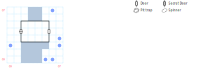

# Bridge of Exiles

The most straightforward board in the entire game. No monsters, just a one-way door and a bunch of screaming.

And no, *D:Soften Stone* doesn't work here.

## Exits

West: The [Isle of the Damned](dilmun.md) (06,18).

East: [King's Isle](dilmun.md) (08,18), right on top of a fight with a bunch of Goblins.

For hilarity, try exiting to the north on the east side of the bridge, then run away from the Goblins.

## Points of Interest

**The One-way Door (02,04):** The sign says "Door closes automatically", and it means it. When you go through it, the door is erased and you're stuck on the Isle of the Damned.

