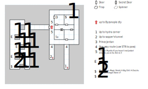

# Byzanople Dungeon

Apologies for the idiotic way this map is aligned; the developers clearly wanted it to line up with the Byzanople map (despite being a more appropriate 16x15 instead of Byzanople's unnecessary 16x16). As a result, the map wraps needlessly.

Of course, you'll need **light** and a **compass** down here.

## Exits

The only actual exit from this map is the stairs at (06,09) that take you up to [Byzanople](byzanople.md) (06,09). Technically you can also reverse course if you came down into one of the tunnels (09,01) or (07,03).

## Points of Interest

**The Tunnels (06,01 - 09,05):** Regardless of which one you entered, there's a staircase back up in the S end of the tunnel. If you walk to the N end and use STR 18 or better, you're teleported to the other side of the wall.

**The Guardroom (09,07 - 10,08):** If you haven't joined forces with Prince Jordan, this room is full of City Militia and Royal Guards.

**The Jail (07,07 - 08,08):** If you get thrown in here, you are well and truly stuck. Either Myrolla is going to take pity on you and introduce you to Jordan, or you tried (and failed) to kill Jordan and you're literally stuck here forever. The door can't be opened. Hope you backed up your save files.

**Princess Myrolla (06,08 or 06,10):** If you haven't already joined forces with (or killed) Prince Jordan, Princess Myrolla is here preventing you from climbing the stairs. She sends you to Jail (unless you kill her) but then she comes to get you after 20 turns.

**Prince Jordan (07,11):** Read paragraph #108. You can either join him (paragraph #109), in which case the door to the W appears out of thin air, or you can kill him, in which case Kingshome wins the war, everyone is doomed, and somehow it's still your responsibility to defeat Namtar and become the new king. (There isn't actually any other consequence for doing this.)

**The Treasure Vault (09,11):** **Magic Chain** (+7 AC), a **Magic Shield** (+3 AC, STR 10), some **Long Bolts** (1d4, +20' range), scrolls of *H:Big Chill* and *H:Dazzle*, and seven **Dragon Stones**.

**The Crypt (14,01 - 01,10):** Down a hallway past two locked doors (level 1), you'll read paragraph #111 and find a bunch of encounters with Zombies. In the SW corner of the crypt is a chest containing the **MagicAxe** (1d30, +1 AV, STR 20).

## Bestiary

<table>
  <tr>
    <th></th>
    <th>STR</th>
    <th>DEX</th>
    <th>INT</th>
    <th>SPR</th>
    <th>HD</th>
    <th>HP</th>
    <th>AV</th>
    <th>DV</th>
    <th>Speed</th>
    <th>XP</th>
  </tr>
  <tr>
    <td><b>City Militamen</b></td>
    <td>15</td>
    <td>16</td>
    <td>9</td>
    <td>10</td>
    <td>5d6+3</td>
    <td>8-33</td>
    <td>+2</td>
    <td>+0</td>
    <td>10'</td>
    <td>120</td>
  </tr><tr>
    <td></td>
    <td colspan="10">5d6, 5d8, 5d8 piercing, call for help — awards gold</td>
  </tr>
  <tr>
    <td><b>Royal Guards</b></td>
    <td>12</td>
    <td>22</td>
    <td>10</td>
    <td>10</td>
    <td>6d6+30</td>
    <td>36-66</td>
    <td>+4</td>
    <td>+0</td>
    <td>10'</td>
    <td>130</td>
  </tr><tr>
    <td></td>
    <td colspan="10">10d6 stun, 1d6 piercing, block, call for help — awards gold</td>
  </tr>
  <tr>
    <td><b>Throneroom Guards</b></td>
    <td>18</td>
    <td>18</td>
    <td>18</td>
    <td>18</td>
    <td>5d6+32</td>
    <td>37-62</td>
    <td>+38</td>
    <td>+0</td>
    <td>10'</td>
    <td>150</td>
  </tr><tr>
    <td></td>
    <td colspan="10">5d6, <i>L:Mage Fire</i>, call for help — awards gold</td>
  </tr>
</table>

The royal siblings:

<table>
  <tr>
    <th></th>
    <th>STR</th>
    <th>DEX</th>
    <th>INT</th>
    <th>SPR</th>
    <th>HD</th>
    <th>HP</th>
    <th>AV</th>
    <th>DV</th>
    <th>Speed</th>
    <th>XP</th>
  </tr>  
  <tr>
    <td><b>Princess Myrolla</b></td>
    <td>12</td>
    <td>24</td>
    <td>14</td>
    <td>30</td>
    <td>6d6+15</td>
    <td>21-51</td>
    <td>+3</td>
    <td>+0</td>
    <td>10'</td>
    <td>200</td>
  </tr><tr>
    <td></td>
    <td colspan="10"><i>H:Ice Chill</i> @2, flee</td>
  </tr>
  <tr>
    <td><b>Prince Jordan</b></td>
    <td>33</td>
    <td>30</td>
    <td>10</td>
    <td>10</td>
    <td>6d6+30</td>
    <td>36-66</td>
    <td>+1</td>
    <td>+0</td>
    <td>10'</td>
    <td>150</td>
  </tr><tr>
    <td></td>
    <td colspan="10">6d6</td>
  </tr>
</table>

The guardians of the vault:

<table>
  <tr>
    <th></th>
    <th>STR</th>
    <th>DEX</th>
    <th>INT</th>
    <th>SPR</th>
    <th>HD</th>
    <th>HP</th>
    <th>AV</th>
    <th>DV</th>
    <th>Speed</th>
    <th>XP</th>
  </tr>
  <tr>
    <td><b>Zombies</b></td>
    <td>40</td>
    <td>14</td>
    <td>1</td>
    <td>1</td>
    <td>10d4+4</td>
    <td>14-44</td>
    <td>+3</td>
    <td>+0</td>
    <td>10'</td>
    <td>130</td>
  </tr><tr>
    <td></td>
    <td colspan="10">7d6</td>
  </tr>
</table>
