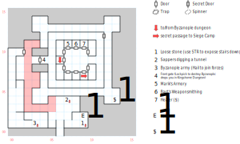

# Byzanople

## Exits

(06,00): Back to the [Siege Camp](siege-camp.md) (09,15)

(09,01): To the longer tunnel in the [Byzanople Dungeon](byzanople-dungeon.md) (09,01)

(07,04): To the shorter tunnel in the [Byzanople Dungeon](byzanople-dungeon.md) (07,04)

(09,07): To the "final fight" portion of the [Siege Camp](siege-camp.md) (02,05)

(06,09): Down to the [Byzanople Dungeon](byzanople-dungeon.md) (06,09)

## Points of Interest

Note: Once the war is over, everything in the SW portion of the map goes away (the Hydra, the sappers, the Siege Run, Princess Myrilla, and affiliated color text and paragraphs). If Kingshome won, you also lose the city shops.

**Hydra Corner (09,01 - 09,02):** There's a large boulder here that you can either *Soften* or move with STR 18. Doing so reveals a tunnel down into the [dungeon](byzanople-dungeon.md) at (09,01). If you step 1N of there, though, you'll fight a Hydra.

**The Sappers (07,04):** Some sappers (paragraph #37) have dug a tunnel under the city walls. You can follow it to the [dungeon](byzanople-dungeon.md) at (07,04).

**The Siege Run (02,03 - 05,11):** Defenders rain arrows down on you as you run through the red-colored squares on the map above. Each move sucks 1 HP, but you can use skills (like *Bandage*) for free.

**The City Gates (03,09 - 04,09):** You can open them, which decides the war in favor of Kingshome, with *D:Soften Stone* or (from the inside only) *Lockpick 2*. Read paragraph #71; Buck throws you in the [Kingshome Dungeon](kingshome-dungeon.md) (00,15).

**The Back Way (02,10):** There's another locked door (level 1) here that leads up into the hills around Byzanople. Follow that path around and you'll find...

**Princess Myrilla (03,01):** You sneak up on them (paragraph #21) at (02,01). Attack them and they fall easily. Hail them and the princess will introduce you to her brother in the [dungeon](byzanople-dungeon.md) (07,11).

**The Dungeon Stairs (06,09):** Takes you down to the [dungeon level](byzanople-dungeon.md) (06,09).

**The Secret Passage (09,07):** Takes you to the hills above the [Siege Camp](siege-camp.md) (02,05).

**The Hidden Shield (13,04):** Walk through the secret door at (12,12) and head S to find a chest (difficulty 3) containing the **Fire Shield** (+2 AC, -2 AV, STR 12).

The game's item data on the Fire Shield (both this one and the one you find in the Kingshome Dungeon) claims that, if it were a weapon, it would do 1d12 at 40'. But as far as I know, there's no code in the combat handler that would know how to look for a *shield* that could be used as a melee weapon.

**[Marik's Armory](../things-and-stuff.md#mariks-armory) (07,11):** They carry **Plate Mail** (+10 AC, -5 AV) and **Dragon Stones**.

**[Bart's Weaponsmithing](../things-and-stuff.md#barts-weaponsmithing) (08,11):** The **Long Mace** (1d20 at 20', +1 AV, STR 15) may be of interest.

**Town Healer (09,11):** Charges $4 per point of Health.

## Monsters

<table>
  <tr>
    <th></th>
    <th>STR</th>
    <th>DEX</th>
    <th>INT</th>
    <th>SPR</th>
    <th>HD</th>
    <th>HP</th>
    <th>AV</th>
    <th>DV</th>
    <th>Speed</th>
    <th>XP</th>
  </tr>
  <tr>
    <td><b>Guards</b></td>
    <td>12</td>
    <td>13</td>
    <td>10</td>
    <td>10</td>
    <td>3d6+3</td>
    <td>6-21</td>
    <td>+2</td>
    <td>+0</td>
    <td>10'</td>
    <td>120</td>
  </tr><tr>
    <td></td>
    <td colspan="10">5d6, block, call for help — awards gold</td>
  </tr>
  <tr>
    <td><b>Hydra</b></td>
    <td>18</td>
    <td>30</td>
    <td>1</td>
    <td>10</td>
    <td>8d4+90</td>
    <td>98-122</td>
    <td>+3</td>
    <td>+0</td>
    <td>30'</td>
    <td>500</td>
  </tr><tr>
    <td></td>
    <td colspan="10">2d6 breath</td>
  </tr>
  <tr>
    <td><b>Pikemen</b></td>
    <td>15</td>
    <td>15</td>
    <td>9</td>
    <td>10</td>
    <td>6d6+12</td>
    <td>18-48</td>
    <td>+2</td>
    <td>+0</td>
    <td>10'</td>
    <td>120</td>
  </tr><tr>
    <td></td>
    <td colspan="10">5d6, 5d8 x ¼, 5d8 piercing, call for help — awards gold</td>
  </tr>
  <tr>
    <td><b>Princess Myrilla</b></td>
    <td>12</td>
    <td>24</td>
    <td>14</td>
    <td>30</td>
    <td>6d6+6</td>
    <td>12-42</td>
    <td>+3</td>
    <td>+0</td>
    <td>30'</td>
    <td>300</td>
  </tr><tr>
    <td></td>
    <td colspan="10">6d6, <i>L:Mage Fire</i></td>
  </tr>
  <tr>
    <td><b>Royal Guards</b></td>
    <td>18</td>
    <td>18</td>
    <td>18</td>
    <td>18</td>
    <td>5d6+6</td>
    <td>11-36</td>
    <td>+3</td>
    <td>+0</td>
    <td>20'</td>
    <td>150</td>
  </tr><tr>
    <td></td>
    <td colspan="10">5d6 piercing, 7d6 stun, <i>L:Mage Fire</i>, call for help — awards gold</td>
  </tr>
</table>