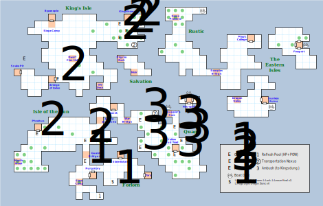

# Dilmun

As a warning, you can't cast *D:Create Wall* here, and *D:Soften Stone* probably won't get you anywhere. Just in case you were tempted to try. Also, the map wraps, not that you can actually go sailing over the water.

## Points of Interest

### Forlorn

**[Purgatory](purgatory.md) (13,04):** Contains a route to the [Underworld](magan-underworld.md).

**[Slave Camp](slave-camp.md) (11,03)**.

**[Slave Estate](slave-estate.md) (17,07)** and the Slave Mines beneath it.

The ruins of **[Tars](tars-ruins.md) (21,04)** and its dungeon.

**The Refresh Pool (14,01):** If you swim your way out of Purgatory, you wind up right next to this pool, which will refresh your Health, Stun, and Power for free.

**The Arms Cache (16,03):** Some Low Magic scrolls and four **Dragon Stones**.

**Guards (12,06):** Before you can get to the bridge, some Guards will jump you. (This combat goes away once you beat it.)

**[Guard Bridge #1](guard-bridge-1.md) (12,07):** Connects you to Isle of the Sun.

### Isle of the Sun

**[Guard Bridge #1](guard-bridge-1.md) (12,07):** Connects you to Forlorn.

**Goblins (12,09):** A bunch of Goblins wait for you on the N side of the bridge. This combat regenerates, so you'll have to fight it every time you come to Sun.

**Goblin Brothers (05,10):** Just outside Phoebus, there's another bunch of Goblins that are angry that you beat up their brothers at (12,09). You only have to fight them once, though.

**[Phoebus](phoebus.md) (05,11)**. Can be destroyed by a dragon.

**[Mystic Wood](mystic-wood.md) (02,06):** Contains both a route to the [Underworld](magan-underworld.md) as well as a Transportation Nexus.

**[Guard Bridge #2](guard-bridge-2.md) (14,12):** Connects you to Lansk.

### Isle of Lansk

**[Guard Bridge #2](guard-bridge-2.md) (14,12):** Connects you to Sun.

**[Lansk](lansk.md) (16,14)** and its Undercity, which connects to the [Underworld](magan-underworld.md) and has a ferry to the Old Dock.

**[War Bridge](war-bridge.md) (18,12):** Connects you to Quag.

### Quag

**[War Bridge](war-bridge.md) (18,12):** Connects you to Lansk.

**Murk Trees (20,12; 20,08; 25,11; 25,07; 26,09):** Dangerous.

**Transportation Nexus (22,13)**.

**[Yellow Mud Toad](yellow-mud-toad.md) (25,08)** and Lanac'toor's Laboratory, which connects to the [Underworld](magan-underworld.md).

**[Smuggler's Cove](smugglers-cove.md) (24,13)**, which contains a Boat Dock (eventually).

### Necropolis

**[The Necropolis](necropolis.md) (27,15)**, which connects to the Well of Souls (but no other part of the Underworld) and also contains a boat dock.

### King's Isle

**Transportation Nexus (19,23)**.

**Goblins (17,24; 17,26; 18,25; 19,26):** almost like they're guarding Kingshome.

**Ambush (20,26):** The first time you step on this square, you're subdued by guards and thrown in the [Kingshome Dungeon](kingshome-dungeon.md). This is also where the ferry master from the Snake Pit drops you, which may very well trigger the ambush if you haven't already.

**[Kingshome](kingshome.md) (18,27)** and its dungeon.

**[Siege Camp](siege-camp.md) (07,26)**, **[Byzanople](byzanople.md) (07,27)**, and its dungeon. You can't enter Byzanople directly without going through the Siege Camp, even after the battle has been resolved.

**[Dwarf Ruins](dwarf-ruins.md) (10,21)** and the Clan Hall beneath, which connects to the Underworld (sort of).

The **[Old Dock](old-dock.md) (14,17)** can be used to travel to the Lansk Undercity or the Pilgrim Dock.

**More Goblins (08,18):** These guys are just insult to injury; the fight regenerates, so if you try to exit the Bridge of Exiles to the E you hit them immediately.

**[Bridge of Exiles](bridge-of-exiles.md) (07,18):** a one-way door that conveys you to the Snake Pit.

**[Snake Pit](snake-pit.md) (02,19)**.

### Rustic

**Boat Dock (29,28)**.

The **[Game Preserve](game-preserve.md) (25,27)**.

The **[Scorpion Bridge](scorpion-bridge.md) (31,19):** links you to the Magic College.

The **[Magic College](magic-college.md) (36,24)**.

### The Eastern Isles

**[Freeport](freeport.md) (43,23):** contains a Boat Dock.

**Boat Dock (39,14):** for the Sunken Ruins and Dragon Valley.

**[Sunken Ruins](sunken-ruins.md) (38,15)** and the underwater part.

**[Dragon Valley](dragon-valley.md) (34,15)**.

### Salvation

The **[Pilgrim Dock](pilgrim-dock.md) (17,21)**: a one-way trip from the Old Dock.

Mount **[Salvation](salvation.md) (19,19)**, which is confusingly marked 'Nisir' during overland travel. Salvation connects to both the Underworld and to the Depths of Nisir.

## Monsters

**Goblins:** STR 10 DEX 16 INT 06 SPR 10, HD:4d4+1 (5-17), AV+3 DV+0, morale:7, spd:30', XP:90

- Attacks: 4d6

**Guard Goblins:** STR 00 DEX 20 INT 00 SPR 00, HD:4d4+20 (24-36), AV+4 DV+0, morale:8, spd:30', XP:120

- Attacks: 6d6

**Guards:** STR 20 DEX 16 INT 01 SPR 03, HD:2d8+3 (5-19), AV+1 DV+0, morale:6, spd:10', XP:100

- Attacks: 1d20, 2d12

**Murk Trees:** STR 00 DEX 16 INT 00 SPR 00, HD:8d10+15 (23-95), AV+4 DV+0, morale:8, spd:50', XP:150

- Attacks: 7d8