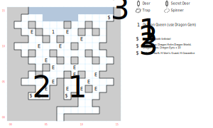

# Dragon Valley

The home of the fearsome Dragon Queen, who also happens to be your ticket to defeating Namtar's army.

There are plenty of really nasty encounters here, including random ones (1 in 33). You'll also find a bunch of color text talking about how you're tromping all over defenseless little eggs and tiny baby saurians, and (if you have the sound on) the occasional dragon roar.

Paragraph #147 sure looks like it belongs here, but isn't ever referenced.

## Exits

South (07,00): Exit to the [Eastern Isles](dilmun.md) (34,14).

## Points of Interest

**The Dead Dragon (08,03):** There's a skeleton of a dead dragon here with an infinite supply of **Dragon Teeth** (2d20 at 60', +8 AV, +2 AC, STR 12).

**The Armor Cache (03,03):** An open chest containing **Dragon Tears** (worth $5000), the **Holy Lance** (3d20, +4 AV, STR 13), a **Dragon Helm** (+4 AC, -1 AV), a **Dragon Shield** (+5 AC, STR 10), and fifteen **Dragon's Eyes** which are like Dragon Stones but they restore 30 POW instead of 20.

**The Magic Cache (14,14):** A tough chest (difficulty 5) with some scrolls: *H:Sala's Swift, H:Vorn's Guard*, and *H:Cowardice*.

**The Dragon Queen (06,12):** Read paragraph #134. Your only hope is to use the **Dragon Gem** that you received from the dragon in [Lansk](lansk-undercity.md); read paragraph #120 and gain 500 XP. If you try to run away, she attacks. With 100 DEX and a 10d12 breath weapon she *will* win, at which point you are blown back to the entrance (07,00).

If you somehow manage to defeat her, she "surrenders" and swears to answer the call of the Dragon Gem next time you use it. However, this path *doesn't set the global flag* that gets checked when you face Namtar's army in the Nisir, so I don't even think it would work.

## Bestiary

<table>
  <tr>
    <th></th>
    <th>STR</th>
    <th>DEX</th>
    <th>INT</th>
    <th>SPR</th>
    <th>HD</th>
    <th>HP</th>
    <th>AV</th>
    <th>DV</th>
    <th>Speed</th>
    <th>XP</th>
  </tr>
  <tr>
    <td><b>Cockatrices</b></td>
    <td>90</td>
    <td>20</td>
    <td>1</td>
    <td>1</td>
    <td>8d8+35</td>
    <td>43-99</td>
    <td>+2</td>
    <td>+0</td>
    <td>40'</td>
    <td>210</td>
  </tr><tr>
    <td></td>
    <td colspan="10">1d6 breath</td>
  </tr>
  <tr>
    <td><b>Dragon warriors</b></td>
    <td>120</td>
    <td>26</td>
    <td>10</td>
    <td>20</td>
    <td>10d8+35</td>
    <td>45-115</td>
    <td>+4</td>
    <td>+0</td>
    <td>30'</td>
    <td>300</td>
  </tr><tr>
    <td></td>
    <td colspan="10">7d8</td>
  </tr>
  <tr>
    <td><b>Fangers</b></td>
    <td>60</td>
    <td>16</td>
    <td>1</td>
    <td>1</td>
    <td>2d10+11</td>
    <td>13-31</td>
    <td>+5</td>
    <td>+0</td>
    <td>60'</td>
    <td>100</td>
  </tr><tr>
    <td></td>
    <td colspan="10">1d4 piercing</td>
  </tr>
  <tr>
    <td><b>Mages</b></td>
    <td>0</td>
    <td>22</td>
    <td>0</td>
    <td>0</td>
    <td>3d10+45</td>
    <td>48-75</td>
    <td>+4</td>
    <td>+0</td>
    <td>10'</td>
    <td>230</td>
  </tr><tr>
    <td></td>
    <td colspan="10"><i>D:Brambles</i></td>
  </tr>
</table>

You really don't want to rumble with the Queen:

<table>
  <tr>
    <th></th>
    <th>STR</th>
    <th>DEX</th>
    <th>INT</th>
    <th>SPR</th>
    <th>HD</th>
    <th>HP</th>
    <th>AV</th>
    <th>DV</th>
    <th>Speed</th>
    <th>XP</th>
  </tr>  
  <tr>
    <td><b>Dragon Brood Queen</b></td>
    <td>200</td>
    <td>100</td>
    <td>100</td>
    <td>100</td>
    <td>4d100+100</td>
    <td>104-500</td>
    <td>+200</td>
    <td>+0</td>
    <td>150'</td>
    <td>3200</td>
  </tr><tr>
    <td></td>
    <td colspan="10">10d12 breath — can't be disarmed</td>
  </tr>
</table>
