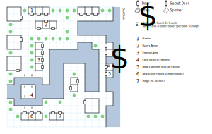

# Freeport

The last holdout from Namtar's rule... mostly because it's literally the furthest away.

Random encounters with nasty Adventurers abound (1 in 100).

## Exits

If you exit the city on foot, you can explore the small [island](dilmun.md) that Freeport sits on, but there's nothing out there and the only way off this island is the Boat Dock (14,14).

## Points of Interest

Note: If Freeport has been evacuated, the shops are all closed and the City Councils are no longer present. You can still kill The Order, though.

**Town Healer (03,16):** Costs $4 per point of Health.

**[Ryan's Armor](../things-and-stuff.md#ryans-armor) (05,14):** For no apparent reason, **Large Shields** (+3 AC, -2 AV, STR 12) only cost $100 here instead of the usual $1000.

**[Freeport Arms](../things-and-stuff.md#freeport-arms) (04,09):** Whatever you do, *don't* buy the **Long Mace** (1d12, +1 AV, STR 15) here, because it doesn't have the same stats (including reach) as the one you find in Byzanople.

**[Bewitching Potions and Elixirs](../things-and-stuff.md#bewitching-potions-and-elixirs) (03,01):** Nothing but **Dragon Stones**.

**[Magic Inc.](../things-and-stuff.md#magic-inc) (07,01):** Several useful High Magic scrolls, plus spare copies of *D:Soften Stone*.

**Brews Brothers (14,07):** You can pick up Halifax here, along with several important hints from the bartender.

**Freeport City Council (01,12):** A local official wonders why Drake would suddenly start waging war on his children (paragraph #57).

**Tars City Council (11,03):** In exile since their dragon failed to protect their city from Namtar, the First Citizen of Tars (paragraph #56) hints at the existence of the Tars Dungeon as well as somehow turning the dragons against Namtar.

**The Order of the Sword (14,08):** A nasty fight with 10-16 Guards. Beat them and unlock their chest (difficulty 4) for the **Stone Hands**, a **Spell Staff** (1d10, +5 AV, +8 AC, requires *Low Magic 1*), and scrolls of *D:Soften Stone* and *S:Charger*.

**The Fake Sword of Freedom (02,04 - 03,05):** If you approach from the north, read paragraph #52 for some history on the Sword of Freedom. You can use the **Golden Boots** to hop to this island (paragraph #27). If you cast a trap-detection spell or *H:Reveal Glamour*, the fake sword is immediately revealed. This makes the residents very upset.

If you step on (03,04), the game asks you to take the Sword. It's a trap, of course, and anyone who takes the Sword is immediately incinerated. This *also* makes the residents very upset.

However, there's a logic bug here. As soon as the Sword is revealed, the townspeople are supposed to flee in panic, turning Freeport into a ghost town. In practice, this only happens if you step on (02,05) or leave and re-enter Freeport. So if you reveal the fake Sword, you have the option of (carefully) continuing to run around town and do whatever you want. But don't leave until you're done.

## Bestiary

<table>
  <thead>
    <tr>
      <th></th>
      <th>STR</th>
      <th>DEX</th>
      <th>INT</th>
      <th>SPR</th>
      <th>HP</th>
      <th>AV</th>
      <th>DV</th>
      <th>Speed</th>
      <th>XP</th>
    </tr>
  </thead>
  <tbody>
    <tr>
      <td rowspan=2><b>Adventurers</b></td>
      <td class="c">20</td>
      <td class="c">30</td>
      <td class="c">20</td>
      <td class="c">2</td>
      <td class="c">40&ndash;75</td>
      <td class="c">+2</td>
      <td class="c">+0</td>
      <td class="c">50'</td>
      <td class="c">140</td>
    </tr><tr>
      <td colspan=9>8d8</td>
    </tr><tr>
      <td rowspan=2><b>Citizens</b></td>
      <td class="c">10</td>
      <td class="c">18</td>
      <td class="c">10</td>
      <td class="c">30</td>
      <td class="c">17&ndash;27</td>
      <td class="c">+3</td>
      <td class="c">+0</td>
      <td class="c">10'</td>
      <td class="c">50</td>
    </tr><tr>
      <td colspan=9>flee</td>
    </tr><tr>
      <td rowspan=2><b>Doomsayers</b></td>
      <td class="c">5</td>
      <td class="c">5</td>
      <td class="c">5</td>
      <td class="c">5</td>
      <td class="c">1&ndash;4</td>
      <td class="c">+10</td>
      <td class="c">+0</td>
      <td class="c">60'</td>
      <td class="c">40</td>
    </tr><tr>
      <td colspan=9>flee</td>
    </tr><tr>
      <td rowspan=2><b>Guards</b></td>
      <td class="c">15</td>
      <td class="c">22</td>
      <td class="c">9</td>
      <td class="c">10</td>
      <td class="c">39&ndash;59</td>
      <td class="c">+3</td>
      <td class="c">+0</td>
      <td class="c">10'</td>
      <td class="c">150</td>
    </tr><tr>
      <td colspan=9>8d8 – awards gold</td>
    </tr>
  </tbody>
</table>
