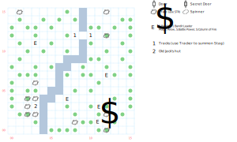

# Game Preserve

Plenty of random encounters (1 in 33), and even more traps. It's worth running a trap-detection spell while you're here.

At any point, you can use *Forest Lore* for a hint that there's probably a game warden around, and use *Tracker* for a hint that there's probably some game near the river.

## Exits

You can leave on foot in any direction, which brings you to the expected place on [Rustic](dilmun.md) near (25,27).

## Points of Interest

**Snare traps (various):** The warden has set a number of snare traps around the map. You can avoid them if you have a trap-detection spell running. If you get caught in one, you're stuck for 40 turns unless you use a weapon (ammunition doesn't count) or Strength (18 or better) to break out of the trap.

**The Stag (08,12 - 10,12):** Approach the ford in the river, and you'll find animal tracks. Use *Hiding* or *Tracker* and a stag will appear. Killing the stag is one way to summon Jack, the game warden (paragraph #92).

**Jack's House (03,03):** If you haven't already talked to the warden, he's here (paragraph #96).

**Talking to Jack:** Wherever you run into him, Jack is initially suspicious. If you use *Bureaucracy*, *Forest Lore*, or *Tracker* to try to win him over, he likes you but throws you out the forest anyway ([Rustic](dilmun.md) (25,26)). If you show him the **Signet Ring**, he realizes old King Drake is dead and vanishes quietly into the distance, leaving you his **Magic Bow** (+4 AV, 70' range, DEX 10). If you run away from him, he attacks and you have to kill him, after which you get his Bow anyway.

**The Bandit Trap (12,02):** There's a tripwire here, which you spot if you have a trap-detection spell running. Otherwise, a bell rings and you have to fight off a bunch of Bandits.

**The Bandit Campsite (11,01):** The Bandits (who look an awful lot like Goblins) are hanging out around their campfire. They have a chest that contains paragraph #91, some **Magic Arrows** (1d20, +3 AV), and scrolls of *S:Battle Power* and *S:Column of Fire*.

## Monsters

It seems weird to me that there would be so many supernatural creatures running around King Drake's Game Preserve. Maybe it's Namtar's influence... or maybe Jack's not very good at his job, eh?

<table>
  <tr>
    <th></th>
    <th>STR</th>
    <th>DEX</th>
    <th>INT</th>
    <th>SPR</th>
    <th>HD</th>
    <th>HP</th>
    <th>AV</th>
    <th>DV</th>
    <th>Speed</th>
    <th>XP</th>
  </tr>
  <tr>
    <td><b>Bush Wizard</b></td>
    <td>10</td>
    <td>4</td>
    <td>30</td>
    <td>60</td>
    <td>8d8+25</td>
    <td>33-89</td>
    <td>+7</td>
    <td>+0</td>
    <td>10'</td>
    <td>240</td>
  </tr><tr>
    <td></td>
    <td colspan="10"><i>H:Fire Light</i> @2, flee</td>
  </tr>
  <tr>
    <td><b>Elementals</b></td>
    <td>50</td>
    <td>4</td>
    <td>1</td>
    <td>1</td>
    <td>10d4+10</td>
    <td>20-50</td>
    <td>+6</td>
    <td>+0</td>
    <td>30'</td>
    <td>400</td>
  </tr><tr>
    <td></td>
    <td colspan="10"><i>S:Wrath of Mithras</i>, <i>S:Fire Storm</i></td>
  </tr>
  <tr>
    <td><b>Hell Hounds</b></td>
    <td>20</td>
    <td>20</td>
    <td>3</td>
    <td>10</td>
    <td>10d6+20</td>
    <td>30-80</td>
    <td>+3</td>
    <td>+0</td>
    <td>30'</td>
    <td>170</td>
  </tr><tr>
    <td></td>
    <td colspan="10">2d4 breath</td>
  </tr>
  <tr>
    <td><b>Ogre</b></td>
    <td>45</td>
    <td>10</td>
    <td>5</td>
    <td>10</td>
    <td>8d10+10</td>
    <td>18-90</td>
    <td>+3</td>
    <td>+0</td>
    <td>10'</td>
    <td>180</td>
  </tr><tr>
    <td></td>
    <td colspan="10">8d6, flee — can't be disarmed</td>
  </tr>
  <tr>
    <td><b>Spiders</b></td>
    <td>12</td>
    <td>22</td>
    <td>3</td>
    <td>5</td>
    <td>2d8+15</td>
    <td>17-31</td>
    <td>+3</td>
    <td>+0</td>
    <td>30'</td>
    <td>180</td>
  </tr><tr>
    <td></td>
    <td colspan="10">11d4, 2d4 piercing, flee</td>
  </tr>
  <tr>
    <td><b>Spit Snakes</b></td>
    <td>40</td>
    <td>20</td>
    <td>8</td>
    <td>10</td>
    <td>3d20+15</td>
    <td>18-75</td>
    <td>+2</td>
    <td>+0</td>
    <td>20'</td>
    <td>160</td>
  </tr><tr>
    <td></td>
    <td colspan="10">2d6 breath, flee — can't be disarmed</td>
  </tr>
  <tr>
    <td><b>Wood Spirit</b></td>
    <td>3</td>
    <td>12</td>
    <td>30</td>
    <td>50</td>
    <td>4d8+25</td>
    <td>29-57</td>
    <td>+3</td>
    <td>+0</td>
    <td>10'</td>
    <td>200</td>
  </tr><tr>
    <td></td>
    <td colspan="10"><i>D:Brambles</i></td>
  </tr></table>

The Stag:

<table>
  <tr>
    <th></th>
    <th>STR</th>
    <th>DEX</th>
    <th>INT</th>
    <th>SPR</th>
    <th>HD</th>
    <th>HP</th>
    <th>AV</th>
    <th>DV</th>
    <th>Speed</th>
    <th>XP</th>
  </tr>
  <tr>
    <td><b>Stag</b></td>
    <td>20</td>
    <td>24</td>
    <td>8</td>
    <td>20</td>
    <td>4d8+0</td>
    <td>4-32</td>
    <td>+3</td>
    <td>+0</td>
    <td>00'</td>
    <td>1</td>
  </tr><tr>
    <td></td>
    <td colspan="10">4d4</td>
  </tr>
</table>

The bandit party:

<table>
  <tr>
    <th></th>
    <th>STR</th>
    <th>DEX</th>
    <th>INT</th>
    <th>SPR</th>
    <th>HD</th>
    <th>HP</th>
    <th>AV</th>
    <th>DV</th>
    <th>Speed</th>
    <th>XP</th>
  </tr>
  <tr>
    <td><b>Bandits</b></td>
    <td>20</td>
    <td>15</td>
    <td>5</td>
    <td>10</td>
    <td>8d8+15</td>
    <td>23-79</td>
    <td>+3</td>
    <td>+0</td>
    <td>10'</td>
    <td>160</td>
  </tr><tr>
    <td></td>
    <td colspan="10">8d6, dodge, flee</td>
  </tr>
  <tr>
    <td><b>Bandit Leader</b></td>
    <td>35</td>
    <td>30</td>
    <td>15</td>
    <td>30</td>
    <td>10d8+30</td>
    <td>40-110</td>
    <td>+2</td>
    <td>+0</td>
    <td>30'</td>
    <td>220</td>
  </tr><tr>
    <td></td>
    <td colspan="10">1d8 breath, 5d6, dodge, 5d6 piercing — awards gold</td>
  </tr>
</table>

The forest's warden:

<table>
  <tr>
    <th></th>
    <th>STR</th>
    <th>DEX</th>
    <th>INT</th>
    <th>SPR</th>
    <th>HD</th>
    <th>HP</th>
    <th>AV</th>
    <th>DV</th>
    <th>Speed</th>
    <th>XP</th>
  </tr>
  <tr>
    <td><b>Old Jack</b></td>
    <td>20</td>
    <td>24</td>
    <td>12</td>
    <td>30</td>
    <td>8d8+15</td>
    <td>23-79</td>
    <td>+2</td>
    <td>+0</td>
    <td>50'</td>
    <td>400</td>
  </tr><tr>
    <td></td>
    <td colspan="10">1d6 piercing</td>
  </tr>
</table>
