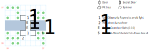

# Guard Bridge #1

Allows passage between Forlorn and Isle of the Sun, but you won't get there without some hassle.

## Exits

North: [Isle of the Sun](dilmun.md) (12,08)

South: [Forlorn](dilmun.md) (12,06)

These exits are correct even if you exit to the East or West from the appropriate side of the bridge.

## Points of Interest

**Lanac'toor's Rock (03,01):** A hint on how to restore the statue of Lanac'toor in Yellow Mud Toad, which grants access to his laboratory. Useful if you picked up the Stone Arms already in Tars.

**The Arms Cache (07,02):** A **Helm** (+1 AC), a **Shield** (+2 AC, STR 10), the **Bladed Flail** (1d12, STR 10), a copy of *S:Sun Light*, and four **Dragon Stones**.

**The Southern Approach (04,02):** Guards demand to see your Citizenship Papers; if you show them, they demand a bribe of $10 per party member. If you blow past them, they attack on the bridge.

**The Northern Approach (04,05):** Guards ask you if you're sure you know where you're going, then demand to see your Citizenship Papers. No bribe in this direction, though.

**The Bridge (04,03 - 04,04):** If you didn't appease the Guards, they attack. Otherwise, there's a 1 in 10 chance of getting swarmed by some Rats.

## Bestiary

<table>
  <tr>
    <th></th>
    <th>STR</th>
    <th>DEX</th>
    <th>INT</th>
    <th>SPR</th>
    <th>HD</th>
    <th>HP</th>
    <th>AV</th>
    <th>DV</th>
    <th>Speed</th>
    <th>XP</th>
  </tr>
  <tr>
    <td><b>Bridge Guards</b></td>
    <td>15</td>
    <td>20</td>
    <td>9</td>
    <td>10</td>
    <td>10d6+5</td>
    <td>15-65</td>
    <td>+20</td>
    <td>+0</td>
    <td>10'</td>
    <td>320</td>
  </tr><tr>
    <td></td>
    <td colspan="10">4d8, call for help — awards gold</td>
  </tr>
  <tr>
    <td><b>Rats!</b></td>
    <td>8</td>
    <td>18</td>
    <td>2</td>
    <td>3</td>
    <td>1d4+0</td>
    <td>1-4</td>
    <td>+6</td>
    <td>+0</td>
    <td>50'</td>
    <td>70</td>
  </tr><tr>
    <td></td>
    <td colspan="10">3d4, flee, 1d4 health</td>
  </tr>
</table>
