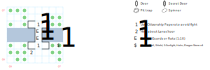

# Guard Bridge #1

Allows passage between Forlorn and Isle of the Sun, but you won't get there without some hassle.

## Exits

North: [Isle of the Sun](dilmun.md) (12,08)

South: [Forlorn](dilmun.md) (12,06)

These exits are true even if you exit to the East or West from the appropriate side of the bridge.

## Points of Interest

**Lanac'toor's Rock (03,01):** A hint on how to restore the statue of Lanac'toor in Yellow Mud Toad, which grants access to his laboratory. Useful if you picked up the Stone Arms already in Tars.

**The Arms Cache (07,02):** A **Helm** (+1 AC), a **Shield** (+2 AC, STR 10), the **Bladed Flail** (1d12, STR 10), a copy of *S:Sun Light*, and four **Dragon Stones**.

**The Southern Approach (04,02):** Guards demand to see your Citizenship Papers; if you show them, they demand a bribe of $10 per party member. If you blow past them, they attack on the bridge.

**The Northern Approach (04,05):** Guards ask you if you're sure you know where you're going, then demand to see your Citizenship Papers. No bribe in this direction, though.

**The Bridge (04,03 - 04,04):** If you didn't appease the Guards, they attack. Otherwise, there's a 1 in 10 chance of getting swarmed by some Rats.

## Monsters

​    [00] Bridge Guard\s (he/him) [#2], STR 15 DEX 20 INT 09 SPR 10, HD:10d6+5 (15-65), AV+20 DV+0, att:1, morale:4, spd:10', XP:320, awards gold, image:Halbard Guard, [24]:0x02; 4d8, call for help

​    [01] Rat\s! (it) [#19], STR 08 DEX 18 INT 02 SPR 03, HD:1d4+0 (1-4), AV+6 DV+0, att:1, morale:3, spd:50', XP:70, image:Rat, [0d]:0x64; 3d4, 1d4 health, flee