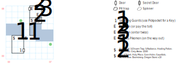

# Guard Bridge #2

Allows passage between the Isle of the Sun and Lansk. Also contains several tasty bits of kit to go after.

## Exits

North: [Lansk](dilmun.md) (14,13)

South: [Isle of the Sun](dilmun.md) (14,11)

These exits are true even if you exit to the East or West from the appropriate side of the bridge.

## Points of Interest

**The Customs Inspection (03,03):** The guards demand that you submit to a customs inspection. If someone in your party has *Merchant 2*, you can talk your way out of it by refusing to submit to inspection, but that's impossible because *Merchant* is an easter egg. Customs charges you a duty of the larger of $100 or 20% of your gold. Refuse inspection or refuse to pay and you have to fight some Pikemen.

**The Oath of Fealty (03,06):** If you came in from the N, skip this encounter. Otherwise, guards stop you and demand that you agree to comply with the laws of Lansk, which prefers to remain neutral in the whole Kingshome war thing.

Trouble is, there's a programming bug — the code that checks if you came in from the N looks for any square you've touched with Y >= 5, which includes the bridge square 1S of here. So even crossing the bridge sets the flag that skips this encounter. Oops. Anyway, there's no other impact of agreeing with the guards; if you decline, you have to fight them off.

**The Barracks (01,01 - 02,03):** Filled with sleeping guards and a chest in the NW corner. If you (a) bump into a wall (b) use less than *Lockpick 3* to try to open the chest (c) use the Key to open the chest after it's already open (d) try to steal the Key a second time (e) try to use any other skill or item inside the Barracks, the guards wake up; you have to fight off two waves of Guards and Pikemen and you can't run away or fail to defeat either wave, but once you do they're gone for good.

If you have a *Pickpocket* like Louie, you can steal a Key off the sleeping guards, then use it to open the chest for free. Otherwise, you can open it with *Lockpick 3*. (This is a hard "level" check, not a stochastic "difficulty" one like most chests.) It contains scrolls of *H:Ice Chill, S:Disarm Trap,* and *S:Radiance* along with a **Healing Potion** (*S:Heal*), the **Runed Flail** (1d20, +2 AV, +1 AC, STR 14), and the **Grey Arrow** (1d20, +2 AV).

Because of the weirdness around the skill check, this chest doesn't use a global state bit, which means **it regenerates every time you enter this board**. You can loot it as many times as you want.

**The Armory (04,06 - 05,08):** The first time you enter, an official throws you out. The second time, you'll have to fight off a bunch of Pikemen. There's a pit trap at (05,06) that does 1d8 damage, or you can avoid it with a trap-detection spell.

The chest at (04,06) contains the **Axe of Kalah** (1d12 or 1d20 at 50', +4 AV, STR 18), the **Holy Mace** (1d20, +2 AV, +1 AC, *S:Exorcism*, STR 12), the **Gem Helm** (+2 AC), some **Gauntlets** (+2 AC), the **Archer's Bow** (+3 AV, 50', DEX 18), a stack of **Boomerangs** (1d12, +2 AV, -1 AC, 50', DEX 12), and ten **Dragon Stones**.

However, on the way back out, you have a much more difficult fight at (05,07).

## Bestiary

<table>
  <tr>
    <th></th>
    <th>STR</th>
    <th>DEX</th>
    <th>INT</th>
    <th>SPR</th>
    <th>HD</th>
    <th>HP</th>
    <th>AV</th>
    <th>DV</th>
    <th>Speed</th>
    <th>XP</th>
  </tr>
  <tr>
    <td><b>Guards</b></td>
    <td>12</td>
    <td>16</td>
    <td>10</td>
    <td>10</td>
    <td>6d6+8</td>
    <td>14-44</td>
    <td>+2</td>
    <td>+0</td>
    <td>10'</td>
    <td>190</td>
  </tr>
  <tr>
    <td></td>
    <td colspan=10>6d6, 5d6 stun, block, call for help – awards gold</td>
  </tr>
  <tr>
    <td><b>Pikemen</b></td>
    <td>15</td>
    <td>15</td>
    <td>09</td>
    <td>10</td>
    <td>6d6+3</td>
    <td>9-39</td>
    <td>+2</td>
    <td>+0</td>
    <td>10'</td>
    <td>200</td>
  </tr>
  <tr>
    <td></td>
    <td colspan=10>6d6, 5d8 stun – awards gold</td>
  </tr>
</table>