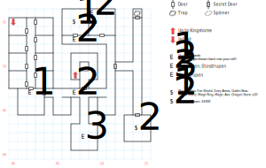

# Kingshome Dungeon

Plenty of random encounters (1 in 100), as if the fixed ones you have to fight weren't bad enough. You also need a **light** and a **compass**. The map doesn't have the "wrapping" bit set, which means if you *Soften* a wall and go running around in the backstage area, you find lots of weird territory to run through that the automap doesn't know how to draw or keep track of.

## Exits

You're dropped in a cell at (00,15) by the ambush on King's Isle.

(07,09): Stairs up to [Namtar's Bedroom](kingshome.md) (06,08).

## Points of Interest

**The Jail Cells (00,08 - 04,15):** All the doors are locked (level 1) except yours.

**The Court Jester (04,12):** Paragraph #53 actually has you back quickly out of the room and re-lock the door.

**The Vicious Guards (02,07):** Not easy (paragraph #65). If you lose, they throw you back in your cell. Hope you brought plenty of Dragon Stones, or have good save game backups.

**The Kingshome Armory (07,15):** A **Black Helm** (+3 AC, *M:Zak's Speed*), a **Fire Shield** (+2 AC, -2 AV, STR 12), the **Mage Ring** (+4 AC, +1 AV, *D:Whirl Wind*, requires *Low Magic 3*), the **Throw Mace** (2d12, 1d12 at 30', +1 AV, STR 18), the **Gatlin Bow** (20', DEX 10, allows full-auto fire), a quiver of **Grey Arrows** (1d20, +2 AV), and *twenty* **Dragon Stones**.

See the [Byzanople](byzanople.md) file for more on the Fire Shield.

**Drake's Old Throne**: At (11,10) there's a secret door to the E. Follow the tunnel and turn S, then pass through a secret door to find his throne, $1000, and his **Crown** (worth $5000).

**The Crossbow Trap (14,16):** For anyone foolish enough to explore the northern branch of the secret hallway, take 1d6 damage unless you have a trap-detection spell running.

## Monsters

<table>
  <tr>
    <th></th>
    <th>STR</th>
    <th>DEX</th>
    <th>INT</th>
    <th>SPR</th>
    <th>HD</th>
    <th>HP</th>
    <th>AV</th>
    <th>DV</th>
    <th>Speed</th>
    <th>XP</th>
  </tr>
  <tr>
    <td><b>Patrolmen</b></td>
    <td>15</td>
    <td>12</td>
    <td>09</td>
    <td>10</td>
    <td>7d6+15</td>
    <td>22-57</td>
    <td>+2</td>
    <td>+0</td>
    <td>30'</td>
    <td>140</td>
  </tr>
  <tr>
    <td></td>
    <td colspan=10>5d6, 5d8 piercing, call for help — awards gold</td>
  </tr>
  <tr>
    <td><b>Stosstrupen</b></td>
    <td>18</td>
    <td>18</td>
    <td>18</td>
    <td>18</td>
    <td>5d6+25</td>
    <td>30-55</td>
    <td>+3</td>
    <td>+0</td>
    <td>50'</td>
    <td>150</td>
  </tr>
  <tr>
    <td></td>
    <td colspan=10>8d8 stun, call for help, <i>L:Mage Fire</i></td>
  </tr>
  <tr>
    <td><b>Vicious Guards</b></td>
    <td>12</td>
    <td>17</td>
    <td>10</td>
    <td>10</td>
    <td>7d4+25</td>
    <td>32-53</td>
    <td>+3</td>
    <td>+0</td>
    <td>20'</td>
    <td>150</td>
  </tr>
  <tr>
    <td></td>
    <td colspan=10>7d10 stun — awards gold</td>
  </tr>
</table>
