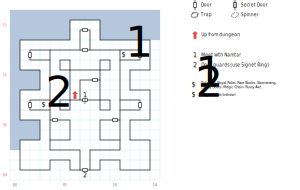

# Kingshome

Namtar is holed up in Drake's old chambers. He's a tired old man, er, demon, er thing. Regardless, there's no one to actually fight here, so feel free to explore the place.

## Exits

South, West: [King's Isle](dilmun.md) (18,26)

East: [King's Isle](dilmun.md) (19,27)

(06,08): Stairs down to the [Kingshome Dungeon](kingshome-dungeon.md), which are accessible with *D:Soften Stone* even after meeting Namtar. Taking these stairs forces the exit from Namtar's Bedroom to reappear.

## Points of Interest

**Namtar's Bedroom (07,08):** Read paragraph #131. The door S of here is one-way (it disappears after you walk through it).

**The Guardrooms (04,05; 10,05):** Locked doors, but nothing behind them.

**Family Portraits (03,12):** Backstory on Drake's kids, who are now in charge of Byzanople.

**The Armory (11,12):** A chest containing a **Pole Arm** (1d20, +2 AV, STR 16), another **Rusty Axe** (1d20, -3 AV, STR 18), some **Rare Books** (worth $2000), a stack of **Boomerangs** (2d20, +2 AV, -1 AC, 60', DEX 14), a suit of **Magic Chain** (+7 AC), a pair of **Lucky Boots** (+1 AC), and the **Royal Robe** (+1 AV).

*Easter Egg:* In the game's item list for this board, ID 3 is the Rare Books, ID 4 is the Boomerangs, ID 6 is the Magic Chain... and ID 5 is something called **Great Plate** that has the same stats as **Heavy Plate** elsewhere. But the chest doesn't contain item #5.

**The King's Wardrobe (03,07):** A large stash of **Pilgrim Robes**.

**The Library (11,07):** Nothing interesting.

**The Front Door (07,00 - 07,01):** Namtar's Guards prevent you from entering the building, unless you show them the **Signet Ring**.
