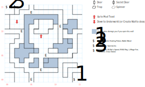

# Lanac'toor's Laboratory

A mystical place, just as badly flooded as Mud Toad and even more confusingly laid out.

Wandering monsters abound (1 in 25). Also, it's **dark** down here and you need a **compass**. And just for grins, the map wraps around.

## Exits

(07,09): Stairs up to [Mud Toad](mud-toad.md).

(02,12): Stairs down to the [Underworld](magan-underworld.md).

## Points of Interest

**Floodwaters (all over):** Although you can use *D:Soften Stone* to move the walls around down here, several of them are 'trapped' with floodwaters. You can use *Cave Lore* to determine if the wall you're facing will hurt you or not. If you *Soften* the wrong wall, the party takes 1d6 damage.

**Lanac'toor's Journal (08,09):** 1W of the stairs down from Mud Toad, you can read paragraph #107 for several clues.

**The Underworld Portal (02,12):** You can obviously use this to travel to the Underworld. But if you stand back and cast *D:Create Wall* at it, the portal is sealed up and all encounters (both wandering and fixed) are eliminated. You won't be able to *D:Soften Stone* the portal if you change your mind, though.

**Lanac'toor's Inner Sanctum (00,00 and thereabouts):** There's a 4x4 room straddling the corners of the map that contains Lanac'toor's treasures. At (14,00) you'll find a **Healing Potion** (*S:Major Healing*), the **Battle Wand** (*S:Battle Power*), and the **Dragon Shield** (+5 AC, STR 10). **Lanac'toor's Spectacles** are at (00,15); they'll get you into the [Magic College](magic-college.md). Finally, there are several interesting scrolls at (01,15): *L:Mage Fire, S:Fire Storm, S:Sun Stroke, H:Dazzle, M:Zak's Speed*, and *M:Kill Ray*.

## Monsters

<table>
  <tr>
    <th></th>
    <th>STR</th>
    <th>DEX</th>
    <th>INT</th>
    <th>SPR</th>
    <th>HD</th>
    <th>HP</th>
    <th>AV</th>
    <th>DV</th>
    <th>Speed</th>
    <th>XP</th>
  </tr>
  <tr>
    <td><b>Ghouls</b></td>
    <td>25</td>
    <td>20</td>
    <td>3</td>
    <td>5</td>
    <td>5d6+25</td>
    <td>30-55</td>
    <td>+3</td>
    <td>+0</td>
    <td>20'</td>
    <td>150</td>
  </tr><tr>
    <td></td>
    <td colspan="10">10d4 — undead</td>
  </tr>
  <tr>
    <td><b>Ghouls</b></td>
    <td>12</td>
    <td>20</td>
    <td>1</td>
    <td>1</td>
    <td>5d8+25</td>
    <td>30-65</td>
    <td>+2</td>
    <td>+0</td>
    <td>20'</td>
    <td>150</td>
  </tr><tr>
    <td></td>
    <td colspan="10">10d4 — undead</td>
  </tr>
  <tr>
    <td><b>Giant Snakes</b></td>
    <td>20</td>
    <td>15</td>
    <td>1</td>
    <td>3</td>
    <td>3d8+25</td>
    <td>28-49</td>
    <td>+4</td>
    <td>+0</td>
    <td>00'</td>
    <td>150</td>
  </tr><tr>
    <td></td>
    <td colspan="10">1d4 breath, flee — can't be disarmed</td>
  </tr>
  <tr>
    <td><b>Goblins</b></td>
    <td>10</td>
    <td>19</td>
    <td>6</td>
    <td>10</td>
    <td>4d4+35</td>
    <td>39-51</td>
    <td>+2</td>
    <td>+0</td>
    <td>30'</td>
    <td>30</td>
  </tr><tr>
    <td></td>
    <td colspan="10">5d6, flee</td>
  </tr>
  <tr>
    <td><b>Magic Ghouls</b></td>
    <td>13</td>
    <td>40</td>
    <td>5</td>
    <td>5</td>
    <td>3d4+35</td>
    <td>38-47</td>
    <td>+4</td>
    <td>+0</td>
    <td>20'</td>
    <td>190</td>
  </tr><tr>
    <td></td>
    <td colspan="10"><i>S:Rage of Mithras</i> — undead</td>
  </tr>
  <tr>
    <td><b>Scorpion Snakes</b></td>
    <td>12</td>
    <td>22</td>
    <td>3</td>
    <td>5</td>
    <td>4d8+25</td>
    <td>29-57</td>
    <td>+4</td>
    <td>+0</td>
    <td>30'</td>
    <td>150</td>
  </tr><tr>
    <td></td>
    <td colspan="10">7d8, flee</td>
  </tr>
  <tr>
    <td><b>Serpent Warriors</b></td>
    <td>20</td>
    <td>19</td>
    <td>8</td>
    <td>10</td>
    <td>3d8+25</td>
    <td>28-49</td>
    <td>+3</td>
    <td>+0</td>
    <td>20'</td>
    <td>140</td>
  </tr><tr>
    <td></td>
    <td colspan="10">11d4</td>
  </tr>
  <tr>
    <td><b>Skeletons</b></td>
    <td>8</td>
    <td>2</td>
    <td>8</td>
    <td>8</td>
    <td>3d8+25</td>
    <td>28-49</td>
    <td>+12</td>
    <td>+0</td>
    <td>10'</td>
    <td>170</td>
  </tr><tr>
    <td></td>
    <td colspan="10">1d4 piercing — undead</td>
  </tr>
  <tr>
    <td><b>Spitting Snakes</b></td>
    <td>5</td>
    <td>17</td>
    <td>5</td>
    <td>10</td>
    <td>3d8+22</td>
    <td>25-46</td>
    <td>+4</td>
    <td>+0</td>
    <td>20'</td>
    <td>150</td>
  </tr><tr>
    <td></td>
    <td colspan="10">1d4 breath</td>
  </tr>
  <tr>
    <td><b>Wraiths</b></td>
    <td>0</td>
    <td>25</td>
    <td>0</td>
    <td>0</td>
    <td>2d8+15</td>
    <td>17-31</td>
    <td>+4</td>
    <td>+0</td>
    <td>00'</td>
    <td>170</td>
  </tr><tr>
    <td></td>
    <td colspan="10">2d4 breath — undead</td>
  </tr>
  <tr>
    <td><b>Wraiths</b></td>
    <td>3</td>
    <td>25</td>
    <td>0</td>
    <td>40</td>
    <td>2d8+25</td>
    <td>27-41</td>
    <td>+4</td>
    <td>+0</td>
    <td>00'</td>
    <td>180</td>
  </tr><tr>
    <td></td>
    <td colspan="10">2d4 breath — undead</td>
  </tr
</table>

