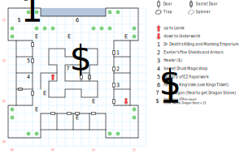

# Lansk Undercity

The dirtier, nastier, deadlier, and more fun version of Lansk. Filled with just as many black market shops as you'd expect.

Random encounters strike 1 in 33.

## Exits

(14,05): Stairs down to the [Underworld](magan-underworld.md) (16,14).

(05,08): Stairs up to [Lansk](lansk.md) (05,08). This is one-way unless you grease the palms of the official at the Department of Lubrication.

You can also buy a ticket to take the ferry (08,15) to the [Old Dock](old-dock.md).

## Points of Interest

**[Dr. Death's Killing and Maiming Emporium](../things-and-stuff.md#doctor-deaths-killing-and-maiming-emporium) (13,11):** Weapons shop.

**[Exeter's Fine Shields and Armors](../things-and-stuff.md#exeters-fine-shield-and-armors) (13,09):** Armor shop.

**Town Healer (13,07):** Charges $4 per point of Health.

**[The Illegal Magic Shoppe](../things-and-stuff.md#illegal-magic-shoppe) (02,08):** A few Druid Magic scrolls, and all the Dragon Stones you can carry. Access through the secret door at (01,06), bypassing the suspicious-looking shop keeper who says they're "closed".

**[The Ministry of EZ Paperwork](../things-and-stuff.md#ministry-of-ez-paperwork) (02,10):** Important papers, plus ferry tickets to King's Isle.

**The Sick Dragon (07,09):** Access through a secret door at (10,08) and a locked door at (09,08). Read paragraph #126, then cast a healing spell on the dragon or use the Ankh (acquired in [Mud Toad](yellow-mud-toad.md)) to receive the **Dragon Gem**. You can do this as many times as you want, although there's no use for a second Gem unless you accidentally drop the first one.

**The Ferry (08,15):** Buy a **Kings Ticket** at the Ministry of EZ Paperwork and the ferrymaster will take you to the [Old Dock](old-dock.md).

**The Statue of Irkalla (01,15):** Paragraph #122 tells you about Irkalla and Nergal. You can move the statue by using Strength; underneath you'll find a locked chest (difficulty 3) containing the **Glow Sword** (1d30, +1 AV, STR 24) and a dozen **Dragon Stones**.

**The Statue of Nergal (14,15):** Paragraph #123 tells you about the Nergal's summer palace, the Necropolis, which is where he hangs out when he and Irkalla aren't getting along.

**The Statue of the Universal God (01,02):** Paragraph #124 tells you a bit about the Universal God and links Roba, Irkalla's son, to Freeport.

**The Statue of Enkidu (14,02):** Paragraph #125 tells you about Enkidu, who you've already met (and wrestled) a long time ago.

## Monsters

​    [00] Pikem/an\en (he/him) [#7], STR 15 DEX 12 INT 09 SPR 10, HD:6d8+10 (16-58), AV+2 DV+0, att:1, morale:4, spd:10', XP:150, awards gold, image:Lance Guard, [24]:0x02; 5d8, call for help

​    [01] Midget Maniac\s (he/him) [#5], STR 08 DEX 19 INT 02 SPR 03, HD:4d8+9 (13-41), AV+5 DV+0, att:1, morale:6, spd:50', XP:160, image:Wild Boy, [0d]:0x64; 1d4 piercing, 1d4 health, flee

​    [02] Wild Wom/an\en (she/her) [#11], STR 05 DEX 15 INT 05 SPR 05, HD:5d4+10 (15-30), AV+1 DV+0, att:1, morale:5, spd:10', XP:100, image:Old Crone, [24]:0x02; 9d4 stun

​    [03] Muscular Clown\s (he/him) [#5], STR 20 DEX 16 INT 06 SPR 05, HD:6d8+15 (21-63), AV+2 DV+0, att:1, morale:5, spd:10', XP:180, image:Barbarian, [24]:0x02; 10d4 stun, flee

------

There's no way to actually attack the dragon (and you wouldn't want to, woof), but he is listed as a monster:

​    [04] Dragon (it) [#0], STR 100 DEX 100 INT 100 SPR 100, HD:10d100+10 (20-1010), AV+200 DV+0, att:1, morale:31, spd:10', XP:1600, can't be disarmed, image:Dragon Whelp, [24]:0x05; 32d20