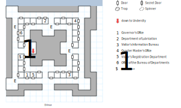

# Lansk

Dust off your *Bureaucracy* skill, we're going hunting for paperwork! (Actually, you won't need that skill at all.)

There aren't any random encounters, but the fixed ones are tough enough as it is.

## Exits

South: [Isle of Lansk](dilmun.md) (16,13)

(05,08): Stairs down to the [Lansk Undercity](lansk-undercity.md), but you'll have to bribe an official to use them.

## Points of Interest

**The Dragon Pit (07,06 - 08,06):** Paragraph #35 describes a well-fortified tower, and an extremely overfed dragon.

**The Druid's Mace (03,07):** Just sitting there inside a building, unattended. (1d20, +2 AV, +2 AC, *D:Cure All*, STR 12)

**The Governor's Office (04,04):** Start here; they give you a set of Papers that you'll need to have stamped. (There is no Office of Interior Affairs, unfortunately.) If you try to use *Bureaucracy*, they tell you that this isn't the Lubrication Department and they can't accept a bribe.

**Department of Lubrication (06,14):** Use the Papers for a stamp. You can also use *Bureaucracy* and offer a $500 bribe to get the official to open the stairs down to the Undercity at (05,08).

**Visitor's Information Bureau (11,04):** Trade the stamped Papers for a Governor's Pass, which gets you across the War Bridge. Using *Bureaucracy* doesn't work here, either.

**Visitor's Registration Department (05,04):** Ignore the warnings; however, they do usefully tell you that you'll need to end up at the Visitor's Information Bureau eventually.

**Office of the Bureau of Departments (03,11):** Empty.

**Quarter Master's Office (12,13):** You're informed that Slaveholder Mog has died and left you his estate. There's no explanation, and no impact on the rest of the game.

## Bestiary

<table>
  <thead>
    <tr>
      <th></th>
      <th>STR</th>
      <th>DEX</th>
      <th>INT</th>
      <th>SPR</th>
      <th>HP</th>
      <th>AV</th>
      <th>DV</th>
      <th>Speed</th>
      <th>XP</th>
    </tr>
  </thead>
  <tbody>
    <tr>
      <td rowspan=2><b>Adventurers</b></td>
      <td class="c">20</td>
      <td class="c">20</td>
      <td class="c">20</td>
      <td class="c">2</td>
      <td class="c">22&ndash;57</td>
      <td class="c">+2</td>
      <td class="c">+0</td>
      <td class="c">50'</td>
      <td class="c">140</td>
    </tr><tr>
      <td colspan=9>7d6, 5d6 stun, call for help</td>
    </tr><tr>
      <td rowspan=2><b>Citizens</b></td>
      <td class="c">10</td>
      <td class="c">13</td>
      <td class="c">10</td>
      <td class="c">30</td>
      <td class="c">18&ndash;38</td>
      <td class="c">+4</td>
      <td class="c">+0</td>
      <td class="c">10'</td>
      <td class="c">90</td>
    </tr><tr>
      <td colspan=9>flee</td>
    </tr><tr>
      <td rowspan=2><b>Civil Servants</b></td>
      <td class="c">3</td>
      <td class="c">3</td>
      <td class="c">1</td>
      <td class="c">3</td>
      <td class="c">10&ndash;100</td>
      <td class="c">+6</td>
      <td class="c">+0</td>
      <td class="c">120'</td>
      <td class="c">1</td>
    </tr><tr>
      <td colspan=9>dodge, flee, call for help</td>
    </tr><tr>
      <td rowspan=2><b>Guards</b></td>
      <td class="c">15</td>
      <td class="c">16</td>
      <td class="c">9</td>
      <td class="c">10</td>
      <td class="c">22&ndash;42</td>
      <td class="c">+3</td>
      <td class="c">+0</td>
      <td class="c">30'</td>
      <td class="c">220</td>
    </tr><tr>
      <td colspan=9>7d6, call for help — awards gold</td>
    </tr><tr>
      <td rowspan=2><b>Mage</b></td>
      <td class="c">0</td>
      <td class="c">19</td>
      <td class="c">0</td>
      <td class="c">0</td>
      <td class="c">9&ndash;37</td>
      <td class="c">+4</td>
      <td class="c">+0</td>
      <td class="c">20'</td>
      <td class="c">200</td>
    </tr><tr>
      <td colspan=9><i>S:Wrath of Mithras</i> @2</td>
    </tr>
  </tbody>
</table>
