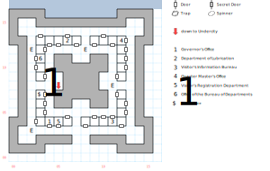

# Lansk

Dust off your *Bureaucracy* skill, we're going hunting for paperwork! (Actually, you won't need that skill at all.)

There aren't any random encounters, but the fixed ones are tough enough as it is.

## Exits

South: [Isle of Lansk](dilmun.md) (16,13)

(05,08): Stairs down to the [Lansk Undercity](lansk-undercity.md), but you'll have to bribe an official to use them.

## Points of Interest

**The Dragon Pit (07,06 - 08,06):** Paragraph #35 describes a well-fortified tower, and an extremely overfed dragon.

**The Druid's Mace (03,07):** Just sitting there inside a building, unattended. (1d20, +2 AV, +2 AC, *D:Cure All*, STR 12)

**The Governor's Office (04,04):** Start here; they give you a set of Papers that you'll need to have stamped. (There is no Office of Interior Affairs, unfortunately.) If you try to use *Bureaucracy*, they tell you that this isn't the Lubrication Department and they can't accept a bribe.

**Department of Lubrication (06,14):** Use the Papers for a stamp. You can also use *Bureaucracy* and offer a $500 bribe to get the official to open the stairs down to the Undercity at (05,08).

**Visitor's Information Bureau (11,04):** Trade the stamped Papers for a Governor's Pass, which gets you across the War Bridge. Using *Bureaucracy* doesn't work here, either.

**Visitor's Registration Department (05,04):** Ignore the warnings; however, they do usefully tell you that you'll need to end up at the Visitor's Information Bureau eventually.

**Office of the Bureau of Departments (03,11):** Empty.

**Quarter Master's Office (12,13):** You're informed that Slaveholder Mog has died and left you his estate. There's no explanation, and no impact on the rest of the game.

## Bestiary

<table>
  <tr>
    <th></th>
    <th>STR</th>
    <th>DEX</th>
    <th>INT</th>
    <th>SPR</th>
    <th>HD</th>
    <th>HP</th>
    <th>AV</th>
    <th>DV</th>
    <th>Speed</th>
    <th>XP</th>
  </tr>
  <tr>
    <td><b>Adventurers</b></td>
    <td>20</td>
    <td>20</td>
    <td>20</td>
    <td>2</td>
    <td>5d8+17</td>
    <td>22-57</td>
    <td>+2</td>
    <td>+0</td>
    <td>50'</td>
    <td>140</td>
  </tr><tr>
    <td></td>
    <td colspan="10">7d6, 5d6 stun, call for help</td>
  </tr>
  <tr>
    <td><b>Citizens</b></td>
    <td>10</td>
    <td>13</td>
    <td>10</td>
    <td>30</td>
    <td>4d6+14</td>
    <td>18-38</td>
    <td>+4</td>
    <td>+0</td>
    <td>10'</td>
    <td>90</td>
  </tr><tr>
    <td></td>
    <td colspan="10">flee</td>
  </tr>
  <tr>
    <td><b>Civil Servants</b></td>
    <td>3</td>
    <td>3</td>
    <td>1</td>
    <td>3</td>
    <td>10d10+0</td>
    <td>10-100</td>
    <td>+6</td>
    <td>+0</td>
    <td>120'</td>
    <td>1</td>
  </tr><tr>
    <td></td>
    <td colspan="10">dodge, flee, call for help</td>
  </tr>
  <tr>
    <td><b>Guards</b></td>
    <td>15</td>
    <td>16</td>
    <td>9</td>
    <td>10</td>
    <td>4d6+18</td>
    <td>22-42</td>
    <td>+3</td>
    <td>+0</td>
    <td>30'</td>
    <td>220</td>
  </tr><tr>
    <td></td>
    <td colspan="10">7d6, call for help — awards gold</td>
  </tr>
  <tr>
    <td><b>Mage</b></td>
    <td>0</td>
    <td>19</td>
    <td>0</td>
    <td>0</td>
    <td>4d8+5</td>
    <td>9-37</td>
    <td>+4</td>
    <td>+0</td>
    <td>20'</td>
    <td>200</td>
  </tr><tr>
    <td></td>
    <td colspan="10"><i>S:Wrath of Mithras</i> @2</td>
  </tr>
</table>
