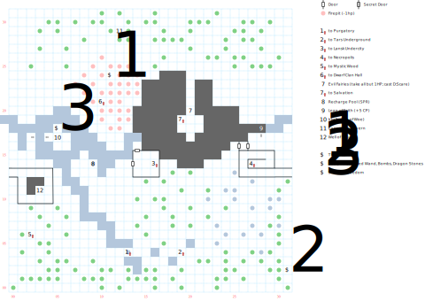

# Magan Underworld

The Underworld serves as a map that joins several places "Topside" (i.e. in Dilmun), as well as the place you'll come to during the endgame to defeat Namtar for the last time. You can use it to scoot between the various islands, but beware: the monsters down here are "late game" tough, so early on in the game you'll want to run for almost everything.

There are no fixed combats down here (at least until the endgame), but plenty of wandering monsters (1 in 50). Many of them count as "Undead" for the purposes of using *S:Exorcism*.

The map is also dark, so you'll need to bring a light source with you.

## Exits

(13,04): Stairs up to [Purgatory](purgatory.md) ()

(19,04): Stairs up to [Tars Underground](tars-underground.md) ()

(16,14): Stairs up to the [Lansk Undercity](lansk-undercity.md) ()

(27,16): Stairs up to the [Necropolis](necropolis.md); you can't actually get to the Well of Souls building unless you came down from the Necropolis in the first place, so don't try using *Soften Stone* or anything.

(02,06): Stairs up to the [Mystic Wood](mystic-wood.md) ()

(10,21): Stairs up to the [Dwarf Clan Hall](dwarf-clan-hall.md) forge (00,08)

(19,19): Stairs up to [Salvation](salvation.md) ()

## Points of Interest

**The Refresh Pool (09,14)**: Conveniently located just N of the stairs from Purgatory, stepping onto this square refreshes your party's Power. You'll also wind up near here at the start of the [Endgame](../walkthrough.md#endgame).

**Exposition Cavern (12,29):** Read `(p127)` to learn about Namtar's invasion, your goals, and the Sword of Freedom quest.

**The Slicer (11,24)**: In the middle of a field of fire between the stairs to the Clan Hall and Exposition Cavern, you'll find a chest (difficulty 3) with **The Slicer** (1d30, +4 AV, +2 AC, 17 STR) and 10 Dragon Stones.

**The Rusty Axe (31,02):** A bit SW of the stairs up to the Mystic Wood there's a chest (difficulty 3) that's "guarded" by an encounter that doesn't actually exist in the board's program. The chest contains the **Rusty Axe** (1d20, -3 AV, 18 STR), the **Speed Wand** (*M:Zak's Speed*), ten **Bombs** (1d30), and 10 Dragon Stones.

**Entrance to Irkalla's Realm (26,16):** You won't be allowed to pass through this doorway unless someone in your party has successfully prayed at a statue of Irkalla somewhere Topside (Purgatory or Smuggler's Cove).

**The Leap of Faith (28,17):** There's absolutely no indication anywhere that you should do this, but if you step over the railing to the N you will be rewarded with +5 AP.

**The Isle of Woe (04,16–06,18)**: You need the **Golden Boots** to get here; hop over from (02,17). On your first visit you'll find Irkalla in chains. Free her with the **Silver Key** (acquired from Nergal) and she'll give you the **Water Potion**. Later, once you've retrieved the **Skull of Roba** and given it to the Dwarven smiths, you can come back here to acquire the **Sword of Freedom** (1d100, +15 AV, +5 AC, STR 15).

**The Evil Fairies (20,20):** Accept their bargain and they take all but 1 HP (and 1 Stun) from your entire party. Refuse and they won't let you pass. Cast *D:Scare* at them and they will forever get out of your way.

**The Root of Salvation (19,17–21,19)**: Just past the fairies is a small island. Apart from the staircase up to Salvation, this is where you need to come to defeat Namtar for the final time during the [Endgame](../walthrough.md). Step up to any railing and `(U)se` his dead body to win the game.

**The Well of Souls (03,11)**: only accessible from the Necropolis stairs (*D:Soften Stone* doesn't work). `(U)se` *Arcane Lore* and throw a dead PC's body into the Well and they'll be resurrected (Stunned with 1 HP).

## Monsters

**Ghouls:** STR 12 DEX 20 INT 01 SPR 01, HD:5d6+17 (22-47), AV+2 DV+0, att:1, morale:5, spd:20', XP:110, Undead

- Attacks: 7d6

**Giant Snakes:** STR 20 DEX 22 INT 01 SPR 03, HD:3d8+12 (15-36), AV+2 DV+0, att:1, morale:6, spd:10', XP:150

- Attacks: 7d6, 2d6 breath, flee (60%)

**Goblins:** STR 10 DEX 20 INT 06 SPR 10, HD:4d4+10 (14-26), AV+3 DV+0, att:1, morale:5, spd:30', XP:90

- Attacks: 4d6, call for help (50%, 5)

**Lizard Men:** STR 25 DEX 20 INT 03 SPR 05, HD:4d6+15 (19-39), AV+1 DV+0, att:1, morale:6, spd:20', XP:110

- Attacks: 7d6

**Serpent Men:** STR 12 DEX 17 INT 03 SPR 05, HD:4d6+15 (19-39), AV+2 DV+0, att:1, morale:6, spd:30', XP:120

- Attacks: 6d6, flee (70%)

**Serpent Warriors:** STR 20 DEX 04 INT 08 SPR 10, HD:3d8+20 (23-44), AV+6 DV+0, att:1, morale:6, spd:20', XP:110

- Attacks: 7d6 x ¼

**Skeletons**: STR 08 DEX 16 INT 08 SPR 08, HD:5d8+12 (17-52), AV+3 DV+0, att:1, morale:5, spd:10', XP:120, Undead

- Attacks: 10d4

**Spiders:** STR 03 DEX 03 INT 01 SPR 01, HD:2d6+12 (14-24), AV+7 DV+0, att:1, morale:6, spd:80', XP:50

- Attacks: 1d4 piercing

**Spitting Snakes:** STR 05 DEX 15 INT 05 SPR 10, HD:4d4+15 (19-31), AV+2 DV+0, att:1, morale:5, spd:20', XP:120

- Attacks: 1d4 breath

**Vampire Wolves:** STR 13 DEX 20 INT 05 SPR 10, HD:6d8+9 (15-57), AV+3 DV+0, att:1, morale:5, spd:20', XP:130, Undead

- Attacks: 7d6

**Wraiths:** STR 03 DEX 15 INT 30 SPR 40, HD:5d8+15 (20-55), AV+4 DV+0, att:1, morale:9, spd:10', XP:180, Undead

- Attacks: *S:Sun Stroke*

------

Once you're into the Endgame, you have two more fights with Namtar. The first one, near the Recharge Pool, features a bunch of his goblin friends:

**Namtar:** STR 00 DEX 30 INT 00 SPR 00, HD:10d4+200 (210-240), AV+3 DV+0, att:1, morale:10, spd:40', XP:2000

- Attacks: 7d8

**Goblins:** STR 00 DEX 20 INT 00 SPR 00, HD:2d8+25 (27-41), AV+4 DV+0, att:1, morale:10, spd:30', XP:200

- Attacks: 7d8

------

Finally, you bring Namtar's body to The Pit, where he tries to run away from you (until you hit him for the first time, at least).

**Namtar:** STR 00 DEX 32 INT 00 SPR 00, HD:2d8+1000 (1002-1016), AV+4 DV+0, att:1, morale:10, spd:40', XP:2000

- Attacks: 9d8, flee (0%)

