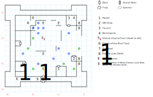

# Yellow Mud Toad

A sinking, rotting, falling-apart old city, and yet one that marks a pivotal "mid-game" milestone. You find the Golden Boots here, which opens up a bunch of previously inaccessible locations.

## Exits

East: [Quag](dilmun.md) (26,08), which allows you to skip a Murk Tree fight.

South: [Quag](dilmun.md) (25,07), which doesn't.

There's also the hidden staircase down to [Lanac'toor's Laboratory](lanactoor.md), once you repair the statue at (07,10).

## Points of Interest

**The Town Healer (10,04):** Charges $4 per point of Health, just like everyone else.

**The [Souvenir Shop](../things-and-stuff.md#souvenir-shop) (13,06):** A source of **Dragon Stones**, **Bolts**, and **Arrows**. But the really interesting thing you can buy here is an **Ankh**, which you can give to the dragon in Lansk in exchange for the Dragon Gem. (No, there's no hint about this; you just have to guess.)

**The Cavern Tavern (12,14):** The barkeep knows a bunch of interesting gossip, but there's no one to recruit here. However, if you navigated [Phoebus](phoebus.md) correctly, Berengaria is waiting for you at (13,14). Disappointingly, this doesn't advance the plot any, but you do receive scrolls of *S:Rage of Mithras, S:Holy Aim, S:Armor of Light, S:Major Healing*, and *S:Summon Salamander*.

**The Statue of Lanac'toor (07,10):** Read paragraph #20. If you collect the four stone body parts from around Dilmun, you can use them here to repair the statue, which nets you 500 XP and opens the stairs down to [Lanac'toor's Laboratory](lanactoor.md).

**The Temple of the Mud Toad (04,13):** Read paragraph #17 to receive the quest to stop the Mud Leak. Once you seal up the leak, return here and read paragraph #113 to receive the **Golden Boots** (+2 AC, allows jumping).

**The Mud Leak (05,12):** Mud Toad is filling up with mud from this spring. You can stop that by casting *D:Create Wall* at the space between (06,12) and (05,12).

**The Crumbling Walls (14,06; 14,12):** Use *Climb* to pass through the rock slide.

**The Militia (02,02):** Climb through the walls at (14,12), then walk all the way around until you meet the militia (paragraph #32). Kill them and keep searching E until you find their treasure at (06,02). You find scrolls of *H:Water Summon* and *H:Reveal Glamour*, plus the **Barbed Flail** (1d30, +2 AC, STR 16), **Mountain Sword** (1d30, +3 AV, +2 AC, *H:Earth Summon*, requires *Mountain Lore 2*), and a pair of **Lucky Boots** (+1 AC).

## Monsters

<table>
  <tr>
    <th></th>
    <th>STR</th>
    <th>DEX</th>
    <th>INT</th>
    <th>SPR</th>
    <th>HD</th>
    <th>HP</th>
    <th>AV</th>
    <th>DV</th>
    <th>Speed</th>
    <th>XP</th>
  </tr>
  <tr>
    <td><b>Crazed Militamen</b></td>
    <td>15</td>
    <td>15</td>
    <td>09</td>
    <td>10</td>
    <td>6d8+17</td>
    <td>23-65</td>
    <td>+3</td>
    <td>+0</td>
    <td>10'</td>
    <td>150</td>
  </tr>
  <tr>
    <td></td>
    <td colspan=10>7d6 – awards gold</td>
  </tr>
  <tr>
    <td><b>Frothy Swamp Dogs</b></td>
    <td>12</td>
    <td>40</td>
    <td>03</td>
    <td>05</td>
    <td>4d6+20</td>
    <td>24-44</td>
    <td>+3</td>
    <td>+0</td>
    <td>30'</td>
    <td>170</td>
  </tr>
  <tr>
    <td></td>
    <td colspan=10>1d6 breath, flee</td>
  </tr>
  <tr>
    <td><b>Loopy Citizens</b></td>
    <td>10</td>
    <td>10</td>
    <td>10</td>
    <td>30</td>
    <td>6d6+15</td>
    <td>21-51</td>
    <td>+3</td>
    <td>+0</td>
    <td>10'</td>
    <td>120</td>
  </tr>
  <tr>
    <td></td>
    <td colspan=10>flee</td>
  </tr>
  <tr>
    <td><b>Robbers</b></td>
    <td>05</td>
    <td>15</td>
    <td>05</td>
    <td>05</td>
    <td>1d10+20</td>
    <td>21-30</td>
    <td>+4</td>
    <td>+0</td>
    <td>10'</td>
    <td>150</td>
  </tr>
  <tr>
    <td></td>
    <td colspan=10>7d6, 10d10 stun, call for help, flee</td>
  </tr>
  <tr>
    <td><b>Snap Turtles</b></td>
    <td>12</td>
    <td>10</td>
    <td>01</td>
    <td>01</td>
    <td>5d8+20</td>
    <td>25-60</td>
    <td>+5</td>
    <td>+0</td>
    <td>20'</td>
    <td>150</td>
  </tr>
  <tr>
    <td></td>
    <td colspan=10>7d6</td>
  </tr>
  <tr>
    <td><b>Swamp Dogs</b></td>
    <td>20</td>
    <td>40</td>
    <td>03</td>
    <td>03</td>
    <td>4d10+20</td>
    <td>24-60</td>
    <td>+2</td>
    <td>+0</td>
    <td>60'</td>
    <td>150</td>
  </tr>
  <tr>
    <td></td>
    <td colspan=10>1d6 breath, 8d6</td>
  </tr>
  <tr>
    <td><b>Swamp Rats</b></td>
    <td>15</td>
    <td>12</td>
    <td>03</td>
    <td>06</td>
    <td>4d10+20</td>
    <td>24-60</td>
    <td>+12</td>
    <td>+0</td>
    <td>30'</td>
    <td>120</td>
  </tr>
  <tr>
    <td></td>
    <td colspan=10>8d6, dodge, flee</td>
  </tr>
  <tr>
    <td><b>Swamp Turtles</b></td>
    <td>08</td>
    <td>24</td>
    <td>03</td>
    <td>03</td>
    <td>3d10+20</td>
    <td>23-50</td>
    <td>+3</td>
    <td>+0</td>
    <td>30'</td>
    <td>160</td>
  </tr>
  <tr>
    <td></td>
    <td colspan=10>10d4</td>
  </tr>
  <tr>
    <td><b>Thieves</b></td>
    <td>10</td>
    <td>18</td>
    <td>12</td>
    <td>14</td>
    <td>6d8+25</td>
    <td>31-73</td>
    <td>+4</td>
    <td>+0</td>
    <td>20'</td>
    <td>120</td>
  </tr>
  <tr>
    <td></td>
    <td colspan=10>1d4 x ¼, 10d8 stun, 3d4, 3d4 piercing</td>
  </tr>
</table>