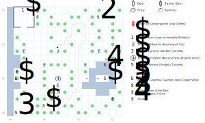

# Mystic Wood

A place that you'll come back to again and again over the course of the game. It has both a Transportation Nexus and an easy route to the Underworld, which makes it a highly useful conduit between the two.

There are plenty of mid-game encounters here, including wandering monsters (1 in 25).

## Exits

You can't exit to the West; other directions drop you on the [Isle of the Sun](dilmun.md) at the appropriate place.

There's a Transportation Nexus here at (07,05), along with a portal to the [Underworld](magan-underworld.md) at (04,15).

## Points of Interest

**The Underworld Well (04,15):** Use *Climb* to drop down into the [Underworld](magan-underworld.md).

**Enkidu's Shrine (02,13):** Read paragraph #6. There's a **Beast Horn** (*D:Beast Call*) sitting at the foot of his statue (02,15). Cast *D:Beast Call*, use the horn, or use SPR, and the demigod himself appears and offers to wrestle (paragraph #73). Make a STR check against 1d8+15 (so STR 15 always loses and STR 24 always wins); if you win, you get *Druid Magic 2* and a bunch of spells. No penalty for losing.

Enkidu's library: *D:Death Curse, D:Fire Blast, D:Insect Plague, D:Whirl Wind, D:Scare, D:Greater Healing,* and *D:Beast Call*

**The Mushroom Log (13,14)**: Pick up some Mushrooms before you visit the Necropolis.

**The Tracks (07,09):** Use *Tracker* to go on a roundabout walk through the woods which eventually deposits you at the mouth of the clearing (07,03) with the Nexus.

**The Ring (14,08):** Stand here, face the pond (S), and use *Swim*. You retrieve **The Ring** (+2 AC, +2 AV, *H:Cloak Arcane*). I'm pretty sure that's supposed to be a *Lord of the Rings* reference.

**The Mysterious Island (13,05 - 14,05):** If you have the Golden Boots, you can go to (11,05) and use them to hop over to this tiny island. On the other hand, if you try to *Swim*, you'll wake up the pond guardians and they won't be very happy about it. Once you're on the island, you can use *Arcane Lore* on the shrine to read paragraph #72. Use any weapon (Maces work, but Ammunition doesn't) to shed a drop of blood on the shrine and receive the **Enkidu Totem**.

**The Lagooners (01,05):** A nasty fight, but you get a locked chest (difficulty 2) with **Plate Mail** (+10 AC, -5 AV), **Gauntlets** (+2 AC), a **Great Bow** (+1 AV, 50', DEX 16), a healing **Wand** (*S:Major Healing*), and seven **Dragon Stones**.

**The Transportation Nexus (07,05):** If someone in your party has *Arcane Lore*, you can travel to the matching Nexus on either Quag or King's Isle. If you don't have *Arcane Lore*, it picks one at random.

**Zaton's Grave (05,01):** There's a grave marker here for Zaton, one of the Master Mages of Dilmun. If you have the Soul Bowl, use it here to revive Zaton's spirit; you receive 500 XP and a bunch of Druid scrolls: *D:Brambles, D:Greater Heal, D:Cure All, D:Create Wall, D:Invoke Spirit, D:Beast Call, D:Wood Spirit.* This also disables most of the random encounters.

**More Druid Magic Scrolls (01,00):** A locked chest (difficulty 2) with even more Druid Magic scrolls: *D:Death Curse, D:Fire Blast, D:Insect Plague, D:Scare*.

## Monsters

<table>
  <tr>
    <th></th>
    <th>STR</th>
    <th>DEX</th>
    <th>INT</th>
    <th>SPR</th>
    <th>HD</th>
    <th>HP</th>
    <th>AV</th>
    <th>DV</th>
    <th>Speed</th>
    <th>XP</th>
  </tr>
  <tr>
    <td><b>Dire Wolves</b></td>
    <td>20</td>
    <td>20</td>
    <td>3</td>
    <td>10</td>
    <td>5d6+6</td>
    <td>11-36</td>
    <td>+2</td>
    <td>+0</td>
    <td>30'</td>
    <td>220</td>
  </tr><tr>
    <td></td>
    <td colspan="10">5d6, 4d6, flee</td>
  </tr>
  <tr>
    <td><b>Earth Men</b></td>
    <td>45</td>
    <td>16</td>
    <td>5</td>
    <td>10</td>
    <td>5d10+10</td>
    <td>15-60</td>
    <td>+2</td>
    <td>+0</td>
    <td>10'</td>
    <td>180</td>
  </tr><tr>
    <td></td>
    <td colspan="10">5d10 stun, call for help, flee — can't be disarmed</td>
  </tr>
  <tr>
    <td><b>Lagooners</b></td>
    <td>50</td>
    <td>23</td>
    <td>1</td>
    <td>1</td>
    <td>10d4+20</td>
    <td>30-60</td>
    <td>+3</td>
    <td>+0</td>
    <td>30'</td>
    <td>300</td>
  </tr><tr>
    <td></td>
    <td colspan="10">10d6 stun</td>
  </tr>
  <tr>
    <td><b>Old Guys</b></td>
    <td>10</td>
    <td>15</td>
    <td>30</td>
    <td>60</td>
    <td>6d6+15</td>
    <td>21-51</td>
    <td>+2</td>
    <td>+0</td>
    <td>10'</td>
    <td>240</td>
  </tr><tr>
    <td></td>
    <td colspan="10"><i>H:Fire Light</i> @2, <i>H:Ice Chill</i> @2, flee</td>
  </tr>
  <tr>
    <td><b>Rock Men</b></td>
    <td>10</td>
    <td>20</td>
    <td>30</td>
    <td>30</td>
    <td>6d6+6</td>
    <td>12-42</td>
    <td>+2</td>
    <td>+0</td>
    <td>30'</td>
    <td>400</td>
  </tr><tr>
    <td></td>
    <td colspan="10">2d4 breath</td>
  </tr>
  <tr>
    <td><b>Water Spirits</b></td>
    <td>3</td>
    <td>15</td>
    <td>30</td>
    <td>50</td>
    <td>2d10+30</td>
    <td>32-50</td>
    <td>+2</td>
    <td>+0</td>
    <td>10'</td>
    <td>200</td>
  </tr><tr>
    <td></td>
    <td colspan="10">2d4 breath, 7d8 stun</td>
  </tr>
  <tr>
    <td><b>Wild Dogs</b></td>
    <td>20</td>
    <td>14</td>
    <td>8</td>
    <td>10</td>
    <td>4d8+10</td>
    <td>14-42</td>
    <td>+3</td>
    <td>+0</td>
    <td>20'</td>
    <td>200</td>
  </tr><tr>
    <td></td>
    <td colspan="10">4d8, 3d8, flee</td>
  </tr>
  <tr>
    <td><b>Wild Dogs</b></td>
    <td>12</td>
    <td>19</td>
    <td>3</td>
    <td>5</td>
    <td>6d6+3</td>
    <td>9-39</td>
    <td>+2</td>
    <td>+0</td>
    <td>30'</td>
    <td>100</td>
  </tr><tr>
    <td></td>
    <td colspan="10">4d8, 3d8, 3d8 health, flee</td>
  </tr>
</table>

