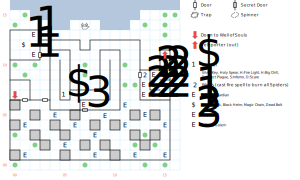

# Necropolis

Nergal's summer palace, aka where he hangs out when Irkalla's angry at him.

You'll face random encounters at the standard rate (1 in 100), plus a ton of fixed encounters in the southern half of the map.

## Exits

Technically, you can exit this map to the west, east, or south. These will return you to [Dilmun](dilmun.md) but you're on a very small 3x2 island with nowhere to go but the Necropolis.

(07,14): The boat dock, but it's only active once you've killed Ugly and stolen his boat.

(00,07): Stairs down to the portion of the [Underworld](magan-underworld.md) containing the Well of Souls.

## Points of Interest

**The Grim Guardians (02,12; 02,10):** They hit you with 1d6 breath weapons.

**The Random Chest (01,11):** Contains the **Stone Trunk**, a **Black Helm** (+3 AC, *M:Zak's Speed*), **Magic Chain** (+7 AC, *M:Zak's Speed*), and the **Dead Bolt** (1d4). The only thing that's interesting about the Dead Bolt is that you can Recharge it, but otherwise it's no better than regular Bolts.

**The Stone Demon (07,06):** The trick here is to charge him as quickly as possible; he runs away once you're within 10', but hits you with a 1d4 breath weapon until then.

**Nergal's Throne Room (05,07):** Fight off a large number of undead. Then feed Nergal the **Mushrooms** from the Mystic Wood. Pick a party member to "serve" Nergal (with no lasting effect). Then he gives you the **Silver Key**, the **Holy Spear** (1d30, DEX 14), and scrolls of *H:Fire Light, H:Big Chill, D:Insect Plague, D:Scare*, and *S:Inferno*.

**The Well of Souls (00,07):** This is the only way to get to the portion of the [Underworld](magan-underworld.md) that links up with the Well of Souls. It's almost certainly not worth it.

**The Web-filled Hallway (13,09):** Every square in this winding hallway has a combat with a Spider, along with its webs. If you cast a fire-based spell, it burns out all the spiders and the webs and leaves the hallway empty.

**The Portal of Power (15,11):** Once you've taken possession of Ugly's boat, this portal simply teleports you back to the boat dock. Before then, it chooses a random destination (which, if you use *Arcane Lore*, you can get a hint about):

- [Dilmun](dilmun.md), just N of Purgatory
- [Dilmun](dilmun.md), just S of the Slave Camp
- the Forlorn [Guard Bridge](guard-bridge-1.md)
- the entrance to [Mud Toad](mud-toad.md)
- the statue of Irkalla in [Smuggler's Cove](smugglers-cove.md)
- the E entrance to the [Bridge of Exiles](bridge-of-exiles.md)

## Monsters

    [00] Goblin\s (he/him) [#29], STR 10 DEX 19 INT 06 SPR 10, HD:4d4+17 (21-33), AV+2 DV+0, att:1, morale:1, spd:30', XP:30, image:Goblin, [24]:0x01
      GOOD/ALWAYS:Attack(5d6, 10')
      HALP/ALWAYS:Flee(100%)
    [01] Giant Snake\s (it) [#2], STR 20 DEX 15 INT 01 SPR 03, HD:3d8+25 (28-49), AV+4 DV+0, att:1, morale:10, spd:00', XP:150, can't be disarmed, image:Snake, [0d]:0x64, [24]:0x05
      GOOD/ALWAYS:Breath(1d4, 10')
      HALP/ALWAYS:Flee(60%)
    [02] Spitting Lizard\s (it) [#2], STR 05 DEX 17 INT 05 SPR 10, HD:3d8+22 (25-46), AV+4 DV+0, att:1, morale:8, spd:20', XP:150, image:Dragon Lizard
      GOOD/ALWAYS:Breath(1d4, 10')
      OKAY/ALWAYS:Breath(1d4, 10')
    [03] Serpent Warrior\s (it) [#7], STR 20 DEX 19 INT 08 SPR 10, HD:3d8+25 (28-49), AV+3 DV+0, att:1, morale:8, spd:20', XP:140, image:Lizardman, [24]:0x02
      GOOD/ALWAYS:Attack(11d4, 10')
    [04] Scorpion Lizard\s (it) [#1], STR 12 DEX 22 INT 03 SPR 05, HD:4d8+25 (29-57), AV+4 DV+0, att:1, morale:8, spd:30', XP:150, image:Dragon Lizard, [24]:0x01
      GOOD/ALWAYS:Attack(7d8, 10')
      HALP/ALWAYS:Flee(70%)
    [05] Ghoul\s (it) [#2], STR 25 DEX 20 INT 03 SPR 05, HD:5d6+25 (30-55), AV+3 DV+0, att:1, morale:8, spd:20', XP:150, Undead, image:Zombie, [24]:0x02
      GOOD/ALWAYS:Attack(10d4, 10')
      HALP/ALWAYS:Dodge
    [06] Wraith\s (it) [#0], STR 00 DEX 25 INT 00 SPR 00, HD:2d8+15 (17-31), AV+4 DV+0, att:1, morale:8, spd:00', XP:170, Undead, image:Wraith
      GOOD/ALWAYS:Breath(2d4, 10')
    [07] Skeleton\s (it) [#7], STR 08 DEX 02 INT 08 SPR 08, HD:3d8+25 (28-49), AV+12 DV+0, att:1, morale:8, spd:10', XP:170, Undead, image:Skeleton, [24]:0x02
      GOOD/ALWAYS:Attack(1d4 piercing, 10')
    [08] Magic Ghoul\s (it) [#2], STR 13 DEX 40 INT 05 SPR 05, HD:3d4+35 (38-47), AV+4 DV+0, att:1, morale:3, spd:20', XP:190, Undead, image:Zombie
      GOOD/ALWAYS:Cast(S:Rage of Mithras, pow:1, target)
    [09] Ghoul\s (it) [#7], STR 12 DEX 20 INT 01 SPR 01, HD:5d8+25 (30-65), AV+2 DV+0, att:1, morale:8, spd:20', XP:150, Undead, image:Zombie, [0d]:0x96, [24]:0x02
      GOOD/ALWAYS:Attack(10d4, 10')
    [0a] Wraith\s (it) [#0], STR 03 DEX 25 INT 00 SPR 40, HD:2d8+25 (27-41), AV+4 DV+0, att:1, morale:9, spd:00', XP:180, Undead, image:Wraith
      GOOD/ALWAYS:Breath(2d4, 10')
    [0b] Stone Demon\s (it) [#0], STR 00 DEX 04 INT 00 SPR 00, HD:10d100+5000 (5010-6000), AV+4 DV+0, att:1, morale:8, spd:30', XP:1500, image:Gaze Demon
      GOOD/CLOSE:Flee(100%)
      GOOD/ALWAYS:Breath(1d4, 10')
    [0c] Grim Guardian\s (he/him) [#0], STR 00 DEX 24 INT 00 SPR 00, HD:5d8+45 (50-85), AV+6 DV+0, att:1, morale:15, spd:40', XP:200, Undead, image:Wraith
      GOOD/ALWAYS:Breath(1d6, 10')
    [0d] Spider\s (it) [#0], STR 00 DEX 22 INT 00 SPR 00, HD:3d8+49 (52-73), AV+4 DV+0, att:1, morale:8, spd:90', XP:170, image:Spider
      GOOD/ALWAYS:Attack(7d8, 10')
    