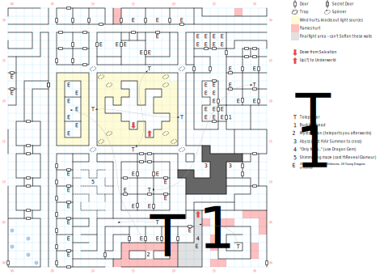

# Nisir

Apologies, again, for the obnoxious alignment of this large, wrapping map. You'll need **light** and a **compass** to navigate down here, and with a handful of spinners, you'll really want them both.

The thing to know about the Nisir is that there is almost nothing to do down here that doesn't involve making your way directly to Namtar. You can get lost exploring the caves forever – and there are plenty of teleport traps that will make it very difficult to map this place – but there's no reason to do so unless you feel like fighting off a whole lot of random encounters (1 in 100).

## Exits

(17,16): Stairs up to the [Underworld](magan-underworld.md) (08,15) from the starting area.

(23,06): Stairs up to the [Underworld](magan-underworld.md) (08,15) from the final battle with Namtar and his army.

## Points of Interest

**The Icy Caves (11,15 - 20,23):** When you first arrive in the Nisir you're in a cavern. Break through the wall with *D:Soften Stone*, and the area outside that cavern is full of "icy winds" which will extinguish any light source and deal 1 HP damage. If you walk in a straight line you'll probably be okay, but there are spinner traps in the corners that make it more challenging to navigate. (The missing square at (20,23) is not a mistake, or at least, not one on the part of your humble mapmaker. That's a coding bug. You can cast a light spell in that corner and see for yourself.)

The hallway just outside these caves also features spinner traps and teleporters that will move you from one side to the other, so they're challenging to navigate unless you're paying very close attention to your automap.

**The Other Icy Caves (06,15 - 09,23):** Mystalvision teleports you here after you've defeated him. The game tells you you're "back where you started", which is a lie; this cave is filled with a whole bunch of encounters and no spinner traps. The solution is more or less the same, though: just turn W and cast *D:Soften Stone* a couple of times.

**The Guard Barracks (23,17 - 26,28):** Enter at (22,24) or (03,28); you'll have to pass through here if you want to get to Buck Ironhead at (27,18), but otherwise you're just fighting off a lot of Namtar Guards for no particular reason.

**The Flaming Corridor (13,30 - 20,02):** Enter at (21,29); Mystalvision hangs out in a corridor full of heatstroke, which you'll have to traverse before you can kill him. Afterwards he teleports you to The Other Icy Caves, above.

**The Twin Warrens (14,07 - 19,12 and 27,20 - 00,25):** Two sets of nearly-identical 3x3 rooms with a teleporter in the center that moves you from one to the other. Neither one leads you anywhere useful or interesting.

**The Invisible Maze (08,06 - 12,12):** This room is full of invisible walls; cast *H:Reveal Glamour* to reveal them, or just have fun bashing your way through a pointless maze. Your prize, if you make it to the S end of the room, is a corridor with an infinite teleport trap and a couple of rooms with fixed encounters in them.

**The Chasm (23,11 - 24,12):** You can take a shortcut here by casting *H:Air Summon*; an elemental comes and ferries you across the chasm to (27,12). It works the other way, too.

**The Swamp Under the Mountain (00,00 - 03,05):**  Enter through a locked (level 1) door at (05,22) and make your way through some increasingly grizzly scenes. The prisoner in the [Pilgrim Dock](pilgrim-dock.md) told you about this place, and that if you found it you were getting close to Namtar.

**Hell on Earth (24,31 - 31,06):** This room is full of pit traps that deal 1d8 damage. Use a trap-detection spell to avoid them. Then cast *D:Soften Stone* to enter the inner spiral, which teleports you to...

**The Battle Plain (21,00 - 23,06):** Namtar's army waits just S of you. When the game says you'd be a fool to continue any further, use the **Dragon Gem** and watch the Dragon Queen roast Namtar's army for you. (If you didn't show the Gem to the Queen already, nothing happens.)

If you advance S without using the Gem, you have to fight Namtar's army on your own. It is technically possible to defeat them, in the sense that the code does have a path to follow if you do, but it's extremely unlikely. All that happens if you do is you get to read a few different paragraphs, and Namtar doesn't taunt you quite as hard. But it doesn't actually change anything else.

Eventually you wind up in combat with Namtar himself. You must defeat him three times in a row. You cannot run from these fights, and if you lose, you simply re-enter combat. If you win all three times, you get to pick up his **Dead Body**. Doing so teleports you to the [Underworld](magan-underworld.md) (08,15) near the Refresh Pool.

## Monsters

    [00] Lich\s (it) [#1], STR 00 DEX 22 INT 22 SPR 01, HD:12d12+12 (24-156), AV+4 DV+0, att:1, morale:10, spd:30', XP:400, image:Zombie, [24]:0x02
      GOOD/ALWAYS:Cast(H:Ice Chill, pow:2, target)
    [01] Lizard Warrior\s (it) [#8], STR 90 DEX 23 INT 01 SPR 01, HD:8d8+45 (53-109), AV+4 DV+0, att:1, morale:12, spd:30', XP:170, image:Lizardman, [24]:0x02
      GOOD/ALWAYS:Attack(10d8 stun, 10')
    [02] Young Dragon\s (it) [#2], STR 120 DEX 20 INT 10 SPR 20, HD:20d20+20 (40-420), AV+5 DV+0, att:1, morale:12, spd:50', XP:400, image:Dragon Whelp, [24]:0x03
      GOOD/ALWAYS:Breath(2d4, 10')
    [03] Namtar Guard\s (he/him) [#4], STR 150 DEX 18 INT 20 SPR 40, HD:20d8+50 (70-210), AV+3 DV+0, att:1, morale:12, spd:30', XP:300, image:Adventurer, [24]:0x02
      GOOD/ALWAYS:Attack(9d8, 20')
    [04] Unholy Guard\s (it) [#2], STR 200 DEX 25 INT 100 SPR 100, HD:10d6+50 (60-110), AV+4 DV+0, att:1, morale:12, spd:10', XP:400, image:Wraith, [24]:0x02
      GOOD/ALWAYS:Breath(2d4, 10')
    [05] Enforcer\s (he/him) [#1], STR 00 DEX 23 INT 00 SPR 00, HD:1d30+45 (46-75), AV+6 DV+0, att:1, morale:12, spd:50', XP:300, image:Adventurer, [24]:0x02
      GOOD/ALWAYS:Attack(8d8, 10')
    [06] Mystalvision (he/him) [#0], STR 00 DEX 22 INT 24 SPR 00, HD:2d12+150 (152-174), AV+4 DV+0, att:1, morale:12, spd:20', XP:700, image:Wizard, [24]:0x02
      GOOD/ALWAYS:Cast(S:Inferno, pow:3, target)
    [07] Buck Ironhead (he/him) [#0], STR 00 DEX 26 INT 00 SPR 00, HD:1d4+200 (201-204), AV+5 DV+0, att:1, morale:12, spd:40', XP:600, image:Adventurer, [24]:0x02
      GOOD/ALWAYS:Attack(10d8, 40')
    [08] Namtar #1 (he/him) [#0], STR 00 DEX 25 INT 40 SPR 00, HD:10d10+750 (760-850), AV+6 DV+0, att:1, morale:15, spd:90', XP:1200, image:Namtar, [24]:0x02
      GOOD/ALWAYS:Attack(9d8, 20')
    [09] Namtar #2 (he/him) [#0], STR 00 DEX 34 INT 40 SPR 00, HD:2d8+350 (352-366), AV+6 DV+0, att:1, morale:12, spd:20', XP:1200, image:Namtar, [24]:0x02
      GOOD/CLOSE:Cast(D:Whirl Wind, pow:25, target)
      GOOD/DAMAGED:Attack(9d8, 20')
      GOOD/ALWAYS:Breath(2d6, 10')
    [0a] Namtar #3 (he/him) [#0], STR 00 DEX 34 INT 40 SPR 00, HD:2d8+900 (902-916), AV+6 DV+0, att:1, morale:15, spd:10', XP:1000, image:Namtar, [24]:0x02
      GOOD/CLOSE:Attack(10d10 stun, 10')
      GOOD/ALWAYS:Breath(2d6, 10')