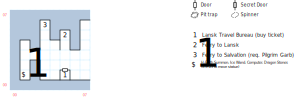

# Old Dock

A transit point for multiple ferries, but you probably won't come here until you're ready to take on Namtar.

## Exits

West: [King's Isle](dilmun.md) (15,17)

(05,05): The ferry to the [Lansk Undercity](lansk-undercity.md) (07,15). Requires a ticket.

(03,06): The ferry to the [Pilgrim Dock](pilgrim-dock.md) (02,07). Requires Pilgrim Garb.

## Points of Interest

**The Lansk Travel Bureau (05,01):** Sells you a ticket for the Lansk ferry for $500.

**The Pilgrim Ferry (03,06):** You can't board the ferry unless everyone is wearing **Pilgrim Garb**, or if you only have one set of it, you can Use it to convince the ferrymaster to let you board.

**The Statue of Our Lady of Home Computers (01,01):** You can move it with STR 24; underneath you'll find either an **Apple II** or a **IBM PS/2** depending on which platform you're playing the game on. They both do the same thing (+4 AC, *S:Guidance*). There's also a set of **Pilgrim Garb**, an **Ice Wand** (*H:Ice Chill*@10), and a scroll of *H:Earth Summon*.
