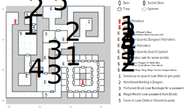

# Phoeban Dungeon

After your little encounter with Mystalvision, you're dropped into a jail cell. However, you'll have a chance to exact your revenge sooner than you think...

## Exits

Your jail cell is at (12,03).

The stairs back up to [Phoebus](phoebus.md) are at (01,13), behind the Cave-In.

## Places of Interest

**The Jail (09,01 - 15,07):** You'll have to kill around 100 turns in your jail cell before Berengaria comes to your rescue (paragraph #101). All of the other doors in the jail are locked (level 1); the cell at (13,07) contains a crying man who tells you "They're torturing The Druid!" but gives you no more useful information than that.

To slip past the guards, go to (10,05) and use *Hide*. This reveals the secret door to the S at (08,05). Or, proceed forward and fight them off.

**The Cave-In (05,01 - 06,01):** The way out of here. Use *Climb* or a Shovel to get past it.

**The "Armory" (02,11):** Basic equipment, including a **Shovel**, a **Mace** (1d8, STR 10), three **Daggers** (1d4, +1 AV, STR 3), a **Battle Axe** (1d12, -1 AV, STR 17), **Leather Armor** (+3 AC, -1 AV), **Scale Armor** (+6 AC, -2 AV), and **Chain Armor** (+7 AC, -3 AV).

**The Magic Mouth (04,12):** You need the password, `HALIFAX`, which you get from The Druid (see below). The game's data files also contain a second word, `BURGER`, but it's not clear what that's for (the magic mouth won't accept it).

**The Treasure Vault (03,14):** Contains the **Blow Horn** (*D:Whirl Wind*), **Magic Ring** (+2 AC, +1 AV, *D:Whirl Wind*), and the **Magic Quiver** (1d4, auto-refills itself).

**Dinnertime for Dragons (13,13):** A hunchback is trying to feed Phoebus's dragon with a prisoner (paragraph #104). If you let him, the dragon falls asleep. If you don't let him, the dragon breaks his chains (paragraph #89) and permanently destroys Phoebus and the Dungeon; you travel to [Dilmun](dilmun.md) (05,10).

**The Torture Chamber (06,11):** You rescue the druid that's being tortured (paragraph #106); if you *Bandage* or heal him, he croaks out the password to the Magic Mouth, `HALIFAX`.

**Mystalvision, Part Two (07,15):** Accompanied by some Old Jailers. If you beat him, you find scrolls of *S:Armor of Light, S:Major Healing, S:Disarm Trap, S:Holy Aim*, and *D:Wood Spirit* (what?)

## Monsters

<table>
  <tr>
    <th></th>
    <th>STR</th>
    <th>DEX</th>
    <th>INT</th>
    <th>SPR</th>
    <th>HD</th>
    <th>HP</th>
    <th>AV</th>
    <th>DV</th>
    <th>Speed</th>
    <th>XP</th>
  </tr>
  <tr>
    <td><b>Dungeon Guards</b></td>
    <td>12</td>
    <td>16</td>
    <td>10</td>
    <td>10</td>
    <td>4d8+3</td>
    <td>7-35</td>
    <td>+2</td>
    <td>+0</td>
    <td>10'</td>
    <td>190</td>
  </tr>
  <tr>
    <td></td>
    <td colspan=10>5d6, block, call for help
  </tr>
  <tr>
    <td><b>Dungeon Patrolers</b></td>
    <td>15</td>
    <td>17</td>
    <td>09</td>
    <td>10</td>
    <td>4d6+3</td>
    <td>7-27</td>
    <td>+2</td>
    <td>+0</td>
    <td>10'</td>
    <td>180</td>
  </tr>
  <tr>
    <td></td>
    <td colspan=10>4d8, 5d8 stun, call for help</td>
  </tr>
  <tr>
    <td><b>Guard Captains</b></td>
    <td>33</td>
    <td>22</td>
    <td>10</td>
    <td>10</td>
    <td>6d6+6</td>
    <td>12-42</td>
    <td>+3</td>
    <td>+0</td>
    <td>20'</td>
    <td>220</td>
  </tr>
  <tr>
    <td></td>
    <td colspan=10>3d10</td>
  </tr>  <tr>
    <td><b>Mystalvision</b></td>
    <td>20</td>
    <td>23</td>
    <td>60</td>
    <td>75</td>
    <td>8d6+6</td>
    <td>14-54</td>
    <td>+4</td>
    <td>+0</td>
    <td>10'</td>
    <td>700</td>
  </tr>
  <tr>
    <td></td>
    <td colspan=10><i>D:Elvar's Fire</i> @3, <i>D:Whirl Wind</i></td>
  </tr>
  <tr>
    <td><b>Mystal's Boys</b></td>
    <td>18</td>
    <td>18</td>
    <td>18</td>
    <td>18</td>
    <td>5d6+15</td>
    <td>20-45</td>
    <td>+5</td>
    <td>+0</td>
    <td>10'</td>
    <td>200</td>
  </tr>
  <tr>
    <td></td>
    <td colspan=10>9d6 stun, call for help</td>
  </tr>
  <tr>
    <td><b>Old Jailor</b></td>
    <td>12</td>
    <td>20</td>
    <td>14</td>
    <td>30</td>
    <td>6d6+6</td>
    <td>12-42</td>
    <td>+3</td>
    <td>+0</td>
    <td>10'</td>
    <td>180</td>
  </tr>
  <tr>
    <td></td>
    <td colspan=10>5d6 stun, 3d6, dodge</td>
  </tr>
</table>

