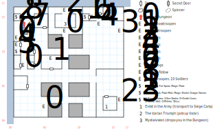

# Phoebus

This is one of the odd examples of a map whose size is inexplicably larger than it needs to be. Yes, there's technically ocean to the north and west, but you can't see it (*D:Soften Stone* doesn't work here). And the "exiting the map" code will stop you as soon as you move south from (08,01).

You'll find random encounters (1 in 100) with Stosstrupen, Soldiers, and Sullen Citizens.

## Exits

The southern exit (08,01) from the city drops you back on the [Isle of the Sun](dilmun.md) (05,10).

There aren't any other proper exits, although the fight with Mystalvision will dump you into the [Phoeban Dungeon](phoeban-dungeon.md), and eventually you'll come back up from the dungeon at (02,14).

## Places of Interest

**Buck Ironhead's Enlistment Office (14,02):** Buck tries to enlist you in the Kingshome army that's currently sieging the city of Byzanople on King's Isle. If you agree, you're sent to the [Siege Camp](siege-camp.md). If you refuse, he charges you a draft-dodging fee of $50 per party member. You can use this as a route to travel from Phoebus to the Siege Camp as often as you want, even once the War of Byzanople has been resolved.

**The Barracks (06,09):** A nasty fight with *ten* Stosstrupen. Don't go in here unless you really know what you're doing.

**The Chest of Scrolls (01,10):** Fight off a bunch of Thieves at (01,11), then open this chest (difficulty 2) for scrolls of *H:Poog's Vortex, S:Sun Stroke, D:Death Curse, D:Create Wall,* and *S:Mithras' Bless*.

**The Armor Cache (01,15):** Fight your way through some guards at (02,15), then open this chest (difficulty 1) for a suit of **Plate Mail** (+10 AC, -5 AV), a **Magic Shield** (+4 AC, STR 10), the **Tri-Cross** (+1 AV, 30', burst fire) and some **Bolts** (1d4), and seven **Dragon Stones**.

**The Ominous Fellow (03,14):** Completely harmless; he delivers a message from Mystalvision and then runs away. And he's got 255 DEX (no that's not a typo) so he's gonna go first. His message doesn't make any sense until you come back up from the Dungeon below, but there's no reason you *wouldn't* explore this corner of the map before that.

**The Other Armor Cache (11,15):** Fight your way through some Dirty Rats at (13,15) and then some Mad Dogs at (14,15), then open this chest (difficulty 2) for a suit of **Magic Plate** (+10 AC, -2 AV), a suit of **Mage Cloth** (+3 AC, *L:Mage Light*, requires Low Magic 1), and the **Fire Spear** (1d12, +2 AV, 50', DEX 14).

**The Icarian Triumph Tavern (15,15):** Ulrik is here to be recruited. If you're coming back after going through the Dungeon, Berengaria isn't actually here but the barkeep tells you to meet him at the Cavern Tavern in Yellow Mud Toad instead.

**Mystalvision's Temple (08,13):** First, fight off a few Stosstrupen. Then circle around to the N and fight off some Soldiers. Enter the temple and meet Mystalvision, who eventually attacks with a bunch more Stosstrupen. Regardless of whether you win or lose this battle, you're knocked out and dragged down into the [Dungeon](phoeban-dungeon.md) (12,03).

## Monsters

<table>
  <tr>
    <th></th>
    <th>STR</th>
    <th>DEX</th>
    <th>INT</th>
    <th>SPR</th>
    <th>HD</th>
    <th>HP</th>
    <th>AV</th>
    <th>DV</th>
    <th>Speed</th>
    <th>XP</th>
  </tr>
  <tr>
    <td><b>Dirty Rats</b></td>
    <td>08</td>
    <td>19</td>
    <td>03</td>
    <td>03</td>
    <td>1d6+0</td>
    <td>1-6</td>
    <td>+2</td>
    <td>+0</td>
    <td>30'</td>
    <td>50</td>
  </tr>
  <tr>
    <td></td>
    <td colspan=10>4d4, flee</td>
  </tr>
  <tr>
    <td><b>Mad Dogs</b></td>
    <td>12</td>
    <td>22</td>
    <td>03</td>
    <td>05</td>
    <td>4d6+3</td>
    <td>7-27</td>
    <td>+2</td>
    <td>+0</td>
    <td>30'</td>
    <td>70</td>
  </tr>
  <tr>
    <td></td>
    <td colspan=10>3d8, 3d8 health, flee</td>
  </tr>
  <tr>
    <td><b>Mystalvision</b></td>
    <td>10</td>
    <td>20</td>
    <td>30</td>
    <td>100</td>
    <td>12d8+4</td>
    <td>16-100</td>
    <td>+4</td>
    <td>+0</td>
    <td>10'</td>
    <td>400</td>
  </tr>
  <tr>
    <td></td>
    <td colspan=10><i>S:Inferno</i>@4, flee</td>
  </tr>
  <tr>
    <td><b>Ominous Fellow</b></td>
    <td>10</td>
    <td>255</td>
    <td>10</td>
    <td>10</td>
    <td>1d4+0</td>
    <td>1-4</td>
    <td>+2</td>
    <td>+0</td>
    <td>10'</td>
    <td>1</td>
  </tr>
  <tr>
    <td></td>
    <td colspan=10>flee</td>
  </tr>
  <tr>
    <td><b>Soldiers</b></td>
    <td>15</td>
    <td>15</td>
    <td>09</td>
    <td>10</td>
    <td>4d6+3</td>
    <td>7-27</td>
    <td>+2</td>
    <td>+0</td>
    <td>10'</td>
    <td>180</td>
  </tr>
  <tr>
    <td></td>
    <td colspan=10>4d8, 6d8 stun, 3d8, call for help — awards gold</td>
  </tr>
  <tr>
    <td><b>Stosstrupen</b></td>
    <td>20</td>
    <td>22</td>
    <td>20</td>
    <td>02</td>
    <td>5d8+8</td>
    <td>13-48</td>
    <td>+2</td>
    <td>+0</td>
    <td>50'</td>
    <td>200</td>
  </tr>
  <tr>
    <td></td>
    <td colspan=10>8d8 stun, call for help</td>
  </tr>
  <tr>
    <td><b>Sullen Citizens</b></td>
    <td>10</td>
    <td>10</td>
    <td>10</td>
    <td>30</td>
    <td>2d6+3</td>
    <td>5-15</td>
    <td>+2</td>
    <td>+0</td>
    <td>10'</td>
    <td>130</td>
  </tr>
  <tr>
    <td></td>
    <td colspan=10>flee</td>
  </tr>
  <tr>
    <td><b>Thieves</b></td>
    <td>05</td>
    <td>11</td>
    <td>05</td>
    <td>05</td>
    <td>1d6+1</td>
    <td>2-7</td>
    <td>+2</td>
    <td>+0</td>
    <td>10'</td>
    <td>30</td>
  </tr>
  <tr>
    <td></td>
    <td colspan=10>3d6, call for help, flee</td>
  </tr>
  <tr>
    <td><b>Thieves</b></td>
    <td>10</td>
    <td>18</td>
    <td>12</td>
    <td>14</td>
    <td>3d4+4</td>
    <td>7-16</td>
    <td>+2</td>
    <td>+0</td>
    <td>20'</td>
    <td>100</td>
  </tr>
  <tr>
    <td></td>
    <td colspan=10>5d4, 1d4 x ¼, flee</td>
  </tr>
</table>
