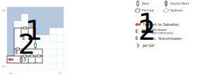

# Pilgrim Dock

You join a throng of pilgrims (paragraph #82) all making their way up to Mount Salvation. I hope you brought your Pilgrim Robes, or are prepared to fight off a bunch of Stosstrupen.

## Exits

The ferry from the [Old Dock](old-dock.md) drops you on the pier at (02,07), but you can't go back that way.

West: [Isle of Salvation](dilmun.md) (17,21)

South: [Isle of Salvation](dilmun.md) (18,20)

East: [Isle of Salvation](dilmun.md) (19,21)

All of those destination coordinates would make sense if the Pilgrim Dock existed on the world map at (18,21). But it isn't; it's actually at (17,21). So prepare to be disoriented if you walk off this map.

There's a teleporter at (00,01), west of your Jail Cell, that will send you straight to [Salvation](salvation.md) (07,15).

## Points of Interest

**The Checkpoint (02,04):** If everyone in your party has **Pilgrim Robes** equipped, the guards let you past. Otherwise you have to fight a bunch of Guards and Stosstrupen. If you lose that battle, they throw you in the Jail Cell, but the locked door becomes easier to pick (requires *Lockpick 1* instead of *Lockpick 3*).

**The Jail Cell (02,01):** The door requires *Lockpick 3* to open if you're coming at it from the outside. If you were thrown here as a result of losing combat, then *Lockpick 1* is sufficient. (The color text is lying to you to try to get you to find the other way out.) There's a secret door to the W that leads to an escape tunnel.

**The Empty Cell (03,01):** You need *Lockpick 3* to get through the door, but there's nothing here.

**The Crying Prisoner (04,01):** His cell opens to *Lockpick 1*. Read paragraph #83 for two useful hints: one about the secret tunnel W of the other jail cell, and one about the "swamp under the mountain" in the Nisir.

**Statue of the Universal God (05,04):** Read paragraph #84.

## Bestiary

<table>
  <tr>
    <th></th>
    <th>STR</th>
    <th>DEX</th>
    <th>INT</th>
    <th>SPR</th>
    <th>HD</th>
    <th>HP</th>
    <th>AV</th>
    <th>DV</th>
    <th>Speed</th>
    <th>XP</th>
  </tr>
  <tr>
    <td><b>Guards</b></td>
    <td>15</td>
    <td>12</td>
    <td>09</td>
    <td>10</td>
    <td>4d6+45</td>
    <td>49-69</td>
    <td>+4</td>
    <td>+0</td>
    <td>10'</td>
    <td>220</td>
  </tr>
  <tr>
    <td></td>
    <td colspan=10>8d8 — awards gold</td>
  </tr>
  <tr>
    <td><b>Stosstrupen</b></td>
    <td>20</td>
    <td>20</td>
    <td>20</td>
    <td>02</td>
    <td>5d8+45</td>
    <td>50-85</td>
    <td>+5</td>
    <td>+0</td>
    <td>40'</td>
    <td>180</td>
  </tr>
  <tr>
    <td></td>
    <td colspan=10>10d12 stun</td>
  </tr>
</table>
Your fellow **Pilgrims** also appear as a monster on this board, but there's no code that triggers an encounter with them.

<table>
  <tr>
    <th></th>
    <th>STR</th>
    <th>DEX</th>
    <th>INT</th>
    <th>SPR</th>
    <th>HD</th>
    <th>HP</th>
    <th>AV</th>
    <th>DV</th>
    <th>Speed</th>
    <th>XP</th>
  </tr>
  <tr>
    <td><b>Pilgrims</b></td>
    <td>10</td>
    <td>10</td>
    <td>10</td>
    <td>30</td>
    <td>3d6+22</td>
    <td>24-34</td>
    <td>+3</td>
    <td>+0</td>
    <td>10'</td>
    <td>50</td>
  </tr>
  <tr>
    <td></td>
    <td colspan=10>flee</td>
  </tr>
</table>