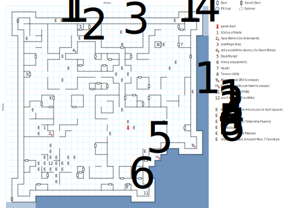

# Purgatory

The map where you start the game (20,13), although you'll come back here a number of times as well.

Whenever you wander inside a building (anything with a roof), there's a 1:100 chance of a wandering monster encounter. You'll also find plenty of random encounters in fixed locations throughout the map.

## Exits

Which side of the map you exit from determines where you end up:

- South or East: [Dilmun](dilmun.md) (13,02), on the southern peninsula of Forlorn near the recharge pool. Note that this means it's possible to exit through the secret door, walk all the way around to the NE corner of the map, exit E, and end up on the opposite side of the bay.

- North: [Dilmun](dilmun.md) (15,05) – This really ought to be (13,05), but there's a programming bug.

- West: [Dilmun](dilmun.md) (12,04)

There's also the **Apsu Waters** (07,12), which will take you to the [Magan Underworld](magan-underworld.md) at (13,04).

## Points of Interest

**Game Start (20,13):** A new game starts here with some color text; Clopin will also drop you back here. There's some more color text at (20,15) if you have *Town Lore*.

**Tavern (25,27):** There are some Drunks outside, but you can add Ulrik to your party here.

[**Low Magic Shoppe**](../things-and-stuff.md#magic-shoppe) **(03,22)**: Free scrolls make great items to sacrifice to Irkalla.

[**Black Market**]((../things-and-stuff.md#black-market)) **(12,30):** A useful source of early-game equipment and/or cash.

**Town Healer (29,27):** Charges $4/hp.

**The magic refresh pool (23,02):** Restores 100% of Power to all non-dead characters.

**The Statue of Namtar (09,22):** Paragraph #9.

**The Statue of Irkalla (06,13):** Sacrifice any item; that PC makes a Spirit check against 1d20. If successful, Irkalla is pleased and everyone in your party receives her blessing, which sets character flag `0x80`. (You need this flag to enter Irkalla's Domain in the Underworld, although this isn't the only place you can get it.)

**The Apsu Waters (07,12):** An exit to the Undeworld. If you have *Town Lore* there's an extra paragraph about the Waters at (06,12); if not, you just see "strange waters".

**The Arena (19,26):** If the total inventory of your party is fewer than three items per character, the Arenamaster offers you a choice of basic equipment. Then he bars the door behind you so you can fight the gladiators (19,29). If you beat them, you win a set of **Citizenship Papers**. Lose and they take all your gold.

**Clopin Trouillefou's Court of Miracles (07,07):** Expect *lots* of combats around this square. Clopin asks if you're a beggar; if you say yes, his crew beats you up for 1d8 damage. If you say no, he gives you a quest to defeat the Humbaba and dumps you back on your starting square. Come back here after doing so and he gives you $1000.

**The Humbaba (31,31).**

**Cannibals (20,03):** Avoid this unless you're looking for a tough fight.

**The Teeth-Kicking Fight (23,09):** 5 King's Guard and 6 Pikemen, which is a tough fight for low-level parties. But if you can beat them, you have an easy route to escape.

**The Morgue (31,10):** The easiest way to escape Purgatory. Use *Hiding* or *DEX* to hide in one of the body bags; everyone in the party makes a Strength check against 1d20 or takes 1d10 damage. This sets character flag `0x40` which marks you as a friend of the Slave Camp, and sends you immediately to Dilmun (13,02).

**The Slave Market (11,26):** A lousy way to escape Purgatory. Sell yourself into slavery and you're sent to the Slave Mines (07,08).

**Secret Door #1 (30,25):** Just south of the Healer there's a secret door that lets you into the City Walls. Head south from there (and fight off some guards) and you'll find the Hole in the Wall.

**Secret Door #2 (02,31):** Another way into the City Walls, and another easy way to escape Purgatory. Head S down a long corridor to **Secret Door #3 (01,01)** which will let you outside the city. This is the closest thing Purgatory has to a 'front door', which is a little weird.

**Inside the City Walls:** There are a number of fights here with City Guard. If you run away or lose, you get kicked back to the starting square (20,13). In the SE corner of the map near the hole in the wall, you get different color text.

**The hole in the wall (25,08):** Another way to escape; this one's harder to get to. Use *Climb* or *Swim* to jump into the bay; everyone in the party makes a Strength check against 1d20 or takes 1d10 damage. This sets character flag `0x40` which marks you as a friend of the Slave Camp.

**Rough Waters (southern and eastern sides of the map):** Every PC without *Swim* takes 1 damage every turn. You do not need *Swim* in order to move, and you can also use other skills or items.

## Monsters

<table>
  <tr>
    <th></th>
    <th>STR</th>
    <th>DEX</th>
    <th>INT</th>
    <th>SPR</th>
    <th>HD</th>
    <th>HP</th>
    <th>AV</th>
    <th>DV</th>
    <th>Speed</th>
    <th>XP</th>
  </tr>
  <tr>
    <td><b>Bandits</b></td>
    <td>10</td>
    <td>16</td>
    <td>9</td>
    <td>9</td>
    <td>3d8+0</td>
    <td>3-24</td>
    <td>+0</td>
    <td>+0</td>
    <td>20'</td>
    <td>80</td>
  </tr><tr>
    <td></td>
    <td colspan="10">1d8 stun, flee</td>
  </tr>
  <tr>
    <td><b>Big Dogs</b></td>
    <td>17</td>
    <td>12</td>
    <td>3</td>
    <td>10</td>
    <td>3d4+8</td>
    <td>11-20</td>
    <td>+0</td>
    <td>+0</td>
    <td>30'</td>
    <td>80</td>
  </tr><tr>
    <td></td>
    <td colspan="10">2d6 stun</td>
  </tr>
  <tr>
    <td><b>Born Losers</b></td>
    <td>3</td>
    <td>10</td>
    <td>3</td>
    <td>5</td>
    <td>2d4+0</td>
    <td>2-8</td>
    <td>+0</td>
    <td>+0</td>
    <td>10'</td>
    <td>60</td>
  </tr><tr>
    <td></td>
    <td colspan="10">2d4 stun</td>
  </tr>
  <tr>
    <td><b>Cannibals</b></td>
    <td>8</td>
    <td>15</td>
    <td>4</td>
    <td>1</td>
    <td>1d10+0</td>
    <td>1-10</td>
    <td>+0</td>
    <td>+0</td>
    <td>30'</td>
    <td>30</td>
  </tr><tr>
    <td></td>
    <td colspan="10">2d4 stun, 2d6</td>
  </tr>
  <tr>
    <td><b>Drunks</b></td>
    <td>16</td>
    <td>9</td>
    <td>3</td>
    <td>15</td>
    <td>5d6+4</td>
    <td>9-34</td>
    <td>+1</td>
    <td>+0</td>
    <td>10'</td>
    <td>90</td>
  </tr><tr>
    <td></td>
    <td colspan="10">1d4 stun</td>
  </tr>
  <tr>
    <td><b>Fanatics</b></td>
    <td>12</td>
    <td>10</td>
    <td>3</td>
    <td>15</td>
    <td>2d8+2</td>
    <td>4-18</td>
    <td>+0</td>
    <td>+0</td>
    <td>20'</td>
    <td>80</td>
  </tr><tr>
    <td></td>
    <td colspan="10">2d4 stun</td>
  </tr>
  <tr>
    <td><b>Giant Spiders</b></td>
    <td>22</td>
    <td>24</td>
    <td>1</td>
    <td>6</td>
    <td>6d4+10</td>
    <td>16-34</td>
    <td>+0</td>
    <td>+0</td>
    <td>50'</td>
    <td>110</td>
  </tr><tr>
    <td></td>
    <td colspan="10">2d8, flee — can't be disarmed</td>
  </tr>
  <tr>
    <td><b>Gladiators</b></td>
    <td>15</td>
    <td>23</td>
    <td>15</td>
    <td>16</td>
    <td>3d8+4</td>
    <td>7-28</td>
    <td>+1</td>
    <td>+0</td>
    <td>20'</td>
    <td>130</td>
  </tr><tr>
    <td></td>
    <td colspan="10">3d6</td>
  </tr>
  <tr>
    <td><b>Humbaba</b></td>
    <td>66</td>
    <td>18</td>
    <td>5</td>
    <td>20</td>
    <td>10d6+50</td>
    <td>60-110</td>
    <td>+1</td>
    <td>+0</td>
    <td>20'</td>
    <td>1000</td>
  </tr><tr>
    <td></td>
    <td colspan="10">3d10</td>
  </tr>
  <tr>
    <td><b>Innocent Men</b></td>
    <td>10</td>
    <td>10</td>
    <td>10</td>
    <td>15</td>
    <td>2d6+2</td>
    <td>4-14</td>
    <td>+0</td>
    <td>+0</td>
    <td>10'</td>
    <td>80</td>
  </tr><tr>
    <td></td>
    <td colspan="10">2d6</td>
  </tr>
  <tr>
    <td><b>Jail Keepers</b></td>
    <td>3</td>
    <td>19</td>
    <td>3</td>
    <td>7</td>
    <td>2d6+8</td>
    <td>10-20</td>
    <td>+1</td>
    <td>+0</td>
    <td>90'</td>
    <td>80</td>
  </tr><tr>
    <td></td>
    <td colspan="10">2d6 — awards gold</td>
  </tr>
  <tr>
    <td><b>King's Guard</b></td>
    <td>12</td>
    <td>16</td>
    <td>8</td>
    <td>10</td>
    <td>3d6+3</td>
    <td>6-21</td>
    <td>+0</td>
    <td>+0</td>
    <td>10'</td>
    <td>100</td>
  </tr><tr>
    <td></td>
    <td colspan="10">3d6, 3d8 — awards gold</td>
  </tr>
  <tr>
    <td><b>Loons</b></td>
    <td>10</td>
    <td>10</td>
    <td>5</td>
    <td>3</td>
    <td>2d4+1</td>
    <td>3-9</td>
    <td>+0</td>
    <td>+0</td>
    <td>10'</td>
    <td>40</td>
  </tr><tr>
    <td></td>
    <td colspan="10">2d4, 1d4 health</td>
  </tr>
  <tr>
    <td><b>Pikemen</b></td>
    <td>16</td>
    <td>12</td>
    <td>10</td>
    <td>10</td>
    <td>3d8+8</td>
    <td>11-32</td>
    <td>+0</td>
    <td>+0</td>
    <td>10'</td>
    <td>90</td>
  </tr><tr>
    <td></td>
    <td colspan="10">3d4, flee — awards gold</td>
  </tr>
  <tr>
    <td><b>Robbers</b></td>
    <td>6</td>
    <td>8</td>
    <td>7</td>
    <td>5</td>
    <td>1d6+0</td>
    <td>1-6</td>
    <td>+0</td>
    <td>+0</td>
    <td>10'</td>
    <td>80</td>
  </tr><tr>
    <td></td>
    <td colspan="10">1d8</td>
  </tr>
  <tr>
    <td><b>Rock Spiders</b></td>
    <td>9</td>
    <td>22</td>
    <td>4</td>
    <td>2</td>
    <td>3d12+0</td>
    <td>3-36</td>
    <td>+1</td>
    <td>+0</td>
    <td>60'</td>
    <td>200</td>
  </tr><tr>
    <td></td>
    <td colspan="10">1d10 stun</td>
  </tr>
  <tr>
    <td><b>Rock Spiders</b></td>
    <td>5</td>
    <td>22</td>
    <td>3</td>
    <td>1</td>
    <td>2d4+7</td>
    <td>9-15</td>
    <td>+1</td>
    <td>+0</td>
    <td>30'</td>
    <td>90</td>
  </tr><tr>
    <td></td>
    <td colspan="10">2d4 stun</td>
  </tr>
  <tr>
    <td><b>Soldiers</b></td>
    <td>14</td>
    <td>12</td>
    <td>7</td>
    <td>8</td>
    <td>3d6+0</td>
    <td>3-18</td>
    <td>+0</td>
    <td>+0</td>
    <td>10'</td>
    <td>100</td>
  </tr><tr>
    <td></td>
    <td colspan="10">3d4 — awards gold</td>
  </tr>
  <tr>
    <td><b>Spiders</b></td>
    <td>3</td>
    <td>21</td>
    <td>4</td>
    <td>2</td>
    <td>1d8+5</td>
    <td>6-13</td>
    <td>+1</td>
    <td>+0</td>
    <td>50'</td>
    <td>80</td>
  </tr><tr>
    <td></td>
    <td colspan="10">2d6 stun, flee</td>
  </tr>
  <tr>
    <td><b>Spiders</b></td>
    <td>8</td>
    <td>16</td>
    <td>1</td>
    <td>1</td>
    <td>2d4+5</td>
    <td>7-13</td>
    <td>+0</td>
    <td>+0</td>
    <td>50'</td>
    <td>40</td>
  </tr><tr>
    <td></td>
    <td colspan="10">2d6 stun</td>
  </tr>
  <tr>
    <td><b>Unjustly Accused</b></td>
    <td>15</td>
    <td>10</td>
    <td>12</td>
    <td>13</td>
    <td>3d6+3</td>
    <td>6-21</td>
    <td>+0</td>
    <td>+0</td>
    <td>10'</td>
    <td>90</td>
  </tr><tr>
    <td></td>
    <td colspan="10">2d6 stun, flee</td>
  </tr>
  <tr>
    <td><b>Wild Dogs</b></td>
    <td>11</td>
    <td>15</td>
    <td>1</td>
    <td>1</td>
    <td>3d10+3</td>
    <td>6-33</td>
    <td>+0</td>
    <td>+0</td>
    <td>10'</td>
    <td>100</td>
  </tr><tr>
    <td></td>
    <td colspan="10">2d8 stun</td>
  </tr>
  <tr>
    <td><b>Wild hounds</b></td>
    <td>5</td>
    <td>20</td>
    <td>4</td>
    <td>12</td>
    <td>2d4+5</td>
    <td>7-13</td>
    <td>+0</td>
    <td>+0</td>
    <td>50'</td>
    <td>80</td>
  </tr><tr>
    <td></td>
    <td colspan="10">2d4 stun</td>
  </tr>
  <tr>
    <td><b>Wolves</b></td>
    <td>9</td>
    <td>16</td>
    <td>5</td>
    <td>6</td>
    <td>4d6+3</td>
    <td>7-27</td>
    <td>+1</td>
    <td>+0</td>
    <td>40'</td>
    <td>80</td>
  </tr><tr>
    <td></td>
    <td colspan="10">2d6 stun</td>
  </tr>
  <tr>
    <td><b>Yonderboys</b></td>
    <td>12</td>
    <td>15</td>
    <td>8</td>
    <td>12</td>
    <td>2d10+5</td>
    <td>7-25</td>
    <td>+0</td>
    <td>+0</td>
    <td>10'</td>
    <td>70</td>
  </tr><tr>
    <td></td>
    <td colspan="10">2d8, 1d10 stun, call for help</td>
  </tr>
</table>
