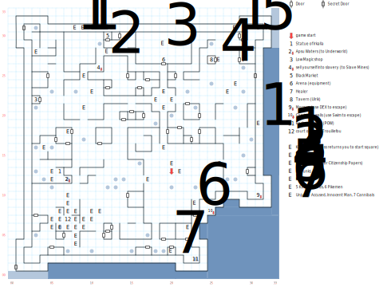

# Purgatory

The map where you start the game (20,13), although you'll come back here a number of times as well.

Whenever you wander inside a building (anything with a roof), there's a 1:100 chance of a wandering monster encounter. You'll also find plenty of random encounters in fixed locations throughout the map.

## Exits

Which side of the map you exit from determines where you end up:

- South or East: [Dilmun](dilmun.md) (13,02), on the southern peninsula of Forlorn near the recharge pool. Note that this means it's possible to exit through the secret door, walk all the way around to the NE corner of the map, exit E, and end up on the opposite side of the bay.

- North: [Dilmun](dilmun.md) (15,05) – This really ought to be (13,05), but there's a programming bug.

- West: [Dilmun](dilmun.md) (12,04)

There's also the **Apsu Waters** (07,12), which will take you to the [Magan Underworld](magan-underworld.md) at (13,04).

## Points of Interest

**Game Start (20,13):** A new game starts here with some color text; Clopin will also drop you back here. There's some more color text at (20,15) if you have *Town Lore*.

**Tavern (25,27):** There are some Drunks outside, but you can add Ulrik to your party here.

[**Low Magic Shoppe**](../things-and-stuff.md#magic-shoppe) **(03,22)**: Free scrolls make great items to sacrifice to Irkalla.

[**Black Market**]((../things-and-stuff.md#black-market)) **(12,30):** A useful source of early-game equipment and/or cash.

**Town Healer (29,27):** Charges $4/hp.

**The magic refresh pool (23,02):** Restores 100% of Power to all non-dead characters.

**The Statue of Namtar (09,22):** Paragraph #9.

**The Statue of Irkalla (06,13):** Sacrifice any item; that PC makes a Spirit check against 1d20. If successful, Irkalla is pleased and everyone in your party receives her blessing, which sets character flag `0x80`. (You need this flag to enter Irkalla's Domain in the Underworld, although this isn't the only place you can get it.)

**The Apsu Waters (07,12):** An exit to the Undeworld. If you have *Town Lore* there's an extra paragraph about the Waters at (06,12); if not, you just see "strange waters".

**The Arena (19,26):** If the total inventory of your party is fewer than three items per character, the Arenamaster offers you a choice of basic equipment. Then he bars the door behind you so you can fight the gladiators (19,29). If you beat them, you win a set of **Citizenship Papers**. Lose and they take all your gold.

**Clopin Trouillefou's Court of Miracles (07,07):** Expect *lots* of combats around this square. Clopin asks if you're a beggar; if you say yes, his crew beats you up for 1d8 damage. If you say no, he gives you a quest to defeat the Humbaba and dumps you back on your starting square. Come back here after doing so and he gives you $1000.

**The Humbaba (31,31).**

**Cannibals (20,03):** Avoid this unless you're looking for a tough fight.

**The Teeth-Kicking Fight (23,09):** 5 King's Guard and 6 Pikemen, which is a tough fight for low-level parties. But if you can beat them, you have an easy route to escape.

**The Morgue (31,10):** The easiest way to escape Purgatory. Use *Hiding* or *DEX* to hide in one of the body bags; everyone in the party makes a Strength check against 1d20 or takes 1d10 damage. This sets character flag `0x40` which marks you as a friend of the Slave Camp, and sends you immediately to Dilmun (13,02).

**The Slave Market (11,26):** A lousy way to escape Purgatory. Sell yourself into slavery and you're sent to the Slave Mines (07,08).

**Secret Door #1 (30,25):** Just south of the Healer there's a secret door that lets you into the City Walls. Head south from there (and fight off some guards) and you'll find the Hole in the Wall.

**Secret Door #2 (02,31):** Another way into the City Walls, and another easy way to escape Purgatory. Head S down a long corridor to **Secret Door #3 (01,01)** which will let you outside the city. This is the closest thing Purgatory has to a 'front door', which is a little weird.

**Inside the City Walls:** There are a number of fights here with City Guard. If you run away or lose, you get kicked back to the starting square (20,13). In the SE corner of the map near the hole in the wall, you get different color text.

**The hole in the wall (25,08):** Another way to escape; this one's harder to get to. Use *Climb* or *Swim* to jump into the bay; everyone in the party makes a Strength check against 1d20 or takes 1d10 damage. This sets character flag `0x40` which marks you as a friend of the Slave Camp.

**Rough Waters (southern and eastern sides of the map):** Every PC without *Swim* takes 1 damage every turn. You do not need *Swim* in order to move, and you can also use other skills or items.

## Monsters

Note that some monsters are duplicated on this list. The game engine rolls them up as different opponents, but there's no way to tell them apart in-game.

Melee attacks deal full-value Stun damage and half as much Health, unless indicated. Stun-only attacks don't affect Health, while Health-only attacks deal half the listed damage, so a creature that deals "1d4 health" actually only does 1–2 damage.

**Bandits:** STR 10 DEX 16 INT 09 SPR 09, HD:3d8+0 (3-24), AV+0 DV+0, att:1, morale:4, spd:20', XP:80

- Attacks: 1d8 stun, flee

**Big Dogs:** STR 17 DEX 12 INT 03 SPR 10, HD:3d4+8 (11-20), AV+0 DV+0, att:1, morale:4, spd:30', XP:80

- Attacks: 2d6 stun

**Born Losers:** STR 03 DEX 10 INT 03 SPR 05, HD:2d4+0 (2-8), AV+0 DV+0, att:1, morale:1, spd:10', XP:60

- Attacks: 2d4 stun

**Cannibals:** STR 08 DEX 15 INT 04 SPR 01, HD:1d10+0 (1-10), AV+0 DV+0, att:1, morale:1, spd:30', XP:30

- Attacks: 2d4 stun, 2d6

**Drunks:** STR 16 DEX 09 INT 03 SPR 15, HD:5d6+4 (9-34), AV+1 DV+0, att:1, morale:3, spd:10', XP:90
- Attacks: 1d4 stun

**Fanatics:** STR 12 DEX 10 INT 03 SPR 15, HD:2d8+2 (4-18), AV+0 DV+0, att:1, morale:4, spd:20', XP:80
- Attacks: 2d4 stun

**Giant Spiders:** STR 22 DEX 24 INT 01 SPR 06, HD:6d4+10 (16-34), AV+0 DV+0, att:1, morale:5, spd:50', XP:110, can't be disarmed
- Attacks: 2d8, flee

**Gladiators:** STR 15 DEX 23 INT 15 SPR 16, HD:3d8+4 (7-28), AV+1 DV+0, att:1, morale:4, spd:20', XP:130
- Attacks: 3d6

**Humbaba:** STR 66 DEX 18 INT 05 SPR 20, HD:10d6+50 (60-110), AV+1 DV+0, att:1, morale:5, spd:20', XP:1000
- Attacks: 3d10

**Innocent Men:** STR 10 DEX 10 INT 10 SPR 15, HD:2d6+2 (4-14), AV+0 DV+0, att:1, morale:4, spd:10', XP:80
- Attacks: 2d6 stun

**Jail Keepers:** STR 03 DEX 19 INT 03 SPR 07, HD:2d6+8 (10-20), AV+1 DV+0, att:1, morale:4, spd:90', XP:80, awards gold
- Attacks: 2d6

**King's Guards:** STR 12 DEX 16 INT 08 SPR 10, HD:3d6+3 (6-21), AV+0 DV+0, att:1, morale:4, spd:10', XP:100, awards gold
- Attacks: 3d6, 3d8

**Loons:** STR 10 DEX 10 INT 05 SPR 03, HD:2d4+1 (3-9), AV+0 DV+0, att:1, morale:2, spd:10', XP:40
- Attacks: 2d4, 1d4 health

**Pikemen:** STR 16 DEX 12 INT 10 SPR 10, HD:3d8+8 (11-32), AV+0 DV+0, att:1, morale:5, spd:10', XP:90, awards gold
- Attacks: 3d4, flee

**Robbers:** STR 06 DEX 08 INT 07 SPR 05, HD:1d6+0 (1-6), AV+0 DV+0, att:1, morale:5, spd:10', XP:80

- Attacks: 1d8 stun

**Rock Spiders:** STR 05 DEX 22 INT 03 SPR 01, HD:2d4+7 (9-15), AV+1 DV+0, att:1, morale:3, spd:30', XP:90
- Attacks: 2d4 stun

**Rock Spiders:** STR 09 DEX 22 INT 04 SPR 02, HD:3d12+0 (3-36), AV+1 DV+0, att:1, morale:5, spd:60', XP:200
- Attacks: 1d10 stun

**Soldiers:** STR 14 DEX 12 INT 07 SPR 08, HD:3d6+0 (3-18), AV+0 DV+0, att:1, morale:2, spd:10', XP:100, awards gold
- Attacks: 3d4

**Spiders:** STR 08 DEX 16 INT 01 SPR 01, HD:2d4+5 (7-13), AV+0 DV+0, att:1, morale:2, spd:50', XP:40
- Attacks: 2d6 stun

**Spiders:** STR 03 DEX 21 INT 04 SPR 02, HD:1d8+5 (6-13), AV+1 DV+0, att:1, morale:2, spd:50', XP:80
- Attacks: 2d6 stun, flee

**Unjustly Accused:** STR 15 DEX 10 INT 12 SPR 13, HD:3d6+3 (6-21), AV+0 DV+0, att:1, morale:4, spd:10', XP:90
- Attacks: 2d6 stun

**Wild Dogs:** STR 11 DEX 15 INT 01 SPR 01, HD:3d10+3 (6-33), AV+0 DV+0, att:1, morale:2, spd:10', XP:100
- Attacks: 2d8 stun

**Wild Hounds:** STR 05 DEX 20 INT 04 SPR 12, HD:2d4+5 (7-13), AV+0 DV+0, att:1, morale:4, spd:50', XP:80
- ATtacks: 2d4 stun

**Yonderboys:** STR 12 DEX 15 INT 08 SPR 12, HD:2d10+5 (7-25), AV+0 DV+0, att:1, morale:3, spd:10', XP:70
- Attacks: 1d10 stun, 2d8, call for help

**Wolves:** STR 09 DEX 16 INT 05 SPR 06, HD:4d6+3 (7-27), AV+1 DV+0, att:1, morale:3, spd:40', XP:80
- Attacks: 2d6 stun

