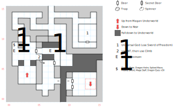

# Salvation

The destination of many a pilgrim's trek, and your first step towards the endgame.

Standard random encounters (1 in 100).

## Exits

It's not exactly a proper exit, but the dark-grey squares on the map are places, usually without guardrails, where you can fall down to the Underworld (as opposed to just being impassable squares). You'll end up at (20,19) on the spire of rock with the stairs back up to Salvation.

Those stairs are at (03,04) on this map and connect to (19,19) in the [Underworld](magan-underworld.md).

The northern exit from this map drops you on the [Isle of Salvation](dilmun.md) (19,20).

You can plunge into the [Depths of the Nisir](nisir.md) at (13,02 - 14,03).

## Points of Interest

**Shrine of the Universal God (13,11):** Read paragraph #97. Show the god the **Sword of Freedom** to receive 500 XP and the Universal God's blessing: +3 to STR, DEX, INT, and SPR. (An individual PC can only receive this blessing once, no matter how many times you restart your game.) The Sword is blessed with the ability to cast *S:Inferno* @10.

**Arms Cache (01,09):** There's a fight at (01,08) with a random selection of Stosstrupen and other guards (including, potentially, Pilgrims? Which seems weird). The chest (difficulty 5) contains the **Mage Staff** (1d20, +10 AV), **Dragon Helm** (+4 AC, -1 AV), **Dragon Plate** (+14 AC, -3 AV), a **Spiked Mace** (2d20, STR 18), the **Heavy Sword** (8d8, -3 AV, -2 AC, STR 25), and *thirty* **Dragon's Eyes**.

**The Mountain Pass (05,07):** The door just north of here is easily unlocked (level 1), but this provides an easier way and avoids a significant fight at (07,08). Use *Intelligence* or *Mountain Lore*, then use *Climb* to hop over to (06,06).

**The Alarm Bells (??):** An alarm sounds; reset the encounter at (07,08). It doesn't seem like there's anything that triggers this code, though.

## Bestiary

<table>
  <tr>
    <th></th>
    <th>STR</th>
    <th>DEX</th>
    <th>INT</th>
    <th>SPR</th>
    <th>HD</th>
    <th>HP</th>
    <th>AV</th>
    <th>DV</th>
    <th>Speed</th>
    <th>XP</th>
  </tr>
<tr>
    <td><b>Guards</b></td>
    <td>15</td>
    <td>12</td>
    <td>9</td>
    <td>10</td>
    <td>4d10+60</td>
    <td>64-100</td>
    <td>+5</td>
    <td>+0</td>
    <td>10'</td>
    <td>200</td>
  </tr><tr>
    <td></td>
    <td colspan="10">8d8 — awards gold</td>
  </tr>
  <tr>
    <td><b>Pilgrims</b></td>
    <td>10</td>
    <td>10</td>
    <td>10</td>
    <td>30</td>
    <td>2d6+24</td>
    <td>26-36</td>
    <td>+4</td>
    <td>+0</td>
    <td>10'</td>
    <td>50</td>
  </tr><tr>
    <td></td>
    <td colspan="10">flee</td>
  </tr>
<tr>
    <td><b>Rock Men</b></td>
    <td>20</td>
    <td>18</td>
    <td>8</td>
    <td>10</td>
    <td>4d10+56</td>
    <td>60-96</td>
    <td>+4</td>
    <td>+0</td>
    <td>20'</td>
    <td>220</td>
  </tr><tr>
    <td></td>
    <td colspan="10">8d8</td>
  </tr>
  <tr>
    <td><b>Stosstrupen</b></td>
    <td>20</td>
    <td>20</td>
    <td>20</td>
    <td>2</td>
    <td>5d8+50</td>
    <td>55-90</td>
    <td>+5</td>
    <td>+0</td>
    <td>50'</td>
    <td>180</td>
  </tr><tr>
    <td></td>
    <td colspan="10">10d12 stun</td>
  </tr>
  <tr>
    <td><b>Warriors</b></td>
    <td>12</td>
    <td>28</td>
    <td>3</td>
    <td>5</td>
    <td>4d8+45</td>
    <td>49-77</td>
    <td>+5</td>
    <td>+0</td>
    <td>30'</td>
    <td>200</td>
  </tr><tr>
    <td></td>
    <td colspan="10">8d8 — awards gold, but I think they're an easter egg</td>
  </tr>
</table>