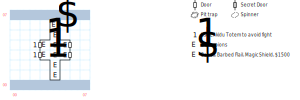

# Scorpion Bridge

Connects Rustic Isle to the island with the Magic College.

## Exits

West: [Rustic](dilmun.md) (30,19)

East: [Magic College isle](dilmun.md) (32,19)

## Points of Interest

**The Scorpion Guards (02,03 - 02,04):** Show them the **Enkidu Totem** that you got from the little island in the [Mystic Wood](mystic-wood.md) and they let you pass. Otherwise you have to fight them at (03,03 - 03,04).

If you're coming from the east, the flag that forces you to fight the Scorpions doesn't get set until you cross all the way to the west side *and* turn around and face the tunnel.

**The Tunnel Through the Mountain:** There are a bunch of fixed combats here that you're just going to have to push through.

**The Secret Treasure (04,06):** Some **Bones**, a **Barbed Flail** (1d30, +2 AC, STR 16), and a **Magic Shield** (+3 AC, STR 10).

## Monsters

    [00] Scorpion\s (-) [#1], STR 60 DEX 60 INT 60 SPR 60, HD:10d12+12 (22-132), AV+6 DV+0, att:1, morale:25, spd:60', XP:500, image:Scorpion, [24]:0x03
      GOOD/ALWAYS:Attack(8d8, 10')
    [01] Evil Spirit\s (it) [#9], STR 03 DEX 12 INT 30 SPR 50, HD:10d4+0 (10-40), AV+4 DV+0, att:1, morale:10, spd:10', XP:200, image:Wraith
      GOOD/ALWAYS:Cast(L:Mage Fire, pow:0, target)
    [02] Bear\s (he/him) [#3], STR 45 DEX 16 INT 05 SPR 10, HD:8d10+10 (18-90), AV+4 DV+0, att:1, morale:9, spd:10', XP:180, can't be disarmed, image:Bear, [0d]:0x66, [24]:0x04
      GOOD/ALWAYS:Attack(10d8 stun, 10')
    [03] Cave Bear\s (it) [#2], STR 20 DEX 10 INT 08 SPR 10, HD:3d8+25 (28-49), AV+4 DV+0, att:1, morale:8, spd:20', XP:150, image:Bear, [24]:0x03
      GOOD/ALWAYS:Attack(8d8, 10')
      HALP/ALWAYS:Flee(100%)
    [04] Wild Dog\s (it) [#7], STR 12 DEX 28 INT 03 SPR 05, HD:3d6+20 (23-38), AV+3 DV+0, att:1, morale:8, spd:30', XP:150, image:Wolf, [24]:0x01
      GOOD/ALWAYS:Attack(6d8, 10')
    [05] Bridge Wol/f\ves (it) [#3], STR 20 DEX 20 INT 03 SPR 10, HD:5d6+25 (30-55), AV+8 DV+0, att:1, morale:8, spd:30', XP:160, image:Wolf, [24]:0x02
      GOOD/ALWAYS:Attack(6d8, 10')