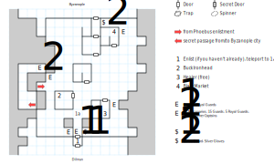

# Siege Camp

## Exits

If you enlisted in Phoebus, you're dropped at (03,07). Otherwise, you're walking in the front door at (07,00) — read paragraph #87 — and you'll be asked if you want to enlist, assuming the war hasn't ended. You'll have to fight off guards to leave this way ([King's Isle](dilmun.md), (07,25)) unless the war is over.

The proper exit to [Byzanople](byzanople.md) (i.e. the "front") is at (09,14), after receiving a blessing(?) from the Universal God in Namtar's name.

The passage that leads between Byzanople and the "final fight" that decides the war is at (02,04), but it's only accessible from Byzanople.

## Points of Interest

Note: Once the War of Byzanople has been decided (in either direction), the Camp empties out. All that's left at that point is the Black Market and the chest with the Silver Arrows.

**The Front Door (07,01 - 07,03):** If you haven't already enlisted in the army, there are guards here that ask if you want to. If you say yes, read paragraph #59 and they send you to (07,04). If you say no, they kick you out (07,00). If you're already "in" and you try to leave, guards at (07,02) will try to stop you, unless you killed them already or the war is over.

**Buck Ironhead's Office (05,06):** Show up once, and he offers you a pardon if you beat Byzanople for him (paragraph #90). Barge in a second time and he sends you to the front (09,13).

**The Silver Arrows (08,02):** Sitting in a locked chest (difficulty 2). Does 1d12 damage.

**The Camp Healer (10,04):** At least he doesn't charge you anything.

**The [Black Market](../things-and-stuff.md#black-market-1) (11,13):** The only vaguely interesting object is the **Bladed Flail** (1d12, STR 10), plus the chance to buy shields.

**The Weapons Stash (10,14):** Contains the **Lance Sword** (1d20 at 20', +1 AV, STR 12) and the **Silver Gloves** (+3 AC).

**The Final Fight (03,09):** If you're on Prince Jordan's side and come through the tunnel from the city to (02,04), this is the big fight that decides the siege. If you win, you get 500 XP and they install a historic plaque in your honor. If you lose or run away, Buck throws you in the [Kingshome Dungeon](kingshome-dungeon.md). If you're standing on this square and not in the middle of a fight, you can use either DEX or *Climb* to squeeze through a passage to the rest of the camp (03,07).

## Bestiary

<table>
  <thead>
    <tr>
      <th></th>
      <th>STR</th>
      <th>DEX</th>
      <th>INT</th>
      <th>SPR</th>
      <th>HP</th>
      <th>AV</th>
      <th>DV</th>
      <th>Speed</th>
      <th>XP</th>
    </tr>
  </thead>
  <tbody>
    <tr>
      <td rowspan=2><b>Guards</b></td>
      <td class="c">12</td>
      <td class="c">16</td>
      <td class="c">10</td>
      <td class="c">10</td>
      <td class="c">17&ndash;42</td>
      <td class="c">+2</td>
      <td class="c">+0</td>
      <td class="c">10'</td>
      <td class="c">200</td>
    </tr><tr>
      <td colspan=9>5d6, 3d6 piercing — awards gold</td>
    </tr><tr>
      <td rowspan=2><b>Kingshomer Captains</b></td>
      <td class="c">33</td>
      <td class="c">19</td>
      <td class="c">10</td>
      <td class="c">10</td>
      <td class="c">81&ndash;111</td>
      <td class="c">+4</td>
      <td class="c">+0</td>
      <td class="c">10'</td>
      <td class="c">300</td>
    </tr><tr>
      <td colspan=9>10d4 — awards gold</td>
    </tr><tr>
      <td rowspan=2><b>Mercenaries</b></td>
      <td class="c">12</td>
      <td class="c">16</td>
      <td class="c">14</td>
      <td class="c">30</td>
      <td class="c">10&ndash;30</td>
      <td class="c">+3</td>
      <td class="c">+0</td>
      <td class="c">30'</td>
      <td class="c">100</td>
    </tr><tr>
      <td colspan=9>4d8 x ¼, dodge, flee — awards gold</td>
    </tr><tr>
      <td rowspan=2><b>Pikemen</b></td>
      <td class="c">15</td>
      <td class="c">14</td>
      <td class="c">9</td>
      <td class="c">10</td>
      <td class="c">16&ndash;36</td>
      <td class="c">+2</td>
      <td class="c">+0</td>
      <td class="c">10'</td>
      <td class="c">190</td>
    </tr><tr>
      <td colspan=9>6d6, 5d8, call for help — awards gold</td>
    </tr><tr>
      <td rowspan=2><b>Royal Guards</b></td>
      <td class="c">18</td>
      <td class="c">18</td>
      <td class="c">18</td>
      <td class="c">18</td>
      <td class="c">11&ndash;36</td>
      <td class="c">+2</td>
      <td class="c">+0</td>
      <td class="c">20'</td>
      <td class="c">220</td>
    </tr><tr>
      <td colspan=9>6d6, <i>L:Mage Fire</i>, call for help — awards gold</td>
    </tr>
  </tbody>
</table>
