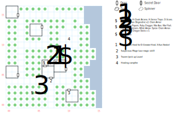

# Slave Camp

There are two paths through the Slave Camp. If you can get the residents [on your side](../walkthrough.md#the-purgatory-day-spa-and-salon-slave-camp), you get to explore the camp and meet everybody. If not, the camp is empty except for a few nasty spirits.

## Exits

You can't exit to the E, but the other directions take you where you would expect in [Dilmun](dilmun.md).

## Points of Interest

**The "tavern" (10,02):** There's no bartender, but you can recruit Louie here.

**The Nature Axe (04,02):** Use *Forest Lore* to search this square for the **Nature Axe** (1d30, -6 AV, STR 18).

**The Creepy Old Wizard (07,04):** Use any magic skill to get him to talk to you; he unlocks his treasure room for you (**Citizenship Papers**, a **Ruby Dagger** (1d4, +3 AV, STR 3), a **War Axe** (1d12, -3 AV, STR 18), a **War Flail** (1d10, STR 10), a **Hammer** (1d10, STR 12), a **Polearm** (1d10, +1 AV, STR 13), some **White Arrows** (1d8, +1 AV), a **Spear** (1d8, 40', DEX 12), **Chain Armor** (+7 AC, -3 AV), a copy of *H:Fire Light*, and some **Dragon Stones**).

If you killed everyone in camp, then the door to his treasure room is locked (level 1) and you'll have to fight the Spirit Ward once you break in.

**The Arms Cache (07,07):** Hidden in a little alcove behind the wizard's house is a locked chest (difficulty 1): Scrolls of *H:Healing*, *H:Cloak Arcane*, *H:Sense Traps*, and *D:Scare*, plus **Chain Armor**, and two each **Leather** (+3 AC, -1 AV) and **Brigandine** (+4 AC, -1 AV).

There's an odd bug; the flag that determines whether you've raided this chest was [accidentally?] reused for the chest in the [Dwarf Ruins](dwarf-ruins.md) that holds the **Dwarf Hammer**. The High Magic scrolls in this chest are unique, though, and you need this armor now more than you need that weapon then.

**The Sick Man (10,06):** When you visit him (08,07), there's a 1 in 20 chance that he goes mad and attacks you (although he'll immediately flee). Otherwise, you have the chance to heal him (use *Bandage* or any healing spell), in which case he gives you a little bit of exposition. In either case you can find copies of *D:Greater Heal* and *S:Sun Stroke* here.

**The Campfire (10,11):** Rest by the campfire for a while; it restores your Health, Stun, and Power.

**The Blind Man (02,05):** Exposition on Namtar, Drake, and the Master Mages of Dilmun.

**The Universal Shrine (00,16):** Exposition on the various gods that rule Dilmun. Interestingly, Refeek is the one we never hear about again.

**The Dice Game (04,13):** Exposition on the political climate and the names of some cities to look out for.

## Monsters

If you don't appease the camp's residents, you have to kill several of them:

**Escaped Slaves:** STR 10 DEX 10 INT 10 SPR 10, HD:2d6+3 (5-15), AV+0 DV+0, att:1, morale:4, spd:10', XP:70

- Attacks: 2d6, call for help, flee (30%)

**Old Gladiators:** STR 15 DEX 17 INT 10 SPR 15, HD:3d8+4 (7-28), AV+3 DV+0, att:1, morale:5, spd:20', XP:100

- Attacks: 4d6, block, 3d8, dodge, flee (50%)

------

And you'll have to fight off the Spirit Ward to get at the wizard's treasure:

**Spirit Ward:** STR 01 DEX 19 INT 20 SPR 20, HD:10d6+0 (10-60), AV+1 DV+0, att:1, morale:8, spd:10', XP:500

- Attacks: *H:Elvar's Fire*, *H:Fire Light*, 7d4

------

On the off chance that The Sick Man attacks you:

**Man with a fever:** STR 01 DEX 01 INT 01 SPR 01, HD:10d20+100 (110-300), AV+1 DV+0, att:1, morale:3, spd:10', XP:320

- Attacks: flee (100%)