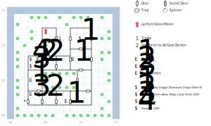

# Slave Estate

Slaveholder Mog isn't an important figure in any way, although he will show up (posthumously) later on down the line. This map mostly serves as a gateway between the Slave Mines below and Forlorn, although the Magic Lamp is a nice piece of kit.

*Easter Egg:* If you try to use the **Elixir** on one of the statues along the E coast, you get a message saying it doesn't work. Problem is, there are no other references to an Elixir either on this map or anywhere else in the game. If you were to find one, it would also act as a healing potion (*S:Heal*)!

## Exits

Exiting to the S takes you to [Dilmun](dilmun.md).

You can't take the stairs down to the [Slave Mines](slave-mines.md), but if you came up from there you're deposited in the shack at (05,12).

## Points of Interest

**Tracks (07,11):** If you came up from the mines, upon exiting the building you immediately spot a set of tracks. Use *Tracker* to follow them and they deposit you at (02,02), right outside the Demon's lair. Not the most helpful, that.

**The Unguarded Guardroom (10,12):** Six **Dragon Stones**, along with another **Ruby Dagger** (1d4, +3 AV, STR 3), a **Shortsword** (1d6, +1 AV, STR 8), and a **Hammer** (1d10, STR 12).

**The Creaky Floorboard (05,08):** Use *Strength* here to find a locked chest (difficulty 3). It contains the **Magic Lamp** (permanent light source), a **Helm** (+1 AC), a **Shield** (+2 AC), a pair of **Gauntlets** (+2 AC), and some **Arrows** (1d6). Then proceed W through a secret door to fight off the Snake.

**The Secret Room (03,08):** A locked chest (difficulty 3), but all it has is a **Handaxe** (1d8, STR 5) and some gold. 1S of this chest is a pile of broken mirrors (see below).

**The other pile of mirrors (04,03):** If you pick one of these up, you can use it to kill Mog without fighting him.

**The Gaze Demon (03,04):** Use a mirror fragment at (04,03) or (03,02) to petrify the Demon without fighting it. Or step onto (03,04) and combat starts.

## Monsters

<table>
  <tr>
    <th></th>
    <th>STR</th>
    <th>DEX</th>
    <th>INT</th>
    <th>SPR</th>
    <th>HD</th>
    <th>HP</th>
    <th>AV</th>
    <th>DV</th>
    <th>Speed</th>
    <th>XP</th>
  </tr>
  <tr>
    <td><b>Goblins</b></td>
    <td>12</td>
    <td>14</td>
    <td>10</td>
    <td>10</td>
    <td>3d6+3</td>
    <td>6-21</td>
    <td>+1</td>
    <td>+0</td>
    <td>10'</td>
    <td>90</td>
  </tr><tr>
    <td></td>
    <td colspan="10">3d6</td>
  </tr>
  <tr>
    <td><b>Snakes</b></td>
    <td>18</td>
    <td>22</td>
    <td>18</td>
    <td>18</td>
    <td>5d6+6</td>
    <td>11-36</td>
    <td>+2</td>
    <td>+0</td>
    <td>10'</td>
    <td>200</td>
  </tr><tr>
    <td></td>
    <td colspan="10">2d10, 3d6, <i>H:Fire Light</i> @3, call for help</td>
  </tr>
</table>

There are two Gaze Demons in the board data, and two encounters (one where he shatters any mirrors you have in your inventory, and one where he doesn't). I presume that those two encounters were supposed to reference a stronger or weaker Demon, but they don't.

<table>
  <tr>
    <th></th>
    <th>STR</th>
    <th>DEX</th>
    <th>INT</th>
    <th>SPR</th>
    <th>HD</th>
    <th>HP</th>
    <th>AV</th>
    <th>DV</th>
    <th>Speed</th>
    <th>XP</th>
  </tr>
  <tr>
    <td><b>Gaze Demon</b></td>
    <td>20</td>
    <td>24</td>
    <td>20</td>
    <td>50</td>
    <td>5d12+50</td>
    <td>55-110</td>
    <td>+1</td>
    <td>+0</td>
    <td>50'</td>
    <td>400</td>
  </tr><tr>
    <td></td>
    <td colspan="10">2d6 breath, 3d6</td>
  </tr>
  <tr>
    <td><b>Gaze Demon (easter egg)</b></td>
    <td>0</td>
    <td>24</td>
    <td>0</td>
    <td>0</td>
    <td>5d12+50</td>
    <td>55-110</td>
    <td>+1</td>
    <td>+0</td>
    <td>50'</td>
    <td>400</td>
  </tr><tr>
    <td></td>
    <td colspan="10">3d6 breath, 3d6</td>
  </tr>
</table>

