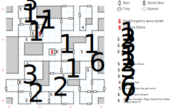

# Slave Mines

Possibly the simplest way to exit Purgatory, but far from the easiest way to reach freedom. You're stripped of your equipment and chained, which makes combat really hard. In essence this board is one large puzzle: you need to break your chains, find your equipment, and defeat the guards to get out of here.

You won't run into any random encounters down here, but there are some a few fixed fights to watch out for. Until you break your chains, you're seriously hampered (-15 AV, -15 AC) in your ability to fight.

## Exits

- If you arrive from Purgatory, you're dropped at (07,08). This isn't an exit so much as a one-way entrance.
- The actual exit is at (05,11), behind some guards. It takes you to the [Slave Estate](slave-estate.md) (05,12).

## Points of Interest

**Guard Patrols (08,08; 09,04; 03,10; 02,13):** The ones right outside your starting door will just sneer at you, so long as you're still in chains. Come back afterwards and you'll have to fight them. Everybody else beats you up regardless.

**Snake Pit (03,00):** Snakes don't hit too hard, but the real problem with this fight is that there can be up to 19 of them.

**Spider Nest (02,03):** Same, but the random generator tops out at 4 Spiders, so this one isn't so bad.

**A Pile of Stones (12,08):** Some of them are **Dragon Stones**, but you'll also need a **Rock** in order to fashion a Crude Hammer (so you can break your chains).

**The Old Pick Handle (07,01):** Item number two.

**The Battered Cup (02,15):** A drinking vessel.

**The Trickling Spring (12,12)**: A source of water.

**The Dying Old Man (03,06):** He begs you for water, then dies pitifully. His Laces are the last item you need to make the Hammer.

**The Trash Pile (13,05):** This is where all your old equipment ended up when the guards took it off you, but you can't pick it up until you break the chains with the hammer.

**The Secret Cache (04,11):** Behind a secret door there's a locked chest (difficulty 1) containing a **War Axe** (1d12, -3 AV, STR 18), a pair of **Gauntlets** (+2 AC), the **Magic Sword** (1d12, +1 AV, STR 17), the **Pierce Bolt** (1d6, +1 AV), and some **Dragon Stones**.

**The Exit (05,12):** If you're still wearing chains, the guards drag you back into the Mines. Otherwise, you have to fight off the Cruel Slave Boss and his friends.

## Bestiary

<table>
  <tr>
    <th></th>
    <th>STR</th>
    <th>DEX</th>
    <th>INT</th>
    <th>SPR</th>
    <th>HD</th>
    <th>HP</th>
    <th>AV</th>
    <th>DV</th>
    <th>Speed</th>
    <th>XP</th>
  </tr>
  <tr>
    <td><b>Guards</b></td>
    <td>15</td>
    <td>17</td>
    <td>9</td>
    <td>10</td>
    <td>3d6+12</td>
    <td>15-30</td>
    <td>+3</td>
    <td>+0</td>
    <td>10'</td>
    <td>90</td>
  </tr><tr>
    <td></td>
    <td colspan="10">3d8 stun</td>
  </tr>
  <tr>
    <td><b>Snakes</b></td>
    <td>8</td>
    <td>19</td>
    <td>2</td>
    <td>3</td>
    <td>1d4+2</td>
    <td>3-6</td>
    <td>+1</td>
    <td>+0</td>
    <td>50'</td>
    <td>90</td>
  </tr><tr>
    <td></td>
    <td colspan="10">1d4, flee</td>
  </tr>
  <tr>
    <td><b>Spider\s</b></td>
    <td>5</td>
    <td>12</td>
    <td>5</td>
    <td>5</td>
    <td>1d4+0</td>
    <td>1-4</td>
    <td>+1</td>
    <td>+0</td>
    <td>10'</td>
    <td>1</td>
  </tr><tr>
    <td></td>
    <td colspan="10">1d4</td>
  </tr>
</table>

There's a party of harder guards near the exit:

<table>
  <tr>
    <th></th>
    <th>STR</th>
    <th>DEX</th>
    <th>INT</th>
    <th>SPR</th>
    <th>HD</th>
    <th>HP</th>
    <th>AV</th>
    <th>DV</th>
    <th>Speed</th>
    <th>XP</th>
  </tr>
  <tr>
    <td><b>Cruel Slave Boss</b></td>
    <td>20</td>
    <td>14</td>
    <td>6</td>
    <td>5</td>
    <td>3d8+5</td>
    <td>8-29</td>
    <td>+1</td>
    <td>+0</td>
    <td>10'</td>
    <td>100</td>
  </tr><tr>
    <td></td>
    <td colspan="10">2d8, flee</td>
  </tr>
  <tr>
    <td><b>Guards</b></td>
    <td>15</td>
    <td>17</td>
    <td>0</td>
    <td>0</td>
    <td>3d6+0</td>
    <td>3-18</td>
    <td>+1</td>
    <td>+0</td>
    <td>10'</td>
    <td>120</td>
  </tr><tr>
    <td></td>
    <td colspan="10">2d8</td>
  </tr>
</table>