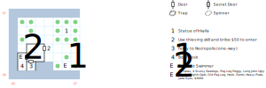

# Smuggler's Cove

Home base for Ugly and his crew of pirates, and the good ship *Prairie Madness* which you'll eventually steal.

## Exits

East: [Quag](dilmun.md) (25,13)

The fake boat dock at (02,01) will allow Ugly to take you to the [Necropolis](necropolis.md) (07,14).

The real boat dock at (01,01) takes you to all the places a normal Boat Dock takes you.

## Points of Interest

**The Statue of Irkalla (06,05):** Functionally identical to the one in Purgatory; sacrifice any item and make a Spirit check vs 1d20 to receive Irkalla's blessing.

**The Waterfront Beast (06,02):** A Serpent Swimmer attacks for no reason whatsoever.

**Ugly's Hideout (03,03):** A crew of pirates demand that you speak their "language". You can use *Bureaucracy, Hiding, Lockpick, Merchant* (oops), or *Pickpocket* to satisfy them, but you'll also have to cough up at least $50.

If you take the S door, Ugly transports you (one-way, of course) to the [Necropolis](necropolis.md).

If you take the W door, Ugly and his crew will fight to the death (i.e. if you run away or get Stunned, combat just restarts). Beat them and find a locked chest (difficulty 2) containing $3000, a suit of **Pilgrim Garb**, Peg's **Old Peg Leg** (1d8, +1 AV, STR 10), Ugly's **Hook** (1d8, +1 AV, STR 10), a **Parrot** (useless), a suit of **Heavy Plate** (+12 AC, -6 AV), and the **Jade Eyes**, which are used to get into the Dwarf Clan Hall. Then you get to use the normal Boat Dock.

## Bestiary

<table>
  <tr>
    <th></th>
    <th>STR</th>
    <th>DEX</th>
    <th>INT</th>
    <th>SPR</th>
    <th>HD</th>
    <th>HP</th>
    <th>AV</th>
    <th>DV</th>
    <th>Speed</th>
    <th>XP</th>
  </tr>
  <tr>
    <td><b>Serpent Swimmer</b></td>
    <td>18</td>
    <td>22</td>
    <td>01</td>
    <td>10</td>
    <td>7d8+45</td>
    <td>52-101</td>
    <td>+4</td>
    <td>+0</td>
    <td>40'</td>
    <td>180</td>
  </tr>
  <tr>
    <td></td>
    <td colspan=10>12d4</td>
  </tr>
</table>

Ugly's crew:

<table>
  <tr>
    <th></th>
    <th>STR</th>
    <th>DEX</th>
    <th>INT</th>
    <th>SPR</th>
    <th>HD</th>
    <th>HP</th>
    <th>AV</th>
    <th>DV</th>
    <th>Speed</th>
    <th>XP</th>
  </tr>
  <tr>
    <td><b>Long John Ugly</b></td>
    <td>12</td>
    <td>23</td>
    <td>14</td>
    <td>30</td>
    <td>6d6+50</td>
    <td>56-86</td>
    <td>+2</td>
    <td>+0</td>
    <td>20'</td>
    <td>1500</td>
  </tr>
  <tr>
    <td></td>
    <td colspan=10>15d10 stun
  </tr>
  <tr>
    <td><b>Peg Leg Peggy</b></td>
    <td>18</td>
    <td>18</td>
    <td>18</td>
    <td>18</td>
    <td>5d6+25</td>
    <td>30-55</td>
    <td>+2</td>
    <td>+0</td>
    <td>20'</td>
    <td>170</td>
  </tr>
  <tr>
    <td></td>
    <td colspan=10>8d6, 2d4 piercing, <i>L:Mage Fire</i>, flee</td>
  </tr>
  <tr>
    <td><b>Pirates</b></td>
    <td>15</td>
    <td>20</td>
    <td>09</td>
    <td>10</td>
    <td>4d8+25</td>
    <td>29-57</td>
    <td>+4</td>
    <td>+0</td>
    <td>10'</td>
    <td>150</td>
  </tr>
  <tr>
    <td></td>
    <td colspan=10>8d6</td>
  </tr>
  <tr>
    <td><b>Scurvy Seadogs</b></td>
    <td>12</td>
    <td>15</td>
    <td>10</td>
    <td>10</td>
    <td>6d8+30</td>
    <td>36-78</td>
    <td>+2</td>
    <td>+0</td>
    <td>30'</td>
    <td>180</td>
  </tr>
  <tr>
    <td></td>
    <td colspan=10>8d10 stun @ 40', 10d10 stun</td>
  </tr>
</table>