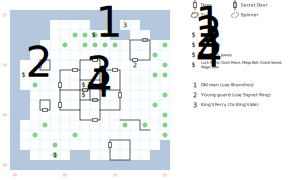

# Snake Pit

A lovely little vacation home for the criminally insane (or, at least, those who will become insane after being declared criminals by Namtar...)

## Exits

East: [Isle of the Damned](dilmun.md) (03,19).

(11,14): The ferrymaster will take you to the [King's Isle](dilmun.md) ambush point (20,26).

## Points of Interest

**The Boathouse (12,10):** There's a young man guarding the boathouse who won't let you past unless you show him King Drake's **Signet Ring**. Once you're past him, take the "secret" door to the N and meet the ferrymaster at (11,14).

**Loose Branches (08,13):** Pick up some **Branches** here. Technically, they will cast *D:Beast Call* if you *Charge* them first.

**The Lonely Druid (04,01):** Show him the **Branches** and he'll teach you *D:Beast Call*. This doesn't consume the Branches, so hand them to anyone else in the party with *Druid Magic* and do it again.

**The Stone Head (01,09):** Apparently just washed up on the beach. (You need this to put Lanac'toor's statue back together in [Mud Toad](mud-toad.md).)

**The Mad Artist (11,02):** Read paragraph #76.

**Josephina the Dwarf (06,08):** Read paragraph #81 for a plot arrow towards using the **Jade Eyes** to repair the statue at the [Dwarf Ruins](dwarf-ruins.md). If you've defeated Ugly and have the Eyes, you're supposed to be able to show them for a more explicit hint to "replace them in the statue", but the item reference doesn't actually exist in the code so it doesn't work. Anyway, there's a reasonable chance you don't even have the Eyes at this point, so the bug isn't really much of a loss.

**The Useless Hint (09,07):** A mad woman tells you "the King is near!" She's right, sorta.

**The Sad Remains of King Drake (07,08):** First, meet a sad jester at (07,06). If you've explored the entire rest of the map, you're now left with a 2x2 area in the center that's not filled in. Hopefully that clues you to start looking for secret doors. Drake's throne (and skeleton) are at (07,08), along with paragraph #80, his **Signet Ring**, and $8000 worth of **Jewels**. Step 1S from there through another secret door, and there's a locked chest (difficulty 2) containing the **Luck Wand** (*L:Luck*), **Crush Mace** (4d10, STR 15), **Grand Sword** (2d12, +1 AV, STR 22), a **Magic Bow** (+4 AV, 70', DEX 10), and a quiver of **Magic Bolts** (1d20, +20' range).