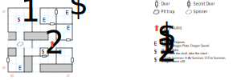

# Sunken Ruins (below)

Another small, wrapping dungeon map with a spinner, much like the Tars Dungeon. You'll need **light** and a **compass**.

## Exits

(05,03): Stairs up to the [upper level](sunken-ruins.md) (05,04).

## Points of Interest

**The Magic Clam (01,06):** (Settle down.) The Skull of Roba is inside. When the game offers to let you take the Skull, say no, otherwise the clam shell crunches you for 1d3 damage. Take the entire Clam instead. When next you climb the stairs to the upper level, the Clam melts away and leaves you with **Roba's Skull**.

**The Secret Closet (04,02):** A locked chest (difficulty 4) with scrolls of *H:Earth Summon, H:Air Summon, H:Water Summon*, and ten **Dragon Stones**.

**Javy Dones' Locker (07,07):** A fight with some Bloated Corpses. Their locker requires *Lockpick 2* and contains the **Trident** (2d20 at 40', +3 AV, +2 AC, DEX 15, returns to thrower), **Dragon Plate** (+14 AC, -3 AV), and the **Dragon Sword** (4d20, +2 AV, STR 21).

## Monsters

    [00] Sea Snake\s (it) [#5], STR 15 DEX 15 INT 03 SPR 03, HD:4d6+15 (19-39), AV+3 DV+0, att:1, morale:6, spd:10', XP:140, image:Snake, [24]:0x02
      GOOD/ALWAYS:Attack(7d6, 10')
    [01] Serpent Swimmer\s (he/him) [#2], STR 20 DEX 22 INT 20 SPR 02, HD:7d8+45 (52-101), AV+4 DV+0, att:1, morale:7, spd:40', XP:180, image:Water Spirit, [0d]:0x66, [24]:0x02
      GOOD/ALWAYS:Attack(12d4, 10')
    [02] Sea Spider\s (he/him) [#4], STR 10 DEX 10 INT 10 SPR 30, HD:2d6+30 (32-42), AV+6 DV+0, att:1, morale:6, spd:10', XP:150, image:Spider, [24]:0x02
      GOOD/ALWAYS:Attack(7d8, 10')
    [03] Lagooner\s (it) [#0], STR 50 DEX 30 INT 01 SPR 50, HD:5d12+25 (30-85), AV+5 DV+0, att:1, morale:9, spd:120', XP:320, can't be disarmed, image:Water Spirit, [24]:0x05
      GOOD/ALWAYS:Attack(7d8, 10')
    [04] Goblin Beach Bum\s (he/him) [#8], STR 10 DEX 16 INT 05 SPR 05, HD:5d4+20 (25-40), AV+4 DV+0, att:1, morale:8, spd:40', XP:120, image:Goblin
      GOOD/ALWAYS:Attack(6d8, 10')
      HALP/ALWAYS:Flee(60%)
    [05] Bloated Corpse\s (he/him) [#0], STR 00 DEX 24 INT 00 SPR 00, HD:5d8+30 (35-70), AV+4 DV+0, att:1, morale:8, spd:30', XP:300, image:Zombie, [24]:0x02
      GOOD/ALWAYS:Attack(8d8, 10')