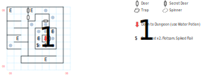

# Sunken Ruins (above)

## Exits

The [Eastern Isles](dilmun.md) near (38,15).

(05,04): Stairs down to the [lower level](sunken-dungeon.md) (05,03).

## Points of Interest

**The False Door (02,07):** Technically it's not a fake door, it's just very hard to unlock (level 4). But there's a secret door 1N of there that you can use for free.

**The Dead Wood (04,03):** Some **Driftwood**, some **Flotsam**, and a **Spiked Flail** (4d20, +2 AV, +1 AC, STR 16).

**The Open Well (05,04):** *Swim* and *Climb* won't do you any good, although they do give you a hint that you'll need something to "allow you to survive underwater", like the **Water Potion** you got from [Irkalla](magan-underworld.md).

## Bestiary

<table>
  <tr>
    <th></th>
    <th>STR</th>
    <th>DEX</th>
    <th>INT</th>
    <th>SPR</th>
    <th>HD</th>
    <th>HP</th>
    <th>AV</th>
    <th>DV</th>
    <th>Speed</th>
    <th>XP</th>
  </tr>
  <tr>
    <td><b>Beach Bums</b></td>
    <td>10</td>
    <td>16</td>
    <td>5</td>
    <td>5</td>
    <td>5d4+20</td>
    <td>25-40</td>
    <td>+4</td>
    <td>+0</td>
    <td>40'</td>
    <td>120</td>
  </tr><tr>
    <td></td>
    <td colspan="10">6d8, flee</td>
  </tr>
  <tr>
    <td><b>Bloated Corpses</b></td>
    <td>0</td>
    <td>24</td>
    <td>0</td>
    <td>0</td>
    <td>5d8+30</td>
    <td>35-70</td>
    <td>+4</td>
    <td>+0</td>
    <td>30'</td>
    <td>1</td>
  </tr><tr>
    <td></td>
    <td colspan="10">8d8</td>
  </tr>
  <tr>
    <td><b>Lagooners</b></td>
    <td>50</td>
    <td>30</td>
    <td>1</td>
    <td>50</td>
    <td>5d12+25</td>
    <td>30-85</td>
    <td>+5</td>
    <td>+0</td>
    <td>120'</td>
    <td>320</td>
  </tr><tr>
    <td></td>
    <td colspan="10">7d8 — can't be disarmed</td>
  </tr>
  <tr>
    <td><b>Sea Rats</b></td>
    <td>10</td>
    <td>10</td>
    <td>10</td>
    <td>30</td>
    <td>2d6+30</td>
    <td>32-42</td>
    <td>+6</td>
    <td>+0</td>
    <td>10'</td>
    <td>150</td>
  </tr><tr>
    <td></td>
    <td colspan="10">7d8</td>
  </tr>
  <tr>
    <td><b>Serpent Swimmers</b></td>
    <td>20</td>
    <td>22</td>
    <td>20</td>
    <td>2</td>
    <td>7d8+45</td>
    <td>52-101</td>
    <td>+4</td>
    <td>+0</td>
    <td>40'</td>
    <td>180</td>
  </tr><tr>
    <td></td>
    <td colspan="10">12d4</td>
  </tr>
  <tr>
    <td><b>Water Turtles</b></td>
    <td>15</td>
    <td>15</td>
    <td>3</td>
    <td>3</td>
    <td>4d6+15</td>
    <td>19-39</td>
    <td>+3</td>
    <td>+0</td>
    <td>10'</td>
    <td>140</td>
  </tr><tr>
    <td></td>
    <td colspan="10">7d6</td>
  </tr>
</table>
