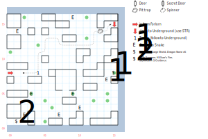

# Tars Ruins

A ruined city, destroyed by dragons. Random (1 in 100) and fixed encounters abound.

*D:Soften Stone* works here, but none of the ruined buildings have anything in them.

## Exits

The western edge of the map brings you back to [Dilmun](dilmun.md) (20,04).

The stone slab at (15,15) hides stairs down to the [Tars Underground](tars-underground.md).

## Points of Interest

**Entrance (00,08):** Color text indicating just how screwed up Tars is. 1E of here, anyone with *Arcane Lore* will give you additional color text indicating that Tars was destroyed by dragons.

**The Tracks (04,08):** You notice a set of tracks. They actually start at (02,08) and end at the stone slab (15,15); you can use *Tracker* at any point to follow them, which conveniently skips over the pit trap at (13,14) as well.

**Spells on the Wall (01,01):** You have to beat the random encounter at (02,02) in order to find a bunch of scrolls tacked to the wall: *H:Air Summon*, *H:Elvar's Fire*, *S:Exorcism*, and *S:Guidance*.

**The Dragon Pit (07,06 - 09,08):** A slightly less damaged part of the city. Use *Town Lore* or *Arcane Lore* to read a paragraph about the use of dragons for city defense.

**The Guardian Snake (14,07):** Defeat it to get access to the chest with a **Large Shield** (+3 AC, -2 AV, STR 12) and the **Firesword** (1d12, +2 AV, +1 AC, STR 17)

**The Pit Trap (13,14):** Take 8 damage, unless either (a) you're following tracks (b) you've already moved the stone slab (c) you have a trap-finding spell active.

**The Stone Slab (15,15):** You can examine it with *Cave Lore*, *Mountain Lore*, *Lockpick*, or *Tracker*, but I'm not sure what good that does you. To move it, make a STR check vs 1d40. There's no penalty for missing. Once you move the slab, you find stairs down to the Tars Underground.

## Bestiary

<table>
  <tr>
    <th></th>
    <th>STR</th>
    <th>DEX</th>
    <th>INT</th>
    <th>SPR</th>
    <th>HD</th>
    <th>HP</th>
    <th>AV</th>
    <th>DV</th>
    <th>Speed</th>
    <th>XP</th>
  </tr>
  <tr>
    <td><b>Goblins</b></td>
    <td>10</td><td>19</td><td>06</td><td>10</td>
    <td>3d4+10</td><td>13-22</td><td>+3</td><td>+0</td>
    <td>30'</td><td>90</td>
  </tr>
  <tr>
    <td></td>
    <td colspan=10>4d6, dodge, call for help</td>
  </tr>
  <tr>
    <td><b>Giant Snakes</b></td>
    <td>20</td><td>17</td><td>01</td><td>03</td>
    <td>4d4+10</td><td>14-26</td><td>+2</td><td>+0</td>
    <td>10'</td><td>100</td>
  </tr>
  <tr>
    <td></td>
    <td colspan=10>3d10, 2d12, flee — can't be disarmed</td>
  </tr>
  <tr>
    <td><b>Guardian Snake</b></td>
    <td>15</td><td>20</td><td>20</td><td>20</td>
    <td>3d10+60</td><td>63-90</td><td>+4</td><td>+0</td>
    <td>40'</td><td>1200</td>
  </tr>
  <tr>
    <td></td>
    <td colspan=10>4d8</td>
  </tr>
  <tr>
    <td><b>Lizard Apes</b></td>
    <td>25</td><td>19</td><td>03</td><td>05</td>
    <td>4d6+10</td><td>14-34</td><td>+2</td><td>+0</td>
    <td>20'</td><td>90</td>
  </tr>
  <tr>
    <td></td>
    <td colspan=10>5d6, 3d6, call for help, dodge</td>
  </tr>
  <tr>
    <td><b>Shadow Spiders</b></td>
    <td>12</td>
    <td>19</td>
    <td>03</td>
    <td>05</td>
    <td>3d6+10</td>
    <td>13-28</td>
    <td>+2</td>
    <td>+0</td>
    <td>30'</td>
    <td>120</td>
  </tr>
  <tr>
    <td></td>
    <td colspan=10>4d6, 3d8 health, flee</td>
  </tr>
  <tr>
    <td><b>Skeletons</b></td>
    <td>08</td>
    <td>08</td>
    <td>08</td>
    <td>08</td>
    <td>2d8+10</td>
    <td>12-26</td>
    <td>+2</td>
    <td>+0</td>
    <td>10'</td>
    <td>80</td>
  </tr>
  <tr>
    <td></td>
    <td colspan=10>4d6, 1d8 — undead</td>
  </tr>
  <tr>
    <td><b>Spiders</b></td>
    <td>03</td>
    <td>19</td>
    <td>01</td>
    <td>01</td>
    <td>2d4+8</td>
    <td>10-16</td>
    <td>+2</td>
    <td>+0</td>
    <td>80'</td>
    <td>50</td>
  </tr>
  <tr>
    <td></td>
    <td colspan=10>5d4, 4d6, 2d4 health</td>
  </tr>
  <tr>
    <td><b>Spitting Lizards</b></td>
    <td>05</td>
    <td>14</td>
    <td>05</td>
    <td>10</td>
    <td>3d4+10</td>
    <td>13-22</td>
    <td>+2</td>
    <td>+0</td>
    <td>20'</td>
    <td>70</td>
  </tr>
  <tr>
    <td></td>
    <td colspan=10>1d4 breath, 4d4 breath, 3d6 breath, flee</td>
  </tr>
  <tr>
    <td><b>Underworld Beasts</b></td>
    <td>20</td>
    <td>10</td>
    <td>08</td>
    <td>10</td>
    <td>3d8+10</td>
    <td>13-34</td>
    <td>+2</td>
    <td>+0</td>
    <td>20'</td>
    <td>110</td>
  </tr>
  <tr>
    <td></td>
    <td colspan=10>5d6, 3d6, flee</td>
  </tr>
  <tr>
    <td><b>Wolves</b></td>
    <td>13</td>
    <td>15</td>
    <td>05</td>
    <td>05</td>
    <td>3d4+10</td>
    <td>13-22</td>
    <td>+2</td>
    <td>+0</td>
    <td>20'</td>
    <td>70</td>
  </tr>
  <tr>
    <td></td>
    <td colspan=10>5d6, flee</td>
  </tr>
</table>

