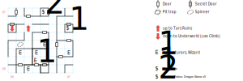

# Tars Underground

A tiny but confusing board, thanks to a spinner and a wrapping map. Your best bet is to get in and get out... although the easter egg is pretty epic.

This is a proper dungeon, so you need a light source to see and a compass to get your bearings. There are also far too many types of wandering monsters (1 in 100) for a board this small.

## Exits

(02,05) Stairs up to the ruins of [Tars](tars-ruins.md).

(00,05) A pit that you can *Climb* down to the [Underworld](magan-underworld.md), behind a secret door.

## Points of Interest

Whenever "your footsteps sound hollow", there's a secret door nearby. Face the wall and use *Tracker* to reveal it on the game map, or just walk through it.

**The Spinner (01,04):** A standard spinner trap, which works by changing your orientation but not redrawing the viewport (although if you have a compass spell running, it will point in the new orientation). Weirdly, if you wind up facing N or S, you are then able to walk through the wall!

**The Stone Arms (07,04):** Part of the Lanac'toor puzzle, stored in a chest behind a secret door. This is the only thing you really need to come here for, so take it and run.

**The Closet (04,07):** Another chest behind a secret door, this time with a **Healing Potion** (*S:Heal*) and five **Dragon Stones**.

**The Other Closet (04,00):** A locked chest (difficulty 1) behind a secret door. *H:Fire Light*, *D:Death Curse*, *S:Sun Stroke*.

**The Visual Illusion (05,02):** You spot yourself moving at the other end of an infinite corridor.

**The Adventuring Party (03,01):** Nasty.

**The Inexplicable Easter Egg (04,02):** Quite a shame about those adventurers, eh? Well, if you happen to use *Arcane Lore* here, Captain Kirk checks in from the bridge of the *Enterprise*:

> "The scanner reports a vessel approaching at warp 19!!"

> "Spock?", Kirk says, "Intentions?" Spock scans the intruder. "Unable to tell, it seems to be doing evasive manouvers as if it is under attack."

> Kirk looks over to the transport tube and sees a party just standing there completely bewildered. "Who are you?" are the last words said as the strange people vanish. "Illogical" says Spock.

This is hands-down the weirdest easter egg in the entire game. I screamed out loud, booted up an old save file, and ran to that spot to verify it for myself.

## Monsters

<table>
  <tr>
    <th></th>
    <th>STR</th>
    <th>DEX</th>
    <th>INT</th>
    <th>SPR</th>
    <th>HD</th>
    <th>HP</th>
    <th>AV</th>
    <th>DV</th>
    <th>Speed</th>
    <th>XP</th>
  </tr>
  <tr>
    <td><b>Cave Snakes</b></td>
    <td>3</td>
    <td>19</td>
    <td>1</td>
    <td>1</td>
    <td>6d4+10</td>
    <td>16-34</td>
    <td>+2</td>
    <td>+0</td>
    <td>80'</td>
    <td>120</td>
  </tr><tr>
    <td></td>
    <td colspan="10">5d6, 4d4</td>
  </tr>
 <tr>
    <td><b>Cave Wolves</b></td>
    <td>13</td>
    <td>13</td>
    <td>5</td>
    <td>10</td>
    <td>3d8+10</td>
    <td>13-34</td>
    <td>+3</td>
    <td>+0</td>
    <td>20'</td>
    <td>120</td>
  </tr><tr>
    <td></td>
    <td colspan="10">5d4, 7d4, flee</td>
  </tr>
  <tr>
    <td><b>Ghouls</b></td>
    <td>12</td>
    <td>16</td>
    <td>1</td>
    <td>1</td>
    <td>3d6+16</td>
    <td>19-34</td>
    <td>+4</td>
    <td>+0</td>
    <td>20'</td>
    <td>150</td>
  </tr><tr>
    <td></td>
    <td colspan="10">7d4 — undead</td>
  </tr>
  <tr>
    <td><b>Giant Snake</b></td>
    <td>20</td>
    <td>22</td>
    <td>1</td>
    <td>3</td>
    <td>3d8+10</td>
    <td>13-34</td>
    <td>+2</td>
    <td>+0</td>
    <td>10'</td>
    <td>100</td>
  </tr><tr>
    <td></td>
    <td colspan="10">3d8 — can't be disarmed</td>
  </tr>
 <tr>
    <td><b>Goblin</b></td>
    <td>10</td>
    <td>12</td>
    <td>6</td>
    <td>10</td>
    <td>3d8+10</td>
    <td>13-34</td>
    <td>+4</td>
    <td>+0</td>
    <td>30'</td>
    <td>120</td>
  </tr><tr>
    <td></td>
    <td colspan="10">4d6, 6d4 stun</td>
  </tr>
  <tr>
    <td><b>Guard Goblin</b></td>
    <td>20</td>
    <td>10</td>
    <td>8</td>
    <td>10</td>
    <td>3d8+16</td>
    <td>19-40</td>
    <td>+3</td>
    <td>+0</td>
    <td>20'</td>
    <td>90</td>
  </tr><tr>
    <td></td>
    <td colspan="10">5d6, 4d6</td>
  </tr>
  <tr>
    <td><b>Lizard Men</b></td>
    <td>25</td>
    <td>17</td>
    <td>3</td>
    <td>5</td>
    <td>4d6+12</td>
    <td>16-36</td>
    <td>+2</td>
    <td>+0</td>
    <td>20'</td>
    <td>120</td>
  </tr><tr>
    <td></td>
    <td colspan="10">3d8, 4d6</td>
  </tr>
  <tr>
    <td><b>Lizard Men</b></td>
    <td>33</td>
    <td>12</td>
    <td>10</td>
    <td>12</td>
    <td>3d12+12</td>
    <td>15-48</td>
    <td>+2</td>
    <td>+0</td>
    <td>20'</td>
    <td>150</td>
  </tr><tr>
    <td></td>
    <td colspan="10">8d4, call for help — can't be disarmed</td>
  </tr>
  <tr>
    <td><b>Skeletons</b></td>
    <td>8</td>
    <td>14</td>
    <td>8</td>
    <td>8</td>
    <td>3d8+9</td>
    <td>12-33</td>
    <td>+2</td>
    <td>+0</td>
    <td>10'</td>
    <td>80</td>
  </tr><tr>
    <td></td>
    <td colspan="10">4d6, 4d4, 1d8 — undead</td>
  </tr>
  <tr>
    <td><b>Spiders</b></td>
    <td>12</td>
    <td>17</td>
    <td>3</td>
    <td>5</td>
    <td>1d4+5</td>
    <td>6-9</td>
    <td>+2</td>
    <td>+0</td>
    <td>30'</td>
    <td>70</td>
  </tr><tr>
    <td></td>
    <td colspan="10">3d8, 4d6</td>
  </tr>
  <tr>
    <td><b>Spitting Snake</b></td>
    <td>5</td>
    <td>15</td>
    <td>5</td>
    <td>10</td>
    <td>2d4+10</td>
    <td>12-18</td>
    <td>+2</td>
    <td>+0</td>
    <td>20'</td>
    <td>90</td>
  </tr><tr>
    <td></td>
    <td colspan="10">2d8 breath, 3d8</td>
  </tr>
  <tr>
    <td><b>Wraiths</b></td>
    <td>3</td>
    <td>22</td>
    <td>30</td>
    <td>40</td>
    <td>3d10+10</td>
    <td>13-40</td>
    <td>+2</td>
    <td>+0</td>
    <td>10'</td>
    <td>180</td>
  </tr><tr>
    <td></td>
    <td colspan="10"><i>H:Fire Light</i> @3 — undead</td>
  </tr>
</table>

The adventuring party:

<table>
  <tr>
    <th></th>
    <th>STR</th>
    <th>DEX</th>
    <th>INT</th>
    <th>SPR</th>
    <th>HD</th>
    <th>HP</th>
    <th>AV</th>
    <th>DV</th>
    <th>Speed</th>
    <th>XP</th>
  </tr>
  <tr>
    <td><b>Adventurers</b></td>
    <td>12</td>
    <td>16</td>
    <td>12</td>
    <td>12</td>
    <td>4d6+15</td>
    <td>19-39</td>
    <td>+2</td>
    <td>+0</td>
    <td>10'</td>
    <td>130</td>
  </tr><tr>
    <td></td>
    <td colspan="10">6d4, dodge, flee</td>
  </tr>
  <tr>
    <td><b>Wizard</b></td>
    <td>10</td>
    <td>14</td>
    <td>20</td>
    <td>30</td>
    <td>3d4+18</td>
    <td>21-30</td>
    <td>+3</td>
    <td>+0</td>
    <td>10'</td>
    <td>250</td>
  </tr><tr>
    <td></td>
    <td colspan="10"><i>H:Fire Light</i> @2, <i>D:Whirl Wind</i>, flee</td>
  </tr>
</table>
