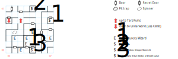

# Tars Underground

A tiny but confusing board, thanks to a spinner and a wrapping map. Your best bet is to get in and get out... although the easter egg is pretty epic.

This is a proper dungeon, so you need a light source to see and a compass to get your bearings. There are also far too many types of wandering monsters (1 in 100) for a board this small.

## Exits

(02,05) Stairs up to the ruins of [Tars](tars-ruins.md).

(00,05) A pit that you can *Climb* down to the [Underworld](magan-underworld.md), behind a secret door.

## Points of Interest

Whenever "your footsteps sound hollow", there's a secret door nearby. Face the wall and use *Tracker* to reveal it on the game map, or just walk through it.

**The Spinner (01,04):** A standard spinner trap, which works by changing your orientation but not redrawing the viewport (although if you have a compass spell running, it will point in the new orientation). Weirdly, if you wind up facing N or S, you are then able to walk through the wall!

**The Stone Arms (07,04):** Part of the Lanac'toor puzzle, stored in a chest behind a secret door. This is the only thing you really need to come here for, so take it and run.

**The Closet (04,07):** Another chest behind a secret door, this time with a **Healing Potion** (*S:Heal*) and five **Dragon Stones**.

**The Other Closet (04,00):** A locked chest (difficulty 1) behind a secret door. *H:Fire Light*, *D:Death Curse*, *S:Sun Stroke*.

**The Visual Illusion (05,02):** You spot yourself moving at the other end of an infinite corridor.

**The Adventuring Party (03,01):** Nasty.

**The Inexplicable Easter Egg (04,02):** Quite a shame about those adventurers, eh? Well, if you happen to use *Arcane Lore* here, Captain Kirk checks in from the bridge of the *Enterprise*:

> "The scanner reports a vessel approaching at warp 19!!"

> "Spock?", Kirk says, "Intentions?" Spock scans the intruder. "Unable to tell, it seems to be doing evasive manouvers as if it is under attack."

> Kirk looks over to the transport tube and sees a party just standing there completely bewildered. "Who are you?" are the last words said as the strange people vanish. "Illogical" says Spock.

This is hands-down the weirdest easter egg in the entire game. I screamed out loud, booted up an old save file, and ran to that spot to verify it for myself.

## Monsters

​    [0c] Adventurer\s (he/him) [#0], STR 12 DEX 16 INT 12 SPR 12, HD:4d6+15 (19-39), AV+2 DV+0, att:1, morale:5, spd:10', XP:130, image:Adventurer, [24]:0x02; 6d4, dodge, flee

​    [06] Cave Snake\s (it) [#3], STR 03 DEX 19 INT 01 SPR 01, HD:6d4+10 (16-34), AV+2 DV+0, att:1, morale:6, spd:80', XP:120, image:Snake; 5d6, 4d4

​    [08] Cave Wol/f\ves (it) [#4], STR 13 DEX 13 INT 05 SPR 10, HD:3d8+10 (13-34), AV+3 DV+0, att:1, morale:6, spd:20', XP:120, image:Wolf, [24]:0x01; 5d4, 7d4, flee

​    [09] Ghoul\s (she/her) [#1], STR 12 DEX 16 INT 01 SPR 01, HD:3d6+16 (19-34), AV+4 DV+0, att:1, morale:6, spd:20', XP:150, Undead, image:Zombie, [0d]:0x96, [24]:0x02; 7d4

​    [01] Giant Snake\s (it) [#1], STR 20 DEX 22 INT 01 SPR 03, HD:3d8+10 (13-34), AV+2 DV+0, att:1, morale:6, spd:10', XP:100, can't be disarmed, image:Snake, [0d]:0x64, [24]:0x05; 3d8

​    [00] Goblin\s (he/him) [#9], STR 10 DEX 12 INT 06 SPR 10, HD:3d8+10 (13-34), AV+4 DV+0, att:1, morale:3, spd:30', XP:120, image:Goblin, [24]:0x01; 4d6, 6d4 stun

​    [03] Guard Goblin\s (it) [#7], STR 20 DEX 10 INT 08 SPR 10, HD:3d8+16 (19-40), AV+3 DV+0, att:1, morale:6, spd:20', XP:90, image:Goblin, [24]:0x03; 5d6, 4d6

​    [05] Lizard M/an\en (he/him) [#2], STR 25 DEX 17 INT 03 SPR 05, HD:4d6+12 (16-36), AV+2 DV+0, att:1, morale:6, spd:20', XP:120, image:Lizardman, [24]:0x03; 3d8, 4d6

​    [0b] Lizard M/an\en (it) [#2], STR 33 DEX 12 INT 10 SPR 12, HD:3d12+12 (15-48), AV+2 DV+0, att:1, morale:7, spd:20', XP:150, can't be disarmed, image:Lizardman, [24]:0x04; 8d4, call for help

​    [07] Skeleton\s (it) [#7], STR 08 DEX 14 INT 08 SPR 08, HD:3d8+9 (12-33), AV+2 DV+0, att:1, morale:6, spd:10', XP:80, Undead, image:Skeleton, [24]:0x02; 4d6, 4d4, 1d8

​    [04] Spider\s (it) [#9], STR 12 DEX 17 INT 03 SPR 05, HD:1d4+5 (6-9), AV+2 DV+0, att:1, morale:6, spd:30', XP:70, image:Spider; 3d8, 4d6

​    [02] Spitting Snake\s (it) [#2], STR 05 DEX 15 INT 05 SPR 10, HD:2d4+10 (12-18), AV+2 DV+0, att:1, morale:6, spd:20', XP:90, image:Snake; breath weapon 2d8, 3d8

​    [0d] Wizard (he/him) [#0], STR 10 DEX 14 INT 20 SPR 30, HD:3d4+18 (21-30), AV+3 DV+0, att:1, morale:5, spd:10', XP:250, image:Robed Man, [24]:0x02; H:Fire Light@2, D:Whirl Wind, flee

​    [0a] Wraith\s (it) [#0], STR 03 DEX 22 INT 30 SPR 40, HD:3d10+10 (13-40), AV+2 DV+0, att:1, morale:9, spd:10', XP:180, Undead, image:Wraith; H:Fire Light@3

