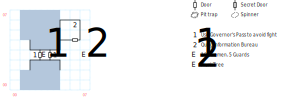

# War Bridge

Simple enough, if you have the Governor's Pass from Lansk. Just watch out for the Murk Tree.

## Exits

West: [Isle of Lansk](dilmun.md) (17,12)

East: [Quag](dilmun.md) (19,12)

## Points of Interest

**The Bridge (02,03 - 04,03):** In either direction, guards demand to see your **Governor's Pass**. Show it to them and they let you through; otherwise, there's a bunch of Pikemen and Guards at (03,03).

**The Random Murk Tree (07,03):** For the unsuspecting traveler who simply proceeds east from the bridge, there's a fight with a Murk Tree here. They suck.

**The Quag Visitor's Bureau (06,06):** There is a 1 in 5 chance that the Crazed Old Ladies of the Bureau decide to attack you instead of help you (paragraph #47).

## Bestiary

<table>
  <tr>
    <th></th>
    <th>STR</th>
    <th>DEX</th>
    <th>INT</th>
    <th>SPR</th>
    <th>HD</th>
    <th>HP</th>
    <th>AV</th>
    <th>DV</th>
    <th>Speed</th>
    <th>XP</th>
  </tr>
  <tr>
    <td><b>Crazed Old Ladies</b></td>
    <td>08</td>
    <td>16</td>
    <td>03</td>
    <td>10</td>
    <td>2d12+20</td>
    <td>22-44</td>
    <td>+3</td>
    <td>+0</td>
    <td>10'</td>
    <td>40</td>
  </tr>
  <tr>
    <td></td>
    <td colspan=10>dodge, <i>H:Big Chill</i></td>
  </tr>
  <tr>
    <td><b>Guards</b></td>
    <td>12</td>
    <td>17</td>
    <td>10</td>
    <td>10</td>
    <td>7d8+12</td>
    <td>19-68</td>
    <td>+3</td>
    <td>+0</td>
    <td>10'</td>
    <td>120</td>
  </tr>
  <tr>
    <td></td>
    <td colspan=10>7d6, block, call for help — awards gold</td>
  </tr>
  <tr>
    <td><b>Murk Tree</b></td>
    <td>20</td>
    <td>16</td>
    <td>03</td>
    <td>03</td>
    <td>8d10+15</td>
    <td>23-95</td>
    <td>+4</td>
    <td>+0</td>
    <td>10'</td>
    <td>120</td>
  </tr>
  <tr>
    <td></td>
    <td colspan=10>7d8, 8d10, flee — can't be disarmed</td>
  </tr>
  <tr>
    <td><b>Pikemen</b></td>
    <td>15</td>
    <td>18</td>
    <td>09</td>
    <td>10</td>
    <td>5d6+15</td>
    <td>20-45</td>
    <td>+3</td>
    <td>+0</td>
    <td>10'</td>
    <td>120</td>
  </tr>
  <tr>
    <td></td>
    <td colspan=10>7d6, 5d8, call for help — awards gold</td>
  </tr>
</table>