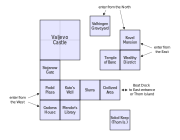
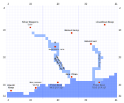

# Yet Another Pool of Radiance Walkthrough

Version 1.0.1, March 2025

## Administrivia



### Acknowledgements

In creating this walkthrough, I relied heavily on information from the Clue Book published by SSI. I highly recommend finding a PDF copy of this book; it has (usually) good maps and information, plus a lot of backstory. You'll also want a copy of the manual and the Adventurer's Journal. Try these sites:
- [http://replacementdocs.com](http://replacementdocs.com)
- [http://www.c64sets.com/pool_radiance.html](http://www.c64sets.com/pool_radiance.html)

If you want a physical code wheel to do the translation and copy protection, you might try printing this out:
- [http://www.weekendwastemonster.net/crpgs/pool/pool_codewheel.jpg](http://www.weekendwastemonster.net/crpgs/pool/pool_codewheel.jpg)

**GameFAQs** has a series of maps produced by Opylex, including maps of the animal lairs in the Wilderness, that I haven't seen anywhere else:
- [http://www.gamefaqs.com/pc/564785-pool-of-radiance/faqs](http://www.gamefaqs.com/pc/564785-pool-of-radiance/faqs)

**GameBanshee's** page has a lot of encyclopedic information. If you ever need to know where to find the Long Sword +5 or how many HP a Displacer Beast has, check out their site:
- [http://www.gamebanshee.com/poolofradiance/](http://www.gamebanshee.com/poolofradiance/)

### Version History

- v1.0, March 2013: completed walkthrough
- v1.0.1, March 2025: rewrite in HTML format with only minor cosmetic updates

### Introduction to the Game

*Pool of Radiance* is the first game in the hugely successful Forgotten
Realms CRPG franchise created by SSI (Strategic Simulations, Inc). It
was, in many ways, the first "real" computerized adaptation of *Dungeons & Dragons*. It was
followed by the sequels:

- *Curse of the Azure Bonds*
- *Secret of the Silver Blades*
- *Pools of Darkness*

The entire Forgotten Realms series is notable in that it allows you to
import your successful party from a previous game, so that you can start
the next one at an advantage.

Please note that this walkthrough is designed for the PC version of the
game and not the NES version. There are some subtle differences. There
are also a hundred walkthroughs for the NES, so if you're playing that
one, go find a different walkthrough.

If you are new to the world of *Dungeons & Dragons* (or didn't start
playing until 2000 or so when Third Edition came out), you should
definitely read the whole manual. It will explain player races, classes,
ability scores, etc. A lot of this stuff was very different in First
Edition AD&D (on which *Pool of Radiance* is based) than it is when the
d20 revolution happened, so it might be worth the refresher.

I hopefully don't have to explain the concept of using dice to generate
random numbers, and what a string like "1d8+11" means.

The manual will also describe all of the menus that you'll be interacting
with. Most of them should be fairly obvious to experienced players of
computerized RPGs.

The other bit of documentation that comes with the game is the
Adventurer's Journal. The first few pages are some nice background
information about Phlan that will set the adventure. You also get a list
of the Proclamations posted on City Hall (almost completely useless),
and then a large number of Journal Entries. The Entries contain hints,
directions, and bits of story that you'll pick up during the game. Not
all of the entries in the document are real! I'll refer to them when
they come up so you know when to go read them. (I've summarized most
of the relevant info here already, so if you don't have a copy of the
Journal, you won't totally miss everything.)

One common invention in later CRPGs was a 'starter party' of
pre-made characters that you could use to get used to the feel of the
game. Unfortunately, Pool of Radiance doesn't come with one, so before
we can start strolling around Phlan, we need to talk about making a party.

### The Code Wheel

SSI came up with a fairly ingenious method of copy protection. The game
comes with a code wheel which allows you to translate Espruar (Elvish)
and Dethek (Dwarvish) runes into Common (English). I suspect you could
find a code wheel on Ebay if you looked hard enough. The documentation
sites I linked to in the Resources section have images of it, too.

The game will have you translate runes a handful of times during the
adventure, but I've done the translation for you already. However,
you will need the code wheel in order to start the game. At startup
you're presented with one Espruar rune, one Dethek rune, and a path
identifier. If you had a physical code wheel, you'd line up the two
runes and then read off the English word visible along the path.

Absent a physical code wheel, you have a couple of options. Because
I'm a geek, I wrote a shell script that takes a screencap of the DOSBOX
window, parses out the runes, and does an image match to translate them,
then returns the code word and types it into DOSBOX for you. Email me
if you want a copy (Linux only).

If you feel like hacking the binary, make a copy of `START.EXE` and open
it in your favorite hex editor. Find the following strings (starting
somewhere around 0xc4b9) and replace them with `AAAAAA`; then when
the game asks you for a code, just enter `AAAAAA` and hit Enter.

```
BEWARE, ZOMBIE, NOTNOW, COPPER, DRAGON, EFREET, FRIEND, JUNGLE, KNIGHT, SAVIOR, TEMPLE, VULCAN, WYVERN
```

As a last resort, you can just pick one of those strings and try it until
it works, but chances are good it'll take you a few tries. (You get
three before the game dumps you back to the DOS prompt.)

### Getting Around

The standard controls for the game assume a numeric keypad. 8-4-6-2 are
Move Forward, Turn Left, Turn Right, and Turn 180°. You can also use
the arrow keys for that. There is no "stay here", but using `(L)ook` will
waste 10 minutes and not go anywhere.

Whenever a horizontal menu of options is displayed, the comma (`,`) and
period (`.`) keys scroll left/right one item at a time. You can also type
the first (highlighted) letter of the action or choice.

Whenever a vertical menu of options is displayed, keypad 7 (home) and 1
(end) scroll up/down one item at a time. If no menu is displayed, it
scrolls the selected chracter.

In long menus (shop or loot inventory), keypad 9 (pgup) and 3 (pgdn)
scroll a page at a time.

If you leave `Search` mode on, each step indoors takes 10 minutes. For
the most part, time doesn't matter except for when the shops are open,
so this is a good way to waste time. It's the equivalent of hitting
`(L)ook` every time you take a step. However, if you're trying to move
light and fast and avoid random encounters, it's best to leave it off.

## Creating Characters

### Attributes

Your character info page has six primary attributes and six secondary
(computed) ones. The basic attributes work on a scale of 3-18 (although
some races get a +1 bonus that can propel them to 19). Higher is always
better. If you really want to know the nitty gritty details of how this
all works, go pick up a Second Edition Player's Handbook, or look around
online for documents that describe it. This is a cursory overview.

- **Strength (STR):** Affects carrying capacity, ability to hit in melee, and damage in melee. If you are a Fighter and have an 18 as a base strength, you get an additional "percentile" roll from 1-100. Higher brackets of percentile strength make a larger difference than you think.

- **Intelligence (INT):** Mages require an INT of 9 or better. No one else cares. Lower INT may restrict which spell levels your mage can cast, but that doesn't kick in until at least *Azure Bonds*, so it's basically irrelevant here.

<div class="float-right">
  <table>
    <thead>
      <tr>
        <th>WIS</th>
        <th>L1</th>
        <th>L2</th>
        <th>L3</th>
        <th>L4</th>
      </tr>
    </thead>
    <tbody>
      <tr>
        <td class="c">12</td>
        <td class="c">&ndash;</td>
        <td class="c">&ndash;</td>
        <td class="c">&ndash;</td>
        <td class="c">&ndash;</td>
      </tr>
      <tr>
        <td class="c">13</td>
        <td class="c">+1</td>
        <td class="c">&ndash;</td>
        <td class="c">&ndash;</td>
        <td class="c">&ndash;</td>
      </tr>
      <tr>
        <td class="c">14</td>
        <td class="c">+2</td>
        <td class="c">&ndash;</td>
        <td class="c">&ndash;</td>
        <td class="c">&ndash;</td>
      </tr>
      <tr>
        <td class="c">15</td>
        <td class="c">+2</td>
        <td class="c">+1</td>
        <td class="c">&ndash;</td>
        <td class="c">&ndash;</td>
      </tr>
      <tr>
        <td class="c">16</td>
        <td class="c">+2</td>
        <td class="c">+2</td>
        <td class="c">&ndash;</td>
        <td class="c">&ndash;</td>
      </tr>
      <tr>
        <td class="c">17</td>
        <td class="c">+2</td>
        <td class="c">+2</td>
        <td class="c">+1</td>
        <td class="c">&ndash;</td>
      </tr>
      <tr>
        <td class="c">18</td>
        <td class="c">+2</td>
        <td class="c">+2</td>
        <td class="c">+1</td>
        <td class="c">+1</td>
      </tr>
    </tbody>
  </table>
</div>
- **Wisdom (WIS):** What INT is to Mages, WIS is to Clerics. However, Clerics with high WIS can also memorize more spells per day. (Note that Level 4 Cleric spells aren't actually available in *Pool of Radiance*.) Since Clerics are your healers, bonus 1st level spells are crucial.

- **Dexterity (DEX):** 15 or better improves your Armor Class point-for-point.

- **Constitution (CON):** 15 or better improves Hit Points gained each
  level. Fighters get point-for-point, other classes top out at 16 (+2).

- **Charisma (CHA):** In theory, makes creatures with which you Parlay more apt to give you a favorable reaction. Having one character in your party with a high CHA is enough to get that bonus.

### Secondary Attributes

- **Armor Class (AC):** This is a measure of how hard you are to hit. All
  creatures start at AC 10, and in theory it can go as low as AC -10. Lower
  AC is better.

  You get better AC through having a high Dexterity, wearing armor, and
  sometimes magical means.

- **To-hit Armor Class Zero (THAC0):** This is a measure of how good you are
  at hitting other people. 1st level characters have a 20 THAC0 and it goes
  down from there. Lower THAC0 is better. See [Combat Basics](#combat-basics)
  for more details.

  You get better THAC0 through having a high Strength, going up levels,
  or using magic weapons.

- **Damage:** The range of damage that you do to a man-sized creature when
  you hit them. Given as a die roll plus modifier, such as "1d8+11". That
  means the game generates a random number between 1-8 and then adds 11
  to get the total, so this character does 12-19 damage per hit.

  Note that weapons deal different damage to Large creatures (ones that
  take up multiple squares) than they do man-sized (1 square) creatures,
  but only the man-sized damage is listed on the character info screen.

  You get better damage through having a high Strength or using a different
  weapon. Magical weapons add their bonus to your damage roll.

- **Hit Points (HP):** How much damage you can take before you die.

  You get better HP through having a high Constitution and going up
  levels. Each time you gain a level, you get a random number of HP based
  on your class(es) and your CON. Fighters get the most HP (1-10) per
  level, followed by Clerics (1-8), Thieves (1-6), and Mages the worst
  (1-4). Multi-classed characters get a weird average.

- **Encumbrance:** How much weight you're carrying. All units of money
  (coins, gems, and jewels) weigh 1# each. Other equipment weighs different
  amounts. Needless to say, Plate is much heavier than a Dagger. The maximum amount you can carry (before the game says that you are
  "Overloaded") is dependent on your STR.

- **Movement:** How many squares you can move each turn in battle. Starts at
  12 and can be modified downwards to 9, 6, or 3.

  You get better movement by decreasing your encumbrance and wearing
  lighter armor, less armor, or magical armor. See the section on [Armor](#armor).

### Things that Don't Matter

Small fib there. If you are only going to play *Pool of Radiance*, these things really don't matter. If you plan on taking your party through the rest of the series, it might matter a little.

**Gender:** Early editions of D&D saw fit to impose an artifical maximum Strength on female characters. *Pool of Radiance* suffers from this. Given how important Strength is, you may not want to take female characters. On the other hand, female Humans still have a top strength of 18/50, so for non-multiclassed non-Fighters it should be fine. Of course, if you give them Gauntlets of Ogre Power, they go up to 18/00 just like male characters do.

In *Azure Bonds*, there's one point where having a female character makes your life a little easier. Consider making your Mage female. Or one of your Clerics, because you'll wind up giving them Gauntlets at some point.

**Alignment:** There are two axes of alignment in D&D, Law/Chaos and Good/Evil. On those two axes, you can also choose to be Neutral. That gives you nine choices. The only time that Alignment matters is towards the end of the game: you will come across three swords, one of which can only be used by Lawful Good characters, and two of which can only be used by Evil characters. In addition, the blessing of Bane will cause damage to you unless you are Evil. None of these things are even remotely important to finishing the game, so don't worry too much about your character's aligment.

In *Azure Bonds* you'll want to dual-class at least one of your Fighters into Paladin, and in order to do that you must be Lawful Good. So make both of them Lawful Good now.

### Class and Race

Generally speaking you want your party to have a good balance of classes: two Fighters, two Clerics, and two Mages.  Things get a little trickier from there, though; your choice of race is dependent on your desire for classes.

(Thieves turn out to not be necessary in *Pool of Radiance*; if you don't have a Thief, you can't visit the guildmaster in Cadorna House, and you might have more trouble evading the traps in the Wealthy District, but that's about it. In *Azure Bonds*, there's a point where you want either a Thief or a Dwarf in your party.)

The ultimately important question is whether or not you want to have multi-classed characters. Multi-classed characters (Fighter/Thief, Cleric/Fighter, Fighter/Mage) allow access to better armor and weapons: thieves aren't limited to Leather armor, mages will be able to use effective missile weapons when they run out of spells (which will happen a lot), and clerics can use Swords instead of being limited to Maces and Hammers. Mages also advance quite slowly and get shitty HP on advancement, so multi-classing your mages is probably more important than multi-classed clerics. Note that there is no spellcasting penalty for multi-class characters wearing heavy armor, so feel free to dress your F/M characters in Plate Mail.

Any character that isn't multi-classed should be Human, because they have no level limit (and if you decide to take your party into *Azure Bonds*, that becomes important). Cleric/Fighters have to be Half-Elven, but I guarantee that they will come up against the level cap (Cl-5) before the end of this game. For Fighter/Mage you're probably best off as an Elf, although Half-Elves are fine too. You won't hit either level cap in Pool. If you take a Fighter/Thief, any of Dwarf, Half-Elf, or Elf are fine depending on whether you want a higher level cap for Fighter, or higher max DEX.

Racial maximums ('no' means 'not allowed'; '—' means no limit)

| Race     | Cleric | Fighter | Mage | Thief | STR(M) | STR(F) | INT | WIS | DEX | CON | CHR |
| -------- | :----: | :-----: | :-------: | :---: | :----: | :----: | :-: | :-: | :-: | :-: | :-: |
| Dwarf    | no | 9 | no  | — | 18/99 | 17    | 18 | 18 | 17 | 19 | 16 |
| Elf      | no | 7 | 11 | — | 18/75 | 16    | 18 | 18 | 19 | 18 | 18 |
| Gnome    | no | 6 | no  | — | 18/50 | 15    | 18 | 18 | 18 | 18 | 18 |
| Half-Elf | 5 | 8 | 8  | — | 18/90 | 17    | 18 | 18 | 18 | 18 | 18 |
| Halfling | no | 6 | no  | — | 17    | 14    | 18 | 17 | 18 | 19 | 18 |
| Human    | — | — | —  | — | 18/00 | 18/50 | 18 | 18 | 18 | 18 | 18 |

### Assigning Attributes

After deciding on the class and race makeup of your party, the second most important decision is whether or not to cheat. See, the game allows you (in the name of "importing" your tabletop pencil-and-paper RPG characters) to edit the primary attributes and HP of any character who hasn't hit 2nd level yet. So you can either re-roll stats a whole bunch of times until you get something you like... or you can just edit every character's stats make them all-18 max-HP powerhouses.

I usually split the difference, and take most stats 16 or above. But I'm weird that way. The difference between a 15 and 16 can be significant, but the difference between a 17 and 18 usually isn't. (The exception is Strength, for which there is a *giant* difference between 18/50 and 18/00. No pun intended. Fortunately you can acquire Gauntlets several times throughout the game that will jack any character up to 18/00.)

Do whatever makes you happy. I'm not going to moralize. One of the quirks of early D&D is that there is *zero* way to improve your statistics, outside of finding magic items like the aforementioned Gauntlets. So what you get at character creation is what you're stuck with, for the most part.

It's worth spending some time with the icons, coming up with a color scheme that lets you remember who's who on the battlefield. Especially take care to be able to tell your two clerics and two mages apart, since remembering which one of them has Fireball memorized and which one has Lightning Bolt can be life-or-death later on. You do always have the option to edit the icons later, though, so it's not crucial that you get it right the first time. Character portaits, though, once you choose it at character creation time, you're stuck with it.

### NPCs

You can create a party of six PCs (player characters); you also have two slots that are open for NPCs (non-player characters) to join your party.

NPCs are tricky. They can be highly useful. But because you don't control them during comabt (and the AI is, to put it mildly, aggressive and oblivious) they can sometimes bite you in the ass as well. Having a larger party also means that the XP gained from an encounter is divided among more people, so your advancement is slower.

That being said, there are a handful of NPCs that you can pick up at various points in the game. Some are more useful than others. I'll mention them in the walkthrough so you can prepare to add them to your party if need be. You can also hire NPCs at the Training Hall in town, but they will also demand a share of the money. This is more of a problem early in the game (when you're more likely to need their help) than later.

Note that NPCs will not trade anything with you. You can hand them things (for instance, if you find a prisoner and want to add them to your party, handing them armor and a weapon is a nice thing to do) but you can't take them back unless the person falls unconcious during a battle. So don't give them anything you'll miss.

### Leveling Up

Every time you do something fun (win a battle, find some treasure, complete a mission) you gain experience points (XP). When you gain enough XP (see chart below), you can go up a level by paying 1000gp (200pp) to the trainers in the Training Hall. (Helpfully, the Hall is open all night, unlike most stores in Phlan.) *Save your game* before you train! Training increases HP by a random amount, and you're going to want to save-scum for a good roll each time. If you're a spellcaster, going up a level also increases the number of spells you can memorize. If you're a mage, it also allows you to learn a new spell of your choice.

If you are multi-classed, your XP are split between all of your classes. So where a single-class PC might show 18,500 XP, the dual-class character that earns the same experience will show 9,250 XP on the info screen. For example, if you are a Fighter/Mage, once you collect 4000 XP you can train for 3rd level Fighter. When your total passes 5000 XP, you can then train for 3rd level Mage.

You cannot gain enough experience to go up two levels at a time. For example, if your 1st level Thief hits 2,500XP, they will be stuck there until you train for 2nd level. Only then can you collect 2,501XP (which is enough to train for 3rd level). So make sure you check for level advancement every time you head back to town!

| Level |     Fighter |       Thief |     Cleric | spells |       Mage | spells |
| :---: | ----------: | ----------: | ---------: | :----- | ---------: | :----- |
|   1   |           0 |           0 |          0 | 1      |          0 | 1      |
|   2   |       2,000 |       1,250 |      1,500 | 2      |      2,500 | 2      |
|   3   |       4,000 |       2,500 |      3,000 | 2,1    |      5,000 | 2,1    |
|   4   |       8,000 |       5,000 |      6,000 | 3,2    |     10,000 | 3,2    |
|   5   |      18,000 |      10,000 |     13,000 | 3,3,1  |     22,500 | 4,2,1  |
|   6   |      35,000 |      20,000 | **27,500** | 3,3,2  | **40,000** | 4,2,2  |
|   7   |      70,000 |      42,500 |     55,000 |        |     60,000 |        |
|   8   | **125,000** |      70,000 |    110,000 |        |     90,000 |        |
|   9   |     250,000 | **110,000** |    225,000 |        |    135,000 |        |
|  10   |     500,000 |     160,000 |    450,000 |        |    250,000 |        |

It may be easier to ask "I have *this* amount of XP; what level should I be?"

|      XP | Fighter | Thief | Cleric | Mage |
| ------: | :-----: | :---: | :----: | :--: |
|       0 |    1    |   1   |   1    |  1   |
|   1,250 |         |   2   |        |      |
|   1,500 |         |       |   2    |      |
|   2,000 |    2    |       |        |      |
|   2,500 |         |   3   |        |  2   |
|   3,000 |         |       |   3    |      |
|   4,000 |    3    |       |        |      |
|   5,000 |         |   4   |        |  3   |
|   6,000 |         |       |   4    |      |
|   8,000 |    4    |       |        |      |
|  10,000 |         |   5   |        |  4   |
|  13,000 |         |       |   5    |      |
|  18,000 |    5    |       |        |      |
|  20,000 |         |   6   |        |      |
|  22,500 |         |       |        |  5   |
|  27,500 |         |       |   6    |      |
|  35,000 |    6    |       |        |      |
|  40,000 |         |       |        |  6   |
|  42,500 |         |   7   |        |      |
|  70,000 |    7    |   8   |        |      |
| 110,000 |         |   9   |        |      |
| 125,000 |    8    |       |        |      |

I've added the XP values for levels beyond the cap for *Pool of Radiance* (in **bold** in the table above). If you're planning on importing
into *Azure Bonds*, you can continue advancing, although you'll still face the
same [race/class caps](#class-and-race) and the "two levels at a
time" limit. In practical terms, what this means is that even though your
spellcasters top out at 6th level in *Pool*, if you advance your fighters
and thieves to their *Pool* cap, you'll be able to advance your spellcasters
to 8th level as soon as you load *Azure Bonds*.

Confusingly, once you hit the level cap for a particular character, if
you try to train for a higher level, the game will simply tell you that
you "don't have enough experience", which I guess is *technically* true...

If one character is lagging behind the others a bit, but everyone else
is ready to go up a level, you might consider fighting a duel in the
training hall. They're kind of annoying, and only worth 100XP times your current level,
but here's a trick: if you unready your armor before you go in, the
person matched up against you will also not have any armor. You can then
ready all your armor on your first turn, and be much harder to hit. You
should be able to win easily at that point... at least until you start
collecting useful spells. So I wouldn't do this past 2nd or 3rd level.

## Combat and General Information

*Pool of Radiance* is a heavily combat-oriented game. 95% of what you'll
be doing is moving from one fight to the next. I mean, if you wanted
to spend a bunch of time exploring the areas, would you be reading a
detailed walkthrough like this?

### Combat Basics

I talked about the basic attributes that control combat under [Secondary Attributes](#secondary-attributes) above. If you've played CRPGs before, you're used to having HP. Note that AC affects how hard you are to hit, but you don't have any control over how much damage is done to you.

The basic combat mechanic in D&D is that when you attack someone, you roll a 20-sided die. In order to score a hit, you have to roll equal or better to a target number; the target is equal to your THAC0 minus your opponent's AC. Some examples will make this more clear: 

| Your THAC0 | Their AC | You hit on a... | Your chances are... |
| :--------: | :------: | :-------------: | :-----------------: |
|     10     |    0     |  10 or better   |     11/20 = 55%     |
|     10     |    6     |   (10-6) = 4    |     17/20 = 85%     |
|     10     |    -2    |   (10+2) = 12   |     9/20 = 45%      |

Fortunately, you don't really have to think about all this. THAC0 was the bane of the D&D players everywhere, and the primary joy of CRPGs is that the computer does all the math and the die rolling for you. Just know that a lower THAC0 means you're better at hitting people.

If your attack hits, you do a random amount of damage. The Damage attribute shown on your character info screen is the amount you deal to a man-sized creature. Weapons deal different amounts of damage to Large creatures (i.e. ones that occupy more than one grid square). Some weapons deal less than normal damage to Large creatures and some deal more than normal; see the section on [Weapons](#weapons).

[Magical attacks](#magic) ignore standard AC and THAC0 and use a different system called Saving Throws. Saves are based on your class and level. Most but not all magical attacks allow a saving throw; if you make the save, you take half damage. Some spells treat saves differently: Magic Missile has no save (always hits), Charm Person doesn't take effect on a successful save.

*Pool of Radiance* uses a top-down grid-based tactical combat system. Everyone in the combat gets to go once during a combat round, but the order is randomized. It isn't always clear when one round ends and another begins; occasionally, this means that one character will get to go twice in a row.

Rules of engagement:
1. You can attack an enemy with a melee weapon if you are adjacent to them. (I refer to this as "threatening" an opponent.)
2. If an enemy is threatening you, you may not use a missile weapon. Exception: You may use a *thrown* weapon such as a Dart or Hammer.
3. If an enemy is threatening you, and you move out of their reach, they get a free attack at you "from behind". Attacks from behind are much more likely to hit, and thieves wearing light armor do much higher "backstab" damage.
4. A spellcaster may not begin casting a spell if they have been hit this round. A spellcaster who begins casting a spell but is hit with a successful attack before completing it loses the spell. Note that some spells have "zero casting time", which means they can't be interrupted.

When it's your character's turn, you will generally want to do some
combination of:

- `(M)ove` to a different part of the map. The game helpfully counts off how much movement you have left. Moving diagonally will alternate between costing 1MP and 2MP. You can also bump into an enemy while moving to attack them. Press `Enter` to stop moving.

- `(A)im` an attack at someone. Using `(M)anual` mode will allow you to scroll around the map, which is useful for looking at what's around. It also allows you to inspect characters on the battlefield; if you put the cursor on a character (friend or foe), you can see its current HP, AC, and equipped weapon. You can also use it for its intended purpose, that is, to target an attack, especially if you've run out of movement for the round.

  Keep in mind that allies have **blue** names and enemies are **red**. If you bump into an ally while moving, the game will confirm that you want to attack before doing so.

  `(A)im (P)rev` will take you to the furthest-away-but-still-reachable target, which is useful for archers trying to hit someone at the back. You can tap `(P)` again to cycle through. `(N)ext` cycles through in the opposite order, i.e. starting with the closest target, which is probably your buddy standing next to you.

- `(C)ast` a spell.

- `(U)se` an item. This allows you to shuffle your inventory and 'ready'
different items... *including armor!* It's most useful for switching between melee and missile weapons. You can also activate magic items like potions and scrolls, but in order to do so, you will need one or more hands free (i.e. you'll need to unequip the weapon you're holding first) so you can 'ready' it, and then use it.

- `(D)one`: finish your turn.
- `(D)one (G)uard` puts you into "ready" mode, where you will auto-attack the first enemy who steps within range. This is super-useful. Only works if you have a melee weapon equipped, though.
- `(D)one (D)elay` will bring your turn up again later in the round.
- `(D)one (Q)uit` gives up the rest of your turn.
- `(D)one (S)peed` lets you alter how fast the combat messages scroll by.
- `(D)one (B)andage` will stop a downed ally from dying, if any.

It's also possible to run away, but why would you ever want to do that?

#### Health, Healing, and Dying

When a character or monster reaches 0 HP, they fall down. Monsters will just disappear from the battlefield; your characters crumple into a little heap. Some monsters (trolls, wild boar) have a nasty habit of standing back up after they've been knocked down. 

Your characters generally need to be Bandaged (from the `Done` menu) in order to stop bleeding out — they will lose 1HP per round until they reach -10HP, at which point they die. Characters that are Bandaged will show up as unconcious and with 0HP at the end of the combat, assuming you win. You can also use healing on them, but they won't stand back up until the combat ends.

Healing comes from three sources:
1. *Cure Light Wounds* spells cast by your Clerics. Heals 1-8HP at random. If you cast one in combat, you must be adjacent to the recipient.
2. *Potions of Healing* and *Extra Healing*. When used in combat, *potions of Extra Healing* may be applied to an adjacent ally (or yourself). It's a great idea to hand one to your Fighters, since they can then "cast" healing "spells" on your Clerics in a pinch.
3. Spending money at a Temple to have the Clerics there cast spells on you. Higher level curing spells are available, but generally not worth the additional money. For a larger fee you can also be cured of disease, curse, or poison, or resurrected from the dead. Temples stay open all night.

In addition, if you spend more than 24 hours in camp, each of your characters will naturally heal 1HP. Yippee.

Most of the time, you'll be in camp, casting large numbers of *Cure Light Wounds* spells on your party to heal up after a battle. There's a certain zen to the cycle of cast, memorize, rest, repeat. Early in the game, the only safe place to camp is at an Inn in the city, which costs you 1pp but lets you stay as long as you want. Once you clear the Slums you can go there to rest for free.

Poison is tricky. If a character is poisoned by a monster in battle, they "die" immediately. Having a Cleric cast *Slow Poison* will revive the character and give them 1HP. Thereafter they will lose 1HP per hour until they die for real or you get to a temple where you can pay for a *Neutralize Poison* spell. Don't cast *Slow Poison* if you need to travel through the Wilderness to get to a temple! (I actually managed to crash the game once doing this.) Wait until you get near the temple, then cast it. This also means that you don't need to keep one memorized at all times; just rest and memorize it when you need it.

### Combat Strategies

The most important thing a party can have is balance. You need a couple of tanks that can stand in the front lines with -4 AC and a Two-Handed Sword and just go to town on whatever you're fighting. But missile weapons and spellcasting will put you in position to win more battles than you should be able to.

The vast majority of monsters do not have spells. This means that if you are up against a spellcaster, they **must** be your first priority. Hit them with every ranged attack you can, and don't let them get a spell off. Once they go down, your enemy is reduced to melee attacks, and you'll win most of those straight-up battles.

Enemy archers are trickier, because there's usually several of them. A hail of arrows will drop your party's HP quite quickly if your AC isn't high enough. This is a problem in the early game, so focus on archers like you would spellcasters, when possible.

When the enemy overwhelms you (and isn't Sweepable), use your magic to incapacitate them. *Sleep*, *Hold Person*, and *Stinking Cloud* are essential spells; don't be afraid to cast them at every opportunity, because replacing them is cheap and easy. A Fighter/Mage that can cast *Sleep* and then pick off the helpless enemies with a bow can decimate an enemy force pretty quickly. (But be wary of *Stinking Cloud*'s short range.)

**Marching Order:** When you enter combat, there are a number of different formations that the computer will put you in, depending on where you are, where your opponents are, and what the terrain is like. Most of the time you'll be arranged in an even-line formation (3-3, 4-3, or 4-4), depending on how many people are in your party.

Six characters:
<table>
  <tr><td>2</td><td>1</td><td>3</td></tr>
  <tr><td>5</td><td>4</td><td>6</td></tr>
</table>

Seven or eight characters:
<table>
  <tr><td>3</td><td>1</td><td>2</td><td>4</td></tr>
  <tr><td>7</td><td>5</td><td>6</td><td>8</td></tr>
</table>
If you're like me, you put your Fighters in front, the Clerics in the
middle, and the Mages in back. This means that in a 3-3, one of your
Clerics is buried in the middle of the back line, flanked by the
Mages. However, if the terrain forces you into a 4-2 formation instead
(or you pick up an NPC and are in a 4-3), then your 4th slot is moved
into the front line instead. Take note of the 4-4 formation though:
the safest place for your mages is slots 5 and 6. The one exception is
that once in a long while you'll wind up in a 5-2. That just sucks.

You can rearrange your marching order from the camp menu with `(A)lter
(O)rder`.

**AI Control:** Generally speaking, the computer AI plays *way* too
aggressively. If the creature has a bow or thrown weapons, it will
hang back and fire/throw it; if it has spells, it will hang back and
cast them. Otherwise, it will run right up to you and start swinging
away. Once a creature with melee threatens one of your PCs, it will not
move until it either dies or flees in panic. You can arrange your lines
to take advantage of this, but beware: the computer does run somewhat
erratically and will try to flank you on occasion. The AI does not know
the meaning of the expression "hold ranks".

For this reason, I strongly discourage you from using `(Q)uick` mode. If
you turn it on by mistake, hit `Space` to cancel while it's your player's
turn to move. You can *very carefully* manage your inventory to limit
the actions the AI will take while in control of your characters. If
you do decide to use Quick mode, don't come crying to me when the AI
decides to throw that lovely *Hammer +3* you just looted at the next Kobold
you face.

**Movement:** Learn the [Rules of Engagement](#combat-basics) well; mistakes (particularly, accidental violations of #3) are likely to result in premature death. If you are standing next to a monster and move out of reach, that creature gets a free attack at your backside. This sometimes works in your favor when monsters start to flee in panic.

There are other ways to attack "from behind". The manual and Hint Book are sort of vague, but in general, you want to position two attackers on directly opposite sides of a monster. Then, in successive turns, attack from one side, then the other. The second attack will be from behind, which has a much higher chance of success. This only works if you don't have a line of adjacent allies surrounding the monster. Also, if you are a Thief wearing nothing heavier than Leather armor, you also get double damage.

**Fighters and Multiple Attacks:** Higher level Fighters gain two abilities that allow them to attack multiples times per round. At every level beyond 1st, Fighters have the ability to **Sweep** enemies that are smaller than them (most notably, Kobolds and Goblins, but also occasionally low-level human guards). To sweep, you just need to threaten more than one enemy. If they can be swept, when you attack one, the computer will automatically give you one attack against every adjacent enemy, up to a maximum of one attack per level of Fighter.

In addition, at 7th level, Fighters gain the ability to attack three times every two rounds (i.e. every other round they get two attacks).

### Armor

Cost is listed in gold pieces (gp); 1 platinum (pp) is equal to 5 gold. Recall also that *lower* AC is better, but heavy armor tends to *reduce* movement.

| Armor                      | Cost |  AC  | Move |
| -------------------------- | ---: | :--: | :--: |
| Shield or<br/>Small Shield |   15 |  -1  |  —   |
| Leather Armor              |    5 |  -2  |  —   |
| Padded Armor               |    4 |  -2  |  -3  |
| Studded Leather            |   15 |  -3  |  -3  |
| Ring Mail                  |   30 |  -3  |  -3  |
| Scale Mail                 |   45 |  -4  |  -6  |
| Chain Mail                 |   75 |  -5  |  -3  |
| Splint Mail                |   80 |  -6  |  -6  |
| Banded Mail                |   90 |  -6  |  -3  |
| Plate Mail                 |  400 |  -7  |  -6  |

### Weapons

You can't use a Shield and a two-handed weapon at the same time. Damage is listed in two columns, "Medium" for man-sized creatures and "Large" for larger ones.

Fighters can use any weapon. Weapons marked with `(T)` can be used by a Thief, and likewise `(C)` for Clerics and `(M)` for Mages.

Weapons marked with `+` are polearms; this doesn't seem to have any in-game effect. Weapons marked with `^` can be thrown as well as being used in melee.

| Weapon             | Cost | Hands | Medium | Large |
| ------------------ | ---: | :---: | :----: | :---: |
| Axe, Battle        |    5 |   1   |  1-8   |  1-8  |
| Axe, Hand^         |    1 |   1   |  1-6   |  1-4  |
| Bardiche+          |    7 |   2   |  2-8   | 3-12  |
| Bec de Corbin+     |    6 |   2   |  1-8   |  1-6  |
| Bill-Guisarme+     |    6 |   2   |  2-8   | 1-10  |
| Bo Stick           |    1 |   2   |  1-6   |  1-3  |
| Club^ (T,C)        |    1 |   1   |  1-6   |  1-3  |
| Dagger (T,M)       |    2 |   1   |  1-4   |  1-3  |
| Fauchard+          |    3 |   2   |  1-6   |  1-6  |
| Fauchard-Fork+     |    8 |   2   |  1-8   | 1-10  |
| Flail (C)          |    3 |   1   |  2-7   |  2-8  |
| Fork, Military+    |    4 |   2   |  1-8   |  2-8  |
| Glaive+            |    6 |   2   |  1-6   | 1-10  |
| Glaive-Guisarme+   |   10 |   2   |  2-8   | 2-12  |
| Guisarme+          |    5 |   2   |  2-8   |  1-8  |
| Guisarme-Voulge+   |    7 |   2   |  2-8   |  2-8  |
| Halberd+           |    9 |   2   |  1-10  | 2-12  |
| Hammer, Lucern+    |    7 |   2   |  2-8   |  1-6  |
| Hammer^ (C)        |    1 |   1   |  2-5   |  1-4  |
| Javelin            |  0.5 |   1   |  1-6   |  1-8  |
| Jo Stick           |    1 |   1   |  1-6   |  1-4  |
| Mace (C)           |    8 |   1   |  2-7   |  1-6  |
| Morning Star       |    5 |   1   |  2-8   |  2-7  |
| Partisan+          |   10 |   2   |  1-6   |  2-7  |
| Pick, Military     |    8 |   1   |  2-5   |  1-4  |
| Pike, Awl+         |    3 |   1   |  1-6   | 2-12  |
| Quarterstaff (C,M) |    1 |   2   |  1-6   |  1-6  |
| Ranseur+           |    4 |   2   |  2-8   |  2-8  |
| Scimitar (T)       |   15 |   1   |  1-8   |  1-8  |
| Spear^             |    1 |   1   |  1-6   |  1-8  |
| Spetum+            |    3 |   2   |  2-7   | 2-12  |
| Sword, Bastard     |   25 |   2   |  2-8   | 2-16  |
| Sword, Broad (T)   |   10 |   1   |  2-8   |  2-7  |
| Sword, Long (T)    |   15 |   1   |  1-8   | 1-12  |
| Sword, Short (T)   |    8 |   1   |  1-6   |  1-8  |
| Sword, Two-Handed  |   30 |   2   |  1-10  | 3-18  |
| Trident            |    4 |   1   |  2-7   | 3-12  |
| Voulge+            |    2 |   2   |  2-8   |  2-8  |

Bows require the purchase of arrows, 1gp per stack of 10. Crossbows require the purchase of bolts, 1gp per stack of 20.

| Weapon                   |  Cost | Hands | Medium | Large |
| ------------------------ | ----: | :---: | :----: | :---: |
| Bow, Short               |    15 |   2   |  1-6   |  1-6  |
| Bow, Long                |    60 |   2   |  1-6   |  1-6  |
| Bow, Composite Short     |    75 |   2   |  1-6   |  1-6  |
| Bow, Composite Long      |   100 |   2   |  1-6   |  1-6  |
| Bow, Fine Composite Long | 25000 |   2   |  1-6   |  1-6  |
| Crossbow, Light          |    12 |   2   |  1-4   |  1-4  |
| Crossbow, Heavy          |     ? |   2   |  2-5   |  2-7  |
| Dart (T,M)               |  0.25 |   1   |  1-3   |  1-2  |
| Sling (T)                |     1 |   1   |  1-4   |  1-4  |

Magical weapons add their bonus to your THAC0 (lowering it) as well as your Damage rolls. So a *Hammer +2* (4-7 damage) might be better than a *Flail +1* (3-8), even though they do the same average damage.

Just like armor, silver weapons cost 10x and work better against the undead. But you'll have magic weapons before you have magic armor. You might want to consider carrying around some silver ammunition, though, because magic arrows are very rare.

The difference between the various bows is range: Composite bows have longer range than their normal counterparts, and Longbows have better range than Shortbows. The Fine Composite Longbow can only be bought at the Silver Shop, and allows you to add Strength bonus to your damage, which may make it more useful than a magical Short Bow.

Darts and Bows (but not crossbows) sometimes get a second shot per round.

### Dealing with Loot

When you finish a fight, you get to loot the bodies. Most creatures have
money and items; some only have one or the other. I've identified the
magical items so you know when they're coming, but it never hurts to
have *Detect Magic* around. If you select a character from the loot menu
that has it memorized, the game adds a `(D)etect` option, which casts the
spell and then marks everything magical with an asterisk (`*`).

In the early game, you'll probably be trying to make as much money
as you can so you can train for your next level. So it's a good idea
to collect standard items while you're in the Slums so you can bring
them back to town to sell at the shops. This is largely a pain in the
ass. Learn which items will sell for actual money (>2 gp) so you don't
waste your inventory slots.

To a large extent, the only time you'll be buying equipment is at the beginning of the game. Even then, you can pick up a lot of basic equipment in the Slums, and you'll start finding magical items quickly enough.

The only expensive things you might consider buying are Fine Silver Composite Long Bows, which allow you to add your Strength bonus to your arrows. If you have Fighter/Mages with reasonably high STR, this is totally worth it, even though magical Short Bows are available quite early on.

You will spend a sizable amount of cash on training, since each level you gain costs 1000gp (200pp). Apart from that, money is basically useless from the midgame on.

**Exchange Rates:** 1 Platinum piece (pp) is worth 5 gold pieces (gp). You may also find Electrum pieces, which are worth half a Gold, Silver (20sp per 1gp), and Copper (200cp per 1gp).

Gems and Jewelry are special items. Their value is randomly determined,
and fixed, at the moment that you `(A)ppraise` them in a shop. If you
refuse to sell on the spot, the item goes into your inventory and can
only be sold for *half* the previously appraised value! So don't appraise
gems and jewelry until you are buying something large (or need the money
for training), and then if you need to, you can save-scum until you get
good rates (500 or 1000gp is good for a gem, 5k or 10k for jewels). Higher CHR helps.

The same is true if you buy jewelry at the Gem Shop (8,10): anything
you buy can only be sold for half value. This sometimes becomes useful
in the midgame when you basically have money to throw away. (If you
buy multiple of the same type of jewelry, you can Stack them in your
inventory, which saves slots.)

**Shops** are open during daylight hours, between 00:00 and 14:00.

Anything you can buy will sell for half price. Most, but not all, things
that you can pick up will sell for something. Any store will buy anything
with value, so you don't have to find a special store to dump magical
items or anything like that.

`(P)ooling` your money causes everyone to dump all of their cash into the
store's change jar. You will need to `(T)ake` or `(S)hare` it before you
leave. Shopkeepers are honest, and will remind you if you leave your
money behind by mistake.

However, if you pool your money and then buy something, the shopkeeper
will make change in Platinum. This is important because you can't pay
for an Inn (or gamble) with Gold! Also, coinage is heavy, so buying
something cheap (a 1gp Flask of Oil, or 10 Arrows) just to get the
shopkeeper to make change can be valuable. 

**Identifying magic items:** Even once you've determined that an item is
magical, that doesn't mean you know what it is. The only way to actually
identify something is to take it to a shop and ask the shopkeeper to ID
it for you; it costs 200gp no matter what the item is. However, there
are a couple of ways that you can mostly figure it out.

If you don't know if something is magical or not, try to sell it. If it
is, the shopkeeper will offer you much more money. Good +1 weapons
usually go in the 1000-1500gp range, although lame ones (quarterstaves)
are 500gp. +2 weapons are about twice that. Armor is a little trickier to
figure but you can usually get a guess based on the sell value.

Armor doesn't have any hidden features, so just by putting it on,
guessing what your AC should be, then seeing the difference, you can
figure out what the magic rating is.

Weapons you can do almost the same thing by watching the Damage rating
on your info screen. There are a few weapons with additional features
(including at least one cursed item) though, so that only tells you the
whole story about 90% of the time.

You can sometimes tell a *Ring of Protection* by watching your AC drop,
but other rings you'll need to identify. Scrolls are "identified" by
attempting to scribe them.

### Managing Save Files

The game allow you ten save slots, lettered A-J. This is way more than
you'll need. A save slot consists of a file `SAVGAMx.DAT` and a series of
character files `CHRDATxy.SAV`, `.ITM`, and `.SPC`. Replace the `x` with the
slot letter and `y` with the marching order number.

Whenever you exit the game, you're given the opportunity to save. There
are times where you will want to exit the game without saving,
though. When prompted for a save game letter, you can try hitting `ESC`
to skip saving, but it doesn't always work. I recommend reserving save
slot J for those times when you don't really want to save but have to.

The benefit of so many save slots is that you don't have to do any save
game file management. Save as many times as you want. Quit and reload
whenever. Just keep track of which save slot is which point in the game
and you're all set.

The other benefit is that save-scumming is easy. In case you're not familiar with the term, save-scumming is when you can predict that a random effect is about to happen, and you save the game right before it. You then loop through loading the game, taking whatever the action is, and if you don't get the right effect, quitting the game and re-loading from before. In *Pool of Radiance* you're most likely to do this when [leveling up](#leveling-up), because getting close to the maximum roll for HP each level is somewhat crucial to surviving. However, if you don't have a good method for getting through the [copy protection](#the-code-wheel), it can be tedious.

### Weird Stuff

A character that is Invisible (including wearing a *Ring*) can't be healed, because his teammates can't see him. He can move away from an enemy without fear of a hit from behind. But if he moves adjacent to a Guarding enemy, that enemy will get an attack.

A Thief can backstab a Spectre. He can also backstab a Vampire, but that's only slightly less weird.

## Magic

There are lots of spells in this game. Most of them are, practically speaking, useless. Some of them are useful only in particular situations, but it's possible to rest and prepare them only when needed. Here are the only spells you really ever want to memorize for general adventuring:

Clerics: (1) *Cure Light Wounds*, *Detect Magic* (2) *Hold Person* (3) *Prayer*, *Dispel Magic*
Mages: (1) *Sleep*, *Magic Missile*, *Detect Magic* (2) *Stinking Cloud* (3) *Fireball*, *Lightning Bolt*

**Memorizing Spells,** a quick how-to guide:
1. Find a safe place to camp. In the Civilized Area, you can pay 1pp to camp at an Inn. Once you clear out the Slums, it's safe to camp there.
2. From the `Camp` menu, pick `(M)agic`.
3. Select a spellcaster and pick `(M)emorize`.
4. Pick the spells you want to memorize.
5. Repeat 3-4 for the rest of the spellcasters in your party.
6. `(R)est`. The game will automatically select the minimum rest time to allow all spells to be memorized.

### Cleric Spells

Clerics are always able to memorize every available spell at their spell level. This is because they "memorize" spells by praying to their diety, rather than keeping a spellbook. That, plus they get way more spells per day than Mages... it's not really fair, is it?

**Range** is given in grid squares, or "Touch" which means the target must be adjacent to the caster. Note that if you try to Touch an opponent you must make a successful To Hit roll. Range 0 is similar to Touch but doesn't require the To Hit roll.

**Duration** is given in Turns, Rounds, or Rounds Per Level, meaning that the duration increases with the caster level. 1 Round is one minute of game time; 10 Rounds equals 1 Turn or ten minutes, so 6 Turns is one hour.

Spells can be cast in *Camp*, *Combat*, while gathering *Treasure*, or while opening a *Door*.

When an offensive spell is cast, the target may get a **Save**. On a successful saving throw, the effect may be *Negated*, or the numerical damage may be cut in *Half*.

#### Level 1

- **Bless/Curse:** Range 6, Duration 6 rounds, Camp or Combat, Save negates.

  Improves the THACO of every member in the party who is not already in melee by +1 for the duration. Occasionally useful as a buff spell; better when cast immediately before combat starts. *Curse* has the opposite effect on your enemies. Don't bother.

- **Cure/Cause Light Wounds:** Touch, Camp or Combat, Save for half.

  Heals or harms for 1-8HP.

- **Detect Magic:** Range 3, Duration 1 turn, Camp, Combat, or Treasure.

  Displays an asterisk (`*`) next to any magical item in view. Quite useful to have in the Treasure Menu, but you need to have it memorized already.

- **Protection From Evil/Good:** Touch, Duration 3 rounds/level.

  Effectively adds 2 to your AC and saving throws when facing attacks from Evil (or Good) creatures. Not useful because it only protects one character. The *10' Radius* version (3rd level Mage spell) is slightly more useful.

- **Resist Fire:** Touch, Duration 1 turn/level, Combat.

  Improves saving throws against cold attacks.

#### Level 2

- **Find Traps:** Range 3, Duration 3 turns, Camp only

  Reveals traps while walking around. Might be useful in the Wealthy District.

- **Hold Person:** Range 6, Duration 4 turns + 1 round/level, Combat, Save negates.

  Incapacitates up to three opponents. Effectiveness increases with level, so it's useful all the way into the endgame. (May not work on Large creatures.)

- **Resist Fire:** Touch, Duration 1 turn/level, Combat.

  Improves saving throws against fire attacks.

- **Silence 15' radius:** Range 12, Duration 2 rounds/level, Combat, Save negates.

  Prevent spellcasters from casting spells. If cast on a person, the 15' radius (two squares) follows them around. If cast on an empty square, the area of effect is static.

- **Slow Poison:** Touch, Duration 1 turn/level, Camp or Combat

  Revives a character killed by poision. They will stay alive for 1 hour per level of the caster, and then die for real unless *Neutralize Poison* is cast on them at a Temple. Don't even memorize this until you need it. Walk to the Temple, cast it, and immediately go inside and pay for a *Neutralize Poison* spell.

- **Snake Charm:** Range 3, Duration 5-8 rounds, Combat

  Affects a number of snakes totalling HP equal to the caster's HP. Causes them to cease all activity for the duration.

- **Spiritual Hammer:** Range 3, Duration 1 round/level, Combat

  Creates a magical Hammer in the Cleric's inventory, which can be throw up to 3 squares or used as a melee weapon.

#### Level 3

- **Animate Dead:** Range 1, Camp or Combat

  If cast on a dead human, raises a zombie to fight for the party as an NPC.

- **Cure/Cause Blindness/Disease:** Touch, Camp or Combat, Save negates

  Permanent unless cured or dispelled.

- **Dispel Magic:** Range 6, Camp or Combat

  Can be used to eliminate a magical effect, such as *Charm* from a Vampire, *Hold Person* from a Drider, or *Fear* from a Mummy. This can be a life-saver. The manual also says that if cast in combat, it affects a 6 square radius and all characters and items within that radius, but that wasn't my experience.

- **Prayer:** Range 6, Duration 1 round/level, Camp or Combat

  Increases THAC0 and saves for all allies by 1, and (in combat) further decreaes THAC0 and saves for all opponents by 1. A useful buff.

- **Remove/Bestow Curse:** Touch, Camp or Combat, Save negates

  Permanent unless removed or dispelled. Useful for dropping cursed objects. Cursed characters have their THAC0 and all saves reduced by 4.

### Mage Spells

Unlike Clerics, Mages keep a spellbook that contains every spell that they know. You start off knowing a limited set of 1st level spells (among them, *Sleep*). Each time you go up a level, you get to pick a new spell to learn for free. The only other way to learn spells is by scribing them off mage scrolls.

To do so, go to `Camp` and memorize *Read Magic* (it's another one of the 1st level spells that every Mage already knows). From the `Camp` menu do `(M)agic (C)ast` and cast *Read Magic*, then go to `(S)cribe`. You'll be able to read the scroll (permanently) and can select it to copy it into your spellbook. That takes resting time, and there is a small chance of failure. Once it's in your spellbook you can memorize it like normal.

#### Level 1

- **Burning Hands:** Range 0, Combat only, no Save

  1 damage per level with no saving throw.

- **Charm Person:** Range 12, Combat only, Save negates

  Converts an enemy to an allied NPC for the duration of combat.

- **Detect Magic:** Range 0, Duration 2 rounds/level, Camp, Combat, or Treasure

  Identical to the 1st level Cleric spell but with a shorter duration.

- **Enlarge/Reduce:** Range 1 square/2 levels, Duration 1 turn/level, Camp or Combat, Save negates

  *Enlarge* increases character size by 20% per level of caster, which also increases the target's STR up to a certain point. *Reduce* has the opposite effect and can be used to cancel an *Enlarge*.

- **Friends:** Range 1+1/level, Duration 1 round/level, Combat only

  Those affected by the spell think the caster has 2-8 additional points of CHR when talking. Those who make their save thin the caster has 1-4 *fewer* points. I can't even begin to tell you how useless this spell is.

- **Magic Missile:** Range 6+1/level, Combat only, no Save

  Zap! 2-5 damage with no save and immediate casting time, so it can't be interrupted. At 3rd level, hits with two missiles; at 5th, hits with three. The listed Range is probably wrong; my 2nd level mage was able to cast at 13 squares. Wands seem to top out around 12 squares.

- **Protection from Evil/Good:** Touch, Duration 2 rounds/level, Camp or Combat

  Identical to the 1st level Cleric spell but with a shorter duration.

- **Read Magic:** Duration 2 rounds/level, Camp only

  Allows the mage to read an unknown scroll so it can be scribed or used. Only needs to be cast once, then you know what's on the scroll and can use it at will.

- **Shield:** Touch, Duration 5 rounds/level, Combat only

  Improves target's AC and saving throws. Also, the only thing that can stop a *Magic Missile*.

- **Shocking Grasp:** Touch, Combat only, Save for half

  1-6 + 1/level electricity damage.

- **Sleep:** Range 3+1/level, Duration 5 rounds/level, Combat only

  Incapacitates low-level creatures within the range; ineffective against high-level creatures. In a mixed group, affects the lowest-level creatures first, up to 16 targets. It can also affect your allies if they are sufficiently low level.

#### Level 2

- **Detect Invisibility:** Range 1/level, Duration 5 rounds/level, Camp or Combat

  As far as I know, no one is invisible in this game. *Or are they?!*

- **Invisibility:** Touch, Camp or Combat

  Makes the target ally invisible until they attack someone. Useful for sneaking a thief around to the back flank. Melee attacks against invisible targets are at -4, and ranged attacks may not be aimed at them.

- **Knock:** Range 6, Camp or Combat

  Automatically opens a locked door or chest.

- **Mirror Image:** Duration 2 rounds/level, Combat only

  Creates 1-4 illusionary duplicates of the caster. If a duplicate takes an attack, it disappears.

- **Ray of Enfeeblement:** Range 1 + 1/4 levels, Duration 1 round/level, Combat only, Save negates

  Reduces target's damage for the duration of the spell.

- **Stinking Cloud:** Range 3, Duration 1 round/level, Combat only, Save negates

  Creates a 2x2 square of noxious gas which incapacitates anyone inside it. Your target grid square is the NW corner of the cloud. Particularly nasty when cast on those who are already threatened by a party member, because if they move away they die immediately, and if they don't move away you kill them on your next turn. Note the short range though: it's best used by mages standing directly behind the front line of fighters.

- **Strength:** Touch, Duration 6 turns/level, Camp only

  Increases STR. Best effect on fighters who don't already have 18/00 STR.

#### Level 3

- **Blink:** Duration 1 round/level, Combat only

  Causes the caster to "blink out" after acting, making them impossible to target. Caster may be targeted before they act in a round.

- **Dispel Magic:** Range 12, Camp or Combat, Save negates

  Identical to the 3rd level Cleric spell, but with longer range.

- **Fireball:** Range 10+1/level, Combat only, Save for half

  1-6/level fire damage, area effect centered on the target grid square. Indoors (if there are walls) the circle has radius 3; outdoors (no walls) it has radius 2.

- **Haste:** Range 6, Duration 3 rounds + 1/level, Combat only

  Affects up to 1 target per caster level. Doubles move and frequency of attacks, but not spellcasting speed.

- **Hold Person:** Range 12, Duration 2 rounds/level, Combat only

  Identical to the 2nd level Cleric spell, but can target four enemies and doesn't last as long.

- **Invisibility, 10' radius:** Touch, Camp or Combat

  Similar to the 2nd level Mage spell, but affects the entire party when cast in camp. If the caster's invisibility is broken, everyone else's is as well. Can be used to sneak through hostile areas without being noticed.

- **Lightning Bolt:** Range 4+1/level, Combat only

  1-6/level electrical damage. Skips over every square between caster and target, then flies for 4 or 8 grid squares. If it hits a wall, it will bounce back in the direction it came from. You can double-hit someone standing next to a wall this way. You can also hit yourself if you're not careful.

- **Protection from Good/Evil, 10' radius:** Touch, Duration 2 rounds/level, Camp or Combat

  Recipients must stay within 1 grid square of the target to keep the effect.

- **Protection from Normal Missiles:** Touch, Duration 1 turn/level, Camp or Combat

  Prevents all damage from non-magical missiles.

- **Slow:** Range 9+1/level, Duration 3 rounds + 1/level, Combat only, Save negates

  Affects up to 1 target per caster level. Targets move at half speed and only attack half as often. Can also be used to negate *Haste*.

## Walkthrough

### Part I: Reclaiming Phlan

Your task for the entire game is to defeat Tyranthraxis, better known as "The Boss", and release his grip on the city of Phlan, restoring peace and supporting the forces of good. Or something. In order to get there, though, you're going to have to build up your puny 1st-level characters into a fighting force of extraordinary magnitude.

In the first part of the game, then, we'll gather a whole bunch of experience while helping out the Phlan City Council. After you start the game and get the tour of the Civilized Area, head over to City Hall. You can generally ignore the Proclamations posted on the wall; they're in your Adventurer's Journal if you care to read them.

Proclamation LIX does describe the basic conceit of the first part of the game, which works like this: the City Clerk gives you a quest to clear out a city block, you do so (what "clearing" means varies slightly), and when you come back they give you a reward.

Standard reward for clearing a block is some XP, 250gp, and some platinum or jewels. I usually got 200pp, 100pp and some gems, or 50pp and a jewel (obviously the best of the bunch, given what jewelry can sell for).

#### Map of New Phlan

[](new-phlan.svg)

#### The "Civilized" Portion

As previously mentioned, when you start the game, you're given a brief
tour of the town. Take note of City Hall (4,4) and the entrance to the
[Slums](#the-slums) (0,4).  Your first step should be to go into City Hall and visit
the City Clerk at (5,5). They will give you a handful of tasks, one of
which is to clear out the Slums. An excellent idea! But first we'll need
some equipment.

Visit the row of shops between (7,10) and (10,13). Find one that sells
arms and armor (8,11). Assuming that all six characters are multi-classed
Fighter, I recommend buying Banded Mail and a Morning Star for
everybody. Straight Clerics can get Flails. If you have the money, you
can also buy Short Bows and Arrows for your Fighter/Mages, but you'll
find these soon enough in the Slums. You'll also pick up Shields soon
enough (and those don't sell for any cash, oddly). If you really feel
like splurging, go for Longswords, Halberds (costs less, but uses two
hands), or Two-Handed Swords.

Don't go into any bars. You may get stuck in a bar fight you don't want
to be in (be careful who your friends and foes are). Gambling's probably
not worth it unless you're desperate and willing to save-scum. You can
hear some rumors, but most of them aren't interesting and only one and
a half are really true. I'll just tell you which ones so you don't have
to sit through the annoying bar fights.

Next up: get your spellcasters some spells. Directions for memorizing spells are in the section on [Magic](#magic); I hope you have 1pp leftover so you can visit an Inn. You should
memorize as many *Cure Light Wounds* spells as you can. Have your mages
memorize *Sleep*. Then it's off to kill some bad guys.

#### The Slums

Don't worry too much about the alarm, although you will randomly get
jumped by hordes of orcs, goblins, and kobolds. You can try to `Parlay` them into leaving you alone, but at this point you want the experience,
so why bother? Also you eventually need to defeat 15 random encounters
in order for the Slums to be considered "cleared".

Don't go too far into the Slums at first. Your party probably has
about 50 HP between them and that's not really enough to survive too
many encounters. If you leave `Search` mode on, you'll probably pick
up a handful of encounters in the first two rooms (the short hallway,
and the room to its S). There's no shame in a couple of smash-and-grab
skirmishes. Loot the bodies, cash in, and rest at an Inn. (Long Bows are
the real prize, selling for 25gp. Studded Leather sells for 2gp each and
Short Swords are sometimes 1gp. Shields and Short Bows are too cheap to
sell for any value.)

Any room that has a set encounter, it's safe to sleep in. Your first
chance to do that is in the NE corner of the map at (13,1). You'll
find some orcs arguing over paper, which turn out to be a cleric scroll
with two *Cure Light Wounds* spells on it. (You can figure this out by using `(M)agic (S)cribe` from the Camp menu, even though cleric scrolls can't
actually be scribed.) I didn't manage to cast this spell off a scroll
the entire rest of the game, so sell it for cash.

At (10,1) you'll find a goblin leading a bunch of troops in combat
maneuvers... which they will happily practice on you. Slay them. The
leader has *Leather Armor +1* on him.

Head S from there and make your way to (13,10), a locked room with
lovely 70's era wood paneling on the walls, and a sorceror who would
like you to run an errand for him. Speak nicely and he'll offer you the
job. Don't piss him off – he and his friends are more than a match for
you at this point. The job takes you to (15,12), which is technically
very close, but actually hard to get to from here.

Head back to the four-exit room at (10,2) and go W. At (6,2) you find
evidence of a large and untidy animal; go W to (6,1) and `(L)ook` to find
a leather bag containing 250XP! Oh, and also, 100gp, 2 gems, 20 *arrows*
*+1*, and a *Short Bow +1*.

Exit W and circle N and E to (7,0) to fight off some feeding kobolds.
They guard *Bracers of AC 6* (i.e. they provide -4AC, but only if you're
not wearing armor).

In the extreme NW corner (0,0) there's a hidden room that can be entered
from the E. A fair bit of coinage (including some gems), a second
*Short Bow +1*, and ~1200 XP. You may well be ready to level up most
single-class characters at this point.

Just S of there is a battle with some Hobgoblins. They're not so tough.
You can take their Longswords, but more importantly, `(L)ook` around the
area after the battle for 500gp, 50pp, a *Ring of Protection +1*, and a
third *Short Bow +1*. The Longswords aren't really better than Morning
Stars against man-sized creatures, but you'll find magical Broadswords
(same damage as a Morning Star) in a minute.

> **Kit note:** The +1 AC bonus from the *Ring of Protection* does **not** stack
> with magical armor.

Work your way around to (3,4). To the S is the gypsy fortune teller. Don't
attack her, or the combats in the rest of the Slums will get harder. To
the N is a band of Orcs with some interesting treasure: *Chain Mail +1*,
a *Flail +1* (usable by clerics!) and a batch of *Broadswords +1*.

> **Kit note:** *Chain +1* is the same AC as Banded, but magical armor has no movement
> penalty. Magical weapons increase to-hit as well as damage, so the *Flail +1* does 3-8 Medium / 3-9 Large.

If you haven't run into a random encounter in a while, you've probably
hit the 15-encounter limit. This is a good time to finish off Ohlo's
mission by exploring the Rope Guild. The entrance is at (6,10) – you'll
cut through the Hemp Market to get there, where you get to hear a random
rumor for free – and you'll lose `Area` mode while you're in there,
so be sure to consult a good map. In general you want to work W, sort
of alternating N and S when you can't go W any more. Eventually you'll
find a storefront. Speak the name of `OHLO` and you'll be handed a potion.

Return the potion to the man himself for ~500 XP (which ought to get
you over the hump to Level 2) plus 150pp, a jewel, and a random magical
item. Once I got a scroll of *Magic Missile*, once a *Ring of Protection*
*+1*, and once I got a blank item with no name that couldn't be used and
eventually crashed the game. Oopsie.

If you `(A)sk` for more money or `(R)efuse` to give him the potion, Ohlo gets
pissed and calls his troops, which is a very large gang of Hobgoblins
and Orcs. This is a long and difficult fight; Ohlo has a *Wand of Magic
Missiles* with which he will kill your mage. Your best bet is to hold
very good ranks near the door, hide your mage outside where Ohlo can't
hit him, let the melee fighters come to you, and try to pick off Ohlo
with missile weapons. It seems like Ohlo's spells can reach quite far,
but the *Missiles* from his wand can't, so you might not even get hit
that often. You'll need three lucky shots with a sling or two with a
bow to take him down. Win and you get ~800XP, more coins but less value,
and Ohlo's wand.

It's now time to take on the hardest batch of combats in the Slums. Back
to the Hemp Market, you've got two choices, W or S. To the S at
(3,11) there are a big batch of Goblin Guards and Goblin Leaders (with
bows). This battle pretty much hinges on your ability to get a *Sleep*
spell off, which means one of your mages has to go before he gets pelted
with an arrow. Plate Mail, *Armor*, and just plain luck will help. You
can also close to melee with the Leaders as quickly as possible. Your
fighters' Sweep ability will help, but that probably won't be enough by
itself. Beyond the Goblins is an empty room; `(L)ook` as soon as you walk
in the door and find a chest with ~300XP, 200pp, a jewel, a scroll of
*Magic Missile* and a *Shield +1*.

W of the Market at (0,7) you'll a bunch of "Monster Guards" that look
an awful lot like Orcs (which are too big to sweep, alas). The trick to
this one is surviving until the archer Leaders run out of arrows. *Sleep*
won't reach, but *Magic Missile* will. Short Bows and Slings need a lucky
shot, but it is possible.

Beyond them there's another fight with the "Monster Leaders": a Gnoll,
two Ogres, and two Hobgoblin Leaders. Comparatively speaking this one's
pretty easy: you can concentrate bow fire on the Hobgoblins so they can't
pick you off, and surround the larger guys with melee fighters. They
hit hard but don't have much AC.

Before taking on the final battle here, level up and save your game.
Then head back to the slums and go to the Rope Guild again. Head all the
way into the SW corner (0,15). Your last combat involves four Trolls and
a couple of Ogres. The trolls are capable of hitting three times for 6-8
damage, which will drop any of your characters at this point. Cross your
fingers. But more importantly, trolls *regenerate*. After you kill one,
you must keep someone standing on top of one of the squares the troll
occupied before it died, or it will pop up about three turns later and
you'll have to kill it again. Your reward is 1200XP and a scroll and
three random magic items.

Assuming you survive this one, take a nice, slow, well-deserved walk back
to the City Clerk for your reward: 450XP each and the standard block bonus.

As a reminder, once you collect the reward, you can rest for free in the
Slums without fear of being attacked. Never buy another night at the Inn!

#### Sokol Keep

The set of Proclamations on the outer wall of City Hall has changed; now
you can read Proclamation CI, which reiterates the City Clerk's mission
to clear out Sokol Keep. To get there, take the boat out of New Phlan at
(15,1).

You arrive in a foyer. In the NW corner (6,13) there's a dead elf. If you
search his remains you'll find a scroll with some runes on them. They
tell you three passwords: `LUX`, `SHESTNI`, and `SAMOSUD`.

As you enter the keep, you'll quickly run into a skeleton patrol. `Parlay
(N)icely` and give the password `SHESTNI` and they will go away. Future
patrols will simply ask if you want to give them the password. You can
beat them up instead, but they're worth about 60XP per party member and
they don't have any treasure. Your choice, though; if you kill off four
patrols, you can rest for free anywhere.

Go to (12,7) and enter the room to the E. Fight off a bunch of Poisonous
Frogs. Stand your ground and let them come to you, and pick them off
with arrows while you can. Chances are you won't even take a single hit.

From the frog room go N into the dusty armory, then walk through the
N wall at (15,2) into the real armory. 333XP each, plus a *Shield +1*,
*Chain +1*, *Longsword +1*, and a *Mace +2*.

> **Kit Note:** Another suit of chain is nice. Both weapons are handy
> too. Don't overlook the damage vs Large that Longswords do (much better
> than Broadswords), and remember that Clerics can use Maces.

Skip over the scorpion fight in the W chambers. The XP isn't worth it
and the poison is a pain to deal with (and expensive).

Enter the central chamber at (9,5). You'll get jumped by a ton of
Orcs, Hobgoblins, and archers. There's nothing fancy about this: you
came in through this door so you can establish a good solid strategic
position. The archers get four volleys each; if you survive that, you
should be fine. Take it easy, don't break ranks, and keep a cleric free
to cast the odd healing spell. The infantry will mass in front of your
lines. That's a great time to drop a *Sleep* spell on them, then pick off
the helpless ones with arrows. Chances are good this will tilt the tide
such that the rest start surrendering.

When you win you get to read Journal entry #57, which is a faithful
representation of the SE corner of the Valjevo Castle maze.

There's no more combat here unless you want to.

Go N and W and take the door at (7,2). In the NW corner you'll run into
some howling spirits. Calm them by saying `LUX`. They point you at a loose
floorboard with a journal (entry #3, backstory about the loss of the Keep)
and a few gems.

Then head into the central chapel at (7,5). In the S end you'll find
the ghost of Ferran Martinez. Give him the word `LUX` as well, then tell
him the truth about the city. He'll fill in some more backstory about
Tyranthraxus, hint at the wonders in Mendor's library, and tell you to
use the third password (`SAMOSUD`) to pass the guards on the way out. Of
course, if you've already dropped four patrols, then there aren't
any more...

Take the boat back to Phlan and see the City Clerk. The boats will
now run into the wilderness, opening up a broader set of adventures,
but they're out of your league for now. Meanwhile, 1300XP, 250pp, and
3 jewels are pretty nice (and way more than the standard bonus).

One of the few running side plots in *Pool of Radiance* is the advancement
of Pophyrous Cadorna through the ranks of the City Council. You'll
get to meet him here; the Clerk will direct you to his office at (6,5)
where he'll ask you to retrieve a family heirloom lost in the [Textile
House](#cadorna-textile-house). That's two blocks W and one block S of the Slums, so we've got
some more clearing to do before we can get there.

#### Kuto's Well

The block W of the Slums has the area's only fresh-water well. It's run
by a mobster named Norris the Gray, who hides out in the catacombs under
the well. The City Council won't specifically direct you to clear out
the Well block, but if you off Norris for them they'll give you a
reward anyway.

There's nowhere safe to camp here, but the Slums are a short walk away
and they're safe. You'll be jumped by wandering patrols of Kobolds, but
with Sweep you should be able to make short work of the guards. Remember
you can sweep up to your level in enemies in one go, so make sure to
maneuver to maximize the mayhem. (I like alliteration; sue me.)

Slightly harder are the groups of Gnolls. Make sure you have weapons
that do good damage against Large creatures. The Lizardmen can also do
some damage in groups.

At (7,13) there's a Lizardman and a bunch of Giant Lizards guarding a
door. They have more HP than most critters you've faced so far, but not
so much that they'll be any problem for you. Force open the door they're
guarding and you'll meet an old hag that says something cryptic about
your quest, then disappears. Search the room to find 533XP and some
nice magic stuff: *Banded +1*, *Bracers of AC 4*, and a *Quarterstaff +1*.

> **Kit Note:** *Banded +1* is the same protection as Plate, but 100gp
> lighter. However, the magic bonus **does not** stack with a *Ring of
> Protection*. The *Bracers of AC 4* provide the same as Banded (i.e. -6AC,
> one step worse than Plate), but sell for 9000gp if you're not using them;
> a *Ring of Protection* **does** stack with the AC bonus from the *Bracers*.

If you go snooping around the well or the buildings near it, you'll be
jumped by a bunch more Kobolds. Oh no! Seriously, these should not be
difficult encounters for you by now. Eventually make your way into the
well itself and down.

You can't avoid the volley of arrows that will hit you when you step
through the secret door at the bottom of the well. There are lots of ways
to run into Norris down here, but you're after him *and* his treasure,
so go 1S, through the door to the E, and then around to the N. Eventually
you'll find Norris (or he'll find you).

His Lizardmen are a bit of a threat, especially if they surround one
of your characters. The Kobold archers are also a problem. A judicious
*Sleep* spell can come in real handy here. Also, Norris himself has AC 1
so don't expect to hit him every time. The reward is disappointing:
just 208XP each and a *Longsword +1.* 

You'll also discover Journal Entry #50, which is a note from "The Boss"
to Norris asking him to gather a small army. Fortunately, Norris isn't
keen to take on unknown tasks or work for a hobgoblin. Also, it turns
out that Norris is dead now.

The game is pretty excited about you killing off a minor sub-boss
though. However, the fact that you can rest here is somewhat useful. Note
that you still cannot rest safely topside in this block, only down in
the catacombs. You'll often run into one or more random encounters when
crossing the Well area, especially at night, and it's nice to stop and
heal halfway across.

Continue on to the NE corner where you find the real treasure: 867XP,
2300sp, 92gp, and 20 gems. If you're willing to scum for the good value,
that's a lot of cash.

Work your way back to town. Eliminating Norris gets you the standard
block-clearing reward. The Clerk will reiterate the [Mendor's Library](#mendors-library) quest and the [Podal Plaza](#podol-plaza) quest, and (now that you've completed three
quests for the Council) then tell you to report to the Bishop of Tyr.

The Bishop is in the center of the Church of Tyr at (10,5). He introduces
you to Dirten, a 5th level Cleric of Ilmar. Dirten has been tasked with
cleansing the [Temple of Bane](#temple-of-bane), which is on the north side of the river
(pick `(B)ay` from the harbormaster's menu). It turns out to be really
handy to have a high-level cleric around who can cast 3rd level spells,
so don't feel obligated to rush over to the Temple just yet.

#### Podol Plaza

Podol Plaza is west of the Well block; the entrances are at (0,4 -
easier to find) and (0,11).

Assuming you've been given the mission by the City Council and aren't
just freelancing, you'll be presented with three options. Your best bet
is to disguise yourselves as monsters.

If you want to pick a fight, visit the minor temple of Bane at
(8,13) while you're disguised. Pretty much all paths here lead to you
getting jumped by a group of Orcs and Ogres. (You don't actually get
to meet Mace. It's a trap.) If you greet the priest, you have to come
back in two hours to trigger the fight.

Save your game, then approach the auction block in the center of the
map. You can hear some fun rumors from the groups of monsters that walk
past you – and hopefully don't see through your disguise. If a group
stops you, try `(A)busive`. If you have to fight, you can still make it
back to the Slums, then turn around and come back and try disguising
yourself again.

When you step to the W side of the auction block, the auction begins. To
gain the highest reward, you need to `Move In Closer`. Of course,
when you do that, there's a higher chance of someone seeing through
your disguise, which ends with a grand melee (and the canceling of
the auction). Don't bid on the item, just let the Ogre win (and don't
chase him, if you do bid).

Head back to the City Council; you get a standard block reward even though you haven't cleared the block yet. The clerk also tells you a tale of [Valhingen Graveyard](#valhingen-graveyard), which you do not want to go to yet, but you should take the commission because you'll snag a *Two-Handed Sword +1/+3 vs undead* and four scrolls of *Restoration*, a spell not normally available in the game because it's **a seventh-level spell**. However, if you ever find yourself in a position where you need it (i.e. you've been level drained), you should quit and reload your game instead of casting *Restoration*. So instead, sell these for cash (500gp each).

> **Game Note:** The first part of the Graveyard, where you clear out a bunch of Skeletons, is not that hard and totally within your reach right now. The "small" reward for doing so is actually quite significant, especially in terms of XP, so it's not a bad idea to do it early on. But don't get tempted to go any further in.

You also get the [Kovel Mansion](#kovel-mansion) quest, and learn something about a group of [Nomads](#eliminate-the-nomad-threat) that you're supposed to stop from joining up with the enemy. More on that later. For now, head back to the Plaza – but make sure you have a mage memorize *Knock*, if you have it.

To clear the block, you'll need to fight off ten random encounters. They
aren't hard, especially because you can Sweep Goblins. If you stick toward
the outside, you'll be less likely to have encounters, and there's two
or three fun things to do here.

If you haven't cleared the shrine of Bane that I mentioned earlier,
do that first, although you only have to fight off the one Orc.

Make your way across the plaza. At (5,8) you'll find The Pitt, the local
bar. Whoops, sorry, buddy. Oh you want a fight, do you? Okay then –
`Challenge` him to a duel. He's a 4th level fighter, so beat him with
whoever you want. He's got a *Longsword +1* and *Chain +1*. Afterwards, you
have the option of joining the room. If you try to mingle you provoke
a fight. Unfortunately you have to take on the Buccaneer again, even
though you just beat him; fortunately, you get to loot his equipment
twice! Magic longswords for everyone!

At (2,13) you'll find a secret temple to Il-Mater, built after the
Banians ransacked their old one. If you can cast *Knock*, you can get in,
buy healing, and have a place to rest up safely. Otherwise, you have to
wait until you clear the block, and then the whole place is safe. (You
will still have to cast *Knock* in order to open one of the doors, but
you can use this temple in the future as well.)

If you turn on `Search` mode, you'll have encounters much more often. So
long as your supply of HP and spells is holding out, keep doing
that. Otherwise turn it off and either run back to the Well or hang
out at the secret temple. The Ogres will take less time to defeat than
piles of Orcs, but piles of Goblins go pretty fast.

You may need to leave and come back to determine if you've hit the 10
encounter limit or not. If you wander around for a day and no one jumps
you, it's a safe bet that you can head back to town and collect another
Standard Block Award.

#### Mendor's Library

One block South of the Well is Mendor's Library. The Library houses a
vast wealth of knowledge, but also a few hidden horrors. Fortunately,
it's safe to rest anywhere in here except the Garden in the SW corner
of the library.

The first trick is to get through the front door. You should be able to
`Bash` it down eventually, but it may take a few tries.

Save your game, then head to (5,5). The stacks to your north house a
Basilisk, which will turn you to stone if you fail your save. If you
can't kill it before it gets an action, you're probably going to have
to reload your game. On the other hand, you'll pick up a scroll with
two *Restorations* on it, so you can burn one of those instead to un-stonify
someone if you want. There's also two Potions and a *Cloak of Displacement*,
which provides -2AC.

The books you want are in the two sets of stacks in the NE of the Library,
but leave them there for now. Once you take them, leaving the Library
triggers the Spectre attack at the end.

Proceed S through the door at (8,8). Ignore the door to the Garden to the
W – it's full of Green Slime, and you don't want any of that. Enter
the hall of writing tables to the E. Feel free to turn on `Search` mode
here. Working clockwise from the N, the rooms contain:

- (10,10): some gold leaf, which is unfortunately valueless.
- (11,10): some scared Kobolds. They surrender – `Parlay` with them and
  they'll give you Journal Entry #10, which is a partial map to the
  Textile House.
- (11,12): Ignore the madman, or listen to his mad ravings. He's a useless
  NPC, so don't allow him to join your party. If you try to bring him all
  the way back to town, he will randomly pick fights with the City Guard.
  The room beyond, however, has a *Manual of Bodily Health*. Read it to
  boost your CON, or sell it for 25K gp(!).
- (10,12): nothing.
- (9,11): three Potions.
- (8,11): more gold leaf.

Now you can go pick up the books. The History room is in the NE
(11,5). Continue searching until you find the *Lex Geographica*, the
*History of the North*, and the *Grand Historian's Records of the Arts of
War*. Along the way you'll get some journal entries, including more back
story about Tyranthraxis.

The Philosophy room (13,5) likewise contains *Fyerdeth's Discourses on Power* and *Urgund's Descriptions of Darkness*. You may find other books
here, but they aren't worth much. (*Meditations*, *Harmony of the Rock*, *The
Nature of Writing*, *Strom's Discussions of Poetics*, *Chronicals of Arram*)

As you try to leave, the spectre of the librarian will attack you.
Fortunately you have that *Two-Handed Sword +1/+3 vs undead* kicking
around, right? Blow everything on this one because you don't want to
get level-drained. Casting buff spells like *Prayer* is also a good idea.

That wasn't too hard, was it? Head back to town. The *Manual* takes a long
time to kick in: 24 hours before you "begin training", and several weeks
before it has an effect. You get a standard reward for clearing the
Library, and individual rewards of 80pp, 90pp, 100pp, 110pp, and 120pp
for the important books. You also get 1gp for the useless books. Not
each; total.

Your current crop of missions includes the [Kovel Mansion](#kovel-mansion), the [Nomads](#eliminate-the-nomad-thread),
and a new one about a band of [Kobolds](#eliminate-the-kobold-threat) that you also need to stop. Those
last two involve trips out into the wilderness. But don't forget about
the two special missions that you still have to attend to within the
city limits. Let's start with...

#### Cadorna Textile House

Recall that Councilman Cadorna gave you this mission personally. Your
task is to retrieve the family heirlooms, and find any trace of the last
group of suckers, I mean, adventurers that were sent in.

The old Cadorna block is S of Podol Plaza and W of Mendor's Library. You
can get there from either block but I suggest going through Podol Plaza.

Random encounters seem to include groups of undead (usually led by one
Wight), and poisionous frogs and scorpions. Not fun! But you need to clear
10 encounters to clear the block, plus kill off the Ogre lord (see below).

You have two choices: you can waltz in the front door, in which case you
get to fight a bunch of hobgoblins, or if you have a Thief in your party,
you can visit the gang of thieves that are hanging out in the well at
(0,3). Have your thief remove his armor and climb down the well. Greet
the guildmaster and accept his offer (and the blindfolds). That drops
you at (5,11) and you don't have to fight the aforementioned hobgoblins.

(6,9) is the hobgoblin barracks. Feel free to pick a fight for the XP.

Head over to (4,11) where you'll find a makeshift temple. You've
interrupted High Priestess Grishnak in the middle of some ritual. Kick
her ass and collect a *potion of Healing*, two mage scrolls (mine included
*Fireball*), a statuette worth a few coins, a cursed necklace (10gp),
and a brass key. The quarterstaff and Scale are not magical, but take
the Scale so you can give it to Skullcrusher in a minute.

Take the brass key and go to (2,15) and release Skullcrusher (after
defeating the guards outside his cell). He is Cadorna's earlier rescue
party. Free him with the key and add him to your party. He'll happily
help you kill off the Ogre lord, though it helps if you hand him some
equipment. Don't hand him anything you want back – you can't take things
away from an NPC unless they fall unconcious in battle. But a Longsword
and the Scale you took from Grishnak are good choices; so are a Longbow
and arrows, if you happened to find some recently. Stick him in the front
lines with `(E)ncamp (A)lter (O)rder`. You can drop the key at this point.

Work your way over to the building at (11,14). Skullcrusher will identify
the secret door he mentioned earlier. Step E into the Ogre lord's lair and
fight off him and his crew. Just remember to pick off the archers before
they pick you off and you'll do fine. You can even let Skullcrusher
run amok if you put him in front. Also, a well-placed Fireball will wipe out most of the army, if you have a 5th level mage already.

When you win, you find the Cadorna family treasure. Don't open the
box. Instead, take it to the thieves at (0,3). Have your thief climb down
again (see notes above). Take the guildmaster up on his offer: you get
900XP, 200pp, 4 gems, 2 jewels, and *Gauntlets of Ogre Power*. The rest
of the "treasure" is not special; the ring is worthless, and the jewels
are worth around 250gp total.

If you open the box by yourself, you get twice as much money (and XP),
but the rest of the treasure is the same, and when you get back to
town, Councilman Cadorna bitches you out and you get no reward from
the Clerk. It's not really worth it, although it's marginally more XP
this way.

In other random plot points, there's a journal entry (#11) at both (7,6)
and (1,8).

When you try to exit this block, you get jumped by a band of Ghouls led
by a Wight. This is probably your first encounter with real undead,
except for the Spectre in the Library. The Ghouls have a chance to
paralyze you, and the Wight will drain experience levels. Hopefully
your fighter with the *Two Handed Sword +1/+3 vs. undead* starts near the
Wight. Focus your attention there, then pick off the ghouls, and really,
just hope that you don't get hit much. Dirten is likely to use Turn
Undead, which will make the Ghouls run away, but then they tend to get
stuck in a corner with Guard turned on and you either have to take the
attacks of opportunity or pelt them with arrows.

Note that you can leave the city limits and enter the Wilderness by
exiting W from this block (or from the Plaza). If you exit through the
Wilderness, the aforementioned Ghouls don't appear.

Presuming you didn't steal it, when you return to the Civilized Area,
the City Watch take Cadorna's treasure from you. When you step next to
City Hall, Skullcrusher leaves. The Clerk gives you Councilman Cadorna's
reward, which is 20 gems and some XP. The gems mostly make up for the
lost cash when you gave half of the treasure to the guildmaster, but he's
true to his word, and no one notices that it's been tampered with. (If
you never opened the box in the first place, you get the same reward.)

You can also pick up a Standard Block Award for clearing ten random
encounters.

At this point, you've clered out the southern part of town. We're not
touching the Gate and Castle yet, so let's hop a boat across the river
and help Dirten complete his quest (finally).

#### Wealthy District

This area is pretty much a joke to clear at this point. You'll face a
bunch of Orcs, which you should be able to mop up handily, even with
Dirten's "help". You can't rest here safely until you clear the
Temple. You'll find random large groups of Sweepable Goblins.

When you arrive by boat, take the (S)outhern entrance. Directly in front
of you at (14,4) is a door to the S. Turn `Search` mode on and enter. This
complex is full of Orc guards and minor bits of treasure (mostly Jewelry);
most rooms have some sort of treasure in them. The tapestry isn't magical,
it's just worth 125gp. The *potion of Extra Healing* is a nice touch;
the *ring of Feather Falling* is probably useful somewhere (maybe to not
fall down the well in the [Cadorna](#cadorna-textile-house) block, but we cleared it
already); and my clerical scroll had a bunch of 3rd level spells on it.

The room at (14,8) has some Goblin slaves. Free them and they'll give
you a hint: to get into the Temple of Bane, you need a leather holy
symbol. Through this area, you'll sometimes run into groups of 4-6 Orcs
wearing distinctive armor. Take them out, and you can steal a leather
holy symbol from them.

Anyway, continue three more rooms to the W and then one to the S. At
(6,8) you'll come across an Ogre and small party. Also, there's no
treasure in this room.

To the S there's a mansion with entrance at (8,11). On the far side of
the door are – get this – some Orc guards for you to kill. The room at
(9,15) has some flea-ridden Orc beds; if you search them, you have to
kill the Orcs that sleep there. Ho hum.

That's it. You get a Standard Block Award for clearing the place out,
but your real task is to head W into the [Temple of Bane](#temple-of-bane). But if you want
to keep Dirten around a little while longer, feel free to clear [Kovel
Mansion](#kovel-mansion) next.

#### Temple of Bane

Walk around to the W side of the map. The front entrance to the temple
is at (2,7) and (2,8). There's a blind decrepit orc there with a bunch
of guards. If you have leather holy symbols, the orcs will get out of
your way. Otherwise you have to fight them off.

Inside the temple you'll find three treasures and an altar to Bane. You're
here to defile the temple and fight off Mace, the half-orc cleric who's
responsible for taking over the temple in the first place. You can
trigger the fight by either (1) leaving the temple, (2) finding all
three treasures, or (3) defiling the altar. However, if you do #3,
Bane and his followers are enraged and harder to beat.

The three treasures are at:

- (5,5) two cleric scrolls (*Bless*, *Snake Charm*, *Silence 15' radius*, *Animate Dead*, *Cause Disease*, *Prayer*) and a mage scroll (*Stinking Cloud*, *Ray of Enfeeblement*, *Fireball*)
- (9,12) three potions (*Giant Strength*, *Healing*, *Speed*), a *Wand of Magic Missile*, *Dust of Disappearance*, 7 gold statuettes, and a Woods holy symbol (worth 250gp, nothing to identify) 
- (12,9) a whole bunch of +1 weapons: Hand Axe, Dagger, Hammer, Mace,
Morning Star, Scimitar, Spear, Short Sword

> **Kit Note:** When arming a Cleric, a Mace and a Flail do the same damage (3-8) at man-size, but Flails (3-9) are much better at Large than Maces (2-7). So all other things being equal, Flails are better.

Mace has a lot of followers, many of which have short bows. Do your best
to close to melee with them. More importantly, though, is the fact that
Mace will cast *Hold Person*, which turns your characters into sitting
ducks for the missile fire. So either *Hold* him first, or use *Stinking Cloud*, or just keep hitting him (harder than it sounds). Once you get
Mace out of the way, the rest is largely mop-up. But do keep an eye on
your HP and try to keep your clerics handy with *Cure Light Wounds* when needed.

Mace does carry a *Mace +1* (how apropos). The rest of the loot from this
battle is not magical, but who cares? Mace also carries Journal Entry #25,
which corroborates #11 from the Textile House.

Dirten leaves you as soon as the battle ends in order to help rebuild
the temple. It's now safe to camp here (or, in fact, anywhere in the
[Wealthy District](#wealthy-district) or Temple blocks).

Also, if you haven't already, you can defile the evil altar.

You don't get a Standard Block Award for the Temple, but the council
graciously allows you to keep all the treasure you found. Between all
of the jewels and magic weapons you find here (many of which you won't
use) and the ones you'll find in Kovel Mansion (again, many of which
you won't use), you should be set for cash for the rest of the game.

#### Kovel Mansion

If you're following along in the SSI-published hint book, I found that this section was often wrong.

Kovel Mansion has been overrun by thieves; your task is to clear them
out. Pretty straightforward... except that these are thieves, which means
there are traps everywhere. Your best bet is to run with `Search` mode on
and hope that your thief can disarm the traps when you find them. (I
was able to do this even while my F/T was wearing plate armor, even
though all available documentation says this shouldn't be possible.) Also, all
the doors are locked, but you may as well give your thief a chance to
pick them. And there are nuisance ambushes everywhere.

From town, you can take the boat across the Bay and take the Northern
entrance. If you're already in the Wealthy District, just exit to the N.
In either case you need to work your way around to the N side of the
building. The door is at (9,1). Your first goal is a treasure stash
at (3,4), so make your way W. When you get there you find a pile of
armor. Search them to find a trap. Disarm it and you wind up with a
bunch of magical weapons (*Hammer +1*, *Morning Star +1*, *Scimitar +1*, *Short Sword +1*, *Daggers +1*, and a *Cursed Broadsword -2*) and armor (*Chain +1*, *Shield +2*).

At (6,5) is an ambush by two thieves that fails. They run off; you can
chase them, which gives you a chance to move through the mansion without
setting off traps or getting jumped. At (9,8) they split up. If you go
South, you are taken to (8,13), which is a large ambush. Beware of the
6th level thieves backstabbing you! Sadly, none of their equipment
is magical.

Oddly, I had to beat this battle *twice*, after leaving and coming
back. The hint book says that there's an ambush at the treasure stash at
(3,4) with "about half" of the thieves, but I didn't find it.

Just S of the ambush you find Journal Entry #38, about a man named Werner
von Urslingen and his hatred of mages. Urslingen turns out to be one
of the chief Councilmen, who you'll meet much later. You also pick up
Entry #51, about Bishop Braccio and the [Graveyard](#valhingen-graveyard) problem. W of there at
(5,14) is Entry #41, a map of the NW corner of [Valjevo Castle](#valjevo-castle).

The room at (3,13) has a cabinet in it which is trapped and locked. It
contains four(!) mage scrolls, two cleric scrolls, a stone statue,
and some Scale Armor. The Scale won't sell for anything and doesn't
appear to Identify at all, so I'm guessing it's cursed.
The mage scrolls contain *Reduce*, *Burning Hands*, *Ray of Enfeeblement*, *Detect Invisible*, *Mirror Image*, *Fireball* x2, *Blink* x2, *Haste*, *Hold Person*, and *Slow*. The cleric scrolls have *Hold Person*, *Cure Blindness*, *Bestow Curse*, *Prayer*, *Remove Curse*, and *Animate Dead*.

In the corner of a room at (4,5) you get Journal Entry #29, a map of
the NE corner of Valjevo Castle.

(6,7) has four caskets. Each is trapped and contains gems or jewelry. You
have to step away and then back to open all four. Smashing the lock open
is fine; you're not hiding from anyone.

Similarly, (14,10) has three cabinets. The first contains Journal Entries
#23 and #14. Perhaps Councilman Cadorna isn't as straight-laced as he
seems. The other two cabinets have money.

(10,9) contains some of the thieves' treasure: a *Short Sword +2*, *Leather
+4* (-6 AC and very light), a silver mirror, incense, a silver scarab,
and an electrum decanter (which total around 70gp).

At (10,12) you come across a group of thieves that are beating up an
old man to try to get him to join with the Boss. Great tactic, guys;
let me show you how to do it. The old man dies dramatically just as you
try to save him, and like the finest action movies, he manages to grunt
out a last message of help before doing so (Entry #48). This might be the
most interesting bit of data so far: Tyranthraxis is a *dragon*? Guys,
we might be a little bit screwed.

After two large groups and all the set encounters are gone, you have cleared the block. The Council rewards you with a Standard Block Award for doing so. Apart from the Nomads and Kobolds quests, you also get a new mysterious one: the [Stojanow River](#clean-up-the-barren-river) is polluted and you need to figure out how to stop it.

#### Conclusion of Part I

At this point in the game, you should be around 15,000 XP for dual-classed characters. That should give you Thief 5, Cleric 5, Fighter 4, and Mage 4. Most of your characters should have 40+ HP (or 30+ for fighter/mages). Things are about to get a bit harder, but also the XP will flow quite a bit faster. Don't forget that your half-elven clerics will top out at level 5. Fortunately all that prevents you from doing game-wise is turning Vampires. (Uh.) That's the only class/level limit you should hit in this game, though.

Since you aren't training or buying equipment nearly as often, you should stop collecting money (and non-magical equipment). It's kind of heavy and is probably weighing your characters down. Try going into a shop, `(P)ool` your cash, `(V)iew` one of your mages, then `(S)hare` the cash and `(V)iew` the mage again. Oops.

You can reduce your coinage load by:

- spending money on healing at temples instead of spending time memorizing *Cure Light Wounds* spells
- buying items at the Gem Shop at (8,10)

Keep in mind that anything you buy sells for half price and occupies a slot in your inventory. On the other hand, I never sold back any of the jewelry that I bought. You just don't need much cash at this point in the game.

### Part II: The Wild Blue Yonder

It's time to head out into the wilderness. The area around Phlan is even
more lawless than the southwestern blocks were, and you'll need all the
skills you've developed so far to survive. The City Council starts
you off with a handful of quests to stop The Boss from recruiting more
minions for his army, so we'll start there.

The wilderness is broken up into three sections, West, Central, and
East. Of the three, the West has the hardest encounters, but you don't
need to go there until later. The Central and East sections mostly have
things you've seen before, with a few exceptions:

- **Stirges**: Vampire bats. If they hit you (1HP), they latch on and suck
blood. You can't move, and they do 1-6 damage each round thereafter
until you kill them.
- **Driders**: Intelligent man/spider beasts that cast spells, shoot arrows,
and are generally a pain in the ass. You might be able to Parlay Abusive
to get rid of them.
- **Phase Spiders**: tricky, because they can only be attacked after they
move. Use Guard or Delay and attack last in the round in order to
hit them. Also poisonous, natch.
- **Wyverns**: Poisonous tails. Very large.
- **Thri-keen**: Multi-limbed critters with multiple attacks per round.

Outdoor combats are a pain in the ass because there's not much cover or anchor points for a defensive wall. You just get flanked all over the place. However, in general, `Parlay` will work out in your favor. Use` Abusive` against intelligent creatures that you don't want to fight, from Kobolds on up to Driders. Centaurs and Merchants will often walk away without even giving you a chance to be `Nice`.

You will occasionally stumble over a monster lair. Feel free to clear it out for the XP and treasure. There is sometimes a *ton* of coinage, which at this point will probably slow you down more than it is helpful, but remember that money == XP. (There are maps at [GameFAQs](http://www.gamefaqs.com/pc/564785-pool-of-radiance/faqs) of all of the lairs, which will help you identify what kind of monsters are inside.)

You have a fair chance of being able to rest in the wilderness; you may or may not get surprised by a wandering encounter.

#### Wilderness Map

[](wilderness.svg)

Points of Interest:
- (25,27) Phlan. Depending on which side of the city you approach from,
you can enter different blocks (see Phlan map in Part I).
- (35,29) If you take the boat out of Phlan towards the East, you're
dropped here (and can catch the boat back).
- (20,29) If you take the boat West, you end up here.
- (25,11) Nomad camp.
- (32,15) Kobold caves.
- (19,16) Sorcerer's Isle, the source of the river pollution. (Enter via
rowboat at 19,14.)
- (10,9) Silver dragon's lair.
- (37,8) Lizard Man keep.
- (12,31) Buccaneer's base (only after being given the Bivant Heir quest).
- (3,32) Zhentil Keep (only after being given the quest).

#### Eliminate the Nomad Threat

Exit Phlan by taking the boat across the `(B)ay`, then `(L)eaving` the city. Head directly N into the woods until you find the Nomad Camp at (25,11). Ignore the 'recently abandoned' camp nearby - it's there to throw you off. The Council asked you to prevent the Nomads from joining up with the Boss, but didn't say how you should do that. You have two choices: you can kill them all, or you can help them fight off the invasion of kobolds. You get a better reward for helping, but the Council will reward you equally for either outcome.

As you enter the camp, head E. After a few steps you'll be confronted by the Nomads. Parlay with them, and enjoy the feats of strength. (If you arrive at night, you're shown to a tent. Rest there until the following morning.) Eventually there's a feast, and chief Hassad Ahwal will tell you the story of Journal Entry #55, which describes the dangers of the region in somewhat roundabout style.

You are led back to your tent. Rest here – and prep spells – until the headman comes to ask for your decision. Tell him you'll stay, then rest here until the kobolds attack. If you go wandering off to search the camp, you're likely to end up outside the camp when the attack comes, and at that point you're completely on your own. The nomad's archery support is kind of helpful, so you don't want to do that. Also remember that you can Sweep one enemy per level of Fighter... so even your mages get four attacks per round, if you do it right.

There are three waves of kobolds. (You may need to move a few squares  between waves, which gives you a chance to cast *Cure Light Wounds* if you need to.) For the third wave, go with the chieftan to `(D)estroy` the kobold leader for the largest reward: around 1600XP, around 7000gp, a *Two-Handed Sword +2*(!), and a *wand of Magic Missiles*.

The chief then asks you to leave so they can mourn their dead(?). Head back to Phlan for another 1000XP reward and some cash. You'll swap the "prevent the Nomads from joining the enemy" quest for a "prevent the [Lizardmen](#eliminate-the-lizard-man-threat) from joining the enemy" quest. Gosh. How imaginative.

#### Eliminate the Kobold Threat

Buy a suit of Plate and a Long or Two-Handed Sword before you leave town. Just trust me on this one. The kobold caves are deceptively easy, right up until you find the King's guards and then it becomes seriously difficult in a hurry. This was the first time I needed to quit and reload because I was going to die.

From Phlan's dock take the boat to the `(E)ast` this time. You're dropped at (35,29) in a river delta. When you're ready to go back to Phlan you can come here and pick up the boat, or just walk W along the shore until you find the city.

If you follow the river N into the mountains, you'll find the Kobold Caves just NW of the head of the river, at (32,15). You may well be jumped by a kobold patrol before you get to the caves.

When you get there you have the choice of two caves, a larger one and a smaller one. The smaller one is the kobold's lair, the larger one houses a Wyvern, and the two link up to each other. Keep in mind that while in the kobold lair's narrow tunnels, your movement and damage are reduced.

If you use the Small cave entrance, there are some traps and other annoyances and no useful information. Don't go that way.

Head in the Large cave. It's temporarily safe to camp here. I suggest you swap out spells for Big Battle Prep: *Hold Person*, *Strength*, *Prayer*, *Cure Light Wounds*, *Stinking Cloud*, *Magic Missile*. You won't need them immediately but you will in a few minutes.

It's safe to camp here because this cave houses a wyvern, and the kobolds don't want anything to do with her. She's in the hallway to the N, against the W wall. You may or may not find her before you find her nest. In there she's hidden a bunch of cash and a couple of random magic items. You can explore the N end of the corridor and search for a crippled old kobold; if you `(G)ive` him water, he reads you Journal Entry #20.

You can then enter the passage that connects the two caves. The crippled kobold's tale gives you a clue here: (W)ake the drunken kobold and ask for an escort to the King. That clears a couple of traps out of the way and drops you in the throne room at (7,5). If you approach the king, you'll start the main battle. Better to first scoot around and out the SW door at (5,5).

From there, head W and N until you find a young woman at (1,3) throttling a kobold. Princess Fatima will join your party so she can enact revenge on the kobolds for tying her up and throwing her in jail. She also reads you Journal Entry #16; turns out she's from the nomad tribe you already helped out. If you took my advice and bought extra equipment, give it to Fatima now. You won't get it back, but she'll live longer. Her former prison cell is at (0,0). Whenever you get around to leaving the Caves, Fatima leaves your party permanently.

At (2,3) you'll find Journal Entry #28, showing how to get from the Kobold Caves to the Nomad Camp.

You should camp here and cast as much preparatory as you can. *Strength* is nice for the damage bonus. So is *Enlarge*. *Prayer* is okay. Don't memorize *Bless* though because you'll need all the *Cure Light Wounds* spells you can learn.

Take a deep breath (save your game) and step through the door to the E. The king's guards come at you in three waves; I found this spot to be the best strategic position from which to attack the trolls in Wave 1. You don't get any rest break between waves, so do whatever spellcasting you can at the end of a wave before ending combat.

Wave 1 has kobolds and trolls. The trolls are your highest priority, because they can hit three times for 1-8 each. And they will. *Stinking Cloud* helps here. Also, don't forget to step on top of their corpses, lest they rise again. After Wave 1 there's a round of ballista fire that is seriously nasty; do your best to make sure everyone has 20HP or more before combat ends.

Wave 2 is kobolds and wild boar. This is pretty straightforward; take out the boar and slay the kobolds in large batches until the rest surrender. The boar will regenerate a few hit points after you drop them the first time; if you play with the DOSBOX speed turned way up, you might not even notice this happens. Since there's no trolls, you can take your time at the end of this wave... if you have any spells left, which I basically didn't.

Wave 3 is kobolds, more trolls, more boar, and two Envoys that will cast *Magic Missile* at your mages; you should immediately target them with *Hold Person*, then pick them off with arrows. Don't miss the Envoys' *Two-Handed Swords +2* in the pile of loot.

That battle took me a dozen tries with multi-classed characters, but with a party full of maxed-out (and nearly max level) single-classed characters it went much more smoothly.

Assuming you survive all that, the King runs away. Stop immediately and Encamp; you now have free reign to rest, memorize spells, and heal. I literally rested for two days doing so. Save your game again.

Proceed E. In the next room you will confront the King's private guard, which is basically just a fourth wave of trolls, boar, and kobolds. You can get there the obvious way, through the door at (6,2), or the non-obvious way, by taking the secret door at (5,1) and heading E from there. This might be a slightly more strategic position.

Sure, the trolls still hurt, but when you're not worried about fighting 75 more critters afterwards, it doesn't bother you so much... and meanwhile, the King has taken the ultimate pratfall.

You'll find the treasure horde at (13,1). Take the scrolls (*Charm Person*, *Protection from Evil*, *Friends*, *Invisibility*, *Strength*, *Protection from Normal Missiles*) and don't worry about anything else, including the 50k(!) cp. Even if that stuff was worth money (it isn't), you don't need cash. Do make sure you take the northern branch; at (12,0) there's a *Efreeti Bottle* jammed into a crack. (You'll need to `Look` to find it.) Tell it `(N)o`, you are not vampires. Then hang on to the bottle; I have a hunch it might be useful later on...

Unfortunately, you still have to get out of here, and all of the traps are still active. Your best bet is to go back through the tunnel towards the Wyvern cave; you'll wind up in a net trap and then a spike trap, but it's better than the water trap at (6,13) that steals money and items from you.

Limp back to town for another reward: 1000 XP and plus 25 gems. The Clerk still wants you to find the source of river pollution and take out the Lizardmen. But there's an intriguing new quest: find the kidnapped heir to the [house of Bivant](#rescue-the-bivant-heir). No additional information, though, which makes this one somewhat frustrating. Guess we'll see what turns up?

#### Clean up the Barren River

Leave from Phlan and head N along the E side of the river. (You can't cross it because the stench is too foul, until you get N of the island.) On the N side of the lake containing Sorcerer's Isle you'll find a rowboat at (19,14) that you can take to the pyramid.

The pyramid contains a maze of teleporters that is designed to suck intruders into a maze and keep them there. There are three sets of teleporters, A, B, and C. The A teleporters are the fast way in, but they have a trick; every time one is activated, they change from Forward to Reverse and back again. To keep them set Forward, you need to throw a stone at the teleporter before you use it (except for the first time, since they start in Forward mode).

Confused yet?

I'll give you two options. The slow way garners a lot more XP and involves a lot more fighting against some moderately nasty monsters. The fast way skips right to the end and gets you the council's reward as quickly as possible. (You can come back and do 'the slow way' later if you want.)

p.s. The teleporter locations that I refer to here are the ones in the Hint Book published by SSI.

**The Slow Way:** From the entrance, move S down the main corridor to the *second* alcove, turn right, move forward, and teleport (B0 to B1). You're now trapped in the labrynth. You start in the eastern half of the maze, where you will encounter (once each) 6th level fighters, 7th level dwarven fighters, 7th level thieves (with *wands of Magic Missile*!), driders, displacer beasts, and lizard men. Once you've cleared all six encounters, it's safe to rest. In fact, a good way to make the next group attack you is to rest for an hour. Make your way S and then W. Near the corner you'll find a priest. If you `(P)arlay (N)ice` a couple of times, he'll show you where you can dig a hole to get out of here.

Just N of the priest is a secret door, which takes you to a hallway where you can teleport (B2 to B3) to the western half of the maze, and fight a bunch *more* battles: kobolds (really?!), minotaurs, driders, elven mages named Diane(?), 7th level fighters, and stirges. Again, it's safe to rest once you've checked off all of those groups. The teleporter out of here is in the north-central part; specifically, from where you start in the NW corner (aka spot B3), go 1S 3E 1S 3E 1S 1E 2N 1W and teleport (B4 to B5). From there, go 2N and through a secret door to the E. Cross the room and exit via another secret door to the E, then go 1S and follow the hallway all the way to the end.

Now, pay attention: you're about to hit an 'A' teleporter. If they're set to Forward, this teleporter takes you further in towards Yarash's lair (A3+). If they're set to Backward, it takes you back to the entrance (A3-). If you haven't yet hit any 'A' teleporters ever, it's set to Forward, and you won't get a chance to switch it. If you've ever taken an 'A' teleporter and didn't screw anything up, it should be set to Backwards. Throw a stone if you need to switch it before teleporting. Afterwards, you'll be able to figure out which way you went; the entrance hall (A3-) doesn't look like the further-in hallway (A3+). Good luck. If you went forward, you've matched up with 'the quick way', below; jump to the asterisk in that paragraph and keep going.

**The Quick Way:** From the entrance, move S down the main corridor to the *first* alcove, turn right, move forward and teleport (A0 to A1). Move N down the hall, turn right at the intersection, and then go E to the end of the hall. (Ignore the secret door in the S wall.) Throw a stone and then teleport (A2 to A3+). `*`Follow the corridor to the end. Throw a stone and then teleport (A4+ to A5+). Walk N through the archway. Throw a stone and then teleport (A6 to A7+).

If you need to, it's safe to rest here on the 3rd floor.

Turn S then E. The Dethek runes say `NOKNOK`, unless for some reason you're playing version 1.0 for the C64, in which case it's `NOTNOW`. Don't get this one wrong, or a super-crazed mutant lizard man jumps out and kills you. I don't mean "you get into a fight" — I mean the game decides that you failed the copy protection and you all die. Immediately.

On the other side of the door you find the machinery that's generating the polluted water. Try to `(D)estroy` the machinery once; even though it doesn't seem to take, you should `(M)ove away` after that, lest you get caught in the explosion.

You'll have to give the password again. This time, go S and then down a hallway to the E. To the S there's a room with a bunch of lizard man slaves.

Now, a few sections from now, we're going to take care of the lizard men "threat". The more peaceful way to do that involves rescuing these guys here: `(P)arlay (N)icely` with them. In return for freeing them, they'll read you Journal Entry #35. Apparently Yarash is trying to convert lizard men into super soldiers, and the pollution is turning the river into a nice homey environment for them. They also give you a rune set to use the code wheel on: it spells out `SAVIOR`. Hang onto that; you'll use it in the Lizard Man Camp.

Meanwhile, it's time to take out the man himself. Go back to the N, save your game, and go through the door to the E. Behind it you find Yarash and his mutated lizard-man guards. Get as close as you can before starting combat. Yarash will cast *Hold Person* and other nasty spells, so you should do the same to him as quickly as possible. Then mop up the lizard men.

I picked up three potions, *Bracers of AC 4*, and a *Wand of Paralyzation*. In addition, in the NE corner of this room there's a teleporter that takes you to Yarash's treasure rooms. On the N wall there's a dial that you can set to one of four colors. Blue takes you out to the main hallway; the other three take you to treasure rooms and allow you to come back here. Each treasure room contains three random magic items plus 1200sp and 400gp.

Once you've looted the treasure, check out the E wall of Yarash's office. You'll find Yarash's desk, with a bunch of Journal Entries (#33, #49, #27, #56, #40). What have we learned? The Boss tried to get Yarash to join his army, but the sorcerer wasn't interested (even before we killed him – are you sensing a pattern?). And what's this about a bunch of buccaneers? What the hell is a sahuagin? Also there's apparently a dragon in the mountains NW of here.

That last one sound kind of interesting to you? Let's check it out. As you leave, you're treated to a lovely animation of the Barren River cleaning itself up. Isn't Mother Nature wonderful?

#### Meet the Silver Dragon

If you listen to the Tavern Tales (don't, because that involves going into a tavern), one of them mentions a dragon that lives in the mountains. The tale isn't completely true, but there is such a dragon, as the papers on Yarash's desk will tell you.

Once you leave Sorcerer's Isle, follow the river W and N into the mountain pass. At (10,9) you'll spot the dragon entering a cave.

`(E)nter` the cave and `(S)tate` your name and intent. It's a good (metallic) dragon, so you should treat it nicely. Asking for advice is good; other paths will have the same effect, just don't attack the thing. Diogenese tells you about the kobold lair that you already know, and the *efreeti bottle* within. She tells you to retrieve the bottle and come back. Well, it turns out you already have the bottle, so you can re-enter her lair immediately. She'll congradulate [sic] you and tell you that the efreeti has been tasked with killing vampires... such as the one that lords over [Valhingen Graveyard](#valhingen-graveyard). `(U)se` the bottle in combat and you get a powerful ally. Useful information indeed!

There's no reward. This is just a side trip.

When you head back to town, you can pick up your reward for cleaning up the river: nearly 6000 XP(!), 250pp, and 15 jewels(!). I guess going 'green' really pays off in this game!

In addition, Councilman Cadorna has a diplomatic mission for you. You know, I still have a bad feeling about that guy. But he wants us to deliver a package to [Zhentil Keep](#diplomatic-mission-to-zhentil-keep), the only major city to the W of Phlan. More about them in a few sections. For now, let's check out these Lizard Men.

#### Eliminate the Lizard Man Threat

The Council is concerned about a tribe of lizard men that have taken up residence in an abandoned keep out in the swamp to the east of Phlan. Since they've been attacking caravans of merchants it's been impossible to conduct any trade with eastern cities. Your job is to stop the raids.

In fact, the tribe is having a bit of a political struggle. The ancient chieftan prefers to keep the tribe safe in the keep and is not interested in raiding. The upstart young gun of the tribe is challenging his authority, and is the one leading the raiding parties. You have to deal with one of the two in order to stop the raids and get your reward from the Council.

Take the ferry (E)ast out of Phlan. Head N past our old friends the Kobolds until you see a clump of trees. In the center of the clump at (37,8) you'll stumble across the keep.

You get a couple of options. You can in fact go wipe out all of the lizard men, but you should know that (a) the keep has an anti-magic aura placed over it, and (b) the swampy ground will slow your characters down and make them less effective at fighting. You can also negotiate with the elder chieftan, which involves a one-on-one duel and a lot less treasure. That said, the choice is yours.

**The Peaceful Way:** Enter the keep and move straight N until you enter the ruins. `(P)arlay` with the chieftan. If you rescued the lizard men from Sorcerer's Isle, he asks you for the password (`SAVIOR`) and then tells you about Journal Entry #31. Drythh (the young upstart) is apparently trying to prove himself to Tyranthraxus by conducting raids. And speak of the devil, here comes Drythh to challenge the chieftan in one-on-one combat. Take Drythh's challenge. Here's the fun part: *win or lose*, Drythh goes away! If you beat him, you get a paltry 25XP or so and no treasure. If you lose, one of your characters is at 0HP. But either way, the lizard man threat is "handled" and you get your reward.

**The Warmongering Way:** You can do pretty much anything else here. If you're feeling petty, get to the end of The Peaceful Way and then *don't* accept the challenge; Drythh slays the chieftan and sends his goons after you anyway.

If you need to rest and heal, you're going to have to leave the keep and camp in the Wilderness. Remember there's an anti-magic aura, so no healing during combat at all (even potions!).

In the ruins in the middle of the map there's one intact building, which has a staircase down to the catacombs. (There are other ways down, but you'll need to `Search` to find them.) That's where the treasure is. It turns out that's also where the rest of the giant lizards are, although you start in a tunnel that makes it pretty easy to pick them off one at a time. 

Your goals here are to find the loot hidden at the bottom of the various pools of water. The safest bet is to hang out near a pool until you get attacked by a group of lizard men, then attack them back before they can dive into the water. Do this six times and you've cleared the Keep. It's then safe to go diving into all of the pools.

Each pool should net you 200-350XP, 1000sp, 1000gp, and a gem. There also seem to be three *Shields +2*, in the two pools in the SE corner, and the one in the middle-E, just a little NW of the staircase. There are eight pools, so you'll net around 1750XP in all.

Either way you go, the Council's reward is the same: ~2500XP, 50gp, 15 gems, and 5 jewels. The Council seems to be running out of commissions, too, which must mean we're getting close to the endgame...

#### Rescue the Bivant Heir

The game has chosen to be particularly useless on what to do about this quest, but Proclamation CXIV is actually slightly useful here. Apparently the Bivant child was carried off by buccaneers. I suppose our best bet then would be to take the boat (W)est and walk along the shore until we find something of interest... like the buccaneers' base at (12,31).

A bunch of guards will ride out and escort you in to the Merchant's camp area. It's actually safe to rest here, so if you took a bunch of damage getting here like I did, that's a good first step. 

You have your run of the place. Note that unlike most of the Wilderness areas, you can actually use `Area` mode while wandering around.

The boy you're looking for is being kept in the slave pen at (6,7)-(7,8). If you bump into the building from the S side, a fat sleazy guy says he's going to buy the Bivant child. `(P)unch` him in the nose and you'll start a fight with some guards, who are low enough level that you can Sweep them. The buccaneer captain then gives you a warning. `(A)gree` with him instead and he walks away.

There are lots of ways to clear this area.

**The Not At All Subtle Way:** Move N to the slave pen entrance at (7,6). `(F)ight` the guards (four Buccaneers that you can sweep), break down the door, `(G)et` the boy, and make a mad dash for the gate to the N. The faster you get there the fewer (and easier) fights you'll get in along the way.

**The Distraction:** On the E side of the camp at (11,6) you'll find a pen full of wild animals. `(R)elease` the animals, who will stampede, which will distract most of the guards. Run over to (7,6), free the boy (unguarded!), and make for the gate. You should get into fewer fights this way.

**The Expensive Way:** The buccaneer captain's cabin is at (7,11), but it's guarded. You can't bribe them, but you can show them a pass. Walk around the building to your W and at (2,11) you'll find a shady dude who will sell you a pass. You can then get in and talk to the buccaneer captain. If you ask about the boy, you can buy him for around 1200pp. Then you can waltz right out of there and head back to Phlan.

**The Brutal Way:** Pick a fight with the guards outside the captain's cabin. They're pretty easy (two 4th level fighters). There are then three more waves of guards you can Sweep, plus a few higher level fighters. After that the captain comes out and challenges you. He's got AC -6, 110HP, and a number of 4th level lieutenants, so think twice about whether you really want to do this. 3000XP plus *Plate +3*, a *Shield +2*, and a *Longsword +4* might be worth it though.

Your reward for returning the boy to the Council is 3200XP, 25 gems,
5 jewels, a *Two-Handed Sword +1/+3 vs undead*, and four scrolls of 2x
*Restoration*.

#### Diplomatic Mission to Zhentil Keep

The story goes that Zhentil Keep is a long time rival of Phlan, but Councilman Cadorna is trying to establish a peace with them by sending a diplomatic package. In that package is a lengthy document... the last page of which suggests that if the Keepers wish to accept the truce, they should return your party's heads on a pike. In other words, Cadorna has sent you on a suicide mission.

Zhentil Keep is to the W of the Buccaneer's base, at (3,32). Tell them you're the envoys from Phlan and they will escort you into the outpost. You're on rails for the first part of this mission, so I hope you enjoy the ride. Apparently there are lots of guards around in case you decide to cause trouble. (Which you will.) Also apparently the Keepers are rather proud of their Keep. I suppose I would be too.

Eventually you're shown to your quarters at (5,0). The guard warns you not to leave. If you do, you can start the fight early (see below), although you also have the opportunity to return to your quarters peacefully. Rest for a day or so until the guard comes to escort you to dinner.

At dinner, the Commandant will ask you how things are going in Phlan. Keep him talking by picking different topics of conversation. If you pick the same one twice he clams up and the conversation ends. You can learn a bunch of things, none of which are trustworthy. If you talk about the `(C)ity, (O)ld`, then you learn that Tirantikus might be Tyranthraxus. If only we knew who that was. If you talk about `(M)agic` and `(M)ention` the Pool of Radiance, the Commandant's sorcerer reads you Journal Entry #46, about a mythical barbarian named Dirg and his fight with the fire being in the Pool. He hints that the being might still be trapped in a *Magic Jar* of some kind. There's not much else here, just rumors and heresay.

When you're escorted back to your chambers, make sure you `(S)leep` with a watch. A fight starts up in the middle of the night; apparently, the Commandant's diplomats have read Cadorna's package and seen the offer at the end, and decided to take him up on it.

**The Big Fight:** Unsurprisingly, this involves wave after wave of guards. When you get a chance, run for the front gate. If you didn't start the fight yourself, you might make it. But if you stick around long enough, you'll run into a dwarven guard captain who's carrying *Gauntlets of Ogre Power* and *Chain +1*. Eventually, you'll also face the Commandant and his wizard (who, stupidly, is in the front line where you can keep hitting him and preventing him from casting spells). However, the Commandant has a *wand of Lightning Bolt*, which he will use to kill your mages with. Remember that *Stinking Cloud* is your friend. (3375XP, 6pp, 33gp, 124sp, two *rings of Fire Resistance*, three *potions of Extra Healing*, *Bracers of AC 3* (worth 10500gp!), and his *wand of Lightning*.)

> **Kit Note:** Bracers of AC3 are the same as Plate Mail, but with zero encumberance. You probably have a mage that's still wearing non-magical Plate, so this is a serious win.

It's safe to rest in the Keep after you kill the Commandant.

#### End of Part II

The clerk tells you that Cadorna was sure that you would take much longer than that to return! That bastard. (2125XP, 7 gems, 5 jewels.) And with no fanfare whatsoever, the clerk then tells you that he's a traitor to the city? What the hell just happened? Anyway, I'll gladly wipe the smile off that asshole's face... if I can only find him.

(Ignore the urgent message from Lord Urslingen for now – we'll come back
to it.)

You've successfully "cleared" the Wilderness. It's never actually 100% safe, although you can chase off just about anything you don't want to fight, so long as it's intelligent. There are also random lairs of beasts scattered around, so if you want to gather some more XP, you certainly can just by wandering aimlessly. Eventually, though, it'll be time to take on The Boss, and that means heading back into town.

### Part III: The Enemy Within

Welcome to the endgame. You're quite close to finishing, but there are some pretty serious blocks to clear between you and Tyranthraxus. In  truth, you got the Valhingen Graveyard quest all the way back in Part I, but we've put it off for this long because it's quite hard at lower levels, and you want the experience you've earned in the Wilderness before really trying it. After that, it's time to storm the castle. You won't need a miracle, though; that's why I'm here.

#### Valhingen Graveyard

Take the boat to the `(B)ay`, `(L)eave`, and then step 1N. From the northern edge of the city you have the opportunity to enter the `(G)raveyard`. Take a deep breath, and make sure your *efreeti bottle* is handy.

> **Game note:** If you decide to do the early part of the Graveyard earlier in the game (before you're ready to take on the Vampire), you can do so, but when you come back later the Spectres will have regenerated. This means that their areas are crawling with random encounters again, but also means that you can pick up the XP for killing them again... as well as the "preliminary" bonus from the council for clearing "some" of the undead.

The Graveyard is in three sections, each dominated by a Spectre who sits in a tower and creates legions of different types of undead. Kill the Spectre, and the random encounters go away for a while. Eventually they will come back, if you don't clear the rest of the graveyard.

Shockingly, it's not safe to rest anywhere. Feel free to exit the graveyard and rest outside though.

Notes on fighting undead:
- **Skeletons**: pretty easy, 5 HP, AC 7, but they only take half damage from edged weapons (like your Swords and Arrows). At high levels, Clerics can Destroy them when Turned, instead of simply causing them to flee.
- **Zombies**: similarly easy, without the half-damage bit.
- **Ghouls**: can paralyze on contact. Deadly when other things are around.
- **Wights**: can drain levels on contact. Not too hard to hit (AC 5).
- **Mummies**: have a *Fear* aura that you have to save against or be paralyzed (= quick death). Immune to arrows. Cause disease.
- **Spectres, Wraiths**: just kill them before they get a chance to act.
- **Vampire**: can *Charm* your PCs and drain two levels at a time.

If you get level-drained, you can cast *Restoration* off a scroll to restore the level, but you lose all the XP you've gained for the restored level. For example, if your 5th level cleric is drained to 4th and then restored to 5th, they will have exactly 13,001 XP. In general, you probably want to load your last save game and try again rather than cast *Restoration*.

An additional note of caution: if you `(F)lee` from a random encounter here, you will wind up at a random location in the graveyard, which may drop you much further along than you wanted, and you will lose your bearings (meaning you have no `Area` view and no location). Entertainingly, you can get your bearings back by saving and reloading the game.

**Skeletons (West side):** Section 1 shouldn't be much of a problem. Head straight S from the entrance. The spectre controlling the skeletons in this section is in the SW corner at (0,15). To get to him you'll have to pass through a room filled with poison gas. Cast *Bless* and *Prayer* before heading in to reduce your chances of taking damage. Then go up the stairs and take out the Spectre. 2200XP and quite a bit of coinage.

Now that you've stemmed the random hordes of skeletons, go take out the giant skeleton in the building at (1,6) and `(L)ook` around for his loot. 5000XP, various gems and jewels, and four more *Restoration* scrolls.

**Zombies (Southeast):** Around the corner from the building housing the Skeleton Spectre you'll start to find Zombies. Again, these guys aren't much of a problem. Work your way E and then N to (5,9). The Zombie Spectre is housed in a winding tower. 1200XP and some coins.

You don't need to 'clear' the SE corner of the map at all, but there is some nice treasure down there. At (10,15) (along the S edge of the map) you'll find a building guarded by Zombies. Inside is a Ju Ju Zombie (read: double HP) guarding some treasure. (1000 XP, *potion of Healing*, *wand of Lightning Bolt*, two more *Restoration* scrolls)

Deeper in, at (15,6) there's an entrance to a mausoleum housing the remains of a paladin. However, Wights, Ghouls, Zombies, and a Wraith guard it now. Clear them out and strip the body for a mage scroll (*Slow*, *Hold Person*, *Invisibility 10' radius*), cleric scroll (*Restoration* x2), *potion of Extra Healing*, *Hammer +3*, and *Sling of Seeking +2*. This is a great missile weapon for a Thief, if you have one.

> **Kit note:** Remember that magical weapons improve your THAC0 as well as your damage rating. Otherwise, these two weapons would be a toss-up.

(11,11) has a building full of Mummies. I recommend skipping this one because the Fear effect is nasty and results in very quick deaths. They can also strike you with the "Dreaded Mummy Disease", which prevents you from healing until it is cured with a *Cure Disease* spell. Not quite 1000XP and no treasure to speak of.

**Wights (Northeast):** From the south-central part of the map, head N down a narrow walkway. Before you get to the tricky bit, the Hint Book suggests that an evil mage will try to join your party. (If you let him, he turns against you when it comes time to fight the Vampire.) It didn't happen for me though.

It turns out this part isn't so hard. Just don't let anyone actually hit you, and you'll be fine, amirite?

That being said, at (9,5) you'll find the first Spectre tower. Those Wights are vicious though. (2200XP, 2000gp, 555pp, 3 jewels) The second tower is to the N at (9,1), and is guarded by... huh, Spectres. This one turns out to be a knight's crypt though, and he happily hands over *Plate +2*, a *Longsword +2* that can only be wielded by Lawful Good characters, a *Shield +1*, and a *ring of Fire Resistance*.

With the Wights out of the way, head over to the church at (12,2). Enter and find the vampire's coffin. You can read the scroll that's there (Journal Entry #43), which describes how this vampire was already killed once. That seems kind of foreboding though. `(S)anctify` it as best you can.

Sadly, we're not done yet. Head up to the NE corner (15,0) and climb down into the pit where you'll confront the Vampire. Hit him with everything you've got, and make sure you've got some *Dispel Magic* memorized. The Efreeti will pop up automatically, so make sure you get out of his way and let him help you. 763XP for the kill. Search the area for his loot: 9000gp, 12 gems, a *wand of Missiles*, three *potions of Healing*, a *Shield +1*, and four more scrolls of *Restoration*.

... but sadly, we're not done yet. The vampire turns to smoke and drifts off. Where's he headed? Right, back to his coffin that you hopefully overturned.

The game is so fucking nonchalant about it. "There is a vampire here."

Another 663XP for the second kill. And now, with absolutely no fanfare whatsoever, you've cleared the Graveyard and can head back to town for your reward. For clearing out a bunch of undead (which you can collect after defeating the Skeleton area), you get 4900XP, 47gp, 29pp, 20 gems, and 11 jewels. For killing off the vampire, you get an additional 9800xp, 15 gems, and 25 jewels.

#### Stojanow Gate

The clerk will urge you to go talk to Lord Urslingen, who has an urgent message for you. Go 1S 1E 1S to (6,7) to meet him. Urslingen tells you that it's time to try to take out the Boss. Step one, however, is to capture Stojanow Gate. But a full-frontal assault won't do; you're encouraged to sneak past the guards and attack from within. Sounds like a job for... someone other than us, honestly. But I guess we'll do it anyhow.

Head back into the Slums and keep going W. Interestingly, if you take the boat across the bay, you're not allowed to enter the city from the W, which would drop you into Podol Plaza. Curious! So, hoof it until you get to the Plaza and then turn N. Either entrance is fine.

It's safe to camp in the S side of the Gate block, so long as you're not adjacent to the gate wall or near the gate itself.

Note that at any point, starting a fight may cause an alarm may go off. If this happens, the area N of the gate becomes flooded with patrols for the span of one hour. Feel free to hang out in the S part of the block or in a cleared-out guard tower until they go away.

**The Sneaky Way:** During daylight hours, you'll find a merchant just N of the entrance to the Gate block. `(P)arlay` with him and pay 250gp to buy his wagon from him. Approach the gate "disguised" as a merchant. The bugbears demand 15gp in tribute to open the gate, and then drop you on the N side of the block.

You could go straight into the Castle at this point, but I don't recommend it. Let's get the Gate open first.

Climb the stairs to one of the guard towers. You sneak up on some Ettins and Humans chatting; in one tower, you learn that The Boss keeps a pet medusa and a trapdoor into her lair. That might be useful information. `(A)pproach` to sneak up on them and then `(A)ttack`. There's three Ettins, a Mage, and an Aide. You should be in melee range *and* get a surprise round, so this fight is pretty straightforward, although the Ettins have 50HP and can do some damage when they hit. (1500XP, a *Ring of Protection +2*)

You can rest in the tower after the battle. When you leave one tower, the guards from the other tower attack.

Now head for the gate, which opens easily from the N. However, that bugbear patrol is waiting for you on the other side. Since you're inside and the bugbears are all grouped together, you might be able to drop two *Fireballs* on them and walk away without even breaking a sweat.

**The Bold Way:** Make sure you have two *Knock* spells memorized. Approach the Gate (but stay away from the wall). The bugbear patrol will come annoy you. If you `(T)ake` the punch from the leader, they'll leave you alone, until you step closer. The second time around your choices are to `(F)lee` (drops you back at the entrance), `(S)urrender` (drops you back at the entrance AND the bugbears steal all your cash and valuables), or `(A)ttack`. The whole point here is to pick a fight though, so you should just do that.

As you approach the Gate, you're pelted with arrows (which hopefully don't hit). Run into the Gate, dodge the rocks thrown at you by Ettins (ow), and use *Knock*. Do that twice. On the inside, the Ettins await with some mages for cover. Blast them from afar (*Fireball* is not a bad idea). (3600XP, two *rings of Protection +2*)

Whichever way you do it, killing off the bugbears, ettins, and mages clears the block and claims Stojanow Gate. A group of guards from Phlan rush in and take possession of the block. You're now free to rest here, or head back to town to recouperate.

> **Kit Note:** Rings of Protection sadly do not provide additional AC bonus if you are wearing magical armor, but will stack with Bracers. They also give a bonus to Saving Throws, so they're handy to have anyway.

Believe it or not, the game still thinks you need money. So for taking Stojanow Gate, the City Clerk will reward you with 3600XP and 10 jewels. Congratulations: you've just accepted the second-to-last Council reward of the game. You know what that means, right?

#### Valjevo Castle, Outer Keep

There are three sections to the castle: the outer keep, the maze, and the tower. The two outer sections make up four city blocks, so you'll transition between them as you're exploring. Tyranthraxus awaits on the top floor of the tower.

When you enter from the Gate, you start in the SW block of the outer keep.

It's safe to rest anywhere, so long as the alarm has not been sounded. If it has, hide in a building, turn `Search` on, and walk around. The alarm only lasts for an hour. On the upside, the groups of Hill Giants that come after you will net around 3300XP.

Passwords: If you run into a giant patrol that's willing to Parlay, try being `(M)eek` and giving the password `HARASH`. You can also be `(H)aughty` and claim that `TYRANTHRAXUS` sent you, but I always spell that wrong. The gate password to get into the hedge maze is `RHODIA`.

What follows is a pretty complete walkthrough of the whole area, but I only recommend doing this:
1. Fight off the clerics in the **Temple of Bane** (SW)
2. Get disguised in the **Laundry Room** (SW)
3. Go swimming in the **Deep Well** (SE)
4. Kill **Cadorna**, that bastard (SE)
5. Hit the gate and enter the **Hedge Maze** (SE)

##### Southwest block

**Temple of Bane:** (If you're going to do this bit, do it first.) In the NW corner is a barracks converted to a temple of Bane, which features the creepiest NPC portrait in the entire game. If you `(A)ccept` the blessing and aren't Evil, Bane blasts you for damage. If you try to `(L)eave`, they see that you are unbelievers and hit you with a fireball, then attack. You can take *Plate +1*, a *Necklace of Missiles*, and a *Mace +3* off one of the clerics (use *Detect Magic* to figure out which ones).

After the fight, you can walk to the N side of the room. Leave the coins alone or Bane will blast you. The two *Long Swords +3* will blast you for 5 hp if you try to equip them and aren't Evil, and immediately mark you as blasphemers to the inhabitants of the castle. So basically, don't muck with the altar.

**Laundry Room:** In the SE corner (just N of the E block entrance, at 11,13) you'll find a bunch of half-orc women washing laundry. If you're `(N)ice` to them, they'll give you clothing that you can use as a disguise. This will allow you to avoid run-ins with guards in the rest of the Outer Keep. The disguise is broken if you get into a fight.

**Smithy:** In the SW corner is a smith working with three Fire Giants. Don't piss him off or you'll have to fight the giants. At night, you can sneak in and steal a bunch of common weapons (why bother?)

**Smokehouse:** Along the W wall is a smokehouse full of meat. As disgusted as your characters might be, this is a safe place to rest, even during an alarm. If you got injured in the fight at the Temple, this is a good place to rest up. (Of course you can always go back to the Gate block, too.)

##### Northwest block

**Officer's Quarters:** In the NW corner, enter a building and stumble across a Giant patrol. `(P)arlay (H)aughty` and they leave you alone. In the NW corner of the building you find a loose floorboard with 200gp and a *potion of Speed*. Once you bluff the giants, it's safe to rest in this room.

There's a gate into the maze in this block. There are also several miscellaneous buildings here but nothing else of interest.

##### Northeast block

**Barracks:** In the larger building along the N wall, you'll find a slip of paper with "today's password" (`HARASH`) and the gate password (`RHODIA`).

**Armory:** In the NE corner is a locked door. Behind it is an array of standard items. Similar to the smithy, what on earth do you need that you haven't already bought? It's safe to rest in here, though.

**Kitchen:** Along the E wall there are two rooms. The N room features a gnoll torturing some humans into preparing food. Kill the overseer and you get the gate password (`RHODIA`).

**The Hall of Records:** The S room in the same area is a library full of records. You can learn some information, but eventually a scribe will interrupt you. If you don't knock him out, he sounds the alarm.
- The Red Wizards of Thay have allied themselves with the Boss.
- Tyranthraxus has built a web of corruption and control under which he has organized all the monsters in the area. He eventually wants to conquer the whole world.

I wasn't able to "clear the area" in order to find out more information.

**Scribe's Office:** The SE corner has an office. Inside are two envoys that will try to beat you up. Their *Two-Handed Swords +2* are probably redundant. Inside you find more interesting information:
- The *real* Tyranthraxus has a flaming aura.
- The barbarians to the north are about to have a power struggle, and one of the clans is loyal to Tyranthraxus.

##### Southeast block

**Guardroom:** Near the SE corner (13,12) is a guardroom full of Giants. If you aren't disguised, they'll stop you just for wandering around outside.

**Cadorna's Cell:** Just N of the guardroom along the E wall you'll find two small rooms. The first contains former Councilman Cadorna, who apparently ran away from Phlan, tried to get in good with Tyranthraxus, and got thrown in a cell instead. If you agree to let him follow you, he'll give you the password to the gate. However, this is a walkthrough, so I'm going to give you the password anyway. Kill him; it's kind of therapeutic after what he tried to do to you at Zhentil Keep. If you spare his life but don't take him with you, he sounds the alarm!

**The Deep Well:** The second room contains a deep pool of water. Send your Dwarf swimming (high CON) and he'll come up with a *Long Sword +2 Flame Tongue*, which does extra fire damage.

**Fights:** The room in the NE corner contains a bunch of giant snakes. Two of the remaining buildings along the outside are barracks, which contain sleeping Giants during the day and are empty at night. Avoid all of these unless you're looking for a fight.

**Old Building:** The smaller room along the S wall is safe to rest in... except the roof might cave in on you. Ah well.

There is also a gate to the maze here.

#### Valjevo Castle, Hedge Maze

The hedge maze is a giant topiary, full of hedges with poisonous spikes. In the corners there are guard towers, and in the center is Tyranthraxus's tower. Among the hedges there are a few teleporters that will throw you randomly around the maze. And if the alarm goes off, Giant Snakes are released into the maze for one hour.

Also, the maze is axially symmetric, by which I mean that it looks the same no matter which gate you come in. However, N/S and E/W are reversed. If that doesn't make sense, don't worry about it. Just follow the walkthrough below.

**If you enter from the Northwest:** Take the N-most route from the entrance, which quickly U-turns and then heads N. There's a door into a tower in the NW corner. Inside is a mage who claims his innocence. Let him go; this tower is now safe for you to rest in during an alarm or otherwise.

From the tower door, go 1S 3E, follow the maze S, and then when it turns W take your first S turn. That leads to a door. You're next to the Tower, but can't get in yet. Go S through the door, then go 2W 1S and follow the passage vaguely S-wards. When you start moving E again, hug the wall of the tower and go through another door. Continue E, loop around S then N again, ignore the side passage, and continue N. A door on your W takes you into the tower.

Inside is the fake Tyranthraxus. Come on, would the real one only have AC 3 and 45 HP? Still, the *Gauntlets of Ogre Power* are real, and so is the *Longsword +5*(!!) and the *ring of Protection +3*.

Unfortunately, you can't get to the rest of the Tower from here, so it's back out into the maze. Remember that side passage I told you to ignore? Take it (4S 1W 1N from the door) and you'll hit a teleporter. You have a 1:4 chance of ending up in the right place; you'll know if you can go 1N 1E and see a long path to the S that ends in another door into the tower. If not, try hitting the teleporter again.

**If you enter from the Southeast:** Take the S-most route from the entrance. Make an S-shaped double U-turn and end up going W. (You should be in a hedgerow, and not able to see the outside wall.) Take the first turn to the N, and then when it turns E take your first turn to the N again. Follow that to a door. Go N through the door, then 2E 1N and follow the passage vaguely N-wards. When you start moving W again, hug the wall of the tower and go through another door. Continue W, loop around N then S again, ignore the side passage, and continue S. A door on your E takes you into the tower.

#### Valjevo Castle, Inner Tower

Turn S immediately as you enter the tower and walk through the fake wall.

The stairs in front of you will take you halfway up. However, you are immediately asked if you want to take the next set of stairs, which leads down into the Medusa's lair. I hope you kept a *Restoration* scroll handy because there's a good chance she'll turn you to stone before you can kill her.

When you're on the landing, say `(N)o` you don't want to take the other staircase, and the game will helpfully inform you that there's a secret door to the N. Go through it and go up *those* stairs to the upper level.

It's actually safe to rest here, and I recommend you do because it's worth casting *Bless* and *Prayer* in a minute.

Head W. Don't take the stairs yet; step into the office to the W. Inside there's a messenger who just got back from a trip to the north. Be `(N)ice` to him. He'll get called into the office, and after he leaves, whoever's inside will call for another messenger. Step N into the office of Genheeris, second in command to Tyranthraxus. Be `(N)ice` to him as well, and he'll give you a message for Al-Hyam Dhazid, who I'm pretty sure was the sorcerer attending to the commandant of Zhentil Keep that you killed off several sections ago. `(S)tay` around and he'll realize that you've come with blood on your mind. Let him join your party – he's a 7th level mage(!), but he'll only stick around if the next thing you do is go take on Tyranthraxus. Guess it's time to do that, then.

(Alternately, you can be a dick and kill Genheeris now. He has AC 9 and is worth 800XP. But he'll stick around with your party after this battle.)

This would be the time to cast any buff spells you have kicking around.

Save your game, then head up the stairs in the hallway. You wind up in the grand audience hall of Tyranthraxus. Turns out that Bronze Dragons prefer open-air bedrooms... and, oh shit, that is **the** Pool of Radiance, isn't it?

Well, never mind that, because here come two guards. Wait, two? That looks more like *twelve*. With an awful lot of HP. *Hold Person* will only work sometimes but it's worth it. Try not to surround anyone, because Genheeris won't be shy about zapping his *wand of Lightning* at you by accident. 7200XP and more *rings of Protection +3* than you can shake a stick at.

Tyranthraxus offers you a chance to join his army and become high commanders. What does he think we are, idiots? Bizarrely, the whole party gets a vote. Anybody who votes to join Tyranthraxus becomes an NPC you have to kill. (Or Tyranthraxus will take care of it for you.)

Bronze Dragons breath *Lightning Bolt*, so don't stand in a line (or near a wall) and you should be okay. He can do 80+ HP (half with saving throw) if he hits, though. He's also highly magic resistant, so Genheeris will mostly just annoy him (and possibly hit you with *Lightning Bolts* by mistake). And after all that, it turns out not to be that hard to take out a dragon. Nor all that bountiful (500XP?).

Tyranthraxus's spirit rises from the dragon. He boasts that he's going to possess one of your characters and continue the fight... there is a dramatic pause... and then Lord Bane summons his spirit back to the underworld instead. See ya!

In one playthrough, the game actually crashed at the dramatic moment. Talk about a buzzkill.

#### End of Game

Blissfully, after defeating Tyranthraxus, you get a free pass back to the Civilized area. It seems almost rote at this point, but check in with the Clerk, who shuffles some papers to see if you are due a reward. Heh. Yeah. Maybe a bit. 38571 XP, 200 gems, and 100 jewels. All that for a job well done.

The game is over at this point, but because *Pool of Radiance* is trying very hard to be a non-linear RPG, the game doesn't actually "end" in any sort of real sense. You're free to continue wandering, collecting more XP (although you're probably near or at the limit of how far the game will promote you) and clearing out any blocks that you skipped or didn't clear. Unfortunately, the City Clerk has now closed up shop, so you can't collect the XP or cash bonuses for doing quests from the Council.

## Final Notes

As I mentioned before, you have the option to import your characters from *Pool of Radiance* into the sequel game, *Curse of the Azure Bonds*. When you do so, you'll lose all the equipment and money you collected in *Pool of Radiance*, so don't worry about collecting lots of extra equipment or money before transferring.

However, you will keep all of your XP. This is particularly relevant because once you hit the level cap in *Pool*, you're allowed to continue collecting XP without regard for the "must train for level N before you can pass level N+1" problem. So feel free to gain all the XP you want in *Pool* before transferring – you'll be able to train levels in *Curse*, although you don't get to a Training Hall for a little while after you start.

It also turns out that it's possible to import a character from *Pool* into *Hillsfar*, which is another SSI game in a *completely* different sort of style. Reviews are somewhat mixed on *Hillsfar*, though.

If you play your cards right, your heroes have three more full adventures ahead of them. But that's a story for another walkthrough...


### The Speed Run

Apart from actually getting there through the city blocks, there's nothing stopping you from charging straight through Stojanow Gate and into the maw of the dragon, except for your own foolishness and low-level-ness.

If you're playing with a party of single-class characters, clearing out the entire city (not counting the Graveyard, although you should be able to clear the Skeleton and Zombie sections) should be enough to get you to F-6, T-7, C-6, and M-6. F-7 might be worth going for because of the multiple attacks per round, which will help, but isn't necessary. You should also be hovering around AC -2 or -3 for everybody. If you're feeling ballsy, go ahead and storm the castle. You can pretty much completely skip Part II and the Wilderness.

With multi-class characters you can spend a lot longer getting up to the level max for your spellcasters. You're really better off going through the wilderness section in this case before assaulting the castle.

1. **The Slums**: This will take you a long time, but you have to do it, because you can't actually get to the Gate any other way.
2. **Kuto's Well, Podol Plaza**: Skip over these as much as possible
3. **Stojanow Gate**: Take the Sneaky Way in. Clear the Ettins and Mages for the *ring of Protection +2*, then clear the Bugbears to open the gate.
4. **Valjevo Castle**:
   1. Clear out the Temple of Bane: *Plate +1*, *Mace +3*, *necklace of Missiles*
   2. Sneak into the Laundry, get disguised, and head for the maze.
   3. Dive in the well for the *Longsword +2 Flame Tongue*.
   4. Take on the fake Tyranthraxus: *Longsword +5*, *ring of Protection +3*, *Gauntlets of Ogre Power*
   5. Pick up Genheeris.
   6. Take on Tyranthraxus's guards: *Plate +2* and *rings of Protection +3* for everyone.
